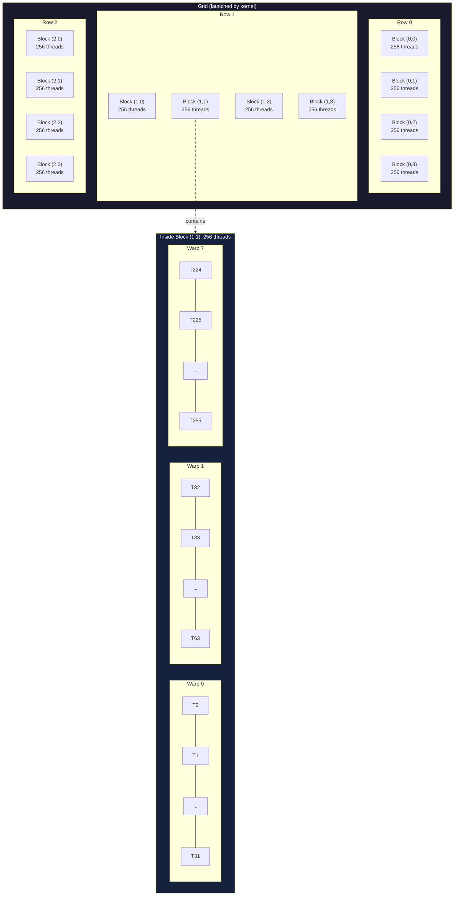
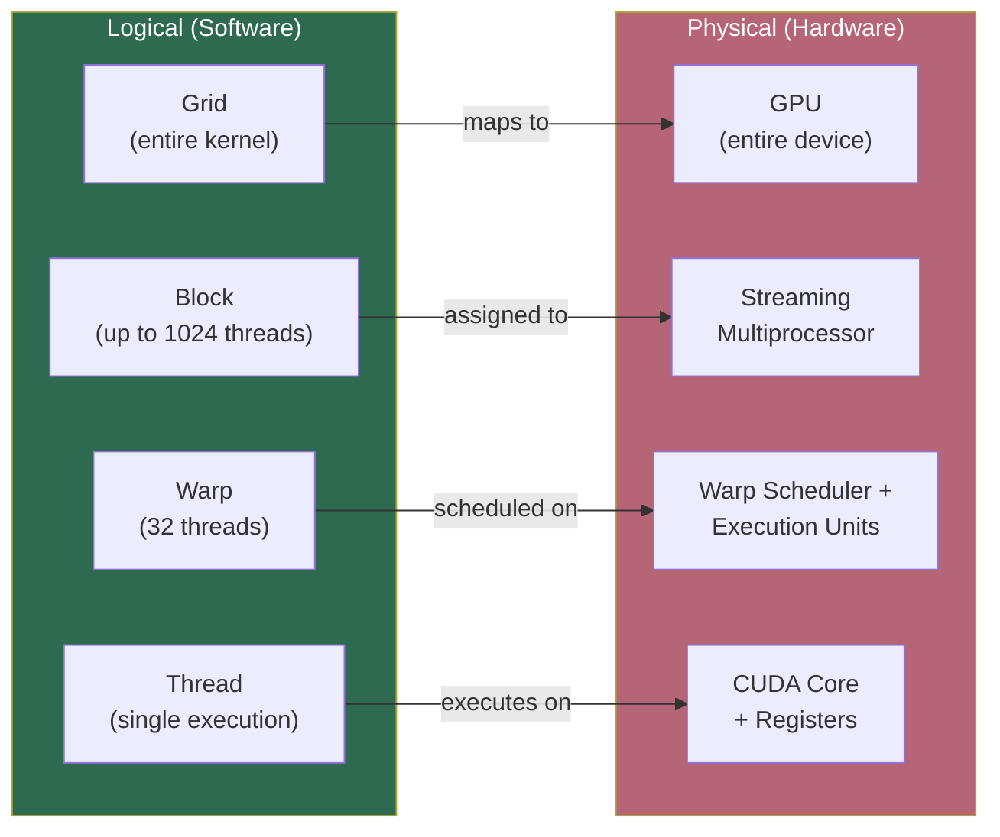

# Chapter 45: CUDA Programming Model

**Tags:** #cuda #programming-model #kernels #thread-hierarchy #grid #block #warp #gpu-computing

---

## 1. Theory: The Two-World Model

CUDA programs live in two worlds simultaneously: the **host** (CPU + system RAM) and the **device** (GPU + HBM). These worlds have separate memory spaces, separate instruction sets, and separate execution models. The CUDA programming model provides the abstractions to bridge them.

At its core, CUDA extends C++ with three key concepts:
1. **Kernel functions** — C++ functions that execute on the GPU
2. **Thread hierarchy** — a logical organization of millions of threads
3. **Memory spaces** — separate address spaces with explicit data movement

The programmer writes a single `.cu` source file containing both host (CPU) and device (GPU) code. The `nvcc` compiler splits them: host code goes to the system C++ compiler, device code is compiled to GPU machine code (PTX → SASS).

---

## 2. What, Why, How

### What Is the CUDA Programming Model?

CUDA (Compute Unified Device Architecture) is NVIDIA's parallel computing platform that lets you write C++ code that runs on the GPU. You express parallelism by writing a **kernel** — a function executed by thousands of threads simultaneously.

### Why This Model?

GPUs have thousands of cores but no sophisticated per-thread control logic. The programming model must:
- Express **massive parallelism** (millions of threads) naturally
- Map logical threads to physical hardware efficiently
- Handle two separate memory spaces transparently
- Scale from a laptop GPU (256 cores) to a datacenter GPU (16,896 cores) without code changes

### How Does It Work?

1. Allocate memory on GPU (`cudaMalloc`)
2. Copy data from CPU to GPU (`cudaMemcpy`)
3. Launch kernel with execution configuration (`<<<blocks, threads>>>`)
4. GPU creates thread hierarchy, schedules onto SMs
5. Kernel executes on GPU
6. Copy results back to CPU (`cudaMemcpy`)
7. Free GPU memory (`cudaFree`)

---

## 3. Host vs Device

```
┌─────────────────────────┐     PCIe / NVLink     ┌─────────────────────────┐
│        HOST (CPU)       │◄──────────────────────►│      DEVICE (GPU)       │
│                         │                        │                         │
│  System RAM (DDR5)      │                        │  HBM3 (80 GB)          │
│  - 256+ GB              │                        │  - 3.35 TB/s BW        │
│  - ~50 GB/s BW          │                        │                         │
│                         │                        │  Shared Memory          │
│  CPU Cores              │                        │  Registers              │
│  - Sequential logic     │                        │  L1/L2 Caches           │
│  - Control flow         │                        │                         │
│  - I/O, networking      │                        │  132 SMs × 128 cores    │
│  - Kernel launches      │                        │  = 16,896 CUDA cores    │
└─────────────────────────┘                        └─────────────────────────┘
```

**Key rule**: Host code cannot directly access device memory, and device code cannot directly access host memory (unless using Unified Memory — covered later).

---

## 4. Kernel Functions

CUDA introduces three function qualifiers:

| Qualifier | Called from | Executes on | Returns |
|-----------|-----------|------------|---------|
| `__global__` | Host (or device with Dynamic Parallelism) | Device | `void` only |
| `__device__` | Device | Device | Any type |
| `__host__` | Host | Host | Any type |

```cpp
// Kernel function — runs on GPU, launched from CPU
__global__ void vectorAdd(float* a, float* b, float* c, int n) {
    int i = blockIdx.x * blockDim.x + threadIdx.x;
    if (i < n) {
        c[i] = a[i] + b[i];
    }
}

// Device helper — called from other device/global functions only
__device__ float sigmoid(float x) {
    return 1.0f / (1.0f + expf(-x));
}

// Can combine: __host__ __device__ compiles for both CPU and GPU
__host__ __device__ float square(float x) {
    return x * x;
}
```

### Kernel Launch Syntax

```cpp
// <<<numBlocks, threadsPerBlock>>>
vectorAdd<<<256, 256>>>(d_a, d_b, d_c, n);

// With shared memory and stream
vectorAdd<<<grid, block, sharedMemBytes, stream>>>(d_a, d_b, d_c, n);
```

The `<<<>>>` syntax is CUDA-specific — it tells the GPU runtime how many threads to create and how to organize them.

---

## 5. Thread Hierarchy: Grid → Block → Thread

CUDA organizes threads in a **two-level hierarchy**:



### Built-in Variables

| Variable | Type | Description |
|----------|------|-------------|
| `threadIdx.x, .y, .z` | `uint3` | Thread index within a block |
| `blockIdx.x, .y, .z` | `uint3` | Block index within the grid |
| `blockDim.x, .y, .z` | `dim3` | Number of threads per block |
| `gridDim.x, .y, .z` | `dim3` | Number of blocks in the grid |
| `warpSize` | `int` | Warp size (always 32) |

### Thread Indexing Formulas

**1D Grid of 1D Blocks** (most common):
```cpp
int globalIdx = blockIdx.x * blockDim.x + threadIdx.x;
int totalThreads = gridDim.x * blockDim.x;
```

**2D Grid of 2D Blocks** (for matrices):
```cpp
int col = blockIdx.x * blockDim.x + threadIdx.x;
int row = blockIdx.y * blockDim.y + threadIdx.y;
int globalIdx = row * width + col;
```

**3D Grid of 3D Blocks** (for volumes):
```cpp
int x = blockIdx.x * blockDim.x + threadIdx.x;
int y = blockIdx.y * blockDim.y + threadIdx.y;
int z = blockIdx.z * blockDim.z + threadIdx.z;
int globalIdx = z * (width * height) + y * width + x;
```

---

## 6. Hardware Mapping

The thread hierarchy maps directly to GPU hardware:



### Critical Mapping Rules

1. **Grid → GPU**: The runtime distributes blocks across all available SMs
2. **Block → SM**: A block runs entirely on ONE SM (never split). Multiple blocks can share an SM.
3. **Warp → Scheduler**: Threads within a block are grouped into warps of 32. Warp schedulers pick eligible warps each cycle.
4. **Thread → Core**: Each thread gets its own registers and program counter

> **Block independence guarantee**: Blocks can execute in any order, on any SM, in parallel or sequentially. This is what makes CUDA programs scale automatically to any GPU size.

---

## 7. Execution Configuration Strategy

### Choosing Block Size

```cpp
// Rule of thumb: use multiples of 32 (warp size)
// Common choices: 128, 256, 512
// Maximum: 1024 threads per block

int threadsPerBlock = 256;  // Good default
int numBlocks = (n + threadsPerBlock - 1) / threadsPerBlock;  // Ceiling division
kernel<<<numBlocks, threadsPerBlock>>>(data, n);
```

**Why multiples of 32?** Threads execute in warps of 32. A block of 100 threads creates 4 warps: three full (32 threads each = 96) and one partial (4 threads). The 28 unused lanes in the partial warp are wasted.

**Why max 1024?** This is a hardware limit. Each SM has a finite number of execution slots.

### When to Use 2D/3D Blocks

| Data Shape | Block Dimensions | Use Case |
|-----------|-----------------|----------|
| 1D array | `(256, 1, 1)` | Vector operations, reductions |
| 2D matrix | `(16, 16, 1)` = 256 | Image processing, matrix ops |
| 3D volume | `(8, 8, 8)` = 512 | 3D convolutions, fluid simulation |

```cpp
// 2D block example for matrix operations
dim3 blockDim(16, 16);       // 256 threads per block
dim3 gridDim(
    (width + 15) / 16,       // Blocks in x dimension
    (height + 15) / 16       // Blocks in y dimension
);
matrixKernel<<<gridDim, blockDim>>>(d_matrix, width, height);
```

---

## 8. Complete "Hello CUDA" Example

```cuda
// File: hello_cuda.cu
// Compile: nvcc -o hello_cuda hello_cuda.cu
// Run: ./hello_cuda

#include <stdio.h>
#include <cuda_runtime.h>

#define CUDA_CHECK(call) do {                                   \
    cudaError_t err = call;                                     \
    if (err != cudaSuccess) {                                   \
        fprintf(stderr, "CUDA Error at %s:%d — %s\n",          \
                __FILE__, __LINE__, cudaGetErrorString(err));   \
        exit(EXIT_FAILURE);                                     \
    }                                                           \
} while(0)

// Step 1: Define a kernel function
__global__ void helloCUDA(int* output, int n) {
    // Each thread calculates its unique global index
    int tid = blockIdx.x * blockDim.x + threadIdx.x;

    if (tid < n) {
        // Each thread writes its index squared
        output[tid] = tid * tid;
    }
}

int main() {
    const int N = 1024;
    const int SIZE = N * sizeof(int);

    // Step 2: Allocate host memory
    int* h_output = (int*)malloc(SIZE);

    // Step 3: Allocate device memory
    int* d_output;
    CUDA_CHECK(cudaMalloc(&d_output, SIZE));

    // Step 4: Configure and launch kernel
    int threadsPerBlock = 256;
    int numBlocks = (N + threadsPerBlock - 1) / threadsPerBlock; // = 4

    printf("Launching kernel: %d blocks × %d threads = %d total threads\n",
           numBlocks, threadsPerBlock, numBlocks * threadsPerBlock);

    helloCUDA<<<numBlocks, threadsPerBlock>>>(d_output, N);

    // Step 5: Check for launch errors
    CUDA_CHECK(cudaGetLastError());

    // Step 6: Wait for kernel to finish
    CUDA_CHECK(cudaDeviceSynchronize());

    // Step 7: Copy results back to host
    CUDA_CHECK(cudaMemcpy(h_output, d_output, SIZE, cudaMemcpyDeviceToHost));

    // Step 8: Verify results
    int errors = 0;
    for (int i = 0; i < N; i++) {
        if (h_output[i] != i * i) {
            printf("ERROR at index %d: got %d, expected %d\n",
                   i, h_output[i], i * i);
            errors++;
        }
    }

    if (errors == 0) {
        printf("SUCCESS! All %d values correct.\n", N);
        printf("Sample: output[0]=%d, output[31]=%d, output[1023]=%d\n",
               h_output[0], h_output[31], h_output[1023]);
    }

    // Step 9: Cleanup
    CUDA_CHECK(cudaFree(d_output));
    free(h_output);

    return 0;
}
```

**Expected output:**
```
Launching kernel: 4 blocks × 256 threads = 1024 total threads
SUCCESS! All 1024 values correct.
Sample: output[0]=0, output[31]=961, output[1023]=1046529
```

---

## 9. Grid-Stride Loop Pattern

When the dataset is larger than the total thread count, use a **grid-stride loop** — the most important CUDA pattern:

```cuda
__global__ void gridStrideAdd(float* a, float* b, float* c, int n) {
    // Calculate global thread index
    int idx = blockIdx.x * blockDim.x + threadIdx.x;

    // Calculate total number of threads in the grid
    int stride = gridDim.x * blockDim.x;

    // Each thread processes multiple elements, striding by total thread count
    for (int i = idx; i < n; i += stride) {
        c[i] = a[i] + b[i];
    }
}

// Launch with fewer blocks than data elements
int threadsPerBlock = 256;
int numBlocks = min(4096, (n + threadsPerBlock - 1) / threadsPerBlock);
gridStrideAdd<<<numBlocks, threadsPerBlock>>>(d_a, d_b, d_c, n);
```

**Why grid-stride loops?**
- Works with any data size (even larger than max grid size)
- Enables choosing grid size for occupancy rather than data size
- Each thread processes multiple elements, amortizing launch overhead
- Memory access patterns remain coalesced

---

## 10. Dynamic Parallelism (Device-Side Launch)

Since Compute Capability 3.5, kernels can launch other kernels from the device:

```cuda
__global__ void parentKernel(float* data, int n) {
    if (threadIdx.x == 0) {
        // Launch a child kernel from the GPU
        childKernel<<<n/256, 256>>>(data, n);
        cudaDeviceSynchronize(); // Wait for child to complete
    }
}

__global__ void childKernel(float* data, int n) {
    int tid = blockIdx.x * blockDim.x + threadIdx.x;
    if (tid < n) {
        data[tid] = sqrtf(data[tid]);
    }
}
```

This is useful for irregular parallelism (e.g., adaptive mesh refinement, recursive algorithms, graph traversal) where the parent kernel discovers work dynamically.

---

## 11. Unified Memory (Managed Memory)

Unified Memory simplifies programming by creating a single address space accessible from both CPU and GPU:

```cuda
float* data;
// Allocate managed memory — accessible from both host and device
cudaMallocManaged(&data, N * sizeof(float));

// Initialize on CPU — no cudaMemcpy needed
for (int i = 0; i < N; i++) data[i] = i;

// Launch kernel — GPU accesses same pointer
kernel<<<blocks, threads>>>(data, N);
cudaDeviceSynchronize();

// Read results on CPU — no cudaMemcpy needed
printf("Result: %f\n", data[0]);

cudaFree(data);
```

> **Warning**: Unified Memory adds page-fault overhead. For production code, explicit `cudaMalloc` + `cudaMemcpy` gives better performance. Unified Memory is excellent for prototyping and algorithms where CPU/GPU access patterns are complex.

---

## 12. Compilation with nvcc

```bash
# Basic compilation
nvcc -o program program.cu

# Specify compute capability (generate code for specific GPU)
nvcc -arch=sm_80 -o program program.cu    # A100
nvcc -arch=sm_90 -o program program.cu    # H100

# Generate PTX for forward compatibility + SASS for specific arch
nvcc -gencode arch=compute_80,code=sm_80 \
     -gencode arch=compute_90,code=sm_90 \
     -gencode arch=compute_90,code=compute_90 \
     -o program program.cu

# Debug build
nvcc -g -G -o program_debug program.cu

# Optimization flags
nvcc -O3 -use_fast_math --maxrregcount=64 -o program_opt program.cu

# Show register/shared memory usage
nvcc --ptxas-options=-v -o program program.cu

# Separate compilation (for multi-file CUDA projects)
nvcc -dc file1.cu -o file1.o
nvcc -dc file2.cu -o file2.o
nvcc file1.o file2.o -o program
```

---

## 13. Exercises

### 🟢 Beginner
1. **Thread Index Calculation**: Write a kernel where each thread prints its `threadIdx.x`, `blockIdx.x`, and computed global index. Launch with 2 blocks of 4 threads.
2. **Fill Array**: Write a kernel that fills an array with the value `42.0f`. Verify by copying back to host and checking all elements.
3. **Ceiling Division**: Write a host function that correctly calculates the number of blocks needed for any `n` and `threadsPerBlock`, handling the case where `n` is not a multiple.

### 🟡 Intermediate
4. **2D Thread Index**: Write a kernel that sets `matrix[row][col] = row * width + col` using 2D block/grid organization. Verify the result.
5. **Grid-Stride Pattern**: Implement a grid-stride kernel that computes `y[i] = sin(x[i]) * cos(x[i])` for 10 million elements. Choose an appropriate block/grid size.
6. **Kernel Timing**: Time the kernel from Exercise 5 using `cudaEvent_t` and compare CPU vs GPU execution time.

### 🔴 Advanced
7. **Dynamic Grid Size**: Write a program that experimentally finds the optimal number of blocks for a simple element-wise kernel by testing 1 to 1024 blocks and measuring throughput.
8. **Multi-Kernel Pipeline**: Launch three kernels in sequence on the same data: (1) initialize, (2) transform, (3) reduce. Use proper synchronization.

---

## 14. Solutions

### Solution 1 (Thread Index)
```cuda
__global__ void printIndices() {
    int global = blockIdx.x * blockDim.x + threadIdx.x;
    printf("Block %d, Thread %d → Global %d\n",
           blockIdx.x, threadIdx.x, global);
}

int main() {
    printIndices<<<2, 4>>>();
    cudaDeviceSynchronize();
    return 0;
}
// Output (order may vary):
// Block 0, Thread 0 → Global 0
// Block 0, Thread 1 → Global 1
// ...
// Block 1, Thread 3 → Global 7
```

### Solution 3 (Ceiling Division)
```cpp
int ceilDiv(int n, int d) {
    return (n + d - 1) / d;
}
// Example: ceilDiv(1000, 256) = 3 (not 3.90625)
// 3 blocks × 256 = 768 threads, but kernel guards with if (idx < n)
// So 4 blocks needed: ceilDiv(1000, 256) = 4. Wait, let's check:
// (1000 + 255) / 256 = 1255 / 256 = 4. Correct!
```

### Solution 6 (Kernel Timing)
```cuda
cudaEvent_t start, stop;
cudaEventCreate(&start);
cudaEventCreate(&stop);

cudaEventRecord(start);
kernel<<<blocks, threads>>>(d_x, d_y, N);
cudaEventRecord(stop);
cudaEventSynchronize(stop);

float ms = 0;
cudaEventElapsedTime(&ms, start, stop);
printf("GPU kernel time: %.3f ms\n", ms);

cudaEventDestroy(start);
cudaEventDestroy(stop);
```

---

## 15. Quiz

**Q1**: What does `__global__` mean in CUDA?  
**A**: A function that is called from the host (CPU) but executes on the device (GPU). It must return `void`.

**Q2**: What is the maximum number of threads per block?  
**A**: 1024 threads per block (hardware limit since Kepler).

**Q3**: What does `blockIdx.x * blockDim.x + threadIdx.x` compute?  
**A**: The unique global thread index within a 1D grid — the most common thread identification pattern.

**Q4**: Why should block size be a multiple of 32?  
**A**: Because threads execute in warps of 32. Non-multiples waste execution slots in the last partial warp of each block.

**Q5**: What is the difference between `cudaDeviceSynchronize()` and `cudaGetLastError()`?  
**A**: `cudaDeviceSynchronize()` blocks the CPU until all GPU work completes. `cudaGetLastError()` returns the error code from the most recent CUDA call (including kernel launches), which are asynchronous.

**Q6**: What is a grid-stride loop and when should you use it?  
**A**: A loop where each thread processes elements at index `idx`, `idx + stride`, `idx + 2*stride`, etc., where stride = total thread count. Use it when data size exceeds or could exceed the grid size, or when you want to decouple grid size from data size.

**Q7**: What happens if you launch a kernel without checking for errors?  
**A**: Errors are silently ignored. The kernel may produce incorrect results or corrupt memory. Always use `CUDA_CHECK` macros or check `cudaGetLastError()`.

**Q8**: Can a `__device__` function be called from host code?  
**A**: No. `__device__` functions can only be called from other `__device__` or `__global__` functions. To call from both, use `__host__ __device__`.

---

## 16. Key Takeaways

- CUDA programs run on two processors: **host (CPU)** and **device (GPU)** with separate memory
- **`__global__`** kernels are launched from CPU, run on GPU, creating millions of threads
- Thread hierarchy: **Grid → Block → Warp → Thread**, mapping to GPU → SM → Scheduler → Core
- Thread index = `blockIdx.x * blockDim.x + threadIdx.x` is the fundamental formula
- Block size should be a **multiple of 32** (warp size), with 128–256 as good defaults
- **Grid-stride loops** decouple grid size from data size — use them by default
- Always check errors with `cudaGetLastError()` and `cudaDeviceSynchronize()`

---

## 17. Chapter Summary

This chapter introduced the CUDA programming model — the bridge between your C++ code and the GPU hardware. We covered the host/device split, kernel function qualifiers (`__global__`, `__device__`, `__host__`), and the thread hierarchy (Grid → Block → Warp → Thread). We learned how to calculate global thread indices in 1D, 2D, and 3D, how to choose block sizes (multiples of 32, capped at 1024), and how logical threads map to physical hardware. The complete "Hello CUDA" example demonstrated the full workflow: allocate → transfer → launch → synchronize → copy back → verify. We also covered the grid-stride loop pattern, dynamic parallelism, Unified Memory, and nvcc compilation options.

---

## 18. Real-World Insight: Scaling from Laptop to Datacenter

The CUDA programming model's block independence guarantee is what makes GPU programs portable. A kernel with 10,000 blocks runs on a laptop GTX 1650 (14 SMs — blocks scheduled sequentially over multiple waves) and an H100 (132 SMs — blocks scheduled more in parallel) **with the same code**. Performance scales automatically because the runtime distributes blocks across however many SMs are available.

In ML frameworks like PyTorch, every `torch.matmul()` call launches a CUDA kernel. The block/grid configuration is auto-tuned — you rarely configure it manually. But understanding the model helps you write custom kernels (fused operations, custom attention mechanisms) that outperform generic library calls.

---

## 19. Common Mistakes

| Mistake | Why It's Wrong | Correct Approach |
|---------|---------------|-----------------|
| Forgetting boundary check `if (idx < n)` | Threads beyond data size write to invalid memory | Always guard with bounds check |
| Using block size that's not a multiple of 32 | Wastes execution slots in partial warps | Use 128, 256, or 512 |
| Not calling `cudaDeviceSynchronize()` before reading results | Kernel may still be running when CPU reads | Synchronize before any host access |
| Missing error checks | Silent failures lead to hours of debugging | Use `CUDA_CHECK` macro on every API call |
| Launching too few blocks | Under-utilizes GPU SMs | Launch at least `num_SMs * 2` blocks |
| Forgetting `cudaFree` | GPU memory leak across kernel launches | Always free in cleanup or use RAII wrappers |

---

## 20. Interview Questions

**Q1: Walk through the lifecycle of a CUDA kernel launch.**

**A**: (1) CPU code calls `kernel<<<grid, block>>>(args)`. (2) The CUDA runtime packages the grid/block config and kernel arguments into a launch descriptor. (3) The GPU's Gigathread Engine receives the launch and creates thread blocks. (4) Thread blocks are distributed to SMs with available resources (registers, shared memory, thread slots). (5) Each SM partitions threads into warps of 32. (6) Warp schedulers select eligible warps and issue instructions each cycle. (7) When all threads in all blocks complete, the kernel is finished. (8) The CPU detects completion via `cudaDeviceSynchronize()` or event queries.

**Q2: Why can't blocks within a grid synchronize with each other?**

**A**: Block independence is a fundamental design choice. Blocks execute in any order and may run on different SMs. If blocks could synchronize, a deadlock would occur when Block B waits for Block A, but Block A hasn't been scheduled yet (because the GPU doesn't have enough SMs for all blocks simultaneously). This independence also enables automatic scaling — the runtime can execute blocks in any order on any number of SMs.

**Q3: Explain the difference between `__global__` and `__device__` functions.**

**A**: `__global__` functions (kernels) are the entry points — called from host code using `<<<>>>` syntax, they run on the GPU and must return `void`. They define the thread grid structure. `__device__` functions are helper functions that run on the GPU but can only be called from other `__device__` or `__global__` functions — they cannot be called from the CPU. `__device__` functions can return any type, support recursion (with stack limits), and are typically inlined by the compiler for performance.

**Q4: What happens when you launch more threads than there are CUDA cores?**

**A**: This is normal and expected. A GPU with 16,896 CUDA cores routinely runs millions of threads. The hardware manages this through warp scheduling: each SM can hold dozens of warps resident simultaneously (limited by registers and shared memory). When one warp stalls on memory, another warp executes instantly (zero-overhead context switch because all warps' register state is always resident). This is how GPUs hide memory latency — they need far more threads than cores.

**Q5: How do you choose the optimal number of threads per block?**

**A**: Start with 256 (a good default). Factors to consider: (1) Must be a multiple of 32 (warp size). (2) Max is 1024. (3) Larger blocks share more shared memory per block — useful if your kernel uses shared memory. (4) Smaller blocks may allow more blocks per SM, increasing occupancy. (5) Register usage per thread limits blocks per SM — use `--ptxas-options=-v` to check. (6) Profile with different sizes (128, 256, 512) and pick the fastest. The CUDA Occupancy Calculator API (`cudaOccupancyMaxPotentialBlockSize`) can auto-select.
