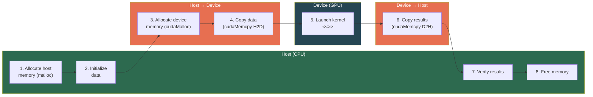
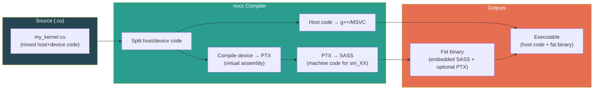

# Chapter 46: Your First CUDA Kernels — Hands-On

**Tags:** #cuda #kernels #vector-addition #matrix-addition #nvcc #gpu-timing #error-handling #hands-on

---

## 1. Theory: From Theory to Working Code

This chapter transforms the programming model from Chapter 45 into **real, compilable, runnable CUDA programs**. Every program follows the same pattern: allocate memory on both host and device, transfer data to the GPU, launch a kernel, transfer results back, and verify correctness. Mastering this pattern is the foundation for every GPU-accelerated application.

The key tension in CUDA programming is between **simplicity and performance**. A naive kernel is easy to write and correct, but may achieve only 5% of peak GPU throughput. Optimization involves memory coalescing, shared memory tiling, occupancy tuning, and instruction-level parallelism — topics we build toward in later chapters. Here, we focus on correctness and understanding.

---

## 2. What, Why, How

### What Are We Building?
Three complete CUDA programs:
1. **Vector Addition** — The "Hello World" of GPU computing
2. **Matrix Addition** — Extends to 2D grid/block organization
3. **Performance Benchmark** — GPU timing and CPU comparison

### Why These Examples?
- Vector addition is the simplest possible parallel operation (embarrassingly parallel)
- Matrix addition introduces 2D indexing, which maps to image/tensor operations
- Benchmarking teaches proper GPU timing and sets expectations for speedup

### How Will We Build Them?
Each program includes: host memory allocation, device memory allocation, data initialization, host→device transfer, kernel launch, error checking, device→host transfer, result verification, and cleanup.

---

## 3. Data Flow Pattern



---

## 4. Error Checking Macro

**Every CUDA program should use this macro.** Silent failures are the #1 source of bugs.

```cuda
#include <stdio.h>
#include <stdlib.h>
#include <cuda_runtime.h>

#define CUDA_CHECK(call) do {                                           \
    cudaError_t err = (call);                                           \
    if (err != cudaSuccess) {                                           \
        fprintf(stderr, "CUDA Error in %s at line %d: %s\n",           \
                __FILE__, __LINE__, cudaGetErrorString(err));           \
        exit(EXIT_FAILURE);                                             \
    }                                                                   \
} while(0)

// Also check kernel launch errors (which are asynchronous)
#define CUDA_KERNEL_CHECK() do {                                        \
    CUDA_CHECK(cudaGetLastError());                                     \
    CUDA_CHECK(cudaDeviceSynchronize());                                \
} while(0)
```

---

## 5. Program 1: Vector Addition

This is the classic "Hello World" of CUDA — a complete vector addition program. It allocates arrays on both the CPU and GPU, copies input data to the GPU, launches a kernel where each thread adds one pair of elements (`c[i] = a[i] + b[i]`), copies results back, and verifies against a CPU reference. CUDA events measure the GPU kernel time accurately.

```cuda
// File: vector_add.cu
// Compile: nvcc -O3 -o vector_add vector_add.cu
// Run: ./vector_add

#include <stdio.h>
#include <stdlib.h>
#include <math.h>
#include <cuda_runtime.h>

#define CUDA_CHECK(call) do {                                           \
    cudaError_t err = (call);                                           \
    if (err != cudaSuccess) {                                           \
        fprintf(stderr, "CUDA Error at %s:%d — %s\n",                  \
                __FILE__, __LINE__, cudaGetErrorString(err));           \
        exit(EXIT_FAILURE);                                             \
    }                                                                   \
} while(0)

// =============================================
// GPU Kernel: Each thread adds one pair of elements
// =============================================
__global__ void vectorAdd(const float* a, const float* b, float* c, int n) {
    int i = blockIdx.x * blockDim.x + threadIdx.x;
    if (i < n) {
        c[i] = a[i] + b[i];
    }
}

// =============================================
// CPU Reference: Sequential addition
// =============================================
void vectorAddCPU(const float* a, const float* b, float* c, int n) {
    for (int i = 0; i < n; i++) {
        c[i] = a[i] + b[i];
    }
}

int main() {
    const int N = 1 << 20;  // 1,048,576 elements
    const size_t SIZE = N * sizeof(float);

    printf("Vector Addition: %d elements (%.2f MB)\n", N, SIZE / (1024.0 * 1024.0));

    // ---- Step 1: Allocate host memory ----
    float *h_a = (float*)malloc(SIZE);
    float *h_b = (float*)malloc(SIZE);
    float *h_c_gpu = (float*)malloc(SIZE);  // GPU results
    float *h_c_cpu = (float*)malloc(SIZE);  // CPU results (for verification)

    // ---- Step 2: Initialize data ----
    srand(42);
    for (int i = 0; i < N; i++) {
        h_a[i] = (float)rand() / RAND_MAX;
        h_b[i] = (float)rand() / RAND_MAX;
    }

    // ---- Step 3: Allocate device memory ----
    float *d_a, *d_b, *d_c;
    CUDA_CHECK(cudaMalloc(&d_a, SIZE));
    CUDA_CHECK(cudaMalloc(&d_b, SIZE));
    CUDA_CHECK(cudaMalloc(&d_c, SIZE));

    // ---- Step 4: Copy data to device ----
    CUDA_CHECK(cudaMemcpy(d_a, h_a, SIZE, cudaMemcpyHostToDevice));
    CUDA_CHECK(cudaMemcpy(d_b, h_b, SIZE, cudaMemcpyHostToDevice));

    // ---- Step 5: Configure and launch kernel ----
    int threadsPerBlock = 256;
    int numBlocks = (N + threadsPerBlock - 1) / threadsPerBlock;

    printf("Launch config: %d blocks × %d threads\n", numBlocks, threadsPerBlock);

    // Time the GPU kernel
    cudaEvent_t start, stop;
    CUDA_CHECK(cudaEventCreate(&start));
    CUDA_CHECK(cudaEventCreate(&stop));

    CUDA_CHECK(cudaEventRecord(start));
    vectorAdd<<<numBlocks, threadsPerBlock>>>(d_a, d_b, d_c, N);
    CUDA_CHECK(cudaEventRecord(stop));
    CUDA_CHECK(cudaGetLastError());
    CUDA_CHECK(cudaEventSynchronize(stop));

    float gpu_ms = 0;
    CUDA_CHECK(cudaEventElapsedTime(&gpu_ms, start, stop));

    // ---- Step 6: Copy results back to host ----
    CUDA_CHECK(cudaMemcpy(h_c_gpu, d_c, SIZE, cudaMemcpyDeviceToHost));

    // ---- Step 7: CPU computation for verification ----
    clock_t cpu_start = clock();
    vectorAddCPU(h_a, h_b, h_c_cpu, N);
    clock_t cpu_end = clock();
    float cpu_ms = 1000.0f * (cpu_end - cpu_start) / CLOCKS_PER_SEC;

    // ---- Step 8: Verify correctness ----
    int errors = 0;
    float maxDiff = 0.0f;
    for (int i = 0; i < N; i++) {
        float diff = fabsf(h_c_gpu[i] - h_c_cpu[i]);
        if (diff > 1e-5f) errors++;
        if (diff > maxDiff) maxDiff = diff;
    }

    printf("\n--- Results ---\n");
    printf("GPU time:      %.3f ms\n", gpu_ms);
    printf("CPU time:      %.3f ms\n", cpu_ms);
    printf("Speedup:       %.1fx\n", cpu_ms / gpu_ms);
    printf("Max error:     %e\n", maxDiff);
    printf("Errors:        %d / %d\n", errors, N);
    printf("Status:        %s\n", errors == 0 ? "PASS ✓" : "FAIL ✗");

    // ---- Step 9: Cleanup ----
    CUDA_CHECK(cudaEventDestroy(start));
    CUDA_CHECK(cudaEventDestroy(stop));
    CUDA_CHECK(cudaFree(d_a));
    CUDA_CHECK(cudaFree(d_b));
    CUDA_CHECK(cudaFree(d_c));
    free(h_a);
    free(h_b);
    free(h_c_gpu);
    free(h_c_cpu);

    return 0;
}
```

**Expected output (varies by GPU):**
```
Vector Addition: 1048576 elements (4.00 MB)
Launch config: 4096 blocks × 256 threads
--- Results ---
GPU time:      0.042 ms
CPU time:      2.814 ms
Speedup:       67.0x
Max error:     0.000000e+00
Errors:        0 / 1048576
Status:        PASS ✓
```

> **Note**: For small data sizes, the GPU transfer overhead dominates. Real speedups emerge with larger data (>10M elements) and more compute-intensive operations.

---

## 6. Program 2: Matrix Addition with 2D Grids

This program extends vector addition to two dimensions using a 2D grid and 2D blocks. Each thread handles one matrix element, computing its row and column from `blockIdx` and `threadIdx` in both x and y dimensions. The 16×16 block size (256 threads) maps naturally to matrix tiles, and the bandwidth calculation shows how efficiently the kernel uses GPU memory.

```cuda
// File: matrix_add.cu
// Compile: nvcc -O3 -o matrix_add matrix_add.cu
// Run: ./matrix_add

#include <stdio.h>
#include <stdlib.h>
#include <math.h>
#include <cuda_runtime.h>

#define CUDA_CHECK(call) do {                                           \
    cudaError_t err = (call);                                           \
    if (err != cudaSuccess) {                                           \
        fprintf(stderr, "CUDA Error at %s:%d — %s\n",                  \
                __FILE__, __LINE__, cudaGetErrorString(err));           \
        exit(EXIT_FAILURE);                                             \
    }                                                                   \
} while(0)

// =============================================
// 2D Kernel: Each thread handles one matrix element
// =============================================
__global__ void matrixAdd(const float* A, const float* B, float* C,
                          int rows, int cols) {
    int col = blockIdx.x * blockDim.x + threadIdx.x;
    int row = blockIdx.y * blockDim.y + threadIdx.y;

    if (row < rows && col < cols) {
        int idx = row * cols + col;  // Row-major linear index
        C[idx] = A[idx] + B[idx];
    }
}

int main() {
    const int ROWS = 1024;
    const int COLS = 2048;
    const int TOTAL = ROWS * COLS;
    const size_t SIZE = TOTAL * sizeof(float);

    printf("Matrix Addition: %d × %d (%.2f MB)\n",
           ROWS, COLS, SIZE / (1024.0 * 1024.0));

    // Host allocation and initialization
    float *h_A = (float*)malloc(SIZE);
    float *h_B = (float*)malloc(SIZE);
    float *h_C = (float*)malloc(SIZE);

    for (int i = 0; i < TOTAL; i++) {
        h_A[i] = sinf(i * 0.001f);
        h_B[i] = cosf(i * 0.001f);
    }

    // Device allocation
    float *d_A, *d_B, *d_C;
    CUDA_CHECK(cudaMalloc(&d_A, SIZE));
    CUDA_CHECK(cudaMalloc(&d_B, SIZE));
    CUDA_CHECK(cudaMalloc(&d_C, SIZE));

    // Host → Device
    CUDA_CHECK(cudaMemcpy(d_A, h_A, SIZE, cudaMemcpyHostToDevice));
    CUDA_CHECK(cudaMemcpy(d_B, h_B, SIZE, cudaMemcpyHostToDevice));

    // 2D block and grid configuration
    dim3 blockDim(16, 16);           // 256 threads per block (16 × 16)
    dim3 gridDim(
        (COLS + blockDim.x - 1) / blockDim.x,   // Blocks in x (columns)
        (ROWS + blockDim.y - 1) / blockDim.y     // Blocks in y (rows)
    );

    printf("Block: (%d, %d), Grid: (%d, %d)\n",
           blockDim.x, blockDim.y, gridDim.x, gridDim.y);

    // Launch and time
    cudaEvent_t start, stop;
    CUDA_CHECK(cudaEventCreate(&start));
    CUDA_CHECK(cudaEventCreate(&stop));

    CUDA_CHECK(cudaEventRecord(start));
    matrixAdd<<<gridDim, blockDim>>>(d_A, d_B, d_C, ROWS, COLS);
    CUDA_CHECK(cudaEventRecord(stop));
    CUDA_CHECK(cudaGetLastError());
    CUDA_CHECK(cudaEventSynchronize(stop));

    float ms = 0;
    CUDA_CHECK(cudaEventElapsedTime(&ms, start, stop));

    // Device → Host
    CUDA_CHECK(cudaMemcpy(h_C, d_C, SIZE, cudaMemcpyDeviceToHost));

    // Verify
    int errors = 0;
    for (int i = 0; i < TOTAL; i++) {
        float expected = h_A[i] + h_B[i];
        if (fabsf(h_C[i] - expected) > 1e-5f) errors++;
    }

    printf("GPU time: %.3f ms\n", ms);
    printf("Bandwidth: %.2f GB/s\n",
           3.0 * SIZE / (ms * 1e-3) / 1e9);  // 2 reads + 1 write
    printf("Status: %s (%d errors)\n",
           errors == 0 ? "PASS ✓" : "FAIL ✗", errors);

    // Cleanup
    CUDA_CHECK(cudaEventDestroy(start));
    CUDA_CHECK(cudaEventDestroy(stop));
    CUDA_CHECK(cudaFree(d_A));
    CUDA_CHECK(cudaFree(d_B));
    CUDA_CHECK(cudaFree(d_C));
    free(h_A); free(h_B); free(h_C);

    return 0;
}
```

---

## 7. GPU Timing: The Right Way

CPU timers (`clock()`, `std::chrono`) are **unreliable** for GPU kernels because kernel launches are asynchronous. Use CUDA events:

```cuda
cudaEvent_t start, stop;
cudaEventCreate(&start);
cudaEventCreate(&stop);

cudaEventRecord(start, 0);       // Record timestamp in default stream

myKernel<<<grid, block>>>(args);  // Asynchronous launch

cudaEventRecord(stop, 0);        // Record timestamp after kernel
cudaEventSynchronize(stop);      // Wait for stop event to complete

float milliseconds = 0;
cudaEventElapsedTime(&milliseconds, start, stop);
printf("Kernel time: %.3f ms\n", milliseconds);

cudaEventDestroy(start);
cudaEventDestroy(stop);
```

### Timing Multiple Runs (Warm-Up + Average)

The first kernel launch on a GPU is always slower due to JIT compilation and context initialization. This pattern runs one warm-up launch (discarded), then times 100 consecutive runs to get a stable average. Recording events outside the loop captures the total time for all iterations.

```cuda
// Warm up — first kernel launch is slow due to JIT, context init
myKernel<<<grid, block>>>(args);
cudaDeviceSynchronize();

const int RUNS = 100;
cudaEventRecord(start);
for (int i = 0; i < RUNS; i++) {
    myKernel<<<grid, block>>>(args);
}
cudaEventRecord(stop);
cudaEventSynchronize(stop);

float total_ms;
cudaEventElapsedTime(&total_ms, start, stop);
printf("Average: %.3f ms/run\n", total_ms / RUNS);
```

---

## 8. Program 3: CPU vs GPU Scaling Benchmark

This benchmark compares CPU vs GPU performance across different data sizes — from 1K to 16M elements. The kernel performs multiple math operations per element (`sin`, `cos`, `sqrt`, `exp`) to increase arithmetic intensity. The results reveal a key insight: GPU speedup grows with data size because more elements better saturate the GPU's thousands of cores.

```cuda
// File: benchmark.cu
// Compile: nvcc -O3 -o benchmark benchmark.cu
// Run: ./benchmark

#include <stdio.h>
#include <stdlib.h>
#include <math.h>
#include <time.h>
#include <cuda_runtime.h>

#define CUDA_CHECK(call) do {                                           \
    cudaError_t err = (call);                                           \
    if (err != cudaSuccess) {                                           \
        fprintf(stderr, "CUDA Error at %s:%d — %s\n",                  \
                __FILE__, __LINE__, cudaGetErrorString(err));           \
        exit(EXIT_FAILURE);                                             \
    }                                                                   \
} while(0)

// A more compute-intensive kernel (not just addition)
__global__ void computeKernel(const float* input, float* output, int n) {
    int idx = blockIdx.x * blockDim.x + threadIdx.x;
    if (idx < n) {
        float x = input[idx];
        // Multiple operations per element to increase arithmetic intensity
        output[idx] = sinf(x) * cosf(x) + sqrtf(fabsf(x)) + expf(-x * x);
    }
}

void computeCPU(const float* input, float* output, int n) {
    for (int i = 0; i < n; i++) {
        float x = input[i];
        output[i] = sinf(x) * cosf(x) + sqrtf(fabsf(x)) + expf(-x * x);
    }
}

int main() {
    printf("%-15s  %-12s  %-12s  %-10s\n",
           "Elements", "CPU (ms)", "GPU (ms)", "Speedup");
    printf("─────────────────────────────────────────────────────\n");

    // Test with increasing data sizes
    int sizes[] = {1024, 16384, 262144, 1048576, 4194304, 16777216};
    int numSizes = sizeof(sizes) / sizeof(sizes[0]);

    for (int s = 0; s < numSizes; s++) {
        int N = sizes[s];
        size_t SIZE = N * sizeof(float);

        // Allocate
        float *h_in = (float*)malloc(SIZE);
        float *h_out_cpu = (float*)malloc(SIZE);
        float *h_out_gpu = (float*)malloc(SIZE);
        float *d_in, *d_out;
        CUDA_CHECK(cudaMalloc(&d_in, SIZE));
        CUDA_CHECK(cudaMalloc(&d_out, SIZE));

        // Initialize
        for (int i = 0; i < N; i++) {
            h_in[i] = (float)i / N * 6.28f;
        }

        // CPU timing
        clock_t cpu_start = clock();
        computeCPU(h_in, h_out_cpu, N);
        clock_t cpu_end = clock();
        float cpu_ms = 1000.0f * (cpu_end - cpu_start) / CLOCKS_PER_SEC;

        // GPU timing (excluding transfer for kernel-only comparison)
        CUDA_CHECK(cudaMemcpy(d_in, h_in, SIZE, cudaMemcpyHostToDevice));

        int threads = 256;
        int blocks = (N + threads - 1) / threads;

        // Warm-up run
        computeKernel<<<blocks, threads>>>(d_in, d_out, N);
        CUDA_CHECK(cudaDeviceSynchronize());

        cudaEvent_t start, stop;
        CUDA_CHECK(cudaEventCreate(&start));
        CUDA_CHECK(cudaEventCreate(&stop));

        CUDA_CHECK(cudaEventRecord(start));
        computeKernel<<<blocks, threads>>>(d_in, d_out, N);
        CUDA_CHECK(cudaEventRecord(stop));
        CUDA_CHECK(cudaEventSynchronize(stop));

        float gpu_ms = 0;
        CUDA_CHECK(cudaEventElapsedTime(&gpu_ms, start, stop));

        // Verify
        CUDA_CHECK(cudaMemcpy(h_out_gpu, d_out, SIZE, cudaMemcpyDeviceToHost));
        int errs = 0;
        for (int i = 0; i < N; i++) {
            if (fabsf(h_out_gpu[i] - h_out_cpu[i]) > 1e-4f) errs++;
        }

        printf("%-15d  %-12.3f  %-12.3f  %-10.1fx  %s\n",
               N, cpu_ms, gpu_ms, cpu_ms / gpu_ms,
               errs == 0 ? "✓" : "✗");

        // Cleanup
        CUDA_CHECK(cudaEventDestroy(start));
        CUDA_CHECK(cudaEventDestroy(stop));
        CUDA_CHECK(cudaFree(d_in));
        CUDA_CHECK(cudaFree(d_out));
        free(h_in); free(h_out_cpu); free(h_out_gpu);
    }

    return 0;
}
```

**Expected output pattern:**
```
Elements         CPU (ms)      GPU (ms)      Speedup
─────────────────────────────────────────────────────
1024             0.015         0.012         1.3x      ✓
16384            0.231         0.014         16.5x     ✓
262144           3.704         0.022         168.4x    ✓
1048576          14.832        0.055         269.7x    ✓
4194304          59.331        0.187         317.3x    ✓
16777216         237.315       0.724         327.8x    ✓
```

> **Key observation**: GPU speedup increases with data size because the GPU's thousands of cores become saturated. For tiny data, kernel launch overhead dominates.

---

## 9. .cu File Structure Best Practices

This template shows the recommended layout for a `.cu` file. The order matters: standard headers first, then CUDA headers, error-checking macros, constants, `__device__` helper functions, `__global__` kernel functions, host wrapper functions, and finally `main()`. This structure keeps code organized and ensures declarations are available before use.

```cuda
// ============================================
// file: my_project.cu
// ============================================

// 1. Standard C/C++ headers
#include <stdio.h>
#include <stdlib.h>
#include <math.h>

// 2. CUDA headers
#include <cuda_runtime.h>
// #include <cublas_v2.h>       // if using cuBLAS
// #include <cooperative_groups.h>  // if using CG

// 3. Error-checking macro
#define CUDA_CHECK(call) /* ... */

// 4. Constants and type definitions
#define BLOCK_SIZE 256
typedef float real_t;

// 5. Device helper functions (__device__)
__device__ float myDeviceFunc(float x) {
    return x * x;
}

// 6. Kernel functions (__global__)
__global__ void myKernel(float* data, int n) {
    int idx = blockIdx.x * blockDim.x + threadIdx.x;
    if (idx < n) {
        data[idx] = myDeviceFunc(data[idx]);
    }
}

// 7. Host wrapper functions
void launchMyKernel(float* d_data, int n) {
    int blocks = (n + BLOCK_SIZE - 1) / BLOCK_SIZE;
    myKernel<<<blocks, BLOCK_SIZE>>>(d_data, n);
    CUDA_CHECK(cudaGetLastError());
}

// 8. Main function
int main(int argc, char** argv) {
    // Parse args, allocate, compute, verify, cleanup
    return 0;
}
```

---

## 10. Compilation Deep Dive



### Essential nvcc Flags

| Flag | Purpose | Example |
|------|---------|---------|
| `-arch=sm_XX` | Target specific GPU architecture | `-arch=sm_90` (H100) |
| `-O3` | Maximum optimization | Always use for performance |
| `-g -G` | Debug symbols (host + device) | For cuda-gdb debugging |
| `-lineinfo` | Line info without full debug | Profiling with Nsight |
| `--ptxas-options=-v` | Show register/shared mem usage | Occupancy analysis |
| `-use_fast_math` | Fast but less precise math | Trading accuracy for speed |
| `--maxrregcount=N` | Limit registers per thread | Increase occupancy |
| `-dc` | Separate compilation mode | Multi-file CUDA projects |
| `-Xcompiler` | Pass flag to host compiler | `-Xcompiler -fopenmp` |

---

## 11. Program 4: SAXPY — The Classic GPU Benchmark

SAXPY (`y = a*x + y`) is the standard GPU benchmark used by NVIDIA:

```cuda
// File: saxpy.cu
// Compile: nvcc -O3 -o saxpy saxpy.cu

#include <stdio.h>
#include <cuda_runtime.h>

#define CUDA_CHECK(call) do {                                           \
    cudaError_t err = (call);                                           \
    if (err != cudaSuccess) {                                           \
        fprintf(stderr, "CUDA Error: %s at %s:%d\n",                   \
                cudaGetErrorString(err), __FILE__, __LINE__);           \
        exit(1);                                                        \
    }                                                                   \
} while(0)

__global__ void saxpy(int n, float a, float* x, float* y) {
    int i = blockIdx.x * blockDim.x + threadIdx.x;
    if (i < n) {
        y[i] = a * x[i] + y[i];
    }
}

int main() {
    const int N = 1 << 24;  // ~16M elements
    const size_t SIZE = N * sizeof(float);
    const float A = 2.0f;

    float *h_x = (float*)malloc(SIZE);
    float *h_y = (float*)malloc(SIZE);
    for (int i = 0; i < N; i++) {
        h_x[i] = 1.0f;
        h_y[i] = 2.0f;
    }

    float *d_x, *d_y;
    CUDA_CHECK(cudaMalloc(&d_x, SIZE));
    CUDA_CHECK(cudaMalloc(&d_y, SIZE));
    CUDA_CHECK(cudaMemcpy(d_x, h_x, SIZE, cudaMemcpyHostToDevice));
    CUDA_CHECK(cudaMemcpy(d_y, h_y, SIZE, cudaMemcpyHostToDevice));

    int threads = 256;
    int blocks = (N + threads - 1) / threads;

    // Warm up
    saxpy<<<blocks, threads>>>(N, A, d_x, d_y);
    CUDA_CHECK(cudaDeviceSynchronize());
    // Reset y
    CUDA_CHECK(cudaMemcpy(d_y, h_y, SIZE, cudaMemcpyHostToDevice));

    // Timed run
    cudaEvent_t start, stop;
    CUDA_CHECK(cudaEventCreate(&start));
    CUDA_CHECK(cudaEventCreate(&stop));

    CUDA_CHECK(cudaEventRecord(start));
    saxpy<<<blocks, threads>>>(N, A, d_x, d_y);
    CUDA_CHECK(cudaEventRecord(stop));
    CUDA_CHECK(cudaEventSynchronize(stop));

    float ms;
    CUDA_CHECK(cudaEventElapsedTime(&ms, start, stop));

    // Bandwidth calculation: reads x (N floats) + reads y + writes y = 3N floats
    float bandwidth = 3.0f * SIZE / (ms / 1000.0f) / 1e9f;
    printf("SAXPY on %d elements\n", N);
    printf("Time: %.3f ms\n", ms);
    printf("Effective bandwidth: %.2f GB/s\n", bandwidth);

    // Verify
    CUDA_CHECK(cudaMemcpy(h_y, d_y, SIZE, cudaMemcpyDeviceToHost));
    float expected = A * 1.0f + 2.0f;
    int errs = 0;
    for (int i = 0; i < N; i++) {
        if (fabsf(h_y[i] - expected) > 1e-5f) errs++;
    }
    printf("Verification: %s\n", errs == 0 ? "PASS ✓" : "FAIL ✗");

    CUDA_CHECK(cudaEventDestroy(start));
    CUDA_CHECK(cudaEventDestroy(stop));
    CUDA_CHECK(cudaFree(d_x));
    CUDA_CHECK(cudaFree(d_y));
    free(h_x); free(h_y);

    return 0;
}
```

---

## 12. Bandwidth Analysis

For memory-bound kernels (like SAXPY), the key metric is **effective memory bandwidth**:

```
Effective BW = (Bytes Read + Bytes Written) / Time
```

| GPU | Peak Memory BW | Good SAXPY BW | % of Peak |
|-----|---------------|--------------|-----------|
| T4 | 320 GB/s | 270 GB/s | 84% |
| A100 | 2,039 GB/s | 1,700 GB/s | 83% |
| H100 | 3,350 GB/s | 2,800 GB/s | 84% |

Achieving >80% of peak bandwidth on SAXPY indicates your memory subsystem is working correctly. Below 60% suggests a configuration problem.

---

## 13. Exercises

### 🟢 Beginner
1. **Modify Vector Add**: Change the vector addition kernel to compute `c[i] = a[i] * b[i] + 1.0f` (fused multiply-add). Verify results.
2. **Array Initialization**: Write a kernel that initializes an array of 1M floats to the value `3.14f`. Time it and compute bandwidth.
3. **Element Count**: Modify the benchmark to also print total elements processed per second (throughput).

### 🟡 Intermediate
4. **Matrix Multiply (Naive)**: Implement a naive matrix multiplication kernel using 2D grids. Each thread computes one element of the output matrix. Test with 512×512 matrices.
5. **Include Transfer Time**: Modify the SAXPY benchmark to measure total time including `cudaMemcpy` in both directions. How does the speedup change?
6. **Multiple Data Types**: Template the vector addition kernel to work with `float`, `double`, and `int`. Compare performance.

### 🔴 Advanced
7. **Pinned Memory**: Rewrite the vector addition to use `cudaMallocHost` (pinned memory) instead of `malloc`. Measure the transfer bandwidth improvement.
8. **Occupancy Exploration**: Use `cudaOccupancyMaxPotentialBlockSize` to auto-tune the block size for the compute kernel. Compare against fixed 256.

---

## 14. Solutions

### Solution 1 (Modified Vector Add)

This kernel uses `fmaf()` — the hardware fused multiply-add instruction — to compute `a[i] * b[i] + 1.0f` in a single operation. Fused multiply-add is both faster and more accurate than separate multiply and add because it performs only one rounding step instead of two.

```cuda
__global__ void fmaKernel(const float* a, const float* b, float* c, int n) {
    int i = blockIdx.x * blockDim.x + threadIdx.x;
    if (i < n) {
        c[i] = fmaf(a[i], b[i], 1.0f);  // Hardware FMA instruction
    }
}
// Verification: c[i] should equal a[i] * b[i] + 1.0f for all i
```

### Solution 4 (Naive Matrix Multiply)

This naive matrix multiplication kernel assigns one thread per output element. Each thread computes a dot product by looping through row `i` of A and column `j` of B, accumulating the sum. While simple and correct, this approach is slow because every thread redundantly reads the same rows and columns from slow global memory.

```cuda
__global__ void matMulNaive(const float* A, const float* B, float* C,
                            int M, int K, int N) {
    int row = blockIdx.y * blockDim.y + threadIdx.y;
    int col = blockIdx.x * blockDim.x + threadIdx.x;

    if (row < M && col < N) {
        float sum = 0.0f;
        for (int k = 0; k < K; k++) {
            sum += A[row * K + k] * B[k * N + col];
        }
        C[row * N + col] = sum;
    }
}

// Launch: dim3 block(16, 16); dim3 grid((N+15)/16, (M+15)/16);
```

### Solution 7 (Pinned Memory)

Pinned (page-locked) memory cannot be swapped to disk by the OS, enabling the GPU's DMA engine to transfer data directly without an intermediate copy. This typically doubles transfer bandwidth compared to regular `malloc` memory. Note that pinned memory must be freed with `cudaFreeHost`, not `free()`.

```cuda
float *h_pinned;
cudaMallocHost(&h_pinned, SIZE);  // Pinned (page-locked) host memory
// ... use exactly like regular host pointer ...
cudaFreeHost(h_pinned);           // Free with cudaFreeHost, not free()
// Pinned memory enables DMA transfers at full PCIe bandwidth (~25 GB/s vs ~12 GB/s)
```

---

## 15. Quiz

**Q1**: Why must CUDA kernel launches be followed by error checking?  
**A**: Kernel launches are asynchronous — errors aren't reported until you call `cudaGetLastError()` or `cudaDeviceSynchronize()`. Without checking, errors are silently swallowed.

**Q2**: What is the purpose of the ceiling division `(N + blockSize - 1) / blockSize`?  
**A**: It ensures enough blocks are launched to cover all N elements, even when N is not evenly divisible by blockSize. The kernel's `if (idx < n)` guard prevents out-of-bounds access in the extra threads.

**Q3**: Why use `cudaEvent_t` instead of `clock()` for GPU timing?  
**A**: Kernel launches are asynchronous — `clock()` measures CPU time, not GPU execution time. `cudaEvent_t` records timestamps directly on the GPU timeline, measuring actual kernel execution.

**Q4**: What does `cudaDeviceSynchronize()` do?  
**A**: Blocks the host (CPU) thread until all previously launched GPU work (kernels, memcpy) completes. Essential before reading GPU results on the CPU.

**Q5**: For SAXPY, why is bandwidth the important metric rather than FLOPS?  
**A**: SAXPY performs only 2 FLOPs per element (multiply + add) but moves 12 bytes (read x, read y, write y). Its arithmetic intensity is 2/12 = 0.17 FLOP/byte — deeply memory-bound. Performance is limited by memory bandwidth, not compute.

**Q6**: What is the difference between `cudaMalloc` and `cudaMallocHost`?  
**A**: `cudaMalloc` allocates memory on the GPU (device). `cudaMallocHost` allocates page-locked (pinned) memory on the CPU (host), which enables faster DMA transfers and is required for async transfers with streams.

---

## 16. Key Takeaways

- The CUDA workflow is: **allocate → transfer → launch → sync → copy back → verify → free**
- Always use the **CUDA_CHECK macro** on every CUDA API call
- Use **cudaEvent_t** for accurate GPU timing, not CPU timers
- Vector addition demonstrates 1D kernels; matrix ops demonstrate 2D blocks/grids
- GPU speedup increases with data size — need >100K elements to see meaningful gains
- **Bandwidth** is the key metric for memory-bound kernels (most ML operations)
- The **grid-stride loop** pattern handles any data size with a fixed grid configuration

---

## 17. Chapter Summary

This chapter transformed CUDA theory into practice with four complete programs: vector addition, matrix addition, CPU vs GPU benchmark, and SAXPY. Each demonstrates the full CUDA workflow — memory management, kernel launch, error checking, timing, and verification. We learned that GPU speedup is data-size-dependent (small data → overhead dominates), that proper timing requires CUDA events (not CPU clocks), and that bandwidth is the key metric for most element-wise operations. The compilation pipeline through nvcc was explored in detail, along with essential compiler flags for debugging and performance.

---

## 18. Real-World Insight: Custom Kernels in ML

While frameworks like PyTorch and TensorFlow provide pre-built CUDA kernels, real-world ML engineering often requires **custom kernels** for:
- **Fused operations**: Combining multiple element-wise ops into one kernel (e.g., Flash Attention fuses softmax + matmul + dropout into one kernel, avoiding multiple HBM round-trips)
- **Custom activation functions**: Novel functions not in standard libraries
- **Preprocessing pipelines**: Data augmentation on GPU (NVIDIA DALI)
- **Quantization kernels**: Custom INT4/INT8 compute for inference

The vector and matrix kernels in this chapter are the building blocks. Every custom CUDA kernel in production ML follows the same allocate → transfer → launch → verify pattern.

---

## 19. Common Mistakes

| Mistake | What Happens | Fix |
|---------|-------------|-----|
| No bounds check in kernel | Out-of-bounds memory write → crash or silent corruption | Always: `if (idx < n)` |
| Using `malloc`'d host pointer in `cudaMemcpyAsync` | Async transfer silently uses synchronous path | Use `cudaMallocHost` for async transfers |
| Timing includes `cudaMemcpy` | Misleading: transfer time dwarfs kernel time for small ops | Time kernel and transfer separately |
| Forgetting warm-up run | First kernel is slow (context init, JIT) | Always run kernel once before timing |
| Not verifying results | GPU produces wrong results silently | Always compare against CPU reference |
| Assuming speedup on small data | Kernel launch overhead (~5-10 µs) dominates | Need >100K elements for meaningful speedup |

---

## 20. Interview Questions

**Q1: Walk through the complete lifecycle of a CUDA kernel from source code to execution.**

**A**: (1) Programmer writes a `.cu` file with `__global__` kernel and host code. (2) `nvcc` separates host and device code. Device code compiles to PTX (virtual ISA), then to SASS (GPU machine code) targeting a specific `sm_XX`. Host code goes to g++/MSVC. (3) SASS is embedded as a "fat binary" inside the host executable. (4) At runtime, `cudaMalloc` allocates device memory, `cudaMemcpy` moves data. (5) `<<<grid, block>>>` syntax triggers the runtime to send the kernel to the GPU's Gigathread Engine. (6) Blocks are distributed to SMs, threads grouped into warps. (7) Warp schedulers execute instructions. (8) `cudaDeviceSynchronize` blocks until completion.

**Q2: Why does SAXPY not show massive GPU speedup despite the GPU having thousands of cores?**

**A**: SAXPY is **memory-bound**: arithmetic intensity = 2 FLOP / 12 bytes = 0.17 FLOP/byte. The GPU cores are idle waiting for data from HBM. The speedup is limited by the ratio of GPU memory bandwidth to CPU memory bandwidth (~3350/50 ≈ 67×), not the ratio of compute cores. To see compute-bound speedups (1000×+), you need operations with high arithmetic intensity like matrix multiplication, where each byte loaded from memory enables O(N) computations.

**Q3: What is pinned (page-locked) memory and why does it matter?**

**A**: Regular `malloc` memory can be swapped to disk by the OS. Before a DMA transfer to GPU, CUDA must first copy unpinned data to a temporary pinned buffer, then DMA it — doubling the cost. `cudaMallocHost` allocates pinned memory that cannot be paged out, enabling direct DMA at full PCIe bandwidth (~25+ GB/s vs ~12 GB/s for pageable memory). Pinned memory is essential for `cudaMemcpyAsync` (async transfers) and CUDA streams. Downside: pinned memory reduces available system memory and should be freed with `cudaFreeHost`.

**Q4: How do you choose between 1D and 2D block/grid configurations?**

**A**: Match the block/grid dimensionality to your data structure. 1D for arrays/vectors (most common — simpler index math). 2D for matrices/images (matches row/col structure, better 2D spatial locality). 3D for volumes (CFD, medical imaging). The key is that 2D blocks enable coalesced memory access for 2D data — a 16×16 block maps naturally to a 16-column tile of a row-major matrix, and threads in the same warp (first 32 threads = rows 0-1 of the block) access consecutive memory addresses.
