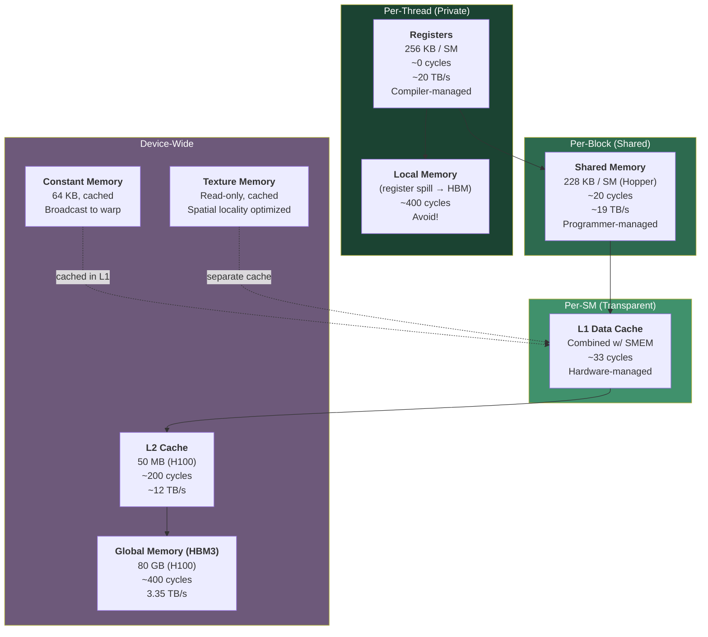
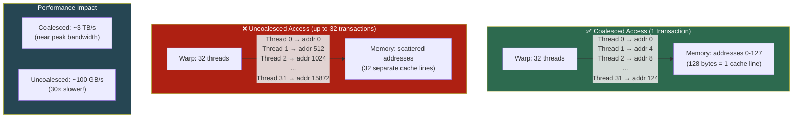

# Chapter 47: CUDA Memory Architecture — The Complete Picture

**Tags:** #cuda #memory-hierarchy #shared-memory #global-memory #coalescing #registers #constant-memory #texture-memory

---

## 1. Theory: Memory Is Everything in GPU Programming

If you take away one lesson from CUDA programming, it's this: **memory access patterns determine performance**. The GPU has enormous compute throughput (hundreds of TFLOPS), but data must be fed from memory to sustain it. A poorly optimized memory access pattern can reduce performance by 10–100×.

CUDA exposes a rich memory hierarchy with **seven distinct memory spaces**, each with different scope, lifetime, latency, and bandwidth. The programmer's job is to keep data as close to the compute units as possible — in registers if possible, then shared memory, then L1/L2 cache, and finally global memory (HBM) as a last resort.

### The Fundamental Problem

Consider an H100 GPU:
- **Compute**: 989 TFLOPS FP16 = 989 × 10¹² operations/second
- **Memory BW**: 3.35 TB/s = 3.35 × 10¹² bytes/second
- **Arithmetic Intensity required**: 989/3.35 ≈ **295 FLOP/Byte**

This means for every byte loaded from HBM, you need 295 floating-point operations to keep the GPU busy. Most element-wise operations (add, relu, softmax) have <1 FLOP/byte — they are **massively memory-bound**. Only GEMM achieves the required intensity through data reuse.

---

## 2. What, Why, How

### What Is the CUDA Memory Model?
Seven distinct memory spaces organized in a hierarchy from fast-small (registers) to slow-large (global/HBM), each with different scope and management.

### Why So Many Memory Spaces?
Because a single flat memory model cannot satisfy both bandwidth and capacity needs. Registers are fast but tiny (256 KB/SM); HBM is large (80 GB) but slow. The hierarchy lets programmers manually optimize data placement for maximum performance.

### How Do You Use Them?
- **Registers**: Automatic (compiler-managed local variables)
- **Shared memory**: Explicit (`__shared__` keyword, programmer manages)
- **Global memory**: Explicit (`cudaMalloc` / `cudaMemcpy`)
- **Constant memory**: Explicit (`__constant__` keyword, host writes)
- **L1/L2 caches**: Transparent (hardware-managed)
- **Texture memory**: Special API (`cudaTextureObject_t`)

---

## 3. Complete Memory Hierarchy



---

## 4. Register File — The Fastest Memory

Registers are the closest memory to the execution units — zero additional latency.

| Property | Value (H100) |
|----------|-------------|
| Size per SM | 256 KB (65,536 × 32-bit registers) |
| Latency | ~0 additional cycles |
| Bandwidth | ~20 TB/s aggregate |
| Scope | Per-thread (private) |
| Managed by | Compiler (automatic) |
| Max per thread | 255 registers |

This kernel shows how local variables naturally live in GPU registers — the fastest memory available with zero additional latency. The variable `x` is loaded from global memory into a register, then all subsequent operations (`multiply`, `add`, `sqrt`) happen at register speed. The final result is written back to global memory.

```cuda
__global__ void registerExample(float* data, int n) {
    int idx = blockIdx.x * blockDim.x + threadIdx.x;
    if (idx < n) {
        // 'x' and 'temp' live in registers — fastest possible access
        float x = data[idx];        // Load from global → register
        float temp = x * x;         // Register-to-register operation
        temp = temp + 3.14f;        // Register-to-register
        temp = sqrtf(temp);         // Register-to-register
        data[idx] = temp;           // Register → global store
    }
}
```

### Register Pressure
Each thread's register usage affects how many threads can be active on an SM:
- 255 regs/thread × 256 threads = 65,280 → uses almost all 65,536 registers
- Only 1 block of 256 threads fits
- Fewer active warps → less latency hiding → lower performance

Use `nvcc --ptxas-options=-v` to check register usage:
```
ptxas info: Used 32 registers, 0 bytes shared memory
```

---

## 5. Local Memory — The Hidden Performance Trap

Local memory is **per-thread** but **physically resides in global memory (HBM)**. It's used when:
- The compiler runs out of registers (register spill)
- Arrays indexed with runtime-variable indices
- Large structures that don't fit in registers

This kernel demonstrates a common performance trap: declaring a large array inside a kernel. Since 256 floats exceeds the available registers, the compiler "spills" this array to local memory — which despite its name actually lives in slow global memory (~400 cycle latency). Use shared memory instead for large per-thread buffers.

```cuda
__global__ void localMemoryTrap(float* output, int n) {
    // This array is too large for registers — goes to local memory (SLOW)
    float localArray[256];

    int idx = blockIdx.x * blockDim.x + threadIdx.x;
    for (int i = 0; i < 256; i++) {
        localArray[i] = sinf(idx + i);  // Each access is ~400 cycles!
    }

    float sum = 0;
    for (int i = 0; i < 256; i++) {
        sum += localArray[i];
    }
    if (idx < n) output[idx] = sum;
}
```

> **Warning**: "Local" is misleading — it means thread-local scope but global-memory speed. Avoid large per-thread arrays. Use shared memory instead.

---

## 6. Shared Memory — The Programmer's Scratchpad

Shared memory is the most important optimization tool in CUDA. It's a programmer-managed cache shared by all threads in a block.

| Property | Value (H100) |
|----------|-------------|
| Size per SM | Up to 228 KB (configurable) |
| Latency | ~20 cycles |
| Bandwidth | ~19 TB/s aggregate |
| Scope | Per-block (all threads in block) |
| Managed by | Programmer (explicit) |
| Keyword | `__shared__` |

### Static Shared Memory

This kernel demonstrates the shared memory load-compute pattern. Each thread loads one element from slow global memory into fast shared memory, then `__syncthreads()` ensures all threads have finished loading before any thread reads another thread's data. This enables fast neighbor access — reading adjacent elements costs ~20 cycles from shared memory vs ~400 from global.

```cuda
__global__ void sharedMemExample(float* input, float* output, int n) {
    // Statically allocated shared memory
    __shared__ float tile[256];

    int idx = blockIdx.x * blockDim.x + threadIdx.x;

    // Step 1: Cooperatively load data from global to shared memory
    if (idx < n) {
        tile[threadIdx.x] = input[idx];
    }

    // Step 2: Synchronize — ensure all threads have loaded their data
    __syncthreads();

    // Step 3: Use shared memory (e.g., access neighbor's data)
    if (idx < n && threadIdx.x > 0) {
        // Accessing another thread's data — fast in shared memory!
        output[idx] = (tile[threadIdx.x - 1] + tile[threadIdx.x]) * 0.5f;
    }
}
```

### Dynamic Shared Memory

Dynamic shared memory lets you set the buffer size at kernel launch time rather than compile time. The `extern __shared__` declaration creates a pointer, and the actual size (in bytes) is passed as the third argument of the `<<<>>>` launch syntax. This is useful when the buffer size depends on runtime parameters.

```cuda
// Size specified at launch time
extern __shared__ float dynamicShared[];

__global__ void dynamicSharedKernel(float* data, int n) {
    dynamicShared[threadIdx.x] = data[blockIdx.x * blockDim.x + threadIdx.x];
    __syncthreads();
    // Use dynamicShared...
}

// Launch with shared memory size as third parameter
int sharedBytes = 256 * sizeof(float);
dynamicSharedKernel<<<blocks, 256, sharedBytes>>>(d_data, n);
```

### Shared Memory Bank Conflicts

Shared memory is divided into **32 banks** (one per warp lane). If multiple threads in a warp access the same bank, accesses are serialized.

```
Bank 0:  addr 0, 32, 64, 96, ...
Bank 1:  addr 1, 33, 65, 97, ...
Bank 2:  addr 2, 34, 66, 98, ...
...
Bank 31: addr 31, 63, 95, 127, ...
```

These examples show how shared memory access patterns affect performance. Stride-1 access (each thread reads consecutive addresses) gives zero bank conflicts. Stride-32 means all 32 threads hit the same bank, serializing access to 32× slower. The padding trick (`[32][33]` instead of `[32][32]`) shifts each row by one bank, eliminating column-access conflicts.

```cuda
// NO bank conflict: stride-1 access (each thread hits different bank)
shared[threadIdx.x] = input[idx];  // thread 0→bank0, thread 1→bank1, ...

// 32-WAY bank conflict: stride-32 access (all threads hit bank 0!)
shared[threadIdx.x * 32] = input[idx];  // ALL threads hit bank 0

// Common fix: pad shared memory to avoid conflicts
__shared__ float tile[32][33];  // 33 instead of 32 avoids column conflicts
```

---

## 7. Configuring Shared Memory vs L1 Cache

On Hopper, the shared memory and L1 cache share the same physical SRAM. You can configure the split:

On modern GPUs, shared memory and L1 cache share the same on-chip SRAM. These API calls let you control how much goes to each. Use more shared memory for tiled algorithms (like matrix multiply) and more L1 cache for irregular access patterns where you can't predict which data to load.

```cuda
// Prefer more shared memory (for tiled algorithms)
cudaFuncSetAttribute(myKernel,
    cudaFuncAttributePreferredSharedMemoryCarveout, 100);  // 100% to shared

// Prefer more L1 cache (for irregular access patterns)
cudaFuncSetAttribute(myKernel,
    cudaFuncAttributePreferredSharedMemoryCarveout, 0);    // 0% to shared

// Or set maximum dynamic shared memory size
cudaFuncSetAttribute(myKernel,
    cudaFuncAttributeMaxDynamicSharedMemorySize, 228 * 1024);
```

---

## 8. Global Memory and the CUDA API

These are the fundamental CUDA memory management functions. `cudaMalloc` allocates GPU memory, `cudaMemcpy` transfers data between CPU and GPU (the direction is specified by the last argument), `cudaMemset` initializes GPU memory, and `cudaFree` releases it. The async variants enable overlapping transfers with computation using CUDA streams.

```cuda
// Allocation
float* d_data;
cudaMalloc(&d_data, N * sizeof(float));          // Allocate on GPU
cudaMalloc(&d_data, 0);                          // Valid, returns non-null

// Transfer
cudaMemcpy(d_data, h_data, size, cudaMemcpyHostToDevice);   // CPU → GPU
cudaMemcpy(h_data, d_data, size, cudaMemcpyDeviceToHost);   // GPU → CPU
cudaMemcpy(d_dst, d_src, size, cudaMemcpyDeviceToDevice);   // GPU → GPU

// Initialization
cudaMemset(d_data, 0, size);                     // Set bytes to 0

// Deallocation
cudaFree(d_data);

// Asynchronous versions (non-blocking, requires streams + pinned memory)
cudaMemcpyAsync(d_data, h_pinned, size, cudaMemcpyHostToDevice, stream);
```

### Error Handling Pattern

This pattern shows robust error handling for GPU memory allocation. Unlike CPU `malloc` which returns NULL on failure, `cudaMalloc` returns an error code. Always check this code — running out of GPU memory is common with large models, and failing silently leads to crashes deep in kernel code.

```cuda
float* d_ptr = nullptr;
cudaError_t err = cudaMalloc(&d_ptr, size);
if (err != cudaSuccess) {
    fprintf(stderr, "cudaMalloc failed: %s (requested %zu bytes)\n",
            cudaGetErrorString(err), size);
    // Handle gracefully — maybe allocate smaller, or fall back to CPU
    return -1;
}
// Always check that cudaMalloc didn't return cudaErrorMemoryAllocation
```

---

## 9. Memory Coalescing — The 32× Performance Difference

Memory coalescing is the single most important memory optimization. When threads in a warp access **consecutive memory addresses**, the hardware combines them into a single wide transaction. When accesses are scattered, each thread generates a separate transaction.



### Coalesced vs Uncoalesced Code

```cuda
// ✅ COALESCED: Thread i accesses element i (stride-1)
// Threads 0-31 access addresses 0, 4, 8, ..., 124 → ONE 128-byte transaction
__global__ void coalesced(float* data, int n) {
    int idx = blockIdx.x * blockDim.x + threadIdx.x;
    if (idx < n) {
        data[idx] = data[idx] * 2.0f;  // Consecutive access
    }
}

// ❌ UNCOALESCED: Stride-N access pattern
// Thread 0 → row 0, Thread 1 → row 1, ... (column access of row-major matrix)
__global__ void uncoalesced(float* matrix, int rows, int cols) {
    int idx = blockIdx.x * blockDim.x + threadIdx.x;
    if (idx < rows) {
        // Each thread accesses a different row, same column
        // Stride = cols (e.g., 1024) → scattered memory accesses
        matrix[idx * cols] = matrix[idx * cols] * 2.0f;
    }
}

// ✅ FIX: Transpose access pattern or use shared memory to restructure
__global__ void coalescedMatrix(float* matrix, int rows, int cols) {
    int col = blockIdx.x * blockDim.x + threadIdx.x;
    int row = blockIdx.y * blockDim.y + threadIdx.y;
    if (row < rows && col < cols) {
        // Threads in a warp access consecutive columns (stride-1)
        int idx = row * cols + col;
        matrix[idx] = matrix[idx] * 2.0f;
    }
}
```

### Structure of Arrays (SoA) vs Array of Structures (AoS)

```cuda
// ❌ AoS — threads in a warp access non-consecutive memory
struct Particle_AoS {
    float x, y, z;
    float vx, vy, vz;
    float mass;
};
// Particle particles[N];
// Thread 0 reads particles[0].x (addr 0)
// Thread 1 reads particles[1].x (addr 28) — stride of 28 bytes!

// ✅ SoA — threads in a warp access consecutive memory
struct Particles_SoA {
    float* x;    // x[0], x[1], x[2], ... — consecutive!
    float* y;
    float* z;
    float* vx;
    float* vy;
    float* vz;
    float* mass;
};
// Thread 0 reads x[0] (addr 0)
// Thread 1 reads x[1] (addr 4) — stride of 4 bytes → COALESCED
```

---

## 10. Constant Memory

Constant memory is optimized for the case where **all threads read the same value** (broadcast):

```cuda
// Declare at file scope (64 KB limit)
__constant__ float d_filter[256];

// Host code: copy to constant memory
float h_filter[256];
// ... initialize h_filter ...
cudaMemcpyToSymbol(d_filter, h_filter, sizeof(h_filter));

// Kernel: all threads read same filter values → broadcast from cache
__global__ void convolve(float* input, float* output, int n) {
    int idx = blockIdx.x * blockDim.x + threadIdx.x;
    if (idx < n) {
        float sum = 0;
        for (int k = 0; k < 256; k++) {
            sum += input[idx + k] * d_filter[k];  // Broadcast read
        }
        output[idx] = sum;
    }
}
```

**When to use**: Convolution filters, lookup tables, configuration parameters — any read-only data accessed uniformly by all threads.

---

## 11. Texture Memory

Texture memory provides hardware-accelerated features for read-only, spatially-local access patterns:

```cuda
// Modern bindless texture API
cudaTextureObject_t createTexture(float* d_data, int width, int height) {
    cudaResourceDesc resDesc = {};
    resDesc.resType = cudaResourceTypePitch2D;
    resDesc.res.pitch2D.devPtr = d_data;
    resDesc.res.pitch2D.width = width;
    resDesc.res.pitch2D.height = height;
    resDesc.res.pitch2D.pitchInBytes = width * sizeof(float);
    resDesc.res.pitch2D.desc = cudaCreateChannelDesc<float>();

    cudaTextureDesc texDesc = {};
    texDesc.addressMode[0] = cudaAddressModeClamp;
    texDesc.addressMode[1] = cudaAddressModeClamp;
    texDesc.filterMode = cudaFilterModeLinear;  // Hardware interpolation!
    texDesc.normalizedCoords = true;

    cudaTextureObject_t tex;
    cudaCreateTextureObject(&tex, &resDesc, &texDesc, NULL);
    return tex;
}

__global__ void sampleTexture(cudaTextureObject_t tex, float* output,
                              int width, int height) {
    int x = blockIdx.x * blockDim.x + threadIdx.x;
    int y = blockIdx.y * blockDim.y + threadIdx.y;
    if (x < width && y < height) {
        float u = (x + 0.5f) / width;
        float v = (y + 0.5f) / height;
        // Hardware-accelerated bilinear interpolation!
        output[y * width + x] = tex2D<float>(tex, u, v);
    }
}
```

**Advantages of texture memory**:
- Separate cache (doesn't pollute L1/L2)
- 2D spatial locality optimization
- Free hardware interpolation (bilinear, trilinear)
- Automatic boundary handling (clamp, wrap, mirror)
- Useful for image processing and physics simulations

---

## 12. Complete Memory Benchmark

This comprehensive benchmark measures three key memory performance characteristics: coalesced global memory copy bandwidth, shared memory throughput, and the impact of strided (non-coalesced) access patterns. Running this on your GPU reveals how close your kernels can get to peak memory bandwidth and quantifies the penalty of non-coalesced access.

```cuda
// File: memory_benchmark.cu
// Compile: nvcc -O3 -o mem_bench memory_benchmark.cu
// Run: ./mem_bench

#include <stdio.h>
#include <cuda_runtime.h>

#define CUDA_CHECK(call) do {                                       \
    cudaError_t err = (call);                                       \
    if (err != cudaSuccess) {                                       \
        fprintf(stderr, "CUDA Error: %s at %s:%d\n",               \
                cudaGetErrorString(err), __FILE__, __LINE__);       \
        exit(1);                                                    \
    }                                                               \
} while(0)

// Test 1: Global memory bandwidth (coalesced)
__global__ void globalMemBW(float* dst, const float* src, int n) {
    int idx = blockIdx.x * blockDim.x + threadIdx.x;
    int stride = gridDim.x * blockDim.x;
    for (int i = idx; i < n; i += stride) {
        dst[i] = src[i];
    }
}

// Test 2: Shared memory bandwidth
__global__ void sharedMemBW(float* dst, const float* src, int n) {
    __shared__ float smem[256];
    int idx = blockIdx.x * blockDim.x + threadIdx.x;

    if (idx < n) {
        smem[threadIdx.x] = src[idx];    // Global → Shared
        __syncthreads();
        dst[idx] = smem[threadIdx.x];    // Shared → Global
    }
}

// Test 3: Uncoalesced access (stride pattern)
__global__ void stridedAccess(float* dst, const float* src,
                              int n, int stride_val) {
    int idx = blockIdx.x * blockDim.x + threadIdx.x;
    if (idx < n / stride_val) {
        dst[idx] = src[idx * stride_val];  // Strided read
    }
}

float benchmarkKernel(void (*kernel)(float*, const float*, int),
                      float* d_dst, float* d_src, int n,
                      int blocks, int threads) {
    // Warm up
    kernel<<<blocks, threads>>>(d_dst, d_src, n);
    CUDA_CHECK(cudaDeviceSynchronize());

    cudaEvent_t start, stop;
    CUDA_CHECK(cudaEventCreate(&start));
    CUDA_CHECK(cudaEventCreate(&stop));

    const int ITERS = 100;
    CUDA_CHECK(cudaEventRecord(start));
    for (int i = 0; i < ITERS; i++) {
        kernel<<<blocks, threads>>>(d_dst, d_src, n);
    }
    CUDA_CHECK(cudaEventRecord(stop));
    CUDA_CHECK(cudaEventSynchronize(stop));

    float ms;
    CUDA_CHECK(cudaEventElapsedTime(&ms, start, stop));
    CUDA_CHECK(cudaEventDestroy(start));
    CUDA_CHECK(cudaEventDestroy(stop));

    return ms / ITERS;
}

int main() {
    const int N = 1 << 26;  // 64M elements = 256 MB
    const size_t SIZE = N * sizeof(float);

    float *d_src, *d_dst;
    CUDA_CHECK(cudaMalloc(&d_src, SIZE));
    CUDA_CHECK(cudaMalloc(&d_dst, SIZE));
    CUDA_CHECK(cudaMemset(d_src, 1, SIZE));

    int threads = 256;
    int blocks = (N + threads - 1) / threads;

    // Test 1: Coalesced global memory copy
    float ms_coalesced = benchmarkKernel(globalMemBW, d_dst, d_src, N,
                                          blocks, threads);
    float bw_coalesced = 2.0f * SIZE / (ms_coalesced / 1000.0f) / 1e9f;

    // Test 2: Shared memory copy
    float ms_shared = benchmarkKernel(sharedMemBW, d_dst, d_src, N,
                                       blocks, threads);
    float bw_shared = 2.0f * SIZE / (ms_shared / 1000.0f) / 1e9f;

    printf("=== Memory Bandwidth Benchmark ===\n\n");
    printf("Data size: %d elements (%.0f MB)\n\n", N, SIZE / (1024.0 * 1024.0));
    printf("%-30s  %8s  %12s\n", "Test", "Time(ms)", "Bandwidth");
    printf("────────────────────────────────────────────────────\n");
    printf("%-30s  %8.3f  %10.1f GB/s\n", "Coalesced Global Copy", ms_coalesced, bw_coalesced);
    printf("%-30s  %8.3f  %10.1f GB/s\n", "Via Shared Memory", ms_shared, bw_shared);

    // Test 3: Stride access
    printf("\n%-30s  %8s  %12s  %8s\n", "Stride Test", "Time(ms)", "Bandwidth", "vs Coal");
    printf("────────────────────────────────────────────────────────────\n");

    int strides[] = {1, 2, 4, 8, 16, 32};
    for (int s = 0; s < 6; s++) {
        int stride_val = strides[s];
        int count = N / stride_val;
        int sblocks = (count + threads - 1) / threads;

        // Warm up
        stridedAccess<<<sblocks, threads>>>(d_dst, d_src, N, stride_val);
        CUDA_CHECK(cudaDeviceSynchronize());

        cudaEvent_t st, sp;
        CUDA_CHECK(cudaEventCreate(&st));
        CUDA_CHECK(cudaEventCreate(&sp));

        CUDA_CHECK(cudaEventRecord(st));
        for (int i = 0; i < 100; i++) {
            stridedAccess<<<sblocks, threads>>>(d_dst, d_src, N, stride_val);
        }
        CUDA_CHECK(cudaEventRecord(sp));
        CUDA_CHECK(cudaEventSynchronize(sp));

        float ms;
        CUDA_CHECK(cudaEventElapsedTime(&ms, st, sp));
        ms /= 100;

        size_t bytes_moved = (size_t)count * sizeof(float) * 2;
        float bw = bytes_moved / (ms / 1000.0f) / 1e9f;
        printf("%-30s  %8.3f  %10.1f GB/s  %6.1f%%\n",
               (stride_val == 1 ? "Stride=1 (coalesced)" : ""),
               ms, bw, bw / bw_coalesced * 100);

        if (stride_val == 1) {
            printf("  Stride=1 (coalesced)");
        } else {
            printf("  Stride=%d", stride_val);
        }
        printf("\n");

        CUDA_CHECK(cudaEventDestroy(st));
        CUDA_CHECK(cudaEventDestroy(sp));
    }

    CUDA_CHECK(cudaFree(d_src));
    CUDA_CHECK(cudaFree(d_dst));

    return 0;
}
```

---

## 13. Exercises

### 🟢 Beginner
1. **Memory Query**: Write a program that prints the total global memory, shared memory per block, shared memory per SM, and L2 cache size of your GPU.
2. **Constant Memory**: Implement a 1D convolution using constant memory for the filter kernel. Compare performance against passing the filter via global memory.
3. **Memory API**: Write a program that allocates 1 GB on the GPU, fills it with `cudaMemset`, and frees it. Measure the time for `cudaMalloc` and `cudaFree`.

### 🟡 Intermediate
4. **Coalescing Experiment**: Write a benchmark that measures effective bandwidth for stride-1, stride-2, stride-4, stride-8, and stride-32 access patterns. Plot the results.
5. **Shared Memory Reduction**: Implement a parallel sum reduction using shared memory. Compare against a naive reduction using global memory atomics.
6. **Bank Conflicts**: Write a shared memory access benchmark that deliberately creates 2-way, 4-way, and 32-way bank conflicts. Measure the performance impact.

### 🔴 Advanced
7. **Tiled Matrix Multiply**: Implement matrix multiplication using shared memory tiling. Compare GFLOPS against the naive version from Chapter 46.
8. **L2 Cache Residency Control**: Use `cudaAccessPolicyWindow` to control L2 cache residency for a streaming kernel. Measure the impact on performance.

---

## 14. Solutions

### Solution 1 (Memory Query)

This snippet uses `cudaGetDeviceProperties` to query and display the most important memory specifications of your GPU — total global memory, shared memory per block, shared memory per SM, and L2 cache size.

```cuda
cudaDeviceProp prop;
cudaGetDeviceProperties(&prop, 0);
printf("Global: %.2f GB\n", prop.totalGlobalMem / 1e9);
printf("Shared/Block: %zu KB\n", prop.sharedMemPerBlock / 1024);
printf("Shared/SM: %zu KB\n", prop.sharedMemPerMultiprocessor / 1024);
printf("L2: %d MB\n", prop.l2CacheSize / (1024 * 1024));
```

### Solution 5 (Shared Memory Reduction)

This kernel performs a parallel sum reduction using shared memory. Each thread loads one element, then in a tree-reduction loop, half the threads add their neighbor's value at each step. After log₂(N) steps, thread 0 has the block's sum, which it adds to the global output using `atomicAdd` to safely handle multiple blocks.

```cuda
__global__ void reduceShared(float* input, float* output, int n) {
    __shared__ float sdata[256];
    int tid = threadIdx.x;
    int idx = blockIdx.x * blockDim.x + threadIdx.x;

    sdata[tid] = (idx < n) ? input[idx] : 0.0f;
    __syncthreads();

    // Tree reduction in shared memory
    for (int s = blockDim.x / 2; s > 0; s >>= 1) {
        if (tid < s) {
            sdata[tid] += sdata[tid + s];
        }
        __syncthreads();
    }

    if (tid == 0) {
        atomicAdd(output, sdata[0]);  // Only 1 atomic per block
    }
}
```

### Solution 7 (Tiled Matrix Multiply — sketch)

This tiled matrix multiplication loads small TILE×TILE sub-blocks of matrices A and B into shared memory, computes partial dot products, then moves to the next tile. Each global memory load is reused TILE times by different threads, reducing global memory traffic by a factor of TILE (16× in this case) compared to the naive approach.

```cuda
#define TILE 16
__global__ void matMulTiled(float* A, float* B, float* C, int N) {
    __shared__ float As[TILE][TILE], Bs[TILE][TILE];
    int row = blockIdx.y * TILE + threadIdx.y;
    int col = blockIdx.x * TILE + threadIdx.x;
    float sum = 0;

    for (int t = 0; t < N / TILE; t++) {
        As[threadIdx.y][threadIdx.x] = A[row * N + t * TILE + threadIdx.x];
        Bs[threadIdx.y][threadIdx.x] = B[(t * TILE + threadIdx.y) * N + col];
        __syncthreads();

        for (int k = 0; k < TILE; k++)
            sum += As[threadIdx.y][k] * Bs[k][threadIdx.x];
        __syncthreads();
    }
    C[row * N + col] = sum;
}
// This achieves ~10× speedup over naive by reducing global memory reads
// from O(N) per output element to O(N/TILE)
```

---

## 15. Quiz

**Q1**: What is local memory and why should you avoid it?  
**A**: Local memory is per-thread spillover storage that resides in global memory (HBM) despite its name. It has ~400 cycle latency. Compiler uses it when registers run out. Avoid large per-thread arrays and excessive register pressure.

**Q2**: What is memory coalescing?  
**A**: When threads in a warp access consecutive memory addresses, the hardware combines (coalesces) them into one or a few wide memory transactions. Coalesced accesses achieve near-peak bandwidth; uncoalesced accesses can be 10–32× slower.

**Q3**: Why is Structure of Arrays (SoA) preferred over Array of Structures (AoS) on GPUs?  
**A**: SoA enables coalesced memory access. In AoS, consecutive threads access memory locations separated by the struct size (strided); in SoA, consecutive threads access consecutive elements of the same array (coalesced).

**Q4**: What is a shared memory bank conflict?  
**A**: When two or more threads in a warp access different addresses in the same shared memory bank, their accesses are serialized. Shared memory has 32 banks; stride-1 and broadcast patterns have no conflicts.

**Q5**: How much constant memory is available?  
**A**: 64 KB. It's cached and optimized for broadcast reads (all threads reading the same address). Best for convolution filters, lookup tables, and configuration data.

**Q6**: What is the `__syncthreads()` barrier?  
**A**: A block-level synchronization barrier. All threads in the block must reach this point before any can proceed. Essential when shared memory is written by some threads and read by others.

**Q7**: How do you choose between shared memory and L1 cache?  
**A**: Use shared memory when you have a clear data reuse pattern and can manage the loading/synchronization explicitly (e.g., tiled GEMM). Use L1 cache for irregular access patterns where the hardware can manage caching transparently.

---

## 16. Key Takeaways

- **7 memory spaces**: registers, local, shared, L1 cache, L2 cache, global (HBM), constant, texture
- **Registers** are fastest (~0 cycles) but limited — excessive use reduces occupancy
- **Local memory** is a trap — "local" scope but HBM speed (~400 cycles)
- **Shared memory** is the primary optimization tool — ~20 cycles, programmer-managed
- **Memory coalescing** is the #1 optimization: stride-1 access → 10–32× faster than strided
- **SoA > AoS** for GPU data layouts — enables coalesced access
- **`__syncthreads()`** is essential when sharing data via shared memory

---

## 17. Chapter Summary

This chapter mapped the complete CUDA memory hierarchy — from registers (zero latency, 256 KB/SM) through shared memory (20 cycles, 228 KB/SM) to global HBM (400 cycles, 80 GB). We learned that memory coalescing can make a 32× performance difference, that SoA layouts are essential for GPU efficiency, and that shared memory bank conflicts can silently degrade performance. The constant and texture memory spaces serve specialized use cases (broadcast reads and spatial locality, respectively). We implemented a memory bandwidth benchmark and a tiled matrix multiplication that demonstrates the power of shared memory optimization.

---

## 18. Real-World Insight: Memory Optimization in Flash Attention

Flash Attention (Dao et al., 2022) is the most impactful CUDA memory optimization in modern AI. Standard attention computes `softmax(Q·K^T)·V`, materializing the full N×N attention matrix in HBM — quadratic memory and slow due to repeated HBM round-trips.

Flash Attention avoids materializing the attention matrix entirely. It tiles Q, K, V into shared memory blocks, computes partial softmax in registers, and writes only the final output to HBM. This transforms a memory-bound operation into a compute-bound one:
- **Memory**: O(N) instead of O(N²)
- **Speed**: 2–4× faster than standard attention
- **Enabling**: Makes training with 128K+ context lengths practical

This is the power of understanding the memory hierarchy — the algorithm is mathematically identical, but memory optimization makes it fundamentally more efficient.

---

## 19. Common Mistakes

| Mistake | Impact | Fix |
|---------|--------|-----|
| Column-wise access of row-major matrix | Uncoalesced reads, 10-30× slowdown | Transpose to access row-wise, or use shared memory |
| Using AoS instead of SoA | Strided access pattern, poor bandwidth | Restructure to SoA layout |
| Missing `__syncthreads()` after shared mem write | Race condition — incorrect results | Always sync between cooperative writes and reads |
| Ignoring register spill to local memory | 200× slower than registers | Check with `--ptxas-options=-v`, reduce register pressure |
| Using constant memory with thread-varying access | Serialized reads, slow | Constant memory only for broadcast/uniform access |
| Allocating shared memory beyond SM limit | Kernel launch failure | Check `cudaFuncSetAttribute` for max shared memory |

---

## 20. Interview Questions

**Q1: Explain the CUDA memory hierarchy and when to use each level.**

**A**: (1) **Registers** — automatic, per-thread, fastest; use for local variables and accumulators. (2) **Shared memory** — per-block, ~20 cycles, programmer-managed; use for data shared between threads (tiling, reductions, transpose). (3) **L1/L2 cache** — transparent, hardware-managed; helpful for irregular access patterns. (4) **Global memory (HBM)** — device-wide, ~400 cycles; main data storage, must be accessed with coalesced patterns. (5) **Constant memory** — 64 KB, cached, broadcast-optimized; use for read-only uniform data. (6) **Texture** — read-only, spatial cache; use for 2D interpolation. Optimization strategy: maximize register and shared memory use, minimize global memory accesses, ensure coalescing.

**Q2: What is memory coalescing and why is it critical for GPU performance?**

**A**: Memory coalescing occurs when threads in a warp access consecutive memory addresses, allowing the memory controller to combine individual requests into a single wide transaction (128 bytes per cache line). Coalesced access achieves near-peak memory bandwidth (~80-90% of theoretical). Uncoalesced access generates up to 32 separate transactions, reducing effective bandwidth by up to 32×. This is critical because most GPU kernels are memory-bound — their performance is limited by how fast data can be delivered, not how fast it can be computed. Key strategies: use stride-1 access patterns, prefer SoA over AoS, and use shared memory to restructure access patterns.

**Q3: Describe shared memory bank conflicts and how to avoid them.**

**A**: Shared memory is divided into 32 banks (matching the warp size). Address N maps to bank N%32. When two threads in a warp access different addresses in the same bank, the accesses are serialized (2-way conflict = 2× slower, 32-way = 32× slower). Exception: if all threads access the same address, the hardware broadcasts (no conflict). Common causes: stride-32 access, column access of 32-wide 2D arrays. Fixes: (1) Pad 2D shared arrays to 33 columns (`float tile[32][33]`), (2) reorganize access patterns to be stride-1, (3) use `__shfl_sync()` to exchange data within a warp without shared memory.

**Q4: How does tiled matrix multiplication use shared memory to improve performance?**

**A**: Naive matmul: each output element requires reading N elements from A and N from B from global memory — O(N³) global reads for N² outputs. Tiled matmul: load TILE×TILE sub-blocks of A and B into shared memory, compute partial products, repeat. Each tile is loaded once from global memory but used TILE times. This reduces global memory reads by factor TILE (typically 16–32). For a 4096×4096 matrix with TILE=16: naive = 4096 global reads per output; tiled = 256 global reads per output (16× reduction). Combined with register-level tiling (each thread computes multiple outputs), this achieves >80% of Tensor Core performance.

**Q5: What is the difference between `cudaMalloc` and `cudaMallocManaged`?**

**A**: `cudaMalloc` allocates memory exclusively on the GPU — accessible only from device code (kernels). Requires explicit `cudaMemcpy` to transfer data between host and device. `cudaMallocManaged` allocates unified memory — a single pointer accessible from both CPU and GPU code. The CUDA runtime migrates pages between CPU and GPU on demand using page faults. Trade-offs: `cudaMalloc` has better performance (no page fault overhead) and predictable behavior; `cudaMallocManaged` is simpler to program, better for prototyping, and good when CPU/GPU access patterns are complex or unpredictable. Production ML code almost always uses explicit `cudaMalloc`.
