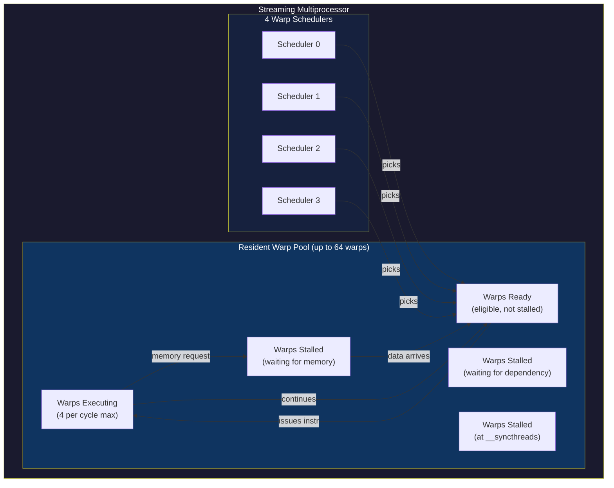
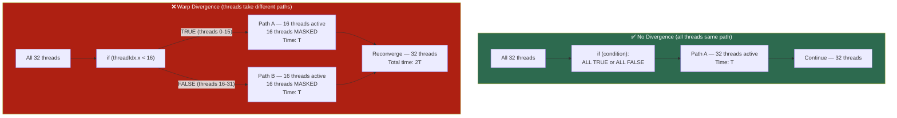
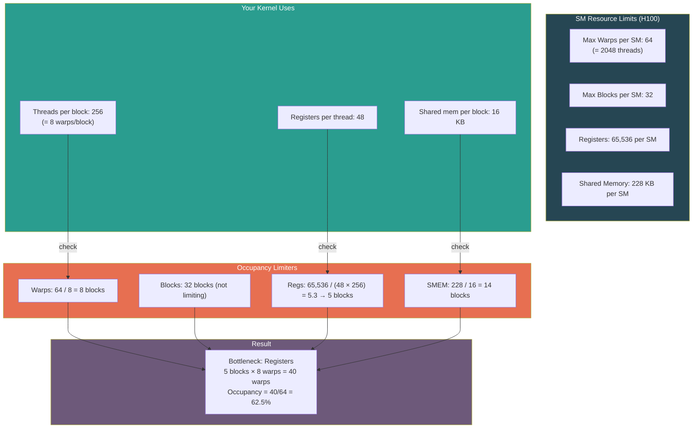

# Chapter 48: Warps, Threads & Execution Deep-Dive

**Tags:** #cuda #warps #warp-divergence #occupancy #thread-scheduling #predication #simt #gpu-execution

---

## 1. Theory: The Warp Is Everything

If the memory hierarchy is the body of GPU performance, the **warp** is the heartbeat. A warp — 32 threads executing in lockstep — is the fundamental unit of execution on NVIDIA GPUs. Not a thread, not a block, but a **warp**.

Understanding warps unlocks:
- Why branch-heavy code is slow on GPUs (warp divergence)
- Why block size must be a multiple of 32 (partial warp waste)
- Why occupancy matters (latency hiding via warp switching)
- Why some algorithms map naturally to GPUs and others don't

Every CUDA programmer writes code for a single thread, but the hardware always executes 32 threads together. This chapter reveals what happens beneath that abstraction.

---

## 2. What, Why, How

### What Is a Warp?
A warp is a group of 32 consecutive threads within a block that execute the same instruction simultaneously on an SM's execution units. Thread indices `[0..31]` form warp 0, `[32..63]` form warp 1, and so on.

### Why 32 Threads?
The number 32 is a hardware design choice balancing execution width against register file and scheduler complexity. It has remained constant since CUDA's inception (2007) and is unlikely to change.

### How Are Warps Scheduled?
Each SM has 4 warp schedulers (on Hopper). Each cycle, each scheduler picks one eligible warp (not stalled on memory or dependencies) and issues one or two instructions from it. When a warp stalls, another warp executes instantly — this is **latency hiding through warp-level parallelism**.

---

## 3. Warp Formation and Thread Organization

This diagram shows how a block of 256 threads is divided into 8 warps of 32 threads each. For 2D blocks, threads are linearized in row-major order (`y * blockDim.x + x`) before being grouped into warps.

```
Block of 256 threads:
┌─────────────────────────────────────────────────────────────┐
│ Warp 0: threads  [0   -  31]  │ Warp 4: threads [128 - 159]│
│ Warp 1: threads  [32  -  63]  │ Warp 5: threads [160 - 191]│
│ Warp 2: threads  [64  -  95]  │ Warp 6: threads [192 - 223]│
│ Warp 3: threads  [96  - 127]  │ Warp 7: threads [224 - 255]│
└─────────────────────────────────────────────────────────────┘
Total: 8 warps per block (256 / 32 = 8)

For 2D blocks (16×16 = 256 threads):
threadIdx.y=0:  threadIdx.x=[0..15]  ─┐
threadIdx.y=1:  threadIdx.x=[0..15]  ─┘ Warp 0 (linearized threads 0-31)
threadIdx.y=2:  threadIdx.x=[0..15]  ─┐
threadIdx.y=3:  threadIdx.x=[0..15]  ─┘ Warp 1 (linearized threads 32-63)
```

The linearized thread index within a block:
```
linearIdx = threadIdx.x
           + threadIdx.y * blockDim.x
           + threadIdx.z * blockDim.x * blockDim.y

warpId = linearIdx / 32
laneId = linearIdx % 32
```

---

## 4. Warp Scheduling: Zero-Cost Context Switching



### How Latency Is Hidden

This timeline illustrates how the GPU hides memory latency by rapidly switching between warps. While one warp waits hundreds of cycles for a memory load, the scheduler issues instructions from other ready warps, keeping the execution units busy at all times.

```
Timeline (simplified, 4 warps on 1 scheduler):

Cycle:  1    2    3    4    5    6    ...  400  401  402
W0:    [EXEC][--- waiting for memory load ---][EXEC]
W1:         [EXEC][--- waiting for memory ---]     [EXEC]
W2:              [EXEC][--- waiting for mem ---]        [EXEC]
W3:                   [EXEC][--- waiting ----]               [EXEC]

The scheduler always has a warp ready to execute.
Memory latency (~400 cycles) is completely hidden by cycling through warps.
```

> **Key Insight**: GPUs don't make memory accesses fast — they hide the latency by having **enough warps** to keep the execution units busy while other warps wait. This is why occupancy matters.

---

## 5. Warp Divergence: The Performance Killer

When threads in a warp take **different paths** at a branch, the warp must execute **both paths sequentially**, with threads disabled (masked) on the path they didn't take.



### Divergence Examples

These three kernels show the spectrum from worst to best: (1) branching on even/odd `threadIdx.x` causes 50% divergence in every warp, (2) branching on warp ID ensures all threads in a warp take the same path, and (3) using a branchless ternary lets the compiler use predication to avoid divergence entirely.

```cuda
// ❌ BAD: 50% divergence within every warp
__global__ void divergent(float* data, int n) {
    int idx = blockIdx.x * blockDim.x + threadIdx.x;
    if (idx < n) {
        if (threadIdx.x % 2 == 0) {   // Half the warp goes here
            data[idx] = sinf(data[idx]);
        } else {                        // Other half goes here
            data[idx] = cosf(data[idx]);
        }
        // Both paths executed sequentially — 2× the time!
    }
}

// ✅ GOOD: No divergence — entire warps take same path
__global__ void noDivergence(float* data, int n) {
    int idx = blockIdx.x * blockDim.x + threadIdx.x;
    if (idx < n) {
        int warpId = threadIdx.x / 32;
        if (warpId % 2 == 0) {          // All 32 threads in warp take same path
            data[idx] = sinf(data[idx]);
        } else {
            data[idx] = cosf(data[idx]);
        }
    }
}

// ✅ BETTER: Use branchless operations
__global__ void branchless(float* data, int mask, int n) {
    int idx = blockIdx.x * blockDim.x + threadIdx.x;
    if (idx < n) {
        float s = sinf(data[idx]);
        float c = cosf(data[idx]);
        // Select result without branching
        data[idx] = (idx & 1) ? c : s;  // Compiler uses predication
    }
}
```

### When Divergence Doesn't Matter

A bounds check like `if (idx < N)` causes divergence only in the very last warp of the grid where some threads are out of range. This is perfectly acceptable because only one warp is affected, and the performance impact is negligible.

```cuda
// This divergence is FINE — only the last warp has inactive threads
__global__ void boundaryCheck(float* data, int n) {
    int idx = blockIdx.x * blockDim.x + threadIdx.x;
    if (idx < n) {  // Only the final partial warp diverges
        data[idx] = data[idx] * 2.0f;
    }
}
```

Divergence only hurts when threads **within the same warp** take different paths. If different warps take different paths, there's no performance penalty — each warp independently executes its path.

---

## 6. Predication: Compiler-Optimized Short Branches

For short branches (a few instructions), the compiler often uses **predication** instead of branching. Each instruction has a predicate register — the instruction executes but the result is discarded for masked threads.

```cuda
// The compiler might convert this:
if (condition) {
    x = a + b;
} else {
    x = a - b;
}

// Into predicated instructions (pseudo-assembly):
// @pred ADD x, a, b       // execute if pred=true
// @!pred SUB x, a, b      // execute if pred=false
// No branch, no divergence — but both instructions always execute
```

Predication is efficient for branches where each path is 1-7 instructions. For longer paths, the compiler uses actual branches with warp divergence.

---

## 7. Warp-Level Primitives

Modern CUDA (CC 7.0+) provides warp-level intrinsics for direct communication between lanes:

This kernel demonstrates the four categories of warp-level intrinsics. Shuffle operations (`__shfl_sync` variants) let threads exchange register values directly — without shared memory or synchronization barriers. Vote operations (`__all_sync`, `__any_sync`, `__ballot_sync`) perform collective boolean tests across the warp. The warp reduction at the bottom sums all 32 values in just 5 steps using `__shfl_down_sync`.

```cuda
#include <cooperative_groups.h>
namespace cg = cooperative_groups;

__global__ void warpPrimitives(float* data, float* output, int n) {
    int idx = blockIdx.x * blockDim.x + threadIdx.x;
    int laneId = threadIdx.x % 32;

    if (idx < n) {
        float val = data[idx];

        // 1. Warp shuffle — exchange data between lanes WITHOUT shared memory
        float fromLane0 = __shfl_sync(0xFFFFFFFF, val, 0);       // Broadcast
        float fromPrev = __shfl_up_sync(0xFFFFFFFF, val, 1);     // Shift up
        float fromNext = __shfl_down_sync(0xFFFFFFFF, val, 1);   // Shift down
        float fromXor  = __shfl_xor_sync(0xFFFFFFFF, val, 1);    // Butterfly

        // 2. Warp vote — collective boolean operations
        int allPositive = __all_sync(0xFFFFFFFF, val > 0);  // All lanes > 0?
        int anyNegative = __any_sync(0xFFFFFFFF, val < 0);  // Any lane < 0?
        unsigned mask = __ballot_sync(0xFFFFFFFF, val > 0);  // Bitmask of positives

        // 3. Warp reduction (using shuffle)
        for (int offset = 16; offset > 0; offset /= 2) {
            val += __shfl_down_sync(0xFFFFFFFF, val, offset);
        }
        // Lane 0 now has the sum of all 32 values

        if (laneId == 0) {
            output[blockIdx.x * blockDim.x / 32 + threadIdx.x / 32] = val;
        }
    }
}
```

### Warp Reduction Visualization

This diagram shows how a warp-level reduction sums 32 values in just 5 steps using `__shfl_down_sync`. At each step, each lane adds the value from a lane at a decreasing offset (16, 8, 4, 2, 1), halving the number of active contributors until lane 0 holds the final sum.

```
Initial:  [v0  v1  v2  v3  v4  v5  v6  v7  ... v31]

offset=16: each lane adds lane+16
          [v0+v16  v1+v17  v2+v18  ... v15+v31  v16  ... v31]

offset=8:  each lane adds lane+8
          [v0+v8+v16+v24  v1+v9+v17+v25  ... ]

offset=4: ...
offset=2: ...
offset=1: Lane 0 = sum of all 32 values

5 steps for 32 elements → O(log N) reduction
```

---

## 8. Occupancy: Theory and Practice

**Occupancy** = (active warps on SM) / (maximum possible warps on SM)

It measures how well you're utilizing the SM's warp slots. Higher occupancy enables better latency hiding.

### Factors Limiting Occupancy



### Occupancy Calculator (Programmatic)

This program uses the CUDA runtime API to calculate kernel occupancy — the ratio of active warps to the maximum possible on each SM. `cudaOccupancyMaxPotentialBlockSize` suggests the optimal block size for a given kernel, while `cudaOccupancyMaxActiveBlocksPerMultiprocessor` tells you how many blocks can run simultaneously on one SM with a specific block size.

```cuda
#include <stdio.h>
#include <cuda_runtime.h>

__global__ void myKernel(float* data, int n) {
    __shared__ float smem[256];
    int idx = blockIdx.x * blockDim.x + threadIdx.x;
    if (idx < n) {
        smem[threadIdx.x] = data[idx];
        __syncthreads();
        data[idx] = smem[threadIdx.x] * 2.0f;
    }
}

int main() {
    int blockSize;
    int minGridSize;

    // Let CUDA runtime suggest optimal block size
    cudaOccupancyMaxPotentialBlockSize(
        &minGridSize, &blockSize, myKernel, 0, 0);

    printf("Suggested block size: %d\n", blockSize);
    printf("Min grid size for full occupancy: %d\n", minGridSize);

    // Calculate occupancy for a specific block size
    int maxActiveBlocks;
    cudaOccupancyMaxActiveBlocksPerMultiprocessor(
        &maxActiveBlocks, myKernel, 256, 0);

    cudaDeviceProp prop;
    cudaGetDeviceProperties(&prop, 0);

    int activeWarps = maxActiveBlocks * (256 / 32);
    int maxWarps = prop.maxThreadsPerMultiProcessor / 32;
    float occupancy = (float)activeWarps / maxWarps;

    printf("Block size 256: %d active blocks/SM\n", maxActiveBlocks);
    printf("Active warps: %d / %d = %.1f%% occupancy\n",
           activeWarps, maxWarps, occupancy * 100.0f);

    return 0;
}
```

### Occupancy ≠ Performance

> **Critical insight**: Higher occupancy doesn't always mean better performance!

- Going from 25% to 50% occupancy usually helps (more warps to hide latency)
- Going from 50% to 100% often doesn't help (enough warps already)
- Sometimes **lower occupancy** is better if it means more registers per thread (keeping data in registers instead of spilling to local memory)

The goal is **sufficient occupancy** to hide memory latency, not maximum occupancy.

---

## 9. Block Dimension Strategy

### Why Multiples of 32

This comparison shows why block sizes should be multiples of 32. A block of 100 threads creates 4 warps, but the last warp only uses 4 of its 32 lanes — wasting 28 lanes. A block of 128 threads uses all 4 warps at full capacity with no wasted resources.

```
Block size = 100 threads:
  Warp 0: 32 threads ✓ (full)
  Warp 1: 32 threads ✓ (full)
  Warp 2: 32 threads ✓ (full)
  Warp 3:  4 threads ✗ (28 lanes wasted!)

  Efficiency: 100/128 = 78.1% — wastes 21.9% of execution resources

Block size = 128 threads:
  Warp 0: 32 threads ✓
  Warp 1: 32 threads ✓
  Warp 2: 32 threads ✓
  Warp 3: 32 threads ✓

  Efficiency: 128/128 = 100%
```

### Block Size Decision Guide

| Block Size | Warps | Pros | Cons | Best For |
|-----------|-------|------|------|----------|
| 32 | 1 | Minimum granularity | Low occupancy, high launch overhead | Debugging |
| 64 | 2 | Low register pressure | Moderate occupancy | Register-heavy kernels |
| 128 | 4 | Good balance | — | General purpose |
| 256 | 8 | **Recommended default** | Moderate register pressure | Most kernels |
| 512 | 16 | High occupancy potential | High register/smem pressure | Simple kernels |
| 1024 | 32 | Maximum threads | Maximum resource pressure | Max parallelism needed |

---

## 10. Hardware Resource Partitioning — Worked Example

Let's calculate how many blocks fit on an H100 SM for a real kernel:

```
Kernel properties (from --ptxas-options=-v):
  - 40 registers per thread
  - 4096 bytes (4 KB) shared memory per block
  - 256 threads per block

H100 SM resources:
  - 65,536 registers
  - 228 KB shared memory
  - 2,048 max threads
  - 32 max blocks

Limit 1 — Threads:
  2048 / 256 = 8 blocks

Limit 2 — Registers:
  Registers per block = 40 × 256 = 10,240
  65,536 / 10,240 = 6.4 → 6 blocks (rounded down to allocation granularity)

Limit 3 — Shared Memory:
  228 KB / 4 KB = 57 → 32 blocks (capped by max blocks)

Limit 4 — Max Blocks:
  32 (hard limit)

RESULT: min(8, 6, 32, 32) = 6 blocks per SM
  Active warps: 6 × 8 = 48 out of 64 max
  Occupancy: 48/64 = 75%
  Bottleneck: Registers
```

### Optimization Options

These three strategies address low occupancy caused by high register usage. Option A caps register count globally (risking spills to slow local memory). Option B uses smaller blocks for finer scheduling granularity. Option C uses `__launch_bounds__` to give the compiler a per-kernel hint, letting it automatically manage register pressure.

```cuda
// Option A: Reduce register count with compiler flag
// nvcc --maxrregcount=32 ...
// New: 32 × 256 = 8,192 regs/block → 65,536/8,192 = 8 blocks
// Occupancy: 8 × 8 = 64 warps → 100% 🎉
// Risk: register spill to local memory (HBM speed)

// Option B: Reduce threads per block
// 128 threads per block:
// Regs: 40 × 128 = 5,120 → 65,536/5,120 = 12 blocks
// Threads: 2048/128 = 16 blocks
// Min: 12 blocks × 4 warps = 48 warps → 75% (same as before)
// But: more blocks means finer-grained scheduling

// Option C: Use __launch_bounds__ for compiler hints
__global__ void __launch_bounds__(256, 8)  // max threads, min blocks desired
myOptimizedKernel(float* data, int n) {
    // Compiler will try to limit register usage to allow 8 blocks
    // May use local memory spillover if needed
}
```

---

## 11. Warp Divergence Benchmark

This benchmark quantifies the performance cost of warp divergence by comparing four kernels: one with no branching, one where odd and even threads take different paths (50% divergence), one with 4-way divergence within each warp, and one where branches align to warp boundaries (different warps take different paths, but threads within each warp agree). The warp-aligned version should perform nearly as fast as the no-divergence version.

```cuda
// File: warp_divergence_bench.cu
// Compile: nvcc -O3 -o diverge warp_divergence_bench.cu

#include <stdio.h>
#include <cuda_runtime.h>

#define CUDA_CHECK(call) do {                                       \
    cudaError_t err = (call);                                       \
    if (err != cudaSuccess) {                                       \
        fprintf(stderr, "CUDA Error: %s at %s:%d\n",               \
                cudaGetErrorString(err), __FILE__, __LINE__);       \
        exit(1);                                                    \
    }                                                               \
} while(0)

// No divergence: all threads in warp take same path
__global__ void noDivergence(float* data, int n) {
    int idx = blockIdx.x * blockDim.x + threadIdx.x;
    if (idx < n) {
        float x = data[idx];
        // Uniform computation — no branches
        data[idx] = x * x + 3.14f;
    }
}

// 50% divergence within each warp
__global__ void halfDivergence(float* data, int n) {
    int idx = blockIdx.x * blockDim.x + threadIdx.x;
    if (idx < n) {
        float x = data[idx];
        if (threadIdx.x % 2 == 0) {
            data[idx] = sinf(x) * cosf(x) + expf(-x);
        } else {
            data[idx] = sqrtf(fabsf(x)) + logf(fabsf(x) + 1.0f);
        }
    }
}

// Maximum divergence: each lane goes different way
__global__ void maxDivergence(float* data, int n) {
    int idx = blockIdx.x * blockDim.x + threadIdx.x;
    if (idx < n) {
        float x = data[idx];
        int laneId = threadIdx.x % 32;
        // 32 different branches for 32 lanes
        switch (laneId % 4) {
            case 0: data[idx] = sinf(x); break;
            case 1: data[idx] = cosf(x); break;
            case 2: data[idx] = expf(-x * x); break;
            case 3: data[idx] = logf(fabsf(x) + 1.0f); break;
        }
    }
}

// Warp-aligned: divergence between warps (not within)
__global__ void warpAligned(float* data, int n) {
    int idx = blockIdx.x * blockDim.x + threadIdx.x;
    if (idx < n) {
        float x = data[idx];
        int warpId = threadIdx.x / 32;
        // All 32 threads in a warp take the SAME path
        switch (warpId % 4) {
            case 0: data[idx] = sinf(x); break;
            case 1: data[idx] = cosf(x); break;
            case 2: data[idx] = expf(-x * x); break;
            case 3: data[idx] = logf(fabsf(x) + 1.0f); break;
        }
    }
}

float timeKernel(void (*kernel)(float*, int), float* d_data, int n) {
    int threads = 256, blocks = (n + threads - 1) / threads;

    // Warm up
    kernel<<<blocks, threads>>>(d_data, n);
    CUDA_CHECK(cudaDeviceSynchronize());

    cudaEvent_t start, stop;
    CUDA_CHECK(cudaEventCreate(&start));
    CUDA_CHECK(cudaEventCreate(&stop));

    const int ITERS = 200;
    CUDA_CHECK(cudaEventRecord(start));
    for (int i = 0; i < ITERS; i++) {
        kernel<<<blocks, threads>>>(d_data, n);
    }
    CUDA_CHECK(cudaEventRecord(stop));
    CUDA_CHECK(cudaEventSynchronize(stop));

    float ms;
    CUDA_CHECK(cudaEventElapsedTime(&ms, start, stop));
    CUDA_CHECK(cudaEventDestroy(start));
    CUDA_CHECK(cudaEventDestroy(stop));

    return ms / ITERS;
}

int main() {
    const int N = 1 << 24;  // 16M elements
    float* d_data;
    CUDA_CHECK(cudaMalloc(&d_data, N * sizeof(float)));

    // Initialize
    float* h_data = (float*)malloc(N * sizeof(float));
    for (int i = 0; i < N; i++) h_data[i] = (float)i / N;
    CUDA_CHECK(cudaMemcpy(d_data, h_data, N * sizeof(float),
                           cudaMemcpyHostToDevice));

    printf("=== Warp Divergence Benchmark (%d elements) ===\n\n", N);
    printf("%-25s  %10s  %10s\n", "Kernel", "Time (ms)", "Relative");
    printf("──────────────────────────────────────────────────\n");

    float t_none = timeKernel(noDivergence, d_data, N);
    printf("%-25s  %10.3f  %10.2fx\n", "No divergence", t_none, 1.0f);

    float t_half = timeKernel(halfDivergence, d_data, N);
    printf("%-25s  %10.3f  %10.2fx\n", "50% divergence", t_half, t_half / t_none);

    float t_max = timeKernel(maxDivergence, d_data, N);
    printf("%-25s  %10.3f  %10.2fx\n", "Max divergence (4-way)", t_max, t_max / t_none);

    float t_aligned = timeKernel(warpAligned, d_data, N);
    printf("%-25s  %10.3f  %10.2fx\n", "Warp-aligned branches", t_aligned, t_aligned / t_none);

    printf("\nNote: Warp-aligned ≈ No divergence (branches between warps, not within)\n");

    CUDA_CHECK(cudaFree(d_data));
    free(h_data);

    return 0;
}
```

---

## 12. Active vs Resident Warps

This timeline shows the distinction between resident and active warps on an SM. All 48 warps are resident — their register state lives permanently on the SM with no context-switch overhead. However, only 4 warps (one per scheduler) are actively executing instructions at any given cycle. The rest are stalled on memory and instantly ready when a slot opens.

```
SM Timeline (simplified):

Cycle 1:  [W0 exec] [W12 exec] [W24 exec] [W36 exec]  ← 4 schedulers active
           W1-W11 stalled (memory wait)
           W13-W23 stalled
           W25-W35 stalled
           W37-W47 stalled

Cycle 2:  [W1 exec] [W13 exec] [W25 exec] [W37 exec]  ← different warps picked
           W0 now stalled, W2-W11 stalled
           ...

All 48 warps are RESIDENT (their state is in registers).
Only 4 are ACTIVE (executing) at any moment.
The others are ready to execute the instant a slot opens.

This is NOT like CPU context switching — no save/restore needed.
Each warp's register state is permanently allocated on the SM.
```

---

## 13. Advanced: Independent Thread Scheduling (Volta+)

Before Volta, all threads in a warp shared one program counter. Since Volta (CC 7.0), each thread has its own program counter and call stack, enabling:

```cuda
// Pre-Volta: DEADLOCK! Only one path can execute at a time.
// Volta+: Works! Threads can be at different points in the code.
__global__ void producerConsumer(int* flag, float* data) {
    if (threadIdx.x == 0) {
        // Producer
        data[0] = 42.0f;
        __threadfence();
        atomicExch(flag, 1);  // Signal
    } else if (threadIdx.x == 1) {
        // Consumer — spins until flag is set
        while (atomicCAS(flag, 1, 1) != 1) {}  // Wait for signal
        printf("Got: %f\n", data[0]);
    }
    // On Volta+, threads 0 and 1 can progress independently
    // Pre-Volta, this deadlocks because thread 1 can't spin
    // while thread 0 is in the same warp
}
```

> **Note**: Even with independent scheduling, threads still execute in warp-sized groups. The independence means different threads in a warp can be at different instructions, but they still converge for synchronized execution.

---

## 14. Exercises

### 🟢 Beginner
1. **Warp Identification**: Write a kernel where each thread prints its warp ID and lane ID. Launch with 2 blocks of 64 threads each.
2. **Block Size Experiment**: Measure the execution time of a simple kernel (e.g., `y = sin(x)`) with block sizes 32, 64, 128, 256, 512, and 1024. Plot the results.
3. **Occupancy Query**: Use `cudaOccupancyMaxPotentialBlockSize` to find the optimal block size for three different kernels with varying register usage.

### 🟡 Intermediate
4. **Divergence Measurement**: Compile and run the divergence benchmark above. Explain the performance differences between the four kernels.
5. **Warp Shuffle Reduction**: Implement a complete array reduction (sum) using only warp shuffle instructions (no shared memory). Handle arbitrary array sizes.
6. **Resource Calculator**: Write a program that takes threads-per-block, registers-per-thread, and shared-memory-per-block as inputs and calculates the occupancy for your GPU.

### 🔴 Advanced
7. **Divergence Elimination**: Take a real-world kernel with divergent branches (e.g., an image filter with boundary checks) and restructure it to minimize warp divergence. Measure the improvement.
8. **Occupancy vs Performance**: Design an experiment that demonstrates a case where 50% occupancy outperforms 100% occupancy due to register pressure.

---

## 15. Solutions

### Solution 1 (Warp Identification)

This kernel prints each thread's warp ID and lane ID. The warp ID is computed by dividing the linearized thread index by 32, and the lane ID is the remainder. This helps visualize how CUDA organizes threads into warps.

```cuda
__global__ void warpInfo() {
    int linearIdx = threadIdx.x + threadIdx.y * blockDim.x;
    int warpId = linearIdx / 32;
    int laneId = linearIdx % 32;
    printf("Block %d, Thread %d: Warp %d, Lane %d\n",
           blockIdx.x, threadIdx.x, warpId, laneId);
}
// Launch: warpInfo<<<2, 64>>>();
```

### Solution 5 (Warp Shuffle Reduction)

This kernel performs a complete array reduction (sum) using only warp shuffle instructions — no shared memory needed. Each warp reduces its 32 values in 5 steps using `__shfl_down_sync`, then lane 0 of each warp atomically adds its partial sum to the output. For large arrays, a two-phase approach (block reduction + final reduction) is more efficient.

```cuda
__global__ void warpReduceSum(float* input, float* output, int n) {
    int idx = blockIdx.x * blockDim.x + threadIdx.x;
    float val = (idx < n) ? input[idx] : 0.0f;

    // Intra-warp reduction using shuffle
    for (int offset = 16; offset > 0; offset /= 2) {
        val += __shfl_down_sync(0xFFFFFFFF, val, offset);
    }

    // Lane 0 of each warp writes partial sum
    if (threadIdx.x % 32 == 0) {
        atomicAdd(output, val);
    }
}
// Note: For large arrays, use a two-phase approach:
// Phase 1: Each block reduces to one value (shared memory + warp shuffle)
// Phase 2: Reduce block results (small kernel or CPU)
```

### Solution 6 (Resource Calculator)

This function manually calculates GPU occupancy by checking all four resource limits: maximum threads, maximum blocks, available registers, and available shared memory per SM. The most restrictive resource determines how many blocks can run simultaneously, which determines the occupancy percentage.

```cuda
void calculateOccupancy(int threadsPerBlock, int regsPerThread,
                        int sharedMemPerBlock) {
    cudaDeviceProp prop;
    cudaGetDeviceProperties(&prop, 0);

    int maxWarps = prop.maxThreadsPerMultiProcessor / 32;
    int warpsPerBlock = (threadsPerBlock + 31) / 32;

    int limitThreads = prop.maxThreadsPerMultiProcessor / threadsPerBlock;
    int limitBlocks = 32;  // Max blocks per SM
    int limitRegs = (regsPerThread > 0) ?
        prop.regsPerMultiprocessor / (regsPerThread * threadsPerBlock) : 999;
    int limitSmem = (sharedMemPerBlock > 0) ?
        (int)(prop.sharedMemPerMultiprocessor / sharedMemPerBlock) : 999;

    int activeBlocks = min(min(limitThreads, limitBlocks),
                          min(limitRegs, limitSmem));
    int activeWarps = activeBlocks * warpsPerBlock;
    float occupancy = (float)activeWarps / maxWarps * 100.0f;

    printf("Active blocks/SM: %d (limited by: %s)\n", activeBlocks,
           activeBlocks == limitRegs ? "registers" :
           activeBlocks == limitSmem ? "shared memory" :
           activeBlocks == limitThreads ? "threads" : "blocks");
    printf("Occupancy: %d/%d warps = %.1f%%\n",
           activeWarps, maxWarps, occupancy);
}
```

---

## 16. Quiz

**Q1**: How many threads are in a warp?  
**A**: 32 threads, always. This has been constant since the first CUDA GPU.

**Q2**: What is warp divergence and when does it occur?  
**A**: Warp divergence occurs when threads within the same warp take different paths at a branch (if/else/switch). The warp executes both paths sequentially, with inactive threads masked. It does NOT occur when different warps take different paths.

**Q3**: What is occupancy?  
**A**: The ratio of active warps on an SM to the maximum possible warps. It's limited by three resources: registers per thread, shared memory per block, and threads per block.

**Q4**: Why is higher occupancy not always better?  
**A**: Higher occupancy requires fewer registers per thread, which may cause register spill to local memory (HBM speed, ~400 cycles). A kernel at 50% occupancy with all data in registers can outperform the same kernel at 100% occupancy with register spills.

**Q5**: What is `__shfl_sync` used for?  
**A**: Warp shuffle instructions allow threads within a warp to read each other's registers directly, without shared memory. Used for warp-level reductions, prefix sums, and data exchange.

**Q6**: What happens when you use a block size that isn't a multiple of 32?  
**A**: The last warp in each block will be partially filled. The empty lanes waste execution resources. A block of 100 threads creates 4 warps (128 thread slots), wasting 28 lanes = 21.9% efficiency loss.

**Q7**: How does an SM hide memory latency?  
**A**: By switching to another ready warp when the current warp stalls on a memory access. This is zero-cost because all warps' register state is permanently allocated on the SM — no save/restore needed. With enough warps (high occupancy), the ~400 cycle memory latency is completely hidden.

**Q8**: What is predication?  
**A**: A compiler optimization for short branches where both paths' instructions are executed unconditionally, but results are selectively written based on a predicate register. Avoids divergence overhead for branches of ~1-7 instructions.

---

## 17. Key Takeaways

- **Warp = 32 threads** executing in lockstep — the atomic unit of GPU execution
- **Warp divergence** serializes branch paths — avoid branches that split within a warp
- Align branches to warp boundaries when possible (condition based on `warpId`, not `laneId`)
- **Occupancy** measures SM utilization — aim for 50%+ but don't sacrifice register usage
- Three resources limit occupancy: **registers**, **shared memory**, and **block size**
- Use **`__launch_bounds__`** and **`--maxrregcount`** to control register pressure
- **Warp shuffle** (`__shfl_sync`) enables register-to-register communication within a warp
- GPU hides memory latency through **zero-cost warp switching**, not faster memory

---

## 18. Chapter Summary

This chapter dove deep into GPU execution mechanics. We learned that the warp (32 threads) is the fundamental execution unit, and warp schedulers cycle through eligible warps each cycle to hide memory latency. Warp divergence — when threads in a warp take different branch paths — causes sequential execution of both paths, potentially halving performance. We explored occupancy as a measure of SM utilization, learning that it's determined by the most constrained resource (registers, shared memory, or thread count). The worked example showed how to calculate blocks per SM and identify the bottleneck. Warp-level primitives (`__shfl_sync`, `__ballot_sync`) enable efficient intra-warp communication without shared memory. The key insight: sufficient occupancy (not maximum) combined with minimal divergence and register-efficient code delivers the best performance.

---

## 19. Real-World Insight: Warp-Level Optimization in AI Kernels

Modern AI frameworks heavily optimize at the warp level:

1. **Flash Attention**: Carefully structures computation so that all threads in a warp process adjacent query elements — no divergence, perfect coalescing.

2. **Quantized Inference (INT4/INT8)**: Each warp processes a tile of the weight matrix. Warp shuffles redistribute dequantized values across lanes without touching shared memory.

3. **Sparse Matrix Operations**: The biggest challenge is avoiding divergence when some matrix elements are zero. Libraries like cuSPARSE and Triton use warp-level masking and load balancing to keep all lanes active.

4. **Reduction Operators** (softmax, layernorm): These require summing across an entire row/column. Warp shuffle reductions handle the final 32 elements without shared memory, improving kernel fusion opportunities.

Understanding warps is the difference between a CUDA kernel that achieves 20% of peak performance and one that achieves 80%.

---

## 20. Common Mistakes

| Mistake | Impact | Fix |
|---------|--------|-----|
| Branching on `threadIdx.x % 2` | 50% divergence in every warp | Branch on `warpId` or use branchless ops |
| Block size not multiple of 32 | Wasted execution lanes | Always use 32, 64, 128, 256, 512, or 1024 |
| Maximizing occupancy at all costs | Register spill → slower code | Use `--ptxas-options=-v` to check spills |
| Ignoring `0xFFFFFFFF` mask in `__shfl_sync` | Incorrect results with thread masks | Always specify which threads participate |
| Assuming thread execution order | Race conditions | Never assume order; use `__syncthreads()` or atomics |
| Using too many registers per thread | Low occupancy, poor latency hiding | Reduce with `__launch_bounds__` or `--maxrregcount` |

---

## 21. Interview Questions

**Q1: Explain warp divergence. When does it hurt performance and when is it acceptable?**

**A**: Warp divergence occurs when threads in a warp take different paths at a branch. The warp serializes execution — executing one path while masking threads on the other, then switching. A 2-way divergence halves performance on the branching code. It hurts most when: (1) the divergent code is compute-intensive, (2) it occurs in inner loops, or (3) it affects most warps. It's acceptable when: (1) only the boundary block has divergence (bounds checking), (2) the branching code is trivial (compiler uses predication), (3) divergence is between warps, not within them.

**Q2: What is GPU occupancy and how do you optimize it?**

**A**: Occupancy is the ratio of active warps to maximum warps per SM (e.g., 48/64 = 75% on Hopper). Three factors limit it: (1) Registers per thread — reduce with `--maxrregcount` or `__launch_bounds__`, but watch for spills. (2) Shared memory per block — reduce allocation or use dynamic shared memory. (3) Block size — must balance between enough warps and enough resources. Optimization approach: (1) Check register usage with `--ptxas-options=-v`. (2) Use `cudaOccupancyMaxPotentialBlockSize` for auto-tuning. (3) Target 50-75% occupancy — beyond that, returns diminish. (4) Profile — sometimes lower occupancy with more registers is faster.

**Q3: How does the GPU hide memory latency without caches the size of a CPU's?**

**A**: GPUs use **thread-level parallelism** for latency hiding instead of large caches. Each SM keeps dozens of warps resident simultaneously (all register state allocated permanently). When a warp stalls on a ~400-cycle memory access, the scheduler immediately switches to another ready warp — **zero-cost context switch** because there's nothing to save or restore. With 48 active warps and a 400-cycle memory latency, each warp needs to stall for only 400/48 ≈ 8 cycles' worth of other warps' execution — easily covered. This is fundamentally different from CPUs, which rely on branch prediction and deep caches to minimize stalls for a few threads.

**Q4: What are warp-level primitives and when would you use them?**

**A**: Warp-level primitives are intrinsics that operate across all 32 threads in a warp: (1) `__shfl_sync` variants — exchange register values between lanes (broadcast, shift, XOR patterns). Use for reductions, prefix sums, and data redistribution without shared memory. (2) `__ballot_sync` — returns a 32-bit mask where each bit indicates which threads satisfy a condition. Use for compaction and stream compaction. (3) `__all_sync / __any_sync` — warp-wide boolean AND/OR. Use for early exit conditions. They're faster than shared memory (no memory access, no bank conflicts) and essential for high-performance reductions and scan operations. All require a participation mask (`0xFFFFFFFF` for full warp).

**Q5: A kernel uses 48 registers, 8 KB shared memory, and 256 threads per block. Calculate occupancy on an H100 SM.**

**A**: H100 SM resources: 65,536 regs, 228 KB shared mem, 2,048 max threads, 64 max warps, 32 max blocks. (1) Thread limit: 2,048/256 = 8 blocks. (2) Register limit: 48 regs × 256 threads = 12,288 regs/block. 65,536/12,288 = 5.33 → 5 blocks (register allocation rounds to granularity boundaries). (3) Shared memory limit: 228 KB / 8 KB = 28 blocks (capped at 32). (4) Block limit: 32. Result: min(8, 5, 28, 32) = **5 blocks**. Active warps = 5 × 8 = 40. Occupancy = 40/64 = **62.5%**. Bottleneck: registers. To improve: use `__launch_bounds__(256, 8)` to hint compiler to reduce register count, or reduce to 32 regs/thread with `--maxrregcount=32`.
