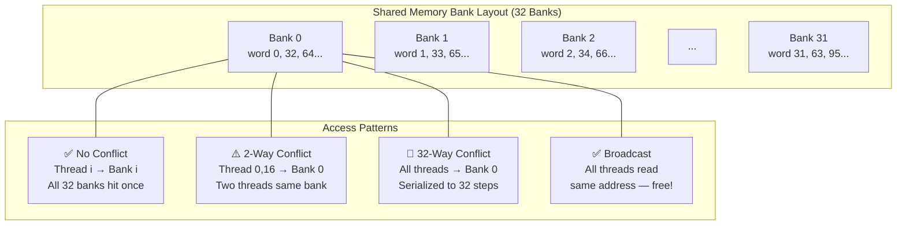
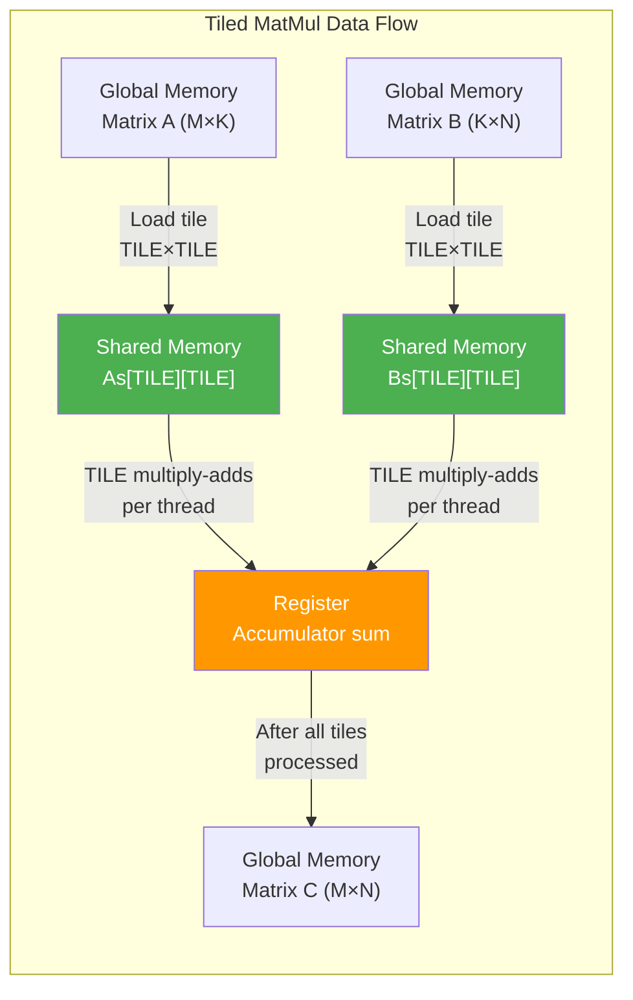
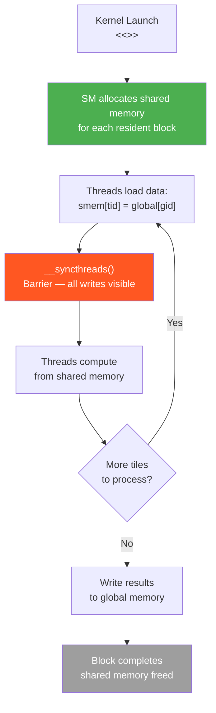

# Chapter 49: Shared Memory Mastery

`Tags: #CUDA #SharedMemory #BankConflicts #TiledMatMul #syncthreads #CooperativeGroups #GPU`

---

## 1. Theory — The On-Chip Scratchpad

Shared memory is a **software-managed, on-chip SRAM** located in each Streaming Multiprocessor (SM). Unlike L1/L2 caches that operate transparently, shared memory gives the programmer explicit control over what data lives close to the ALUs. On modern GPUs (Ampere, Hopper) the SM contains a **configurable pool** — typically 164 KB on A100 — split between L1 cache and shared memory at the programmer's discretion.

### Why Shared Memory Matters

| Property | Global Memory (HBM) | Shared Memory |
|---|---|---|
| Latency | ~400-800 cycles | ~20-30 cycles |
| Bandwidth per SM | ~50 GB/s slice | ~3-5 TB/s aggregate |
| Scope | All SMs | Single SM (block) |
| Programmer control | Implicit caching | Explicit load/store |
| Size | 16-80 GB | 48-228 KB per SM |

Shared memory is **20-40× lower latency** than global memory. Any kernel that reuses data across threads in a block should consider staging that data in shared memory first.

### What / Why / How

- **What**: An on-chip per-block memory space declared with `__shared__`.
- **Why**: Eliminates redundant global memory reads when multiple threads need the same data.
- **How**: Threads cooperatively load data from global → shared, synchronize with `__syncthreads()`, then compute from shared memory at near-register speed.

---

## 2. `__shared__` Variable Declarations

### Static Allocation

This kernel declares shared memory arrays with fixed sizes known at compile time. The `__shared__` keyword places the array in fast on-chip SRAM (~20 cycle latency) rather than slow global memory (~400 cycles). All threads in the block can read and write to these shared arrays.

```cuda
__global__ void kernel() {
    __shared__ float tile[32][32];   // Fixed at compile time — 4 KB
    __shared__ int counter;          // Single shared integer

    int tx = threadIdx.x, ty = threadIdx.y;
    tile[ty][tx] = 0.0f;
    __syncthreads();
}
```

Static shared memory is allocated per block when the kernel launches. The total across all `__shared__` variables must not exceed the SM's configured shared memory limit.

### Dynamic Allocation

When the shared memory size is not known at compile time, you declare it with `extern __shared__` and specify the byte count as the third argument in the kernel launch `<<<blocks, threads, smemBytes>>>`. This lets you adjust the allocation at runtime based on input size.

```cuda
extern __shared__ float smem[];   // Size determined at launch

__global__ void dynamicKernel(const float* input, int N) {
    int tid = threadIdx.x;
    if (tid < N)
        smem[tid] = input[tid];
    __syncthreads();
    // Use smem[...]
}

int main() {
    int N = 256;
    size_t smemBytes = N * sizeof(float);
    dynamicKernel<<<1, N, smemBytes>>>(d_input, N);  // 3rd arg = bytes
    return 0;
}
```

**Multiple dynamic arrays** require manual pointer arithmetic:

```cuda
extern __shared__ char rawSmem[];

__global__ void multiArray(int N, int M) {
    float* A = (float*)rawSmem;                  // offset 0
    int*   B = (int*)(rawSmem + N * sizeof(float)); // offset after A
    // Use A[0..N-1] and B[0..M-1]
}

// Launch: kernel<<<grid, block, N*sizeof(float) + M*sizeof(int)>>>(...);
```

---

## 3. Bank Conflicts Deep-Dive

Shared memory is organized into **32 banks**, each 4 bytes wide. Successive 4-byte words map to successive banks in round-robin order.

### Bank Layout

Shared memory addresses map to banks in round-robin order: bytes 0–3 go to bank 0, bytes 4–7 to bank 1, and so on through bank 31, then the pattern repeats starting at byte 128. When two threads in the same warp access the same bank (but different addresses), they must be serialized.

```
Address (bytes):  0    4    8    12  ...  124
Bank ID:          0    1    2    3   ...  31

Address (bytes):  128  132  136  140 ...  252
Bank ID:          0    1    2    3   ...  31
```



### Conflict Scenarios

**No conflict — stride 1 (sequential):**

With stride-1 access, each thread reads from a different bank (thread 0 → bank 0, thread 1 → bank 1, etc.), so all 32 accesses happen simultaneously with zero bank conflicts.

```cuda
__shared__ float s[1024];
float val = s[threadIdx.x];  // Thread i reads bank i → 0 conflicts
```

**2-way conflict — stride 2:**

With stride-2 access, every two threads hit the same bank (e.g., threads 0 and 16 both access bank 0), resulting in 2-way conflicts that halve the effective shared memory bandwidth.

```cuda
float val = s[threadIdx.x * 2];
// Thread 0→bank 0, Thread 1→bank 2, ..., Thread 16→bank 0 (conflict!)
// Two threads hit each even bank → 2-way conflict → 2× slower
```

**32-way conflict — stride 32:**

With stride-32 access, every 4-byte word lands on the same bank (bank 0 in this case). All 32 threads serialize on a single bank, making this access pattern 32× slower than an optimal conflict-free pattern.

```cuda
float val = s[threadIdx.x * 32];
// ALL threads hit bank 0! Fully serialized → 32× slower
```

**Broadcast — all read same address:**

When all threads read the exact same address, the hardware broadcasts the value to all threads in a single operation — no conflict. This is a special case: same address is free, but different addresses in the same bank cause conflicts.

```cuda
float val = s[0];  // All threads read exact same address → broadcast, FREE
```

### Bank Conflict Avoidance: The Padding Trick

For a 32×32 tile, column access creates 32-way conflicts:

```cuda
// PROBLEM: Column access has 32-way bank conflicts
__shared__ float tile[32][32];
float val = tile[threadIdx.x][col];  // stride-32 access!

// SOLUTION: Add 1 padding element per row
__shared__ float tile[32][32 + 1];   // 33 elements per row
float val = tile[threadIdx.x][col];  // Now stride-33 → spreads across banks
```

**Why padding works**: With 33 floats per row, thread `i` accesses word `i * 33 + col`. Since `33 mod 32 = 1`, consecutive rows map to consecutive banks — zero conflicts.

---

## 4. `__syncthreads()` — Thread Synchronization

`__syncthreads()` is a **block-level barrier**: every thread in the block must reach this point before any thread proceeds past it.

### When Required

You must call `__syncthreads()` whenever threads in a block cooperatively access shared memory — specifically, between a write phase and a subsequent read phase. These two examples show the pattern: sync after a cooperative load before reading neighbors, and sync after reads before overwriting.

```cuda
__shared__ float s[256];

// 1. After cooperative load (before reads)
s[tid] = globalData[tid];
__syncthreads();          // ALL threads must finish writing before ANY reads
float val = s[tid ^ 1];  // Read neighbor's value — safe now

// 2. Before overwriting shared memory
result[tid] = s[tid] + s[tid + 1];
__syncthreads();          // Ensure all reads complete before next write
s[tid] = newValue;
```

### The Conditional Pitfall — Undefined Behavior

Placing `__syncthreads()` inside a conditional that not all threads agree on causes deadlock or memory corruption. Some threads reach the barrier and wait forever while others skip it entirely. The barrier must be reached by all threads in the block, or by none.

```cuda
// ⚠️ UNDEFINED BEHAVIOR — never do this!
if (threadIdx.x < 128) {
    __syncthreads();   // Only half the threads reach this barrier!
}
// Some threads wait forever, others skip it → deadlock or corruption
```

**Rule**: If `__syncthreads()` is in a conditional, **every thread in the block** must evaluate the condition the same way.

```cuda
// ✅ SAFE: all threads enter the same branch
if (blockDim.x > 64) {     // Block-uniform condition — all or none
    __syncthreads();
}
```

---

## 5. Tiled Matrix Multiplication — Complete Worked Example

### Naive Matrix Multiply (No Shared Memory)

This naive matrix multiplication assigns one thread per output element of C. Each thread loops through an entire row of A and column of B, reading every element from slow global memory. For a 1024×1024 matrix, each output element requires 2048 global memory reads — making this approach extremely memory-bandwidth limited.

```cuda
// C[M×N] = A[M×K] × B[K×N]
__global__ void matmulNaive(const float* A, const float* B, float* C,
                            int M, int N, int K) {
    int row = blockIdx.y * blockDim.y + threadIdx.y;
    int col = blockIdx.x * blockDim.x + threadIdx.x;

    if (row < M && col < N) {
        float sum = 0.0f;
        for (int i = 0; i < K; ++i) {
            sum += A[row * K + i] * B[i * N + col];  // 2×K global reads!
        }
        C[row * N + col] = sum;
    }
}
```

**Problem**: Each element of C reads K values from A and K from B. In a 16×16 block, the **same B column tile** is read by all 16 threads in a row — 16× redundant global reads.

### Tiled Matrix Multiply

This tiled matrix multiplication dramatically reduces global memory traffic by loading small TILE×TILE sub-blocks into shared memory. All threads in a block cooperatively load one tile from A and one from B, synchronize, then compute partial dot products entirely from fast shared memory. This process repeats across all tiles. Each global memory load is reused TILE times, reducing traffic by 16×.

```cuda
#define TILE 16

__global__ void matmulTiled(const float* A, const float* B, float* C,
                            int M, int N, int K) {
    __shared__ float As[TILE][TILE];
    __shared__ float Bs[TILE][TILE];

    int row = blockIdx.y * TILE + threadIdx.y;
    int col = blockIdx.x * TILE + threadIdx.x;
    float sum = 0.0f;

    for (int t = 0; t < (K + TILE - 1) / TILE; ++t) {
        // Cooperative load: each thread loads one element
        int aCol = t * TILE + threadIdx.x;
        int bRow = t * TILE + threadIdx.y;

        As[threadIdx.y][threadIdx.x] = (row < M && aCol < K)
                                       ? A[row * K + aCol] : 0.0f;
        Bs[threadIdx.y][threadIdx.x] = (bRow < K && col < N)
                                       ? B[bRow * N + col]  : 0.0f;

        __syncthreads();  // Wait for tile to be fully loaded

        // Compute partial dot product from shared memory
        for (int i = 0; i < TILE; ++i) {
            sum += As[threadIdx.y][i] * Bs[i][threadIdx.x];
        }

        __syncthreads();  // Wait before loading next tile
    }

    if (row < M && col < N)
        C[row * N + col] = sum;
}
```



### Performance Analysis

| Metric | Naive | Tiled (TILE=16) | Improvement |
|---|---|---|---|
| Global loads per output element | 2K | 2K / TILE | **16× fewer** |
| Global memory bandwidth (K=1024, 1024×1024) | ~8 TB/s needed | ~0.5 TB/s needed | Achievable |
| Shared memory reuse factor | 0 | TILE = 16 | — |

### Tile Size Selection Strategy

- **TILE=16**: 256 threads/block, 2×16×16×4 = 2 KB shared memory. Safe default.
- **TILE=32**: 1024 threads/block, 8 KB shared memory. Maximum occupancy risk.
- **Match warp size**: TILE should be a multiple of 32 or divide evenly into it.
- **Occupancy check**: Use `cudaOccupancyMaxActiveBlocksPerMultiprocessor`.

---

## 6. Cooperative Groups — Modern Synchronization

Cooperative Groups (CUDA 9+) provide a **type-safe, flexible** synchronization API.

This kernel uses the modern Cooperative Groups API as a type-safe alternative to `__syncthreads()` and raw warp intrinsics. `cg::this_thread_block()` represents the block, and `cg::tiled_partition<32>()` splits it into warp-sized tiles. The `warp.shfl_down()` method performs the same shuffle operation as `__shfl_down_sync` but with compile-time safety guarantees.

```cuda
#include <cooperative_groups.h>
namespace cg = cooperative_groups;

__global__ void coopGroupKernel(float* data, int N) {
    cg::thread_block block = cg::this_thread_block();  // Replaces implicit block
    cg::thread_block_tile<32> warp = cg::tiled_partition<32>(block);

    __shared__ float smem[256];
    int tid = block.thread_rank();

    smem[tid] = data[tid];
    block.sync();            // Equivalent to __syncthreads() — but type-safe

    // Sub-block synchronization — only threads in this warp-tile sync
    float val = smem[tid];
    for (int offset = warp.size() / 2; offset > 0; offset /= 2) {
        val += warp.shfl_down(val, offset);  // Warp-level reduction
    }

    if (warp.thread_rank() == 0) {
        data[block.thread_rank() / 32] = val;
    }
}
```

**Advantages over `__syncthreads()`**:
- Compile-time partition sizes catch bugs early.
- Sub-block synchronization — sync just a warp or sub-warp.
- Grid-level sync for cooperative kernel launches.

---

## 7. Shared Memory as Software-Managed Cache

### Pattern: Sliding Window

This 1D stencil kernel demonstrates the 'halo' pattern for shared memory. Each block loads its elements plus R extra elements on each side (the 'halo' or 'ghost' region) from neighboring blocks' data. After synchronizing, each thread can compute a local average of its 2R+1 neighbors entirely from shared memory, avoiding redundant global memory reads.

```cuda
__global__ void stencil1D(const float* in, float* out, int N, int R) {
    extern __shared__ float smem[];
    int gid = blockIdx.x * blockDim.x + threadIdx.x;
    int lid = threadIdx.x + R;  // Local index with halo offset

    // Load center elements
    if (gid < N) smem[lid] = in[gid];

    // Load left halo
    if (threadIdx.x < R && gid >= R)
        smem[lid - R] = in[gid - R]; // actually threadIdx.x

    // Load right halo
    if (threadIdx.x >= blockDim.x - R && gid + R < N)
        smem[lid + R] = in[gid + R];

    __syncthreads();

    // Compute stencil from shared memory — R neighbors each side
    if (gid < N) {
        float sum = 0.0f;
        for (int i = -R; i <= R; ++i)
            sum += smem[lid + i];
        out[gid] = sum / (2 * R + 1);
    }
}
```

### Pattern: Histogram in Shared Memory

This histogram kernel uses shared memory to minimize expensive global atomic operations. Each block first builds a local histogram in shared memory using fast shared-memory atomics, then merges the block-level results into the global histogram with one atomic per bin. This reduces global atomics from N (one per element) to `num_blocks × num_bins`.

```cuda
__global__ void histogram(const int* data, int* hist, int N, int bins) {
    extern __shared__ int localHist[];

    // Initialize local histogram
    for (int i = threadIdx.x; i < bins; i += blockDim.x)
        localHist[i] = 0;
    __syncthreads();

    // Accumulate into shared memory (atomic within block — fast)
    int idx = blockIdx.x * blockDim.x + threadIdx.x;
    if (idx < N)
        atomicAdd(&localHist[data[idx]], 1);
    __syncthreads();

    // Merge into global histogram (atomic across blocks)
    for (int i = threadIdx.x; i < bins; i += blockDim.x)
        atomicAdd(&hist[i], localHist[i]);
}
```

---

## 8. Shared Memory Lifecycle



---

## 9. Exercises

### 🟢 Beginner

1. Write a kernel that loads an array of 256 floats into shared memory and reverses it in-place (element 0 ↔ element 255, etc.). Verify by copying back to host.

2. Declare both static and dynamic shared memory arrays in the same kernel. Load integers into the static array and floats into the dynamic array. Print values from thread 0.

### 🟡 Intermediate

3. Implement the **tiled matrix multiply** kernel for arbitrary M, N, K (not just multiples of TILE). Handle boundary conditions. Verify against a CPU reference for a 100×200 × 200×150 multiply.

4. Write a kernel that demonstrates a **32-way bank conflict** and another that avoids it using padding. Use `nvprof` or Nsight Compute to measure `shared_load_transactions` and confirm the difference.

### 🔴 Advanced

5. Implement a **double-buffered tiled matrix multiply**: while computing from tile `t`, pre-load tile `t+1` into a second shared memory buffer. Measure the speedup on a 2048×2048 multiply.

---

## 10. Solutions

### Solution 1 (🟢 Reverse Array)

This kernel reverses an array using shared memory as a staging area. Each thread loads element `i` into shared memory position `i`, all threads synchronize, then each thread reads from the mirrored position `255 - i`. The synchronization barrier ensures all elements are loaded before any thread reads from a different position.

```cuda
#include <cstdio>

__global__ void reverseArray(float* d_out, const float* d_in) {
    __shared__ float smem[256];
    int tid = threadIdx.x;

    smem[tid] = d_in[tid];
    __syncthreads();

    d_out[tid] = smem[255 - tid];
}

int main() {
    float h_in[256], h_out[256];
    for (int i = 0; i < 256; i++) h_in[i] = (float)i;

    float *d_in, *d_out;
    cudaMalloc(&d_in, 256 * sizeof(float));
    cudaMalloc(&d_out, 256 * sizeof(float));
    cudaMemcpy(d_in, h_in, 256 * sizeof(float), cudaMemcpyHostToDevice);

    reverseArray<<<1, 256>>>(d_out, d_in);

    cudaMemcpy(h_out, d_out, 256 * sizeof(float), cudaMemcpyDeviceToHost);
    printf("First: %.0f  Last: %.0f\n", h_out[0], h_out[255]); // 255, 0

    cudaFree(d_in); cudaFree(d_out);
    return 0;
}
```

### Solution 3 (🟡 Tiled MatMul with Boundary Handling)

This complete tiled matrix multiplication handles matrices whose dimensions are not multiples of the tile size. The boundary check `(row < M && aCol < K)` fills out-of-bounds positions with zero, ensuring correct results for any matrix dimensions. The CPU reference multiplication verifies the GPU result.

```cuda
#include <cstdio>
#include <cmath>

#define TILE 16

__global__ void matmulTiled(const float* A, const float* B, float* C,
                            int M, int N, int K) {
    __shared__ float As[TILE][TILE];
    __shared__ float Bs[TILE][TILE];

    int row = blockIdx.y * TILE + threadIdx.y;
    int col = blockIdx.x * TILE + threadIdx.x;
    float sum = 0.0f;

    for (int t = 0; t < (K + TILE - 1) / TILE; ++t) {
        int aCol = t * TILE + threadIdx.x;
        int bRow = t * TILE + threadIdx.y;

        As[threadIdx.y][threadIdx.x] = (row < M && aCol < K)
                                       ? A[row * K + aCol] : 0.0f;
        Bs[threadIdx.y][threadIdx.x] = (bRow < K && col < N)
                                       ? B[bRow * N + col]  : 0.0f;
        __syncthreads();

        for (int i = 0; i < TILE; ++i)
            sum += As[threadIdx.y][i] * Bs[i][threadIdx.x];
        __syncthreads();
    }

    if (row < M && col < N)
        C[row * N + col] = sum;
}

int main() {
    int M = 100, N = 150, K = 200;
    size_t sA = M * K * sizeof(float), sB = K * N * sizeof(float);
    size_t sC = M * N * sizeof(float);

    float *hA = new float[M*K], *hB = new float[K*N];
    float *hC = new float[M*N], *hRef = new float[M*N];

    for (int i = 0; i < M*K; i++) hA[i] = (float)(i % 7);
    for (int i = 0; i < K*N; i++) hB[i] = (float)(i % 5);

    // CPU reference
    for (int i = 0; i < M; i++)
        for (int j = 0; j < N; j++) {
            float s = 0;
            for (int k = 0; k < K; k++) s += hA[i*K+k] * hB[k*N+j];
            hRef[i*N+j] = s;
        }

    float *dA, *dB, *dC;
    cudaMalloc(&dA, sA); cudaMalloc(&dB, sB); cudaMalloc(&dC, sC);
    cudaMemcpy(dA, hA, sA, cudaMemcpyHostToDevice);
    cudaMemcpy(dB, hB, sB, cudaMemcpyHostToDevice);

    dim3 block(TILE, TILE);
    dim3 grid((N + TILE - 1) / TILE, (M + TILE - 1) / TILE);
    matmulTiled<<<grid, block>>>(dA, dB, dC, M, N, K);

    cudaMemcpy(hC, dC, sC, cudaMemcpyDeviceToHost);

    float maxErr = 0;
    for (int i = 0; i < M*N; i++)
        maxErr = fmax(maxErr, fabs(hC[i] - hRef[i]));
    printf("Max error: %e\n", maxErr);  // Should be ~1e-3 or less

    cudaFree(dA); cudaFree(dB); cudaFree(dC);
    delete[] hA; delete[] hB; delete[] hC; delete[] hRef;
    return 0;
}
```

---

## 11. Quiz

**Q1**: How many banks does CUDA shared memory have?
**(a)** 16 **(b)** 32 ✅ **(c)** 64 **(d)** Depends on compute capability

**Q2**: What happens when all 32 threads in a warp read the **exact same** shared memory address?
**(a)** 32-way bank conflict **(b)** Broadcast — no conflict ✅ **(c)** Undefined behavior **(d)** Compiler error

**Q3**: Why is `__syncthreads()` inside a divergent `if` dangerous?
**(a)** It wastes cycles **(b)** It causes undefined behavior — some threads may never reach the barrier ✅ **(c)** It's fine as long as one warp reaches it **(d)** The compiler removes it

**Q4**: In tiled matrix multiply with TILE=16, how many times is each element loaded from global memory compared to the naive version?
**(a)** Same number **(b)** 16× fewer ✅ **(c)** 32× fewer **(d)** 2× fewer

**Q5**: What does the padding trick `float tile[32][33]` prevent?
**(a)** Warp divergence **(b)** Register spilling **(c)** Bank conflicts during column access ✅ **(d)** Cache misses

**Q6**: Dynamic shared memory size is specified via:
**(a)** Template parameter **(b)** Third argument of `<<<>>>` launch syntax ✅ **(c)** `cudaMalloc` **(d)** `#pragma` directive

**Q7**: Cooperative Groups' `thread_block_tile<32>` is most similar to:
**(a)** A grid **(b)** A warp ✅ **(c)** A block **(d)** An SM

---

## 12. Key Takeaways

1. Shared memory delivers **20-40× lower latency** than global memory — always stage reused data.
2. **Bank conflicts** serialize accesses — use stride-1 patterns or padding to avoid them.
3. `__syncthreads()` must be **reached by every thread** in the block — never put it in divergent branches.
4. **Tiled matrix multiply** reduces global memory traffic by a factor of TILE — foundational GPU optimization.
5. **Cooperative Groups** provide type-safe, flexible synchronization for modern CUDA code.
6. Dynamic shared memory enables **runtime-configurable** buffer sizes via the launch configuration.

---

## 13. Chapter Summary

This chapter explored CUDA shared memory from silicon-level bank architecture through practical optimization patterns. We covered static and dynamic allocation, dissected bank conflicts with quantitative analysis, implemented a complete tiled matrix multiplication with boundary handling, and introduced Cooperative Groups as the modern synchronization API. Shared memory is the single most impactful optimization tool in the CUDA programmer's arsenal — transforming memory-bound kernels into compute-bound ones by eliminating redundant global memory traffic.

---

## 14. Real-World AI/ML Insight

**Every high-performance GEMM library** (cuBLAS, CUTLASS) is built on tiled shared memory algorithms. When PyTorch calls `torch.matmul`, it dispatches to CUTLASS kernels that use **multi-level tiling** — block-level tiles in shared memory, warp-level tiles in registers — to achieve >90% of peak FLOPS. The tiled matmul pattern from this chapter is the conceptual foundation of every attention layer in Transformers, every convolutional layer in CNNs, and every linear layer in neural networks.

---

## 15. Common Mistakes

| Mistake | Consequence | Fix |
|---|---|---|
| Missing `__syncthreads()` after cooperative load | Race condition — read stale data | Always sync between store and load phases |
| `__syncthreads()` in divergent `if` | Deadlock or undefined behavior | Use block-uniform conditions only |
| Stride-32 access pattern | 32-way bank conflict, 32× slowdown | Pad arrays: `[N][N+1]` |
| Exceeding shared memory limit | Kernel fails to launch (silent failure!) | Check `cudaGetLastError()` after launch |
| Forgetting boundary checks in tiled matmul | Garbage values for non-tile-multiple sizes | Guard loads with `(row < M && col < K)` |

---

## 16. Interview Questions

**Q1: Explain how bank conflicts work and how you would detect and fix them.**

**A**: Shared memory has 32 banks mapped round-robin (bank = `(address / 4) % 32`). A bank conflict occurs when two or more threads in the same warp access different addresses in the same bank — the accesses serialize. I detect them using Nsight Compute's `l1tex__data_bank_conflicts_pipe_lsu_mem_shared` metric. I fix them by using stride-1 access patterns, or adding padding (`array[N][N+1]`) so that column accesses hit different banks. The exception is broadcast: if all threads read the *same* address, there's no conflict.

**Q2: Walk through how tiled matrix multiply reduces memory traffic.**

**A**: In the naive approach, computing one element of C requires reading K elements from a row of A and K elements from a column of B — all from global memory. In a block of TILE×TILE threads, each thread loads one element of A and one of B into shared memory. Then all TILE threads in a row share the same tile of B, and all TILE threads in a column share the same tile of A. Each global load is reused TILE times, reducing total global loads by a factor of TILE (typically 16-32×).

**Q3: When is dynamic shared memory preferable to static shared memory?**

**A**: Dynamic is preferred when the size depends on runtime parameters (input dimensions, tile size selected via occupancy calculator, or when multiple kernels share the same code with different buffer sizes). Static is simpler and preferred when the size is a compile-time constant.

**Q4: What's the difference between `__syncthreads()` and cooperative groups `block.sync()`?**

**A**: Functionally identical — both are full-block barriers. But Cooperative Groups provides: (1) type safety — you sync a named group, not an implicit context; (2) sub-block sync — you can sync a `thread_block_tile<32>` (warp) or `tile<16>` without blocking the whole block; (3) grid-level sync for cooperative kernel launches. The `__syncthreads()` API has no equivalent for partial synchronization.

**Q5: How much shared memory can a single block use? What limits it?**

**A**: The maximum is the SM's shared memory capacity (e.g., 48 KB default on Ampere, configurable up to 164 KB on A100 via `cudaFuncSetAttribute`). However, using more shared memory per block reduces occupancy — fewer blocks can be resident on the SM simultaneously. The occupancy calculator helps find the sweet spot between shared memory usage and parallelism.
