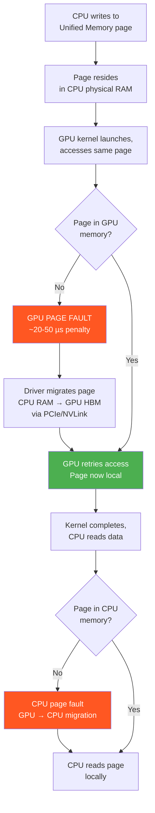
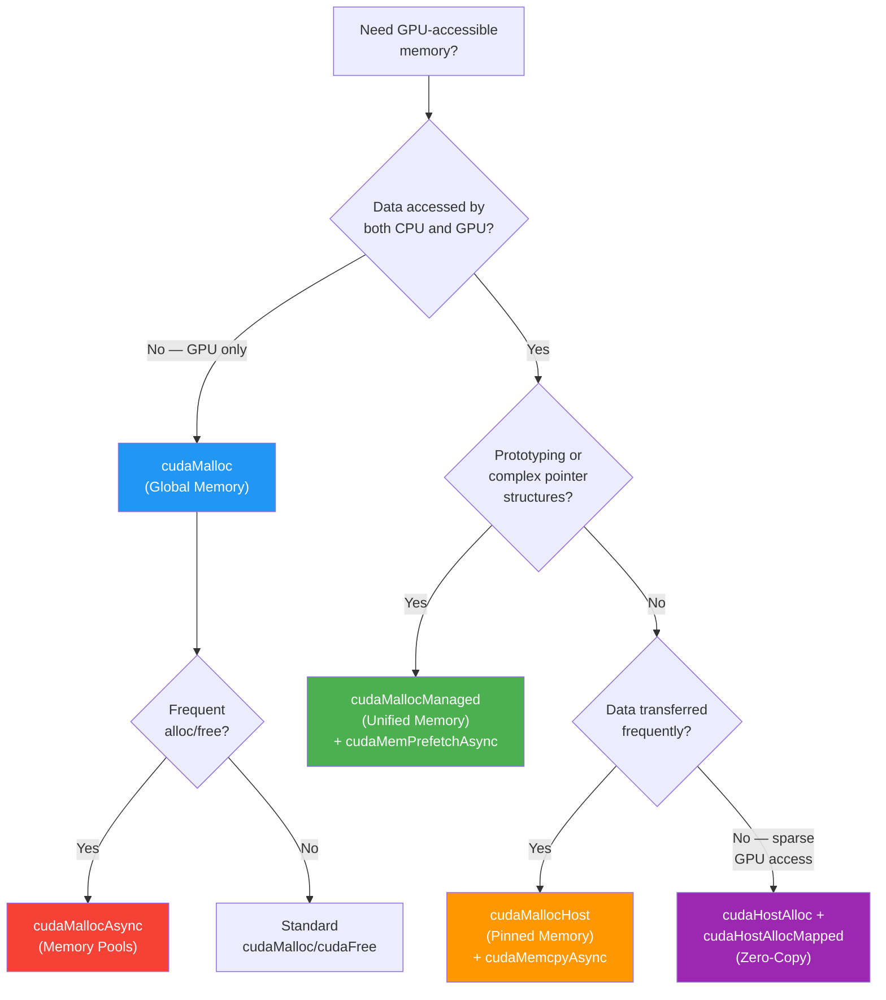

# Chapter 50: CUDA Memory Management Patterns

`Tags: #CUDA #UnifiedMemory #PinnedMemory #ZeroCopy #MemoryPools #cudaMallocManaged #cudaMallocHost #GPU`

---

## 1. Theory — The GPU Memory Landscape

CUDA exposes multiple memory spaces, each with different allocation strategies, transfer semantics, and performance characteristics. Choosing the right memory management pattern is often **the single largest performance lever** in a CUDA application — more impactful than kernel optimization.

### The Memory Hierarchy

| Memory Type | Location | Managed By | Latency | Bandwidth | Use Case |
|---|---|---|---|---|---|
| Global (cudaMalloc) | GPU DRAM (HBM) | Programmer | ~400 cycles | ~2 TB/s (A100) | Default GPU buffers |
| Unified (cudaMallocManaged) | Auto-migrated | Driver/OS | Variable | Auto-paged | Prototyping, mixed access |
| Pinned (cudaMallocHost) | Host RAM (locked) | Programmer | ~10 µs DMA | ~26 GB/s (PCIe 4) | Fast H2D/D2H transfers |
| Zero-Copy (cudaHostAlloc+mapped) | Host RAM | Hardware | ~2-10 µs | ~26 GB/s max | Sparse GPU access |
| Pool (cudaMallocAsync) | GPU DRAM | Stream-ordered | ~0 alloc overhead | Same as global | Repeated alloc/free |

### What / Why / How

- **What**: Different APIs for allocating memory accessible by CPU, GPU, or both.
- **Why**: PCIe/NVLink bandwidth is 10-100× less than GPU memory bandwidth — minimizing transfers and choosing the right allocation strategy is critical.
- **How**: Select the appropriate `cudaMalloc*` variant based on access pattern, transfer frequency, and latency requirements.

---

## 2. Unified Memory — `cudaMallocManaged`

Unified Memory (UM) creates a **single address space** accessible from both CPU and GPU. The CUDA driver automatically migrates pages on demand.

### Basic Usage

```cuda
#include <cstdio>

__global__ void doubleValues(float* data, int N) {
    int idx = blockIdx.x * blockDim.x + threadIdx.x;
    if (idx < N)
        data[idx] *= 2.0f;
}

int main() {
    int N = 1 << 20;
    float* data;

    // Single allocation — accessible from both CPU and GPU
    cudaMallocManaged(&data, N * sizeof(float));

    // Initialize on CPU — no explicit transfer needed
    for (int i = 0; i < N; i++)
        data[i] = (float)i;

    doubleValues<<<(N + 255) / 256, 256>>>(data, N);
    cudaDeviceSynchronize();  // MUST sync before CPU access

    printf("data[42] = %.0f\n", data[42]);  // 84.0 — just works

    cudaFree(data);
    return 0;
}
```

### Page Fault Mechanism



### When UM Is Good Enough vs. Explicit Management

| Scenario | UM Verdict | Reason |
|---|---|---|
| Prototyping / correctness first | ✅ Use UM | Simplicity, no transfer bugs |
| Large data, full GPU processing | ⚠️ Measure first | Page faults may add 10-30% overhead |
| Streaming pipeline (H2D → compute → D2H) | ❌ Use explicit | Predictable transfer overlap |
| Multi-GPU | ⚠️ With prefetch hints | Need `cudaMemPrefetchAsync` |
| Sparse/irregular GPU access | ✅ Use UM | Only touched pages migrate |

### Oversubscription

On Pascal+ GPUs, UM supports **oversubscription** — allocating more than GPU memory. Pages evict to CPU RAM as needed. This enables processing datasets larger than VRAM, though with significant performance cost.

---

## 3. Pinned Memory — `cudaMallocHost`

Page-locked (pinned) memory **cannot be swapped out** by the OS. This enables the GPU's DMA engine to transfer data without going through a CPU staging buffer.

### Why Pinned Memory Is Faster

```
PAGEABLE transfer path:
  Host pageable buffer → OS pins to staging buffer → DMA to GPU
  (extra memcpy on CPU side, ~2× slower)

PINNED transfer path:
  Host pinned buffer → DMA directly to GPU
  (zero CPU involvement after setup, full PCIe bandwidth)
```

### Code Example — Pinned vs. Pageable Comparison

```cuda
#include <cstdio>
#include <cuda_runtime.h>

void benchTransfer(const char* label, float* h_data, float* d_data,
                   size_t bytes, int iters) {
    cudaEvent_t start, stop;
    cudaEventCreate(&start); cudaEventCreate(&stop);

    cudaEventRecord(start);
    for (int i = 0; i < iters; i++)
        cudaMemcpy(d_data, h_data, bytes, cudaMemcpyHostToDevice);
    cudaEventRecord(stop);
    cudaEventSynchronize(stop);

    float ms;
    cudaEventElapsedTime(&ms, start, stop);
    float gbps = (float)bytes * iters / (ms * 1e6);
    printf("%s: %.2f GB/s (%.2f ms total)\n", label, gbps, ms);

    cudaEventDestroy(start); cudaEventDestroy(stop);
}

int main() {
    size_t bytes = 256 * 1024 * 1024;  // 256 MB
    int iters = 10;

    // Pageable allocation
    float* h_pageable = (float*)malloc(bytes);

    // Pinned allocation
    float* h_pinned;
    cudaMallocHost(&h_pinned, bytes);

    float* d_data;
    cudaMalloc(&d_data, bytes);

    benchTransfer("Pageable", h_pageable, d_data, bytes, iters);
    benchTransfer("Pinned  ", h_pinned,   d_data, bytes, iters);

    // Typical result: Pageable ~12 GB/s, Pinned ~24 GB/s (PCIe 4.0 x16)

    free(h_pageable);
    cudaFreeHost(h_pinned);
    cudaFree(d_data);
    return 0;
}
```

### `cudaHostAlloc` Flags

```cuda
float* h_ptr;

// Portable: accessible from any CUDA context (multi-GPU)
cudaHostAlloc(&h_ptr, bytes, cudaHostAllocPortable);

// Mapped: creates a device pointer for zero-copy access
cudaHostAlloc(&h_ptr, bytes, cudaHostAllocMapped);

// Write-Combined: optimized for CPU writes, GPU reads (non-cacheable on CPU)
cudaHostAlloc(&h_ptr, bytes, cudaHostAllocWriteCombined);

// Combine flags
cudaHostAlloc(&h_ptr, bytes,
              cudaHostAllocMapped | cudaHostAllocPortable);
```

### Caution: Pinned Memory Limits

Pinned memory reduces the OS's available pageable RAM. Over-allocating pinned memory can cause system instability. Rule of thumb: **pin at most 50% of system RAM**.

---

## 4. Zero-Copy Memory

Zero-copy allows the GPU to **directly access host memory** over PCIe/NVLink without explicit `cudaMemcpy`. Useful when GPU touches data only once or accesses a tiny fraction.

```cuda
#include <cstdio>

__global__ void sparseAccess(const float* mapped, float* result,
                             const int* indices, int N) {
    int idx = blockIdx.x * blockDim.x + threadIdx.x;
    if (idx < N)
        result[idx] = mapped[indices[idx]];  // Access host RAM from GPU
}

int main() {
    int N = 1024;
    size_t bigSize = 1ULL << 30;  // 1 GB on host

    // Allocate mapped host memory
    float* h_big;
    cudaHostAlloc(&h_big, bigSize, cudaHostAllocMapped);
    for (size_t i = 0; i < bigSize / sizeof(float); i++)
        h_big[i] = (float)i;

    // Get device pointer for mapped memory
    float* d_big;
    cudaHostGetDevicePointer(&d_big, h_big, 0);

    // Only access 1024 elements out of 256M — zero-copy wins here
    int h_indices[1024];
    for (int i = 0; i < N; i++) h_indices[i] = i * 1000;

    int* d_indices;
    float* d_result;
    cudaMalloc(&d_indices, N * sizeof(int));
    cudaMalloc(&d_result, N * sizeof(float));
    cudaMemcpy(d_indices, h_indices, N * sizeof(int), cudaMemcpyHostToDevice);

    sparseAccess<<<(N + 255) / 256, 256>>>(d_big, d_result, d_indices, N);
    cudaDeviceSynchronize();

    cudaFree(d_indices); cudaFree(d_result);
    cudaFreeHost(h_big);
    return 0;
}
```

**When zero-copy wins**: Sparse access to large host datasets where copying the entire dataset would waste bandwidth. **When it loses**: Dense access patterns — every read pays PCIe latency.

---

## 5. Memory Pools — `cudaMallocAsync`

CUDA 11.2+ introduced **stream-ordered memory allocation**. Instead of calling `cudaMalloc/cudaFree` (which synchronize the device), `cudaMallocAsync/cudaFreeAsync` use a pool and are **fully asynchronous**.

```cuda
#include <cstdio>

__global__ void compute(float* buf, int N) {
    int idx = blockIdx.x * blockDim.x + threadIdx.x;
    if (idx < N) buf[idx] = sqrtf((float)idx);
}

int main() {
    cudaStream_t stream;
    cudaStreamCreate(&stream);

    int N = 1 << 20;
    float* d_buf;

    // Allocate on stream — no device sync, near-zero overhead
    cudaMallocAsync(&d_buf, N * sizeof(float), stream);

    compute<<<(N + 255) / 256, 256, 0, stream>>>(d_buf, N);

    // Free on stream — doesn't actually free, returns to pool
    cudaFreeAsync(d_buf, stream);

    // Pool reuses memory on next cudaMallocAsync in same stream
    float* d_buf2;
    cudaMallocAsync(&d_buf2, N * sizeof(float), stream);
    compute<<<(N + 255) / 256, 256, 0, stream>>>(d_buf2, N);
    cudaFreeAsync(d_buf2, stream);

    cudaStreamSynchronize(stream);
    cudaStreamDestroy(stream);
    return 0;
}
```

### Pool Configuration

```cuda
cudaMemPool_t pool;
cudaDeviceGetDefaultMemPool(&pool, 0);

// Set pool to keep up to 512 MB of freed memory for reuse
uint64_t threshold = 512ULL * 1024 * 1024;
cudaMemPoolSetAttribute(pool, cudaMemPoolAttrReleaseThreshold, &threshold);
```

**Performance impact**: In workloads with frequent alloc/free (e.g., dynamic neural network shapes), pools eliminate the synchronization overhead of `cudaMalloc`, yielding 10-100× faster allocation.

---

## 6. `cudaMemPrefetchAsync` — Proactive Migration

For Unified Memory, you can **prefetch pages** to a device before the kernel needs them, eliminating page faults.

```cuda
int N = 1 << 22;
float* data;
cudaMallocManaged(&data, N * sizeof(float));

// Initialize on CPU
for (int i = 0; i < N; i++) data[i] = (float)i;

// Prefetch to GPU before kernel launch — pages migrate in bulk
cudaMemPrefetchAsync(data, N * sizeof(float), /*device=*/0);

myKernel<<<grid, block>>>(data, N);
cudaDeviceSynchronize();

// Prefetch back to CPU before host access
cudaMemPrefetchAsync(data, N * sizeof(float), cudaCpuDeviceId);
printf("data[0] = %.0f\n", data[0]);
```

**Why prefetch matters**: Without it, the first GPU access to each 64 KB page triggers a fault (~20-50 µs). With prefetch, pages migrate in bulk via DMA — achieving near-explicit-transfer performance while keeping UM's programming simplicity.

---

## 7. `cudaMemAdvise` — Hints for the Driver

```cuda
float* data;
cudaMallocManaged(&data, N * sizeof(float));

// Hint: data will mostly live on GPU 0
cudaMemAdvise(data, N * sizeof(float), cudaMemAdviseSetPreferredLocation, 0);

// Hint: CPU will also access this data (creates read-only mapping)
cudaMemAdvise(data, N * sizeof(float), cudaMemAdviseSetAccessedBy, cudaCpuDeviceId);

// Hint: data is read-mostly — driver creates read replicas
cudaMemAdvise(data, N * sizeof(float), cudaMemAdviseSetReadMostly, 0);
```

| Hint | Effect |
|---|---|
| `SetPreferredLocation(dev)` | Pages prefer to reside on `dev`; migrate back after use elsewhere |
| `SetAccessedBy(dev)` | Creates direct mapping so `dev` can access without migration |
| `SetReadMostly` | Creates read-only copies on accessing devices; writes invalidate copies |

---

## 8. Memory Management Decision Tree



---

## 9. Practical Benchmark — UM vs. Explicit vs. Pinned

```cuda
#include <cstdio>
#include <cuda_runtime.h>

__global__ void saxpy(float a, const float* x, float* y, int N) {
    int i = blockIdx.x * blockDim.x + threadIdx.x;
    if (i < N) y[i] = a * x[i] + y[i];
}

float benchExplicit(int N, int iters) {
    size_t bytes = N * sizeof(float);
    float *h_x, *h_y, *d_x, *d_y;

    cudaMallocHost(&h_x, bytes);
    cudaMallocHost(&h_y, bytes);
    cudaMalloc(&d_x, bytes);
    cudaMalloc(&d_y, bytes);

    for (int i = 0; i < N; i++) { h_x[i] = 1.0f; h_y[i] = 2.0f; }

    cudaEvent_t start, stop;
    cudaEventCreate(&start); cudaEventCreate(&stop);
    cudaEventRecord(start);

    for (int it = 0; it < iters; it++) {
        cudaMemcpy(d_x, h_x, bytes, cudaMemcpyHostToDevice);
        cudaMemcpy(d_y, h_y, bytes, cudaMemcpyHostToDevice);
        saxpy<<<(N+255)/256, 256>>>(2.0f, d_x, d_y, N);
        cudaMemcpy(h_y, d_y, bytes, cudaMemcpyDeviceToHost);
    }

    cudaEventRecord(stop); cudaEventSynchronize(stop);
    float ms; cudaEventElapsedTime(&ms, start, stop);

    cudaFreeHost(h_x); cudaFreeHost(h_y);
    cudaFree(d_x); cudaFree(d_y);
    cudaEventDestroy(start); cudaEventDestroy(stop);
    return ms;
}

float benchUnifiedNaive(int N, int iters) {
    size_t bytes = N * sizeof(float);
    float *x, *y;
    cudaMallocManaged(&x, bytes);
    cudaMallocManaged(&y, bytes);

    for (int i = 0; i < N; i++) { x[i] = 1.0f; y[i] = 2.0f; }

    cudaEvent_t start, stop;
    cudaEventCreate(&start); cudaEventCreate(&stop);
    cudaEventRecord(start);

    for (int it = 0; it < iters; it++) {
        saxpy<<<(N+255)/256, 256>>>(2.0f, x, y, N);
        cudaDeviceSynchronize();
    }

    cudaEventRecord(stop); cudaEventSynchronize(stop);
    float ms; cudaEventElapsedTime(&ms, start, stop);

    cudaFree(x); cudaFree(y);
    cudaEventDestroy(start); cudaEventDestroy(stop);
    return ms;
}

float benchUnifiedPrefetch(int N, int iters) {
    size_t bytes = N * sizeof(float);
    float *x, *y;
    cudaMallocManaged(&x, bytes);
    cudaMallocManaged(&y, bytes);

    for (int i = 0; i < N; i++) { x[i] = 1.0f; y[i] = 2.0f; }

    cudaEvent_t start, stop;
    cudaEventCreate(&start); cudaEventCreate(&stop);
    cudaEventRecord(start);

    for (int it = 0; it < iters; it++) {
        cudaMemPrefetchAsync(x, bytes, 0);
        cudaMemPrefetchAsync(y, bytes, 0);
        saxpy<<<(N+255)/256, 256>>>(2.0f, x, y, N);
        cudaDeviceSynchronize();
    }

    cudaEventRecord(stop); cudaEventSynchronize(stop);
    float ms; cudaEventElapsedTime(&ms, start, stop);

    cudaFree(x); cudaFree(y);
    cudaEventDestroy(start); cudaEventDestroy(stop);
    return ms;
}

int main() {
    int N = 1 << 22;  // ~16 MB
    int iters = 100;

    float t1 = benchExplicit(N, iters);
    float t2 = benchUnifiedNaive(N, iters);
    float t3 = benchUnifiedPrefetch(N, iters);

    printf("Explicit (pinned):       %.2f ms\n", t1);
    printf("Unified (naive):         %.2f ms\n", t2);
    printf("Unified (with prefetch): %.2f ms\n", t3);

    return 0;
}
```

**Typical results** (A100, PCIe):

| Method | Time (100 iters) | Notes |
|---|---|---|
| Explicit + pinned | ~120 ms | Fastest, most boilerplate |
| Unified naive | ~180 ms | Page faults on first access each iter |
| Unified + prefetch | ~130 ms | Near-explicit with UM simplicity |

---

## 10. Exercises

### 🟢 Beginner

1. Allocate an array with `cudaMallocManaged`, fill it on the CPU, run a kernel to double each element, and read results on the CPU. Verify correctness.

2. Compare `cudaMemcpy` speed with pageable vs. pinned host memory for 512 MB of data. Print bandwidth in GB/s.

### 🟡 Intermediate

3. Implement a SAXPY benchmark that compares all three strategies (explicit, UM naive, UM + prefetch) for array sizes from 1 MB to 1 GB. Plot results.

4. Use `cudaMallocAsync` / `cudaFreeAsync` in a loop that allocates, computes, and frees 1000 times. Compare wall-clock time against standard `cudaMalloc` / `cudaFree`.

### 🔴 Advanced

5. Implement a multi-GPU data pipeline using Unified Memory with `cudaMemAdvise(SetPreferredLocation)` and `cudaMemPrefetchAsync` to migrate data between two GPUs. Measure bandwidth vs. explicit `cudaMemcpyPeer`.

---

## 11. Solutions

### Solution 1 (🟢 Unified Memory Basics)

```cuda
#include <cstdio>

__global__ void doubleIt(float* data, int N) {
    int i = blockIdx.x * blockDim.x + threadIdx.x;
    if (i < N) data[i] *= 2.0f;
}

int main() {
    int N = 1024;
    float* data;
    cudaMallocManaged(&data, N * sizeof(float));

    for (int i = 0; i < N; i++) data[i] = (float)i;

    doubleIt<<<(N + 255) / 256, 256>>>(data, N);
    cudaDeviceSynchronize();

    int pass = 1;
    for (int i = 0; i < N; i++)
        if (data[i] != (float)(i * 2)) { pass = 0; break; }

    printf("Test %s\n", pass ? "PASSED" : "FAILED");
    cudaFree(data);
    return 0;
}
```

### Solution 4 (🟡 Memory Pool Performance)

```cuda
#include <cstdio>
#include <chrono>

__global__ void touch(float* buf, int N) {
    int i = blockIdx.x * blockDim.x + threadIdx.x;
    if (i < N) buf[i] = 1.0f;
}

int main() {
    int N = 1 << 16;
    int iters = 1000;
    cudaStream_t stream;
    cudaStreamCreate(&stream);

    // Standard cudaMalloc/cudaFree
    auto t0 = std::chrono::high_resolution_clock::now();
    for (int i = 0; i < iters; i++) {
        float* buf;
        cudaMalloc(&buf, N * sizeof(float));
        touch<<<(N+255)/256, 256>>>(buf, N);
        cudaFree(buf);
    }
    cudaDeviceSynchronize();
    auto t1 = std::chrono::high_resolution_clock::now();
    float ms_std = std::chrono::duration<float, std::milli>(t1 - t0).count();

    // cudaMallocAsync/cudaFreeAsync (pool-based)
    auto t2 = std::chrono::high_resolution_clock::now();
    for (int i = 0; i < iters; i++) {
        float* buf;
        cudaMallocAsync(&buf, N * sizeof(float), stream);
        touch<<<(N+255)/256, 256, 0, stream>>>(buf, N);
        cudaFreeAsync(buf, stream);
    }
    cudaStreamSynchronize(stream);
    auto t3 = std::chrono::high_resolution_clock::now();
    float ms_pool = std::chrono::duration<float, std::milli>(t3 - t2).count();

    printf("Standard: %.2f ms\n", ms_std);
    printf("Pool:     %.2f ms (%.1fx faster)\n", ms_pool, ms_std / ms_pool);

    cudaStreamDestroy(stream);
    return 0;
}
```

---

## 12. Quiz

**Q1**: What problem does pinned memory solve?
**(a)** GPU memory fragmentation **(b)** Eliminates the extra CPU-side copy during DMA transfer ✅ **(c)** Increases GPU cache size **(d)** Reduces kernel launch latency

**Q2**: When does a GPU page fault occur with Unified Memory?
**(a)** Every kernel launch **(b)** When the GPU accesses a page not yet migrated to GPU memory ✅ **(c)** When `cudaFree` is called **(d)** Only on pre-Pascal GPUs

**Q3**: What is the main advantage of `cudaMallocAsync` over `cudaMalloc`?
**(a)** Allocates faster memory **(b)** Avoids device synchronization and reuses freed memory from the pool ✅ **(c)** Supports larger allocations **(d)** Works on CPU too

**Q4**: `cudaMemAdviseSetReadMostly` tells the driver to:
**(a)** Make memory read-only **(b)** Create read-only replicas on accessing devices ✅ **(c)** Compress the data **(d)** Disable caching

**Q5**: Zero-copy memory is optimal when:
**(a)** All threads access all elements **(b)** The GPU accesses a small fraction of a large host dataset ✅ **(c)** Maximum bandwidth is needed **(d)** The GPU has no HBM

**Q6**: What does `cudaMemPrefetchAsync` do?
**(a)** Copies memory synchronously **(b)** Triggers bulk page migration before the kernel needs the data ✅ **(c)** Allocates new memory **(d)** Pins memory

**Q7**: Over-allocating pinned memory is dangerous because:
**(a)** It slows down GPU kernels **(b)** It reduces OS pageable RAM, potentially causing system instability ✅ **(c)** It corrupts GPU memory **(d)** It causes compiler errors

**Q8**: Which flag makes `cudaHostAlloc` memory accessible from both CPU and GPU without `cudaMemcpy`?
**(a)** `cudaHostAllocPortable` **(b)** `cudaHostAllocWriteCombined` **(c)** `cudaHostAllocMapped` ✅ **(d)** `cudaHostAllocDefault`

---

## 13. Key Takeaways

1. **Unified Memory** simplifies programming but introduces page fault overhead — use `cudaMemPrefetchAsync` to match explicit transfer performance.
2. **Pinned memory** achieves 2× the PCIe bandwidth of pageable memory by avoiding the staging buffer copy.
3. **Zero-copy** is ideal for sparse access to large host datasets — but catastrophic for dense access patterns.
4. **Memory pools** (`cudaMallocAsync`) eliminate allocation-induced synchronization — essential for dynamic workloads.
5. **`cudaMemAdvise`** hints guide the driver's page placement strategy for multi-GPU and mixed-access scenarios.
6. The **memory management decision tree** should be your first stop when designing a new CUDA application.

---

## 14. Chapter Summary

This chapter covered the full spectrum of CUDA memory management strategies — from the simplicity of Unified Memory to the performance of explicit pinned transfers, from zero-copy host access to stream-ordered memory pools. We implemented benchmarks comparing each approach and built a decision tree to guide selection. The key insight: memory management is not one-size-fits-all. Prototyping benefits from UM's simplicity, production code benefits from explicit control, and dynamic workloads benefit from pools. Profiling with Nsight Systems reveals which strategy dominates for your specific access pattern.

---

## 15. Real-World AI/ML Insight

**PyTorch's CUDA caching allocator** is essentially a memory pool — similar to `cudaMallocAsync` but predating it. When you call `torch.empty(1024, device='cuda')`, PyTorch doesn't call `cudaMalloc` — it reuses memory from its pool. This is why `torch.cuda.memory_allocated()` and `torch.cuda.memory_reserved()` differ. Understanding CUDA memory management helps debug OOM errors in training: the memory is often *reserved but fragmented*, not truly exhausted. Tools like `torch.cuda.memory_snapshot()` map directly to the pool concepts covered here.

---

## 16. Common Mistakes

| Mistake | Consequence | Fix |
|---|---|---|
| Accessing UM from CPU without `cudaDeviceSynchronize()` | Reading stale or partially-written data | Always sync before CPU access after GPU kernel |
| Over-pinning host memory | System thrashing, OOM killer invoked | Pin ≤50% of system RAM |
| Using zero-copy for dense access | 50-100× slower than global memory | Use `cudaMalloc` + `cudaMemcpy` for bulk transfers |
| Calling `cudaFree` on pinned memory | Undefined behavior | Use `cudaFreeHost` for `cudaMallocHost` allocations |
| Forgetting to set pool threshold | Pool grows unbounded | Set `cudaMemPoolAttrReleaseThreshold` |

---

## 17. Interview Questions

**Q1: Compare Unified Memory with explicit memory management. When would you choose each?**

**A**: Unified Memory provides a single address space with automatic page migration — ideal for prototyping, complex data structures (linked lists, trees), and irregular access patterns. Explicit management (cudaMalloc + cudaMemcpy) gives predictable performance and enables transfer-compute overlap via streams. I choose UM for development and correctness verification, then profile and switch to explicit management for production-critical paths where the 10-30% overhead matters. Adding `cudaMemPrefetchAsync` to UM often closes the gap without sacrificing code simplicity.

**Q2: How does pinned memory achieve higher transfer bandwidth?**

**A**: Regular (pageable) host memory can be swapped out by the OS. The CUDA driver must first copy data to an internal pinned staging buffer before DMA transfer to the GPU — this doubles the CPU-side work. Pinned memory (cudaMallocHost/cudaHostAlloc) is page-locked, so the DMA engine can transfer directly from the host allocation to GPU memory without the staging copy. This typically doubles throughput on PCIe systems (e.g., ~12 GB/s pageable vs ~24 GB/s pinned on PCIe 4.0 x16).

**Q3: What is stream-ordered memory allocation and why does it matter?**

**A**: `cudaMallocAsync` / `cudaFreeAsync` (CUDA 11.2+) tie allocation lifetime to a stream's execution order. Unlike `cudaMalloc` which synchronizes the entire device, pool-based allocation is asynchronous — it returns memory from a pre-allocated pool or grows the pool without blocking. Freed memory returns to the pool for reuse. This eliminates the synchronization overhead that makes `cudaMalloc` expensive in tight loops (e.g., dynamically-shaped neural network layers), reducing allocation overhead from ~50 µs to near-zero.

**Q4: Explain `cudaMemAdvise` and give a multi-GPU use case.**

**A**: `cudaMemAdvise` provides hints to the driver about expected access patterns for Unified Memory. `SetPreferredLocation(GPU 0)` tells the driver pages should reside on GPU 0 and migrate back after use elsewhere. `SetAccessedBy(GPU 1)` creates a direct mapping so GPU 1 can access without migration (via NVLink). `SetReadMostly` creates read-only replicas. Use case: in data-parallel training across 2 GPUs, model parameters are `SetReadMostly` (both GPUs read), while each GPU's activation buffer is `SetPreferredLocation` on its respective device.
