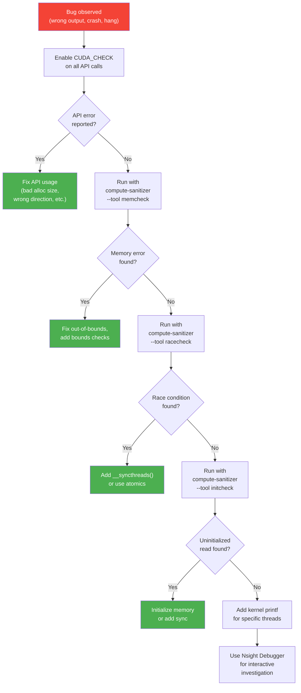
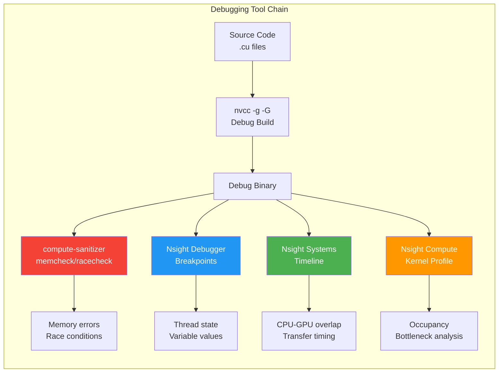

# Chapter 51: Error Handling, Debugging & Validation

`Tags: #CUDA #ErrorHandling #Debugging #ComputeSanitizer #Nsight #Memcheck #RaceConditions #GPU`

---

## 1. Theory — Why CUDA Error Handling Is Different

CUDA kernels execute **asynchronously** on a separate device. When a kernel crashes, the CPU continues executing — blissfully unaware — until it explicitly checks for errors. Unlike CPU code where a segfault kills the process immediately, a GPU out-of-bounds access may silently corrupt data, return zeros, or crash much later. This makes systematic error checking and debugging tools **essential**, not optional.

### What / Why / How

- **What**: Mechanisms to detect, diagnose, and fix GPU errors — from launch failures to race conditions.
- **Why**: Asynchronous execution means errors are deferred. Without checking, bugs hide and corrupt results silently.
- **How**: `CUDA_CHECK` macro for every API call, `compute-sanitizer` for memory and race bugs, Nsight for interactive debugging.

---

## 2. CUDA Error Checking — The Fundamentals

### Every CUDA Runtime API Returns `cudaError_t`

```cuda
cudaError_t err = cudaMalloc(&d_ptr, bytes);
if (err != cudaSuccess) {
    fprintf(stderr, "cudaMalloc failed: %s\n", cudaGetErrorString(err));
    exit(EXIT_FAILURE);
}
```

### Kernel Launches Are Special

Kernel launches (`<<<>>>`) don't return `cudaError_t` directly. Errors are retrieved via:

```cuda
myKernel<<<grid, block>>>(args);

// Check for launch errors (bad config, too many threads, etc.)
cudaError_t launchErr = cudaGetLastError();
if (launchErr != cudaSuccess) {
    fprintf(stderr, "Kernel launch failed: %s\n", cudaGetErrorString(launchErr));
}

// Check for execution errors (out-of-bounds, illegal instruction, etc.)
cudaError_t execErr = cudaDeviceSynchronize();
if (execErr != cudaSuccess) {
    fprintf(stderr, "Kernel execution failed: %s\n", cudaGetErrorString(execErr));
}
```

**Key distinction**: `cudaGetLastError()` catches **launch** failures. `cudaDeviceSynchronize()` catches **execution** failures. You need both.

### `cudaPeekAtLastError()` vs `cudaGetLastError()`

- `cudaGetLastError()`: Returns and **clears** the error.
- `cudaPeekAtLastError()`: Returns but **does not clear** the error.

Use `cudaGetLastError()` for checking. Use `cudaPeekAtLastError()` only for non-destructive inspection.

---

## 3. The CUDA_CHECK Macro

Every production CUDA application uses a macro to wrap API calls:

```cuda
#include <cstdio>
#include <cstdlib>

#define CUDA_CHECK(call)                                                    \
    do {                                                                    \
        cudaError_t err = (call);                                           \
        if (err != cudaSuccess) {                                           \
            fprintf(stderr, "CUDA error at %s:%d — %s\n",                  \
                    __FILE__, __LINE__, cudaGetErrorString(err));            \
            exit(EXIT_FAILURE);                                             \
        }                                                                   \
    } while (0)

#define CUDA_CHECK_LAST()                                                   \
    do {                                                                    \
        cudaError_t err = cudaGetLastError();                               \
        if (err != cudaSuccess) {                                           \
            fprintf(stderr, "CUDA kernel error at %s:%d — %s\n",           \
                    __FILE__, __LINE__, cudaGetErrorString(err));            \
            exit(EXIT_FAILURE);                                             \
        }                                                                   \
    } while (0)
```

### Usage Pattern

```cuda
int main() {
    float *d_data;
    CUDA_CHECK(cudaMalloc(&d_data, 1024 * sizeof(float)));

    myKernel<<<1, 256>>>(d_data, 1024);
    CUDA_CHECK_LAST();                    // Catch launch errors
    CUDA_CHECK(cudaDeviceSynchronize());  // Catch execution errors

    float h_data[1024];
    CUDA_CHECK(cudaMemcpy(h_data, d_data, 1024 * sizeof(float),
                          cudaMemcpyDeviceToHost));

    CUDA_CHECK(cudaFree(d_data));
    return 0;
}
```

**Rule**: Wrap **every** CUDA API call in `CUDA_CHECK`. The overhead is negligible (one branch per call), and it converts silent failures into immediate, actionable error messages.

---

## 4. `compute-sanitizer` — The GPU Valgrind

`compute-sanitizer` (CUDA 11+, successor to `cuda-memcheck`) is a runtime tool that instruments GPU code to detect memory and synchronization errors.

### Modes

| Mode | Detects | Usage |
|---|---|---|
| `memcheck` (default) | Out-of-bounds access, misaligned access, memory leaks, double free | `compute-sanitizer ./myapp` |
| `racecheck` | Shared memory race conditions, write-after-read hazards | `compute-sanitizer --tool racecheck ./myapp` |
| `initcheck` | Reads of uninitialized GPU memory | `compute-sanitizer --tool initcheck ./myapp` |
| `synccheck` | Invalid `__syncthreads()` usage, barrier divergence | `compute-sanitizer --tool synccheck ./myapp` |

### Example: Detecting Out-of-Bounds Access

```cuda
// BUG: kernel accesses out of bounds
__global__ void buggyKernel(float* data, int N) {
    int idx = blockIdx.x * blockDim.x + threadIdx.x;
    data[idx] = 1.0f;  // No bounds check! idx can exceed N
}

int main() {
    float* d_data;
    cudaMalloc(&d_data, 100 * sizeof(float));

    // Launches 256 threads but only 100 elements allocated!
    buggyKernel<<<1, 256>>>(d_data, 100);
    cudaDeviceSynchronize();

    cudaFree(d_data);
    return 0;
}
```

```bash
$ nvcc -g -G -o buggy buggy.cu
$ compute-sanitizer ./buggy
========= Invalid __global__ write of size 4 bytes
=========     at buggyKernel(float*, int)+0x70 in buggy.cu:4
=========     by thread (100,0,0) in block (0,0,0)
=========     Address 0x7f5e00000190 is out of bounds
```

### Example: Detecting Race Conditions

```cuda
__global__ void raceKernel() {
    __shared__ int counter;
    if (threadIdx.x == 0) counter = 0;
    // BUG: missing __syncthreads() — other threads read uninitialized counter
    counter += 1;  // Race condition — no atomics!
}
```

```bash
$ compute-sanitizer --tool racecheck ./race_app
========= ERROR: Potential WAW (Write-After-Write) hazard detected
=========     at raceKernel()+0x48 in race.cu:5
=========     Write by thread (1,0,0) conflicts with write by thread (0,0,0)
```

### Build Flags for Debugging

```bash
# Debug build — unoptimized, full debug info
nvcc -g -G -O0 -lineinfo -o debug_app app.cu

# Release build with line info (for profiling)
nvcc -O3 -lineinfo -o release_app app.cu
```

`-G` disables GPU optimizations (essential for `compute-sanitizer` accuracy but 10-50× slower).

---

## 5. `printf` in Kernels

CUDA supports `printf` in device code (compute capability 2.0+), but with caveats.

```cuda
__global__ void debugKernel(const float* data, int N) {
    int idx = blockIdx.x * blockDim.x + threadIdx.x;
    if (idx < N) {
        if (data[idx] < 0.0f) {
            printf("WARNING: data[%d] = %f (negative!)\n", idx, data[idx]);
        }
    }
}
```

### Limitations and Tips

| Issue | Detail | Workaround |
|---|---|---|
| Buffer size | Default 1 MB output buffer — overflows silently | `cudaDeviceSetLimit(cudaLimitPrintfFifoSize, 8*1024*1024)` |
| Output order | Threads print in arbitrary order | Prefix with thread/block IDs |
| Performance | 100-1000× slower than compute | Guard with `if (threadIdx.x == 0)` or conditional |
| Flushed on sync | Output only appears after `cudaDeviceSynchronize()` | Always sync after kernel with printf |

### Practical Debugging Pattern

```cuda
__global__ void debugKernel(float* data, int N) {
    int tid = threadIdx.x + blockIdx.x * blockDim.x;

    // Only print from first thread of first block
    if (tid == 0) {
        printf("[DEBUG] First 5 values: ");
        for (int i = 0; i < 5 && i < N; i++)
            printf("%.3f ", data[i]);
        printf("\n");
    }
}
```

---

## 6. Nsight Debugger — Interactive GPU Debugging

NVIDIA Nsight (Visual Studio, Eclipse, or VS Code extension) provides:

- **GPU breakpoints**: Set breakpoints in `__global__` and `__device__` functions
- **Thread focus**: Inspect a specific thread's registers and local variables
- **Memory inspection**: View shared, global, and local memory contents
- **Warp state**: See which threads are active, diverged, or at a barrier

### Nsight Compute vs Nsight Systems

| Tool | Purpose | Key Metrics |
|---|---|---|
| **Nsight Systems** | System-level timeline — CPU/GPU overlap, kernel launches, transfers | Timeline, API trace |
| **Nsight Compute** | Kernel-level profiling — occupancy, memory throughput, instruction mix | SOL%, roofline |
| **Nsight Debugger** | Interactive debugging — breakpoints, variable inspection | Thread state |

### Command-Line Profiling Quick Start

```bash
# Nsight Systems — timeline profile
nsys profile -o timeline_report ./my_app

# Nsight Compute — kernel analysis
ncu --set full -o kernel_report ./my_app

# Nsight Compute — specific kernel
ncu --kernel-name matmulTiled --launch-count 1 ./my_app
```

---

## 7. Common Bugs and Fixes

### Bug 1: Race Condition in Shared Memory

```cuda
// ❌ BUG: Missing sync between write and read
__shared__ float smem[256];
smem[tid] = globalData[tid];
float neighbor = smem[tid ^ 1];  // May read stale data!

// ✅ FIX: Add barrier
smem[tid] = globalData[tid];
__syncthreads();                  // Ensure all writes visible
float neighbor = smem[tid ^ 1];   // Safe read
```

### Bug 2: Out-of-Bounds Global Memory Access

```cuda
// ❌ BUG: No bounds check
__global__ void kernel(float* data, int N) {
    int idx = blockIdx.x * blockDim.x + threadIdx.x;
    data[idx] = 1.0f;  // Crashes when idx >= N
}

// ✅ FIX: Always guard with bounds check
__global__ void kernel(float* data, int N) {
    int idx = blockIdx.x * blockDim.x + threadIdx.x;
    if (idx < N)
        data[idx] = 1.0f;
}
```

### Bug 3: Kernel Launch Configuration Errors

```cuda
// ❌ BUG: Block size exceeds device maximum (typically 1024)
kernel<<<1, 2048>>>(data, N);  // Silent failure! Kernel doesn't run.

// ✅ FIX: Check launch error and use valid block size
kernel<<<(N + 255) / 256, 256>>>(data, N);
CUDA_CHECK_LAST();
```

### Bug 4: Memory Leaks

```cuda
// ❌ BUG: Early return without cudaFree
int main() {
    float* d_data;
    cudaMalloc(&d_data, bytes);

    if (someCondition) return -1;  // LEAK: d_data never freed!

    cudaFree(d_data);
    return 0;
}

// ✅ FIX: Use RAII wrapper or goto cleanup
int main() {
    float* d_data;
    cudaMalloc(&d_data, bytes);
    int ret = 0;

    if (someCondition) { ret = -1; goto cleanup; }

    // ... use d_data ...

cleanup:
    cudaFree(d_data);
    return ret;
}
```

### Bug 5: Using Host Pointer on Device

```cuda
// ❌ BUG: Passing host pointer to kernel
float* h_data = (float*)malloc(bytes);
kernel<<<grid, block>>>(h_data);  // GPU accesses CPU RAM → crash!

// ✅ FIX: Allocate on device, copy, then pass device pointer
float* d_data;
cudaMalloc(&d_data, bytes);
cudaMemcpy(d_data, h_data, bytes, cudaMemcpyHostToDevice);
kernel<<<grid, block>>>(d_data);  // Correct: GPU pointer
```

---

## 8. Debugging Methodology — Systematic Approach



### Step-by-Step Methodology

1. **Reproduce consistently**: Use fixed seeds, deterministic algorithms.
2. **Isolate**: Comment out kernels until you find the offending one.
3. **Reduce**: Shrink input size until the bug is manageable to inspect.
4. **Instrument**: Add `CUDA_CHECK`, run `compute-sanitizer`.
5. **Inspect**: Use `printf` in the kernel for targeted threads.
6. **Verify**: Fix the bug, run sanitizer again to confirm clean.

---

## 9. Assertion in Kernels

CUDA supports `assert()` in device code:

```cuda
#include <cassert>

__global__ void kernelWithAssert(float* data, int N) {
    int idx = blockIdx.x * blockDim.x + threadIdx.x;
    assert(idx < N);  // Triggers trap instruction if false

    float val = data[idx];
    assert(val >= 0.0f);  // Check invariant
    data[idx] = sqrtf(val);
}
```

**Behavior**: Failed `assert()` prints a message and calls `__trap()`, which halts the device. The error is captured by the next `cudaDeviceSynchronize()` as `cudaErrorAssert`.

```bash
myapp.cu:7: void kernelWithAssert(float*, int): block: [0,0,0], thread: [300,0,0],
Assertion `idx < N` failed.
```

**Performance note**: Assertions are disabled when compiling with `-DNDEBUG` (same as CPU).

---

## 10. Error Recovery — `cudaDeviceReset()`

After a fatal CUDA error (e.g., `cudaErrorIllegalAddress`), the CUDA context is corrupted. No further CUDA operations will succeed until you reset:

```cuda
cudaError_t err = cudaDeviceSynchronize();
if (err == cudaErrorIllegalAddress) {
    fprintf(stderr, "Fatal GPU error — resetting device\n");
    cudaDeviceReset();   // Destroys context, frees all memory
    // Must re-initialize everything from scratch
}
```

**In production**: This is a last resort. Prefer fixing the root cause.

---

## 11. Complete Debugging Example

```cuda
#include <cstdio>
#include <cstdlib>

#define CUDA_CHECK(call) do {                                          \
    cudaError_t e = (call);                                            \
    if (e != cudaSuccess) {                                            \
        fprintf(stderr, "CUDA error %s:%d: %s\n",                     \
                __FILE__, __LINE__, cudaGetErrorString(e));            \
        exit(EXIT_FAILURE);                                            \
    }                                                                  \
} while(0)

#define CUDA_CHECK_LAST() do {                                         \
    cudaError_t e = cudaGetLastError();                                \
    if (e != cudaSuccess) {                                            \
        fprintf(stderr, "Kernel error %s:%d: %s\n",                   \
                __FILE__, __LINE__, cudaGetErrorString(e));            \
        exit(EXIT_FAILURE);                                            \
    }                                                                  \
} while(0)

__global__ void safeKernel(float* input, float* output, int N) {
    int idx = blockIdx.x * blockDim.x + threadIdx.x;
    if (idx >= N) return;  // Bounds check

    float val = input[idx];
    if (val < 0.0f) {
        printf("[WARN] Negative input at idx=%d: %f\n", idx, val);
        output[idx] = 0.0f;
        return;
    }
    output[idx] = sqrtf(val);
}

int main() {
    const int N = 1024;
    size_t bytes = N * sizeof(float);

    // Host allocation
    float* h_in  = (float*)malloc(bytes);
    float* h_out = (float*)malloc(bytes);
    for (int i = 0; i < N; i++) h_in[i] = (float)i;
    h_in[42] = -1.0f;  // Deliberately inject a bad value

    // Device allocation
    float *d_in, *d_out;
    CUDA_CHECK(cudaMalloc(&d_in,  bytes));
    CUDA_CHECK(cudaMalloc(&d_out, bytes));
    CUDA_CHECK(cudaMemcpy(d_in, h_in, bytes, cudaMemcpyHostToDevice));

    // Launch with error checking
    int blockSize = 256;
    int gridSize = (N + blockSize - 1) / blockSize;
    safeKernel<<<gridSize, blockSize>>>(d_in, d_out, N);
    CUDA_CHECK_LAST();
    CUDA_CHECK(cudaDeviceSynchronize());

    // Copy back and verify
    CUDA_CHECK(cudaMemcpy(h_out, d_out, bytes, cudaMemcpyDeviceToHost));

    int errors = 0;
    for (int i = 0; i < N; i++) {
        if (i == 42) { if (h_out[i] != 0.0f) errors++; }
        else {
            float expected = sqrtf((float)i);
            if (fabsf(h_out[i] - expected) > 1e-5f) errors++;
        }
    }
    printf("Verification: %d errors\n", errors);

    // Cleanup
    CUDA_CHECK(cudaFree(d_in));
    CUDA_CHECK(cudaFree(d_out));
    free(h_in);
    free(h_out);
    return 0;
}
```

---

## 12. Advanced: Sticky vs Non-Sticky Errors

CUDA errors come in two flavors:

- **Non-sticky**: The error is cleared after `cudaGetLastError()`. Example: `cudaErrorInvalidConfiguration` (bad launch params).
- **Sticky**: The error **persists** and corrupts the CUDA context. Example: `cudaErrorIllegalAddress`, `cudaErrorHardwareFailure`. Only `cudaDeviceReset()` can recover.

```cuda
// Non-sticky: next CUDA call can succeed
badKernel<<<1, 99999>>>();  // Too many threads
cudaGetLastError();         // Clears the error
goodKernel<<<1, 256>>>();   // This works fine

// Sticky: context is dead
oobKernel<<<1, 256>>>(nullptr);  // Illegal address
cudaDeviceSynchronize();         // Returns cudaErrorIllegalAddress
cudaGetLastError();              // Still cudaErrorIllegalAddress!
// NOTHING works until cudaDeviceReset()
```

---

## 13. Debugging Data Flow



---

## 14. Exercises

### 🟢 Beginner

1. Write a program that deliberately passes a host pointer to a kernel. Verify that `compute-sanitizer` catches the error. Then fix it and confirm a clean run.

2. Implement the `CUDA_CHECK` macro and use it to wrap every CUDA call in a simple vector-add program. Intentionally trigger an error (e.g., allocate negative bytes) and verify the error message.

### 🟡 Intermediate

3. Write a kernel with a shared memory race condition (two threads writing to the same location without atomics). Run `compute-sanitizer --tool racecheck` and fix the bug.

4. Create a kernel with an assertion that checks input values are positive. Pass an array with a negative value and observe the assertion failure. Then add proper error recovery.

### 🔴 Advanced

5. Build a debugging harness: write a host-side function that runs a kernel both on CPU (reference) and GPU, compares results element-by-element, and reports the first diverging index with both values. Use this to debug a reduction kernel with an off-by-one error.

---

## 15. Solutions

### Solution 1 (🟢 Host Pointer Bug)

```cuda
#include <cstdio>

#define CUDA_CHECK(call) do {                                    \
    cudaError_t e = (call);                                      \
    if (e != cudaSuccess) {                                      \
        fprintf(stderr, "CUDA error %s:%d: %s\n",               \
                __FILE__, __LINE__, cudaGetErrorString(e));       \
        exit(1);                                                 \
    }                                                            \
} while(0)

__global__ void fillKernel(float* data, int N) {
    int idx = blockIdx.x * blockDim.x + threadIdx.x;
    if (idx < N) data[idx] = (float)idx;
}

int main() {
    int N = 256;
    size_t bytes = N * sizeof(float);

    // FIXED: Use device pointer instead of host pointer
    float* d_data;
    CUDA_CHECK(cudaMalloc(&d_data, bytes));

    fillKernel<<<1, 256>>>(d_data, N);
    CUDA_CHECK(cudaGetLastError());
    CUDA_CHECK(cudaDeviceSynchronize());

    float h_data[256];
    CUDA_CHECK(cudaMemcpy(h_data, d_data, bytes, cudaMemcpyDeviceToHost));
    printf("data[10] = %.0f\n", h_data[10]);  // 10

    CUDA_CHECK(cudaFree(d_data));
    return 0;
}
```

### Solution 3 (🟡 Race Condition Fix)

```cuda
#include <cstdio>

__global__ void raceFixed(int* result) {
    __shared__ int smem[256];
    int tid = threadIdx.x;

    smem[tid] = tid;
    __syncthreads();  // FIX: barrier before reading neighbor's data

    int neighbor = smem[(tid + 1) % blockDim.x];
    __syncthreads();  // Barrier before overwriting

    // Use atomicAdd instead of direct write to shared variable
    if (tid == 0) {
        int sum = 0;
        for (int i = 0; i < blockDim.x; i++) sum += smem[i];
        *result = sum;
    }
}

int main() {
    int *d_result, h_result;
    cudaMalloc(&d_result, sizeof(int));
    raceFixed<<<1, 256>>>(d_result);
    cudaMemcpy(&h_result, d_result, sizeof(int), cudaMemcpyDeviceToHost);
    printf("Sum = %d (expected %d)\n", h_result, 255 * 256 / 2);
    cudaFree(d_result);
    return 0;
}
```

---

## 16. Quiz

**Q1**: What function retrieves the error from the most recent kernel launch?
**(a)** `cudaDeviceSynchronize()` **(b)** `cudaGetLastError()` ✅ **(c)** `cudaCheckError()` **(d)** `cudaGetErrorCode()`

**Q2**: Which `compute-sanitizer` tool detects shared memory race conditions?
**(a)** memcheck **(b)** racecheck ✅ **(c)** initcheck **(d)** synccheck

**Q3**: What build flag is essential for accurate `compute-sanitizer` results?
**(a)** `-O3` **(b)** `-G` (device debug) ✅ **(c)** `--use_fast_math` **(d)** `-lineinfo`

**Q4**: What happens when `printf` output exceeds the kernel print buffer?
**(a)** Program crashes **(b)** Output is silently truncated ✅ **(c)** Buffer auto-resizes **(d)** Compiler error

**Q5**: A sticky CUDA error (e.g., `cudaErrorIllegalAddress`) can only be cleared by:
**(a)** `cudaGetLastError()` **(b)** `cudaDeviceSynchronize()` **(c)** `cudaDeviceReset()` ✅ **(d)** Re-launching the kernel

**Q6**: Why is `CUDA_CHECK` wrapped in `do { ... } while(0)`?
**(a)** For loop functionality **(b)** To make it a single statement safe in if/else contexts ✅ **(c)** For error retry logic **(d)** Compiler requirement

**Q7**: What is the key difference between `cudaGetLastError()` and `cudaPeekAtLastError()`?
**(a)** Speed **(b)** `cudaGetLastError()` clears the error; `cudaPeekAtLastError()` does not ✅ **(c)** Thread safety **(d)** One works on host, the other on device

---

## 17. Key Takeaways

1. **Wrap every CUDA API call** in `CUDA_CHECK` — silent failures are the #1 cause of debugging agony.
2. **Kernel errors are deferred** — always check both `cudaGetLastError()` (launch) and `cudaDeviceSynchronize()` (execution).
3. **`compute-sanitizer`** is the GPU equivalent of Valgrind — use memcheck, racecheck, and initcheck systematically.
4. **`printf` in kernels** is useful but slow — guard with thread-specific conditionals and increase buffer size if needed.
5. **Sticky errors corrupt the context** — `cudaDeviceReset()` is the only recovery, so prevent them with bounds checks.
6. **Debug builds** (`-g -G`) are essential for meaningful error locations and sanitizer accuracy.

---

## 18. Chapter Summary

This chapter established the debugging and error handling infrastructure that every CUDA developer needs. We built the `CUDA_CHECK` macro, explored the `compute-sanitizer` suite for automated bug detection, cataloged the most common GPU bugs with reproducible examples and fixes, and laid out a systematic debugging methodology. The recurring theme: CUDA's asynchronous execution model means errors are invisible unless you actively look for them. The tools exist — `compute-sanitizer`, Nsight, assertions, printf — the discipline is checking every call and running sanitizers regularly.

---

## 19. Real-World AI/ML Insight

**Silent numerical errors** in GPU code are particularly insidious in ML. A subtle out-of-bounds read might not crash — it reads adjacent memory and produces a plausible but incorrect gradient. The model trains, loss decreases, but accuracy plateaus mysteriously. Production ML pipelines at companies like NVIDIA and Google run CUDA sanitizers in CI/CD and use numerical verification (comparing GPU output against CPU reference with tolerance checks) as standard practice. The `CUDA_CHECK` pattern from this chapter is literally the first thing added to any new CUDA kernel in cuDNN, CUTLASS, and TensorRT.

---

## 20. Common Mistakes

| Mistake | Consequence | Fix |
|---|---|---|
| No error checking on `cudaMalloc` | Null device pointer → crash in kernel | `CUDA_CHECK(cudaMalloc(...))` |
| Only checking `cudaGetLastError()` after kernel | Misses execution errors | Also call `cudaDeviceSynchronize()` |
| Debugging optimized build (`-O3`) | Sanitizer reports wrong lines or misses bugs | Use `-g -G -O0` for debugging |
| `printf` without `cudaDeviceSynchronize()` | Output never appears | Always sync after printf kernel |
| Ignoring sticky errors | All subsequent CUDA calls fail silently | Check and call `cudaDeviceReset()` if needed |

---

## 21. Interview Questions

**Q1: Explain your systematic approach to debugging a CUDA kernel that produces incorrect results.**

**A**: (1) Add `CUDA_CHECK` to all API calls and `CUDA_CHECK_LAST()` after kernel launches. (2) Run with `compute-sanitizer --tool memcheck` to detect out-of-bounds access. (3) Run with `--tool racecheck` to detect shared memory races. (4) If no sanitizer errors, reduce the problem size and add `printf` to inspect specific threads. (5) Compare GPU output against a CPU reference implementation element-by-element to find the first diverging index. (6) Use Nsight Debugger to set breakpoints at the diverging thread and inspect its local state.

**Q2: What's the difference between a sticky and non-sticky CUDA error? Give examples of each.**

**A**: Non-sticky errors (e.g., `cudaErrorInvalidConfiguration` from bad launch params) are cleared by `cudaGetLastError()` — subsequent CUDA calls work fine. Sticky errors (e.g., `cudaErrorIllegalAddress` from an out-of-bounds access during kernel execution) corrupt the CUDA context permanently. No CUDA call succeeds until `cudaDeviceReset()` destroys and recreates the context. This is critical in long-running services where a single bad kernel can take down the entire GPU context.

**Q3: Why do kernel launch errors require two separate checks?**

**A**: Kernel launches are asynchronous. `cudaGetLastError()` catches **configuration** errors detected at launch time (invalid block size, too much shared memory, null function pointer). `cudaDeviceSynchronize()` catches **execution** errors that occur during the kernel's run on the GPU (illegal memory access, hardware exceptions). Without `cudaDeviceSynchronize()`, execution errors are deferred until the next synchronizing API call, making them appear far from their source.

**Q4: How does `compute-sanitizer racecheck` detect shared memory race conditions?**

**A**: It instruments all shared memory accesses, tracking which thread reads/writes which address at which program point. It applies happens-before analysis: if thread A writes to address X and thread B reads/writes X without an intervening `__syncthreads()`, and A and B could be in the same warp or have no ordering guarantee, it reports a potential WAR/WAW/RAW hazard. It requires `-g -G` builds for accurate source-line reporting and runs 10-100× slower than normal execution.

**Q5: When would you use `printf` debugging vs Nsight Debugger?**

**A**: `printf` is best for quick, targeted inspection — checking a specific value at a specific thread, especially in remote/headless environments where GUI debugging isn't available. Nsight Debugger is better for interactive exploration — when you don't know which thread has the bug, or need to inspect complex data structures in shared/global memory. In practice, I start with `printf` (faster iteration) and escalate to Nsight Debugger for complex bugs involving thread interaction or non-obvious state corruption.
