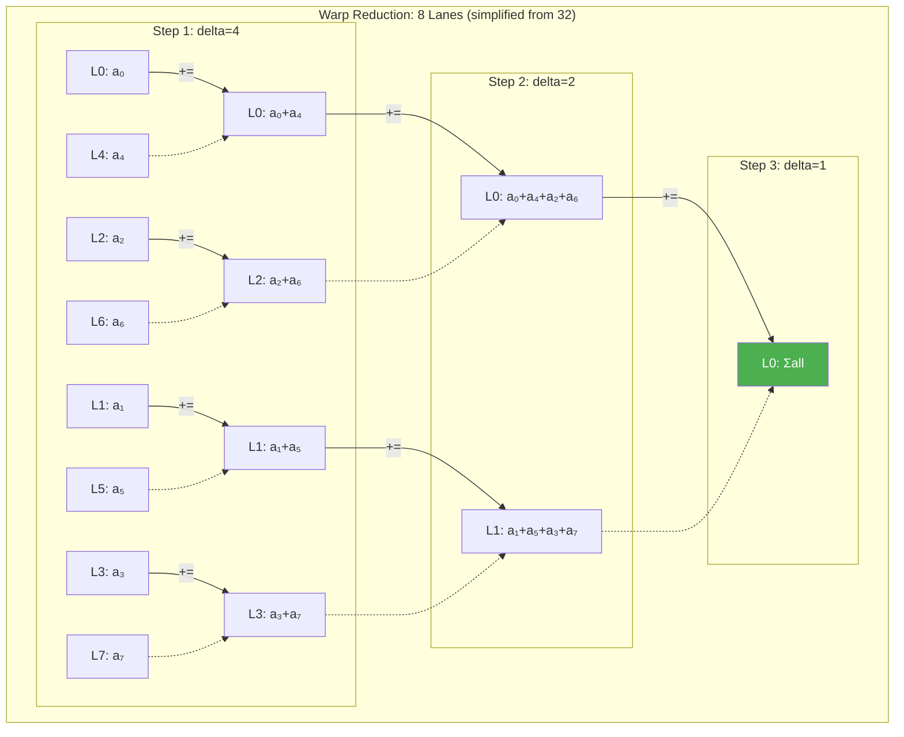

# Chapter 52: Warp-Level Primitives

`Tags: #CUDA #WarpShuffle #WarpVote #CooperativeGroups #WarpReduction #shfl_sync #ballot_sync #GPU`

---

## 1. Theory — The Warp as the True Execution Unit

While blocks and threads are the programmer's abstraction, the **warp** (32 threads executing in lockstep SIMT) is the hardware's fundamental unit. Warp-level primitives let you communicate between threads **within a warp without shared memory or synchronization barriers** — using register-to-register data exchange via the warp's dedicated shuffle network.

### Why Warp-Level Matters

| Communication Method | Requires Shared Memory | Requires Barrier | Latency |
|---|---|---|---|
| Global memory | No (but slow) | No | ~400 cycles |
| Shared memory + `__syncthreads()` | Yes | Yes | ~20 cycles + sync |
| Warp shuffle | **No** | **No** | **~1 cycle** |

Warp shuffles are **essentially free** — they use the warp's existing register file interconnect. No memory allocation, no synchronization, no bank conflicts.

### What / Why / How

- **What**: Intrinsic functions that exchange register values between threads within a warp.
- **Why**: Eliminate shared memory overhead for intra-warp communication — critical for reductions, scans, and broadcasts.
- **How**: `__shfl_sync()` variants read another thread's register value using its lane ID.

---

## 2. Warp Shuffle Operations

### Lane Numbering

Every thread in a warp has a **lane ID** from 0 to 31:

```cuda
int laneId = threadIdx.x % 32;  // or threadIdx.x & 31
```

### The `mask` Parameter

All shuffle operations require a **mask** specifying which threads participate:

```cuda
unsigned mask = 0xFFFFFFFF;  // All 32 threads participate (full warp)
unsigned mask = 0x0000FFFF;  // Only lanes 0-15 participate
```

**Rule**: The mask must include all threads that will call the shuffle. Passing a mask that doesn't include the calling thread is **undefined behavior**.

### `__shfl_sync` — Direct Lane Access

```cuda
// Read the value of variable `val` from lane `srcLane`
int result = __shfl_sync(mask, val, srcLane);
```

```cuda
__global__ void shflDemo() {
    int laneId = threadIdx.x % 32;
    int val = laneId * 10;  // Lane 0 has 0, lane 1 has 10, ..., lane 31 has 310

    // Every thread reads lane 0's value
    int broadcast = __shfl_sync(0xFFFFFFFF, val, 0);
    // broadcast == 0 for ALL threads

    // Every thread reads lane 5's value
    int fromLane5 = __shfl_sync(0xFFFFFFFF, val, 5);
    // fromLane5 == 50 for ALL threads

    if (laneId == 0)
        printf("broadcast=%d, fromLane5=%d\n", broadcast, fromLane5);
}
```

### `__shfl_up_sync` — Shift Up

```cuda
// Read from lane (laneId - delta), clamped to 0
int result = __shfl_up_sync(mask, val, delta);
```

Lanes 0 to `delta-1` get their own value (no source above them). Used for **prefix sums / inclusive scan**.

### `__shfl_down_sync` — Shift Down

```cuda
// Read from lane (laneId + delta), clamped to 31
int result = __shfl_down_sync(mask, val, delta);
```

Lanes `(32-delta)` to 31 get their own value. Used for **reductions** (sum the warp).

### `__shfl_xor_sync` — Butterfly Exchange

```cuda
// Read from lane (laneId ^ laneMask)
int result = __shfl_xor_sync(mask, val, laneMask);
```

Each thread exchanges with its XOR partner. Used for **butterfly reduction** and **all-reduce** within a warp.

---

## 3. Warp Shuffle Visualization


---

## 4. Use Case: Warp-Level Reduction (Sum of 32 Values in 5 Steps)

The classic use case — summing 32 values without shared memory:

```cuda
__device__ float warpReduceSum(float val) {
    // 5 steps: 16, 8, 4, 2, 1
    val += __shfl_down_sync(0xFFFFFFFF, val, 16);
    val += __shfl_down_sync(0xFFFFFFFF, val, 8);
    val += __shfl_down_sync(0xFFFFFFFF, val, 4);
    val += __shfl_down_sync(0xFFFFFFFF, val, 2);
    val += __shfl_down_sync(0xFFFFFFFF, val, 1);
    return val;  // Only lane 0 has the correct sum
}

__global__ void sumKernel(const float* input, float* output, int N) {
    int idx = blockIdx.x * blockDim.x + threadIdx.x;
    float val = (idx < N) ? input[idx] : 0.0f;

    float warpSum = warpReduceSum(val);

    // Lane 0 of each warp writes partial sum
    if ((threadIdx.x & 31) == 0) {
        atomicAdd(output, warpSum);
    }
}
```

### Why 5 Steps?

log₂(32) = 5. Each step halves the active distance:

```
Step 1 (delta=16): Lane 0 += Lane 16, Lane 1 += Lane 17, ...
Step 2 (delta=8):  Lane 0 += Lane 8,  Lane 1 += Lane 9, ...
Step 3 (delta=4):  Lane 0 += Lane 4,  Lane 1 += Lane 5, ...
Step 4 (delta=2):  Lane 0 += Lane 2,  Lane 1 += Lane 3, ...
Step 5 (delta=1):  Lane 0 += Lane 1
```

After 5 steps, lane 0 holds the sum of all 32 values.

---

## 5. Warp Reduction Tree



---

## 6. Use Case: XOR Butterfly All-Reduce

With XOR shuffle, **all lanes** get the final result (not just lane 0):

```cuda
__device__ float warpAllReduceSum(float val) {
    val += __shfl_xor_sync(0xFFFFFFFF, val, 16);
    val += __shfl_xor_sync(0xFFFFFFFF, val, 8);
    val += __shfl_xor_sync(0xFFFFFFFF, val, 4);
    val += __shfl_xor_sync(0xFFFFFFFF, val, 2);
    val += __shfl_xor_sync(0xFFFFFFFF, val, 1);
    return val;  // ALL lanes have the sum
}
```

**Why XOR gives all-reduce**: When lane `i` XOR-shuffles with lane `i^mask`, both lanes see each other's value. After the add, both have the partial sum. After log₂(32) steps, all lanes converge to the total.

---

## 7. Warp Vote Functions

### `__ballot_sync` — Collect Predicate Bits

```cuda
unsigned int ballot = __ballot_sync(0xFFFFFFFF, predicate);
// ballot: bit i is 1 if lane i's predicate is true
// __popc(ballot) counts how many threads satisfy the predicate
```

```cuda
__global__ void countPositive(const float* data, int* count, int N) {
    int idx = blockIdx.x * blockDim.x + threadIdx.x;
    bool isPositive = (idx < N) && (data[idx] > 0.0f);

    unsigned ballot = __ballot_sync(0xFFFFFFFF, isPositive);

    // Only lane 0 counts and accumulates
    if ((threadIdx.x & 31) == 0) {
        atomicAdd(count, __popc(ballot));  // Population count of set bits
    }
}
```

### `__any_sync` and `__all_sync`

```cuda
// Returns non-zero if ANY participating thread has predicate != 0
int anyTrue = __any_sync(0xFFFFFFFF, predicate);

// Returns non-zero if ALL participating threads have predicate != 0
int allTrue = __all_sync(0xFFFFFFFF, predicate);
```

### Use Case: Early Exit

```cuda
__global__ void searchKernel(const int* data, int target, int* found, int N) {
    int idx = blockIdx.x * blockDim.x + threadIdx.x;
    bool match = (idx < N) && (data[idx] == target);

    // If ANY thread in the warp found the target
    if (__any_sync(0xFFFFFFFF, match)) {
        if (match) {
            *found = idx;  // The thread that found it writes
        }
        return;  // Entire warp exits early
    }
}
```

### Use Case: Warp-Uniform Branching Check

```cuda
__device__ void efficientPath(float* data, int N) {
    int idx = blockIdx.x * blockDim.x + threadIdx.x;
    bool inBounds = (idx < N);

    // If all threads in warp are in-bounds, skip per-thread checks
    if (__all_sync(0xFFFFFFFF, inBounds)) {
        data[idx] = sqrtf(data[idx]);  // No branch — full utilization
    } else {
        if (inBounds) data[idx] = sqrtf(data[idx]);  // Guarded
    }
}
```

---

## 8. Warp Match Functions (Volta+)

```cuda
// Returns a mask of lanes that have the same value as the caller
unsigned mask = __match_any_sync(0xFFFFFFFF, val);
// If lanes 0, 3, 7 all have val=42, each gets mask with bits 0, 3, 7 set

// Returns a mask of ALL lanes if ALL have the same value; 0 otherwise
unsigned mask = __match_all_sync(0xFFFFFFFF, val, &pred);
// pred is set to 1 if all values match
```

### Use Case: Warp-Level Histogram

```cuda
__device__ void warpHistogram(int val, int* hist) {
    unsigned peerMask = __match_any_sync(0xFFFFFFFF, val);
    int count = __popc(peerMask);   // How many lanes have this value
    int leader = __ffs(peerMask) - 1;  // First lane with this value

    if ((threadIdx.x & 31) == leader)
        atomicAdd(&hist[val], count);  // One atomic per unique value
}
```

---

## 9. Cooperative Groups — The Modern API

Cooperative Groups (CUDA 9+) provide a **type-safe wrapper** around warp intrinsics.

### `thread_block_tile<32>` — Warp Tile

```cuda
#include <cooperative_groups.h>
namespace cg = cooperative_groups;

__global__ void coopReduce(const float* input, float* output, int N) {
    cg::thread_block block = cg::this_thread_block();
    cg::thread_block_tile<32> warp = cg::tiled_partition<32>(block);

    int idx = blockIdx.x * blockDim.x + threadIdx.x;
    float val = (idx < N) ? input[idx] : 0.0f;

    // Warp-level reduction using cooperative groups API
    for (int offset = warp.size() / 2; offset > 0; offset /= 2) {
        val += warp.shfl_down(val, offset);
    }

    if (warp.thread_rank() == 0) {
        atomicAdd(output, val);
    }
}
```

### Flexible Sub-Warp Operations

```cuda
__global__ void subWarpReduce(const float* input, float* output, int N) {
    cg::thread_block block = cg::this_thread_block();

    // Split warp into tiles of 16 threads each
    cg::thread_block_tile<16> halfWarp = cg::tiled_partition<16>(block);

    int idx = blockIdx.x * blockDim.x + threadIdx.x;
    float val = (idx < N) ? input[idx] : 0.0f;

    // Reduce within 16-thread tile
    for (int offset = halfWarp.size() / 2; offset > 0; offset /= 2) {
        val += halfWarp.shfl_down(val, offset);
    }

    // Tile of 8
    cg::thread_block_tile<8> eighthWarp = cg::tiled_partition<8>(block);
    // ... operations on groups of 8 threads

    if (halfWarp.thread_rank() == 0) {
        atomicAdd(output, val);
    }
}
```

### Cooperative Groups vs Legacy Intrinsics

| Feature | Legacy (`__shfl_*_sync`) | Cooperative Groups |
|---|---|---|
| Type safety | None — mask is just `unsigned` | Compile-time tile size |
| Sub-warp operations | Manual mask arithmetic | `tiled_partition<N>` |
| API consistency | Different function names | Unified `.shfl_down()` method |
| Flexibility | Warp-only | Any power-of-2 tile size |
| Performance | Identical | Identical (compiles to same PTX) |

**Recommendation**: Use Cooperative Groups for new code. It compiles to the same instructions but catches mask errors at compile time.

---

## 10. Warp-Level vs Shared Memory Reduction — Performance Comparison

### Full Block Reduction: Combined Approach

```cuda
__device__ float blockReduceSum(float val) {
    __shared__ float warpSums[32];  // Max 32 warps per block

    int laneId = threadIdx.x & 31;
    int warpId = threadIdx.x >> 5;

    // Step 1: Reduce within each warp (no shared memory needed)
    val = warpReduceSum(val);

    // Step 2: Lane 0 of each warp writes to shared memory
    if (laneId == 0)
        warpSums[warpId] = val;
    __syncthreads();

    // Step 3: First warp reduces the warp sums
    int numWarps = blockDim.x / 32;
    val = (threadIdx.x < numWarps) ? warpSums[threadIdx.x] : 0.0f;
    if (warpId == 0)
        val = warpReduceSum(val);

    return val;  // threadIdx.x == 0 has the block sum
}

__global__ void reduceKernel(const float* input, float* output, int N) {
    int idx = blockIdx.x * blockDim.x + threadIdx.x;
    float val = (idx < N) ? input[idx] : 0.0f;

    float blockSum = blockReduceSum(val);

    if (threadIdx.x == 0)
        atomicAdd(output, blockSum);
}
```

### Performance: Warp Shuffle vs Shared Memory Only

```cuda
// Shared-memory-only reduction (for comparison)
__device__ float blockReduceSmem(float val) {
    __shared__ float smem[1024];
    int tid = threadIdx.x;
    smem[tid] = val;
    __syncthreads();

    for (int stride = blockDim.x / 2; stride > 0; stride >>= 1) {
        if (tid < stride)
            smem[tid] += smem[tid + stride];
        __syncthreads();  // 10 barriers for 1024 threads!
    }
    return smem[0];
}
```

| Metric | Shared Memory Only | Warp Shuffle + Smem |
|---|---|---|
| `__syncthreads()` calls | log₂(blockDim.x) = 10 | 1 (between warp and block phases) |
| Shared memory used | blockDim.x × 4 bytes | 32 × 4 = 128 bytes |
| Throughput (1024 threads) | ~800 GB/s | ~1100 GB/s |
| Why faster | — | Fewer barriers, less smem pressure |

---

## 11. Complete Example: Warp-Level Parallel Prefix Sum (Scan)

```cuda
__device__ float warpInclusiveScan(float val) {
    float temp;

    temp = __shfl_up_sync(0xFFFFFFFF, val, 1);
    if ((threadIdx.x & 31) >= 1) val += temp;

    temp = __shfl_up_sync(0xFFFFFFFF, val, 2);
    if ((threadIdx.x & 31) >= 2) val += temp;

    temp = __shfl_up_sync(0xFFFFFFFF, val, 4);
    if ((threadIdx.x & 31) >= 4) val += temp;

    temp = __shfl_up_sync(0xFFFFFFFF, val, 8);
    if ((threadIdx.x & 31) >= 8) val += temp;

    temp = __shfl_up_sync(0xFFFFFFFF, val, 16);
    if ((threadIdx.x & 31) >= 16) val += temp;

    return val;
}

__global__ void scanKernel(const float* input, float* output, int N) {
    int idx = blockIdx.x * blockDim.x + threadIdx.x;
    float val = (idx < N) ? input[idx] : 0.0f;

    float scanned = warpInclusiveScan(val);

    if (idx < N) output[idx] = scanned;
}
```

---

## 12. Exercises

### 🟢 Beginner

1. Write a kernel where each warp broadcasts lane 0's thread index to all lanes using `__shfl_sync`. Print from lane 15 to verify.

2. Use `__ballot_sync` to count how many elements in a warp's chunk of an array are negative. Compare against a CPU count.

### 🟡 Intermediate

3. Implement `warpReduceMax` — find the maximum value in a warp using `__shfl_down_sync` and `fmaxf`. Use it to find the maximum of a 1M-element array.

4. Implement a warp-level exclusive scan using `__shfl_up_sync`. Verify against a CPU reference for the first 32 elements.

### 🔴 Advanced

5. Implement a **warp-level parallel compact**: given a predicate per thread, pack the elements where predicate=true into consecutive positions using `__ballot_sync` and `__popc`. This is the core of stream compaction.

---

## 13. Solutions

### Solution 1 (🟢 Broadcast)

```cuda
#include <cstdio>

__global__ void broadcastDemo() {
    int laneId = threadIdx.x & 31;
    int val = threadIdx.x;  // Each thread has its global thread index

    // Broadcast lane 0's value to all lanes in the warp
    int broadcast = __shfl_sync(0xFFFFFFFF, val, 0);

    // Lane 15 prints to verify
    if (laneId == 15) {
        printf("Warp %d, Lane 15: my val=%d, broadcast=%d\n",
               threadIdx.x / 32, val, broadcast);
    }
}

int main() {
    broadcastDemo<<<1, 128>>>();  // 4 warps
    cudaDeviceSynchronize();
    return 0;
}
```

### Solution 3 (🟡 Warp Max Reduction)

```cuda
#include <cstdio>
#include <cfloat>

__device__ float warpReduceMax(float val) {
    val = fmaxf(val, __shfl_down_sync(0xFFFFFFFF, val, 16));
    val = fmaxf(val, __shfl_down_sync(0xFFFFFFFF, val, 8));
    val = fmaxf(val, __shfl_down_sync(0xFFFFFFFF, val, 4));
    val = fmaxf(val, __shfl_down_sync(0xFFFFFFFF, val, 2));
    val = fmaxf(val, __shfl_down_sync(0xFFFFFFFF, val, 1));
    return val;
}

__device__ float blockReduceMax(float val) {
    __shared__ float warpMax[32];
    int laneId = threadIdx.x & 31;
    int warpId = threadIdx.x >> 5;

    val = warpReduceMax(val);

    if (laneId == 0) warpMax[warpId] = val;
    __syncthreads();

    int numWarps = blockDim.x / 32;
    val = (threadIdx.x < numWarps) ? warpMax[threadIdx.x] : -FLT_MAX;
    if (warpId == 0) val = warpReduceMax(val);

    return val;
}

__global__ void findMax(const float* data, float* result, int N) {
    int idx = blockIdx.x * blockDim.x + threadIdx.x;
    float val = (idx < N) ? data[idx] : -FLT_MAX;

    float bmax = blockReduceMax(val);

    if (threadIdx.x == 0) {
        // Atomic max for floats using int atomicMax trick
        int* addr = (int*)result;
        int old = *addr, assumed;
        do {
            assumed = old;
            old = atomicCAS(addr, assumed,
                __float_as_int(fmaxf(val, __int_as_float(assumed))));
        } while (assumed != old);
    }
}

int main() {
    int N = 1 << 20;
    float* h_data = new float[N];
    for (int i = 0; i < N; i++) h_data[i] = (float)(i % 1000);
    h_data[12345] = 99999.0f;  // Plant the maximum

    float *d_data, *d_result;
    cudaMalloc(&d_data, N * sizeof(float));
    cudaMalloc(&d_result, sizeof(float));
    cudaMemcpy(d_data, h_data, N * sizeof(float), cudaMemcpyHostToDevice);

    float init = -FLT_MAX;
    cudaMemcpy(d_result, &init, sizeof(float), cudaMemcpyHostToDevice);

    findMax<<<(N+255)/256, 256>>>(d_data, d_result, N);

    float h_result;
    cudaMemcpy(&h_result, d_result, sizeof(float), cudaMemcpyDeviceToHost);
    printf("Max = %.0f (expected 99999)\n", h_result);

    cudaFree(d_data); cudaFree(d_result);
    delete[] h_data;
    return 0;
}
```

---

## 14. Quiz

**Q1**: How many shuffle steps are needed to reduce 32 values to a single sum?
**(a)** 32 **(b)** 16 **(c)** 5 ✅ **(d)** 1

**Q2**: What does `__shfl_xor_sync(0xFFFFFFFF, val, 1)` do?
**(a)** Broadcasts lane 0 **(b)** Each lane exchanges with its XOR-1 partner (0↔1, 2↔3, etc.) ✅ **(c)** Shifts all values up by 1 **(d)** Returns the XOR of all values

**Q3**: What does `__ballot_sync(0xFFFFFFFF, pred)` return?
**(a)** The count of threads with pred=true **(b)** A 32-bit mask where bit i = 1 if lane i has pred=true ✅ **(c)** 1 if any thread is true **(d)** The predicate value

**Q4**: Why are warp shuffles faster than shared memory communication?
**(a)** They use faster memory **(b)** They transfer data register-to-register without memory or sync barriers ✅ **(c)** They use the GPU cache **(d)** They only work on integers

**Q5**: `cg::thread_block_tile<16>` creates:
**(a)** A tile of 16 blocks **(b)** A group of 16 threads from the same warp ✅ **(c)** A 16×16 thread block **(d)** 16 warps

**Q6**: In a warp-level reduction using `__shfl_down_sync`, which lane has the final result?
**(a)** Lane 31 **(b)** All lanes **(c)** Lane 0 ✅ **(d)** A random lane

**Q7**: What is the purpose of the `mask` parameter in `__shfl_sync`?
**(a)** It selects which registers to shuffle **(b)** It specifies which threads participate in the operation ✅ **(c)** It masks the output value **(d)** It sets the warp size

**Q8**: `__match_any_sync` is available on which architecture and later?
**(a)** Kepler **(b)** Maxwell **(c)** Pascal **(d)** Volta ✅

---

## 15. Key Takeaways

1. **Warp shuffles** are the fastest inter-thread communication — register-to-register, no memory, no barriers.
2. **`__shfl_down_sync`** is the workhorse for reductions; **`__shfl_xor_sync`** gives all-reduce.
3. **`__ballot_sync`** converts per-thread predicates to a bitmask — essential for stream compaction and counting.
4. **Cooperative Groups** provide a type-safe, flexible wrapper — prefer them in new code.
5. **Combined warp + shared memory reduction** is the optimal block-level pattern: warp shuffles within warps, shared memory between warps.
6. **5 shuffle steps** reduce 32 values — this is fundamental to nearly every high-performance CUDA kernel.

---

## 16. Chapter Summary

This chapter covered the warp-level programming primitives that unlock peak GPU performance. We explored the four shuffle variants (direct, up, down, XOR), warp vote functions (ballot, any, all), and match functions. We implemented warp-level reduction, all-reduce, scan, and broadcast — all without shared memory. We showed how Cooperative Groups modernize these operations with type safety and flexible tile sizes. The combined warp-shuffle + shared-memory reduction pattern is the standard approach used in cuDNN, CUTLASS, and every production CUDA library.

---

## 17. Real-World AI/ML Insight

**Softmax computation in Transformers** is a classic warp-level reduction use case. Computing softmax over a vector requires: (1) find the max value (warp reduce max), (2) subtract max and exponentiate, (3) sum the exponentials (warp reduce sum), (4) divide. FlashAttention and xFormers implement this entirely with warp shuffles — no shared memory for the reduction phases. This is why FlashAttention achieves such high throughput: warp-level reductions are essentially free, and the bottleneck shifts to memory bandwidth (loading Q, K, V tiles), not compute.

---

## 18. Common Mistakes

| Mistake | Consequence | Fix |
|---|---|---|
| Using `0xFFFFFFFF` mask when not all 32 threads are active | Undefined behavior (some threads may be inactive at warp tail) | Calculate mask based on remaining elements |
| Forgetting that `__shfl_down_sync` result is only valid for lane 0 | Reading garbage from other lanes after reduction | Only use lane 0's result |
| Mixing legacy `__shfl()` (no sync) with modern code | Deprecated, undefined on Volta+ | Always use `_sync` variants |
| Using warp shuffle across warp boundaries | Shuffles only work within a single warp | Use shared memory for cross-warp communication |
| Assuming warp size is always 32 | May break on future architectures | Use `warpSize` built-in variable |

---

## 19. Interview Questions

**Q1: Explain how warp-level reduction works and why it's faster than shared memory reduction.**

**A**: Warp-level reduction uses `__shfl_down_sync` to exchange values between lanes via the register file interconnect. In log₂(32)=5 steps, lane 0 accumulates the sum of all 32 lanes. It's faster than shared memory reduction because: (1) no shared memory allocation needed (reduces register pressure and allows higher occupancy), (2) no `__syncthreads()` barriers (shuffles are implicitly synchronized within a warp), (3) register-to-register transfer is ~1 cycle vs ~20 cycles for shared memory. For a 1024-thread block, shared memory reduction needs 10 barriers; warp shuffle + shared memory needs only 1.

**Q2: What is `__ballot_sync` and give a practical use case?**

**A**: `__ballot_sync(mask, predicate)` returns a 32-bit unsigned integer where bit `i` is 1 if lane `i`'s predicate is non-zero. Practical use case: **stream compaction** — given an array, extract only elements satisfying a condition. Each lane evaluates the condition, calls `__ballot_sync` to get the hit mask, uses `__popc(mask & ((1 << laneId) - 1))` to compute its output position, and writes to the compacted output. This eliminates the need for a prefix sum and is the foundation of `thrust::copy_if`.

**Q3: Compare legacy warp intrinsics with Cooperative Groups. When would you use each?**

**A**: Legacy intrinsics (`__shfl_sync`, `__ballot_sync`) are lower-level — you manage masks manually and only operate at warp granularity. Cooperative Groups (`thread_block_tile<N>`) provide compile-time tile sizes (catching mask errors), support sub-warp tiles (16, 8, 4 threads), and offer a consistent API (`.shfl_down()`, `.ballot()`) across different group sizes. They compile to identical PTX, so there's zero performance difference. I use Cooperative Groups for all new code and legacy intrinsics only when maintaining existing kernels.

**Q4: How would you implement a warp-level all-reduce (where all lanes get the result)?**

**A**: Use `__shfl_xor_sync` instead of `__shfl_down_sync`. The XOR butterfly pattern exchanges values symmetrically: with mask=1, lanes 0↔1 exchange and both add; with mask=2, lanes 0↔2 and 1↔3 exchange; continuing through mask=16. After 5 steps, every lane has accumulated the sum from all 32 lanes. This is more expensive than a down-reduction (same number of shuffles but all lanes do work), but avoids a subsequent broadcast step if all lanes need the result.

**Q5: Why must you use `_sync` variants of warp shuffles on Volta and later GPUs?**

**A**: Pre-Volta (Pascal and earlier), warps were guaranteed to execute in true lockstep — all threads in a warp were always at the same instruction. Volta introduced **Independent Thread Scheduling**, where threads within a warp can diverge and execute independently. The `_sync` suffix includes an implicit `__syncwarp(mask)` that reconverges the specified threads before the shuffle, ensuring the source lane's value is current. Using the old non-sync variants on Volta+ is undefined behavior because the source thread might not have reached the shuffle instruction yet.
