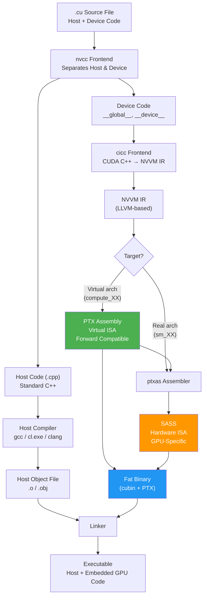
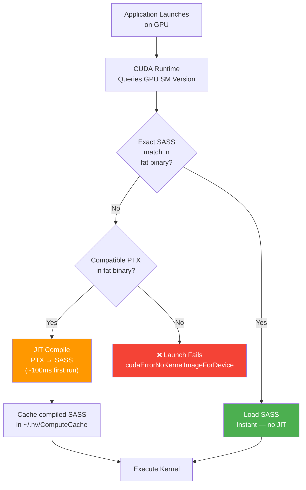
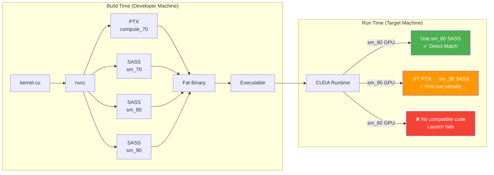

# Chapter 53: CUDA Compilation Pipeline & Toolchain

`Tags: #CUDA #nvcc #PTX #SASS #FatBinary #ComputeCapability #JIT #SeparateCompilation #GPU`

---

## 1. Theory — From `.cu` to Silicon

CUDA compilation is a **multi-stage pipeline** that transforms C++ source with CUDA extensions into executable code for both CPU and GPU. Unlike traditional compilers that produce a single ISA output, `nvcc` must generate code for multiple GPU architectures simultaneously and bundle them into a **fat binary**.

### What / Why / How

- **What**: The `nvcc` compiler driver orchestrates a pipeline from CUDA C++ source through intermediate representations (PTX) to hardware-specific instructions (SASS).
- **Why**: Understanding the pipeline enables architecture-targeted optimization, forward-compatible deployment, and debugging at the right abstraction level.
- **How**: `nvcc` splits host and device code, compiles device code to PTX and/or SASS, bundles architectures into a fat binary, and links with the host toolchain.

---

## 2. The `nvcc` Compilation Pipeline



### Pipeline Stages in Detail

| Stage | Tool | Input | Output | Purpose |
|---|---|---|---|---|
| Splitting | nvcc | `.cu` | Host/device code | Separate CPU and GPU paths |
| Frontend | cicc | Device CUDA C++ | NVVM IR | Parse CUDA extensions, optimize |
| PTX Generation | cicc | NVVM IR | `.ptx` | Virtual ISA, architecture-independent |
| Assembly | ptxas | `.ptx` | `.cubin` (SASS) | Architecture-specific machine code |
| Fat Binary | fatbinary | `.ptx` + `.cubin` | `.fatbin` | Bundle multiple architectures |
| Host Compilation | gcc/cl/clang | Host `.cpp` | `.o` / `.obj` | Standard C++ compilation |
| Linking | nvlink + ld | `.o` + `.fatbin` | Executable | Final executable |

---

## 3. PTX — The Virtual ISA

PTX (Parallel Thread Execution) is NVIDIA's **virtual instruction set architecture**. It's architecture-independent and designed for **forward compatibility**.

### PTX Example

This simple vector addition kernel will be compiled to PTX (Parallel Thread Execution) — NVIDIA's virtual assembly language. Examining the PTX output below reveals how high-level CUDA C++ maps to low-level GPU instructions like `ld.global` (load from global memory), `add.f32` (float add), and `st.global` (store to global memory).

```cuda
// CUDA source
__global__ void add(float* a, float* b, float* c, int n) {
    int i = blockIdx.x * blockDim.x + threadIdx.x;
    if (i < n) c[i] = a[i] + b[i];
}
```

Generates PTX like:

```
.visible .entry add(
    .param .u64 add_param_0,    // float* a
    .param .u64 add_param_1,    // float* b
    .param .u64 add_param_2,    // float* c
    .param .u32 add_param_3     // int n
)
{
    .reg .pred  %p<2>;
    .reg .f32   %f<4>;
    .reg .b32   %r<6>;
    .reg .b64   %rd<10>;

    ld.param.u64    %rd1, [add_param_0];
    ld.param.u64    %rd2, [add_param_1];
    ld.param.u64    %rd3, [add_param_2];
    ld.param.u32    %r1,  [add_param_3];

    mov.u32         %r2, %ctaid.x;       // blockIdx.x
    mov.u32         %r3, %ntid.x;        // blockDim.x
    mov.u32         %r4, %tid.x;         // threadIdx.x
    mad.lo.s32      %r5, %r2, %r3, %r4;  // i = blockIdx.x * blockDim.x + threadIdx.x

    setp.ge.s32     %p1, %r5, %r1;       // if (i >= n)
    @%p1 bra        $L__BB0_2;           //     goto exit

    // c[i] = a[i] + b[i]
    cvt.u64.u32     %rd4, %r5;
    shl.b64         %rd5, %rd4, 2;       // i * sizeof(float)
    add.s64         %rd6, %rd1, %rd5;    // &a[i]
    add.s64         %rd7, %rd2, %rd5;    // &b[i]
    add.s64         %rd8, %rd3, %rd5;    // &c[i]

    ld.global.f32   %f1, [%rd6];         // load a[i]
    ld.global.f32   %f2, [%rd7];         // load b[i]
    add.f32         %f3, %f1, %f2;       // a[i] + b[i]
    st.global.f32   [%rd8], %f3;         // store c[i]

$L__BB0_2:
    ret;
}
```

### Generating PTX

You can ask `nvcc` to output the intermediate PTX representation instead of a final binary. This is useful for inspecting what the compiler generated or for distributing forward-compatible code that the driver can JIT-compile on any future GPU.

```bash
# Generate PTX (human-readable) — no SASS
nvcc --ptx -arch=compute_80 -o kernel.ptx kernel.cu

# Generate PTX and keep it alongside cubin
nvcc --keep -arch=sm_80 -o app kernel.cu
# Produces kernel.ptx in working directory
```

### Why PTX Matters

1. **Forward compatibility**: PTX compiled for `compute_80` can run on any GPU ≥ sm_80. The driver's JIT compiler translates it to the target's SASS at load time.
2. **Debugging**: PTX is human-readable — you can inspect the generated code for optimization issues.
3. **Inline PTX**: You can embed PTX directly in CUDA C++ for low-level control:

Inline PTX lets you embed virtual assembly instructions directly in CUDA C++ for operations not exposed by the high-level API. Here, the `clz.b32` instruction (count leading zeros) is used directly because there's no built-in C++ function for it. The `asm()` syntax follows GCC inline assembly conventions with output (`=r`) and input (`r`) constraints.

```cuda
__device__ int myClz(int x) {
    int result;
    asm("clz.b32 %0, %1;" : "=r"(result) : "r"(x));
    return result;
}
```

---

## 4. SASS — The Real Hardware ISA

SASS (Shader ASSembly) is the **actual machine code** that executes on the GPU's SMs. It's architecture-specific and not forward-compatible.

### Viewing SASS

Use `cuobjdump` or `nvdisasm` to disassemble a compiled CUDA binary and inspect the actual GPU machine instructions. This lets you see exactly what the hardware will execute, including register usage and memory access patterns.

```bash
# Disassemble a compiled binary
cuobjdump --dump-sass ./my_app

# Disassemble a specific kernel
nvdisasm my_app.cubin

# Generate SASS during compilation
nvcc -arch=sm_80 --keep -o app kernel.cu
# Look for *.sass files
```

### SASS Example (Ampere sm_80)

Below is the actual SASS machine code generated for a simple vector addition (`c[i] = a[i] + b[i]`). Each instruction maps directly to a hardware operation — two global memory loads, one floating-point add, and one global memory store.

```
// SASS for c[i] = a[i] + b[i]
      /*0090*/  LDG.E R4, [R2.64] ;       // Load a[i] from global memory
      /*00a0*/  LDG.E R5, [R6.64] ;       // Load b[i] from global memory
      /*00b0*/  FADD R4, R4, R5 ;          // Float add
      /*00c0*/  STG.E [R8.64], R4 ;        // Store c[i] to global memory
```

**Key differences from PTX**: SASS uses real register names (R0-R255), real memory instructions (LDG/STG), and includes scheduling information (stall counts, barriers) that PTX abstracts away.

---

## 5. Fat Binaries — Multi-Architecture Deployment

A fat binary embeds code for **multiple GPU architectures**, allowing one executable to run on different GPUs.

### The `--gencode` Flag

The `--gencode` flag lets you embed SASS code for multiple GPU architectures into a single executable (a "fat binary"). Each `--gencode` entry specifies a virtual architecture for PTX generation and a real architecture for SASS generation, so your program runs natively on all listed GPUs.

```bash
# Build for Volta, Turing, Ampere, and Hopper
nvcc kernel.cu -o app \
    --gencode arch=compute_70,code=sm_70 \
    --gencode arch=compute_75,code=sm_75 \
    --gencode arch=compute_80,code=sm_80 \
    --gencode arch=compute_90,code=sm_90

# Also embed PTX for forward compatibility with future GPUs
nvcc kernel.cu -o app \
    --gencode arch=compute_70,code=sm_70 \
    --gencode arch=compute_80,code=sm_80 \
    --gencode arch=compute_90,code=\"sm_90,compute_90\"
```

### How Fat Binary Selection Works



### Practical Guideline

For most projects, you only need a few `--gencode` entries to cover the GPU generations you care about. Including a PTX entry for the newest architecture ensures forward compatibility — the driver can JIT-compile that PTX for any future GPU.

```bash
# Minimum for broad compatibility (covers V100 through H100 + future)
nvcc kernel.cu -o app \
    -gencode arch=compute_70,code=sm_70 \
    -gencode arch=compute_80,code=sm_80 \
    -gencode arch=compute_90,code=\"sm_90,compute_90\"
#                                        ^^^^^^^^^^
#                            PTX for forward compat with sm_100+
```

---

## 6. Compute Capability — Feature Matrix

Compute capability determines which hardware features and instructions are available.

| Compute Cap | Architecture | Key Features | Notable GPUs |
|---|---|---|---|
| 5.0 / 5.2 | Maxwell | Dynamic parallelism, shared atomics | GTX 980, Tesla M40 |
| 6.0 / 6.1 | Pascal | Unified Memory, FP16 compute, NVLink | P100 (6.0), GTX 1080 (6.1) |
| 7.0 | Volta | Tensor Cores (1st gen), independent thread scheduling | V100 |
| 7.5 | Turing | RT Cores, INT8 Tensor Cores, mixed precision | RTX 2080, T4 |
| 8.0 / 8.6 | Ampere | TF32, BF16 Tensor Cores, async memcpy, memory pools | A100 (8.0), RTX 3090 (8.6) |
| 8.9 | Ada Lovelace | FP8 Tensor Cores, DLSS 3 | RTX 4090, L40 |
| 9.0 | Hopper | Transformer Engine, DPX, TMA, cluster launch | H100 |
| 10.0 | Blackwell | FP4 Tensor Cores, 5th gen NVLink | B200 |

### Checking Compute Capability at Runtime

This program queries the GPU's compute capability and hardware specifications at runtime using `cudaGetDeviceProperties`. The compute capability number (e.g., 8.0 for Ampere, 9.0 for Hopper) determines which features and instructions are available. Always check this before using architecture-specific features like Tensor Cores or async memcpy.

```cuda
#include <cstdio>

int main() {
    cudaDeviceProp prop;
    cudaGetDeviceProperties(&prop, 0);

    printf("Device: %s\n", prop.name);
    printf("Compute Capability: %d.%d\n", prop.major, prop.minor);
    printf("SM Count: %d\n", prop.multiProcessorCount);
    printf("Max Threads/Block: %d\n", prop.maxThreadsPerBlock);
    printf("Shared Memory/Block: %zu bytes\n", prop.sharedMemPerBlock);
    printf("Warp Size: %d\n", prop.warpSize);
    printf("Max Shared Memory/SM: %zu bytes\n",
           prop.sharedMemPerMultiprocessor);
    return 0;
}
```

### Compile-Time Feature Guards

The `__CUDA_ARCH__` macro lets you write different code paths for different GPU architectures at compile time. This is essential when using features only available on newer GPUs — like async memory copy on Ampere (sm_80+) or Tensor Cores on Volta (sm_70+). The compiler includes only the matching path for each target architecture.

```cuda
#if __CUDA_ARCH__ >= 800
    // Ampere+ features: async memcpy, reduced precision
    __pipeline_memcpy_async(dst, src, 16);
#elif __CUDA_ARCH__ >= 700
    // Volta+ features: tensor cores, independent scheduling
    wmma::load_matrix_sync(a_frag, a_ptr, lda);
#else
    // Fallback for older architectures
    dst[tid] = src[tid];
#endif
```

**Important**: `__CUDA_ARCH__` is only defined in **device** code. It's undefined in host code.

---

## 7. `-arch` and `-code` Flags Deep Dive

### Virtual vs Real Architecture

The `-arch` flag serves double duty. When targeting a virtual architecture (`compute_XX`), `nvcc` emits PTX that is forward-compatible. When targeting a real architecture (`sm_XX`), it emits final SASS machine code for that specific GPU. The table below the snippet summarizes how different flag combinations affect compatibility and performance.

```
-arch=compute_XX  → Virtual architecture (PTX generation target)
-arch=sm_XX       → Real architecture (SASS generation target)
```

| Flag | Generates | Forward Compatible | JIT Needed |
|---|---|---|---|
| `-arch=compute_80` | PTX for compute_80 | Yes (any sm_80+) | Yes (always) |
| `-arch=sm_80` | SASS for sm_80 + PTX for compute_80 | Partial | Only on newer GPUs |
| `--gencode arch=compute_80,code=sm_80` | SASS for sm_80 only | No | N/A |
| `--gencode arch=compute_80,code="sm_80,compute_80"` | SASS + PTX | Yes | On newer GPUs |

### Shorthand

Instead of writing out the full `--gencode` syntax, you can use the shorter `-arch=sm_XX` flag. This is equivalent to generating both SASS for that architecture and PTX for forward compatibility — a convenient default for single-target builds.

```bash
# Equivalent to: --gencode arch=compute_80,code="sm_80,compute_80"
nvcc -arch=sm_80 kernel.cu

# ONLY PTX — always JIT compiled
nvcc -arch=compute_80 kernel.cu

# Multiple real architectures
nvcc -arch=sm_80 -code=sm_80,sm_86,sm_90 kernel.cu
```

---

## 8. Separate Compilation & Device Linking

By default, all device code must be in a **single compilation unit**. Separate compilation enables modular CUDA projects.

### The Problem

This example shows two `.cu` files where `file2.cu` wants to call a `__device__` function defined in `file1.cu`. Without special flags, this fails because CUDA's default compilation mode inlines all device code within a single file — it can't resolve cross-file device function references.

```cuda
// file1.cu
__device__ float helper(float x) { return x * x; }

// file2.cu
__device__ float helper(float x);  // Declaration
__global__ void kernel(float* data) {
    data[threadIdx.x] = helper(data[threadIdx.x]);
}
```

Without separate compilation, compiling multiple `.cu` files individually and linking them will fail when one file references a `__device__` function defined in another — the linker cannot resolve cross-file device symbols.

```bash
nvcc -c file1.cu -o file1.o
nvcc -c file2.cu -o file2.o
nvcc file1.o file2.o -o app  # Link error: helper not found!
```

### The Solution: Relocatable Device Code (RDC)

The `-dc` flag tells `nvcc` to compile each `.cu` file into a relocatable device object that can reference `__device__` functions defined in other files. A separate device-link step then resolves all cross-file device references before producing the final executable.

```bash
# Enable separate compilation with -dc (device compile)
nvcc -dc -arch=sm_80 file1.cu -o file1.o
nvcc -dc -arch=sm_80 file2.cu -o file2.o

# Device link + host link
nvcc -arch=sm_80 file1.o file2.o -o app
```

### CMake Integration

CMake 3.18+ has native CUDA support. Setting `CMAKE_CUDA_SEPARABLE_COMPILATION ON` enables relocatable device code across all targets, and `CMAKE_CUDA_ARCHITECTURES` controls which GPU architectures to build for — no manual `--gencode` flags needed.

```cmake
cmake_minimum_required(VERSION 3.18)
project(MyApp LANGUAGES CXX CUDA)

set(CMAKE_CUDA_ARCHITECTURES 80 86 90)
set(CMAKE_CUDA_SEPARABLE_COMPILATION ON)  # Enable RDC

add_executable(myapp file1.cu file2.cu main.cu)
target_compile_options(myapp PRIVATE $<$<COMPILE_LANGUAGE:CUDA>:--extended-lambda>)
```

### When to Use Separate Compilation

| Scenario | Recommendation |
|---|---|
| Small project, few `.cu` files | Single compilation (default) — simpler |
| Large project, modular device libraries | Separate compilation — essential |
| Using `__device__` functions across files | Separate compilation required |
| Dynamic parallelism (`<<<>>>` from device) | Separate compilation required |

**Cost**: Separate compilation prevents some cross-file inlining optimizations. Profile to measure impact.

---

## 9. CUDA C++ Language Extensions

### What Works in Device Code

| C++ Feature | Device Support | Notes |
|---|---|---|
| Templates | ✅ Full | Heavily used (thrust, CUTLASS) |
| Lambdas | ✅ With `--extended-lambda` | `__device__` lambdas require flag |
| `constexpr` | ✅ Full | Great for compile-time constants |
| Virtual functions | ⚠️ Limited | Object must be constructed on device |
| Exceptions (`throw`/`catch`) | ❌ No | Use error codes / `assert()` |
| `std::string`, `std::vector` | ❌ No | Use raw arrays / thrust |
| `new` / `delete` | ⚠️ Device heap | Slow, limited pool (~8 MB default) |
| `printf` | ✅ With caveats | Limited buffer, flushed on sync |
| `assert()` | ✅ | Calls `__trap()` on failure |
| RTTI (`dynamic_cast`, `typeid`) | ❌ No | Static dispatch only |
| `thread_local` | ❌ No | Use registers / shared memory |
| Structured bindings (C++17) | ✅ | `auto [a, b] = pair;` |
| `if constexpr` (C++17) | ✅ | Great for compile-time branching |
| `std::optional` (C++17) | ❌ No | Implement manually |
| Concepts (C++20) | ⚠️ Partial | Depends on nvcc version |

### `--extended-lambda` for Device Lambdas

The `--extended-lambda` flag allows you to use C++ lambdas annotated with `__device__` inside CUDA kernels. This enables a more functional programming style on the GPU, such as passing transformation functions inline without writing separate `__device__` helper functions.

```cuda
// Requires: nvcc --extended-lambda
#include <cstdio>

__global__ void applyLambda(float* data, int N) {
    auto square = [] __device__ (float x) { return x * x; };

    int idx = blockIdx.x * blockDim.x + threadIdx.x;
    if (idx < N)
        data[idx] = square(data[idx]);
}
```

---

## 10. `nvcc` C++ Standard Compatibility

| Standard | nvcc Support | Notes |
|---|---|---|
| C++11 | ✅ Full | Default on modern nvcc |
| C++14 | ✅ Full | `-std=c++14` |
| C++17 | ✅ Mostly | `-std=c++17` — structured bindings, `if constexpr`, fold expressions |
| C++20 | ⚠️ Partial | `-std=c++20` — concepts partial, modules unsupported |
| C++23 | ❌ Experimental | Very limited |

Use the `-std=` flag to select which C++ standard `nvcc` compiles against, and `-ccbin` to specify a particular host compiler version. Matching the host compiler to a supported version avoids cryptic template errors.

```bash
# Compile with C++17
nvcc -std=c++17 --extended-lambda -arch=sm_80 -o app kernel.cu

# Using a specific host compiler
nvcc -ccbin /usr/bin/g++-12 -std=c++17 -arch=sm_80 -o app kernel.cu
```

### Host Compiler Compatibility

| nvcc Version | Max gcc | Max clang | Max MSVC |
|---|---|---|---|
| CUDA 11.8 | gcc 11 | clang 14 | MSVC 2022 |
| CUDA 12.0+ | gcc 12 | clang 15 | MSVC 2022 |
| CUDA 12.4+ | gcc 13 | clang 16 | MSVC 2022 |

Mismatched host compiler versions cause cryptic template errors. Always check the [CUDA release notes](https://docs.nvidia.com/cuda/cuda-toolkit-release-notes/) for compatibility.

---

## 11. JIT Compilation — Runtime PTX Translation

When a fat binary contains PTX but no matching SASS for the target GPU, the CUDA driver **JIT compiles** PTX to SASS at first load.

### JIT Compilation Flow

This diagram shows what happens at runtime when your application launches on a GPU that doesn't have pre-compiled SASS in the fat binary. The driver falls back to PTX, compiles it on-the-fly for the target GPU, and caches the result so subsequent runs are instant.

```
Application starts on GPU with sm_90 (Hopper)
 └─ Fat binary contains: sm_80 SASS + compute_80 PTX
     └─ No sm_90 SASS match
         └─ Driver finds compute_80 PTX (compatible with sm_90)
             └─ JIT compiles PTX → sm_90 SASS (~100-500ms)
                 └─ Caches result in ~/.nv/ComputeCache/
                     └─ Subsequent launches: instant (cached)
```

### JIT Cache Management

These environment variables control how the CUDA driver caches JIT-compiled kernels. Enabling the cache (default) means the slow PTX-to-SASS compilation only happens once per kernel per GPU type. Setting `CUDA_CACHE_DISABLE=1` forces recompilation every launch, which is useful for debugging JIT issues.

```bash
# Environment variables controlling JIT cache
export CUDA_CACHE_DISABLE=0           # Enable caching (default)
export CUDA_CACHE_MAXSIZE=268435456   # Max cache size: 256 MB
export CUDA_CACHE_PATH=~/.nv/ComputeCache  # Cache location

# Force JIT recompilation (debugging)
export CUDA_CACHE_DISABLE=1

# View JIT compilation log
export CUDA_LOG_LEVEL=50  # Verbose CUDA driver logging
```

### When JIT Happens

1. **New GPU architecture**: Binary has PTX but not SASS for the current GPU.
2. **`cuModuleLoadData`**: Loading PTX at runtime (CUDA Driver API).
3. **`cudaLaunchKernel` first call**: If PTX needs compilation for this GPU.

### Performance Impact

- First load: 100-500ms per kernel (depends on complexity).
- Cached load: ~1ms (reading from disk cache).
- No JIT needed: ~0ms (SASS match in fat binary).

**Best practice**: Ship SASS for all target architectures + PTX for future GPUs.

---

## 12. Advanced: `nvcc` Useful Flags

These `nvcc` flags cover common compilation scenarios. `--keep` preserves intermediate PTX and cubin files for inspection. `--maxrregcount` limits register usage per thread to increase occupancy (at the risk of register spilling). `--use_fast_math` trades precision for speed on transcendental functions. `-lineinfo` adds source line information for profiling without the performance cost of full debug mode.

```bash
# Verbose compilation — see all stages
nvcc -v kernel.cu -o app 2>&1 | head -50

# Keep intermediate files (.ptx, .cubin, .fatbin)
nvcc --keep -arch=sm_80 kernel.cu -o app

# Maximum register usage per thread (limits occupancy tradeoff)
nvcc --maxrregcount=32 -arch=sm_80 kernel.cu -o app

# Fast math (less accurate but faster transcendentals)
nvcc --use_fast_math -arch=sm_80 kernel.cu -o app

# Generate line info for profiling (no debug overhead)
nvcc -lineinfo -arch=sm_80 kernel.cu -o app

# Optimization level
nvcc -O3 -arch=sm_80 kernel.cu -o app

# Relocatable device code (for separate compilation)
nvcc -rdc=true -arch=sm_80 kernel.cu -o app

# Warning: treat all warnings as errors
nvcc -Werror all-warnings -arch=sm_80 kernel.cu -o app
```

---

## 13. Compilation Architecture Diagram



---

## 14. Exercises

### 🟢 Beginner

1. Compile a simple vector-add kernel with `--ptx` flag. Open the `.ptx` file and identify the `ld.global`, `add.f32`, and `st.global` instructions.

2. Write a program that queries and prints all device properties (compute capability, SM count, shared memory size, warp size). Compile for `sm_80` and verify.

### 🟡 Intermediate

3. Create a fat binary that includes SASS for sm_70, sm_80, sm_90 plus PTX for compute_70 (forward compat). Use `cuobjdump --list-elf` and `cuobjdump --list-ptx` to verify all architectures are embedded.

4. Set up a two-file CUDA project with a `__device__` helper function in one file called from a `__global__` kernel in another. Use separate compilation (`-dc` + device linking). Create a Makefile.

### 🔴 Advanced

5. Write a kernel that uses `#if __CUDA_ARCH__` guards to select different implementations for sm_70 (warp shuffle reduction) vs sm_80+ (async memcpy + shared memory). Compile with `--gencode` for both architectures and verify both paths work.

---

## 15. Solutions

### Solution 1 (🟢 Inspecting PTX)

This solution creates a simple kernel, compiles it to PTX with `--ptx`, then uses `grep` to find the key instructions: `ld.global` (load from GPU global memory), `add.f32` (single-precision float addition), and `st.global` (store to global memory). This is how you verify what instructions the compiler generates from your CUDA C++ code.

```bash
# Source file: vecadd.cu
cat > vecadd.cu << 'EOF'
__global__ void vecadd(const float* a, const float* b, float* c, int n) {
    int i = blockIdx.x * blockDim.x + threadIdx.x;
    if (i < n) c[i] = a[i] + b[i];
}
EOF

# Compile to PTX
nvcc --ptx -arch=compute_80 -o vecadd.ptx vecadd.cu

# Inspect PTX (look for key instructions)
grep -E "ld\.global|add\.f32|st\.global" vecadd.ptx
```

Expected output:
```
    ld.global.f32   %f1, [%rd6];    // Load a[i]
    ld.global.f32   %f2, [%rd7];    // Load b[i]
    add.f32         %f3, %f1, %f2;  // a[i] + b[i]
    st.global.f32   [%rd8], %f3;    // Store c[i]
```

### Solution 4 (🟡 Separate Compilation)

This is the helper file containing a `__device__` function that will be called from a kernel in a separate file. The `__device__` qualifier means this function runs on the GPU and can only be called from other GPU code.

```cuda
// helper.cu
__device__ float square(float x) {
    return x * x;
}
```

This main file forward-declares the `square` function from helper.cu and calls it from a `__global__` kernel. With separate compilation (`-dc` flag), the linker resolves the cross-file device function reference — just like regular C++ linking works for CPU functions.

```cuda
// main.cu
#include <cstdio>

__device__ float square(float x);  // Forward declaration

__global__ void kernel(float* data, int N) {
    int i = blockIdx.x * blockDim.x + threadIdx.x;
    if (i < N) data[i] = square(data[i]);
}

int main() {
    int N = 256;
    float h_data[256], *d_data;
    for (int i = 0; i < N; i++) h_data[i] = (float)i;

    cudaMalloc(&d_data, N * sizeof(float));
    cudaMemcpy(d_data, h_data, N * sizeof(float), cudaMemcpyHostToDevice);

    kernel<<<1, 256>>>(d_data, N);

    cudaMemcpy(h_data, d_data, N * sizeof(float), cudaMemcpyDeviceToHost);
    printf("data[5] = %.0f (expected 25)\n", h_data[5]);

    cudaFree(d_data);
    return 0;
}
```

This Makefile demonstrates the separate compilation workflow: each `.cu` file is compiled independently with the `-dc` (device compile) flag to produce relocatable device code, then all object files are linked together in the final `nvcc` step which handles both device linking and host linking.

```makefile
# Makefile
NVCC = nvcc
ARCH = -arch=sm_80
FLAGS = -dc $(ARCH)

all: app

helper.o: helper.cu
	$(NVCC) $(FLAGS) -c helper.cu -o helper.o

main.o: main.cu
	$(NVCC) $(FLAGS) -c main.cu -o main.o

app: helper.o main.o
	$(NVCC) $(ARCH) helper.o main.o -o app

clean:
	rm -f *.o app

.PHONY: all clean
```

---

## 16. Quiz

**Q1**: What is PTX?
**(a)** Hardware machine code **(b)** A virtual ISA that's forward-compatible across GPU generations ✅ **(c)** A profiling format **(d)** A debug symbol format

**Q2**: What happens when a fat binary has no matching SASS for the current GPU but contains compatible PTX?
**(a)** The program crashes **(b)** The driver JIT-compiles PTX to SASS at runtime ✅ **(c)** It falls back to CPU execution **(d)** It runs in emulation mode

**Q3**: The `-dc` flag enables:
**(a)** Debug compilation **(b)** Device-side compilation for separate compilation / relocatable device code ✅ **(c)** Dynamic CUDA **(d)** Deferred compilation

**Q4**: `__CUDA_ARCH__` is defined:
**(a)** In both host and device code **(b)** Only in device code during compilation ✅ **(c)** At runtime **(d)** In PTX only

**Q5**: Which tool converts PTX to SASS?
**(a)** cicc **(b)** nvcc **(c)** ptxas ✅ **(d)** nvlink

**Q6**: A `--gencode arch=compute_80,code=sm_80` entry in the compilation generates:
**(a)** Only PTX **(b)** Only SASS for sm_80 ✅ **(c)** Both PTX and SASS **(d)** SASS for all sm_80+ GPUs

**Q7**: Which C++ feature is NOT supported in CUDA device code?
**(a)** Templates **(b)** Lambdas **(c)** `constexpr` **(d)** Exceptions (`throw`/`catch`) ✅

**Q8**: The JIT compilation cache is stored in:
**(a)** GPU memory **(b)** `~/.nv/ComputeCache/` ✅ **(c)** `/usr/local/cuda/cache/` **(d)** The executable itself

---

## 17. Key Takeaways

1. **nvcc splits** host and device code, compiling each through separate toolchains.
2. **PTX is the virtual ISA** — architecture-independent and forward-compatible. Always embed PTX for future GPU support.
3. **SASS is the real ISA** — architecture-specific machine code. Pre-compiled SASS avoids JIT overhead.
4. **Fat binaries** bundle multiple SASS + PTX versions. Use `--gencode` for each target architecture.
5. **Separate compilation** (`-dc`) enables modular CUDA projects with cross-file `__device__` functions.
6. **`__CUDA_ARCH__`** enables compile-time architecture-specific code paths.
7. **JIT compilation** translates PTX to SASS at first runtime — cached for subsequent launches.

---

## 18. Chapter Summary

This chapter demystified the CUDA compilation pipeline from source code through PTX and SASS to fat binaries. We traced how `nvcc` orchestrates cicc, ptxas, and the host compiler to produce multi-architecture executables. We examined PTX as a debugging and portability tool, SASS as the performance-critical hardware ISA, and fat binaries as the deployment format. We covered compute capability feature matrices, separate compilation for modular projects, C++ feature support in device code, and JIT compilation mechanics. Understanding this pipeline is essential for targeting specific architectures, debugging optimization issues at the instruction level, and deploying CUDA applications across GPU generations.

---

## 19. Real-World AI/ML Insight

**PyTorch and JAX** use JIT compilation extensively. When you write a custom kernel with Triton or torch.compile, the framework generates PTX at runtime, JIT-compiles it to SASS for your specific GPU, and caches the result. NVIDIA's TensorRT uses the same mechanism — its "engine building" phase compiles optimized SASS for the target GPU, which is why TensorRT engines are not portable across GPU architectures. Understanding PTX ↔ SASS ↔ JIT helps debug deployment issues like "model runs on A100 but fails on T4" — it's often a compute capability mismatch in the fat binary.

---

## 20. Common Mistakes

| Mistake | Consequence | Fix |
|---|---|---|
| Compiling only for `-arch=sm_80` and deploying on sm_90 | Falls back to JIT (slow first launch) or fails if no PTX | Add PTX: `code="sm_80,compute_80"` |
| Using `__CUDA_ARCH__` in host code | It's undefined → wrong code path or compilation error | Guard with `#ifdef __CUDA_ARCH__` |
| Mismatched host compiler version | Cryptic template errors during compilation | Check CUDA release notes for compatibility |
| Not using `--extended-lambda` | Device lambdas fail to compile | Add `--extended-lambda` to nvcc flags |
| Single `--gencode` for all deployments | Binary fails on older/newer GPUs | Add multiple `--gencode` entries |

---

## 21. Interview Questions

**Q1: Explain the difference between PTX and SASS. Why does NVIDIA use two levels of representation?**

**A**: PTX is a virtual ISA — a stable, documented instruction set that abstracts hardware details. It's forward-compatible: PTX for compute_70 runs on any sm_70+ GPU. SASS is the real hardware ISA — machine code specific to each GPU architecture, with real register allocation and instruction scheduling. The two-level approach provides both compatibility (PTX) and performance (SASS). When you deploy an app, you embed pre-compiled SASS for known GPUs (zero JIT overhead) plus PTX for future GPUs (JIT-compiled at first runtime). This is similar to how Java bytecode (platform-independent) is JIT-compiled to native code.

**Q2: How would you build a CUDA application that needs to run on V100 (sm_70), A100 (sm_80), and H100 (sm_90)?**

**A**: Use multiple `--gencode` flags: one for each target architecture's SASS, plus PTX for forward compatibility:
```
nvcc --gencode arch=compute_70,code=sm_70 \
     --gencode arch=compute_80,code=sm_80 \
     --gencode arch=compute_90,code="sm_90,compute_90" \
     -o app kernel.cu
```
This embeds SASS for sm_70, sm_80, and sm_90 (instant launch on all three), plus PTX for compute_90 (JIT-compiled on any future GPU ≥ sm_90). The binary is larger but maximally compatible.

**Q3: What is separate compilation in CUDA and when is it necessary?**

**A**: By default, nvcc inlines all device code within a single translation unit — `__device__` functions can't be called across `.cu` files. Separate compilation (`-dc` flag / `-rdc=true`) generates relocatable device code (RDC), enabling cross-file device function calls, similar to how regular C++ separate compilation works. It's necessary when: (1) your project has `__device__` functions in library files used by multiple kernels; (2) you use dynamic parallelism (device-side kernel launches); (3) you're building modular CUDA libraries. The tradeoff is slightly larger binary size and lost cross-file inlining opportunities.

**Q4: What is JIT compilation in CUDA and how does caching work?**

**A**: JIT (Just-In-Time) compilation occurs when a fat binary contains PTX but no matching SASS for the current GPU. The CUDA driver invokes ptxas internally to compile PTX to SASS at the application's first kernel load. This adds 100-500ms latency on first run but the result is cached in `~/.nv/ComputeCache/`. Subsequent runs load the cached SASS instantly. The cache persists across reboots and is keyed by PTX content hash + GPU architecture. You can control cache behavior via `CUDA_CACHE_DISABLE`, `CUDA_CACHE_MAXSIZE`, and `CUDA_CACHE_PATH` environment variables.
