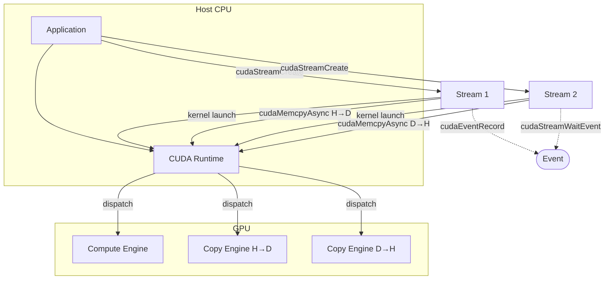
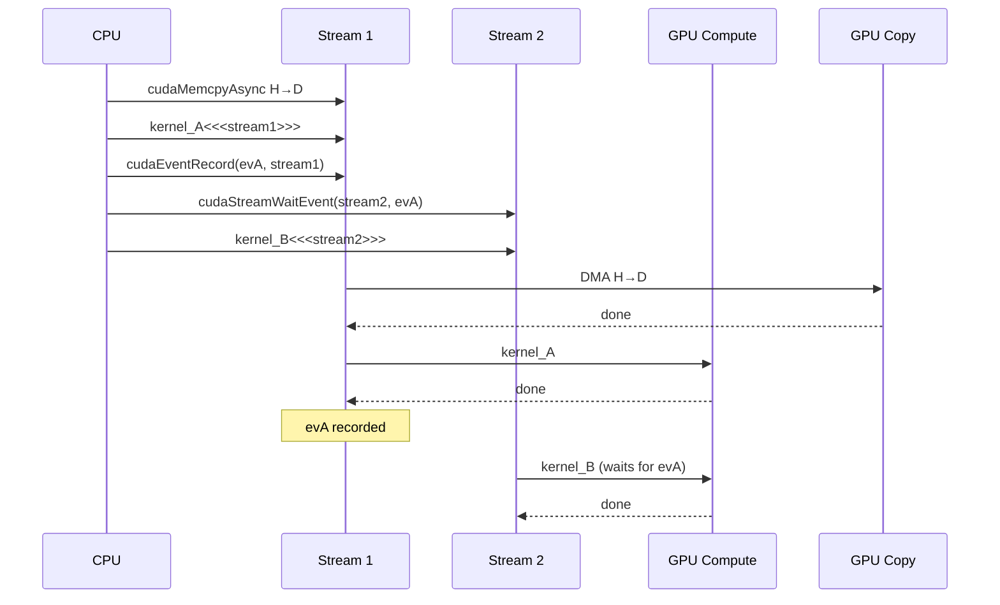

# Chapter 54 — Streams & Async Execution
`#cuda #streams #concurrency #async #overlap #pipelining`

---

## 1. Theory — Deep Dive

CUDA streams are the fundamental mechanism for expressing **concurrency** on the GPU.
A stream is an in-order queue of GPU operations — kernels, memory copies, events —
that execute sequentially *within* the stream but can overlap *across* streams.

### The Hardware Basis

Modern NVIDIA GPUs expose **independent hardware engines**:

| Engine | Purpose |
|--------|---------|
| Compute Engine(s) | Execute kernels on SMs |
| Copy Engine H→D | DMA from pinned host memory to device |
| Copy Engine D→H | DMA from device to pinned host memory |

Because these engines are physically separate, a kernel can run **simultaneously**
with an H→D copy on one engine and a D→H copy on the other.

### The Default Stream

Every CUDA call without an explicit stream uses the **default (NULL) stream**:
* **Legacy default stream** (pre-CUDA 7 behavior): implicit synchronization barrier —
  no other stream's work overlaps with it.
* **Per-thread default stream** (`--default-stream per-thread`): each CPU thread gets
  its own default stream, enabling overlap without explicit stream creation.

> If you never create explicit streams, all GPU work is serialized.

### Pinned Memory — The Prerequisite

`cudaMemcpyAsync` is truly asynchronous **only** with pinned host memory
(`cudaMallocHost` / `cudaHostAlloc`). With pageable memory the driver silently
falls back to synchronous copying because the OS could swap the page mid-DMA.

---

## 2. What / Why / How

**What:** Streams are software queues mapping onto GPU hardware queues.
Operations on the same stream execute in order; different streams may overlap.

**Why:** (1) Hide PCIe transfer latency behind compute. (2) Pipeline batches —
process chunk N while copying chunk N+1. (3) Reduce wall-clock time.

**How:** The runtime dispatches each operation to its hardware engine. A kernel
goes to the compute engine; `cudaMemcpyAsync` goes to a copy engine. If they
are on different streams, they proceed in parallel with no software overhead.

---

## 3. Code Examples

### Error Checking Macro (used by all examples)

This macro wraps every CUDA API call and checks the return code for errors, printing the file and line number if something fails. We use this pattern throughout the chapter so that asynchronous errors from stream operations are caught immediately instead of silently corrupting results.

```cuda
#include <cstdio>
#include <cstdlib>

#define CUDA_CHECK(call)                                                  \
    do {                                                                  \
        cudaError_t err = (call);                                         \
        if (err != cudaSuccess) {                                         \
            fprintf(stderr, "CUDA error at %s:%d — %s\n",                \
                    __FILE__, __LINE__, cudaGetErrorString(err));          \
            exit(EXIT_FAILURE);                                           \
        }                                                                 \
    } while (0)
```

### Example 1 — Basic Stream Creation & Async Memcpy

This example creates a single non-default CUDA stream, then uses it to perform an asynchronous host-to-device copy, launch a kernel, and copy the results back — all without blocking the CPU until `cudaStreamSynchronize`. Pinned memory (`cudaMallocHost`) is used because `cudaMemcpyAsync` only runs truly asynchronously with page-locked host allocations.

```cuda
#include <cstdio>
#include <cstdlib>
#define CUDA_CHECK(call) do { cudaError_t err=(call); if(err!=cudaSuccess){ \
    fprintf(stderr,"CUDA error %s:%d — %s\n",__FILE__,__LINE__,            \
    cudaGetErrorString(err)); exit(1); } } while(0)

__global__ void scale(float* data, float factor, int n) {
    int i = blockIdx.x * blockDim.x + threadIdx.x;
    if (i < n) data[i] *= factor;
}

int main() {
    const int N = 1 << 20;
    const size_t bytes = N * sizeof(float);

    float* h_data;
    CUDA_CHECK(cudaMallocHost(&h_data, bytes));          // pinned!
    for (int i = 0; i < N; i++) h_data[i] = (float)i;

    float* d_data;
    CUDA_CHECK(cudaMalloc(&d_data, bytes));

    cudaStream_t stream;
    CUDA_CHECK(cudaStreamCreate(&stream));

    CUDA_CHECK(cudaMemcpyAsync(d_data, h_data, bytes,
                               cudaMemcpyHostToDevice, stream));
    scale<<<(N+255)/256, 256, 0, stream>>>(d_data, 2.0f, N);
    CUDA_CHECK(cudaGetLastError());
    CUDA_CHECK(cudaMemcpyAsync(h_data, d_data, bytes,
                               cudaMemcpyDeviceToHost, stream));
    CUDA_CHECK(cudaStreamSynchronize(stream));

    bool ok = true;
    for (int i = 0; i < N; i++)
        if (h_data[i] != (float)i * 2.0f) { ok = false; break; }
    printf("Result: %s\n", ok ? "PASS" : "FAIL");

    CUDA_CHECK(cudaStreamDestroy(stream));
    CUDA_CHECK(cudaFreeHost(h_data));
    CUDA_CHECK(cudaFree(d_data));
    return 0;
}
```

### Example 2 — Multi-Stream Pipeline (3-Stage Overlap)

This example splits a large array into 4 chunks and assigns each chunk to its own CUDA stream. Each stream independently performs H→D copy, kernel execution, and D→H copy. Because these operations go to separate GPU hardware engines, chunks overlap: while stream 0 computes, stream 1 can be copying data in. This demonstrates the classic multi-stream pipelining pattern that approaches N× speedup for N balanced stages.

```cuda
#include <cstdio>
#include <cstdlib>
#define CUDA_CHECK(call) do { cudaError_t err=(call); if(err!=cudaSuccess){ \
    fprintf(stderr,"CUDA error %s:%d — %s\n",__FILE__,__LINE__,            \
    cudaGetErrorString(err)); exit(1); } } while(0)

__global__ void process(float* out, const float* in, int n) {
    int i = blockIdx.x * blockDim.x + threadIdx.x;
    if (i < n) out[i] = in[i] * in[i] + in[i];
}

int main() {
    const int N = 1 << 22, NS = 4, CHUNK = N / NS;
    const size_t cb = CHUNK * sizeof(float);

    float *h_in, *h_out;
    CUDA_CHECK(cudaMallocHost(&h_in,  N * sizeof(float)));
    CUDA_CHECK(cudaMallocHost(&h_out, N * sizeof(float)));
    for (int i = 0; i < N; i++) h_in[i] = (float)i;

    float *d_in, *d_out;
    CUDA_CHECK(cudaMalloc(&d_in,  N * sizeof(float)));
    CUDA_CHECK(cudaMalloc(&d_out, N * sizeof(float)));

    cudaStream_t st[NS];
    for (int s = 0; s < NS; s++) CUDA_CHECK(cudaStreamCreate(&st[s]));

    int thr = 256, blk = (CHUNK + thr - 1) / thr;
    for (int s = 0; s < NS; s++) {
        int off = s * CHUNK;
        CUDA_CHECK(cudaMemcpyAsync(d_in+off, h_in+off, cb,
                                   cudaMemcpyHostToDevice, st[s]));
        process<<<blk, thr, 0, st[s]>>>(d_out+off, d_in+off, CHUNK);
        CUDA_CHECK(cudaGetLastError());
        CUDA_CHECK(cudaMemcpyAsync(h_out+off, d_out+off, cb,
                                   cudaMemcpyDeviceToHost, st[s]));
    }
    CUDA_CHECK(cudaDeviceSynchronize());

    printf("h_out[0]=%.0f  h_out[N-1]=%.0f\n", h_out[0], h_out[N-1]);

    for (int s = 0; s < NS; s++) CUDA_CHECK(cudaStreamDestroy(st[s]));
    CUDA_CHECK(cudaFreeHost(h_in));  CUDA_CHECK(cudaFreeHost(h_out));
    CUDA_CHECK(cudaFree(d_in));      CUDA_CHECK(cudaFree(d_out));
    return 0;
}
```

### Example 3 — Event-Based Timing

This example uses CUDA events to measure GPU execution time with sub-millisecond precision. Two events are recorded into the stream — one before and one after the full pipeline — and `cudaEventElapsedTime` computes the wall-clock duration. Unlike CPU-side timing, CUDA events measure time on the GPU clock, giving accurate results even when the CPU returns immediately from async launches.

```cuda
#include <cstdio>
#include <cstdlib>
#include <cmath>
#define CUDA_CHECK(call) do { cudaError_t err=(call); if(err!=cudaSuccess){ \
    fprintf(stderr,"CUDA error %s:%d — %s\n",__FILE__,__LINE__,            \
    cudaGetErrorString(err)); exit(1); } } while(0)

__global__ void work(float* data, int n) {
    int i = blockIdx.x * blockDim.x + threadIdx.x;
    if (i < n) { float v=data[i]; for(int j=0;j<100;j++) v=sinf(v)+1.f; data[i]=v; }
}

int main() {
    const int N = 1 << 20;
    const size_t bytes = N * sizeof(float);

    float* h; CUDA_CHECK(cudaMallocHost(&h, bytes));
    float* d; CUDA_CHECK(cudaMalloc(&d, bytes));
    for (int i = 0; i < N; i++) h[i] = 1.f;

    cudaStream_t s; CUDA_CHECK(cudaStreamCreate(&s));
    cudaEvent_t t0, t1;
    CUDA_CHECK(cudaEventCreate(&t0));
    CUDA_CHECK(cudaEventCreate(&t1));

    CUDA_CHECK(cudaEventRecord(t0, s));
    CUDA_CHECK(cudaMemcpyAsync(d, h, bytes, cudaMemcpyHostToDevice, s));
    work<<<(N+255)/256, 256, 0, s>>>(d, N);
    CUDA_CHECK(cudaGetLastError());
    CUDA_CHECK(cudaMemcpyAsync(h, d, bytes, cudaMemcpyDeviceToHost, s));
    CUDA_CHECK(cudaEventRecord(t1, s));
    CUDA_CHECK(cudaEventSynchronize(t1));

    float ms = 0.f;
    CUDA_CHECK(cudaEventElapsedTime(&ms, t0, t1));
    printf("Pipeline time: %.3f ms\n", ms);

    CUDA_CHECK(cudaEventDestroy(t0)); CUDA_CHECK(cudaEventDestroy(t1));
    CUDA_CHECK(cudaStreamDestroy(s));
    CUDA_CHECK(cudaFreeHost(h)); CUDA_CHECK(cudaFree(d));
    return 0;
}
```

### Example 4 — Stream Priorities

This example creates two streams with different priority levels using `cudaStreamCreateWithPriority`. A long-running kernel is launched on the low-priority stream, and a short kernel on the high-priority stream. CUDA events time each kernel independently. This demonstrates how stream priorities influence CTA scheduling order — the GPU scheduler prefers dispatching new thread blocks from higher-priority streams when SM slots open up, though it cannot preempt warps already running.

```cuda
#include <cstdio>
#include <cstdlib>
#include <cmath>
#define CUDA_CHECK(call) do { cudaError_t err=(call); if(err!=cudaSuccess){ \
    fprintf(stderr,"CUDA error %s:%d — %s\n",__FILE__,__LINE__,            \
    cudaGetErrorString(err)); exit(1); } } while(0)

__global__ void heavy(float* d, int n, int iters) {
    int i = blockIdx.x*blockDim.x+threadIdx.x;
    if(i<n){ float v=d[i]; for(int j=0;j<iters;j++) v=sqrtf(v*v+1.f); d[i]=v; }
}

int main() {
    int lo, hi;
    CUDA_CHECK(cudaDeviceGetStreamPriorityRange(&lo, &hi));
    printf("Priority range: [%d (highest) .. %d (lowest)]\n", hi, lo);

    const int N = 1<<18; size_t bytes = N*sizeof(float);
    float *d_lo, *d_hi;
    CUDA_CHECK(cudaMalloc(&d_lo, bytes)); CUDA_CHECK(cudaMemset(d_lo, 0, bytes));
    CUDA_CHECK(cudaMalloc(&d_hi, bytes)); CUDA_CHECK(cudaMemset(d_hi, 0, bytes));

    cudaStream_t s_lo, s_hi;
    CUDA_CHECK(cudaStreamCreateWithPriority(&s_lo, cudaStreamNonBlocking, lo));
    CUDA_CHECK(cudaStreamCreateWithPriority(&s_hi, cudaStreamNonBlocking, hi));

    cudaEvent_t e0lo, e1lo, e0hi, e1hi;
    CUDA_CHECK(cudaEventCreate(&e0lo)); CUDA_CHECK(cudaEventCreate(&e1lo));
    CUDA_CHECK(cudaEventCreate(&e0hi)); CUDA_CHECK(cudaEventCreate(&e1hi));

    int thr=256, blk=(N+thr-1)/thr;
    CUDA_CHECK(cudaEventRecord(e0lo, s_lo));
    heavy<<<blk,thr,0,s_lo>>>(d_lo, N, 5000);
    CUDA_CHECK(cudaGetLastError());
    CUDA_CHECK(cudaEventRecord(e1lo, s_lo));

    CUDA_CHECK(cudaEventRecord(e0hi, s_hi));
    heavy<<<blk,thr,0,s_hi>>>(d_hi, N, 500);
    CUDA_CHECK(cudaGetLastError());
    CUDA_CHECK(cudaEventRecord(e1hi, s_hi));

    CUDA_CHECK(cudaDeviceSynchronize());
    float ms_lo, ms_hi;
    CUDA_CHECK(cudaEventElapsedTime(&ms_lo, e0lo, e1lo));
    CUDA_CHECK(cudaEventElapsedTime(&ms_hi, e0hi, e1hi));
    printf("Low-priority:  %.3f ms\nHigh-priority: %.3f ms\n", ms_lo, ms_hi);

    CUDA_CHECK(cudaEventDestroy(e0lo)); CUDA_CHECK(cudaEventDestroy(e1lo));
    CUDA_CHECK(cudaEventDestroy(e0hi)); CUDA_CHECK(cudaEventDestroy(e1hi));
    CUDA_CHECK(cudaStreamDestroy(s_lo)); CUDA_CHECK(cudaStreamDestroy(s_hi));
    CUDA_CHECK(cudaFree(d_lo)); CUDA_CHECK(cudaFree(d_hi));
    return 0;
}
```

---

## 4. Mermaid Diagrams

### Diagram 1 — Sequential vs Multi-Stream Timeline

```mermaid
gantt
    title Sequential (1 stream) vs Pipelined (3 streams)
    dateFormat X
    axisFormat %s

    section Single Stream
    H→D Copy All     :s1, 0, 3
    Compute All       :s2, 3, 6
    D→H Copy All      :s3, 6, 9

    section Stream 0
    H→D Chunk 0       :a1, 0, 1
    Compute 0         :a2, 1, 2
    D→H Chunk 0       :a3, 2, 3

    section Stream 1
    H→D Chunk 1       :b1, 1, 2
    Compute 1         :b2, 2, 3
    D→H Chunk 1       :b3, 3, 4

    section Stream 2
    H→D Chunk 2       :c1, 2, 3
    Compute 2         :c2, 3, 4
    D→H Chunk 2       :c3, 4, 5
```



> Single-stream: 9 units. Three-stream pipelined: 5 units → **1.8× speedup**.
> As chunk count grows, speedup approaches 3× (bounded by the longest stage).

### Diagram 2 — Stream API & Hardware Mapping



### Diagram 3 — Event-Based Cross-Stream Sync



---

## 5. Exercises

### 🟢 Exercise 1 — Async Copy Round-Trip
Allocate 1 MB of `int` in pinned host memory, copy to device, add 1 to every
element with a kernel, copy back, and verify. Use a single non-default stream,
`cudaMemcpyAsync`, and time the round trip with CUDA events.

### 🟡 Exercise 2 — Double-Buffered Pipeline
Implement a double-buffered pipeline with 2 streams over 8 chunks of a 16 MB
float array. While stream 0 computes chunk `i`, stream 1 transfers chunk
`i+1`. Compare wall-clock time against a single-stream baseline.

### 🔴 Exercise 3 — Priority Preemption Analysis
Create a low-priority stream running a very long kernel (10 M iterations per
element) and a high-priority stream running a short kernel. Vary grid sizes,
measure completion times, and explain why priorities affect CTA scheduling
order but cannot preempt running warps.

---

## 6. Solutions

### Solution 1

This solution allocates 1 MB of pinned integer memory, copies it to the device on a non-default stream, runs a kernel that adds 1 to every element, copies the result back, and verifies correctness. CUDA events bracket the entire round trip to measure latency. It demonstrates the basic async copy + kernel + async copy pattern using a single explicit stream.

```cuda
#include <cstdio>
#include <cstdlib>
#define CUDA_CHECK(call) do { cudaError_t err=(call); if(err!=cudaSuccess){ \
    fprintf(stderr,"CUDA error %s:%d — %s\n",__FILE__,__LINE__,            \
    cudaGetErrorString(err)); exit(1); } } while(0)

__global__ void add_one(int* d, int n) {
    int i = blockIdx.x*blockDim.x+threadIdx.x;
    if (i < n) d[i] += 1;
}

int main() {
    const int N = 256*1024; size_t bytes = N*sizeof(int);
    int* h; CUDA_CHECK(cudaMallocHost(&h, bytes));
    for (int i = 0; i < N; i++) h[i] = i;
    int* d; CUDA_CHECK(cudaMalloc(&d, bytes));

    cudaStream_t s; CUDA_CHECK(cudaStreamCreate(&s));
    cudaEvent_t t0, t1;
    CUDA_CHECK(cudaEventCreate(&t0)); CUDA_CHECK(cudaEventCreate(&t1));

    CUDA_CHECK(cudaEventRecord(t0, s));
    CUDA_CHECK(cudaMemcpyAsync(d, h, bytes, cudaMemcpyHostToDevice, s));
    add_one<<<(N+255)/256, 256, 0, s>>>(d, N);
    CUDA_CHECK(cudaGetLastError());
    CUDA_CHECK(cudaMemcpyAsync(h, d, bytes, cudaMemcpyDeviceToHost, s));
    CUDA_CHECK(cudaEventRecord(t1, s));
    CUDA_CHECK(cudaEventSynchronize(t1));

    float ms; CUDA_CHECK(cudaEventElapsedTime(&ms, t0, t1));
    printf("Round-trip: %.3f ms\n", ms);

    bool ok = true;
    for (int i = 0; i < N; i++) if (h[i] != i+1) { ok = false; break; }
    printf("%s\n", ok ? "PASS" : "FAIL");

    CUDA_CHECK(cudaEventDestroy(t0)); CUDA_CHECK(cudaEventDestroy(t1));
    CUDA_CHECK(cudaStreamDestroy(s));
    CUDA_CHECK(cudaFreeHost(h)); CUDA_CHECK(cudaFree(d));
    return 0;
}
```

### Solution 2
Extend Example 2: use only 2 streams, alternating `s = i % 2` for 8 chunks.
Add event timing around both the single-stream and 2-stream versions and print
the speedup ratio. The key insight is that while stream 0 computes chunk i,
stream 1's H→D copy for chunk i+1 runs on the copy engine concurrently.

### Solution 3
Use `cudaStreamCreateWithPriority` with extreme values from
`cudaDeviceGetStreamPriorityRange`. Launch the low-priority kernel with a grid
that saturates SMs, then immediately launch the high-priority kernel. Time each
with events. Priority affects the order **new CTAs** are scheduled when SMs
free up — it does **not** preempt running warps. The high-priority kernel
benefits most when the low-priority kernel has many waves.

---

## 7. Quiz

**Q1.** What happens if you pass pageable (non-pinned) memory to `cudaMemcpyAsync`?
- A) The call returns an error
- B) The copy falls back to **synchronous** behavior ✅
- C) Data is corrupted
- D) The GPU uses zero-copy access

**Q2.** Which operations can overlap with a running kernel (different streams)?
- A) H→D copy only
- B) D→H copy only
- C) Both H→D and D→H copies simultaneously ✅
- D) Nothing — GPU is single-threaded

**Q3.** `cudaStreamSynchronize(stream)` does what?
- A) Syncs all streams on the device
- B) Blocks the CPU until all ops in `stream` complete ✅
- C) Inserts a barrier between kernels
- D) Destroys the stream

**Q4.** After `cudaEventRecord(evA, stream1)` and `cudaStreamWaitEvent(stream2, evA)`:
- A) Stream 2 waits (GPU-side) until evA is reached on stream 1 ✅
- B) The CPU blocks until evA completes
- C) Stream 1 waits for stream 2
- D) Both streams are destroyed

**Q5.** In `cudaDeviceGetStreamPriorityRange(&lo, &hi)`, highest priority is:
- A) `lo`
- B) `hi` ✅ (numerically lower = higher priority)
- C) Always 0
- D) Driver-dependent

**Q6.** Why chunk data across multiple streams?
- A) Reduces total memory usage
- B) Allows copy and compute to overlap across chunks ✅
- C) Increases warp occupancy
- D) Enables unified memory

---

## 8. Key Takeaways

* A **stream** is an in-order queue; concurrency requires *multiple* streams.
* **Pinned memory** (`cudaMallocHost`) is mandatory for truly async copies.
* Overlap works because the GPU has **separate copy and compute engines**.
* The **default stream** serializes with all streams unless per-thread mode is used.
* **Events** provide GPU-side timing and cross-stream dependencies.
* `cudaStreamWaitEvent` keeps the CPU free — prefer it over `cudaStreamSynchronize`
  for inter-stream dependencies.
* Stream **priorities** influence CTA scheduling order, not running-warp preemption.
* A 3-stage pipeline with N streams approaches N× speedup when stages are balanced.
* Always verify overlap with **Nsight Systems** timelines.

---

## 9. Chapter Summary

CUDA streams are the primary tool for GPU concurrency. By partitioning work into
independent streams and using pinned host memory for asynchronous transfers,
developers overlap H→D copies, kernel execution, and D→H copies across separate
hardware engines. Events provide precise GPU-side timing and cross-stream
dependency control without CPU intervention. Stream priorities offer soft
scheduling hints for CTA dispatch order, useful when mixing latency-sensitive and
throughput workloads. Mastering stream-based pipelining is essential for
performance-critical CUDA applications — from DL training loops overlapping data
loading with gradient computation, to inference servers sustaining low-latency
processing under high throughput.

---

## 10. Real-World Insight — AI / ML

**Training:** PyTorch and TensorFlow use streams to overlap (1) next-batch H→D
prefetch with current-batch compute, (2) NCCL gradient all-reduce on a comms
stream with the next layer's forward pass, and (3) optimizer steps with backward
computation.

**Inference:** NVIDIA Triton assigns per-request streams so concurrent requests
execute without head-of-line blocking — critical for tail latency SLOs.

**CUDA Graphs:** A stream's operation sequence can be captured into a replayable
graph, eliminating per-launch CPU overhead — essential for transformer layers
where hundreds of small kernels make launch latency dominant.

---

## 11. Common Mistakes

1. **Pageable memory with `cudaMemcpyAsync`** — silently synchronous; no overlap.
2. **Everything on the default stream** — zero concurrency.
3. **Skipping `cudaGetLastError()` after kernel launch** — async errors go undetected.
4. **Assuming overlap always occurs** — if a kernel saturates all SMs, a second
   kernel on another stream cannot start until SMs free up.
5. **`cudaDeviceSynchronize` everywhere** — blocks all streams; use
   `cudaStreamSynchronize` for fine-grained sync.
6. **Not profiling with Nsight Systems** — only visual timelines reliably
   confirm overlap.
7. **Mixing blocking and non-blocking streams** — blocking streams implicitly
   synchronize with the legacy default stream.
8. **Too many streams** — each has overhead; 2–8 usually suffices.

---

## 12. Interview Questions

### Q1: Why must host memory be pinned for truly async copies?
DMA engines transfer data directly between host RAM and GPU memory. If the page
is swappable, the OS could evict it mid-transfer, corrupting data. The driver
therefore copies pageable data through an internal pinned staging buffer — and
that copy is synchronous. Pinned memory guarantees a stable physical address,
allowing the DMA to proceed independently and the runtime to return immediately.

### Q2: `cudaStreamSynchronize` vs `cudaDeviceSynchronize`?
`cudaStreamSynchronize(s)` blocks the CPU until stream `s` completes — other
streams keep running. `cudaDeviceSynchronize()` blocks until **all** streams
finish. Use the former for fine-grained control; the latter for global fences.

### Q3: How do stream priorities work?
Priorities influence the **CTA scheduler**. When an SM slot opens, the scheduler
picks the next CTA from the highest-priority stream with pending work. Priorities
do **not** preempt running warps. They are most effective when grid size >> SM
count, giving the scheduler many scheduling decisions where priority matters.

### Q4: Describe a 3-stage pipeline and its theoretical speedup.
Divide input into N chunks. Per chunk: (1) H→D copy, (2) kernel, (3) D→H copy,
each on its own stream. Because copy and compute engines are independent,
chunk i's compute overlaps chunk i+1's H→D and chunk i-1's D→H. Serial time
= 3NT; pipelined ≈ (N+2)T. For large N the speedup approaches 3×.

### Q5: When use `cudaStreamWaitEvent` vs `cudaStreamSynchronize`?
`cudaStreamWaitEvent` is GPU-side: stream B pauses until an event on stream A is
reached — the CPU never blocks. `cudaStreamSynchronize` blocks the **CPU**.
Use events for producer-consumer GPU pipelines; use stream sync when you need
results on the host.

---

*Next → [55 — CUDA Graphs & Launch Overhead Reduction](55_CUDA_Graphs.md)*
