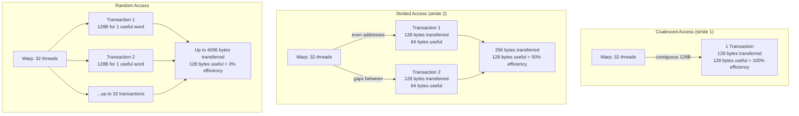

# Chapter 55 — Performance Optimization: Memory

`#cuda #memory #optimization #coalescing #shared-memory #throughput #cache #texture`

---

## 1. Theory — Why Memory Is the GPU Bottleneck

Modern GPUs deliver teraflops of compute, but memory bandwidth caps real-world throughput. An NVIDIA A100 offers 19.5 TFLOPS (FP32) yet only ~2 TB/s HBM2e bandwidth. A simple multiply-add is 2 FLOPs on 12 bytes (two reads + one write of float32). That means memory can feed only `2e12 / 12 ≈ 167 GFLOPS` — barely 0.8% of peak compute. Every wasted byte of bandwidth is lost performance.

### The Memory Hierarchy

| Level | Latency (cycles) | Bandwidth | Scope |
|---|---|---|---|
| Registers | 0–1 | ~20 TB/s (aggregate) | Per-thread |
| Shared Memory | ~20–30 | ~19 TB/s (aggregate) | Per-block |
| L1 Cache | ~30 | ~12 TB/s | Per-SM |
| L2 Cache | ~200 | ~5 TB/s | Device-wide |
| Global / HBM | ~400–600 | ~2 TB/s | Device-wide |
| System (PCIe) | ~10,000+ | ~32 GB/s | Host ↔ Device |

The optimization strategy is simple in principle: **move data up this hierarchy** and **access it efficiently at each level**.

---

## 2. What / Why / How

### What — Coalesced Memory Access

Global memory is served in **128-byte transactions** aligned to 128-byte boundaries. A warp of 32 threads issuing 4-byte reads can be satisfied in a single 128-byte transaction — if addresses are contiguous and aligned. This is **coalesced access**.

### Why — The Cost of Uncoalesced Access

When threads access scattered addresses, the hardware issues multiple transactions per warp. Strided access with stride `S` can waste up to `S×` bandwidth:

| Pattern | Transactions / Warp | Effective BW (A100) |
|---|---|---|
| Coalesced (stride 1) | 1 | ~2,039 GB/s |
| Stride 2 | 2 | ~1,020 GB/s |
| Stride 4 | 4 | ~510 GB/s |
| Stride 16 | 16 | ~127 GB/s |
| Stride 32 | 32 | ~64 GB/s |
| Random | up to 32 | ~64 GB/s |

A stride-32 access pattern delivers **3% of peak bandwidth** — a 32× slowdown from optimal.

### How — Techniques Covered in This Chapter

1. **Coalesced access patterns** — thread `i` reads element `i`
2. **SoA vs AoS** data layout transformation
3. **Shared memory tiling** — reduce global traffic by N×
4. **L1/L2 cache tuning** — `cudaFuncSetCacheConfig`
5. **Register pressure** — `__launch_bounds__` for occupancy
6. **Texture memory** — spatial locality for read-only data

---

## 3. Coalesced vs Strided Access — SoA vs AoS

### Array-of-Structs (AoS) — Bad for GPU

```
Memory: [x0 y0 z0] [x1 y1 z1] [x2 y2 z2] ...
Thread0 reads x0, Thread1 reads x1 → stride 3 → 3 transactions
```

### Struct-of-Arrays (SoA) — Good for GPU

```
Memory: [x0 x1 x2 ...] [y0 y1 y2 ...] [z0 z1 z2 ...]
Thread0 reads x0, Thread1 reads x1 → stride 1 → 1 transaction
```

---

## 4. Mermaid Diagrams

### Diagram 1 — Coalesced vs Uncoalesced Transactions



### Diagram 2 — Shared Memory Tiling Flow


---

## 5. Code Examples

### 5.1 — Coalesced vs Strided Access Benchmark

```cuda
#include <cstdio>
#include <cuda_runtime.h>

#define CHECK_CUDA(call)                                              \
    do {                                                              \
        cudaError_t err = (call);                                     \
        if (err != cudaSuccess) {                                     \
            fprintf(stderr, "CUDA error at %s:%d — %s\n",            \
                    __FILE__, __LINE__, cudaGetErrorString(err));      \
            exit(EXIT_FAILURE);                                       \
        }                                                             \
    } while (0)

// Coalesced: thread i reads element i
__global__ void coalesced_read(const float* __restrict__ in,
                               float* __restrict__ out, int N) {
    int idx = blockIdx.x * blockDim.x + threadIdx.x;
    if (idx < N) out[idx] = in[idx] * 2.0f;
}

// Strided: thread i reads element i * STRIDE
__global__ void strided_read(const float* __restrict__ in,
                             float* __restrict__ out,
                             int N, int stride) {
    int idx = blockIdx.x * blockDim.x + threadIdx.x;
    int src = (idx * stride) % N;
    if (idx < N) out[idx] = in[src] * 2.0f;
}

float benchmark_kernel(void (*launcher)(const float*, float*, int),
                       const float* d_in, float* d_out, int N) {
    cudaEvent_t start, stop;
    CHECK_CUDA(cudaEventCreate(&start));
    CHECK_CUDA(cudaEventCreate(&stop));

    // Warmup
    launcher(d_in, d_out, N);
    CHECK_CUDA(cudaDeviceSynchronize());

    CHECK_CUDA(cudaEventRecord(start));
    for (int i = 0; i < 100; i++) launcher(d_in, d_out, N);
    CHECK_CUDA(cudaEventRecord(stop));
    CHECK_CUDA(cudaEventSynchronize(stop));

    float ms = 0;
    CHECK_CUDA(cudaEventElapsedTime(&ms, start, stop));
    CHECK_CUDA(cudaEventDestroy(start));
    CHECK_CUDA(cudaEventDestroy(stop));
    return ms / 100.0f;
}

void launch_coalesced(const float* in, float* out, int N) {
    coalesced_read<<<(N + 255) / 256, 256>>>(in, out, N);
}

void launch_strided(const float* in, float* out, int N) {
    strided_read<<<(N + 255) / 256, 256>>>(in, out, N, 32);
}

int main() {
    const int N = 1 << 24; // 16M elements
    size_t bytes = N * sizeof(float);

    float *d_in, *d_out;
    CHECK_CUDA(cudaMalloc(&d_in, bytes));
    CHECK_CUDA(cudaMalloc(&d_out, bytes));
    CHECK_CUDA(cudaMemset(d_in, 1, bytes));

    float t_coal = benchmark_kernel(launch_coalesced, d_in, d_out, N);
    float t_strd = benchmark_kernel(launch_strided, d_in, d_out, N);

    float bw_coal = 2.0f * bytes / (t_coal * 1e-3f) / 1e9f;
    float bw_strd = 2.0f * bytes / (t_strd * 1e-3f) / 1e9f;

    printf("Coalesced:  %.3f ms  BW: %.1f GB/s\n", t_coal, bw_coal);
    printf("Stride-32:  %.3f ms  BW: %.1f GB/s\n", t_strd, bw_strd);
    printf("Slowdown:   %.1fx\n", t_strd / t_coal);

    CHECK_CUDA(cudaFree(d_in));
    CHECK_CUDA(cudaFree(d_out));
    return 0;
}
```

### 5.2 — SoA vs AoS Comparison

```cuda
#include <cstdio>
#include <cuda_runtime.h>

#define CHECK_CUDA(call)                                              \
    do {                                                              \
        cudaError_t err = (call);                                     \
        if (err != cudaSuccess) {                                     \
            fprintf(stderr, "CUDA error at %s:%d — %s\n",            \
                    __FILE__, __LINE__, cudaGetErrorString(err));      \
            exit(EXIT_FAILURE);                                       \
        }                                                             \
    } while (0)

struct Particle { float x, y, z, w; }; // AoS layout

__global__ void scale_aos(Particle* p, int N) {
    int i = blockIdx.x * blockDim.x + threadIdx.x;
    if (i < N) { p[i].x *= 2.0f; p[i].y *= 2.0f; p[i].z *= 2.0f; p[i].w *= 2.0f; }
}

__global__ void scale_soa(float* __restrict__ x, float* __restrict__ y,
                          float* __restrict__ z, float* __restrict__ w, int N) {
    int i = blockIdx.x * blockDim.x + threadIdx.x;
    if (i < N) { x[i] *= 2.0f; y[i] *= 2.0f; z[i] *= 2.0f; w[i] *= 2.0f; }
}

int main() {
    const int N = 1 << 22;
    cudaEvent_t start, stop;
    CHECK_CUDA(cudaEventCreate(&start));
    CHECK_CUDA(cudaEventCreate(&stop));

    Particle* d_aos;
    CHECK_CUDA(cudaMalloc(&d_aos, N * sizeof(Particle)));
    CHECK_CUDA(cudaMemset(d_aos, 1, N * sizeof(Particle)));
    scale_aos<<<(N+255)/256, 256>>>(d_aos, N);
    CHECK_CUDA(cudaDeviceSynchronize());
    CHECK_CUDA(cudaEventRecord(start));
    for (int i = 0; i < 100; i++) scale_aos<<<(N+255)/256, 256>>>(d_aos, N);
    CHECK_CUDA(cudaEventRecord(stop));
    CHECK_CUDA(cudaEventSynchronize(stop));
    float ms_aos = 0;
    CHECK_CUDA(cudaEventElapsedTime(&ms_aos, start, stop));

    float *d_x, *d_y, *d_z, *d_w;
    CHECK_CUDA(cudaMalloc(&d_x, N * sizeof(float)));
    CHECK_CUDA(cudaMalloc(&d_y, N * sizeof(float)));
    CHECK_CUDA(cudaMalloc(&d_z, N * sizeof(float)));
    CHECK_CUDA(cudaMalloc(&d_w, N * sizeof(float)));
    scale_soa<<<(N+255)/256, 256>>>(d_x, d_y, d_z, d_w, N);
    CHECK_CUDA(cudaDeviceSynchronize());
    CHECK_CUDA(cudaEventRecord(start));
    for (int i = 0; i < 100; i++) scale_soa<<<(N+255)/256, 256>>>(d_x, d_y, d_z, d_w, N);
    CHECK_CUDA(cudaEventRecord(stop));
    CHECK_CUDA(cudaEventSynchronize(stop));
    float ms_soa = 0;
    CHECK_CUDA(cudaEventElapsedTime(&ms_soa, start, stop));

    size_t bytes = (size_t)N * 4 * sizeof(float) * 2;
    printf("AoS: %.3f ms  BW: %.1f GB/s\n", ms_aos/100, bytes/(ms_aos/100*1e-3)/1e9);
    printf("SoA: %.3f ms  BW: %.1f GB/s\n", ms_soa/100, bytes/(ms_soa/100*1e-3)/1e9);
    printf("Speedup: %.2fx\n", ms_aos / ms_soa);

    CHECK_CUDA(cudaFree(d_aos));
    CHECK_CUDA(cudaFree(d_x)); CHECK_CUDA(cudaFree(d_y));
    CHECK_CUDA(cudaFree(d_z)); CHECK_CUDA(cudaFree(d_w));
    CHECK_CUDA(cudaEventDestroy(start)); CHECK_CUDA(cudaEventDestroy(stop));
    return 0;
}
```

### 5.3 — Shared Memory Tiled Matrix Multiply

```cuda
#include <cstdio>
#include <cstdlib>
#include <cuda_runtime.h>

#define CHECK_CUDA(call)                                              \
    do {                                                              \
        cudaError_t err = (call);                                     \
        if (err != cudaSuccess) {                                     \
            fprintf(stderr, "CUDA error at %s:%d — %s\n",            \
                    __FILE__, __LINE__, cudaGetErrorString(err));      \
            exit(EXIT_FAILURE);                                       \
        }                                                             \
    } while (0)

#define TILE 32

__global__ void matmul_naive(const float* A, const float* B, float* C,
                             int M, int N, int K) {
    int row = blockIdx.y * blockDim.y + threadIdx.y;
    int col = blockIdx.x * blockDim.x + threadIdx.x;
    if (row < M && col < N) {
        float sum = 0.0f;
        for (int k = 0; k < K; k++) sum += A[row * K + k] * B[k * N + col];
        C[row * N + col] = sum;
    }
}

__global__ void matmul_tiled(const float* __restrict__ A,
                             const float* __restrict__ B,
                             float* __restrict__ C, int M, int N, int K) {
    __shared__ float As[TILE][TILE], Bs[TILE][TILE];
    int row = blockIdx.y * TILE + threadIdx.y;
    int col = blockIdx.x * TILE + threadIdx.x;
    float sum = 0.0f;
    for (int t = 0; t < (K + TILE - 1) / TILE; t++) {
        int a_col = t * TILE + threadIdx.x;
        int b_row = t * TILE + threadIdx.y;
        As[threadIdx.y][threadIdx.x] = (row < M && a_col < K) ? A[row*K+a_col] : 0.0f;
        Bs[threadIdx.y][threadIdx.x] = (b_row < K && col < N) ? B[b_row*N+col] : 0.0f;
        __syncthreads();
        for (int k = 0; k < TILE; k++) sum += As[threadIdx.y][k] * Bs[k][threadIdx.x];
        __syncthreads();
    }
    if (row < M && col < N) C[row * N + col] = sum;
}

int main() {
    const int M = 1024, N = 1024, K = 1024;
    size_t sA = M*K*sizeof(float), sB = K*N*sizeof(float), sC = M*N*sizeof(float);
    float *hA = (float*)malloc(sA), *hB = (float*)malloc(sB);
    for (int i = 0; i < M*K; i++) hA[i] = 0.01f * (i % 100);
    for (int i = 0; i < K*N; i++) hB[i] = 0.01f * (i % 100);

    float *dA, *dB, *dC;
    CHECK_CUDA(cudaMalloc(&dA, sA)); CHECK_CUDA(cudaMalloc(&dB, sB));
    CHECK_CUDA(cudaMalloc(&dC, sC));
    CHECK_CUDA(cudaMemcpy(dA, hA, sA, cudaMemcpyHostToDevice));
    CHECK_CUDA(cudaMemcpy(dB, hB, sB, cudaMemcpyHostToDevice));

    dim3 block(TILE, TILE), grid((N+TILE-1)/TILE, (M+TILE-1)/TILE);
    cudaEvent_t start, stop;
    CHECK_CUDA(cudaEventCreate(&start)); CHECK_CUDA(cudaEventCreate(&stop));

    matmul_naive<<<grid, block>>>(dA, dB, dC, M, N, K);
    CHECK_CUDA(cudaDeviceSynchronize());
    CHECK_CUDA(cudaEventRecord(start));
    for (int i = 0; i < 20; i++) matmul_naive<<<grid, block>>>(dA, dB, dC, M, N, K);
    CHECK_CUDA(cudaEventRecord(stop)); CHECK_CUDA(cudaEventSynchronize(stop));
    float ms_naive = 0; CHECK_CUDA(cudaEventElapsedTime(&ms_naive, start, stop));

    matmul_tiled<<<grid, block>>>(dA, dB, dC, M, N, K);
    CHECK_CUDA(cudaDeviceSynchronize());
    CHECK_CUDA(cudaEventRecord(start));
    for (int i = 0; i < 20; i++) matmul_tiled<<<grid, block>>>(dA, dB, dC, M, N, K);
    CHECK_CUDA(cudaEventRecord(stop)); CHECK_CUDA(cudaEventSynchronize(stop));
    float ms_tiled = 0; CHECK_CUDA(cudaEventElapsedTime(&ms_tiled, start, stop));

    double flops = 2.0 * M * N * K;
    printf("Naive: %.3f ms  %.1f GFLOPS\n", ms_naive/20, flops/(ms_naive/20*1e-3)/1e9);
    printf("Tiled: %.3f ms  %.1f GFLOPS\n", ms_tiled/20, flops/(ms_tiled/20*1e-3)/1e9);
    printf("Speedup: %.2fx\n", ms_naive / ms_tiled);

    free(hA); free(hB);
    CHECK_CUDA(cudaFree(dA)); CHECK_CUDA(cudaFree(dB)); CHECK_CUDA(cudaFree(dC));
    CHECK_CUDA(cudaEventDestroy(start)); CHECK_CUDA(cudaEventDestroy(stop));
    return 0;
}
```

### 5.4 — Register Pressure with `__launch_bounds__`

```cuda
#include <cstdio>
#include <cuda_runtime.h>

#define CHECK_CUDA(call)                                              \
    do {                                                              \
        cudaError_t err = (call);                                     \
        if (err != cudaSuccess) {                                     \
            fprintf(stderr, "CUDA error at %s:%d — %s\n",            \
                    __FILE__, __LINE__, cudaGetErrorString(err));      \
            exit(EXIT_FAILURE);                                       \
        }                                                             \
    } while (0)

__global__ void heavy_register_kernel(const float* in, float* out, int N) {
    int i = blockIdx.x * blockDim.x + threadIdx.x;
    if (i >= N) return;
    float a = in[i], b = a*1.1f, c = b+2.2f, d = c*3.3f;
    float e = d-a, f = e*b, g = f+c, h = g*d;
    float j = h-e, k = j*f, l = k+g, m = l*h;
    float n = m-j, o = n*k, p = o+l;
    out[i] = a+b+c+d+e+f+g+h+j+k+l+m+n+o+p;
}

__global__ void __launch_bounds__(256, 4)
bounded_kernel(const float* in, float* out, int N) {
    int i = blockIdx.x * blockDim.x + threadIdx.x;
    if (i >= N) return;
    float a = in[i], b = a*1.1f, c = b+2.2f, d = c*3.3f;
    float e = d-a, f = e*b, g = f+c, h = g*d;
    float j = h-e, k = j*f, l = k+g, m = l*h;
    float n = m-j, o = n*k, p = o+l;
    out[i] = a+b+c+d+e+f+g+h+j+k+l+m+n+o+p;
}

int main() {
    const int N = 1 << 22;
    size_t bytes = N * sizeof(float);
    float *d_in, *d_out;
    CHECK_CUDA(cudaMalloc(&d_in, bytes));
    CHECK_CUDA(cudaMalloc(&d_out, bytes));
    CHECK_CUDA(cudaMemset(d_in, 1, bytes));

    cudaEvent_t start, stop;
    CHECK_CUDA(cudaEventCreate(&start)); CHECK_CUDA(cudaEventCreate(&stop));

    cudaFuncAttributes attr1, attr2;
    CHECK_CUDA(cudaFuncGetAttributes(&attr1, heavy_register_kernel));
    CHECK_CUDA(cudaFuncGetAttributes(&attr2, bounded_kernel));
    printf("Unbounded: %d regs/thread | Bounded: %d regs/thread\n",
           attr1.numRegs, attr2.numRegs);

    int bs = 256, gs = (N + bs - 1) / bs;

    heavy_register_kernel<<<gs, bs>>>(d_in, d_out, N);
    CHECK_CUDA(cudaDeviceSynchronize());
    CHECK_CUDA(cudaEventRecord(start));
    for (int i = 0; i < 100; i++) heavy_register_kernel<<<gs, bs>>>(d_in, d_out, N);
    CHECK_CUDA(cudaEventRecord(stop)); CHECK_CUDA(cudaEventSynchronize(stop));
    float ms1 = 0; CHECK_CUDA(cudaEventElapsedTime(&ms1, start, stop));

    bounded_kernel<<<gs, bs>>>(d_in, d_out, N);
    CHECK_CUDA(cudaDeviceSynchronize());
    CHECK_CUDA(cudaEventRecord(start));
    for (int i = 0; i < 100; i++) bounded_kernel<<<gs, bs>>>(d_in, d_out, N);
    CHECK_CUDA(cudaEventRecord(stop)); CHECK_CUDA(cudaEventSynchronize(stop));
    float ms2 = 0; CHECK_CUDA(cudaEventElapsedTime(&ms2, start, stop));

    printf("Unbounded: %.3f ms | Bounded: %.3f ms\n", ms1/100, ms2/100);

    CHECK_CUDA(cudaFree(d_in)); CHECK_CUDA(cudaFree(d_out));
    CHECK_CUDA(cudaEventDestroy(start)); CHECK_CUDA(cudaEventDestroy(stop));
    return 0;
}
```

---

## 6. L1/L2 Cache Configuration

CUDA lets you control the L1/shared memory split and L2 cache residency:

```cpp
// Prefer larger L1 cache (data-heavy, little shared mem)
cudaFuncSetCacheConfig(my_kernel, cudaFuncCachePreferL1);
// Prefer larger shared memory (tiled algorithms)
cudaFuncSetCacheConfig(matmul_tiled, cudaFuncCachePreferShared);
// Equal split
cudaFuncSetCacheConfig(my_kernel, cudaFuncCachePreferEqual);
```

**L2 persistence (Ampere+):** Pin frequently accessed data in L2:

```cpp
cudaDeviceProp prop;
cudaGetDeviceProperties(&prop, 0);
size_t l2_size = prop.l2CacheSize;
// Reserve up to 75% of L2 for persistent data
cudaDeviceSetLimit(cudaLimitPersistingL2CacheSize, l2_size * 3 / 4);

cudaStreamAttrValue attr = {};
attr.accessPolicyWindow.base_ptr  = d_hot_data;
attr.accessPolicyWindow.num_bytes = hot_data_size;
attr.accessPolicyWindow.hitRatio  = 1.0f;
attr.accessPolicyWindow.hitProp   = cudaAccessPropertyPersisting;
attr.accessPolicyWindow.missProp  = cudaAccessPropertyStreaming;
cudaStreamSetAttribute(stream, cudaStreamAttributeAccessPolicyWindow, &attr);
```

---

## 7. Texture Memory for Read-Only Data

Texture memory provides hardware-accelerated interpolation and caching optimized for 2D spatial locality — ideal for image convolutions and lookup tables.

```cpp
// Create texture object (modern API)
cudaResourceDesc resDesc = {};
resDesc.resType = cudaResourceTypeLinear;
resDesc.res.linear.devPtr = d_data;
resDesc.res.linear.sizeInBytes = N * sizeof(float);
resDesc.res.linear.desc = cudaCreateChannelDesc<float>();

cudaTextureDesc texDesc = {};
texDesc.readMode = cudaReadModeElementType;
texDesc.addressMode[0] = cudaAddressModeClamp;

cudaTextureObject_t texObj;
cudaCreateTextureObject(&texObj, &resDesc, &texDesc, nullptr);

// In kernel: float val = tex1Dfetch<float>(texObj, idx);
cudaDestroyTextureObject(texObj);
```

**When to use textures:** Read-only data with spatial locality (neighbor accesses), irregular access patterns that benefit from the texture cache, or when you need free hardware interpolation.

---

## 8. Memory Throughput Analysis

### Theoretical vs Achieved Bandwidth

```
Theoretical BW = memory_clock_GHz × bus_width_bytes × 2 (DDR)

A100: 1.215 GHz × 5120 bits / 8 × 2 = 2,039 GB/s
V100: 0.877 GHz × 4096 bits / 8 × 2 = 898 GB/s
```

### Measuring Achieved Bandwidth

```
Achieved BW = (bytes_read + bytes_written) / kernel_time

For vector add: BW = (3 × N × 4 bytes) / time
  - 2 reads (A, B) + 1 write (C) per element
```

Use `ncu` (Nsight Compute) to profile:

```bash
ncu --metrics l1tex__t_bytes_pipe_lsu_mem_global_op_ld.sum,\
              l1tex__t_bytes_pipe_lsu_mem_global_op_st.sum \
    ./my_program
```

---

## 9. Exercises

### 🟢 Exercise 1 — Identify the Access Pattern

Given this kernel, is the access coalesced? Why or why not?

```cuda
__global__ void mystery(float* data, int N, int pitch) {
    int col = blockIdx.x * blockDim.x + threadIdx.x;
    int row = blockIdx.y * blockDim.y + threadIdx.y;
    if (col < N && row < N)
        data[col * pitch + row] *= 2.0f;  // <-- analyze this
}
```

### 🟡 Exercise 2 — Convert AoS to SoA

Transform this struct and kernel from AoS to SoA for better coalescing:

```cuda
struct Vertex { float x, y, z; int color; };

__global__ void transform(Vertex* verts, int N, float scale) {
    int i = blockIdx.x * blockDim.x + threadIdx.x;
    if (i < N) {
        verts[i].x *= scale;
        verts[i].y *= scale;
        verts[i].z *= scale;
    }
}
```

### 🔴 Exercise 3 — Double-Buffered Tiling

Modify the tiled matrix multiply (Section 5.3) to use **double buffering**: while computing on tile `t`, prefetch tile `t+1` into a second shared memory buffer. This overlaps computation with memory latency.

---

## 10. Solutions

### Solution 1

**Not coalesced.** Consecutive threads have consecutive `col` values, but the index `col * pitch + row` means adjacent threads access addresses separated by `pitch` elements (stride = `pitch`). This is column-major traversal of a row-major array — a classic uncoalesced pattern. Fix: swap the indexing to `row * pitch + col`.

### Solution 2

```cuda
struct VerticesSoA {
    float *x, *y, *z;
    int *color;
};

__global__ void transform_soa(float* __restrict__ x,
                               float* __restrict__ y,
                               float* __restrict__ z,
                               int N, float scale) {
    int i = blockIdx.x * blockDim.x + threadIdx.x;
    if (i < N) {
        x[i] *= scale;
        y[i] *= scale;
        z[i] *= scale;
    }
}
```

Each array is accessed with stride 1 — fully coalesced.

### Solution 3 (Key Idea — Double-Buffered Tiling)

Use two shared memory buffers `As[2][TILE][TILE]` and alternate with `buf = 1 - buf`. While computing the dot product on `As[buf]`/`Bs[buf]`, prefetch the next tile into `As[1-buf]`/`Bs[1-buf]`. This overlaps global memory latency with compute, yielding 10–20% speedup on large matrices.

---

## 11. Quiz

**Q1.** How many bytes does a single global memory transaction transfer?
- A) 32 bytes
- B) 64 bytes
- C) 128 bytes ✅
- D) 256 bytes

**Q2.** A warp of 32 threads reads floats at stride 4. How many transactions are issued?
- A) 1
- B) 2
- C) 4 ✅
- D) 32

**Q3.** Which data layout is preferred for GPU kernels?
- A) Array-of-Structs (AoS)
- B) Struct-of-Arrays (SoA) ✅
- C) Linked lists
- D) Hash maps

**Q4.** In tiled matrix multiply with TILE=32, how many times is each global memory element reused from shared memory?
- A) 1
- B) 16
- C) 32 ✅
- D) 1024

**Q5.** What does `__launch_bounds__(256, 4)` specify?
- A) 256 threads max, 4 registers per thread
- B) 256 threads per block max, minimum 4 blocks per SM ✅
- C) 256 blocks, 4 threads each
- D) 256 warps, 4 SMs

**Q6.** Which memory type provides hardware-accelerated interpolation?
- A) Shared memory
- B) Constant memory
- C) Texture memory ✅
- D) Register memory

**Q7.** An A100 has 2,039 GB/s peak bandwidth. A kernel achieves 200 GB/s on a vector-add workload. The kernel is likely:
- A) Compute-bound
- B) Memory-bound with poor coalescing ✅
- C) At peak performance
- D) Limited by PCIe bandwidth

---

## 12. Key Takeaways

- **128-byte transactions**: GPU memory moves data in 128-byte chunks. Align your access or waste bandwidth.
- **Coalescing is king**: Thread `i` should access element `i`. Strided or random access can drop throughput by 10–32×.
- **SoA over AoS**: Always restructure data for stride-1 access on GPUs.
- **Shared memory tiling**: Reduces global memory traffic by `TILE` × (e.g., 32×) through data reuse.
- **L1/L2 tuning**: Use `cudaFuncSetCacheConfig` and L2 persistence for workload-specific optimization.
- **Register pressure**: More registers per thread = fewer concurrent blocks. Use `__launch_bounds__` to guide the compiler.
- **Texture memory**: Free caching and interpolation for read-only, spatially-local data.
- **Measure, don't guess**: Use `ncu` to compare achieved vs theoretical bandwidth.

---

## 13. Chapter Summary

Memory optimization is the single highest-impact activity in CUDA performance tuning. Most GPU kernels are memory-bound, meaning compute units sit idle waiting for data. This chapter covered the full spectrum of memory optimization: ensuring coalesced global memory access patterns (stride-1, 128-byte aligned), restructuring data from AoS to SoA layouts for GPU-friendly access, exploiting shared memory to tile and reuse data (reducing global traffic by 32× in matrix multiply), tuning the L1/L2 cache hierarchy for specific workloads, managing register pressure via `__launch_bounds__` to balance per-thread performance against occupancy, and leveraging texture memory for spatially-local read-only data. The key insight is that a 32× bandwidth improvement from coalescing or tiling often dwarfs any algorithmic micro-optimization. Profile with Nsight Compute, measure achieved bandwidth against theoretical peaks, and iterate.

---

## 14. Real-World Insight — AI/ML Applications

### Training: Attention Mechanism Memory

In Transformer attention, the Q×K^T matrix multiply is memory-bound for long sequences. FlashAttention achieves 2–4× speedup by **tiling the attention computation into SRAM** (shared memory), never materializing the full N×N attention matrix in HBM. This is exactly the shared-memory tiling technique from Section 5.3, applied at scale.

### Inference: KV-Cache Memory Layout

LLM inference stores key-value caches for each layer. Naive implementations use AoS layout `[head][seq][dim]`, causing strided access when different requests in a batch read different sequence positions. **PagedAttention** (vLLM) restructures this into paged SoA blocks, improving memory coalescing and enabling 2–4× higher serving throughput.

### Embedding Tables

Recommendation models (DLRM) access massive embedding tables with irregular, sparse patterns. Techniques include: sorting access indices for better coalescing, using texture memory for cached lookups, and L2 pinning for hot embeddings that represent popular items.

### Gradient Accumulation

During backpropagation, gradients are accumulated across micro-batches. Using `atomicAdd` with coalesced access patterns (gradients stored in SoA format) can improve throughput by 3–5× compared to scattered atomic operations.

---

## 15. Common Mistakes

1. **Column-major access in row-major arrays.** Indexing as `data[col * width + row]` when threads vary in `col` creates stride-`width` access. Always ensure the fastest-varying thread index maps to the innermost array dimension.

2. **Ignoring the 128-byte alignment.** Allocating with `malloc` and pointer arithmetic can produce unaligned base addresses. Use `cudaMalloc` (always 256-byte aligned) or `cudaMallocPitch` for 2D arrays.

3. **Shared memory bank conflicts mistaken for coalescing issues.** Bank conflicts (32 banks, 4-byte stride) affect shared memory, not global memory. These are separate problems with different solutions.

4. **Over-tiling.** Using tiles larger than needed wastes shared memory and reduces occupancy. A 32×32 tile uses 4 KB; a 64×64 tile uses 16 KB. Profile to find the sweet spot.

5. **Forgetting `__syncthreads()` in tiled kernels.** Missing barriers between the load phase and compute phase cause race conditions — threads may read stale shared memory values.

6. **Assuming more registers = faster.** High register usage reduces occupancy, which can reduce the GPU's ability to hide memory latency. Sometimes spilling a few registers to local memory (L1-cached) is a net win.

7. **Not profiling.** Guessing at memory bottlenecks is unreliable. Nsight Compute shows exact transaction counts, cache hit rates, and achieved bandwidth per kernel.

---

## 16. Interview Questions

### Q1: Explain coalesced memory access and why it matters.

**Answer:** Coalesced access means threads in a warp access contiguous, aligned memory addresses so the hardware can combine them into minimal 128-byte transactions. It matters because GPU memory controllers serve data in fixed-size cache lines. When 32 threads each read a 4-byte float at consecutive addresses, one 128-byte transaction serves the entire warp. With stride-32 access, 32 separate transactions are needed — transferring 4,096 bytes to use only 128 bytes (3% efficiency). On an A100 with 2 TB/s peak bandwidth, poor coalescing can reduce effective throughput to ~64 GB/s.

### Q2: When would you choose shared memory tiling over relying on L1/L2 caches?

**Answer:** Shared memory tiling is preferred when you can **predict and control the reuse pattern** at compile time. Matrix multiply is the canonical example: each element of A and B is reused exactly TILE times, so explicit tiling into shared memory guarantees the reuse. L1/L2 caches work well for unpredictable access patterns or when the working set fits naturally, but they are subject to eviction policies you can't control. For algorithms with known, structured reuse (convolutions, stencils, reductions), explicit shared memory management consistently outperforms cache-only approaches. Additionally, shared memory provides programmer-controlled bank-conflict-free access patterns that hardware caches cannot guarantee.

### Q3: What is `__launch_bounds__` and when should you use it?

**Answer:** `__launch_bounds__(maxThreadsPerBlock, minBlocksPerMultiprocessor)` is a function attribute that tells the CUDA compiler to optimize register allocation for the specified occupancy target. The compiler will limit register usage so that at least `minBlocksPerMultiprocessor` blocks can run concurrently on each SM. Use it when a kernel uses too many registers, limiting occupancy and reducing the GPU's ability to hide latency. For example, `__launch_bounds__(256, 4)` on an SM with 65,536 registers forces the compiler to use ≤ 64 registers per thread (65536 / 256 / 4 = 64). The tradeoff: fewer registers may cause spilling to local memory, so always benchmark both versions.

### Q4: Compare AoS vs SoA for GPU programming with a concrete performance example.

**Answer:** AoS (Array-of-Structs) stores each object's fields contiguously: `[x0,y0,z0, x1,y1,z1, ...]`. When a warp of 32 threads each reads the `x` field, they access addresses 0, 12, 24, 36... (stride 3 for a 3-float struct). This requires 3 transactions instead of 1 — a 3× bandwidth waste. SoA stores fields separately: `[x0,x1,...,x31,...], [y0,y1,...]`. Now reading all `x` values is stride-1, perfectly coalesced. In practice, converting particle simulations from AoS to SoA yields 2–4× speedup on memory-bound kernels. The only downside is slightly more complex host-side code for data marshaling.

### Q5: How does FlashAttention use memory optimization principles to speed up Transformer training?

**Answer:** Standard attention computes `softmax(Q×K^T)×V`, materializing the N×N attention matrix in HBM — O(N²) memory and bandwidth. FlashAttention applies **shared memory tiling**: it splits Q, K, V into tiles that fit in SRAM (shared memory), computes partial attention within tiles, and uses online softmax to fuse the normalization. The full N×N matrix never exists in HBM. This reduces HBM reads/writes from O(N²) to O(N² / SRAM_SIZE × N), achieving 2–4× wall-clock speedup and enabling longer sequences. It's the same principle as tiled matrix multiply (Section 5.3) extended with numerical stability tricks for softmax.

---

*Next Chapter: [56 — Performance Optimization: Compute →](56_Compute_Optimization.md)*
