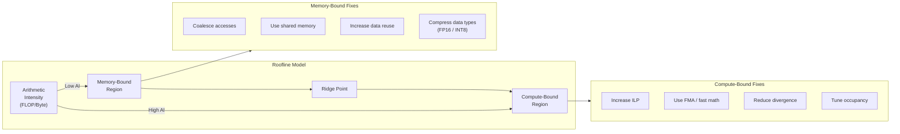
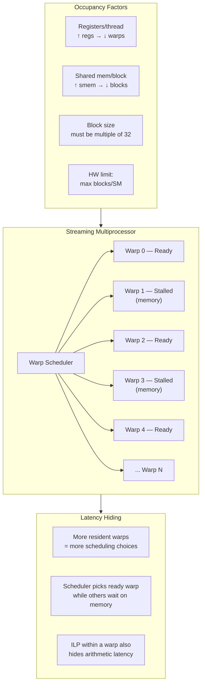

# Chapter 56 — Performance Optimization: Compute

`#cuda` `#compute` `#optimization` `#occupancy` `#ILP` `#roofline`

## Theory — Maximizing Compute Throughput

GPU compute optimization is the art of keeping every functional unit busy every cycle.
A modern SM contains CUDA cores, load/store units, SFUs, and tensor cores. If any sit
idle due to poor scheduling, divergent branches, or register pressure, you leave
performance on the table.

**Occupancy** measures resident warps on an SM relative to the hardware maximum.
Higher occupancy gives the warp scheduler more choices to hide latency, but occupancy
alone does not guarantee performance — ILP and memory patterns matter equally.

The **roofline model** frames every kernel as *compute-bound* or *memory-bound*.
Arithmetic intensity (FLOPs per byte from DRAM) determines the regime. Compute-bound
kernels benefit from instruction tuning and ILP; memory-bound kernels benefit from
caching, coalescing, and data reuse.

### Key Hardware Limits per SM (Ampere A100 example)

| Resource                | Limit       |
|------------------------|-------------|
| Max threads per SM     | 2048        |
| Max blocks per SM      | 32          |
| Max warps per SM       | 64          |
| Registers per SM       | 65536       |
| Shared memory per SM   | 164 KB      |
| Max registers/thread   | 255         |

If a kernel uses 64 registers per thread and 256 threads per block, one block consumes
16384 registers. The SM can host 4 blocks = 1024 threads → 50% occupancy.

## What / Why / How

### What is Compute Optimization?

Restructuring kernel code so the SM's arithmetic pipelines stay saturated — maximizing
occupancy, ILP, fused instructions, and eliminating branch divergence.

### Why Does It Matter?

- 25% occupancy leaves 75% of latency-hiding capability unused.
- Branch divergence can degrade a 32-thread warp to effectively 1 thread.
- Missing FMA fusion doubles instruction count for multiply-add patterns.

### How to Optimize

1. **Tune block size** — use `cudaOccupancyMaxPotentialBlockSize`.
2. **Increase ILP** — process multiple elements per thread.
3. **Unroll loops** — `#pragma unroll` reduces branch overhead, exposes ILP.
4. **Minimize divergence** — restructure so warp threads take the same path.
5. **Use fast math** — `__fdividef`, `__expf`, `--use_fast_math`.
6. **Maximize FMA** — write `a * b + c` so the compiler can fuse.

## Code Example 1 — Occupancy Calculator

```cuda
// occupancy_calc.cu — Query optimal block size via CUDA occupancy API
#include <cstdio>
#include <cuda_runtime.h>

#define CHECK_CUDA(call)                                                     \
    do {                                                                     \
        cudaError_t err = (call);                                            \
        if (err != cudaSuccess) {                                            \
            fprintf(stderr, "CUDA error at %s:%d — %s\n",                   \
                    __FILE__, __LINE__, cudaGetErrorString(err));             \
            exit(EXIT_FAILURE);                                              \
        }                                                                    \
    } while (0)

__global__ void saxpy(float *y, const float *x, float a, int n) {
    int i = blockIdx.x * blockDim.x + threadIdx.x;
    if (i < n) y[i] = a * x[i] + y[i];
}

int main() {
    // Query device properties
    cudaDeviceProp prop;
    CHECK_CUDA(cudaGetDeviceProperties(&prop, 0));
    printf("Device: %s\n", prop.name);
    printf("Max threads/SM : %d\n", prop.maxThreadsPerMultiProcessor);
    printf("Max threads/block: %d\n", prop.maxThreadsPerBlock);
    printf("Registers/SM   : %d\n", prop.regsPerMultiprocessor);

    // Let the runtime choose optimal block size
    int minGridSize = 0, optBlockSize = 0;
    CHECK_CUDA(cudaOccupancyMaxPotentialBlockSize(
        &minGridSize, &optBlockSize, saxpy, 0, 0));

    printf("\n--- Occupancy Analysis for saxpy ---\n");
    printf("Optimal block size : %d threads\n", optBlockSize);
    printf("Min grid size      : %d blocks\n", minGridSize);

    // Compute achieved occupancy
    int maxActiveBlocks = 0;
    CHECK_CUDA(cudaOccupancyMaxActiveBlocksPerMultiprocessor(
        &maxActiveBlocks, saxpy, optBlockSize, 0));

    float occupancy = (float)(maxActiveBlocks * optBlockSize) /
                      prop.maxThreadsPerMultiProcessor;
    printf("Active blocks/SM   : %d\n", maxActiveBlocks);
    printf("Achieved occupancy : %.1f%%\n", occupancy * 100.0f);

    // Run the kernel with optimal config
    const int N = 1 << 20;
    float *d_x, *d_y;
    CHECK_CUDA(cudaMalloc(&d_x, N * sizeof(float)));
    CHECK_CUDA(cudaMalloc(&d_y, N * sizeof(float)));

    int gridSize = (N + optBlockSize - 1) / optBlockSize;
    saxpy<<<gridSize, optBlockSize>>>(d_y, d_x, 2.0f, N);
    CHECK_CUDA(cudaDeviceSynchronize());
    printf("Kernel launched: grid=%d, block=%d\n", gridSize, optBlockSize);

    CHECK_CUDA(cudaFree(d_x));
    CHECK_CUDA(cudaFree(d_y));
    return 0;
}
```

## Code Example 2 — ILP: 1 Element vs 4 Elements per Thread

```cuda
// ilp_comparison.cu — Demonstrate instruction-level parallelism benefit
#include <cstdio>
#include <cuda_runtime.h>

#define CHECK_CUDA(call)                                                     \
    do {                                                                     \
        cudaError_t err = (call);                                            \
        if (err != cudaSuccess) {                                            \
            fprintf(stderr, "CUDA error at %s:%d — %s\n",                   \
                    __FILE__, __LINE__, cudaGetErrorString(err));             \
            exit(EXIT_FAILURE);                                              \
        }                                                                    \
    } while (0)

// Baseline: each thread processes 1 element
__global__ void scale_ilp1(float *out, const float *in, float s, int n) {
    int i = blockIdx.x * blockDim.x + threadIdx.x;
    if (i < n) {
        out[i] = in[i] * s + 1.0f;   // single FMA
    }
}

// ILP-4: each thread processes 4 elements
__global__ void scale_ilp4(float *out, const float *in, float s, int n) {
    int base = (blockIdx.x * blockDim.x + threadIdx.x) * 4;
    if (base + 3 < n) {
        float a0 = in[base + 0];  // 4 independent loads
        float a1 = in[base + 1];
        float a2 = in[base + 2];
        float a3 = in[base + 3];

        out[base + 0] = a0 * s + 1.0f;  // 4 independent FMAs
        out[base + 1] = a1 * s + 1.0f;
        out[base + 2] = a2 * s + 1.0f;
        out[base + 3] = a3 * s + 1.0f;
    }
}

int main() {
    const int N = 1 << 24;  // 16M elements
    size_t bytes = N * sizeof(float);

    float *d_in, *d_out;
    CHECK_CUDA(cudaMalloc(&d_in, bytes));
    CHECK_CUDA(cudaMalloc(&d_out, bytes));
    CHECK_CUDA(cudaMemset(d_in, 1, bytes));

    cudaEvent_t start, stop;
    CHECK_CUDA(cudaEventCreate(&start));
    CHECK_CUDA(cudaEventCreate(&stop));

    const int BLOCK = 256;
    const int WARMUP = 5, ITERS = 50;
    float ms;

    // --- ILP-1 benchmark ---
    int grid1 = (N + BLOCK - 1) / BLOCK;
    for (int i = 0; i < WARMUP; i++)
        scale_ilp1<<<grid1, BLOCK>>>(d_out, d_in, 2.0f, N);
    CHECK_CUDA(cudaEventRecord(start));
    for (int i = 0; i < ITERS; i++)
        scale_ilp1<<<grid1, BLOCK>>>(d_out, d_in, 2.0f, N);
    CHECK_CUDA(cudaEventRecord(stop));
    CHECK_CUDA(cudaEventSynchronize(stop));
    CHECK_CUDA(cudaEventElapsedTime(&ms, start, stop));
    printf("ILP-1: %.3f ms avg (%.1f GB/s)\n",
           ms / ITERS, 2.0 * bytes / (ms / ITERS * 1e6));

    // --- ILP-4 benchmark ---
    int grid4 = (N / 4 + BLOCK - 1) / BLOCK;
    for (int i = 0; i < WARMUP; i++)
        scale_ilp4<<<grid4, BLOCK>>>(d_out, d_in, 2.0f, N);
    CHECK_CUDA(cudaEventRecord(start));
    for (int i = 0; i < ITERS; i++)
        scale_ilp4<<<grid4, BLOCK>>>(d_out, d_in, 2.0f, N);
    CHECK_CUDA(cudaEventRecord(stop));
    CHECK_CUDA(cudaEventSynchronize(stop));
    CHECK_CUDA(cudaEventElapsedTime(&ms, start, stop));
    printf("ILP-4: %.3f ms avg (%.1f GB/s)\n",
           ms / ITERS, 2.0 * bytes / (ms / ITERS * 1e6));

    CHECK_CUDA(cudaEventDestroy(start));
    CHECK_CUDA(cudaEventDestroy(stop));
    CHECK_CUDA(cudaFree(d_in));
    CHECK_CUDA(cudaFree(d_out));
    return 0;
}
```

## Code Example 3 — Branch Divergence: Bad vs Good

```cuda
// branch_divergence.cu — Measure divergence cost and restructured version
#include <cstdio>
#include <cuda_runtime.h>

#define CHECK_CUDA(call)                                                     \
    do {                                                                     \
        cudaError_t err = (call);                                            \
        if (err != cudaSuccess) {                                            \
            fprintf(stderr, "CUDA error at %s:%d — %s\n",                   \
                    __FILE__, __LINE__, cudaGetErrorString(err));             \
            exit(EXIT_FAILURE);                                              \
        }                                                                    \
    } while (0)

// BAD: every-other-thread divergence within a warp
__global__ void divergent_kernel(float *out, const float *in, int n) {
    int i = blockIdx.x * blockDim.x + threadIdx.x;
    if (i >= n) return;
    // threadIdx.x & 1 causes 50% divergence inside every warp
    if (threadIdx.x & 1) {
        out[i] = in[i] * 2.0f + 1.0f;
        out[i] = out[i] * out[i];
    } else {
        out[i] = in[i] * 0.5f - 1.0f;
        out[i] = sqrtf(fabsf(out[i]));
    }
}

// GOOD: branch on warp-aligned condition (warp 0 vs warp 1)
__global__ void uniform_kernel(float *out, const float *in, int n) {
    int i = blockIdx.x * blockDim.x + threadIdx.x;
    if (i >= n) return;
    int warpId = threadIdx.x / 32;
    // Entire warp takes the same path — no divergence
    if (warpId & 1) {
        out[i] = in[i] * 2.0f + 1.0f;
        out[i] = out[i] * out[i];
    } else {
        out[i] = in[i] * 0.5f - 1.0f;
        out[i] = sqrtf(fabsf(out[i]));
    }
}

int main() {
    const int N = 1 << 24;
    size_t bytes = N * sizeof(float);

    float *d_in, *d_out;
    CHECK_CUDA(cudaMalloc(&d_in, bytes));
    CHECK_CUDA(cudaMalloc(&d_out, bytes));
    CHECK_CUDA(cudaMemset(d_in, 1, bytes));

    cudaEvent_t start, stop;
    CHECK_CUDA(cudaEventCreate(&start));
    CHECK_CUDA(cudaEventCreate(&stop));

    const int BLOCK = 256, WARMUP = 5, ITERS = 100;
    int grid = (N + BLOCK - 1) / BLOCK;
    float ms;

    // Benchmark divergent version
    for (int i = 0; i < WARMUP; i++)
        divergent_kernel<<<grid, BLOCK>>>(d_out, d_in, N);
    CHECK_CUDA(cudaEventRecord(start));
    for (int i = 0; i < ITERS; i++)
        divergent_kernel<<<grid, BLOCK>>>(d_out, d_in, N);
    CHECK_CUDA(cudaEventRecord(stop));
    CHECK_CUDA(cudaEventSynchronize(stop));
    CHECK_CUDA(cudaEventElapsedTime(&ms, start, stop));
    printf("Divergent : %.3f ms avg\n", ms / ITERS);

    // Benchmark uniform version
    for (int i = 0; i < WARMUP; i++)
        uniform_kernel<<<grid, BLOCK>>>(d_out, d_in, N);
    CHECK_CUDA(cudaEventRecord(start));
    for (int i = 0; i < ITERS; i++)
        uniform_kernel<<<grid, BLOCK>>>(d_out, d_in, N);
    CHECK_CUDA(cudaEventRecord(stop));
    CHECK_CUDA(cudaEventSynchronize(stop));
    CHECK_CUDA(cudaEventElapsedTime(&ms, start, stop));
    printf("Uniform   : %.3f ms avg\n", ms / ITERS);

    CHECK_CUDA(cudaEventDestroy(start));
    CHECK_CUDA(cudaEventDestroy(stop));
    CHECK_CUDA(cudaFree(d_in));
    CHECK_CUDA(cudaFree(d_out));
    return 0;
}
```

## Code Example 4 — Loop Unrolling Comparison

```cuda
// loop_unroll.cu — Compare no-unroll, pragma-unroll, and manual unroll
#include <cstdio>
#include <cuda_runtime.h>

#define CHECK_CUDA(call)                                                     \
    do {                                                                     \
        cudaError_t err = (call);                                            \
        if (err != cudaSuccess) {                                            \
            fprintf(stderr, "CUDA error at %s:%d — %s\n",                   \
                    __FILE__, __LINE__, cudaGetErrorString(err));             \
            exit(EXIT_FAILURE);                                              \
        }                                                                    \
    } while (0)

#define RADIUS 4

// Version A: natural loop (compiler may or may not unroll)
__global__ void stencil_no_unroll(float *out, const float *in, int n) {
    int i = blockIdx.x * blockDim.x + threadIdx.x + RADIUS;
    if (i >= n - RADIUS) return;
    float sum = 0.0f;
    for (int r = -RADIUS; r <= RADIUS; r++) {
        sum += in[i + r];
    }
    out[i] = sum / (2 * RADIUS + 1);
}

// Version B: #pragma unroll hint
__global__ void stencil_pragma_unroll(float *out, const float *in, int n) {
    int i = blockIdx.x * blockDim.x + threadIdx.x + RADIUS;
    if (i >= n - RADIUS) return;
    float sum = 0.0f;
    #pragma unroll
    for (int r = -RADIUS; r <= RADIUS; r++) {
        sum += in[i + r];
    }
    out[i] = sum / (2 * RADIUS + 1);
}

// Version C: fully manual unroll
__global__ void stencil_manual_unroll(float *out, const float *in, int n) {
    int i = blockIdx.x * blockDim.x + threadIdx.x + RADIUS;
    if (i >= n - RADIUS) return;
    float sum = in[i - 4] + in[i - 3] + in[i - 2] + in[i - 1]
              + in[i]
              + in[i + 1] + in[i + 2] + in[i + 3] + in[i + 4];
    out[i] = sum / 9.0f;
}

int main() {
    const int N = 1 << 22;
    size_t bytes = N * sizeof(float);

    float *d_in, *d_out;
    CHECK_CUDA(cudaMalloc(&d_in, bytes));
    CHECK_CUDA(cudaMalloc(&d_out, bytes));
    CHECK_CUDA(cudaMemset(d_in, 0, bytes));

    cudaEvent_t start, stop;
    CHECK_CUDA(cudaEventCreate(&start));
    CHECK_CUDA(cudaEventCreate(&stop));

    const int BLOCK = 256, WARMUP = 5, ITERS = 100;
    int grid = (N - 2 * RADIUS + BLOCK - 1) / BLOCK;
    float ms;

    // Benchmark each variant
    auto bench = [&](const char *name, void(*kern)(float*, const float*, int)) {
        for (int i = 0; i < WARMUP; i++) kern<<<grid, BLOCK>>>(d_out, d_in, N);
        CHECK_CUDA(cudaEventRecord(start));
        for (int i = 0; i < ITERS; i++) kern<<<grid, BLOCK>>>(d_out, d_in, N);
        CHECK_CUDA(cudaEventRecord(stop));
        CHECK_CUDA(cudaEventSynchronize(stop));
        CHECK_CUDA(cudaEventElapsedTime(&ms, start, stop));
        printf("%-20s: %.3f ms avg\n", name, ms / ITERS);
    };

    bench("No unroll",     stencil_no_unroll);
    bench("Pragma unroll", stencil_pragma_unroll);
    bench("Manual unroll", stencil_manual_unroll);

    CHECK_CUDA(cudaEventDestroy(start));
    CHECK_CUDA(cudaEventDestroy(stop));
    CHECK_CUDA(cudaFree(d_in));
    CHECK_CUDA(cudaFree(d_out));
    return 0;
}
```

## Mermaid Diagram 1 — Roofline Model with Optimization Pathways



## Mermaid Diagram 2 — Warp Scheduling and Occupancy



## Exercises

### 🟢 Exercise 1 — Occupancy Query
Write a program that queries `cudaOccupancyMaxActiveBlocksPerMultiprocessor` for a
vector-add kernel and prints occupancy for block sizes 64, 128, 256, and 512.

### 🟡 Exercise 2 — ILP Exploration
Extend the ILP example to test ILP-2 and ILP-8 variants. Print bandwidth achieved by
each and determine the point of diminishing returns on your GPU.

### 🟡 Exercise 3 — Divergence Profiling
Profile the divergent vs uniform kernels from Code Example 3 with `ncu`. Compare the
`smsp__thread_inst_executed_pred_on` metric between versions.

### 🔴 Exercise 4 — Roofline Classification
Implement a matrix-vector multiply kernel. Calculate its arithmetic intensity
analytically, measure achieved FLOP/s and bandwidth, determine whether it is
compute-bound or memory-bound, and propose the right optimization strategy.

## Solutions

### Solution 1 — Occupancy Query

```cuda
#include <cstdio>
#include <cuda_runtime.h>

#define CHECK_CUDA(call)                                                     \
    do {                                                                     \
        cudaError_t err = (call);                                            \
        if (err != cudaSuccess) {                                            \
            fprintf(stderr, "CUDA error: %s\n", cudaGetErrorString(err));    \
            exit(1);                                                         \
        }                                                                    \
    } while (0)

__global__ void vec_add(float *c, const float *a, const float *b, int n) {
    int i = blockIdx.x * blockDim.x + threadIdx.x;
    if (i < n) c[i] = a[i] + b[i];
}

int main() {
    cudaDeviceProp prop;
    CHECK_CUDA(cudaGetDeviceProperties(&prop, 0));
    int blockSizes[] = {64, 128, 256, 512};
    for (int bs : blockSizes) {
        int maxActive = 0;
        CHECK_CUDA(cudaOccupancyMaxActiveBlocksPerMultiprocessor(
            &maxActive, vec_add, bs, 0));
        float occ = (float)(maxActive * bs) / prop.maxThreadsPerMultiProcessor;
        printf("Block=%3d  Active blocks/SM=%2d  Occupancy=%.0f%%\n",
               bs, maxActive, occ * 100);
    }
    return 0;
}
```

### Solution 2 — ILP Exploration (sketch)

Process 2 and 8 elements per thread following the ILP-4 pattern from Code Example 2.
For ILP-8, each thread loads/stores 8 elements — grid becomes `N/8/BLOCK`. On most
GPUs, ILP-4 captures the majority of benefit; ILP-8 may hurt due to register pressure.

### Solution 3 — Divergence Profiling

```bash
ncu --metrics smsp__thread_inst_executed_pred_on.sum,\
smsp__thread_inst_executed.sum ./branch_divergence
```

Divergent kernel shows `pred_on / total` ≈ 0.5; the uniform kernel shows ≈ 1.0.

### Solution 4 — Roofline Classification (analysis)

For y = A·x where A is M×N: FLOPs = 2·M·N, Bytes ≈ 4·M·N.
Arithmetic intensity ≈ 0.5 FLOP/byte — firmly **memory-bound** (ridge point is
10–50 FLOP/byte). Optimize memory access patterns: coalesced loads, shared-memory
caching of x tiles, FP16 to double effective bandwidth.

## Quiz

**Q1.** What does occupancy measure?
- A) Percentage of GPU memory used
- B) Ratio of active warps to maximum warps per SM ✅
- C) Number of kernels running concurrently
- D) Percentage of cores executing FMA instructions

**Q2.** Which factor does NOT limit occupancy?
- A) Registers per thread
- B) Shared memory per block
- C) Global memory bandwidth ✅
- D) Maximum blocks per SM

**Q3.** Branch divergence occurs when:
- A) Two blocks take different paths
- B) Threads within the same warp take different paths ✅
- C) The CPU and GPU execute different code
- D) Two kernels run on different SMs

**Q4.** What is the benefit of `#pragma unroll`?
- A) It allocates more registers automatically
- B) It tells the compiler to replicate the loop body, reducing branch overhead ✅
- C) It enables asynchronous memory copies
- D) It forces the kernel to use shared memory

**Q5.** A kernel with arithmetic intensity of 0.25 FLOP/byte is:
- A) Compute-bound
- B) Memory-bound ✅
- C) Perfectly balanced
- D) Cannot be determined

**Q6.** Fused multiply-add (FMA) helps because:
- A) It uses shared memory instead of registers
- B) It computes `a*b+c` in one instruction instead of two ✅
- C) It bypasses the warp scheduler
- D) It doubles the block size

**Q7.** ILP (instruction-level parallelism) hides latency by:
- A) Running more blocks per SM
- B) Giving the scheduler independent instructions within the same thread ✅
- C) Using unified memory
- D) Reducing kernel launch overhead

**Q8.** `cudaOccupancyMaxPotentialBlockSize` returns:
- A) The number of SMs on the device
- B) The minimum grid size and optimal block size for maximum occupancy ✅
- C) The amount of shared memory available
- D) The register count of a kernel

## Key Takeaways

- **Occupancy is necessary but not sufficient** — aim for ≥50% then focus on ILP.
- **ILP multiplies throughput** — 4 elements/thread gives 4× more independent work.
- **Branch divergence is warp-level** — divergence between warps is free; within a
  warp it serializes execution.
- **`#pragma unroll`** eliminates branch overhead for small, known-trip-count loops.
- **FMA is critical** — write `a*b+c` in one expression to enable fusion.
- **Roofline classifies every kernel** — memory-bound needs better access patterns;
  compute-bound needs instruction optimization.
- **Use the occupancy API** — removes guesswork from block size selection.
- **Fast math intrinsics** (`__fdividef`, `__expf`) trade accuracy for 2-5× speedup.

## Chapter Summary

Compute optimization on the GPU begins with understanding where your kernel sits on
the roofline. Memory-bound kernels need data reuse improvements; compute-bound kernels
benefit from the techniques in this chapter: maximize occupancy for latency hiding,
increase ILP so each thread exposes independent work, unroll loops to reduce control
overhead, eliminate divergence to keep all 32 lanes active, and use FMA and fast-math
intrinsics. The CUDA occupancy API and Nsight Compute make the analysis data-driven.
Mastering compute optimization separates a kernel that merely runs on a GPU from one
that truly exploits the hardware.

## Real-World Insight — AI/ML Applications

| Technique | AI/ML Application |
|-----------|-------------------|
| **Occupancy tuning** | cuDNN selects block size per layer shape; FlashAttention balances occupancy with shared memory for peak throughput. |
| **ILP** | cuBLAS GEMM processes 4–8 elements/thread, using registers as fast accumulators while global loads are in flight. |
| **Loop unrolling** | Reduction kernels (softmax, layer-norm) fully unroll inner loops in critical training paths. |
| **Branch divergence** | Sparse attention (Longformer, BigBird) needs careful masking to avoid per-thread divergence. |
| **FMA / fast math** | Mixed-precision training uses FP16 FMA on tensor cores; activations (GELU, SiLU) use `__expf` for 3× inference speedup. |
| **Roofline analysis** | PyTorch/TensorRT use roofline to decide operator fusion — fusing two memory-bound kernels raises arithmetic intensity above the ridge point. |

## Common Mistakes

1. **Chasing 100% occupancy blindly** — beyond a threshold, more occupancy often yields
   no benefit and may cause register spilling.

2. **Ignoring register pressure with high ILP** — ILP-8 needs 8× the temporaries,
   which can crush occupancy.

3. **Branching on `threadIdx.x`** — `if (threadIdx.x < 16)` diverges every warp.
   Branch on `warpId` or block-level conditions instead.

4. **Unrolling variable-trip-count loops** — the compiler cannot unroll runtime bounds.

5. **Breaking FMA fusion** — `c = a * b; c = c + d;` as two statements may prevent
   fusion. Write `c = a * b + d;` instead.

6. **`--use_fast_math` globally** — affects ALL operations. Use selective intrinsics.

7. **Not profiling first** — compute-optimizing a memory-bound kernel wastes effort.

8. **Block sizes not multiples of 32** — wastes threads in the last warp.

## Interview Questions

### Q1: How do you determine whether a kernel is compute-bound or memory-bound?

**Answer:** Use the roofline model. Calculate arithmetic intensity (FLOPs ÷ bytes
from/to DRAM) and compare to the GPU's ridge point (peak FLOP/s ÷ peak bandwidth).
Below the ridge → memory-bound; above → compute-bound. Profile with `ncu`: check
`sm__throughput` vs `dram__throughput` — whichever is closer to peak is the bottleneck.

### Q2: Explain the trade-off between occupancy and ILP.

**Answer:** Occupancy hides memory latency via many resident warps; ILP hides latency
within a single thread via independent instructions. Increasing ILP requires more
registers, which reduces occupancy. The Volkov technique shows 25% occupancy with
ILP-4 can outperform 100% occupancy with ILP-1 for compute-heavy kernels.

### Q3: What happens during branch divergence and how do you avoid it?

**Answer:** When threads within a warp take different branch paths, the hardware
serializes: it runs one path with divergent threads masked, then the other path.
This halves throughput. Avoid by: (1) branching on warp-aligned boundaries (`warpId`),
(2) using branchless arithmetic, (3) sorting data so adjacent threads take the same
path, (4) using separate kernels for different code paths.

### Q4: When should you NOT use `#pragma unroll`?

**Answer:** Avoid unrolling when: (1) trip count is runtime-variable — use compile-time
constants; (2) the loop body is large — unrolling inflates icache and register pressure;
(3) the loop already matches pipeline depth. Verify with `--ptxas-options=-v` that
register count doesn't spike after unrolling.

### Q5: How does `cudaOccupancyMaxPotentialBlockSize` work and when would you override it?

**Answer:** The API inspects register usage, shared memory, and device limits, then
solves for the block size maximizing theoretical occupancy. Override it when: (1) the
kernel uses dynamic shared memory the API doesn't know about; (2) you want lower
occupancy for more registers/ILP; (3) the kernel requires specific 2D block dimensions.
The API is a starting point — always benchmark the result.
