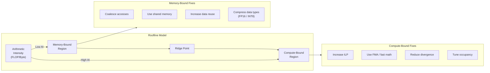
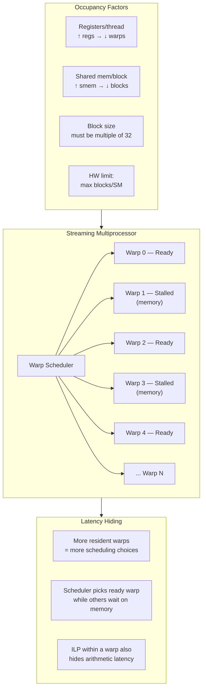

# Chapter 56 — Performance Optimization: Compute

`#cuda` `#compute` `#optimization` `#occupancy` `#ILP` `#roofline`

---

## Theory — Maximizing Compute Throughput

GPU compute optimization is the art of keeping every functional unit busy every cycle.
A modern NVIDIA SM contains dozens of CUDA cores, load/store units, special-function
units (SFUs), and tensor cores. If any of these sit idle because of poor scheduling,
divergent branches, or register pressure, you leave performance on the table.

**Occupancy** measures how many warps are *resident* on an SM relative to the hardware
maximum. Higher occupancy gives the warp scheduler more choices to hide latency, but
occupancy alone does not guarantee performance — instruction-level parallelism (ILP)
and memory access patterns matter equally.

The **roofline model** frames every kernel as either *compute-bound* or *memory-bound*.
Arithmetic intensity (FLOPs per byte loaded from DRAM) determines which regime you
are in. Compute-bound kernels benefit from instruction mix tuning and ILP; memory-bound
kernels benefit from caching, coalescing, and data reuse.

### Key Hardware Limits per SM (Ampere A100 example)

| Resource                | Limit       |
|------------------------|-------------|
| Max threads per SM     | 2048        |
| Max blocks per SM      | 32          |
| Max warps per SM       | 64          |
| Registers per SM       | 65536       |
| Shared memory per SM   | 164 KB      |
| Max registers/thread   | 255         |

If a kernel uses 64 registers per thread and 256 threads per block, one block consumes
64 × 256 = 16384 registers. The SM can host 65536 / 16384 = 4 blocks = 1024 threads,
giving 50% occupancy (1024 / 2048).

---

## What / Why / How

### What is Compute Optimization?

Compute optimization means restructuring kernel code so the SM's arithmetic pipelines
stay saturated. This includes maximizing occupancy, increasing ILP, eliminating branch
divergence, using fused instructions (FMA), and choosing the right instruction mix.

### Why Does It Matter?

- A kernel at 25% occupancy may leave 75% of the SM's latency-hiding capability unused.
- Branch divergence serializes execution within a warp — a 32-thread warp can degrade
  to effectively 1 thread if every lane takes a different path.
- Missing a single FMA fusion doubles the instruction count for multiply-add patterns,
  cutting throughput in half for compute-bound kernels.

### How to Optimize

1. **Tune block size** — use `cudaOccupancyMaxPotentialBlockSize` to find the sweet spot.
2. **Increase ILP** — have each thread process multiple elements so independent
   instructions can overlap with memory latency.
3. **Unroll loops** — reduce branch overhead and expose more ILP with `#pragma unroll`.
4. **Minimize divergence** — restructure conditionals so threads within a warp take
   the same path.
5. **Use fast math** — `__fmul_rn`, `__fdividef`, `__expf`, `--use_fast_math`.
6. **Maximize FMA** — structure arithmetic as `a * b + c` so the compiler can fuse.

---

## Code Example 1 — Occupancy Calculator

```cuda
// occupancy_calc.cu — Query optimal block size via CUDA occupancy API
#include <cstdio>
#include <cuda_runtime.h>

#define CHECK_CUDA(call)                                                     \
    do {                                                                     \
        cudaError_t err = (call);                                            \
        if (err != cudaSuccess) {                                            \
            fprintf(stderr, "CUDA error at %s:%d — %s\n",                   \
                    __FILE__, __LINE__, cudaGetErrorString(err));             \
            exit(EXIT_FAILURE);                                              \
        }                                                                    \
    } while (0)

__global__ void saxpy(float *y, const float *x, float a, int n) {
    int i = blockIdx.x * blockDim.x + threadIdx.x;
    if (i < n) y[i] = a * x[i] + y[i];
}

int main() {
    // Query device properties
    cudaDeviceProp prop;
    CHECK_CUDA(cudaGetDeviceProperties(&prop, 0));
    printf("Device: %s\n", prop.name);
    printf("Max threads/SM : %d\n", prop.maxThreadsPerMultiProcessor);
    printf("Max threads/block: %d\n", prop.maxThreadsPerBlock);
    printf("Registers/SM   : %d\n", prop.regsPerMultiprocessor);

    // Let the runtime choose optimal block size
    int minGridSize = 0, optBlockSize = 0;
    CHECK_CUDA(cudaOccupancyMaxPotentialBlockSize(
        &minGridSize, &optBlockSize, saxpy, 0, 0));

    printf("\n--- Occupancy Analysis for saxpy ---\n");
    printf("Optimal block size : %d threads\n", optBlockSize);
    printf("Min grid size      : %d blocks\n", minGridSize);

    // Compute achieved occupancy
    int maxActiveBlocks = 0;
    CHECK_CUDA(cudaOccupancyMaxActiveBlocksPerMultiprocessor(
        &maxActiveBlocks, saxpy, optBlockSize, 0));

    float occupancy = (float)(maxActiveBlocks * optBlockSize) /
                      prop.maxThreadsPerMultiProcessor;
    printf("Active blocks/SM   : %d\n", maxActiveBlocks);
    printf("Achieved occupancy : %.1f%%\n", occupancy * 100.0f);

    // Run the kernel with optimal config
    const int N = 1 << 20;
    float *d_x, *d_y;
    CHECK_CUDA(cudaMalloc(&d_x, N * sizeof(float)));
    CHECK_CUDA(cudaMalloc(&d_y, N * sizeof(float)));

    int gridSize = (N + optBlockSize - 1) / optBlockSize;
    saxpy<<<gridSize, optBlockSize>>>(d_y, d_x, 2.0f, N);
    CHECK_CUDA(cudaDeviceSynchronize());
    printf("Kernel launched: grid=%d, block=%d\n", gridSize, optBlockSize);

    CHECK_CUDA(cudaFree(d_x));
    CHECK_CUDA(cudaFree(d_y));
    return 0;
}
```

---

## Code Example 2 — ILP: 1 Element vs 4 Elements per Thread

```cuda
// ilp_comparison.cu — Demonstrate instruction-level parallelism benefit
#include <cstdio>
#include <cuda_runtime.h>

#define CHECK_CUDA(call)                                                     \
    do {                                                                     \
        cudaError_t err = (call);                                            \
        if (err != cudaSuccess) {                                            \
            fprintf(stderr, "CUDA error at %s:%d — %s\n",                   \
                    __FILE__, __LINE__, cudaGetErrorString(err));             \
            exit(EXIT_FAILURE);                                              \
        }                                                                    \
    } while (0)

// Baseline: each thread processes 1 element
__global__ void scale_ilp1(float *out, const float *in, float s, int n) {
    int i = blockIdx.x * blockDim.x + threadIdx.x;
    if (i < n) {
        out[i] = in[i] * s + 1.0f;   // single FMA
    }
}

// ILP-4: each thread processes 4 elements
__global__ void scale_ilp4(float *out, const float *in, float s, int n) {
    int base = (blockIdx.x * blockDim.x + threadIdx.x) * 4;
    if (base + 3 < n) {
        float a0 = in[base + 0];  // 4 independent loads
        float a1 = in[base + 1];
        float a2 = in[base + 2];
        float a3 = in[base + 3];

        out[base + 0] = a0 * s + 1.0f;  // 4 independent FMAs
        out[base + 1] = a1 * s + 1.0f;
        out[base + 2] = a2 * s + 1.0f;
        out[base + 3] = a3 * s + 1.0f;
    }
}

int main() {
    const int N = 1 << 24;  // 16M elements
    size_t bytes = N * sizeof(float);

    float *d_in, *d_out;
    CHECK_CUDA(cudaMalloc(&d_in, bytes));
    CHECK_CUDA(cudaMalloc(&d_out, bytes));
    CHECK_CUDA(cudaMemset(d_in, 1, bytes));

    cudaEvent_t start, stop;
    CHECK_CUDA(cudaEventCreate(&start));
    CHECK_CUDA(cudaEventCreate(&stop));

    const int BLOCK = 256;
    const int WARMUP = 5, ITERS = 50;
    float ms;

    // --- ILP-1 benchmark ---
    int grid1 = (N + BLOCK - 1) / BLOCK;
    for (int i = 0; i < WARMUP; i++)
        scale_ilp1<<<grid1, BLOCK>>>(d_out, d_in, 2.0f, N);
    CHECK_CUDA(cudaEventRecord(start));
    for (int i = 0; i < ITERS; i++)
        scale_ilp1<<<grid1, BLOCK>>>(d_out, d_in, 2.0f, N);
    CHECK_CUDA(cudaEventRecord(stop));
    CHECK_CUDA(cudaEventSynchronize(stop));
    CHECK_CUDA(cudaEventElapsedTime(&ms, start, stop));
    printf("ILP-1: %.3f ms avg (%.1f GB/s)\n",
           ms / ITERS, 2.0 * bytes / (ms / ITERS * 1e6));

    // --- ILP-4 benchmark ---
    int grid4 = (N / 4 + BLOCK - 1) / BLOCK;
    for (int i = 0; i < WARMUP; i++)
        scale_ilp4<<<grid4, BLOCK>>>(d_out, d_in, 2.0f, N);
    CHECK_CUDA(cudaEventRecord(start));
    for (int i = 0; i < ITERS; i++)
        scale_ilp4<<<grid4, BLOCK>>>(d_out, d_in, 2.0f, N);
    CHECK_CUDA(cudaEventRecord(stop));
    CHECK_CUDA(cudaEventSynchronize(stop));
    CHECK_CUDA(cudaEventElapsedTime(&ms, start, stop));
    printf("ILP-4: %.3f ms avg (%.1f GB/s)\n",
           ms / ITERS, 2.0 * bytes / (ms / ITERS * 1e6));

    CHECK_CUDA(cudaEventDestroy(start));
    CHECK_CUDA(cudaEventDestroy(stop));
    CHECK_CUDA(cudaFree(d_in));
    CHECK_CUDA(cudaFree(d_out));
    return 0;
}
```

---

## Code Example 3 — Branch Divergence: Bad vs Good

```cuda
// branch_divergence.cu — Measure divergence cost and restructured version
#include <cstdio>
#include <cuda_runtime.h>

#define CHECK_CUDA(call)                                                     \
    do {                                                                     \
        cudaError_t err = (call);                                            \
        if (err != cudaSuccess) {                                            \
            fprintf(stderr, "CUDA error at %s:%d — %s\n",                   \
                    __FILE__, __LINE__, cudaGetErrorString(err));             \
            exit(EXIT_FAILURE);                                              \
        }                                                                    \
    } while (0)

// BAD: every-other-thread divergence within a warp
__global__ void divergent_kernel(float *out, const float *in, int n) {
    int i = blockIdx.x * blockDim.x + threadIdx.x;
    if (i >= n) return;
    // threadIdx.x & 1 causes 50% divergence inside every warp
    if (threadIdx.x & 1) {
        out[i] = in[i] * 2.0f + 1.0f;
        out[i] = out[i] * out[i];
    } else {
        out[i] = in[i] * 0.5f - 1.0f;
        out[i] = sqrtf(fabsf(out[i]));
    }
}

// GOOD: branch on warp-aligned condition (warp 0 vs warp 1)
__global__ void uniform_kernel(float *out, const float *in, int n) {
    int i = blockIdx.x * blockDim.x + threadIdx.x;
    if (i >= n) return;
    int warpId = threadIdx.x / 32;
    // Entire warp takes the same path — no divergence
    if (warpId & 1) {
        out[i] = in[i] * 2.0f + 1.0f;
        out[i] = out[i] * out[i];
    } else {
        out[i] = in[i] * 0.5f - 1.0f;
        out[i] = sqrtf(fabsf(out[i]));
    }
}

int main() {
    const int N = 1 << 24;
    size_t bytes = N * sizeof(float);

    float *d_in, *d_out;
    CHECK_CUDA(cudaMalloc(&d_in, bytes));
    CHECK_CUDA(cudaMalloc(&d_out, bytes));
    CHECK_CUDA(cudaMemset(d_in, 1, bytes));

    cudaEvent_t start, stop;
    CHECK_CUDA(cudaEventCreate(&start));
    CHECK_CUDA(cudaEventCreate(&stop));

    const int BLOCK = 256, WARMUP = 5, ITERS = 100;
    int grid = (N + BLOCK - 1) / BLOCK;
    float ms;

    // Benchmark divergent version
    for (int i = 0; i < WARMUP; i++)
        divergent_kernel<<<grid, BLOCK>>>(d_out, d_in, N);
    CHECK_CUDA(cudaEventRecord(start));
    for (int i = 0; i < ITERS; i++)
        divergent_kernel<<<grid, BLOCK>>>(d_out, d_in, N);
    CHECK_CUDA(cudaEventRecord(stop));
    CHECK_CUDA(cudaEventSynchronize(stop));
    CHECK_CUDA(cudaEventElapsedTime(&ms, start, stop));
    printf("Divergent : %.3f ms avg\n", ms / ITERS);

    // Benchmark uniform version
    for (int i = 0; i < WARMUP; i++)
        uniform_kernel<<<grid, BLOCK>>>(d_out, d_in, N);
    CHECK_CUDA(cudaEventRecord(start));
    for (int i = 0; i < ITERS; i++)
        uniform_kernel<<<grid, BLOCK>>>(d_out, d_in, N);
    CHECK_CUDA(cudaEventRecord(stop));
    CHECK_CUDA(cudaEventSynchronize(stop));
    CHECK_CUDA(cudaEventElapsedTime(&ms, start, stop));
    printf("Uniform   : %.3f ms avg\n", ms / ITERS);

    CHECK_CUDA(cudaEventDestroy(start));
    CHECK_CUDA(cudaEventDestroy(stop));
    CHECK_CUDA(cudaFree(d_in));
    CHECK_CUDA(cudaFree(d_out));
    return 0;
}
```

---

## Code Example 4 — Loop Unrolling Comparison

```cuda
// loop_unroll.cu — Compare no-unroll, pragma-unroll, and manual unroll
#include <cstdio>
#include <cuda_runtime.h>

#define CHECK_CUDA(call)                                                     \
    do {                                                                     \
        cudaError_t err = (call);                                            \
        if (err != cudaSuccess) {                                            \
            fprintf(stderr, "CUDA error at %s:%d — %s\n",                   \
                    __FILE__, __LINE__, cudaGetErrorString(err));             \
            exit(EXIT_FAILURE);                                              \
        }                                                                    \
    } while (0)

#define RADIUS 4

// Version A: natural loop (compiler may or may not unroll)
__global__ void stencil_no_unroll(float *out, const float *in, int n) {
    int i = blockIdx.x * blockDim.x + threadIdx.x + RADIUS;
    if (i >= n - RADIUS) return;
    float sum = 0.0f;
    for (int r = -RADIUS; r <= RADIUS; r++) {
        sum += in[i + r];
    }
    out[i] = sum / (2 * RADIUS + 1);
}

// Version B: #pragma unroll hint
__global__ void stencil_pragma_unroll(float *out, const float *in, int n) {
    int i = blockIdx.x * blockDim.x + threadIdx.x + RADIUS;
    if (i >= n - RADIUS) return;
    float sum = 0.0f;
    #pragma unroll
    for (int r = -RADIUS; r <= RADIUS; r++) {
        sum += in[i + r];
    }
    out[i] = sum / (2 * RADIUS + 1);
}

// Version C: fully manual unroll
__global__ void stencil_manual_unroll(float *out, const float *in, int n) {
    int i = blockIdx.x * blockDim.x + threadIdx.x + RADIUS;
    if (i >= n - RADIUS) return;
    float sum = in[i - 4] + in[i - 3] + in[i - 2] + in[i - 1]
              + in[i]
              + in[i + 1] + in[i + 2] + in[i + 3] + in[i + 4];
    out[i] = sum / 9.0f;
}

int main() {
    const int N = 1 << 22;
    size_t bytes = N * sizeof(float);

    float *d_in, *d_out;
    CHECK_CUDA(cudaMalloc(&d_in, bytes));
    CHECK_CUDA(cudaMalloc(&d_out, bytes));
    CHECK_CUDA(cudaMemset(d_in, 0, bytes));

    cudaEvent_t start, stop;
    CHECK_CUDA(cudaEventCreate(&start));
    CHECK_CUDA(cudaEventCreate(&stop));

    const int BLOCK = 256, WARMUP = 5, ITERS = 100;
    int grid = (N - 2 * RADIUS + BLOCK - 1) / BLOCK;
    float ms;

    // Benchmark each variant
    auto bench = [&](const char *name, void(*kern)(float*, const float*, int)) {
        for (int i = 0; i < WARMUP; i++) kern<<<grid, BLOCK>>>(d_out, d_in, N);
        CHECK_CUDA(cudaEventRecord(start));
        for (int i = 0; i < ITERS; i++) kern<<<grid, BLOCK>>>(d_out, d_in, N);
        CHECK_CUDA(cudaEventRecord(stop));
        CHECK_CUDA(cudaEventSynchronize(stop));
        CHECK_CUDA(cudaEventElapsedTime(&ms, start, stop));
        printf("%-20s: %.3f ms avg\n", name, ms / ITERS);
    };

    bench("No unroll",     stencil_no_unroll);
    bench("Pragma unroll", stencil_pragma_unroll);
    bench("Manual unroll", stencil_manual_unroll);

    CHECK_CUDA(cudaEventDestroy(start));
    CHECK_CUDA(cudaEventDestroy(stop));
    CHECK_CUDA(cudaFree(d_in));
    CHECK_CUDA(cudaFree(d_out));
    return 0;
}
```

---

## Mermaid Diagram 1 — Roofline Model with Optimization Pathways



## Mermaid Diagram 2 — Warp Scheduling and Occupancy



---

## Exercises

### 🟢 Exercise 1 — Occupancy Query
Write a program that launches a simple vector-add kernel, queries its occupancy using
`cudaOccupancyMaxActiveBlocksPerMultiprocessor`, and prints the percentage occupancy
for block sizes 64, 128, 256, and 512.

### 🟡 Exercise 2 — ILP Exploration
Modify the ILP example to test ILP-2 and ILP-8 variants. Plot (or print) the bandwidth
achieved by each. Determine at what ILP level returns diminish on your GPU.

### 🟡 Exercise 3 — Divergence Profiling
Use `ncu` (Nsight Compute) to profile the divergent vs uniform kernels from Code
Example 3. Report the `smsp__thread_inst_executed_pred_on` metric and compare the
ratio of predicated instructions between the two versions.

### 🔴 Exercise 4 — Roofline Classification
Write a kernel that performs a matrix-vector multiply (y = A·x). Calculate its
arithmetic intensity analytically (FLOPs / bytes loaded). Then measure achieved
FLOP/s and bandwidth. Determine whether the kernel is compute-bound or memory-bound
on your GPU and propose the appropriate optimization strategy.

---

## Solutions

### Solution 1 — Occupancy Query

```cuda
#include <cstdio>
#include <cuda_runtime.h>

#define CHECK_CUDA(call)                                                     \
    do {                                                                     \
        cudaError_t err = (call);                                            \
        if (err != cudaSuccess) {                                            \
            fprintf(stderr, "CUDA error: %s\n", cudaGetErrorString(err));    \
            exit(1);                                                         \
        }                                                                    \
    } while (0)

__global__ void vec_add(float *c, const float *a, const float *b, int n) {
    int i = blockIdx.x * blockDim.x + threadIdx.x;
    if (i < n) c[i] = a[i] + b[i];
}

int main() {
    cudaDeviceProp prop;
    CHECK_CUDA(cudaGetDeviceProperties(&prop, 0));
    int blockSizes[] = {64, 128, 256, 512};
    for (int bs : blockSizes) {
        int maxActive = 0;
        CHECK_CUDA(cudaOccupancyMaxActiveBlocksPerMultiprocessor(
            &maxActive, vec_add, bs, 0));
        float occ = (float)(maxActive * bs) / prop.maxThreadsPerMultiProcessor;
        printf("Block=%3d  Active blocks/SM=%2d  Occupancy=%.0f%%\n",
               bs, maxActive, occ * 100);
    }
    return 0;
}
```

### Solution 2 — ILP Exploration (sketch)

Process 2 and 8 elements per thread following the pattern in Code Example 2. Key
change for ILP-8:

```cuda
__global__ void scale_ilp8(float *out, const float *in, float s, int n) {
    int base = (blockIdx.x * blockDim.x + threadIdx.x) * 8;
    if (base + 7 < n) {
        float a0=in[base], a1=in[base+1], a2=in[base+2], a3=in[base+3];
        float a4=in[base+4], a5=in[base+5], a6=in[base+6], a7=in[base+7];
        out[base]  =a0*s+1.f; out[base+1]=a1*s+1.f;
        out[base+2]=a2*s+1.f; out[base+3]=a3*s+1.f;
        out[base+4]=a4*s+1.f; out[base+5]=a5*s+1.f;
        out[base+6]=a6*s+1.f; out[base+7]=a7*s+1.f;
    }
}
```

Grid size becomes `N/8/BLOCK`. On most GPUs, ILP-4 captures the majority of the
benefit; ILP-8 may yield diminishing returns or hurt due to register pressure.

### Solution 3 — Divergence Profiling

```bash
ncu --metrics smsp__thread_inst_executed_pred_on.sum,\
smsp__thread_inst_executed.sum \
./branch_divergence
```

The divergent kernel will show `pred_on / total` ≈ 0.5 (half the threads are masked
at any given branch). The uniform kernel shows a ratio close to 1.0.

### Solution 4 — Roofline Classification (analysis)

For matrix-vector multiply y = A·x where A is M×N:
- FLOPs = 2·M·N (one multiply + one add per element of A)
- Bytes = (M·N + N + M) × 4 ≈ 4·M·N for large M, N
- Arithmetic intensity ≈ 2·M·N / (4·M·N) = 0.5 FLOP/byte

At 0.5 FLOP/byte, matvec is firmly **memory-bound** on any modern GPU (the ridge
point is typically at 10–50 FLOP/byte). Optimization should focus on memory access
patterns: coalesced loads of A, shared-memory caching of x tiles, and using FP16
to double effective bandwidth.

---

## Quiz

**Q1.** What does occupancy measure?
- A) Percentage of GPU memory used
- B) Ratio of active warps to maximum warps per SM ✅
- C) Number of kernels running concurrently
- D) Percentage of cores executing FMA instructions

**Q2.** Which factor does NOT limit occupancy?
- A) Registers per thread
- B) Shared memory per block
- C) Global memory bandwidth ✅
- D) Maximum blocks per SM

**Q3.** Branch divergence occurs when:
- A) Two blocks take different paths
- B) Threads within the same warp take different paths ✅
- C) The CPU and GPU execute different code
- D) Two kernels run on different SMs

**Q4.** What is the benefit of `#pragma unroll`?
- A) It allocates more registers automatically
- B) It tells the compiler to replicate the loop body, reducing branch overhead ✅
- C) It enables asynchronous memory copies
- D) It forces the kernel to use shared memory

**Q5.** A kernel with arithmetic intensity of 0.25 FLOP/byte is:
- A) Compute-bound
- B) Memory-bound ✅
- C) Perfectly balanced
- D) Cannot be determined

**Q6.** Fused multiply-add (FMA) helps because:
- A) It uses shared memory instead of registers
- B) It computes `a*b+c` in one instruction instead of two ✅
- C) It bypasses the warp scheduler
- D) It doubles the block size

**Q7.** ILP (instruction-level parallelism) hides latency by:
- A) Running more blocks per SM
- B) Giving the scheduler independent instructions within the same thread ✅
- C) Using unified memory
- D) Reducing kernel launch overhead

**Q8.** `cudaOccupancyMaxPotentialBlockSize` returns:
- A) The number of SMs on the device
- B) The minimum grid size and optimal block size for maximum occupancy ✅
- C) The amount of shared memory available
- D) The register count of a kernel

---

## Key Takeaways

- **Occupancy is necessary but not sufficient** — 100% occupancy with poor memory
  patterns still yields low performance. Aim for ≥50% then focus on ILP and memory.
- **ILP multiplies effective throughput** — processing 4 elements per thread gives
  the scheduler 4× more independent instructions to overlap with latency.
- **Branch divergence is a warp-level problem** — divergence between warps is free;
  divergence within a warp serializes execution paths.
- **`#pragma unroll` is a strong hint** — for small, known-trip-count loops it
  eliminates branch overhead and enables further compiler optimizations.
- **FMA is the most important single instruction** — structure arithmetic as `a*b+c`
  whenever possible; it halves instruction count for multiply-add patterns.
- **The roofline model classifies every kernel** — memory-bound kernels need better
  access patterns; compute-bound kernels need instruction optimization.
- **Use the occupancy API** — `cudaOccupancyMaxPotentialBlockSize` removes guesswork
  from block size selection.
- **Fast math intrinsics trade accuracy for speed** — `__fdividef`, `__expf`, and
  `--use_fast_math` can provide 2-5× speedup for transcendental-heavy kernels.

---

## Chapter Summary

Compute optimization on the GPU is a multi-dimensional problem that begins with
understanding where your kernel sits on the roofline. If it is memory-bound, no amount
of instruction tuning will help — you must improve data reuse and access patterns
first. If it is compute-bound, the tools in this chapter become critical: maximize
occupancy to give the warp scheduler enough warps to hide latency, increase ILP so
each thread exposes independent work, unroll loops to reduce control-flow overhead,
eliminate branch divergence to keep all 32 lanes active, and use fused instructions
(FMA) and fast-math intrinsics to squeeze the most out of every clock cycle. The CUDA
occupancy API and profiling tools like Nsight Compute make the analysis data-driven
rather than guesswork. Mastering compute optimization separates a kernel that merely
runs on the GPU from one that truly exploits the hardware.

---

## Real-World Insight — AI/ML Applications

| Technique | AI/ML Application |
|-----------|-------------------|
| **Occupancy tuning** | Convolution kernels in cuDNN dynamically select block size per layer shape. Transformer attention kernels (FlashAttention) carefully balance occupancy with shared memory to maximize throughput. |
| **ILP** | GEMM implementations in cuBLAS process 4–8 output elements per thread, enabling the register file to serve as a fast accumulator while global memory loads are in flight. |
| **Loop unrolling** | Inner loops of reduction kernels (softmax, layer-norm) are fully unrolled to eliminate branch overhead in performance-critical training paths. |
| **Branch divergence** | Sparse attention patterns (e.g., in Longformer, BigBird) require careful masking strategies to avoid per-thread divergence when computing partial attention matrices. |
| **FMA / fast math** | Mixed-precision training uses FP16 FMA on tensor cores. Activation functions (GELU, SiLU) use `__expf` for fast approximation during inference, trading sub-ULP accuracy for 3× throughput. |
| **Roofline analysis** | Framework developers (PyTorch, TensorRT) use roofline plots to decide whether to fuse operators — fusing two memory-bound kernels increases arithmetic intensity above the ridge point. |

---

## Common Mistakes

1. **Chasing 100% occupancy blindly** — increasing occupancy beyond a threshold often
   yields no benefit and may hurt by increasing register spilling to local memory.

2. **Ignoring register pressure when increasing ILP** — processing 8 elements per
   thread requires 8× the registers for temporaries, which can reduce occupancy
   below the useful threshold.

3. **Branching on `threadIdx.x`** — conditions like `if (threadIdx.x < 16)` cause
   50% divergence in every warp. Restructure to branch on `warpId` or block-level
   conditions.

4. **Using `#pragma unroll` on variable-trip-count loops** — the compiler cannot
   unroll a loop whose bounds are runtime-dependent. Use a compile-time constant or
   template parameter.

5. **Forgetting FMA ordering** — writing `c = a * b; c = c + d;` as two statements
   may prevent the compiler from fusing. Write `c = a * b + d;` in a single expression.

6. **Overusing `--use_fast_math` globally** — this flag affects ALL floating-point
   operations. Prefer selective intrinsics (`__fmaf_rn`, `__fdividef`) for code that
   needs precision in some paths.

7. **Not profiling before optimizing** — applying compute optimizations to a
   memory-bound kernel wastes effort. Always run `ncu` first to classify the kernel.

8. **Setting block size to non-multiples of 32** — threads are scheduled in warps of
   32. A block of 100 threads wastes 28 threads in the last warp (padding to 128).

---

## Interview Questions

### Q1: How do you determine whether a kernel is compute-bound or memory-bound?

**Answer:** Use the roofline model. Calculate the kernel's arithmetic intensity
(FLOPs performed ÷ bytes transferred from/to DRAM). Compare this to the GPU's ridge
point (peak FLOP/s ÷ peak bandwidth). If the kernel's arithmetic intensity is below
the ridge point, it is memory-bound; above it, compute-bound. Practically, profile
with `ncu` and check `sm__throughput` vs `dram__throughput` — whichever is closer to
its peak is the bottleneck. For memory-bound kernels, optimize access patterns and
data reuse; for compute-bound, optimize instruction mix and ILP.

### Q2: Explain the trade-off between occupancy and ILP.

**Answer:** Occupancy hides memory latency by having many warps ready to execute while
others stall on loads. ILP hides latency within a single thread by issuing independent
instructions back-to-back. Increasing ILP typically requires more registers per thread
(more temporaries), which reduces occupancy. The optimal balance depends on the kernel:
a memory-latency-dominated kernel needs higher occupancy; a compute-heavy kernel with
little memory access can thrive at lower occupancy with high ILP. The Volkov technique
shows that 25% occupancy with ILP-4 can outperform 100% occupancy with ILP-1.

### Q3: What happens during branch divergence and how do you avoid it?

**Answer:** When threads within a warp take different paths at a conditional branch,
the hardware serializes execution: it runs one path with the divergent threads masked
off, then runs the other path with the first group masked. This effectively halves (or
worse) the warp's throughput. Avoidance strategies: (1) restructure conditions to
branch on warp-aligned boundaries (e.g., `warpId` instead of `threadIdx.x`), (2) use
predication or branchless arithmetic (`result = cond * valA + (1-cond) * valB`),
(3) sort input data so adjacent threads process similar cases, (4) use separate
kernels for different code paths.

### Q4: When should you NOT use `#pragma unroll`?

**Answer:** Avoid unrolling when: (1) the loop trip count is large or unknown at
compile time — the compiler cannot unroll and may generate worse code; (2) the loop
body is large — unrolling inflates the instruction cache footprint and increases
register pressure, potentially hurting occupancy; (3) the loop already matches the
pipeline depth — additional unrolling yields no further ILP benefit. Always verify with
`ncu` or `--ptxas-options=-v` (to check register count) that unrolling actually helps.

### Q5: How does `cudaOccupancyMaxPotentialBlockSize` work and when would you override it?

**Answer:** This API inspects the kernel's register usage, shared memory requirements,
and device limits, then solves for the block size that maximizes theoretical occupancy.
It returns both the optimal block size and the minimum grid size needed to fill the
device. You might override it when: (1) the kernel uses dynamic shared memory that
the API doesn't know about — pass the `dynamicSMemSize` parameter or a functor;
(2) you want lower occupancy intentionally to give each thread more registers for ILP;
(3) the kernel has specific block-dimension requirements (e.g., must be 2D for a tiled
algorithm). The API provides a starting point, not the final answer — always benchmark.
