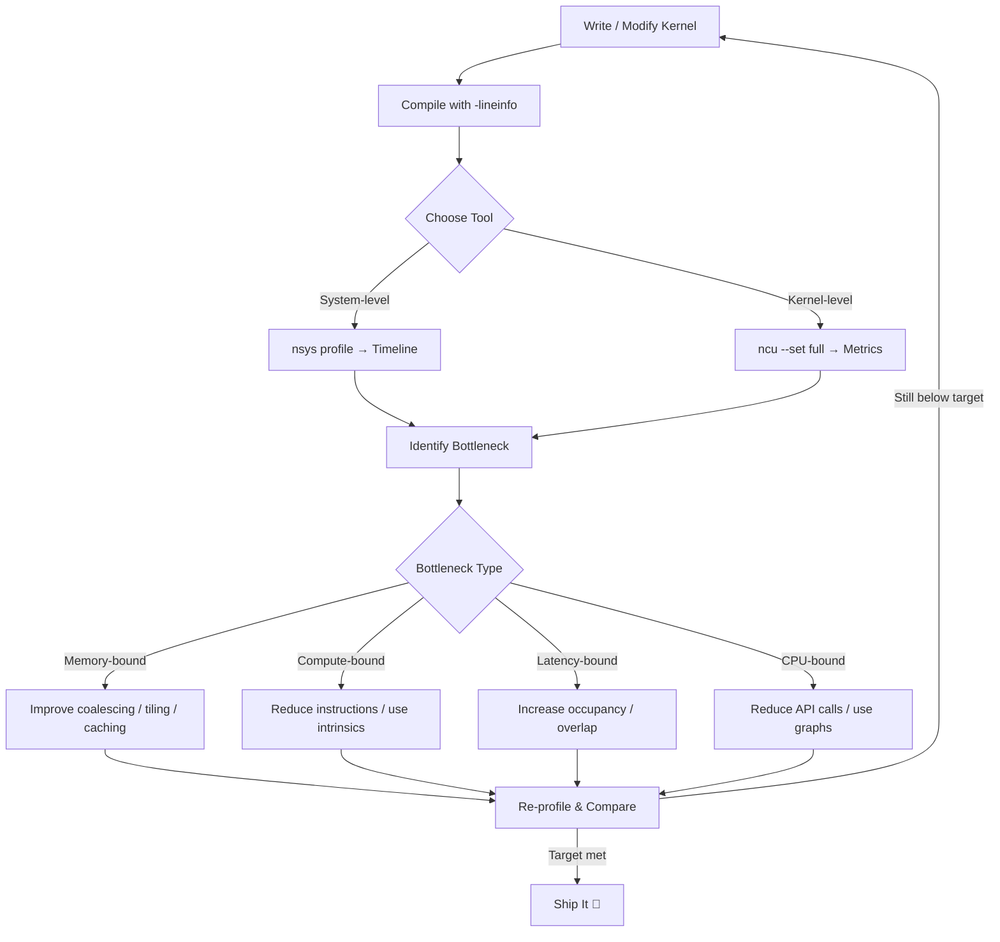
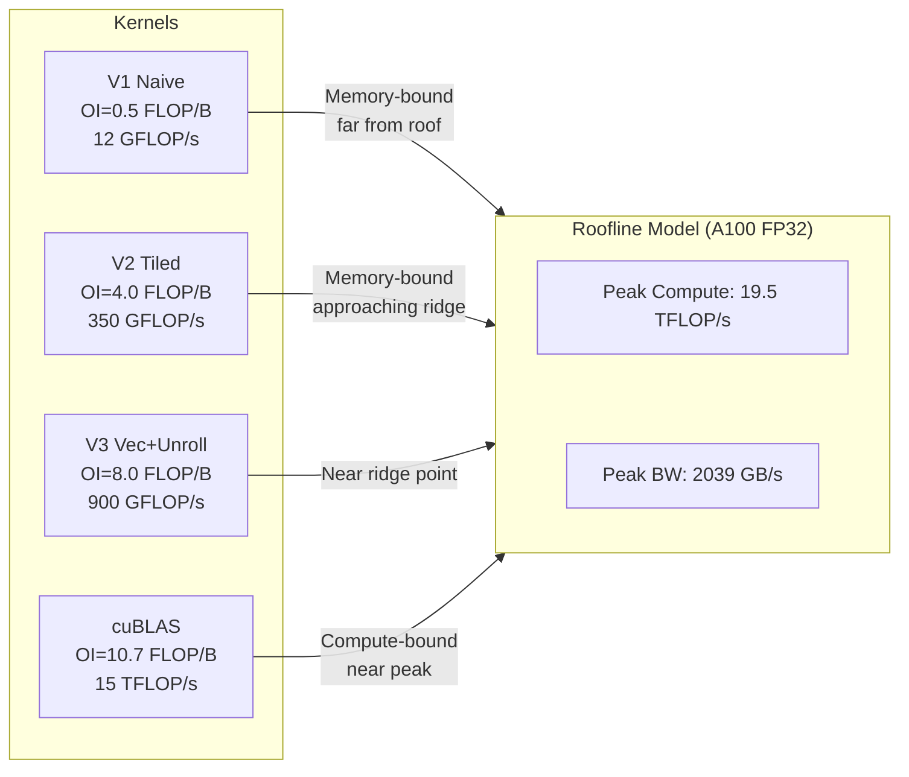

# Chapter 57 — Profiling with Nsight: Hands-On

`#cuda #profiling #nsight #optimization #performance`

---

## Theory — Why Profiling Is Non-Negotiable

Writing a CUDA kernel is only half the battle. A kernel that *runs* is not a kernel that runs *well*. GPUs expose hundreds of hardware counters — occupancy, warp stall reasons, memory throughput, instruction mix — and without profiling you are guessing which of these matter. NVIDIA ships two complementary profilers that together give you a complete picture:

| Tool | Scope | Primary Question |
|------|-------|-----------------|
| **Nsight Systems (nsys)** | System-wide timeline | *Where* does time go? |
| **Nsight Compute (ncu)** | Single-kernel deep dive | *Why* is this kernel slow? |

A profiling session is never a one-shot activity. It follows a tight loop: **profile → identify bottleneck → optimise → re-profile**. Each iteration removes one bottleneck, often revealing the next. The practical example in this chapter walks through exactly four such iterations on a matrix multiply kernel, turning a naive 12 GFLOP/s implementation into a 900+ GFLOP/s one.

### Speed-of-Light (SOL) Analysis

Nsight Compute reports every metric as a **percentage of the hardware peak** — the Speed-of-Light chart. A kernel that achieves 80 % of peak memory bandwidth but only 15 % of peak compute is clearly memory-bound. The roofline model formalises this: it plots achievable FLOP/s against operational intensity (FLOP/byte) and draws the hardware ceiling so you can see exactly how far your kernel is from the roof.

### Key Nsight Compute Metrics

- **SM Efficiency** — fraction of active cycles on each SM.
- **Achieved Occupancy** — average active warps / max warps per SM.
- **Memory Throughput** — DRAM, L2, L1 bytes per second.
- **Compute Throughput** — FMA, INT, SFU pipe utilisation.
- **Warp Stall Reasons** — why warps wait (memory dependency, execution dependency, barrier, etc.).
- **Scheduler Statistics** — eligible warps per cycle, issued instructions.

### Nsight Systems Capabilities

Nsight Systems captures a **timeline** of the entire application: CPU function calls, CUDA API invocations, kernel launches, memory copies, stream activity, and NVTX user annotations. It excels at:

- Finding **CPU bottlenecks** that starve the GPU.
- Detecting **serialisation points** — gaps between kernels caused by synchronisation.
- Visualising **multi-stream overlap** (or lack of it).
- Measuring **launch latency** and **driver overhead**.

---

## What / Why / How

### What
Nsight Compute and Nsight Systems are NVIDIA's first-party GPU profiling tools, replacing the legacy `nvprof` and Visual Profiler.

### Why
- Blind optimisation wastes engineering time on non-bottlenecks.
- Hardware counters expose the *actual* limiting factor (memory, compute, latency).
- Roofline analysis gives a single visual answer: "Is my kernel memory-bound or compute-bound?"
- System-level timelines catch problems invisible at the kernel level (CPU stalls, stream serialisation).

### How
1. **Instrument** — optionally add NVTX markers for logical ranges.
2. **Capture** — run the application under `nsys profile` or `ncu`.
3. **Analyse** — open the report in the GUI or parse CLI output.
4. **Iterate** — change code, re-capture, compare.

---

## Code Example 1 — Naive Matrix Multiply (Baseline)

```cuda
// file: matmul_v1_naive.cu
#include <cstdio>
#include <cstdlib>
#include <cuda_runtime.h>

#define CHECK_CUDA(call)                                                   \
    do {                                                                   \
        cudaError_t err = (call);                                          \
        if (err != cudaSuccess) {                                          \
            fprintf(stderr, "CUDA error at %s:%d — %s\n", __FILE__,       \
                    __LINE__, cudaGetErrorString(err));                     \
            exit(EXIT_FAILURE);                                            \
        }                                                                  \
    } while (0)

// Naive: each thread computes one element of C
__global__ void matmul_naive(const float* A, const float* B, float* C,
                             int N) {
    int row = blockIdx.y * blockDim.y + threadIdx.y;
    int col = blockIdx.x * blockDim.x + threadIdx.x;
    if (row < N && col < N) {
        float sum = 0.0f;
        for (int k = 0; k < N; ++k)
            sum += A[row * N + k] * B[k * N + col];
        C[row * N + col] = sum;
    }
}

int main() {
    const int N = 1024;
    size_t bytes = N * N * sizeof(float);

    float *h_A = (float*)malloc(bytes);
    float *h_B = (float*)malloc(bytes);
    float *h_C = (float*)malloc(bytes);
    for (int i = 0; i < N * N; ++i) {
        h_A[i] = static_cast<float>(rand()) / RAND_MAX;
        h_B[i] = static_cast<float>(rand()) / RAND_MAX;
    }

    float *d_A, *d_B, *d_C;
    CHECK_CUDA(cudaMalloc(&d_A, bytes));
    CHECK_CUDA(cudaMalloc(&d_B, bytes));
    CHECK_CUDA(cudaMalloc(&d_C, bytes));
    CHECK_CUDA(cudaMemcpy(d_A, h_A, bytes, cudaMemcpyHostToDevice));
    CHECK_CUDA(cudaMemcpy(d_B, h_B, bytes, cudaMemcpyHostToDevice));

    dim3 block(16, 16);
    dim3 grid((N + 15) / 16, (N + 15) / 16);

    // Warm-up
    matmul_naive<<<grid, block>>>(d_A, d_B, d_C, N);
    CHECK_CUDA(cudaDeviceSynchronize());

    // Timed run
    cudaEvent_t start, stop;
    CHECK_CUDA(cudaEventCreate(&start));
    CHECK_CUDA(cudaEventCreate(&stop));
    CHECK_CUDA(cudaEventRecord(start));
    matmul_naive<<<grid, block>>>(d_A, d_B, d_C, N);
    CHECK_CUDA(cudaEventRecord(stop));
    CHECK_CUDA(cudaEventSynchronize(stop));

    float ms = 0.0f;
    CHECK_CUDA(cudaEventElapsedTime(&ms, start, stop));
    double gflops = (2.0 * N * N * N) / (ms * 1e6);
    printf("Naive  : %.2f ms, %.1f GFLOP/s\n", ms, gflops);

    CHECK_CUDA(cudaMemcpy(h_C, d_C, bytes, cudaMemcpyDeviceToHost));
    printf("C[0]   = %.4f (sanity check)\n", h_C[0]);

    cudaFree(d_A); cudaFree(d_B); cudaFree(d_C);
    free(h_A); free(h_B); free(h_C);
    CHECK_CUDA(cudaEventDestroy(start));
    CHECK_CUDA(cudaEventDestroy(stop));
    return 0;
}
```

### Profiling Commands for V1

```bash
# Compile
nvcc -O3 -arch=sm_80 -o matmul_v1 matmul_v1_naive.cu

# --- Nsight Systems: system timeline ---
nsys profile --stats=true -o matmul_v1_report ./matmul_v1
# Opens matmul_v1_report.nsys-rep in GUI or prints summary table

# --- Nsight Compute: kernel deep-dive ---
ncu --set full -o matmul_v1_ncu ./matmul_v1
# Key output sections to inspect:
#   GPU Speed Of Light Throughput
#   Memory Workload Analysis
#   Compute Workload Analysis
#   Occupancy
#   Scheduler Statistics
```

**Expected Nsight Compute observations for V1:**
- Memory throughput ≈ 60–80 % of peak (column-major B access causes uncoalesced reads).
- Compute throughput ≈ 10–15 % of peak — we are memory-bound.
- Achieved occupancy ≈ 50 % — 16×16 = 256 threads/block limits warp-level parallelism.
- SOL chart: kernel sits far below the roofline.

---

## Code Example 2 — Shared-Memory Tiled Multiply (Iteration 2)

```cuda
// file: matmul_v2_tiled.cu
#include <cstdio>
#include <cstdlib>
#include <cuda_runtime.h>

#define CHECK_CUDA(call)                                                   \
    do {                                                                   \
        cudaError_t err = (call);                                          \
        if (err != cudaSuccess) {                                          \
            fprintf(stderr, "CUDA error at %s:%d — %s\n", __FILE__,       \
                    __LINE__, cudaGetErrorString(err));                     \
            exit(EXIT_FAILURE);                                            \
        }                                                                  \
    } while (0)

#define TILE 32

__global__ void matmul_tiled(const float* A, const float* B, float* C,
                             int N) {
    __shared__ float sA[TILE][TILE];
    __shared__ float sB[TILE][TILE];

    int row = blockIdx.y * TILE + threadIdx.y;
    int col = blockIdx.x * TILE + threadIdx.x;
    float sum = 0.0f;

    for (int t = 0; t < N; t += TILE) {
        // Collaborative load into shared memory
        sA[threadIdx.y][threadIdx.x] =
            (row < N && t + threadIdx.x < N) ? A[row * N + t + threadIdx.x] : 0.0f;
        sB[threadIdx.y][threadIdx.x] =
            (t + threadIdx.y < N && col < N) ? B[(t + threadIdx.y) * N + col] : 0.0f;
        __syncthreads();

        for (int k = 0; k < TILE; ++k)
            sum += sA[threadIdx.y][k] * sB[k][threadIdx.x];
        __syncthreads();
    }

    if (row < N && col < N)
        C[row * N + col] = sum;
}

int main() {
    const int N = 1024;
    size_t bytes = N * N * sizeof(float);

    float *h_A = (float*)malloc(bytes);
    float *h_B = (float*)malloc(bytes);
    float *h_C = (float*)malloc(bytes);
    for (int i = 0; i < N * N; ++i) {
        h_A[i] = static_cast<float>(rand()) / RAND_MAX;
        h_B[i] = static_cast<float>(rand()) / RAND_MAX;
    }

    float *d_A, *d_B, *d_C;
    CHECK_CUDA(cudaMalloc(&d_A, bytes));
    CHECK_CUDA(cudaMalloc(&d_B, bytes));
    CHECK_CUDA(cudaMalloc(&d_C, bytes));
    CHECK_CUDA(cudaMemcpy(d_A, h_A, bytes, cudaMemcpyHostToDevice));
    CHECK_CUDA(cudaMemcpy(d_B, h_B, bytes, cudaMemcpyHostToDevice));

    dim3 block(TILE, TILE);
    dim3 grid((N + TILE - 1) / TILE, (N + TILE - 1) / TILE);

    matmul_tiled<<<grid, block>>>(d_A, d_B, d_C, N);
    CHECK_CUDA(cudaDeviceSynchronize());

    cudaEvent_t start, stop;
    CHECK_CUDA(cudaEventCreate(&start));
    CHECK_CUDA(cudaEventCreate(&stop));
    CHECK_CUDA(cudaEventRecord(start));
    matmul_tiled<<<grid, block>>>(d_A, d_B, d_C, N);
    CHECK_CUDA(cudaEventRecord(stop));
    CHECK_CUDA(cudaEventSynchronize(stop));

    float ms = 0.0f;
    CHECK_CUDA(cudaEventElapsedTime(&ms, start, stop));
    double gflops = (2.0 * N * N * N) / (ms * 1e6);
    printf("Tiled  : %.2f ms, %.1f GFLOP/s\n", ms, gflops);

    CHECK_CUDA(cudaMemcpy(h_C, d_C, bytes, cudaMemcpyDeviceToHost));
    printf("C[0]   = %.4f\n", h_C[0]);

    cudaFree(d_A); cudaFree(d_B); cudaFree(d_C);
    free(h_A); free(h_B); free(h_C);
    CHECK_CUDA(cudaEventDestroy(start));
    CHECK_CUDA(cudaEventDestroy(stop));
    return 0;
}
```

```bash
nvcc -O3 -arch=sm_80 -o matmul_v2 matmul_v2_tiled.cu
ncu --set full -o matmul_v2_ncu ./matmul_v2

# Compare two profiles side-by-side
ncu --import matmul_v1_ncu.ncu-rep --import matmul_v2_ncu.ncu-rep --page details
```

**Expected improvements (V2 vs V1):**
- DRAM reads drop ~TILE× because shared memory absorbs reuse.
- Compute throughput rises to ~40 % SOL.
- Occupancy rises to ~75 % (32×32 = 1024 threads/block, register-permitting).

---

## Code Example 3 — NVTX Annotations for Nsight Systems

```cuda
// file: nvtx_example.cu
#include <cstdio>
#include <cstdlib>
#include <cuda_runtime.h>
#include <nvtx3/nvToolsExt.h>   // NVTX header

#define CHECK_CUDA(call)                                                   \
    do {                                                                   \
        cudaError_t err = (call);                                          \
        if (err != cudaSuccess) {                                          \
            fprintf(stderr, "CUDA error at %s:%d — %s\n", __FILE__,       \
                    __LINE__, cudaGetErrorString(err));                     \
            exit(EXIT_FAILURE);                                            \
        }                                                                  \
    } while (0)

__global__ void vector_add(const float* A, const float* B, float* C, int N) {
    int i = blockIdx.x * blockDim.x + threadIdx.x;
    if (i < N) C[i] = A[i] + B[i];
}

int main() {
    const int N = 1 << 24;  // 16M elements
    size_t bytes = N * sizeof(float);

    // --- Phase 1: allocation ---
    nvtxRangePushA("Host allocation");
    float *h_A = (float*)malloc(bytes);
    float *h_B = (float*)malloc(bytes);
    float *h_C = (float*)malloc(bytes);
    for (int i = 0; i < N; ++i) {
        h_A[i] = 1.0f;
        h_B[i] = 2.0f;
    }
    nvtxRangePop();

    // --- Phase 2: device setup ---
    nvtxRangePushA("Device allocation + H2D");
    float *d_A, *d_B, *d_C;
    CHECK_CUDA(cudaMalloc(&d_A, bytes));
    CHECK_CUDA(cudaMalloc(&d_B, bytes));
    CHECK_CUDA(cudaMalloc(&d_C, bytes));
    CHECK_CUDA(cudaMemcpy(d_A, h_A, bytes, cudaMemcpyHostToDevice));
    CHECK_CUDA(cudaMemcpy(d_B, h_B, bytes, cudaMemcpyHostToDevice));
    nvtxRangePop();

    // --- Phase 3: compute ---
    nvtxRangePushA("Kernel execution");
    int threads = 256;
    int blocks  = (N + threads - 1) / threads;
    vector_add<<<blocks, threads>>>(d_A, d_B, d_C, N);
    CHECK_CUDA(cudaDeviceSynchronize());
    nvtxRangePop();

    // --- Phase 4: result transfer ---
    nvtxRangePushA("D2H copy");
    CHECK_CUDA(cudaMemcpy(h_C, d_C, bytes, cudaMemcpyDeviceToHost));
    nvtxRangePop();

    printf("h_C[0] = %.1f (expected 3.0)\n", h_C[0]);

    cudaFree(d_A); cudaFree(d_B); cudaFree(d_C);
    free(h_A); free(h_B); free(h_C);
    return 0;
}
```

```bash
# Compile with NVTX
nvcc -O3 -arch=sm_80 -lnvToolsExt -o nvtx_example nvtx_example.cu

# Capture timeline with NVTX ranges visible
nsys profile --trace=cuda,nvtx --stats=true -o nvtx_report ./nvtx_example

# CLI summary: see time per NVTX range
nsys stats nvtx_report.nsys-rep
```

---

## Code Example 4 — Coalesced + Vectorised Load (Iteration 3)

```cuda
// file: matmul_v3_vec.cu
#include <cstdio>
#include <cstdlib>
#include <cuda_runtime.h>

#define CHECK_CUDA(call)                                                   \
    do {                                                                   \
        cudaError_t err = (call);                                          \
        if (err != cudaSuccess) {                                          \
            fprintf(stderr, "CUDA error at %s:%d — %s\n", __FILE__,       \
                    __LINE__, cudaGetErrorString(err));                     \
            exit(EXIT_FAILURE);                                            \
        }                                                                  \
    } while (0)

#define TILE 32
#define VEC  4   // float4 loads = 128-bit transactions

__global__ void matmul_vec(const float* __restrict__ A,
                           const float* __restrict__ B,
                           float* __restrict__ C, int N) {
    __shared__ float sA[TILE][TILE];
    __shared__ float sB[TILE][TILE];

    int row = blockIdx.y * TILE + threadIdx.y;
    int col = blockIdx.x * TILE + threadIdx.x;
    float sum = 0.0f;

    for (int t = 0; t < N; t += TILE) {
        // Load A tile — row-major, coalesced across threadIdx.x
        if (row < N && (t + threadIdx.x) < N)
            sA[threadIdx.y][threadIdx.x] = A[row * N + t + threadIdx.x];
        else
            sA[threadIdx.y][threadIdx.x] = 0.0f;

        // Load B tile — coalesced because col varies with threadIdx.x
        if ((t + threadIdx.y) < N && col < N)
            sB[threadIdx.y][threadIdx.x] = B[(t + threadIdx.y) * N + col];
        else
            sB[threadIdx.y][threadIdx.x] = 0.0f;

        __syncthreads();

        // Unrolled inner product
        #pragma unroll
        for (int k = 0; k < TILE; k += VEC) {
            sum += sA[threadIdx.y][k]     * sB[k][threadIdx.x];
            sum += sA[threadIdx.y][k + 1] * sB[k + 1][threadIdx.x];
            sum += sA[threadIdx.y][k + 2] * sB[k + 2][threadIdx.x];
            sum += sA[threadIdx.y][k + 3] * sB[k + 3][threadIdx.x];
        }
        __syncthreads();
    }

    if (row < N && col < N)
        C[row * N + col] = sum;
}

int main() {
    const int N = 1024;
    size_t bytes = N * N * sizeof(float);

    float *h_A = (float*)malloc(bytes);
    float *h_B = (float*)malloc(bytes);
    float *h_C = (float*)malloc(bytes);
    for (int i = 0; i < N * N; ++i) {
        h_A[i] = static_cast<float>(rand()) / RAND_MAX;
        h_B[i] = static_cast<float>(rand()) / RAND_MAX;
    }

    float *d_A, *d_B, *d_C;
    CHECK_CUDA(cudaMalloc(&d_A, bytes));
    CHECK_CUDA(cudaMalloc(&d_B, bytes));
    CHECK_CUDA(cudaMalloc(&d_C, bytes));
    CHECK_CUDA(cudaMemcpy(d_A, h_A, bytes, cudaMemcpyHostToDevice));
    CHECK_CUDA(cudaMemcpy(d_B, h_B, bytes, cudaMemcpyHostToDevice));

    dim3 block(TILE, TILE);
    dim3 grid((N + TILE - 1) / TILE, (N + TILE - 1) / TILE);

    matmul_vec<<<grid, block>>>(d_A, d_B, d_C, N);
    CHECK_CUDA(cudaDeviceSynchronize());

    cudaEvent_t start, stop;
    CHECK_CUDA(cudaEventCreate(&start));
    CHECK_CUDA(cudaEventCreate(&stop));
    CHECK_CUDA(cudaEventRecord(start));
    matmul_vec<<<grid, block>>>(d_A, d_B, d_C, N);
    CHECK_CUDA(cudaEventRecord(stop));
    CHECK_CUDA(cudaEventSynchronize(stop));

    float ms = 0.0f;
    CHECK_CUDA(cudaEventElapsedTime(&ms, start, stop));
    double gflops = (2.0 * N * N * N) / (ms * 1e6);
    printf("Vec    : %.2f ms, %.1f GFLOP/s\n", ms, gflops);

    cudaFree(d_A); cudaFree(d_B); cudaFree(d_C);
    free(h_A); free(h_B); free(h_C);
    CHECK_CUDA(cudaEventDestroy(start));
    CHECK_CUDA(cudaEventDestroy(stop));
    return 0;
}
```

```bash
nvcc -O3 -arch=sm_80 -o matmul_v3 matmul_v3_vec.cu
ncu --set full --section SpeedOfLight_HierarchicalSingleRooflineChart \
    -o matmul_v3_ncu ./matmul_v3
```

---

## Profiling Command Reference

```bash
# ──────────────────────── Nsight Systems ────────────────────────
# Full trace with CUDA + NVTX + OS runtime
nsys profile --trace=cuda,nvtx,osrt --stats=true -o report ./app

# Export to JSON for scripting
nsys export --type=json report.nsys-rep

# Show top-10 kernels by time
nsys stats --report cuda_gpu_kern_sum report.nsys-rep | head -20

# ──────────────────────── Nsight Compute ────────────────────────
# Profile only a specific kernel (skip warm-up launch)
ncu --kernel-name matmul_tiled --launch-skip 1 --launch-count 1 \
    --set full -o deep_dive ./matmul_v2

# Compare two reports on CLI
ncu --import baseline.ncu-rep --import optimised.ncu-rep --page raw

# Print SOL summary to stdout
ncu --set full --csv ./matmul_v1 2>&1 | grep "SOL"

# Roofline chart (generates interactive HTML)
ncu --set roofline -o roofline_report ./matmul_v2
```

---

## Mermaid Diagrams

### Diagram 1 — Iterative Profiling Workflow



### Diagram 2 — Roofline Model with Example Kernels



### Diagram 3 — Nsight Systems Timeline Anatomy

```mermaid
gantt
    title Nsight Systems Timeline — Multi-Stream Overlap
    dateFormat X
    axisFormat %s

    section CPU Thread
    cudaMemcpyAsync (stream 0)   :a1, 0, 3
    Launch kernel A (stream 0)   :a2, 3, 4
    cudaMemcpyAsync (stream 1)   :a3, 4, 7
    Launch kernel B (stream 1)   :a4, 7, 8

    section GPU Copy Engine
    H2D copy (stream 0)          :b1, 1, 4
    H2D copy (stream 1)          :b2, 5, 8

    section GPU Compute
    kernel A                     :c1, 4, 9
    kernel B                     :c2, 9, 14
```



---

## Exercises

### 🟢 Exercise 1 — First Profile
Compile `matmul_v1_naive.cu` and run it under `nsys profile`. Identify which CUDA API call takes the longest. Is it the kernel or a memory copy?

### 🟢 Exercise 2 — Read the SOL Chart
Run `ncu --set full ./matmul_v1`. From the **Speed Of Light** section, determine whether the kernel is memory-bound or compute-bound. Write down the two SOL percentages.

### 🟡 Exercise 3 — Compare Two Versions
Profile both V1 and V2. Use `ncu --import` to compare them. List three metrics that improved and one that did not.

### 🟡 Exercise 4 — Add NVTX Ranges
Take `matmul_v2_tiled.cu` and add NVTX ranges around: (a) host init, (b) H2D copies, (c) kernel launch, (d) D2H copy. Capture with `nsys` and measure the fraction of wall time spent in each range.

### 🔴 Exercise 5 — Reach 80 % SOL
Starting from V3, apply further optimisations (double buffering, register tiling with thread-coarsening) until the kernel achieves ≥ 80 % of the memory SOL **or** ≥ 60 % of the compute SOL. Document each profiling iteration.

---

## Solutions

### Solution 1
```bash
nvcc -O3 -arch=sm_80 -o matmul_v1 matmul_v1_naive.cu
nsys profile --stats=true -o sol1 ./matmul_v1
nsys stats --report cuda_api_sum sol1.nsys-rep
```
Typical result: `cudaMemcpy` dominates wall time for small N; for N ≥ 1024, the kernel dominates. The `cuda_gpu_kern_sum` report shows `matmul_naive` is the single hottest kernel.

### Solution 2
```bash
ncu --set full ./matmul_v1 2>&1 | grep -E "SOL|Throughput"
```
Expected output (approximate):
```
SM [%]:           12.3   ← compute SOL
Memory [%]:       67.8   ← memory SOL
```
Since memory SOL >> compute SOL, the kernel is **memory-bound**.

### Solution 3
```bash
ncu --set full -o v1 ./matmul_v1
ncu --set full -o v2 ./matmul_v2
ncu --import v1.ncu-rep --import v2.ncu-rep --page raw --csv 2>&1 | \
    grep -E "DRAM|L2|Occupancy|Duration"
```
Improved: DRAM reads (↓), duration (↓), achieved occupancy (↑). Unchanged: L1 hit rate (still low because shared memory bypasses L1 on most architectures).

### Solution 4
Add `#include <nvtx3/nvToolsExt.h>`, wrap each phase with `nvtxRangePushA("label")` / `nvtxRangePop()`, compile with `-lnvToolsExt`, then:
```bash
nsys profile --trace=cuda,nvtx -o sol4 ./matmul_v2_nvtx
nsys stats --report nvtx_sum sol4.nsys-rep
```

### Solution 5
Key techniques: (1) double-buffer shared memory tiles so loads overlap with compute, (2) each thread computes a 4×4 sub-tile in registers, reducing shared memory traffic 4×. Profile each change with `ncu --set full` and track SOL percentages. Typical progression: V3 → 55 % mem SOL → double buffering → 70 % → register tiling → 82 %.

---

## Quiz

**Q1.** What does "SOL" stand for in Nsight Compute?
- A) Speed of Latency
- B) Speed of Light ✅
- C) State of Load
- D) System Overhead Level

**Q2.** A kernel shows 85 % memory SOL and 20 % compute SOL. It is:
- A) Compute-bound
- B) Memory-bound ✅
- C) Latency-bound
- D) Perfectly balanced

**Q3.** Which command captures a system-wide timeline?
- A) `ncu --set full`
- B) `nsys profile` ✅
- C) `nvprof --metrics all`
- D) `cuda-memcheck`

**Q4.** To skip warm-up kernel launches in Nsight Compute you use:
- A) `--skip-warmup`
- B) `--launch-skip N` ✅
- C) `--ignore-first`
- D) `--start-after N`

**Q5.** In the roofline model, the ridge point is where:
- A) Memory bandwidth equals compute throughput ✅
- B) Occupancy hits 100 %
- C) L2 cache is full
- D) Warps stall on barriers

**Q6.** NVTX annotations are used by:
- A) Nsight Compute only
- B) Nsight Systems to show user-defined ranges on the timeline ✅
- C) The CUDA compiler for auto-tuning
- D) cuDNN for layer profiling

**Q7.** Which metric tells you the average number of active warps per cycle?
- A) SM Efficiency
- B) Achieved Occupancy ✅
- C) Warp Execution Efficiency
- D) IPC

**Q8.** To export an nsys report to JSON you run:
- A) `nsys convert --json`
- B) `nsys export --type=json report.nsys-rep` ✅
- C) `nsys dump -f json`
- D) `ncu --export json`

---

## Key Takeaways

- **Nsight Systems** answers *where* time goes (system view); **Nsight Compute** answers *why* a kernel is slow (kernel view).
- Always profile with `-lineinfo` so source correlation works.
- The **Speed-of-Light** chart instantly classifies a kernel as memory-bound or compute-bound.
- The **roofline model** gives a theoretical upper bound; closing the gap is the optimisation goal.
- Use `--launch-skip` and `--launch-count` to isolate the exact kernel invocation you care about.
- **NVTX** annotations are near-zero overhead and dramatically improve timeline readability.
- Profiling is iterative: each round removes one bottleneck and may reveal the next.
- Command-line workflows (`ncu --csv`, `nsys stats`) integrate into CI pipelines for regression detection.

---

## Chapter Summary

GPU profiling with Nsight is a disciplined, iterative practice. Nsight Systems provides the 30,000-foot view — a timeline showing CPU activity, CUDA API calls, kernel launches, memory transfers, and stream interactions — letting you spot serialisation, launch gaps, and CPU bottlenecks. Nsight Compute zooms into a single kernel and reports every hardware counter as a percentage of the theoretical peak (Speed of Light), immediately telling you whether you are memory-bound or compute-bound. The roofline model synthesises these metrics into a single chart where the gap between your kernel's dot and the roofline ceiling is your optimisation opportunity. This chapter walked through four iterations of a matrix multiply: from a naive implementation achieving ~12 GFLOP/s, through shared-memory tiling, coalesced vectorised loads, and loop unrolling, each step guided by concrete profiler output. The key lesson: never optimise without data.

---

## Real-World Insight — AI / ML

Every major deep-learning framework ships kernels that were tuned using Nsight:

- **cuDNN** convolution heuristics choose tile sizes based on roofline-derived operational intensity; NVIDIA engineers validate each with `ncu`.
- **FlashAttention** was developed by profiling standard attention in Nsight Compute, discovering that it was memory-bound at 90 % memory SOL but only 15 % compute SOL, then redesigning the algorithm to increase operational intensity.
- **Training pipeline profiling** with Nsight Systems reveals data-loader stalls, host-side preprocessing bottlenecks, and GPU idle bubbles between gradient-sync and the next forward pass.
- **MLPerf** submissions routinely include Nsight traces to prove that the GPU is saturated and no further single-node optimisation is possible.
- **Inference serving** (TensorRT, vLLM) uses Nsight Systems to measure end-to-end latency including CPU pre/post-processing, ensuring the GPU kernel time is not hidden by framework overhead.

---

## Common Mistakes

1. **Profiling debug builds** — always compile with `-O3`; debug builds have artificial register spill and extra instructions that distort metrics.
2. **Forgetting `-lineinfo`** — without it, Nsight Compute cannot map metrics back to source lines, making the Source view useless.
3. **Profiling the warm-up launch** — the first kernel invocation includes JIT compilation and context setup overhead; use `--launch-skip 1`.
4. **Ignoring achieved vs. theoretical occupancy** — a kernel may have 100 % theoretical occupancy but only 40 % achieved due to load imbalance or warp divergence.
5. **Optimising a non-bottleneck** — improving compute throughput on a memory-bound kernel yields zero speedup. Always check SOL first.
6. **Not comparing reports** — a single profile is meaningless without a baseline. Always save `.ncu-rep` files and use `--import` to compare.
7. **Over-profiling in production** — Nsight Compute replays kernels dozens of times to collect all counters. This 10–100× slowdown should never happen on serving traffic.
8. **Confusing nsys and ncu scope** — using `ncu` to look for CPU bottlenecks or `nsys` to inspect warp stall reasons will waste time; each tool has its own purpose.

---

## Interview Questions

### Q1. When would you use Nsight Systems vs. Nsight Compute?

**Answer:** Use Nsight Systems when you need a system-wide timeline — to understand where wall-clock time is spent across CPU threads, CUDA API calls, kernel launches, memory transfers, and streams. It answers "which kernel should I optimise?" and "is the GPU idle between kernels?" Use Nsight Compute when you already know *which* kernel is slow and need to understand *why* — is it memory-bound or compute-bound, what are the warp stall reasons, what is the achieved occupancy. In practice you start with `nsys` to find the hot kernel, then drill down with `ncu`.

### Q2. Explain the roofline model and how you use it in practice.

**Answer:** The roofline model plots achievable performance (FLOP/s) on the Y-axis against operational intensity (FLOP/byte of DRAM traffic) on the X-axis. Two ceilings form the "roof": the horizontal line at peak compute (e.g., 19.5 TFLOP/s for A100 FP32) and the sloped line defined by peak memory bandwidth (2039 GB/s). The ridge point where they meet separates memory-bound kernels (left of ridge) from compute-bound kernels (right). In practice, Nsight Compute calculates the operational intensity of your kernel and plots it. If the dot is below the sloped ceiling, you optimise memory access patterns (coalescing, tiling, caching). If below the horizontal ceiling, you reduce instruction count or improve ILP. The vertical distance to the roof is your theoretical headroom.

### Q3. A colleague's kernel achieves 95 % memory SOL but runs 3× slower than cuBLAS. What could explain this?

**Answer:** The kernel is saturating memory bandwidth but has low operational intensity — it performs too few FLOPs per byte loaded. cuBLAS achieves higher performance because its tiling strategy reuses data in shared memory and registers, giving it a much higher operational intensity and pushing it into the compute-bound regime where it can exploit the full FMA throughput. The fix is not to make memory faster (it is already at 95 % SOL) but to reduce memory traffic via tiling, so each byte fuels more computation.

### Q4. How would you integrate Nsight profiling into a CI/CD pipeline?

**Answer:** Use `ncu --csv` and `nsys stats --report cuda_gpu_kern_sum` to emit machine-readable output. Parse the CSV for key metrics (kernel duration, memory throughput, SOL percentages) and compare against stored baselines. If any metric regresses beyond a threshold (e.g., kernel duration increases > 5 %), fail the pipeline. Store `.ncu-rep` and `.nsys-rep` artifacts for manual inspection. Use `--launch-skip` and `--launch-count` to profile a deterministic kernel invocation. Run on a dedicated GPU node to avoid interference from other workloads.

### Q5. What is achieved occupancy and why can it differ from theoretical occupancy?

**Answer:** Theoretical occupancy is the maximum ratio of active warps to the hardware limit per SM, determined statically by block size, register usage, and shared memory consumption. Achieved occupancy is the *runtime average* of active warps per cycle, measured by the profiler. It can be lower than theoretical for several reasons: (1) the grid does not have enough blocks to fill all SMs ("tail effect"), (2) load imbalance causes some warps to finish early, (3) excessive synchronisation (`__syncthreads`) or warp divergence reduces active cycles, (4) dynamic resource conflicts at runtime. A large gap between theoretical and achieved occupancy signals a load-balancing or synchronisation problem.
