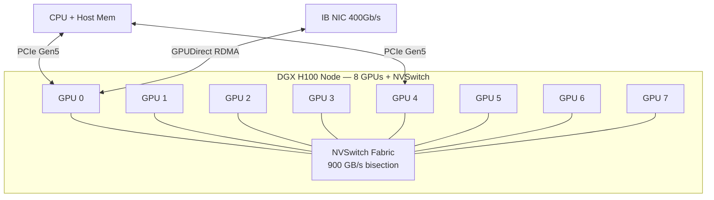
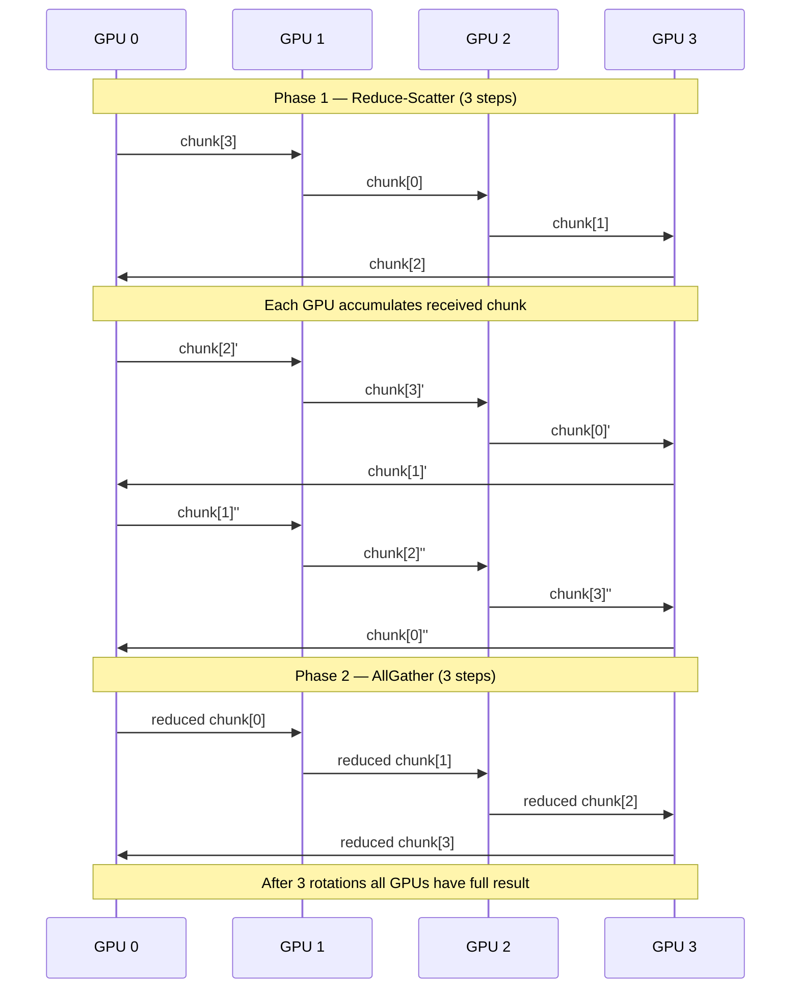
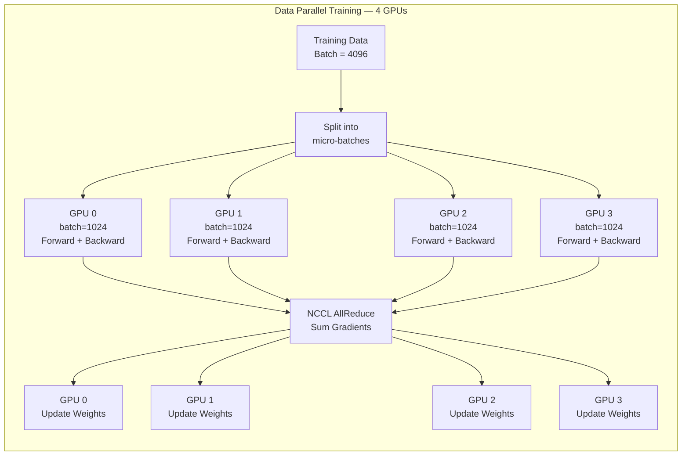

# Chapter 58 — Multi-GPU Programming

`#cuda` `#multigpu` `#nccl` `#scaling` `#nvlink` `#gpudirect` `#data-parallelism`

---

## 1. Theory — Multi-GPU Architecture and Programming Model

Modern AI workloads exceed a single GPU's memory and compute. Training a 70B-parameter LLM requires distributing work across 8, 64, or thousands of GPUs. Multi-GPU programming covers partitioning computation, managing device memory, orchestrating communication, and maximizing scaling efficiency.

### The Hardware Landscape

Each GPU has its own device memory (HBM), SM array, and PCIe/NVLink connections. The CUDA runtime treats each as an independent **device** (index 0, 1, 2, …). The programmer selects which device receives kernel launches and allocations via `cudaSetDevice()`.

### Memory Isolation and Peer Access

By default, GPU 0 cannot dereference a pointer in GPU 1's memory. **Peer-to-peer (P2P) access** breaks this: when two GPUs are connected via NVLink (or supported PCIe), the driver maps one GPU's memory into another's address space, enabling direct load/store without staging through host memory.

### Interconnect Hierarchy

The bandwidth between GPUs varies dramatically depending on the interconnect:

| Interconnect | Bandwidth (per dir) | Typical Use |
|---|---|---|
| PCIe Gen4 x16 | ~25 GB/s | Consumer workstations |
| PCIe Gen5 x16 | ~50 GB/s | Next-gen workstations |
| NVLink 3.0 (A100) | 600 GB/s total | Data center HGX A100 |
| NVLink 4.0 (H100) | 900 GB/s total | Data center HGX H100 |
| NVSwitch | 900 GB/s bisection | DGX H100 — full mesh |

### NVSwitch and DGX Topology

In an **NVIDIA DGX H100**, 8 H100 GPUs connect through **NVSwitch** — a crossbar giving every GPU a direct, full-bandwidth path to every other GPU (**full mesh**). Contrast with a **ring** topology (older NVLink without NVSwitch), where data hops through intermediate GPUs.

**GPUDirect RDMA** allows a network adapter (InfiniBand HCA or RoCE NIC) to read/write GPU memory directly, bypassing CPU and system memory. This is critical for multi-node clusters: GPU 0 on Node A sends a tensor directly to GPU 3 on Node B without any CPU-side memcpy.

### NCCL — The Collective Communication Library

**NCCL** (NVIDIA Collective Communications Library) provides optimized collective operations:
- **AllReduce** — every GPU contributes a buffer; result (e.g., sum) is placed on every GPU.
- **AllGather** — each GPU contributes a chunk; every GPU gets the full concatenation.
- **ReduceScatter** — reduce + scatter: each GPU gets a unique reduced chunk.
- **Broadcast** — one GPU sends its buffer to all others.

NCCL automatically selects the best algorithm (ring, tree, or direct) based on topology and message size.

#### Ring AllReduce Algorithm

With N GPUs in a logical ring, the algorithm has two phases:
1. **Reduce-Scatter** (N−1 steps): Each GPU sends a chunk to its neighbor and accumulates. After N−1 steps, each GPU holds the fully reduced version of one chunk.
2. **AllGather** (N−1 steps): Each GPU sends its reduced chunk around the ring. After N−1 steps, every GPU has the complete result.

Total data per GPU: **2 × (N−1)/N × DataSize** — scales with constant overhead per GPU.

---

## 2. What / Why / How

### What
Multi-GPU programming is the use of two or more GPUs within a single application, coordinating kernel execution, memory management, and inter-GPU communication to solve problems that exceed a single GPU's capacity or to accelerate time-to-solution.

### Why
- **Memory**: A single A100 has 80 GB HBM. A 175B-parameter model in FP16 needs ~350 GB just for parameters.
- **Compute**: Data-parallel training multiplies throughput linearly with GPU count (ideally).
- **Time**: Reducing training time from weeks to hours requires distributed computation.
- **Cost efficiency**: Cloud GPU-hours are expensive; faster training = lower cost.

### How
1. **Enumerate GPUs** with `cudaGetDeviceCount()`.
2. **Select device** with `cudaSetDevice(deviceId)`.
3. **Enable P2P** with `cudaDeviceEnablePeerAccess()` for direct GPU-GPU transfers.
4. **Allocate memory** on each GPU and partition your data.
5. **Launch kernels** on each GPU (using streams for concurrency).
6. **Synchronize** and **communicate** results using NCCL collectives or P2P memcpy.

---

## 3. Code Examples

### 3.1 — Multi-GPU Device Query and Selection

```cuda
#include <cstdio>
#include <cuda_runtime.h>

#define CUDA_CHECK(call)                                                       \
    do {                                                                       \
        cudaError_t err = call;                                                \
        if (err != cudaSuccess) {                                              \
            fprintf(stderr, "CUDA error at %s:%d — %s\n", __FILE__, __LINE__, \
                    cudaGetErrorString(err));                                   \
            exit(EXIT_FAILURE);                                                \
        }                                                                      \
    } while (0)

int main() {
    int deviceCount = 0;
    CUDA_CHECK(cudaGetDeviceCount(&deviceCount));
    printf("Found %d CUDA device(s):\n\n", deviceCount);

    for (int i = 0; i < deviceCount; i++) {
        cudaDeviceProp prop;
        CUDA_CHECK(cudaGetDeviceProperties(&prop, i));

        printf("Device %d: %s\n", i, prop.name);
        printf("  Compute capability : %d.%d\n", prop.major, prop.minor);
        printf("  Total global memory : %.2f GB\n",
               prop.totalGlobalMem / (1024.0 * 1024 * 1024));
        printf("  SM count            : %d\n", prop.multiProcessorCount);
        printf("  Memory bus width    : %d bits\n", prop.memoryBusWidth);
        printf("  Unified addressing  : %s\n",
               prop.unifiedAddressing ? "Yes" : "No");

        // Check P2P capability with all other devices
        for (int j = 0; j < deviceCount; j++) {
            if (i == j) continue;
            int canAccess = 0;
            CUDA_CHECK(cudaDeviceCanAccessPeer(&canAccess, i, j));
            printf("  P2P access %d -> %d  : %s\n", i, j,
                   canAccess ? "Yes" : "No");
        }
        printf("\n");
    }

    // Select a specific device for subsequent operations
    if (deviceCount > 1) {
        CUDA_CHECK(cudaSetDevice(1));
        printf("Active device set to 1.\n");
    }

    return 0;
}
```

### 3.2 — Peer-to-Peer Memory Access and Transfer

```cuda
#include <cstdio>
#include <cstdlib>
#include <cuda_runtime.h>

#define CUDA_CHECK(call)                                                       \
    do {                                                                       \
        cudaError_t err = call;                                                \
        if (err != cudaSuccess) {                                              \
            fprintf(stderr, "CUDA error at %s:%d — %s\n", __FILE__, __LINE__, \
                    cudaGetErrorString(err));                                   \
            exit(EXIT_FAILURE);                                                \
        }                                                                      \
    } while (0)

__global__ void addFromPeer(float *dst, const float *src, int n) {
    int idx = blockIdx.x * blockDim.x + threadIdx.x;
    if (idx < n) {
        dst[idx] += src[idx]; // src lives on a different GPU (P2P mapped)
    }
}

int main() {
    int devCount = 0;
    CUDA_CHECK(cudaGetDeviceCount(&devCount));
    if (devCount < 2) {
        printf("Need at least 2 GPUs for P2P demo.\n");
        return 0;
    }

    const int N = 1 << 20; // 1M elements
    const size_t bytes = N * sizeof(float);

    // Enable P2P access: GPU 0 <-> GPU 1
    int canAccess01 = 0, canAccess10 = 0;
    CUDA_CHECK(cudaDeviceCanAccessPeer(&canAccess01, 0, 1));
    CUDA_CHECK(cudaDeviceCanAccessPeer(&canAccess10, 1, 0));

    if (!canAccess01 || !canAccess10) {
        printf("P2P access not supported between GPU 0 and GPU 1.\n");
        return 0;
    }

    CUDA_CHECK(cudaSetDevice(0));
    CUDA_CHECK(cudaDeviceEnablePeerAccess(1, 0));
    CUDA_CHECK(cudaSetDevice(1));
    CUDA_CHECK(cudaDeviceEnablePeerAccess(0, 0));

    // Allocate on GPU 0
    float *d_A;
    CUDA_CHECK(cudaSetDevice(0));
    CUDA_CHECK(cudaMalloc(&d_A, bytes));

    // Allocate on GPU 1
    float *d_B;
    CUDA_CHECK(cudaSetDevice(1));
    CUDA_CHECK(cudaMalloc(&d_B, bytes));

    // Initialize d_A on GPU 0 from host
    float *h_data = (float *)malloc(bytes);
    for (int i = 0; i < N; i++) h_data[i] = 1.0f;

    CUDA_CHECK(cudaSetDevice(0));
    CUDA_CHECK(cudaMemcpy(d_A, h_data, bytes, cudaMemcpyHostToDevice));

    // P2P memcpy: GPU 0 -> GPU 1 (direct, no host staging)
    CUDA_CHECK(cudaMemcpyPeer(d_B, 1, d_A, 0, bytes));

    // Launch kernel on GPU 1, reading d_A via P2P (direct access)
    CUDA_CHECK(cudaSetDevice(1));
    int threads = 256;
    int blocks = (N + threads - 1) / threads;
    addFromPeer<<<blocks, threads>>>(d_B, d_A, N);
    CUDA_CHECK(cudaDeviceSynchronize());

    // Verify: d_B should be 2.0 everywhere (1.0 copied + 1.0 from P2P add)
    CUDA_CHECK(cudaMemcpy(h_data, d_B, bytes, cudaMemcpyDeviceToHost));
    bool pass = true;
    for (int i = 0; i < N; i++) {
        if (h_data[i] != 2.0f) { pass = false; break; }
    }
    printf("P2P test: %s\n", pass ? "PASSED" : "FAILED");

    // Cleanup
    CUDA_CHECK(cudaSetDevice(0));
    CUDA_CHECK(cudaFree(d_A));
    CUDA_CHECK(cudaSetDevice(1));
    CUDA_CHECK(cudaFree(d_B));
    free(h_data);
    return 0;
}
```

### 3.3 — NCCL AllReduce Example

```cuda
#include <cstdio>
#include <cstdlib>
#include <cuda_runtime.h>
#include <nccl.h>

#define CUDA_CHECK(call)                                                       \
    do {                                                                       \
        cudaError_t err = call;                                                \
        if (err != cudaSuccess) {                                              \
            fprintf(stderr, "CUDA error at %s:%d — %s\n", __FILE__, __LINE__, \
                    cudaGetErrorString(err));                                   \
            exit(EXIT_FAILURE);                                                \
        }                                                                      \
    } while (0)

#define NCCL_CHECK(call)                                                       \
    do {                                                                       \
        ncclResult_t res = call;                                               \
        if (res != ncclSuccess) {                                              \
            fprintf(stderr, "NCCL error at %s:%d — %s\n", __FILE__, __LINE__, \
                    ncclGetErrorString(res));                                   \
            exit(EXIT_FAILURE);                                                \
        }                                                                      \
    } while (0)

int main() {
    int nGPUs = 0;
    CUDA_CHECK(cudaGetDeviceCount(&nGPUs));
    if (nGPUs < 2) {
        printf("Need >= 2 GPUs for NCCL demo.\n");
        return 0;
    }

    const int N = 1 << 16; // 64K elements per GPU
    const size_t bytes = N * sizeof(float);

    // Allocate per-GPU resources
    float **d_send = (float **)malloc(nGPUs * sizeof(float *));
    float **d_recv = (float **)malloc(nGPUs * sizeof(float *));
    cudaStream_t *streams = (cudaStream_t *)malloc(nGPUs * sizeof(cudaStream_t));
    ncclComm_t *comms = (ncclComm_t *)malloc(nGPUs * sizeof(ncclComm_t));
    int *devList = (int *)malloc(nGPUs * sizeof(int));

    for (int i = 0; i < nGPUs; i++) {
        devList[i] = i;
        CUDA_CHECK(cudaSetDevice(i));
        CUDA_CHECK(cudaMalloc(&d_send[i], bytes));
        CUDA_CHECK(cudaMalloc(&d_recv[i], bytes));
        CUDA_CHECK(cudaStreamCreate(&streams[i]));

        // Each GPU's send buffer = [i+1, i+1, ...] so sum = nGPUs*(nGPUs+1)/2
        float val = (float)(i + 1);
        float *h_tmp = (float *)malloc(bytes);
        for (int j = 0; j < N; j++) h_tmp[j] = val;
        CUDA_CHECK(cudaMemcpy(d_send[i], h_tmp, bytes, cudaMemcpyHostToDevice));
        free(h_tmp);
    }

    // Initialize NCCL communicators
    NCCL_CHECK(ncclCommInitAll(comms, nGPUs, devList));

    // Perform AllReduce (sum) across all GPUs
    NCCL_CHECK(ncclGroupStart());
    for (int i = 0; i < nGPUs; i++) {
        CUDA_CHECK(cudaSetDevice(i));
        NCCL_CHECK(ncclAllReduce(d_send[i], d_recv[i], N, ncclFloat,
                                  ncclSum, comms[i], streams[i]));
    }
    NCCL_CHECK(ncclGroupEnd());

    // Synchronize all streams
    for (int i = 0; i < nGPUs; i++) {
        CUDA_CHECK(cudaSetDevice(i));
        CUDA_CHECK(cudaStreamSynchronize(streams[i]));
    }

    // Verify: expected value = 1 + 2 + ... + nGPUs
    float expected = (float)(nGPUs * (nGPUs + 1)) / 2.0f;
    for (int i = 0; i < nGPUs; i++) {
        CUDA_CHECK(cudaSetDevice(i));
        float h_val;
        CUDA_CHECK(cudaMemcpy(&h_val, d_recv[i], sizeof(float),
                               cudaMemcpyDeviceToHost));
        printf("GPU %d: AllReduce result[0] = %.1f (expected %.1f) — %s\n",
               i, h_val, expected,
               (h_val == expected) ? "PASS" : "FAIL");
    }

    // Cleanup
    for (int i = 0; i < nGPUs; i++) {
        CUDA_CHECK(cudaSetDevice(i));
        CUDA_CHECK(cudaFree(d_send[i]));
        CUDA_CHECK(cudaFree(d_recv[i]));
        CUDA_CHECK(cudaStreamDestroy(streams[i]));
        NCCL_CHECK(ncclCommDestroy(comms[i]));
    }
    free(d_send); free(d_recv); free(streams); free(comms); free(devList);
    return 0;
}
// Compile: nvcc -o nccl_allreduce nccl_allreduce.cu -lnccl
```

### 3.4 — Multi-GPU Vector Addition with Data Splitting

```cuda
#include <cstdio>
#include <cstdlib>
#include <cuda_runtime.h>

#define CUDA_CHECK(call)                                                       \
    do {                                                                       \
        cudaError_t err = call;                                                \
        if (err != cudaSuccess) {                                              \
            fprintf(stderr, "CUDA error at %s:%d — %s\n", __FILE__, __LINE__, \
                    cudaGetErrorString(err));                                   \
            exit(EXIT_FAILURE);                                                \
        }                                                                      \
    } while (0)

__global__ void vecAdd(const float *A, const float *B, float *C, int n) {
    int idx = blockIdx.x * blockDim.x + threadIdx.x;
    if (idx < n) C[idx] = A[idx] + B[idx];
}

int main() {
    int nGPUs = 0;
    CUDA_CHECK(cudaGetDeviceCount(&nGPUs));
    if (nGPUs < 1) { printf("No GPU found.\n"); return 1; }
    printf("Using %d GPU(s) for vector addition.\n", nGPUs);

    const int N = 1 << 24; // 16M elements total
    const size_t totalBytes = N * sizeof(float);

    // Host allocation (pinned for async transfers)
    float *h_A, *h_B, *h_C;
    CUDA_CHECK(cudaMallocHost(&h_A, totalBytes));
    CUDA_CHECK(cudaMallocHost(&h_B, totalBytes));
    CUDA_CHECK(cudaMallocHost(&h_C, totalBytes));

    for (int i = 0; i < N; i++) {
        h_A[i] = (float)i;
        h_B[i] = (float)(2 * i);
    }

    // Split work across GPUs
    int chunkSize = (N + nGPUs - 1) / nGPUs;
    float **d_A = (float **)malloc(nGPUs * sizeof(float *));
    float **d_B = (float **)malloc(nGPUs * sizeof(float *));
    float **d_C = (float **)malloc(nGPUs * sizeof(float *));
    cudaStream_t *streams = (cudaStream_t *)malloc(nGPUs * sizeof(cudaStream_t));

    // Allocate + copy to each GPU (async, overlapped)
    for (int g = 0; g < nGPUs; g++) {
        CUDA_CHECK(cudaSetDevice(g));
        int offset = g * chunkSize;
        int thisN = (offset + chunkSize > N) ? (N - offset) : chunkSize;
        size_t thisBytes = thisN * sizeof(float);

        CUDA_CHECK(cudaMalloc(&d_A[g], thisBytes));
        CUDA_CHECK(cudaMalloc(&d_B[g], thisBytes));
        CUDA_CHECK(cudaMalloc(&d_C[g], thisBytes));
        CUDA_CHECK(cudaStreamCreate(&streams[g]));

        CUDA_CHECK(cudaMemcpyAsync(d_A[g], h_A + offset, thisBytes,
                                    cudaMemcpyHostToDevice, streams[g]));
        CUDA_CHECK(cudaMemcpyAsync(d_B[g], h_B + offset, thisBytes,
                                    cudaMemcpyHostToDevice, streams[g]));
    }

    // Launch kernels on each GPU
    for (int g = 0; g < nGPUs; g++) {
        CUDA_CHECK(cudaSetDevice(g));
        int offset = g * chunkSize;
        int thisN = (offset + chunkSize > N) ? (N - offset) : chunkSize;

        int threads = 256;
        int blocks = (thisN + threads - 1) / threads;
        vecAdd<<<blocks, threads, 0, streams[g]>>>(d_A[g], d_B[g], d_C[g], thisN);
    }

    // Copy results back (async)
    for (int g = 0; g < nGPUs; g++) {
        CUDA_CHECK(cudaSetDevice(g));
        int offset = g * chunkSize;
        int thisN = (offset + chunkSize > N) ? (N - offset) : chunkSize;
        size_t thisBytes = thisN * sizeof(float);

        CUDA_CHECK(cudaMemcpyAsync(h_C + offset, d_C[g], thisBytes,
                                    cudaMemcpyDeviceToHost, streams[g]));
    }

    // Synchronize all GPUs
    for (int g = 0; g < nGPUs; g++) {
        CUDA_CHECK(cudaSetDevice(g));
        CUDA_CHECK(cudaStreamSynchronize(streams[g]));
    }

    // Verify
    bool pass = true;
    for (int i = 0; i < N; i++) {
        float expected = (float)(3 * i);
        if (h_C[i] != expected) { pass = false; break; }
    }
    printf("Multi-GPU vector add: %s\n", pass ? "PASSED" : "FAILED");

    // Cleanup
    for (int g = 0; g < nGPUs; g++) {
        CUDA_CHECK(cudaSetDevice(g));
        CUDA_CHECK(cudaFree(d_A[g])); CUDA_CHECK(cudaFree(d_B[g]));
        CUDA_CHECK(cudaFree(d_C[g])); CUDA_CHECK(cudaStreamDestroy(streams[g]));
    }
    CUDA_CHECK(cudaFreeHost(h_A)); CUDA_CHECK(cudaFreeHost(h_B));
    CUDA_CHECK(cudaFreeHost(h_C));
    free(d_A); free(d_B); free(d_C); free(streams);
    return 0;
}
```

---

## 4. Mermaid Diagrams

### 4.1 — DGX-Style Multi-GPU Topology (NVSwitch Full Mesh)



### 4.2 — Ring AllReduce Algorithm (4 GPUs)



### 4.3 — Data-Parallel Training Flow



---

## 5. Exercises

### 🟢 Exercise 1 — GPU Inventory
Write a program that prints the name, memory, and compute capability of all GPUs in the system. For each pair, check and print whether P2P access is supported.

### 🟡 Exercise 2 — P2P Bandwidth Benchmark
Measure the unidirectional P2P bandwidth between GPU 0 and GPU 1 using `cudaMemcpyPeer`. Transfer increasing buffer sizes (1 MB → 256 MB) and print bandwidth in GB/s. Compare with `cudaMemcpy` that stages through host memory.

### 🟡 Exercise 3 — Multi-GPU Matrix Fill
Allocate a large matrix (e.g., 8192×8192 floats). Split rows across available GPUs. Each GPU fills its portion with the row index value. Gather results back to host and verify.

### 🔴 Exercise 4 — NCCL Broadcast + Compute
Use NCCL to broadcast a weight vector from GPU 0 to all GPUs. Each GPU then multiplies its local data chunk by the weights. Gather the results on GPU 0 and verify correctness.

### 🔴 Exercise 5 — Scaling Efficiency Measurement
Implement a compute-heavy kernel (e.g., large vector dot product). Run it on 1, 2, and 4 GPUs. Compute strong scaling efficiency: `E = T1 / (N × TN)`. Report where efficiency drops.

---

## 6. Solutions

### Solution 1
See Code Example 3.1 — it enumerates all devices and checks P2P between all pairs.

### Solution 2 — P2P Bandwidth Benchmark (Core Loop)
```cuda
// After enabling P2P and allocating d_src on GPU 0, d_dst on GPU 1:
for (size_t size = 1 << 20; size <= (1 << 28); size <<= 1) {
    cudaEvent_t start, stop;
    cudaEventCreate(&start); cudaEventCreate(&stop);
    cudaSetDevice(0);
    cudaEventRecord(start);
    for (int r = 0; r < REPEATS; r++)
        cudaMemcpyPeer(d_dst, 1, d_src, 0, size);
    cudaEventRecord(stop);
    cudaEventSynchronize(stop);
    float ms; cudaEventElapsedTime(&ms, start, stop);
    printf("%8zu MB  %.2f GB/s\n", size>>20, (double)size*REPEATS/(ms*1e-3)/1e9);
}
```

### Solution 3
Split rows: GPU `g` handles rows `[g*rowsPerGPU .. (g+1)*rowsPerGPU)`. Kernel assigns `data[idx] = (float)(startRow + idx / cols)`.

### Solution 4
Use `ncclBroadcast(weights, weights, N, ncclFloat, 0, comms[i], streams[i])` inside a group, then launch a pointwise multiply kernel on each GPU.

### Solution 5
Run kernel on 1 GPU → T1. Split across N GPUs → TN. Efficiency = T1 / (N × TN). Expect ~90%+ for compute-bound kernels.

---

## 7. Quiz

**Q1.** What does `cudaSetDevice(2)` do?
- (A) Creates a new GPU
- (B) Sets the active GPU for subsequent CUDA calls to device 2 ✅
- (C) Enables P2P access to device 2
- (D) Copies memory to device 2

**Q2.** Which function enables direct memory access between two GPUs?
- (A) `cudaMemcpyPeer` — this copies, doesn't enable access
- (B) `cudaDeviceEnablePeerAccess` ✅
- (C) `cudaSetDevice`
- (D) `cudaMallocManaged`

**Q3.** In Ring AllReduce with N GPUs, how much data does each GPU send total?
- (A) DataSize
- (B) 2 × DataSize
- (C) 2 × (N−1)/N × DataSize ✅
- (D) N × DataSize

**Q4.** What does GPUDirect RDMA allow?
- (A) GPU-to-GPU memory copy within a node
- (B) A network adapter to read/write GPU memory directly, bypassing CPU ✅
- (C) Unified memory addressing
- (D) Zero-copy host memory access

**Q5.** Which NCCL collective gives every GPU the sum of all buffers?
- (A) Broadcast
- (B) AllGather
- (C) AllReduce ✅
- (D) ReduceScatter

**Q6.** NVSwitch provides which topology?
- (A) Ring
- (B) Tree
- (C) Full mesh / crossbar ✅
- (D) Star with CPU as hub

**Q7.** In data-parallel training, what is communicated after each backward pass?
- (A) Input data
- (B) Activations
- (C) Gradients ✅
- (D) Model weights

**Q8.** What is strong scaling efficiency?
- (A) Speedup when increasing data size proportionally with GPU count
- (B) T1 / (N × TN) for fixed problem size ✅
- (C) GPU utilization percentage
- (D) Memory bandwidth efficiency

---

## 8. Key Takeaways

- **`cudaSetDevice()`** is the gateway — all subsequent allocations and launches go to the active device.
- **P2P access** eliminates host-staging overhead; NVLink P2P is 5–12× faster than PCIe round-trips.
- **NVSwitch** turns an 8-GPU node into a fully connected mesh — no hop penalties, full bisection bandwidth.
- **GPUDirect RDMA** extends P2P to the network fabric — essential for multi-node scaling.
- **NCCL** abstracts topology-aware collective communication — always prefer it over manual P2P rings.
- **Ring AllReduce** transfers `2(N−1)/N × DataSize` per GPU — bandwidth cost is nearly constant regardless of GPU count.
- **Data parallelism** is the simplest multi-GPU pattern: replicate model, split data, AllReduce gradients.
- **Strong scaling** measures speedup for fixed problem size; **weak scaling** keeps per-GPU work constant — both matter.
- **Amdahl's Law** applies: if 5% of your pipeline is serial (data loading, CPU preprocessing), max speedup is 20× regardless of GPU count.
- **Pinned (page-locked) host memory** is required for overlapping transfers with compute across GPUs.

## 9. Chapter Summary

Multi-GPU programming transforms a single-GPU CUDA application into a distributed system. The programmer manages device selection (`cudaSetDevice`), enables peer-to-peer access for direct GPU-to-GPU communication, partitions data across devices, and synchronizes results. NVLink and NVSwitch provide high-bandwidth interconnects, while GPUDirect RDMA extends this to multi-node clusters. NCCL's Ring AllReduce ensures gradient synchronization scales efficiently — sending only `2(N-1)/N` of the data per GPU regardless of participant count. In practice, data-parallel training on 8 GPUs achieves 90–95% linear scaling on large models, but Amdahl's Law reminds us that serial bottlenecks cap achievable speedup. Mastering multi-GPU programming is essential for large-scale AI/ML systems.

## 10. Real-World Insight — AI/ML Applications

**Large Language Model Training**: GPT-4, Llama 3, and Gemini are trained on thousands of GPUs using data parallelism (FSDP/ZeRO) combined with tensor and pipeline parallelism. NCCL AllReduce synchronizes gradients every training step. On a DGX H100 with NVSwitch, AllReduce of 1 GB completes in ~1.2 ms across 8 GPUs.

**Inference Serving**: Large models use tensor parallelism — each attention head or MLP shard runs on a different GPU, with AllReduce combining partial results. NVLink bandwidth directly determines max tokens-per-second.

**Recommendation Systems**: Meta processes trillion-parameter embedding tables across GPUs using model parallelism with AllGather for distributed embedding lookups.

**Scaling Numbers**: A single H100 delivers ~990 TFLOPS (FP16). An 8-GPU DGX H100 node: ~7.9 PFLOPS. A 256-GPU cluster can sustain ~200+ PFLOPS when communication is properly overlapped with computation.

---

## 11. Common Mistakes

1. **Forgetting `cudaSetDevice` before allocations** — memory ends up on the wrong GPU, causing silent errors or crashes.
2. **Not enabling P2P before cross-GPU kernel access** — reading another GPU's pointer without `cudaDeviceEnablePeerAccess` causes a segfault.
3. **Using `cudaMemcpy` instead of `cudaMemcpyPeer`** — standard memcpy between device pointers on different GPUs silently routes through host, halving bandwidth.
4. **Blocking synchronization between GPUs** — calling `cudaDeviceSynchronize()` sequentially serializes the pipeline. Use per-GPU streams.
5. **Ignoring NUMA topology** — a GPU on a different NUMA node than its managing CPU thread gets suboptimal PCIe throughput.
6. **Small AllReduce messages** — NCCL has ~5 μs startup latency. Fuse gradients into large AllReduce calls (bucket fusion).
7. **Not using pinned memory** — pageable memory prevents `cudaMemcpyAsync` from working, eliminating transfer-compute overlap.
8. **Assuming P2P always uses NVLink** — on PCIe-only systems, P2P goes over PCIe. Always benchmark.
9. **Not overlapping communication with computation** — launch the next forward pass while AllReduce finishes on current gradients.
10. **Ignoring Amdahl's Law** — if data loading feeds only 2 GPUs, adding 6 more won't help.

---

## 12. Interview Questions

### Q1: How does `cudaSetDevice` work, and what happens if you allocate memory without calling it?

**Answer**: `cudaSetDevice(id)` makes GPU `id` the active device for the calling host thread. All subsequent `cudaMalloc`, kernel launches, and stream operations target that device. If you never call it, the default is device 0. A common bug is forgetting to switch devices before allocating, causing memory to land on GPU 0 while kernels on GPU 1 try to access it — resulting in illegal memory access errors.

### Q2: Explain Ring AllReduce and why it scales well.

**Answer**: Ring AllReduce arranges N GPUs in a logical ring with two phases: Reduce-Scatter (N−1 steps where chunks accumulate) and AllGather (N−1 steps to distribute reduced chunks). Each GPU sends `2(N−1)/N × DataSize` total — bandwidth cost is nearly constant per GPU regardless of N. The limitation is latency: `2(N−1)` sequential steps hurts small messages. NCCL switches to tree algorithms (O(log N) latency) for small buffers.

### Q3: What is the difference between GPUDirect P2P and GPUDirect RDMA?

**Answer**: **GPUDirect P2P** enables direct memory access between two GPUs **within the same node** over NVLink or PCIe. **GPUDirect RDMA** extends this to the **network** — a network adapter (InfiniBand HCA) directly accesses GPU memory for inter-node transfers, bypassing both CPU and host memory. P2P solves intra-node communication; RDMA solves inter-node communication. Together they enable multi-node GPU clusters.

### Q4: Why do we AllReduce gradients rather than weights in data-parallel training?

**Answer**: Each GPU has locally computed gradients after the backward pass. We AllReduce (sum) gradients because: (1) the sum of gradients from independent mini-batches equals the gradient of the combined batch (linearity of differentiation), (2) after AllReduce, each GPU applies the identical optimizer step to identical averaged gradients, keeping all replicas synchronized without explicitly synchronizing weights.

### Q5: How does NVSwitch differ from NVLink for AllReduce performance?

**Answer**: **NVLink** is point-to-point — some GPU pairs require intermediate hops in a ring topology. **NVSwitch** is a crossbar providing full bisection bandwidth — every GPU communicates directly with every other at full link speed simultaneously. For AllReduce, NVSwitch enables one-step direct algorithms rather than multi-hop rings, reducing communication overhead from ~5% to ~2% of training step time for large models.
