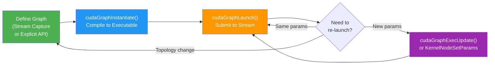

# Chapter 59: CUDA Graphs — Launch Optimization

**Tags:** `#CUDA` `#Graphs` `#LaunchOverhead` `#StreamCapture` `#Performance` `#Advanced`

---

## 1. Theory & Motivation

### The CPU Launch Overhead Problem

Every CUDA kernel launch involves a CPU-side cost: argument marshaling, driver validation, and command submission to the GPU. This overhead is typically **5–10 µs per launch** — negligible for large kernels running milliseconds, but devastating for workloads composed of many small kernels.

Consider a deep learning inference pipeline with 200 layers, each launching 3–5 kernels. That's 600–1000 launches per forward pass. At 7 µs each, CPU launch overhead alone consumes **4.2–7 ms** — potentially exceeding total GPU compute time for small models.

### What Are CUDA Graphs?

A CUDA Graph is a **directed acyclic graph (DAG)** of GPU operations captured once and replayed many times with minimal CPU overhead. Instead of the CPU issuing each operation individually, it submits the entire graph in a **single launch** (~15–20 µs total, regardless of graph size).

### Why CUDA Graphs Matter

| Metric | Traditional Streams | CUDA Graphs |
|--------|-------------------|-------------|
| CPU overhead per kernel | 5–10 µs | ~0 µs (amortized) |
| CPU overhead per graph | N/A | 15–20 µs total |
| 100-kernel chain | 500–1000 µs CPU | 15–20 µs CPU |
| Speedup factor | 1× | 25–66× CPU overhead reduction |
| GPU scheduling | Just-in-time | Pre-optimized |

### How CUDA Graphs Work

CUDA Graphs operate in three phases:

1. **Definition** — Build the graph structure (nodes = operations, edges = dependencies)
2. **Instantiation** — Compile the graph into an executable form (`cudaGraphExec_t`)
3. **Launch** — Submit the executable graph to a stream with a single API call

The graph can be launched repeatedly without re-instantiation. Parameters can be updated in-place without rebuilding the graph topology.

---

## 2. Graph Construction Methods

### Method 1: Stream Capture

The simplest approach — record existing stream-based code into a graph:

```cpp
#include <cuda_runtime.h>
#include <cstdio>

__global__ void scaleKernel(float* data, float factor, int n) {
    int idx = blockIdx.x * blockDim.x + threadIdx.x;
    if (idx < n) data[idx] *= factor;
}

__global__ void biasKernel(float* data, float bias, int n) {
    int idx = blockIdx.x * blockDim.x + threadIdx.x;
    if (idx < n) data[idx] += bias;
}

__global__ void reluKernel(float* data, int n) {
    int idx = blockIdx.x * blockDim.x + threadIdx.x;
    if (idx < n) data[idx] = fmaxf(data[idx], 0.0f);
}

void runWithStreamCapture(float* d_data, int n, int iterations) {
    cudaStream_t stream;
    cudaStreamCreate(&stream);

    cudaGraph_t graph;
    cudaGraphExec_t graphExec;

    // Phase 1: Capture the operation sequence
    cudaStreamBeginCapture(stream, cudaStreamCaptureModeGlobal);

    int threads = 256;
    int blocks = (n + threads - 1) / threads;

    scaleKernel<<<blocks, threads, 0, stream>>>(d_data, 2.0f, n);
    biasKernel<<<blocks, threads, 0, stream>>>(d_data, 1.0f, n);
    reluKernel<<<blocks, threads, 0, stream>>>(d_data, n);

    cudaStreamEndCapture(stream, &graph);

    // Phase 2: Instantiate (compile the graph)
    cudaGraphInstantiate(&graphExec, graph, nullptr, nullptr, 0);

    // Phase 3: Launch repeatedly
    for (int i = 0; i < iterations; i++) {
        cudaGraphLaunch(graphExec, stream);
    }
    cudaStreamSynchronize(stream);

    // Cleanup
    cudaGraphExecDestroy(graphExec);
    cudaGraphDestroy(graph);
    cudaStreamDestroy(stream);
}

int main() {
    const int N = 1 << 20;
    float* d_data;
    cudaMalloc(&d_data, N * sizeof(float));
    cudaMemset(d_data, 0, N * sizeof(float));

    runWithStreamCapture(d_data, N, 1000);

    cudaFree(d_data);
    printf("Stream capture graph completed successfully.\n");
    return 0;
}
```

### Method 2: Explicit Graph Construction

For fine-grained control over the DAG structure:

```cpp
#include <cuda_runtime.h>
#include <cstdio>
#include <vector>

__global__ void processA(float* out, const float* in, int n) {
    int idx = blockIdx.x * blockDim.x + threadIdx.x;
    if (idx < n) out[idx] = in[idx] * 2.0f;
}

__global__ void processB(float* out, const float* in, int n) {
    int idx = blockIdx.x * blockDim.x + threadIdx.x;
    if (idx < n) out[idx] = in[idx] + 1.0f;
}

__global__ void mergeResults(float* out, const float* a, const float* b, int n) {
    int idx = blockIdx.x * blockDim.x + threadIdx.x;
    if (idx < n) out[idx] = a[idx] + b[idx];
}

void buildExplicitGraph(float* d_in, float* d_a, float* d_b, float* d_out, int n) {
    cudaGraph_t graph;
    cudaGraphCreate(&graph, 0);

    int threads = 256;
    int blocks = (n + threads - 1) / threads;

    // --- Node A: processA (depends on nothing) ---
    cudaKernelNodeParams paramsA = {};
    void* argsA[] = { &d_a, &d_in, &n };
    paramsA.func = (void*)processA;
    paramsA.gridDim = dim3(blocks);
    paramsA.blockDim = dim3(threads);
    paramsA.kernelParams = argsA;
    paramsA.sharedMemBytes = 0;

    cudaGraphNode_t nodeA;
    cudaGraphAddKernelNode(&nodeA, graph, nullptr, 0, &paramsA);

    // --- Node B: processB (depends on nothing — parallel with A) ---
    cudaKernelNodeParams paramsB = {};
    void* argsB[] = { &d_b, &d_in, &n };
    paramsB.func = (void*)processB;
    paramsB.gridDim = dim3(blocks);
    paramsB.blockDim = dim3(threads);
    paramsB.kernelParams = argsB;
    paramsB.sharedMemBytes = 0;

    cudaGraphNode_t nodeB;
    cudaGraphAddKernelNode(&nodeB, graph, nullptr, 0, &paramsB);

    // --- Node C: mergeResults (depends on A AND B) ---
    cudaKernelNodeParams paramsC = {};
    void* argsC[] = { &d_out, &d_a, &d_b, &n };
    paramsC.func = (void*)mergeResults;
    paramsC.gridDim = dim3(blocks);
    paramsC.blockDim = dim3(threads);
    paramsC.kernelParams = argsC;
    paramsC.sharedMemBytes = 0;

    cudaGraphNode_t deps[] = { nodeA, nodeB };
    cudaGraphNode_t nodeC;
    cudaGraphAddKernelNode(&nodeC, graph, deps, 2, &paramsC);

    // Instantiate and launch
    cudaGraphExec_t graphExec;
    cudaGraphInstantiate(&graphExec, graph, nullptr, nullptr, 0);

    cudaStream_t stream;
    cudaStreamCreate(&stream);

    for (int i = 0; i < 500; i++) {
        cudaGraphLaunch(graphExec, stream);
    }
    cudaStreamSynchronize(stream);

    cudaGraphExecDestroy(graphExec);
    cudaGraphDestroy(graph);
    cudaStreamDestroy(stream);
}

int main() {
    const int N = 1 << 18;
    float *d_in, *d_a, *d_b, *d_out;
    cudaMalloc(&d_in, N * sizeof(float));
    cudaMalloc(&d_a, N * sizeof(float));
    cudaMalloc(&d_b, N * sizeof(float));
    cudaMalloc(&d_out, N * sizeof(float));

    buildExplicitGraph(d_in, d_a, d_b, d_out, N);

    cudaFree(d_in); cudaFree(d_a);
    cudaFree(d_b); cudaFree(d_out);
    printf("Explicit graph construction completed.\n");
    return 0;
}
```

---

## 3. Graph Update (Parameter Modification)

Updating kernel parameters without rebuilding the graph:

```cpp
#include <cuda_runtime.h>
#include <cstdio>

__global__ void scaleKernel(float* data, float factor, int n) {
    int idx = blockIdx.x * blockDim.x + threadIdx.x;
    if (idx < n) data[idx] *= factor;
}

void demonstrateGraphUpdate(float* d_data, int n) {
    cudaStream_t stream;
    cudaStreamCreate(&stream);

    cudaGraph_t graph;
    cudaGraphExec_t graphExec;
    int threads = 256, blocks = (n + threads - 1) / threads;

    // Capture initial graph
    cudaStreamBeginCapture(stream, cudaStreamCaptureModeGlobal);
    float factor = 1.5f;
    scaleKernel<<<blocks, threads, 0, stream>>>(d_data, factor, n);
    cudaStreamEndCapture(stream, &graph);
    cudaGraphInstantiate(&graphExec, graph, nullptr, nullptr, 0);

    // Launch with original parameters
    cudaGraphLaunch(graphExec, stream);
    cudaStreamSynchronize(stream);

    // Update: change factor without rebuilding graph
    cudaGraphNode_t* nodes = nullptr;
    size_t numNodes = 0;
    cudaGraphGetNodes(graph, nullptr, &numNodes);
    nodes = new cudaGraphNode_t[numNodes];
    cudaGraphGetNodes(graph, nodes, &numNodes);

    for (size_t i = 0; i < numNodes; i++) {
        cudaGraphNodeType type;
        cudaGraphNodeGetType(nodes[i], &type);

        if (type == cudaGraphNodeTypeKernel) {
            cudaKernelNodeParams params;
            cudaGraphKernelNodeGetParams(nodes[i], &params);

            // Modify the factor argument
            float newFactor = 3.0f;
            params.kernelParams[1] = &newFactor;

            cudaGraphExecKernelNodeSetParams(graphExec, nodes[i], &params);
        }
    }

    // Re-launch with updated parameters — no re-instantiation needed
    cudaGraphLaunch(graphExec, stream);
    cudaStreamSynchronize(stream);

    delete[] nodes;
    cudaGraphExecDestroy(graphExec);
    cudaGraphDestroy(graph);
    cudaStreamDestroy(stream);
}
```

---

## 4. Mermaid Diagrams

### Diagram 1: CUDA Graph DAG Structure

```mermaid
graph TD
    subgraph "CUDA Graph — Inference Pipeline"
        H2D["MemcpyH2D<br/>Input Data"] --> CONV1["Conv2D Kernel"]
        CONV1 --> BN1["BatchNorm Kernel"]
        BN1 --> RELU1["ReLU Kernel"]
        RELU1 --> CONV2["Conv2D Kernel"]
        CONV2 --> BN2["BatchNorm Kernel"]
        BN2 --> RELU2["ReLU Kernel"]
        RELU2 --> POOL["MaxPool Kernel"]
        POOL --> FC["FullyConnected Kernel"]
        FC --> SOFT["Softmax Kernel"]
        SOFT --> D2H["MemcpyD2H<br/>Output"]
    end

    style H2D fill:#4CAF50,color:#fff
    style D2H fill:#4CAF50,color:#fff
    style CONV1 fill:#2196F3,color:#fff
    style CONV2 fill:#2196F3,color:#fff
    style BN1 fill:#FF9800,color:#fff
    style BN2 fill:#FF9800,color:#fff
    style RELU1 fill:#f44336,color:#fff
    style RELU2 fill:#f44336,color:#fff
    style POOL fill:#9C27B0,color:#fff
    style FC fill:#2196F3,color:#fff
    style SOFT fill:#FF9800,color:#fff
```



### Diagram 2: Launch Overhead — Streams vs Graphs

```mermaid
gantt
    title CPU Launch Overhead Comparison (10 Kernels)
    dateFormat X
    axisFormat %s µs

    section Traditional Stream
    Launch K1 (7µs)  :a1, 0, 7
    Launch K2 (7µs)  :a2, 7, 14
    Launch K3 (7µs)  :a3, 14, 21
    Launch K4 (7µs)  :a4, 21, 28
    Launch K5 (7µs)  :a5, 28, 35
    Launch K6 (7µs)  :a6, 35, 42
    Launch K7 (7µs)  :a7, 42, 49
    Launch K8 (7µs)  :a8, 49, 56
    Launch K9 (7µs)  :a9, 56, 63
    Launch K10 (7µs) :a10, 63, 70

    section CUDA Graph
    Graph Launch ALL (18µs) :b1, 0, 18
    CPU Free           :done, b2, 18, 70
```



### Diagram 3: Graph Lifecycle



---

## 5. When to Use Graphs vs. Streams

| Criterion | Use CUDA Graphs | Use Traditional Streams |
|-----------|----------------|------------------------|
| Kernel count per iteration | > 10 small kernels | < 5 large kernels |
| Kernel duration | < 50 µs each | > 1 ms each |
| Iteration pattern | Repeated identical sequence | Varying sequence |
| Data-dependent control flow | No | Yes |
| Dynamic grid/block sizes | No (or rare updates) | Yes |
| Latency sensitivity | High (inference) | Low (training) |

---

## 6. Exercises

### 🟢 Beginner

1. Capture a simple stream with two back-to-back `cudaMemcpy` calls (H2D then D2H) into a CUDA graph. Instantiate, launch 100 times, and verify correctness.

2. Modify the stream capture example above to add a fourth kernel (a `clamp` kernel that clamps values to [0, 10]). Verify the output with a host-side check.

### 🟡 Intermediate

3. Build an explicit graph with a **diamond dependency**: one memcpy fans out to two parallel kernels, which both feed into a merge kernel. Time 1000 launches and compare with a stream-based equivalent.

4. Implement graph parameter update: capture a `saxpy` graph, then update the scalar `a` between launches without re-instantiation. Verify different `a` values produce correct results.

### 🔴 Advanced

5. Build a CUDA graph representing a 5-layer MLP inference pipeline (each layer: GEMM → bias → ReLU). Measure end-to-end latency vs. stream-based launch for batch sizes 1, 8, 64, 512. Plot the crossover point where graphs stop providing benefit.

---

## 7. Solutions

### Solution 1 (🟢)

This solution captures two back-to-back `cudaMemcpyAsync` calls (host-to-device, then device-to-host) into a CUDA graph using stream capture. The graph is instantiated once and then launched 100 times, demonstrating that repeated identical transfer sequences benefit from graph replay — each launch avoids the CPU-side overhead of re-issuing both memory copy commands individually.

```cpp
#include <cuda_runtime.h>
#include <cstdio>
#include <cstring>

int main() {
    const int N = 1024;
    float h_data[1024];
    for (int i = 0; i < N; i++) h_data[i] = (float)i;

    float* d_data;
    cudaMalloc(&d_data, N * sizeof(float));

    cudaStream_t stream;
    cudaStreamCreate(&stream);

    // Capture
    cudaGraph_t graph;
    cudaStreamBeginCapture(stream, cudaStreamCaptureModeGlobal);
    cudaMemcpyAsync(d_data, h_data, N * sizeof(float),
                    cudaMemcpyHostToDevice, stream);
    float h_out[1024];
    cudaMemcpyAsync(h_out, d_data, N * sizeof(float),
                    cudaMemcpyDeviceToHost, stream);
    cudaStreamEndCapture(stream, &graph);

    cudaGraphExec_t exec;
    cudaGraphInstantiate(&exec, graph, nullptr, nullptr, 0);

    for (int i = 0; i < 100; i++) {
        cudaGraphLaunch(exec, stream);
    }
    cudaStreamSynchronize(stream);

    // Verify
    bool correct = true;
    for (int i = 0; i < N; i++) {
        if (h_out[i] != (float)i) { correct = false; break; }
    }
    printf("Result: %s\n", correct ? "PASS" : "FAIL");

    cudaGraphExecDestroy(exec);
    cudaGraphDestroy(graph);
    cudaStreamDestroy(stream);
    cudaFree(d_data);
    return 0;
}
```

### Solution 3 (🟡)

This solution builds an explicit CUDA graph with a diamond dependency pattern: a root memset node fans out to two independent kernel branches (`branchA` and `branchB`) that execute in parallel, and both feed into a `merge` kernel that combines their outputs. It then times 1000 graph launches using CUDA events to benchmark the per-launch overhead, demonstrating how explicit graph construction lets you express parallelism that a linear stream cannot.

```cpp
#include <cuda_runtime.h>
#include <cstdio>

__global__ void branchA(float* out, const float* in, int n) {
    int i = blockIdx.x * blockDim.x + threadIdx.x;
    if (i < n) out[i] = in[i] * 3.0f;
}

__global__ void branchB(float* out, const float* in, int n) {
    int i = blockIdx.x * blockDim.x + threadIdx.x;
    if (i < n) out[i] = in[i] + 5.0f;
}

__global__ void merge(float* out, const float* a, const float* b, int n) {
    int i = blockIdx.x * blockDim.x + threadIdx.x;
    if (i < n) out[i] = a[i] + b[i];
}

int main() {
    const int N = 1 << 20;
    size_t bytes = N * sizeof(float);
    float *d_in, *d_a, *d_b, *d_out;
    cudaMalloc(&d_in, bytes);
    cudaMalloc(&d_a, bytes);
    cudaMalloc(&d_b, bytes);
    cudaMalloc(&d_out, bytes);

    int T = 256, B = (N + T - 1) / T;

    // Explicit diamond graph
    cudaGraph_t graph;
    cudaGraphCreate(&graph, 0);

    // Root: memset (simulating data arrival)
    cudaMemsetParams msParams = {};
    msParams.dst = d_in; msParams.value = 1;
    msParams.elementSize = 1; msParams.width = bytes; msParams.height = 1;
    cudaGraphNode_t rootNode;
    cudaGraphAddMemsetNode(&rootNode, graph, nullptr, 0, &msParams);

    // Branch A
    cudaKernelNodeParams kpA = {};
    void* argsA[] = { &d_a, &d_in, (void*)&N };
    kpA.func = (void*)branchA;
    kpA.gridDim = dim3(B); kpA.blockDim = dim3(T);
    kpA.kernelParams = argsA;
    cudaGraphNode_t nA;
    cudaGraphAddKernelNode(&nA, graph, &rootNode, 1, &kpA);

    // Branch B (parallel with A)
    cudaKernelNodeParams kpB = {};
    void* argsB[] = { &d_b, &d_in, (void*)&N };
    kpB.func = (void*)branchB;
    kpB.gridDim = dim3(B); kpB.blockDim = dim3(T);
    kpB.kernelParams = argsB;
    cudaGraphNode_t nB;
    cudaGraphAddKernelNode(&nB, graph, &rootNode, 1, &kpB);

    // Merge (depends on A and B)
    cudaKernelNodeParams kpM = {};
    void* argsM[] = { &d_out, &d_a, &d_b, (void*)&N };
    kpM.func = (void*)merge;
    kpM.gridDim = dim3(B); kpM.blockDim = dim3(T);
    kpM.kernelParams = argsM;
    cudaGraphNode_t deps[] = { nA, nB };
    cudaGraphNode_t nM;
    cudaGraphAddKernelNode(&nM, graph, deps, 2, &kpM);

    cudaGraphExec_t exec;
    cudaGraphInstantiate(&exec, graph, nullptr, nullptr, 0);
    cudaStream_t stream;
    cudaStreamCreate(&stream);

    cudaEvent_t start, stop;
    cudaEventCreate(&start); cudaEventCreate(&stop);
    cudaEventRecord(start, stream);
    for (int i = 0; i < 1000; i++)
        cudaGraphLaunch(exec, stream);
    cudaEventRecord(stop, stream);
    cudaStreamSynchronize(stream);

    float ms;
    cudaEventElapsedTime(&ms, start, stop);
    printf("1000 graph launches: %.3f ms (%.3f µs/launch)\n", ms, ms * 1000.0f / 1000);

    cudaGraphExecDestroy(exec); cudaGraphDestroy(graph);
    cudaStreamDestroy(stream);
    cudaFree(d_in); cudaFree(d_a); cudaFree(d_b); cudaFree(d_out);
    return 0;
}
```

---

## 8. Quiz

**Q1:** What is the typical CPU-side overhead per kernel launch without CUDA graphs?
a) 0.5 µs  b) 5–10 µs  c) 100 µs  d) 1 ms
**Answer:** b) 5–10 µs

**Q2:** Which API call starts stream capture for graph creation?
a) `cudaGraphCreate`  b) `cudaStreamBeginCapture`  c) `cudaGraphLaunch`  d) `cudaGraphInstantiate`
**Answer:** b) `cudaStreamBeginCapture`

**Q3:** Can you use `if/else` control flow during stream capture?
a) Yes, freely  b) Only with cooperative groups  c) No — captured operations are fixed at capture time  d) Only on Hopper GPUs
**Answer:** c) No — captured operations are fixed at capture time

**Q4:** What does `cudaGraphInstantiate` produce?
a) A `cudaGraph_t`  b) A `cudaGraphExec_t`  c) A `cudaStream_t`  d) A `cudaEvent_t`
**Answer:** b) `cudaGraphExec_t` — an executable graph

**Q5:** Which scenario benefits LEAST from CUDA graphs?
a) 200 small kernels per inference  b) A single 50 ms kernel  c) Repeated identical pipeline  d) Low-latency serving
**Answer:** b) A single 50 ms kernel — launch overhead is negligible relative to compute

**Q6:** How do you change kernel parameters in an already-instantiated graph?
a) Re-capture and re-instantiate  b) `cudaGraphExecKernelNodeSetParams`  c) Modify the `cudaGraph_t` directly  d) You cannot
**Answer:** b) `cudaGraphExecKernelNodeSetParams`

**Q7:** What capture mode allows multiple streams to be captured into one graph?
a) `cudaStreamCaptureModeGlobal`  b) `cudaStreamCaptureModeThreadLocal`  c) `cudaStreamCaptureModeRelaxed`  d) Both a and c
**Answer:** a) `cudaStreamCaptureModeGlobal`

---

## 9. Key Takeaways

1. **CUDA Graphs eliminate per-kernel CPU launch overhead** by batching an entire operation DAG into a single submission
2. **Stream capture** is the easiest migration path — wrap existing code with begin/end capture
3. **Explicit graph construction** gives fine-grained DAG control for parallel branches
4. **Graph update APIs** let you change kernel parameters without re-instantiation
5. **Best for repetitive, fixed-topology pipelines** like inference, iterative solvers, and simulation steps
6. **Not suitable** for data-dependent control flow or highly dynamic workloads

---

## 10. Chapter Summary

CUDA Graphs transform the GPU programming model from "CPU issues commands one-at-a-time" to "CPU submits a pre-compiled execution plan." This single architectural shift reduces CPU overhead from O(N × 7µs) to O(18µs) regardless of N, unlocking massive speedups for workloads dominated by many small kernels. Stream capture provides an easy retrofit path, while explicit graph construction enables sophisticated DAG topologies with parallel branches. Parameter update APIs ensure graphs remain efficient even when scalar arguments change between iterations.

---

## 11. Real-World AI/ML Insight

**NVIDIA TensorRT** uses CUDA Graphs internally for inference optimization. When serving models like BERT-base (which has ~200 kernels per forward pass), graphs reduce per-request latency from ~3 ms to ~0.8 ms on A100 — a 3.75× speedup, with most gains coming from launch overhead elimination. PyTorch's `torch.cuda.CUDAGraph` API exposes this in the training loop, and is critical for achieving the latency SLAs of real-time recommendation systems (e.g., serving 10,000+ QPS with p99 < 5 ms).

---

## 12. Common Mistakes

| Mistake | Why It's Wrong | Fix |
|---------|---------------|-----|
| Using graphs with dynamic control flow | Graph topology is fixed at capture time | Use streams for dynamic paths |
| Forgetting to sync before capture | Capture may miss operations | `cudaStreamSynchronize` before `BeginCapture` |
| Re-instantiating on every launch | Defeats the purpose — instantiation is expensive | Instantiate once, update params |
| Capturing allocations (`cudaMalloc`) | Memory ops are not graph-capturable (pre-11.4) | Allocate outside the graph |
| Not checking capture status | Silent failures if capture is broken | Check `cudaStreamGetCaptureInfo` |

---

## 13. Interview Questions

**Q1: Explain the three phases of CUDA Graph execution.**
**A:** (1) Definition — create graph nodes and edges via stream capture or explicit API. (2) Instantiation — `cudaGraphInstantiate` compiles the graph into an optimized executable (`cudaGraphExec_t`), validating dependencies and pre-computing scheduling decisions. (3) Launch — `cudaGraphLaunch` submits the executable to a stream with a single CPU-side call, replacing N individual launches with one.

**Q2: When would CUDA Graphs NOT improve performance?**
**A:** When kernels are large (compute time >> launch overhead), when the execution pattern varies per iteration (data-dependent branches), when dynamic memory allocation is needed mid-graph, or when the pipeline runs only once (instantiation cost isn't amortized).

**Q3: How does graph parameter update work, and why is it faster than re-instantiation?**
**A:** `cudaGraphExecKernelNodeSetParams` modifies kernel arguments (scalars, pointers) in an already-compiled executable graph. This is O(1) per node — it patches parameter memory without re-validating the graph topology, re-ordering nodes, or re-computing scheduling. Re-instantiation is O(N) in graph size and involves driver-level compilation.

**Q4: Compare stream capture vs. explicit graph construction.**
**A:** Stream capture is simpler — you wrap existing code and the runtime records operations automatically. It preserves stream semantics (serialization within a stream, events for cross-stream deps). Explicit construction offers full DAG control: you can create parallel branches, add conditional nodes (CUDA 12+), and precisely define dependency edges. Use capture for migration, explicit for optimization.

**Q5: A model inference takes 0.5 ms of GPU compute across 150 kernels. What speedup would CUDA Graphs provide?**
**A:** Without graphs: 150 × 7 µs = 1.05 ms CPU overhead + 0.5 ms GPU = 1.55 ms total. With graphs: 18 µs overhead + 0.5 ms GPU = 0.518 ms. Speedup ≈ 3×. The CPU overhead was actually larger than GPU compute — graphs made the CPU path negligible.
