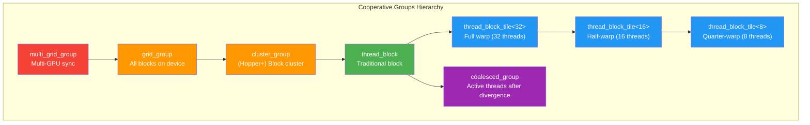
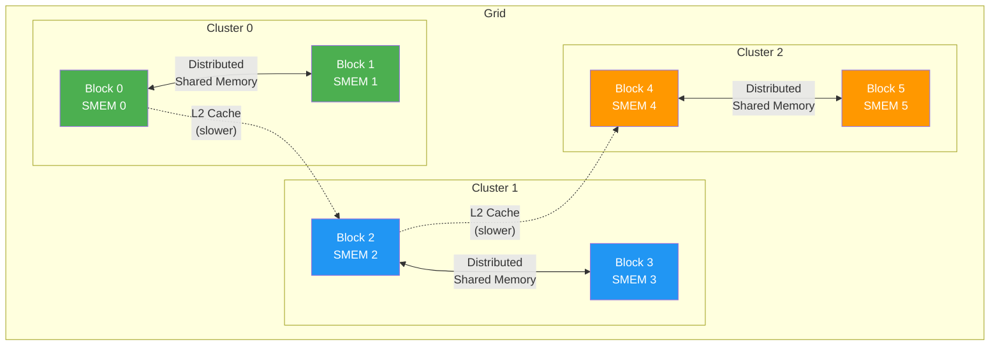
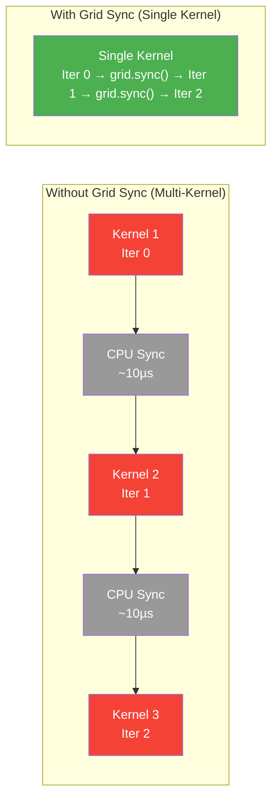

# Chapter 60: Cooperative Groups & Advanced Synchronization

**Tags:** `#CUDA` `#CooperativeGroups` `#Synchronization` `#GridSync` `#Clusters` `#Advanced`

---

## 1. Theory & Motivation

### The Synchronization Problem

Traditional CUDA provides exactly two synchronization primitives: `__syncthreads()` (block-level) and `cudaDeviceSynchronize()` (device-level, CPU-side). This creates a critical gap — there is no native way for threads in **different blocks** to synchronize on the GPU without returning to the CPU.

Cooperative Groups (introduced CUDA 9, extended through CUDA 12+) fills this gap with a flexible, hierarchical synchronization model that spans from **sub-warp partitions** all the way to **multi-GPU grids**.

### What Are Cooperative Groups?

Cooperative Groups is a CUDA C++ API that provides **explicit, type-safe thread group objects**. Instead of implicit synchronization (`__syncthreads()` syncs "all threads in this block"), you create named group objects and call `.sync()` on them.

### Why Cooperative Groups Matter

| Feature | Legacy CUDA | Cooperative Groups |
|---------|------------|-------------------|
| Block sync | `__syncthreads()` | `this_thread_block().sync()` |
| Warp sync | `__syncwarp()` | `tiled_partition<32>(tb).sync()` |
| Sub-warp sync | Manual masks | `tiled_partition<16>(tb).sync()` |
| Grid sync | Impossible on GPU | `this_grid().sync()` |
| Multi-GPU sync | Impossible on GPU | `this_multi_grid().sync()` |
| Custom partitions | Not available | `labeled_partition()` |

### How It Works

The key insight is that synchronization is defined by **group membership**, not by hardware hierarchy. A cooperative group is a set of threads that agree to synchronize — the runtime ensures they can actually do so.

---

## 2. Thread Block Tiles

### Partitioning Blocks into Sub-Groups

```cpp
#include <cuda_runtime.h>
#include <cooperative_groups.h>
#include <cstdio>

namespace cg = cooperative_groups;

// Warp-level reduction using cooperative group tiles
__device__ float tileReduce(cg::thread_block_tile<32> warp, float val) {
    for (int offset = warp.size() / 2; offset > 0; offset /= 2) {
        val += warp.shfl_down(val, offset);
    }
    return val;
}

__global__ void tiledReductionKernel(const float* input, float* output, int n) {
    cg::thread_block block = cg::this_thread_block();
    cg::thread_block_tile<32> warp = cg::tiled_partition<32>(block);

    int idx = blockIdx.x * blockDim.x + threadIdx.x;
    float val = (idx < n) ? input[idx] : 0.0f;

    // Phase 1: Warp-level reduction (no shared memory needed!)
    float warpSum = tileReduce(warp, val);

    // Phase 2: Collect warp results in shared memory
    __shared__ float warpSums[32];  // max 32 warps per block
    if (warp.thread_rank() == 0) {
        warpSums[threadIdx.x / 32] = warpSum;
    }
    block.sync();  // cooperative groups sync

    // Phase 3: First warp reduces all warp sums
    int numWarps = blockDim.x / 32;
    if (threadIdx.x < numWarps) {
        float s = warpSums[threadIdx.x];
        cg::thread_block_tile<32> firstWarp = cg::tiled_partition<32>(block);
        s = tileReduce(firstWarp, s);
        if (threadIdx.x == 0) {
            atomicAdd(output, s);
        }
    }
}

int main() {
    const int N = 1 << 20;
    float *d_input, *d_output;
    cudaMalloc(&d_input, N * sizeof(float));
    cudaMalloc(&d_output, sizeof(float));
    cudaMemset(d_output, 0, sizeof(float));

    // Initialize with ones for easy verification
    float* h_input = new float[N];
    for (int i = 0; i < N; i++) h_input[i] = 1.0f;
    cudaMemcpy(d_input, h_input, N * sizeof(float), cudaMemcpyHostToDevice);

    int threads = 256;
    int blocks = (N + threads - 1) / threads;
    tiledReductionKernel<<<blocks, threads>>>(d_input, d_output, N);

    float result;
    cudaMemcpy(&result, d_output, sizeof(float), cudaMemcpyDeviceToHost);
    printf("Reduction result: %.0f (expected: %d)\n", result, N);

    delete[] h_input;
    cudaFree(d_input);
    cudaFree(d_output);
    return 0;
}
```

### Sub-Warp Tiles for Fine-Grained Parallelism

```cpp
#include <cooperative_groups.h>
#include <cuda_runtime.h>
#include <cstdio>

namespace cg = cooperative_groups;

// 16-thread tile for small reductions within a warp
__global__ void subWarpProcessing(const float* input, float* output, int n) {
    cg::thread_block block = cg::this_thread_block();
    cg::thread_block_tile<16> half_warp = cg::tiled_partition<16>(block);

    int globalIdx = blockIdx.x * blockDim.x + threadIdx.x;
    int tileGlobalIdx = globalIdx / 16;  // which 16-thread tile are we?

    // Each 16-thread tile processes 16 elements independently
    int dataStart = tileGlobalIdx * 16;
    float val = 0.0f;
    if (dataStart + half_warp.thread_rank() < n) {
        val = input[dataStart + half_warp.thread_rank()];
    }

    // Reduce within the 16-thread tile
    for (int offset = half_warp.size() / 2; offset > 0; offset /= 2) {
        val += half_warp.shfl_down(val, offset);
    }

    // Thread 0 of each tile writes the result
    if (half_warp.thread_rank() == 0 && dataStart < n) {
        output[tileGlobalIdx] = val;
    }
}

int main() {
    const int N = 1024;
    float h_in[1024], h_out[64];
    for (int i = 0; i < N; i++) h_in[i] = 1.0f;

    float *d_in, *d_out;
    cudaMalloc(&d_in, N * sizeof(float));
    cudaMalloc(&d_out, 64 * sizeof(float));
    cudaMemcpy(d_in, h_in, N * sizeof(float), cudaMemcpyHostToDevice);

    subWarpProcessing<<<4, 256>>>(d_in, d_out, N);

    cudaMemcpy(h_out, d_out, 64 * sizeof(float), cudaMemcpyDeviceToHost);
    printf("Tile[0] sum = %.0f (expected 16)\n", h_out[0]);

    cudaFree(d_in); cudaFree(d_out);
    return 0;
}
```

---

## 3. Grid-Level Synchronization

### Cooperative Kernel Launch

Grid-level sync requires **all blocks to be resident simultaneously** — the GPU must have enough resources (registers, shared memory, SMs) to run every block at the same time.

```cpp
#include <cuda_runtime.h>
#include <cooperative_groups.h>
#include <cstdio>

namespace cg = cooperative_groups;

// Iterative Jacobi solver with grid-wide synchronization
__global__ void jacobiKernel(float* u_new, float* u_old,
                              const float* f, int n, int iterations) {
    cg::grid_group grid = cg::this_grid();
    int idx = blockIdx.x * blockDim.x + threadIdx.x;

    for (int iter = 0; iter < iterations; iter++) {
        // Compute new values (1D Jacobi for simplicity)
        if (idx > 0 && idx < n - 1) {
            u_new[idx] = 0.5f * (u_old[idx - 1] + u_old[idx + 1] - f[idx]);
        }

        // Grid-wide barrier — ALL threads across ALL blocks sync here
        grid.sync();

        // Swap pointers (all threads agree on the swap)
        float* temp = u_old;
        u_old = u_new;
        u_new = temp;

        grid.sync();
    }
}

int main() {
    const int N = 1024;
    float *d_u_new, *d_u_old, *d_f;
    cudaMalloc(&d_u_new, N * sizeof(float));
    cudaMalloc(&d_u_old, N * sizeof(float));
    cudaMalloc(&d_f, N * sizeof(float));
    cudaMemset(d_u_new, 0, N * sizeof(float));
    cudaMemset(d_u_old, 0, N * sizeof(float));
    cudaMemset(d_f, 0, N * sizeof(float));

    int threadsPerBlock = 256;

    // Query max blocks for cooperative launch
    int numBlocksPerSM;
    cudaOccupancyMaxActiveBlocksPerMultiprocessor(
        &numBlocksPerSM, jacobiKernel, threadsPerBlock, 0);

    cudaDeviceProp prop;
    cudaGetDeviceProperties(&prop, 0);
    int maxBlocks = numBlocksPerSM * prop.multiProcessorCount;
    int blocks = min(maxBlocks, (N + threadsPerBlock - 1) / threadsPerBlock);

    printf("Cooperative launch: %d blocks × %d threads (max: %d)\n",
           blocks, threadsPerBlock, maxBlocks);

    // Must use cooperative launch API
    int iterations = 100;
    void* args[] = { &d_u_new, &d_u_old, &d_f, (void*)&N, &iterations };
    cudaLaunchCooperativeKernel(
        (void*)jacobiKernel, dim3(blocks), dim3(threadsPerBlock),
        args, 0, 0);

    cudaDeviceSynchronize();
    printf("Jacobi solver completed %d iterations with grid sync.\n", iterations);

    cudaFree(d_u_new); cudaFree(d_u_old); cudaFree(d_f);
    return 0;
}
```

---

## 4. Thread Block Clusters (Hopper/Blackwell)

Starting with CUDA 12 and the Hopper architecture (SM 9.0), **thread block clusters** introduce a new level in the thread hierarchy between blocks and the grid. Clusters enable **distributed shared memory** — blocks within a cluster can directly access each other's shared memory.

```cpp
#include <cuda_runtime.h>
#include <cooperative_groups.h>
#include <cstdio>

namespace cg = cooperative_groups;

// Cluster-aware kernel (requires SM 9.0+)
// Compile: nvcc -arch=sm_90 -rdc=true
__global__ void __cluster_dims__(2, 1, 1)
clusterKernel(float* output, const float* input, int n) {
    cg::cluster_group cluster = cg::this_cluster();
    cg::thread_block block = cg::this_thread_block();

    __shared__ float smem[256];

    int idx = blockIdx.x * blockDim.x + threadIdx.x;
    if (idx < n) {
        smem[threadIdx.x] = input[idx];
    }
    block.sync();

    // Access shared memory of another block in the cluster
    // via distributed shared memory (DSMEM)
    unsigned int clusterRank = cluster.block_rank();
    unsigned int clusterSize = cluster.num_blocks();

    // Map to partner block's shared memory
    int partnerRank = (clusterRank + 1) % clusterSize;
    float* partnerSmem = cluster.map_shared_rank(smem, partnerRank);

    cluster.sync();  // ensure partner has written its data

    // Read from partner's shared memory
    if (idx < n && threadIdx.x < 256) {
        output[idx] = smem[threadIdx.x] + partnerSmem[threadIdx.x];
    }
}
```

---

## 5. Mermaid Diagrams

### Diagram 1: Cooperative Group Hierarchy



### Diagram 2: Thread Block Cluster Architecture



### Diagram 3: Grid Sync vs. Multi-Kernel Approach



---

## 6. Partition Strategies

### Coalesced Groups (Active Thread Masking)

```cpp
#include <cooperative_groups.h>
#include <cuda_runtime.h>
#include <cstdio>

namespace cg = cooperative_groups;

__global__ void compactKernel(const int* input, int* output,
                               int* count, int n, int threshold) {
    int idx = blockIdx.x * blockDim.x + threadIdx.x;
    if (idx >= n) return;

    bool predicate = (input[idx] > threshold);

    // Get group of only active threads that passed the predicate
    cg::coalesced_group active = cg::coalesced_threads();

    if (predicate) {
        cg::coalesced_group winners = cg::coalesced_threads();
        int rank = winners.thread_rank();

        // Atomically allocate output positions for this group
        int base;
        if (rank == 0) {
            base = atomicAdd(count, winners.size());
        }
        base = winners.shfl(base, 0);  // broadcast base to all winners

        output[base + rank] = input[idx];
    }
}

int main() {
    const int N = 1024;
    int h_input[1024], *d_input, *d_output, *d_count;
    for (int i = 0; i < N; i++) h_input[i] = i % 100;

    cudaMalloc(&d_input, N * sizeof(int));
    cudaMalloc(&d_output, N * sizeof(int));
    cudaMalloc(&d_count, sizeof(int));
    cudaMemcpy(d_input, h_input, N * sizeof(int), cudaMemcpyHostToDevice);
    cudaMemset(d_count, 0, sizeof(int));

    compactKernel<<<4, 256>>>(d_input, d_output, d_count, N, 50);

    int result_count;
    cudaMemcpy(&result_count, d_count, sizeof(int), cudaMemcpyDeviceToHost);
    printf("Elements > 50: %d\n", result_count);

    cudaFree(d_input); cudaFree(d_output); cudaFree(d_count);
    return 0;
}
```

---

## 7. Exercises

### 🟢 Beginner

1. Write a kernel using `thread_block_tile<32>` to compute a warp-level sum. Each warp should output its sum to a separate element in an output array. Verify against a CPU reference.

2. Replace all `__syncthreads()` calls in an existing block-level reduction kernel with `cg::this_thread_block().sync()`. Verify identical output.

### 🟡 Intermediate

3. Implement a **grid-wide prefix scan** using cooperative groups `grid.sync()`. Launch cooperatively and verify the scan output against `thrust::inclusive_scan`.

4. Use `coalesced_groups` to implement a stream compaction kernel: given an array of integers, compact only the even numbers into a contiguous output array. Compare performance with and without coalesced groups.

### 🔴 Advanced

5. Implement a multi-pass **iterative stencil** (2D 5-point stencil) that performs 100 iterations inside a single kernel using `grid.sync()`. Compare latency against launching 100 separate kernels.

---

## 8. Solutions

### Solution 1 (🟢)

```cpp
#include <cooperative_groups.h>
#include <cuda_runtime.h>
#include <cstdio>
namespace cg = cooperative_groups;

__global__ void warpSumKernel(const float* input, float* warpSums, int n) {
    cg::thread_block block = cg::this_thread_block();
    cg::thread_block_tile<32> warp = cg::tiled_partition<32>(block);

    int idx = blockIdx.x * blockDim.x + threadIdx.x;
    float val = (idx < n) ? input[idx] : 0.0f;

    // Warp-level reduction using shfl_down
    for (int offset = 16; offset > 0; offset /= 2) {
        val += warp.shfl_down(val, offset);
    }

    // Lane 0 writes the warp sum
    if (warp.thread_rank() == 0) {
        int warpIdx = (blockIdx.x * blockDim.x + threadIdx.x) / 32;
        warpSums[warpIdx] = val;
    }
}

int main() {
    const int N = 256;
    float h_in[256];
    for (int i = 0; i < N; i++) h_in[i] = 1.0f;

    float *d_in, *d_out;
    cudaMalloc(&d_in, N * sizeof(float));
    cudaMalloc(&d_out, (N / 32) * sizeof(float));
    cudaMemcpy(d_in, h_in, N * sizeof(float), cudaMemcpyHostToDevice);

    warpSumKernel<<<1, 256>>>(d_in, d_out, N);

    float h_out[8];
    cudaMemcpy(h_out, d_out, 8 * sizeof(float), cudaMemcpyDeviceToHost);
    for (int i = 0; i < 8; i++) {
        printf("Warp %d sum: %.0f (expected 32)\n", i, h_out[i]);
    }

    cudaFree(d_in); cudaFree(d_out);
    return 0;
}
```

### Solution 3 (🟡)

```cpp
#include <cooperative_groups.h>
#include <cuda_runtime.h>
#include <cstdio>
namespace cg = cooperative_groups;

__global__ void gridPrefixScan(float* data, int n) {
    cg::grid_group grid = cg::this_grid();
    int idx = blockIdx.x * blockDim.x + threadIdx.x;

    // Simplified Hillis-Steele inclusive scan with grid sync
    for (int stride = 1; stride < n; stride *= 2) {
        float addVal = 0.0f;
        if (idx >= stride && idx < n) {
            addVal = data[idx - stride];
        }
        grid.sync();
        if (idx >= stride && idx < n) {
            data[idx] += addVal;
        }
        grid.sync();
    }
}

int main() {
    const int N = 1024;
    float h_data[1024];
    for (int i = 0; i < N; i++) h_data[i] = 1.0f;

    float* d_data;
    cudaMalloc(&d_data, N * sizeof(float));
    cudaMemcpy(d_data, h_data, N * sizeof(float), cudaMemcpyHostToDevice);

    int threadsPerBlock = 256;
    int numBlocksPerSM;
    cudaOccupancyMaxActiveBlocksPerMultiprocessor(
        &numBlocksPerSM, gridPrefixScan, threadsPerBlock, 0);
    cudaDeviceProp prop;
    cudaGetDeviceProperties(&prop, 0);
    int blocks = min(numBlocksPerSM * prop.multiProcessorCount,
                     (N + threadsPerBlock - 1) / threadsPerBlock);

    void* args[] = { &d_data, (void*)&N };
    cudaLaunchCooperativeKernel((void*)gridPrefixScan,
        dim3(blocks), dim3(threadsPerBlock), args);
    cudaDeviceSynchronize();

    float h_out[1024];
    cudaMemcpy(h_out, d_data, N * sizeof(float), cudaMemcpyDeviceToHost);
    printf("Scan[0]=%0.f, Scan[99]=%0.f, Scan[1023]=%0.f\n",
           h_out[0], h_out[99], h_out[1023]);
    // Expected: 1, 100, 1024

    cudaFree(d_data);
    return 0;
}
```

---

## 9. Quiz

**Q1:** What is the minimum tile size for `thread_block_tile`?
a) 1  b) 2  c) 4  d) 8
**Answer:** a) 1 — tile sizes must be powers of 2 from 1 to 32

**Q2:** What does `cudaLaunchCooperativeKernel` guarantee that regular `<<<>>>` does not?
a) Faster execution  b) All blocks are resident simultaneously  c) Automatic shared memory allocation  d) Multi-GPU execution
**Answer:** b) All blocks are resident simultaneously — required for `grid.sync()`

**Q3:** What is a `coalesced_group`?
a) Threads with consecutive thread IDs  b) Threads that access consecutive memory  c) The set of currently active threads at a divergence point  d) All threads in a warp
**Answer:** c) The set of currently active threads at a divergence point

**Q4:** What SM architecture introduced thread block clusters?
a) Volta (SM 7.0)  b) Ampere (SM 8.0)  c) Hopper (SM 9.0)  d) Turing (SM 7.5)
**Answer:** c) Hopper (SM 9.0)

**Q5:** Why can't grid sync work if too many blocks are launched?
a) The GPU runs out of memory  b) Not all blocks can be resident simultaneously, causing deadlock  c) The compiler rejects it  d) It works but is slower
**Answer:** b) Not all blocks can be resident simultaneously — waiting blocks can't execute `grid.sync()`, causing deadlock

**Q6:** What is distributed shared memory (DSMEM)?
a) Shared memory distributed across GPUs  b) Shared memory of one block accessible by other blocks in the same cluster  c) Global memory partitioned per SM  d) L2 cache partitioning
**Answer:** b) Shared memory of one block accessible by other blocks in the same cluster

**Q7:** Which cooperative group function replaces `__shfl_down_sync()`?
a) `tile.shfl_down()`  b) `tile.shuffle_down()`  c) `tile.reduce()`  d) `tile.broadcast()`
**Answer:** a) `tile.shfl_down()` — called on a `thread_block_tile` object

---

## 10. Key Takeaways

1. **Cooperative Groups replaces ad-hoc synchronization** with a type-safe, hierarchical group model
2. **Thread block tiles** enable warp and sub-warp level sync and shuffle without manual mask management
3. **Grid sync** enables iterative algorithms to run entirely on GPU without CPU round-trips
4. **Cooperative launch** requires all blocks to be resident — compute occupancy carefully
5. **Clusters** (Hopper+) add a new hierarchy level with distributed shared memory for neighbor communication
6. **Coalesced groups** give structure to divergent code paths

---

## 11. Chapter Summary

Cooperative Groups transforms CUDA synchronization from a rigid two-level system (block/device) into a flexible hierarchy spanning sub-warp tiles through multi-GPU grids. Thread block tiles eliminate shared memory in warp reductions via `shfl_down()`. Grid-level synchronization enables iterative solvers and multi-pass algorithms to run as a single kernel, avoiding CPU launch overhead. Thread block clusters on Hopper introduce distributed shared memory for fast inter-block communication. The API is designed for composability — groups can be partitioned, intersected, and nested to match any algorithm's communication pattern.

---

## 12. Real-World AI/ML Insight

**Grid-level synchronization is essential for on-device iterative algorithms** used in graph neural networks (message passing requires global sync between layers), diffusion model sampling (each denoising step needs global sync), and reinforcement learning simulations (all agents must sync per timestep). PyTorch uses cooperative groups internally in fused multi-head attention kernels, where sub-warp tiles of 4–8 threads independently process attention heads, achieving 2–3× speedup over full-warp approaches for small head dimensions (d=64).

---

## 13. Common Mistakes

| Mistake | Why It's Wrong | Fix |
|---------|---------------|-----|
| Launching too many blocks with cooperative launch | Deadlock — not all blocks can be resident | Query `cudaOccupancyMaxActiveBlocksPerMultiprocessor` |
| Using `grid.sync()` with `<<<>>>` launch | Must use `cudaLaunchCooperativeKernel` | Switch to cooperative launch API |
| Tile size not power of 2 | Compile error — tiles must be 1,2,4,8,16,32 | Use valid tile sizes |
| Calling `coalesced_threads()` in uniform code | Creates trivial group (all 32 threads) | Only meaningful after divergence |
| Mixing `__syncthreads` with CG sync | Undefined if some threads use legacy, others CG | Use one approach consistently |

---

## 14. Interview Questions

**Q1: What problem does cooperative groups solve that `__syncthreads()` cannot?**
**A:** `__syncthreads()` only synchronizes threads within a single block. Cooperative groups provides synchronization at arbitrary granularities: sub-warp (tile), warp, block, cluster (Hopper), grid, and multi-grid levels. The most impactful capability is `grid.sync()` — synchronizing all threads across all blocks without returning to the CPU, enabling iterative algorithms in a single kernel launch.

**Q2: What are the constraints for using `this_grid().sync()`?**
**A:** Three constraints: (1) Must use `cudaLaunchCooperativeKernel` instead of `<<<>>>` syntax. (2) Total number of blocks must not exceed what the GPU can run simultaneously (query via occupancy API). (3) Shared memory and register usage per block affects how many blocks fit, so high-occupancy kernels are required. If any block can't be resident, the grid will deadlock.

**Q3: Explain thread block clusters and distributed shared memory.**
**A:** Clusters (Hopper SM 9.0+) group 2–16 adjacent thread blocks that are guaranteed to be scheduled on nearby SMs. Within a cluster, any block can directly read/write another block's shared memory via `cluster.map_shared_rank()` — called distributed shared memory (DSMEM). This is faster than going through L2 cache and enables stencil computations, convolutions, and attention mechanisms where blocks need neighbor data. It adds a new level between block and grid in the thread hierarchy.

**Q4: When should you use `coalesced_groups` vs `thread_block_tile`?**
**A:** `thread_block_tile<N>` creates statically-sized groups (power of 2, ≤32) from a thread block — ideal for structured decomposition like warp-level reduction. `coalesced_groups` captures the set of currently active threads after warp divergence — the group size is dynamic and data-dependent. Use tiles for structured parallelism, coalesced groups for data-dependent control flow (e.g., stream compaction, sparse operations).
