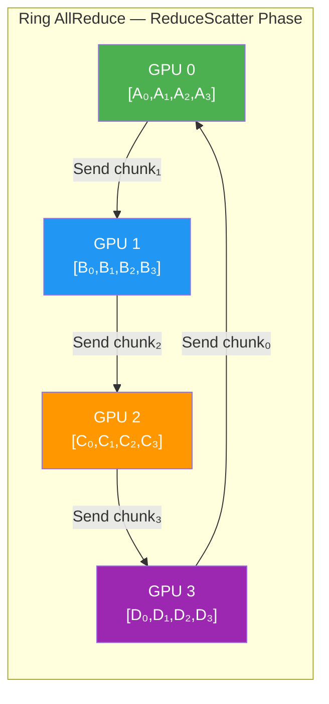
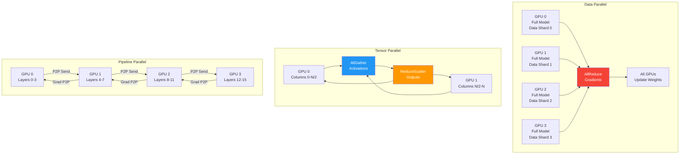

# Chapter 61: Distributed GPU Computing

**Tags:** `#CUDA` `#MPI` `#NCCL` `#GPUDirect` `#DistributedTraining` `#AllReduce` `#Advanced`

---

## 1. Theory & Motivation

### Why Distributed GPU Computing?

Single-GPU compute has hit practical limits. Training GPT-4 required an estimated **25,000 A100 GPUs** running for ~100 days. Even inference for frontier models demands multi-GPU setups. Distributed GPU computing is no longer optional — it's the backbone of modern AI.

### The Communication Challenge

When work is split across GPUs, they must exchange data:
- **Data parallelism**: Each GPU trains on different data → gradients must be averaged (AllReduce)
- **Model parallelism**: Each GPU holds part of the model → activations and gradients flow between GPUs (P2P Send/Recv)
- **Pipeline parallelism**: Each GPU holds different layers → micro-batch activation forwarding

The communication stack must minimize latency and maximize bandwidth across PCIe, NVLink, NVSwitch, InfiniBand, and Ethernet fabrics.

### Key Technologies Overview

| Technology | What It Does | Bandwidth |
|-----------|-------------|-----------|
| PCIe Gen5 x16 | CPU ↔ GPU | ~64 GB/s |
| NVLink 4 (Hopper) | GPU ↔ GPU (same node) | 900 GB/s bidirectional |
| NVSwitch (DGX) | All-to-all GPU within node | 900 GB/s per GPU |
| InfiniBand NDR | GPU ↔ GPU (across nodes) | 400 Gb/s (50 GB/s) |
| GPUDirect RDMA | NIC → GPU (bypass CPU) | Wire speed |
| GPUDirect P2P | GPU → GPU (bypass CPU) | NVLink speed |

---

## 2. MPI Basics for GPU Programmers

### CUDA-Aware MPI

Standard MPI requires data in host memory. **CUDA-aware MPI** accepts GPU pointers directly, eliminating manual `cudaMemcpy` staging:

```cpp
#include <mpi.h>
#include <cuda_runtime.h>
#include <cstdio>

// Compile: mpicxx -o cuda_mpi cuda_mpi.cu -lcudart
// Run: mpirun -np 4 ./cuda_mpi

__global__ void initKernel(float* data, int n, int rank) {
    int idx = blockIdx.x * blockDim.x + threadIdx.x;
    if (idx < n) data[idx] = (float)(rank * n + idx);
}

int main(int argc, char** argv) {
    MPI_Init(&argc, &argv);

    int rank, size;
    MPI_Comm_rank(MPI_COMM_WORLD, &rank);
    MPI_Comm_size(MPI_COMM_WORLD, &size);

    // Each rank uses a different GPU
    cudaSetDevice(rank % 4);

    const int N = 1 << 20;
    float* d_data;
    cudaMalloc(&d_data, N * sizeof(float));

    initKernel<<<(N+255)/256, 256>>>(d_data, N, rank);
    cudaDeviceSynchronize();

    // CUDA-aware MPI: pass GPU pointer directly!
    float* d_recv;
    cudaMalloc(&d_recv, N * sizeof(float));

    if (rank == 0) {
        // Receive from rank 1 directly into GPU memory
        MPI_Recv(d_recv, N, MPI_FLOAT, 1, 0, MPI_COMM_WORLD,
                 MPI_STATUS_IGNORE);
        printf("Rank 0 received data from Rank 1 (GPU-direct)\n");
    } else if (rank == 1) {
        // Send GPU data directly — no cudaMemcpy needed!
        MPI_Send(d_data, N, MPI_FLOAT, 0, 0, MPI_COMM_WORLD);
        printf("Rank 1 sent data to Rank 0 (GPU-direct)\n");
    }

    cudaFree(d_data);
    cudaFree(d_recv);
    MPI_Finalize();
    return 0;
}
```

### MPI Collective with GPU Buffers

```cpp
#include <mpi.h>
#include <cuda_runtime.h>
#include <cstdio>

__global__ void scaleKernel(float* data, float factor, int n) {
    int idx = blockIdx.x * blockDim.x + threadIdx.x;
    if (idx < n) data[idx] *= factor;
}

int main(int argc, char** argv) {
    MPI_Init(&argc, &argv);
    int rank, size;
    MPI_Comm_rank(MPI_COMM_WORLD, &rank);
    MPI_Comm_size(MPI_COMM_WORLD, &size);
    cudaSetDevice(rank % 4);

    const int N = 1 << 16;
    float* d_sendbuf;
    float* d_recvbuf;
    cudaMalloc(&d_sendbuf, N * sizeof(float));
    cudaMalloc(&d_recvbuf, N * sizeof(float));

    // Each rank initializes with its rank value
    float initVal = (float)(rank + 1);
    scaleKernel<<<(N+255)/256, 256>>>(d_sendbuf, initVal, N);
    cudaMemset(d_sendbuf, 0, N * sizeof(float));
    cudaDeviceSynchronize();

    // AllReduce on GPU buffers — sum across all ranks
    MPI_Allreduce(d_sendbuf, d_recvbuf, N, MPI_FLOAT, MPI_SUM,
                  MPI_COMM_WORLD);

    // Verify: each element should be sum of all rank values
    float h_result;
    cudaMemcpy(&h_result, d_recvbuf, sizeof(float),
               cudaMemcpyDeviceToHost);
    float expected = (float)(size * (size + 1) / 2);
    printf("Rank %d: AllReduce result[0] = %.1f (expected %.1f)\n",
           rank, h_result, expected);

    cudaFree(d_sendbuf);
    cudaFree(d_recvbuf);
    MPI_Finalize();
    return 0;
}
```

---

## 3. GPUDirect Technologies

### The Data Path Problem

Without GPUDirect, GPU-to-GPU communication across nodes traverses:
```
GPU0 → PCIe → CPU0 → Host RAM → NIC → Network → NIC → Host RAM → CPU1 → PCIe → GPU1
```

Each hop adds latency and uses CPU/memory bandwidth. GPUDirect technologies progressively eliminate hops.

### GPUDirect Variants

```cpp
// GPUDirect P2P: Direct GPU-to-GPU transfer (same node, via NVLink)
// No code change needed — cudaMemcpyPeer handles it:
cudaSetDevice(0);
float* d_gpu0;
cudaMalloc(&d_gpu0, size);

cudaSetDevice(1);
float* d_gpu1;
cudaMalloc(&d_gpu1, size);

// Direct P2P transfer: GPU0 → NVLink → GPU1 (bypasses CPU entirely)
cudaMemcpyPeer(d_gpu1, 1, d_gpu0, 0, size);

// Check P2P support:
int canAccess;
cudaDeviceCanAccessPeer(&canAccess, 0, 1);  // Can GPU 0 access GPU 1?
if (canAccess) {
    cudaSetDevice(0);
    cudaDeviceEnablePeerAccess(1, 0);  // Enable GPU 0 → GPU 1
    cudaSetDevice(1);
    cudaDeviceEnablePeerAccess(0, 0);  // Enable GPU 1 → GPU 0
}
```

---

## 4. NCCL: The GPU Communication Library

### NCCL Collectives Deep-Dive

NCCL (NVIDIA Collective Communications Library) is purpose-built for multi-GPU communication. It automatically selects optimal algorithms and transport paths.

```cpp
#include <nccl.h>
#include <cuda_runtime.h>
#include <cstdio>

// Compile: nvcc -o nccl_example nccl_example.cu -lnccl
// (Single-process multi-GPU example for clarity)

int main() {
    int nGPUs = 4;
    ncclComm_t comms[4];
    cudaStream_t streams[4];
    float* d_sendbuf[4];
    float* d_recvbuf[4];
    int devs[] = {0, 1, 2, 3};
    const int N = 1 << 20;

    // Initialize NCCL communicators
    ncclCommInitAll(comms, nGPUs, devs);

    // Allocate per-GPU buffers
    for (int i = 0; i < nGPUs; i++) {
        cudaSetDevice(i);
        cudaStreamCreate(&streams[i]);
        cudaMalloc(&d_sendbuf[i], N * sizeof(float));
        cudaMalloc(&d_recvbuf[i], N * sizeof(float));

        // Initialize: each GPU's buffer = GPU_index + 1
        float val = (float)(i + 1);
        cudaMemset(d_sendbuf[i], 0, N * sizeof(float));
        // Fill with val (simplified — real code uses a kernel)
    }

    // AllReduce: sum across all GPUs
    ncclGroupStart();
    for (int i = 0; i < nGPUs; i++) {
        ncclAllReduce(d_sendbuf[i], d_recvbuf[i], N,
                      ncclFloat, ncclSum, comms[i], streams[i]);
    }
    ncclGroupEnd();

    // Synchronize all streams
    for (int i = 0; i < nGPUs; i++) {
        cudaSetDevice(i);
        cudaStreamSynchronize(streams[i]);
    }

    printf("NCCL AllReduce completed across %d GPUs.\n", nGPUs);

    // Cleanup
    for (int i = 0; i < nGPUs; i++) {
        cudaSetDevice(i);
        cudaFree(d_sendbuf[i]);
        cudaFree(d_recvbuf[i]);
        cudaStreamDestroy(streams[i]);
        ncclCommDestroy(comms[i]);
    }
    return 0;
}
```

### NCCL AllGather and ReduceScatter

```cpp
#include <nccl.h>
#include <cuda_runtime.h>
#include <cstdio>

void demonstrateCollectives(int nGPUs, ncclComm_t* comms,
                             cudaStream_t* streams) {
    const int chunkSize = 1 << 18;  // per-GPU chunk
    float* d_sendbuf[8];
    float* d_recvbuf[8];

    for (int i = 0; i < nGPUs; i++) {
        cudaSetDevice(i);
        cudaMalloc(&d_sendbuf[i], chunkSize * sizeof(float));
        cudaMalloc(&d_recvbuf[i], chunkSize * nGPUs * sizeof(float));
    }

    // --- AllGather: Each GPU contributes a chunk, all GPUs get all chunks ---
    // Input:  GPU0=[A], GPU1=[B], GPU2=[C], GPU3=[D]
    // Output: GPU0=[A,B,C,D], GPU1=[A,B,C,D], ...
    ncclGroupStart();
    for (int i = 0; i < nGPUs; i++) {
        ncclAllGather(d_sendbuf[i], d_recvbuf[i], chunkSize,
                      ncclFloat, comms[i], streams[i]);
    }
    ncclGroupEnd();

    // --- ReduceScatter: Reduce, then each GPU gets a portion ---
    // Opposite of AllGather: reduces (sums) then scatters
    // Input:  GPU0=[A0,A1,A2,A3], GPU1=[B0,B1,B2,B3], ...
    // Output: GPU0=[sum_col0], GPU1=[sum_col1], ...
    float* d_fullbuf[8];
    float* d_partbuf[8];
    for (int i = 0; i < nGPUs; i++) {
        cudaSetDevice(i);
        cudaMalloc(&d_fullbuf[i], chunkSize * nGPUs * sizeof(float));
        cudaMalloc(&d_partbuf[i], chunkSize * sizeof(float));
    }

    ncclGroupStart();
    for (int i = 0; i < nGPUs; i++) {
        ncclReduceScatter(d_fullbuf[i], d_partbuf[i],
                          chunkSize, ncclFloat, ncclSum,
                          comms[i], streams[i]);
    }
    ncclGroupEnd();

    for (int i = 0; i < nGPUs; i++) {
        cudaSetDevice(i);
        cudaStreamSynchronize(streams[i]);
        cudaFree(d_sendbuf[i]); cudaFree(d_recvbuf[i]);
        cudaFree(d_fullbuf[i]); cudaFree(d_partbuf[i]);
    }
}
```

---

## 5. Ring AllReduce: Algorithm Deep-Dive

### Why Ring AllReduce Is Bandwidth-Optimal

For N GPUs each holding a vector of size D:

- **Naive AllReduce**: Send everything to one GPU, reduce, broadcast back.
  - Bottleneck GPU transfers: 2(N-1)×D. Total time: O(N×D/B)
- **Ring AllReduce**: Two phases — ReduceScatter + AllGather, each with N-1 steps.
  - Each GPU sends/receives D/N per step. Total data moved per GPU: 2(N-1)/N × D
  - **Bandwidth utilization**: 2(N-1)/N ≈ 2 for large N (optimal!)

### Ring AllReduce Step-by-Step (4 GPUs)

```
Phase 1: ReduceScatter (3 steps for 4 GPUs)
Each GPU's data is split into 4 chunks: [C0, C1, C2, C3]

Step 1: GPU_i sends chunk (i+1)%4 to GPU_(i+1)%4
  GPU0 → GPU1: C1    GPU1 → GPU2: C2    GPU2 → GPU3: C3    GPU3 → GPU0: C0
  Each GPU accumulates into received chunk position.

Step 2: GPU_i sends chunk (i)%4 to GPU_(i+1)%4
  Continue ring rotation, accumulating partial sums.

Step 3: One more step — now each GPU holds the full reduction of one chunk.
  GPU0 has reduced C0, GPU1 has reduced C1, etc.

Phase 2: AllGather (3 steps)
  Same ring pattern but broadcasting reduced chunks to all GPUs.
  After 3 steps, every GPU has the complete reduced result.
```

---

## 6. Mermaid Diagrams

### Diagram 1: Ring AllReduce Data Flow (4 GPUs)



### Diagram 2: GPUDirect Data Paths

```mermaid
flowchart TB
    subgraph "Without GPUDirect"
        G0A["GPU 0"] --> PCIe0["PCIe Bus"] --> CPU0["CPU 0<br/>Host RAM"]
        CPU0 --> NIC0A["NIC"]
        NIC0A -->|"Network"| NIC1A["NIC"]
        NIC1A --> CPU1["CPU 1<br/>Host RAM"]
        CPU1 --> PCIe1["PCIe Bus"] --> G1A["GPU 1"]
    end

    subgraph "With GPUDirect RDMA"
        G0B["GPU 0"] --> NIC0B["NIC<br/>(reads GPU mem)"]
        NIC0B -->|"Network<br/>(RDMA)"| NIC1B["NIC<br/>(writes GPU mem)"]
        NIC1B --> G1B["GPU 1"]
    end

    style G0A fill:#f44336,color:#fff
    style G1A fill:#f44336,color:#fff
    style G0B fill:#4CAF50,color:#fff
    style G1B fill:#4CAF50,color:#fff
    style CPU0 fill:#999,color:#fff
    style CPU1 fill:#999,color:#fff
```



### Diagram 3: Distributed Training Communication Patterns



---

## 7. Bandwidth-Optimal Communication

### Analytical Framework

For P GPUs, message size M:

| Algorithm | Per-GPU Data Moved | Latency Term | Bandwidth Term |
|-----------|-------------------|--------------|----------------|
| **Ring AllReduce** | 2(P-1)/P × M | 2(P-1)α | 2(P-1)/(P) × M/B |
| **Tree AllReduce** | 2 log₂(P) × M | 2 log₂(P) α | 2 log₂(P) × M/B |
| **Ring** advantage | — | Worse (O(P)) | Better (O(1)) |
| **Tree** advantage | — | Better (O(log P)) | Worse (O(log P)) |

**NCCL automatically selects**: Ring for large messages (bandwidth-bound), Tree for small messages (latency-bound).

---

## 8. Exercises

### 🟢 Beginner

1. Write a program that uses `cudaMemcpyPeer` to transfer a 1 MB buffer from GPU 0 to GPU 1 (assuming 2+ GPUs). Time the transfer and compute achieved bandwidth.

2. Using NCCL's single-process multi-GPU API (`ncclCommInitAll`), perform a Broadcast from GPU 0 to GPUs 1–3. Verify all GPUs have the same data.

### 🟡 Intermediate

3. Implement a manual ring AllReduce using NCCL Send/Recv primitives (not `ncclAllReduce`). Verify the result matches `ncclAllReduce` output. Measure the bandwidth utilization.

4. Write a CUDA-aware MPI program where 4 ranks each compute a local dot product on GPU, then use `MPI_Allreduce` to compute the global dot product. Verify correctness against a single-GPU reference.

### 🔴 Advanced

5. Implement a distributed matrix multiplication: partition an (M×K) × (K×N) multiplication across 4 GPUs using a 2D decomposition. Each GPU computes a quarter of the output, using NCCL to exchange partial results. Measure scaling efficiency.

---

## 9. Solutions

### Solution 1 (🟢)

```cpp
#include <cuda_runtime.h>
#include <cstdio>

int main() {
    int deviceCount;
    cudaGetDeviceCount(&deviceCount);
    if (deviceCount < 2) {
        printf("Need 2+ GPUs. Found %d\n", deviceCount);
        return 1;
    }

    // Enable peer access
    cudaSetDevice(0);
    cudaDeviceEnablePeerAccess(1, 0);
    cudaSetDevice(1);
    cudaDeviceEnablePeerAccess(0, 0);

    const size_t SIZE = 1 << 20;  // 1M floats = 4 MB
    const size_t BYTES = SIZE * sizeof(float);

    // Allocate on GPU 0
    cudaSetDevice(0);
    float* d_src;
    cudaMalloc(&d_src, BYTES);
    cudaMemset(d_src, 1, BYTES);

    // Allocate on GPU 1
    cudaSetDevice(1);
    float* d_dst;
    cudaMalloc(&d_dst, BYTES);

    // Time the transfer
    cudaEvent_t start, stop;
    cudaEventCreate(&start);
    cudaEventCreate(&stop);

    cudaSetDevice(0);
    cudaEventRecord(start);

    cudaMemcpyPeer(d_dst, 1, d_src, 0, BYTES);

    cudaEventRecord(stop);
    cudaEventSynchronize(stop);

    float ms;
    cudaEventElapsedTime(&ms, start, stop);
    double gb = (double)BYTES / 1e9;
    double bw = gb / (ms / 1000.0);
    printf("Transferred %.2f MB in %.3f ms = %.2f GB/s\n",
           (double)BYTES / 1e6, ms, bw);

    cudaFree(d_src);
    cudaSetDevice(1);
    cudaFree(d_dst);
    cudaEventDestroy(start);
    cudaEventDestroy(stop);
    return 0;
}
```

### Solution 2 (🟢)

```cpp
#include <nccl.h>
#include <cuda_runtime.h>
#include <cstdio>

int main() {
    const int nGPUs = 4;
    const int N = 1 << 16;
    ncclComm_t comms[4];
    int devs[] = {0, 1, 2, 3};
    ncclCommInitAll(comms, nGPUs, devs);

    float* d_buf[4];
    cudaStream_t streams[4];

    for (int i = 0; i < nGPUs; i++) {
        cudaSetDevice(i);
        cudaStreamCreate(&streams[i]);
        cudaMalloc(&d_buf[i], N * sizeof(float));
        if (i == 0) {
            // Root initializes with known pattern
            float* h = new float[N];
            for (int j = 0; j < N; j++) h[j] = 42.0f;
            cudaMemcpy(d_buf[i], h, N * sizeof(float),
                       cudaMemcpyHostToDevice);
            delete[] h;
        } else {
            cudaMemset(d_buf[i], 0, N * sizeof(float));
        }
    }

    // Broadcast from GPU 0 to all
    ncclGroupStart();
    for (int i = 0; i < nGPUs; i++) {
        ncclBroadcast(d_buf[i], d_buf[i], N, ncclFloat, 0,
                      comms[i], streams[i]);
    }
    ncclGroupEnd();

    // Verify
    for (int i = 0; i < nGPUs; i++) {
        cudaSetDevice(i);
        cudaStreamSynchronize(streams[i]);
        float val;
        cudaMemcpy(&val, d_buf[i], sizeof(float),
                   cudaMemcpyDeviceToHost);
        printf("GPU %d: buf[0] = %.1f %s\n", i, val,
               val == 42.0f ? "✓" : "✗");
        cudaFree(d_buf[i]);
        cudaStreamDestroy(streams[i]);
        ncclCommDestroy(comms[i]);
    }
    return 0;
}
```

---

## 10. Quiz

**Q1:** What does CUDA-aware MPI allow that standard MPI does not?
a) Faster MPI initialization  b) Passing GPU pointers directly to MPI calls  c) Multi-threaded MPI  d) Larger message sizes
**Answer:** b) Passing GPU pointers directly to MPI calls — eliminating manual `cudaMemcpy` staging

**Q2:** In ring AllReduce with P GPUs and message size M, how much data does each GPU send in total?
a) M  b) 2M  c) 2(P-1)/P × M  d) P × M
**Answer:** c) 2(P-1)/P × M — approaches 2M as P grows, which is optimal

**Q3:** What does GPUDirect RDMA bypass?
a) The GPU  b) The NIC  c) The CPU and host memory  d) The network
**Answer:** c) The CPU and host memory — NIC reads/writes GPU memory directly

**Q4:** Which NCCL collective is used for gradient averaging in data parallelism?
a) Broadcast  b) AllGather  c) AllReduce  d) ReduceScatter
**Answer:** c) AllReduce — sums gradients across all GPUs and distributes the result

**Q5:** When does NCCL prefer tree AllReduce over ring AllReduce?
a) Large messages  b) Small messages (latency-bound)  c) Always  d) Never
**Answer:** b) Small messages — tree has O(log P) latency vs ring's O(P)

**Q6:** What is the purpose of `ncclGroupStart()`/`ncclGroupEnd()`?
a) Create a communicator group  b) Batch multiple NCCL operations for optimization  c) Synchronize GPUs  d) Initialize NCCL
**Answer:** b) Batch multiple NCCL operations — NCCL can fuse and optimize grouped calls

**Q7:** Which parallelism strategy primarily uses AllGather and ReduceScatter?
a) Data parallelism  b) Pipeline parallelism  c) Tensor parallelism  d) Expert parallelism
**Answer:** c) Tensor parallelism — partitions weight matrices across GPUs, requiring AllGather for inputs and ReduceScatter for outputs

---

## 11. Key Takeaways

1. **CUDA-aware MPI** eliminates CPU staging for GPU data — pass `d_ptr` directly to MPI calls
2. **GPUDirect RDMA** lets NICs read/write GPU memory, bypassing CPU and host RAM entirely
3. **Ring AllReduce** achieves 2(N-1)/N bandwidth utilization — near-optimal for large messages
4. **Tree AllReduce** has O(log P) latency — better for small messages
5. **NCCL** automatically selects the best algorithm and transport for each collective
6. **Data, tensor, and pipeline parallelism** have distinct communication patterns requiring different collectives

---

## 12. Chapter Summary

Distributed GPU computing enables scaling beyond single-GPU limits through efficient inter-GPU communication. CUDA-aware MPI and GPUDirect technologies minimize data movement overhead by eliminating CPU staging and host memory copies. NCCL provides optimized GPU-native collectives (AllReduce, AllGather, ReduceScatter) that automatically select between ring (bandwidth-optimal) and tree (latency-optimal) algorithms. Understanding which collective maps to which parallelism strategy — AllReduce for data parallelism, AllGather/ReduceScatter for tensor parallelism, P2P Send/Recv for pipeline parallelism — is essential for efficient distributed training and inference at scale.

---

## 13. Real-World AI/ML Insight

**Megatron-LM** (NVIDIA's framework for training large language models) combines all three parallelism strategies simultaneously. A 530B parameter model uses 8-way tensor parallelism (NVLink, AllGather/ReduceScatter), 64-way data parallelism (InfiniBand, AllReduce), and 8-way pipeline parallelism (P2P Send). NCCL handles all communication, achieving >50% of theoretical bandwidth on 4096 A100 GPUs. The key insight: tensor parallelism uses fast NVLink within a node, while data parallelism uses slower cross-node InfiniBand — matching communication intensity to available bandwidth.

---

## 14. Common Mistakes

| Mistake | Why It's Wrong | Fix |
|---------|---------------|-----|
| Using standard MPI with GPU pointers | Segfault — MPI tries to dereference GPU memory on CPU | Use CUDA-aware MPI or stage through host |
| Not calling `ncclGroupStart/End` for multi-GPU ops | Each call blocks, causing serialization | Group all per-GPU calls together |
| Forgetting `cudaSetDevice` before GPU ops | Operations go to wrong GPU | Always set device before `cudaMalloc`/kernel launch |
| Using AllReduce for tensor parallelism | Wasteful — only need partial results per GPU | Use ReduceScatter + AllGather instead |
| Not overlapping communication with computation | GPU idle during transfers | Use CUDA streams to overlap compute with NCCL calls |

---

## 15. Interview Questions

**Q1: Explain the difference between ring and tree AllReduce and when NCCL uses each.**
**A:** Ring AllReduce passes data around a ring of GPUs in N-1 steps, achieving 2(N-1)/N bandwidth utilization — near-optimal for large messages. Tree AllReduce uses a binary tree structure with O(log N) steps — lower latency but only uses log(N)/N of available bandwidth. NCCL uses tree for small messages (<256 KB) where latency dominates, and ring for large messages where bandwidth matters. For very large clusters, NCCL uses hybrid approaches: tree within a node (low latency over NVLink), ring across nodes (high bandwidth over InfiniBand).

**Q2: What is GPUDirect RDMA and why is it critical for distributed training?**
**A:** GPUDirect RDMA allows InfiniBand/RoCE NICs to read from and write to GPU memory directly, bypassing the CPU and host RAM. Without it, each cross-node transfer requires: GPU→PCIe→Host RAM→NIC (send) and NIC→Host RAM→PCIe→GPU (receive), doubling latency and consuming CPU/memory bandwidth. With RDMA: GPU→NIC→Network→NIC→GPU. This is critical because distributed training at scale (thousands of GPUs) generates terabytes of gradient traffic — any overhead per transfer multiplies across millions of AllReduce operations per training run.

**Q3: A training job uses 256 GPUs with 32 nodes (8 GPUs/node). Design the parallelism strategy for a 70B parameter model.**
**A:** Use 3D parallelism: (1) 8-way tensor parallelism within each node (NVLink, ~900 GB/s) — each GPU holds 1/8 of each layer's weights, using AllGather/ReduceScatter. (2) 4-way pipeline parallelism across nodes within a pipeline group — each group of 4 nodes holds different layer ranges, using P2P Send/Recv. (3) 8-way data parallelism across pipeline replicas — 8 identical pipeline groups process different data batches, using AllReduce for gradient sync over InfiniBand. This matches communication intensity to bandwidth: heaviest traffic (tensor parallel) uses fastest interconnect (NVLink).

**Q4: Why is AllReduce decomposed into ReduceScatter + AllGather in practice?**
**A:** This decomposition enables **overlap with computation**. In data parallelism with gradient bucketing (used by PyTorch DDP), ReduceScatter can start as soon as a bucket's gradients are computed — while backward pass continues for other layers. AllGather then distributes results before the optimizer step. This overlaps communication with computation, effectively hiding transfer latency. Direct AllReduce would require all gradients to be ready before starting, serializing communication and computation.
