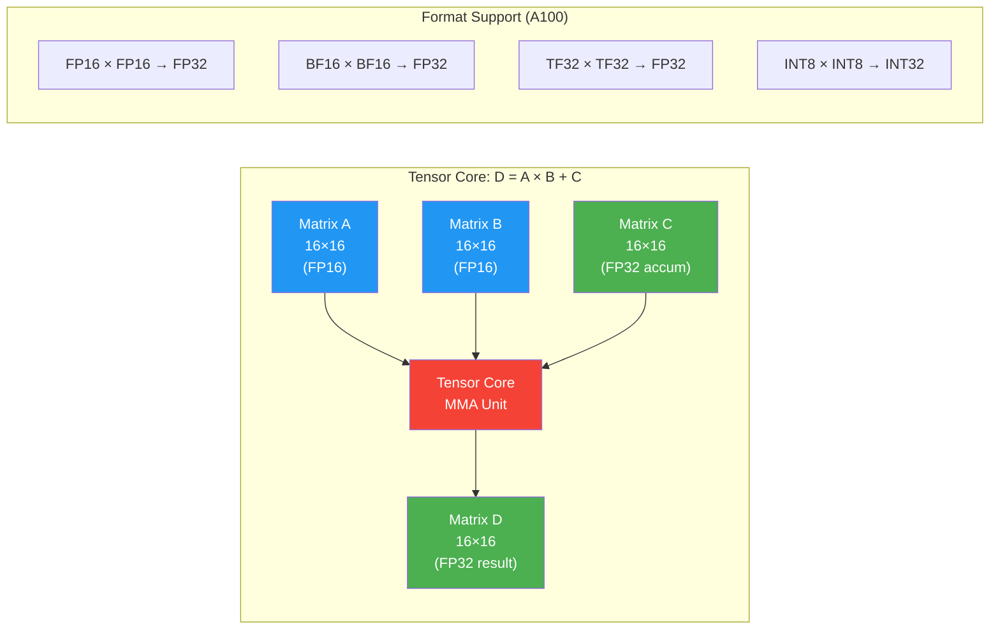
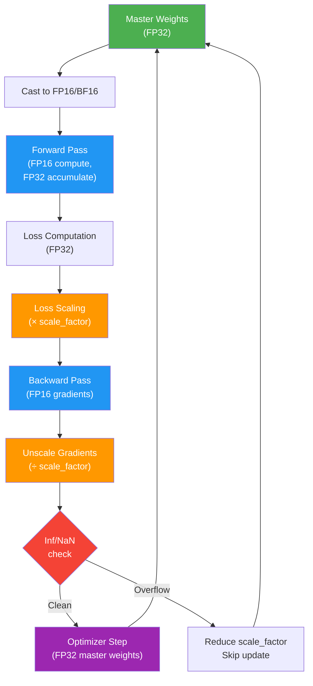
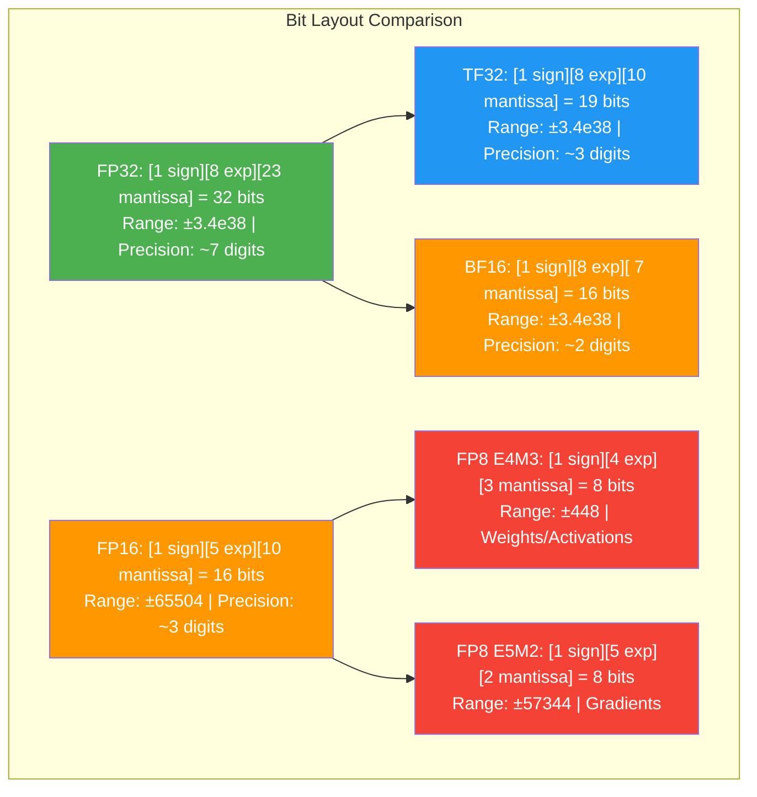

# Chapter 62: Mixed Precision & Tensor Core Programming

**Tags:** `#CUDA` `#MixedPrecision` `#TensorCores` `#WMMA` `#FP16` `#BF16` `#GEMM` `#Advanced`

---

## 1. Theory & Motivation

### The Precision-Performance Tradeoff

Every floating-point number is a compromise between **range** (exponent bits), **precision** (mantissa bits), and **storage/compute cost** (total bits). Modern AI workloads have revealed that most neural network operations tolerate reduced precision — the key is knowing **which precision for which operation**.

### Why Mixed Precision?

A100 GPU peak throughput comparison:

| Format | Bits | Peak TFLOPS (A100) | Relative |
|--------|------|--------------------|----------|
| FP64 | 64 | 19.5 | 1× |
| FP32 | 32 | 19.5 | 1× |
| TF32 | 19 | 156 | 8× |
| FP16 | 16 | 312 | 16× |
| BF16 | 16 | 312 | 16× |
| INT8 | 8 | 624 | 32× |
| FP8 (H100) | 8 | ~2000 | ~100× |

Mixed precision means using **lower precision where possible** (forward/backward pass) and **higher precision where necessary** (weight updates, loss accumulation).

### Numeric Format Comparison

```
FP64 (double):    [1 sign][11 exponent][52 mantissa] = 64 bits
                  Range: ±1.8×10³⁰⁸, Precision: ~15 decimal digits

FP32 (float):     [1 sign][ 8 exponent][23 mantissa] = 32 bits
                  Range: ±3.4×10³⁸,  Precision: ~7 decimal digits

TF32 (tensor):    [1 sign][ 8 exponent][10 mantissa] = 19 bits (stored as 32)
                  Range: ±3.4×10³⁸,  Precision: ~3 decimal digits
                  Same range as FP32, reduced mantissa

FP16 (half):      [1 sign][ 5 exponent][10 mantissa] = 16 bits
                  Range: ±65504,     Precision: ~3 decimal digits
                  ⚠️ Limited range — overflow risk in training

BF16 (bfloat16):  [1 sign][ 8 exponent][ 7 mantissa] = 16 bits
                  Range: ±3.4×10³⁸,  Precision: ~2 decimal digits
                  Same range as FP32 — no overflow risk!

FP8 E4M3:        [1 sign][ 4 exponent][ 3 mantissa] = 8 bits
                  Range: ±448,       Precision: very low
                  Best for forward pass (weights, activations)

FP8 E5M2:        [1 sign][ 5 exponent][ 2 mantissa] = 8 bits
                  Range: ±57344,     Precision: very low
                  Best for backward pass (gradients — need range)

INT8:             [8 bits unsigned or signed]
                  Range: 0–255 or -128–127
                  Quantized inference only
```

---

## 2. Tensor Cores: Architecture

### What Tensor Cores Compute

A Tensor Core performs a **fused matrix multiply-accumulate (MMA)** on small matrix tiles:

```
D = A × B + C
```

Where A, B, C, D are small matrices (e.g., 16×16×16 or 4×4×4 depending on the format).

| Generation | GPU | Supported Formats | Tile Size |
|-----------|-----|-------------------|-----------|
| 1st Gen | V100 | FP16→FP32 | 16×16×16 |
| 2nd Gen | A100 | FP16, BF16, TF32, INT8, INT4 | 16×16×16 |
| 3rd Gen | H100 | + FP8 (E4M3, E5M2) | 16×16×16 |
| 4th Gen | B200 | + FP4, further FP8 | 16×16×16 |

### WMMA (Warp Matrix Multiply-Accumulate) API

WMMA is the C++ API for programming Tensor Cores. A **warp** (32 threads) collaboratively loads, computes, and stores matrix fragments.

```cpp
#include <cuda_runtime.h>
#include <mma.h>
#include <cstdio>

using namespace nvcuda;

// WMMA dimensions
const int WMMA_M = 16;
const int WMMA_N = 16;
const int WMMA_K = 16;

__global__ void wmmaGemmKernel(const half* A, const half* B, float* C,
                                int M, int N, int K) {
    // Each warp computes one 16×16 output tile
    int warpM = (blockIdx.x * blockDim.x + threadIdx.x) / 32;
    int warpN = blockIdx.y;

    if (warpM * WMMA_M >= M || warpN * WMMA_N >= N) return;

    // Declare fragments
    wmma::fragment<wmma::matrix_a, WMMA_M, WMMA_N, WMMA_K, half,
                   wmma::row_major> a_frag;
    wmma::fragment<wmma::matrix_b, WMMA_M, WMMA_N, WMMA_K, half,
                   wmma::row_major> b_frag;
    wmma::fragment<wmma::accumulator, WMMA_M, WMMA_N, WMMA_K, float>
                   c_frag;

    // Initialize accumulator to zero
    wmma::fill_fragment(c_frag, 0.0f);

    // Accumulate over K dimension in WMMA_K-sized tiles
    for (int k = 0; k < K; k += WMMA_K) {
        int aRow = warpM * WMMA_M;
        int aCol = k;
        int bRow = k;
        int bCol = warpN * WMMA_N;

        // Check bounds
        if (aCol + WMMA_K <= K) {
            // Load A and B fragments from global memory
            wmma::load_matrix_sync(a_frag, A + aRow * K + aCol, K);
            wmma::load_matrix_sync(b_frag, B + bRow * N + bCol, N);

            // Tensor Core MMA: c_frag += a_frag × b_frag
            wmma::mma_sync(c_frag, a_frag, b_frag, c_frag);
        }
    }

    // Store the result
    int cRow = warpM * WMMA_M;
    int cCol = warpN * WMMA_N;
    wmma::store_matrix_sync(C + cRow * N + cCol, c_frag, N,
                            wmma::mem_row_major);
}

int main() {
    const int M = 256, N = 256, K = 256;

    // Allocate host memory
    half* h_A = new half[M * K];
    half* h_B = new half[K * N];
    float* h_C = new float[M * N];

    // Initialize with small values (FP16 range)
    for (int i = 0; i < M * K; i++) h_A[i] = __float2half(0.01f * (i % 100));
    for (int i = 0; i < K * N; i++) h_B[i] = __float2half(0.01f * (i % 100));

    // Allocate device memory
    half *d_A, *d_B;
    float *d_C;
    cudaMalloc(&d_A, M * K * sizeof(half));
    cudaMalloc(&d_B, K * N * sizeof(half));
    cudaMalloc(&d_C, M * N * sizeof(float));

    cudaMemcpy(d_A, h_A, M * K * sizeof(half), cudaMemcpyHostToDevice);
    cudaMemcpy(d_B, h_B, K * N * sizeof(half), cudaMemcpyHostToDevice);

    // Launch: each warp handles a 16×16 tile
    // Block: 128 threads = 4 warps → 4 M-tiles per block
    // Grid.x covers M dimension, Grid.y covers N dimension
    dim3 block(128);
    dim3 grid((M + (4 * WMMA_M) - 1) / (4 * WMMA_M),
              (N + WMMA_N - 1) / WMMA_N);

    wmmaGemmKernel<<<grid, block>>>(d_A, d_B, d_C, M, N, K);
    cudaDeviceSynchronize();

    cudaMemcpy(h_C, d_C, M * N * sizeof(float), cudaMemcpyDeviceToHost);
    printf("WMMA GEMM result C[0][0] = %f\n", h_C[0]);

    delete[] h_A; delete[] h_B; delete[] h_C;
    cudaFree(d_A); cudaFree(d_B); cudaFree(d_C);
    return 0;
}
```

---

## 3. Automatic Mixed Precision (AMP)

### The AMP Training Recipe

AMP combines three techniques to train safely in mixed precision:

1. **FP16/BF16 forward & backward**: Compute-intensive ops use half precision
2. **FP32 master weights**: Optimizer maintains FP32 copy of weights for accurate updates
3. **Loss scaling**: Multiply loss by a large factor before backward pass to prevent gradient underflow in FP16

### FP16 vs BF16 for Training

```cpp
#include <cuda_runtime.h>
#include <cuda_fp16.h>
#include <cuda_bf16.h>
#include <cstdio>

// Demonstrate the range difference between FP16 and BF16
__global__ void precisionComparisonKernel(float* fp32_out,
                                           half* fp16_out,
                                           __nv_bfloat16* bf16_out) {
    // A typical gradient value during training
    float grad = 0.00001f;  // 1e-5

    // FP32: exact representation
    fp32_out[0] = grad;

    // FP16: might underflow to zero! (min normal = 6.1e-5)
    fp16_out[0] = __float2half(grad);
    fp32_out[1] = __half2float(fp16_out[0]);  // What FP16 actually stored

    // BF16: less precision but same range as FP32
    bf16_out[0] = __float2bfloat16(grad);
    fp32_out[2] = __bfloat162float(bf16_out[0]);  // What BF16 stored

    // A large activation value
    float act = 100000.0f;  // 1e5

    // FP16: OVERFLOW! (max = 65504)
    fp16_out[1] = __float2half(act);
    fp32_out[3] = __half2float(fp16_out[1]);  // Inf!

    // BF16: fine (same range as FP32)
    bf16_out[1] = __float2bfloat16(act);
    fp32_out[4] = __bfloat162float(bf16_out[1]);  // ~100000
}

int main() {
    float* d_fp32;
    half* d_fp16;
    __nv_bfloat16* d_bf16;
    cudaMalloc(&d_fp32, 5 * sizeof(float));
    cudaMalloc(&d_fp16, 2 * sizeof(half));
    cudaMalloc(&d_bf16, 2 * sizeof(__nv_bfloat16));

    precisionComparisonKernel<<<1, 1>>>(d_fp32, d_fp16, d_bf16);

    float h[5];
    cudaMemcpy(h, d_fp32, 5 * sizeof(float), cudaMemcpyDeviceToHost);

    printf("Small gradient (1e-5):\n");
    printf("  FP32: %e\n", h[0]);
    printf("  FP16: %e %s\n", h[1], h[1] == 0.0f ? "(UNDERFLOW!)" : "");
    printf("  BF16: %e\n", h[2]);
    printf("\nLarge activation (1e5):\n");
    printf("  FP16: %e %s\n", h[3], isinf(h[3]) ? "(OVERFLOW!)" : "");
    printf("  BF16: %e\n", h[4]);

    cudaFree(d_fp32); cudaFree(d_fp16); cudaFree(d_bf16);
    return 0;
}
```

### Loss Scaling Implementation

```cpp
#include <cuda_runtime.h>
#include <cuda_fp16.h>
#include <cstdio>

// Simulated loss scaling for FP16 training
__global__ void scaledBackwardKernel(const half* activations,
                                      half* gradients,
                                      float lossScale, int n) {
    int idx = blockIdx.x * blockDim.x + threadIdx.x;
    if (idx >= n) return;

    // Compute gradient in FP16
    float grad = __half2float(activations[idx]) * 0.001f;

    // Without scaling, this might underflow in FP16
    // With scaling, we multiply by lossScale first
    float scaledGrad = grad * lossScale;

    gradients[idx] = __float2half(scaledGrad);
}

__global__ void unscaleGradientsKernel(half* gradients, float invScale,
                                        float* fp32_gradients, int n) {
    int idx = blockIdx.x * blockDim.x + threadIdx.x;
    if (idx >= n) return;

    // Convert back to FP32 and unscale
    float grad = __half2float(gradients[idx]) * invScale;

    // Check for inf/nan (overflow detection)
    if (isfinite(grad)) {
        fp32_gradients[idx] = grad;
    } else {
        fp32_gradients[idx] = 0.0f;  // Skip this update
    }
}

int main() {
    const int N = 1 << 16;
    float lossScale = 1024.0f;  // Dynamic loss scaling starts here

    half *d_act, *d_grad;
    float *d_fp32_grad;
    cudaMalloc(&d_act, N * sizeof(half));
    cudaMalloc(&d_grad, N * sizeof(half));
    cudaMalloc(&d_fp32_grad, N * sizeof(float));

    int threads = 256, blocks = (N + 255) / 256;

    scaledBackwardKernel<<<blocks, threads>>>(d_act, d_grad, lossScale, N);
    unscaleGradientsKernel<<<blocks, threads>>>(d_grad, 1.0f / lossScale,
                                                 d_fp32_grad, N);
    cudaDeviceSynchronize();
    printf("Loss-scaled backward pass completed (scale=%.0f)\n", lossScale);

    cudaFree(d_act); cudaFree(d_grad); cudaFree(d_fp32_grad);
    return 0;
}
```

---

## 4. Mermaid Diagrams

### Diagram 1: Tensor Core MMA Operation



### Diagram 2: Mixed Precision Training Flow



### Diagram 3: Numeric Format Bit Layout



---

## 5. Precision Selection Guide

### When to Use Each Format

| Format | Use Case | Example |
|--------|----------|---------|
| FP32 | Master weights, loss accumulation, optimizer state | Adam moments, final loss value |
| TF32 | Default GEMM on Ampere+ (automatic, no code change) | cuBLAS matmul with `CUBLAS_COMPUTE_32F` |
| FP16 | Training with loss scaling, inference | PyTorch AMP with `torch.float16` |
| BF16 | Training without loss scaling (preferred for LLMs) | Google TPU default, PyTorch `torch.bfloat16` |
| FP8 E4M3 | Forward pass weights/activations (Hopper+) | Transformer Engine |
| FP8 E5M2 | Backward pass gradients (Hopper+) | Transformer Engine |
| INT8 | Quantized inference | TensorRT INT8 calibration |
| INT4 | Highly quantized inference (GPTQ, AWQ) | LLM serving with quality tradeoff |

### Accuracy Impact

```
Model: ResNet-50 on ImageNet
─────────────────────────────
FP32 baseline:     76.1% top-1
AMP FP16:          76.1% top-1 (no loss!)
AMP BF16:          76.0% top-1 (≤0.1% loss)
TF32 (automatic):  76.1% top-1 (no loss — same range as FP32)
FP8 (Hopper):      75.9% top-1 (≤0.2% loss)
INT8 inference:    75.8% top-1 (≤0.3% loss)

Model: GPT-3 175B (training loss convergence)
─────────────────────────────
FP32:  identical convergence curve (reference)
BF16:  identical convergence curve ✓
FP16:  requires careful loss scaling; rare instabilities
FP8:   requires per-tensor scaling; matches BF16 convergence
```

---

## 6. CUTLASS: Template Library for GEMM

### What Is CUTLASS?

CUTLASS (CUDA Templates for Linear Algebra Subroutines) is NVIDIA's open-source C++ template library for writing high-performance GEMM kernels. It exposes the same tiling strategies cuBLAS uses internally.

```cpp
// Conceptual CUTLASS usage (simplified — real CUTLASS is template-heavy)
#include <cutlass/gemm/device/gemm.h>

// Define GEMM type: FP16 inputs, FP32 accumulate, FP16 output
using Gemm = cutlass::gemm::device::Gemm<
    cutlass::half_t,                // Element A
    cutlass::layout::RowMajor,      // Layout A
    cutlass::half_t,                // Element B
    cutlass::layout::RowMajor,      // Layout B
    cutlass::half_t,                // Element C
    cutlass::layout::RowMajor,      // Layout C
    float,                          // Accumulator
    cutlass::arch::OpClassTensorOp, // Use Tensor Cores
    cutlass::arch::Sm80             // Target Ampere
>;

void runCutlassGemm(int M, int N, int K,
                     cutlass::half_t* A, cutlass::half_t* B,
                     cutlass::half_t* C) {
    Gemm gemm_op;
    Gemm::Arguments args(
        {M, N, K},                     // Problem size
        {A, K},                        // A tensor ref + leading dim
        {B, N},                        // B tensor ref
        {C, N},                        // C tensor ref (input)
        {C, N},                        // D tensor ref (output)
        {1.0f, 0.0f}                   // alpha, beta scalars
    );

    cutlass::Status status = gemm_op(args);
    // Check status...
}
```

---

## 7. Exercises

### 🟢 Beginner

1. Write a kernel that converts an FP32 array to FP16 and back. Measure the maximum absolute error for values in [0, 1], [0, 100], and [0, 100000]. Explain the results in terms of FP16's range and precision.

2. Use the WMMA example above to multiply two 16×16 matrices. Verify the result against a CPU FP32 GEMM. Measure the error.

### 🟡 Intermediate

3. Extend the WMMA GEMM to handle arbitrary M, N, K dimensions (not just multiples of 16). Add boundary checks and zero-padding logic. Benchmark against cuBLAS for 512×512×512.

4. Implement dynamic loss scaling: start with scale=65536, halve on overflow, double every 2000 iterations without overflow. Track the scale factor over 10000 simulated iterations.

### 🔴 Advanced

5. Implement a complete mixed-precision linear layer: FP16 forward pass using WMMA, FP32 accumulation, loss-scaled FP16 backward pass, FP32 weight update with Adam optimizer. Benchmark throughput vs. pure FP32 implementation.

---

## 8. Solutions

### Solution 1 (🟢)

```cpp
#include <cuda_runtime.h>
#include <cuda_fp16.h>
#include <cstdio>
#include <cmath>

__global__ void fp32ToFp16RoundTrip(const float* in, float* out, int n) {
    int idx = blockIdx.x * blockDim.x + threadIdx.x;
    if (idx < n) {
        half h = __float2half(in[idx]);
        out[idx] = __half2float(h);
    }
}

int main() {
    const int N = 10000;
    float* h_in = new float[N];
    float* h_out = new float[N];

    float ranges[] = {1.0f, 100.0f, 100000.0f};
    for (int r = 0; r < 3; r++) {
        float maxVal = ranges[r];
        for (int i = 0; i < N; i++)
            h_in[i] = maxVal * (float)i / (float)N;

        float *d_in, *d_out;
        cudaMalloc(&d_in, N * sizeof(float));
        cudaMalloc(&d_out, N * sizeof(float));
        cudaMemcpy(d_in, h_in, N * sizeof(float), cudaMemcpyHostToDevice);

        fp32ToFp16RoundTrip<<<(N+255)/256, 256>>>(d_in, d_out, N);

        cudaMemcpy(h_out, d_out, N * sizeof(float), cudaMemcpyDeviceToHost);

        float maxError = 0.0f;
        for (int i = 0; i < N; i++) {
            float err = fabsf(h_in[i] - h_out[i]);
            if (err > maxError) maxError = err;
        }
        printf("Range [0, %.0f]: max FP16 round-trip error = %e\n",
               maxVal, maxError);

        cudaFree(d_in); cudaFree(d_out);
    }

    delete[] h_in; delete[] h_out;
    return 0;
}
```

### Solution 4 (🟡)

```cpp
#include <cstdio>
#include <cmath>

int main() {
    float lossScale = 65536.0f;
    int stepsWithoutOverflow = 0;
    const int scaleWindow = 2000;

    for (int iter = 0; iter < 10000; iter++) {
        // Simulate: overflow occurs roughly 1% of the time
        bool overflow = (rand() % 100 < 1);

        if (overflow) {
            lossScale /= 2.0f;
            stepsWithoutOverflow = 0;
            if (iter < 100 || iter % 1000 == 0) {
                printf("Iter %5d: overflow → scale=%.0f\n",
                       iter, lossScale);
            }
        } else {
            stepsWithoutOverflow++;
            if (stepsWithoutOverflow >= scaleWindow) {
                lossScale *= 2.0f;
                stepsWithoutOverflow = 0;
                if (iter < 200 || iter % 1000 == 0) {
                    printf("Iter %5d: stable  → scale=%.0f\n",
                           iter, lossScale);
                }
            }
        }
    }

    printf("\nFinal loss scale: %.0f\n", lossScale);
    return 0;
}
```

---

## 9. Quiz

**Q1:** Why does BF16 not require loss scaling while FP16 does?
a) BF16 has more mantissa bits  b) BF16 has the same exponent range as FP32  c) BF16 is faster  d) BF16 uses integer math
**Answer:** b) BF16 has 8 exponent bits (same as FP32), so it covers the same value range. FP16 has only 5 exponent bits, limiting range to ±65504 — gradients can underflow.

**Q2:** What does the WMMA `mma_sync` function compute?
a) Matrix addition  b) D = A × B + C (fused multiply-accumulate)  c) Elementwise multiply  d) Dot product
**Answer:** b) D = A × B + C — a matrix multiply-accumulate on 16×16 tiles using Tensor Cores

**Q3:** What is TF32 and how is it used?
a) A 32-bit format for training  b) A 19-bit format with FP32 range and FP16 mantissa, used transparently by cuBLAS  c) A compressed FP32 format  d) TensorFlow's float format
**Answer:** b) TF32 has 8 exponent bits (FP32 range) + 10 mantissa bits (FP16 precision), used automatically by cuBLAS on Ampere+ GPUs — no code changes needed.

**Q4:** In mixed precision training, which values MUST remain in FP32?
a) Activations  b) Weights during forward pass  c) Master weights and optimizer state  d) All biases
**Answer:** c) Master weights and optimizer state — the optimizer needs FP32 precision for small weight updates (learning_rate × gradient can be < FP16 minimum).

**Q5:** What is the purpose of loss scaling in FP16 training?
a) Speed up training  b) Prevent gradient underflow  c) Reduce memory usage  d) Improve accuracy
**Answer:** b) Prevent gradient underflow — small gradients that would round to zero in FP16 are preserved by multiplying by a large scale factor before the backward pass.

**Q6:** Which FP8 format has more exponent bits, and why?
a) E4M3 — for weights  b) E5M2 — gradients need wider range  c) Both have equal exponents  d) E4M3 — for activations
**Answer:** b) E5M2 has 5 exponent bits (wider range) because gradients can vary over a larger dynamic range than weights/activations. E4M3 has 4 exponent bits but 3 mantissa bits for better precision in forward pass.

**Q7:** Approximately how much faster are Tensor Core FP16 operations compared to FP32 CUDA Cores on A100?
a) 2×  b) 4×  c) 8×  d) 16×
**Answer:** d) 16× — A100 achieves 19.5 TFLOPS FP32 vs 312 TFLOPS FP16 Tensor Core.

**Q8:** What does CUTLASS provide that cuBLAS does not?
a) Faster GEMM  b) Customizable tiling strategies and fusion via C++ templates  c) Multi-GPU support  d) Automatic mixed precision
**Answer:** b) CUTLASS exposes the internal tiling, scheduling, and fusion strategies as C++ templates, letting developers customize GEMM for specific use cases (fused attention, custom epilogues).

---

## 10. Key Takeaways

1. **Mixed precision provides 2–16× throughput improvement** with minimal accuracy impact
2. **BF16 is preferred for training** — same range as FP32, no loss scaling needed
3. **FP16 requires loss scaling** to prevent gradient underflow (range limited to ±65504)
4. **TF32 is transparent** — cuBLAS uses it automatically on Ampere+, no code changes
5. **Tensor Cores operate on matrix tiles** (16×16×16) — WMMA API exposes fragment types
6. **FP8 (Hopper+)** doubles throughput again with E4M3 for forward, E5M2 for backward
7. **Master weights in FP32** are non-negotiable — optimizer needs full precision

---

## 11. Chapter Summary

Mixed precision computing exploits the fact that neural networks tolerate reduced numerical precision for most operations. By using FP16/BF16 for compute-intensive forward and backward passes while maintaining FP32 master weights for optimizer updates, modern GPUs achieve 8–16× throughput gains with negligible accuracy loss. Tensor Cores — specialized hardware units — accelerate matrix multiply-accumulate operations in reduced precision formats. The WMMA C++ API provides warp-level control over Tensor Core operations, while CUTLASS exposes customizable tiling strategies. Loss scaling prevents gradient underflow in FP16 training, though BF16 avoids this issue entirely thanks to its FP32-equivalent exponent range. FP8 formats on Hopper further push the precision-performance frontier.

---

## 12. Real-World AI/ML Insight

**NVIDIA Transformer Engine** (used in Megatron-LM and NeMo) implements automatic FP8 training for large language models. It uses per-tensor dynamic scaling — each tensor's scale factor is computed from the maximum absolute value of the previous iteration. This enables GPT-3 175B to train in FP8 on H100 GPUs with identical convergence to BF16, while achieving 2× higher throughput. The key insight: E4M3 is used for weight and activation GEMMs (need precision), while E5M2 is used for gradient GEMMs (need range). All accumulation is in FP32.

---

## 13. Common Mistakes

| Mistake | Why It's Wrong | Fix |
|---------|---------------|-----|
| Training in FP16 without loss scaling | Gradients underflow to zero | Use dynamic loss scaling or switch to BF16 |
| Storing optimizer state in FP16 | Adam momentum/variance lose precision → training diverges | Always keep optimizer state in FP32 |
| Assuming TF32 = FP32 accuracy | TF32 has only 10 mantissa bits (vs 23) | Fine for ML training, not for scientific computing |
| Using WMMA with non-aligned dimensions | Fragments require 16-aligned dimensions | Pad inputs to multiples of 16 |
| Not checking for NaN/Inf after unscaling | Overflow went undetected → corrupted weights | Always check; skip update on overflow |

---

## 14. Interview Questions

**Q1: Explain the difference between FP16 and BF16. Why do LLM teams prefer BF16?**
**A:** Both are 16-bit formats but with different bit allocations. FP16 has 5 exponent + 10 mantissa bits (range ±65504, ~3 digit precision). BF16 has 8 exponent + 7 mantissa bits (range ±3.4e38, ~2 digit precision). BF16's key advantage is having the **same exponent range as FP32**, meaning it can represent the same range of values without overflow/underflow. This eliminates the need for loss scaling during training. LLM teams prefer BF16 because large models with many layers accumulate activations and gradients over a wider value range — FP16's limited range causes instabilities.

**Q2: Walk through how Tensor Cores execute a GEMM using WMMA.**
**A:** (1) The programmer declares fragment objects for matrices A, B, C (accumulator). (2) `load_matrix_sync` loads 16×16 tiles from global/shared memory into fragments, distributing data across the 32 warp threads. (3) `mma_sync` executes the Tensor Core instruction: D = A×B + C, computing a 16×16×16 multiply-accumulate in a single instruction. (4) The K-loop accumulates multiple tiles: c_frag += a_frag × b_frag. (5) `store_matrix_sync` writes the final 16×16 result back to memory. The entire warp cooperates — each thread holds a portion of each fragment.

**Q3: What is dynamic loss scaling and why is it necessary for FP16 training?**
**A:** FP16's minimum representable normal value is ~6.1e-5. Neural network gradients often have values below this threshold, causing them to underflow to zero — effectively killing learning for those parameters. Dynamic loss scaling multiplies the loss by a large factor (e.g., 65536) before backpropagation, shifting gradients into FP16's representable range. After the backward pass, gradients are divided by the scale factor before the optimizer step. The "dynamic" part: if gradients overflow (Inf/NaN after scaling), the scale is halved and the step is skipped. If no overflow occurs for N iterations, the scale is doubled. This adapts to the model's gradient distribution during training.

**Q4: How does FP8 training work on Hopper GPUs?**
**A:** FP8 uses two formats: E4M3 (4 exponent, 3 mantissa) for forward pass weights/activations, and E5M2 (5 exponent, 2 mantissa) for backward pass gradients. Each tensor has a per-tensor scale factor computed from the maximum absolute value of the previous iteration's tensor. The GEMM inputs are FP8 but accumulation is always FP32, maintaining numerical stability. The Transformer Engine library handles scale management automatically. This achieves ~2× throughput over BF16 on H100 with negligible accuracy loss for models like GPT-3 and LLaMA.
