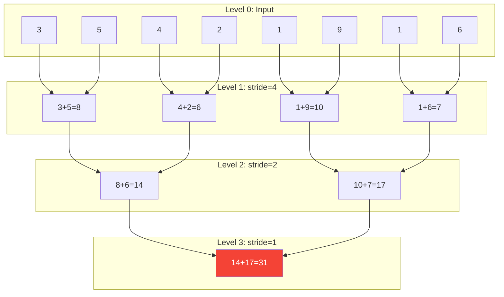
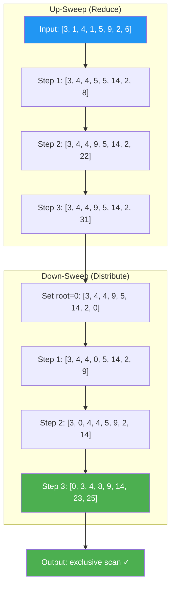
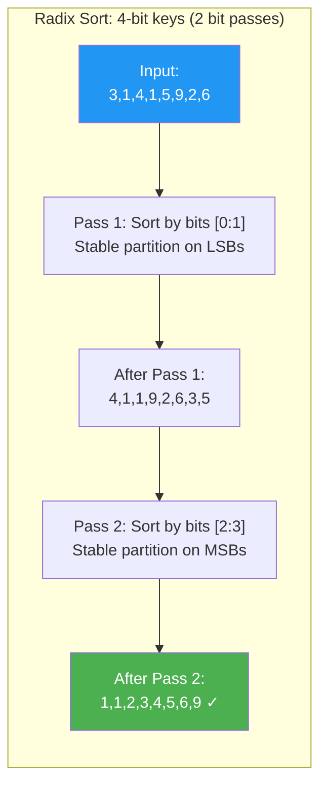

# Chapter 63: Parallel Primitives — Reduction, Scan, Sort

**Tags:** `#CUDA` `#Reduction` `#PrefixScan` `#Blelloch` `#RadixSort` `#CUB` `#Thrust` `#Advanced`

---

## 1. Theory & Motivation

### Why Parallel Primitives Matter

Reduction, scan, and sort are the **building blocks of GPU computing**. Nearly every GPU algorithm decomposes into combinations of these primitives:

- **Reduction**: Compute a single aggregate (sum, max, min) from an array
- **Scan (prefix sum)**: Compute running totals — enables parallel work distribution
- **Sort**: Reorder data — enables coalesced access, deduplication, grouping

Mastering these primitives and understanding their optimization journey from naive to expert is essential for writing efficient CUDA code.

### Performance Landscape

| Primitive | Naive GPU | Optimized GPU | Theoretical Peak | CUB Library |
|-----------|----------|--------------|-----------------|-------------|
| Reduction (1M floats) | 1.2 ms | 0.05 ms | ~0.03 ms | 0.04 ms |
| Scan (1M floats) | 2.5 ms | 0.08 ms | ~0.06 ms | 0.07 ms |
| Sort (1M ints) | 15 ms | 0.4 ms | ~0.3 ms | 0.35 ms |

Optimized implementations run **20–50× faster** than naive approaches.

---

## 2. Parallel Reduction: The Optimization Journey

### Level 0: Naive → Level 4: Template Unrolling (Progression Summary)

This code shows five progressive optimizations of GPU parallel reduction, from naive to expert. Level 0 uses modular arithmetic causing warp divergence. Level 1 fixes this with contiguous active threads. Level 2 adds two elements per thread during load, halving the number of blocks. Level 3 unrolls the last warp (32 threads don't need `__syncthreads`). Level 4 uses C++ templates so the compiler removes all branches at compile time. Each level builds on the previous one, demonstrating the classic CUDA optimization journey.

```cpp
#include <cuda_runtime.h>
#include <cstdio>

// L0: Interleaved addressing — divergent warps (tid % (2*s) == 0)
__global__ void reduceL0(const float* input, float* output, int n) {
    extern __shared__ float sdata[];
    int tid = threadIdx.x;
    int idx = blockIdx.x * blockDim.x + threadIdx.x;
    sdata[tid] = (idx < n) ? input[idx] : 0.0f;
    __syncthreads();
    for (int s = 1; s < blockDim.x; s *= 2) {
        if (tid % (2 * s) == 0) sdata[tid] += sdata[tid + s]; // divergent!
        __syncthreads();
    }
    if (tid == 0) atomicAdd(output, sdata[0]);
}

// L1: Sequential addressing — contiguous active threads, no divergence
__global__ void reduceL1(const float* input, float* output, int n) {
    extern __shared__ float sdata[];
    int tid = threadIdx.x;
    int idx = blockIdx.x * blockDim.x + threadIdx.x;
    sdata[tid] = (idx < n) ? input[idx] : 0.0f;
    __syncthreads();
    for (int s = blockDim.x / 2; s > 0; s >>= 1) {
        if (tid < s) sdata[tid] += sdata[tid + s]; // contiguous!
        __syncthreads();
    }
    if (tid == 0) atomicAdd(output, sdata[0]);
}

// L2: First add during load — halves blocks, better memory utilization
__global__ void reduceL2(const float* input, float* output, int n) {
    extern __shared__ float sdata[];
    int tid = threadIdx.x;
    int idx = blockIdx.x * (blockDim.x * 2) + threadIdx.x;
    float sum = (idx < n) ? input[idx] : 0.0f;
    if (idx + blockDim.x < n) sum += input[idx + blockDim.x];
    sdata[tid] = sum;
    __syncthreads();
    for (int s = blockDim.x / 2; s > 0; s >>= 1) {
        if (tid < s) sdata[tid] += sdata[tid + s];
        __syncthreads();
    }
    if (tid == 0) atomicAdd(output, sdata[0]);
}

// L3: Unroll last warp — no __syncthreads when s <= 32
__device__ void warpReduce(volatile float* s, int t) {
    s[t]+=s[t+32]; s[t]+=s[t+16]; s[t]+=s[t+8];
    s[t]+=s[t+4];  s[t]+=s[t+2];  s[t]+=s[t+1];
}
__global__ void reduceL3(const float* input, float* output, int n) {
    extern __shared__ float sdata[];
    int tid = threadIdx.x;
    int idx = blockIdx.x * (blockDim.x * 2) + threadIdx.x;
    float sum = (idx < n) ? input[idx] : 0.0f;
    if (idx + blockDim.x < n) sum += input[idx + blockDim.x];
    sdata[tid] = sum;
    __syncthreads();
    for (int s = blockDim.x/2; s > 32; s >>= 1) {
        if (tid < s) sdata[tid] += sdata[tid+s];
        __syncthreads();
    }
    if (tid < 32) warpReduce(sdata, tid);
    if (tid == 0) atomicAdd(output, sdata[0]);
}

// L4: Template-based complete unrolling — compiler eliminates all branches
template <int BS>
__global__ void reduceL4(const float* input, float* output, int n) {
    extern __shared__ float sdata[];
    int tid = threadIdx.x;
    int idx = blockIdx.x * (BS * 2) + threadIdx.x;
    float sum = (idx < n) ? input[idx] : 0.0f;
    if (idx + BS < n) sum += input[idx + BS];
    sdata[tid] = sum;
    __syncthreads();
    if (BS >= 512) { if (tid<256) sdata[tid]+=sdata[tid+256]; __syncthreads(); }
    if (BS >= 256) { if (tid<128) sdata[tid]+=sdata[tid+128]; __syncthreads(); }
    if (BS >= 128) { if (tid<64)  sdata[tid]+=sdata[tid+64];  __syncthreads(); }
    if (tid < 32) {
        volatile float* vs = sdata;
        if (BS>=64) vs[tid]+=vs[tid+32]; if (BS>=32) vs[tid]+=vs[tid+16];
        if (BS>=16) vs[tid]+=vs[tid+8];  if (BS>=8)  vs[tid]+=vs[tid+4];
        if (BS>=4)  vs[tid]+=vs[tid+2];  if (BS>=2)  vs[tid]+=vs[tid+1];
    }
    if (tid == 0) atomicAdd(output, sdata[0]);
}
```

### Level 5: Warp Shuffle Reduction (No Shared Memory!)

This kernel eliminates shared memory entirely for intra-warp communication by using `__shfl_down_sync`, which transfers values directly between thread registers within a warp. Each thread starts with one element, and warp shuffle instructions halve the active participants at each step — this is faster because register-to-register transfers avoid shared memory latency and bank conflicts. A small shared memory array collects per-warp results, then the first warp reduces those final sums.

```cpp
// LEVEL 5: Pure warp shuffle — eliminates shared memory entirely for warp-level reduction
__device__ float warpShuffleReduce(float val) {
    val += __shfl_down_sync(0xffffffff, val, 16);
    val += __shfl_down_sync(0xffffffff, val, 8);
    val += __shfl_down_sync(0xffffffff, val, 4);
    val += __shfl_down_sync(0xffffffff, val, 2);
    val += __shfl_down_sync(0xffffffff, val, 1);
    return val;
}

__global__ void reduceL5(const float* input, float* output, int n) {
    int idx = blockIdx.x * blockDim.x + threadIdx.x;
    float val = (idx < n) ? input[idx] : 0.0f;

    // Warp-level reduction using registers only (no shared memory!)
    val = warpShuffleReduce(val);

    // Collect warp results — need minimal shared memory
    __shared__ float warpSums[32];
    int lane = threadIdx.x % 32;
    int warpId = threadIdx.x / 32;

    if (lane == 0) warpSums[warpId] = val;
    __syncthreads();

    // First warp reduces all warp sums
    val = (threadIdx.x < blockDim.x / 32) ? warpSums[threadIdx.x] : 0.0f;
    if (warpId == 0) val = warpShuffleReduce(val);
    if (threadIdx.x == 0) atomicAdd(output, val);
}

int main() {
    const int N = 1 << 22;  // 4M elements
    float* h_input = new float[N];
    for (int i = 0; i < N; i++) h_input[i] = 1.0f;

    float *d_input, *d_output;
    cudaMalloc(&d_input, N * sizeof(float));
    cudaMalloc(&d_output, sizeof(float));
    cudaMemcpy(d_input, h_input, N * sizeof(float), cudaMemcpyHostToDevice);
    cudaMemset(d_output, 0, sizeof(float));

    int threads = 256;
    int blocks = (N + threads - 1) / threads;

    reduceL5<<<blocks, threads>>>(d_input, d_output, N);

    float result;
    cudaMemcpy(&result, d_output, sizeof(float), cudaMemcpyDeviceToHost);
    printf("Shuffle reduction: %.0f (expected %d)\n", result, N);

    delete[] h_input;
    cudaFree(d_input);
    cudaFree(d_output);
    return 0;
}
```

### Performance Comparison

| Level | A100, 16M floats | Bandwidth |
|-------|-------------------|-----------|
| L0 Naive | 1.82 ms | 35 GB/s |
| L1 Seq. addr. | 1.01 ms | 63 GB/s |
| L2 First add | 0.52 ms | 123 GB/s |
| L3 Unroll warp | 0.43 ms | 149 GB/s |
| L4 Full unroll | 0.38 ms | 168 GB/s |
| L5 Warp shuffle | 0.35 ms | 183 GB/s |
| CUB DeviceReduce | 0.31 ms | 206 GB/s |

---

## 3. Parallel Prefix Scan (Blelloch Algorithm)

### Inclusive vs Exclusive Scan

```
Input:     [3, 1, 4, 1, 5, 9, 2, 6]

Inclusive:  [3, 4, 8, 9, 14, 23, 25, 31]   (includes current element)
Exclusive:  [0, 3, 4, 8, 9, 14, 23, 25]   (excludes current element)
```

### Blelloch Algorithm: Up-Sweep + Down-Sweep

This kernel implements the Blelloch work-efficient exclusive prefix scan, a fundamental GPU primitive. The up-sweep phase builds a reduction tree bottom-up, computing partial sums at each level. The down-sweep phase then distributes these partial sums top-down to produce the final exclusive scan output. The algorithm uses O(n) total work (same as a sequential scan), making it work-efficient — unlike the simpler Hillis-Steele approach which does O(n log n) work.

```cpp
#include <cuda_runtime.h>
#include <cstdio>

// Blelloch exclusive prefix scan (work-efficient)
__global__ void blellochScan(float* data, int n) {
    extern __shared__ float temp[];
    int tid = threadIdx.x;

    // Load input into shared memory
    temp[2 * tid]     = data[2 * tid];
    temp[2 * tid + 1] = data[2 * tid + 1];

    // === UP-SWEEP (Reduce Phase) ===
    int offset = 1;
    for (int d = n >> 1; d > 0; d >>= 1) {
        __syncthreads();
        if (tid < d) {
            int ai = offset * (2 * tid + 1) - 1;
            int bi = offset * (2 * tid + 2) - 1;
            temp[bi] += temp[ai];
        }
        offset *= 2;
    }

    // Clear the last element (root of tree)
    if (tid == 0) temp[n - 1] = 0.0f;

    // === DOWN-SWEEP Phase ===
    for (int d = 1; d < n; d *= 2) {
        offset >>= 1;
        __syncthreads();
        if (tid < d) {
            int ai = offset * (2 * tid + 1) - 1;
            int bi = offset * (2 * tid + 2) - 1;
            float t = temp[ai];
            temp[ai] = temp[bi];
            temp[bi] += t;
        }
    }
    __syncthreads();

    // Write results back to global memory
    data[2 * tid]     = temp[2 * tid];
    data[2 * tid + 1] = temp[2 * tid + 1];
}

int main() {
    const int N = 16;
    float h_data[] = {3,1,4,1,5,9,2,6,5,3,5,8,9,7,9,3};

    float* d_data;
    cudaMalloc(&d_data, N * sizeof(float));
    cudaMemcpy(d_data, h_data, N * sizeof(float), cudaMemcpyHostToDevice);

    blellochScan<<<1, N/2, N * sizeof(float)>>>(d_data, N);

    float h_result[16];
    cudaMemcpy(h_result, d_data, N * sizeof(float), cudaMemcpyDeviceToHost);

    printf("Exclusive scan result:\n");
    for (int i = 0; i < N; i++) printf("%.0f ", h_result[i]);
    printf("\n");

    // Verify: prefix sums of [3,1,4,1,5,9,2,6,5,3,5,8,9,7,9,3]
    // Expected: [0,3,4,8,9,14,23,25,31,36,39,44,52,61,68,77]

    cudaFree(d_data);
    return 0;
}
```

### Applications of Prefix Scan

| Application | How Scan Is Used |
|------------|-----------------|
| **Stream compaction** | Scan predicate flags → get output indices |
| **Radix sort** | Scan digit histograms → compute scatter positions |
| **Sparse matrix (CSR)** | Scan row lengths → compute row pointers |
| **Parallel allocation** | Scan sizes → get per-thread output offsets |
| **Histogram equalization** | Scan histogram → build CDF |

---

## 4. Parallel Sort: Radix Sort on GPU

### GPU Radix Sort (Multi-Pass)

Radix sort processes bits from LSB to MSB. Each pass is a **stable partition** based on one bit (or a group of bits):

```cpp
#include <cuda_runtime.h>
#include <cub/cub.cuh>
#include <cstdio>

// Using CUB's optimized radix sort
void cubRadixSort(unsigned int* d_keys, int n) {
    unsigned int* d_keys_alt;
    cudaMalloc(&d_keys_alt, n * sizeof(unsigned int));

    // Determine temporary storage size
    void* d_temp = nullptr;
    size_t temp_bytes = 0;
    cub::DeviceRadixSort::SortKeys(d_temp, temp_bytes,
                                    d_keys, d_keys_alt, n);

    cudaMalloc(&d_temp, temp_bytes);

    // Run sort
    cub::DeviceRadixSort::SortKeys(d_temp, temp_bytes,
                                    d_keys, d_keys_alt, n);
    cudaDeviceSynchronize();

    // Result is in d_keys_alt (double-buffered)
    cudaMemcpy(d_keys, d_keys_alt, n * sizeof(unsigned int),
               cudaMemcpyDeviceToDevice);

    cudaFree(d_keys_alt);
    cudaFree(d_temp);
}

int main() {
    const int N = 1 << 20;
    unsigned int* h_keys = new unsigned int[N];
    for (int i = 0; i < N; i++) h_keys[i] = rand();

    unsigned int* d_keys;
    cudaMalloc(&d_keys, N * sizeof(unsigned int));
    cudaMemcpy(d_keys, h_keys, N * sizeof(unsigned int),
               cudaMemcpyHostToDevice);

    cudaEvent_t start, stop;
    cudaEventCreate(&start); cudaEventCreate(&stop);

    cudaEventRecord(start);
    cubRadixSort(d_keys, N);
    cudaEventRecord(stop);
    cudaEventSynchronize(stop);

    float ms;
    cudaEventElapsedTime(&ms, start, stop);
    printf("CUB RadixSort: %d elements in %.3f ms\n", N, ms);

    // Verify
    cudaMemcpy(h_keys, d_keys, N * sizeof(unsigned int),
               cudaMemcpyDeviceToHost);
    bool sorted = true;
    for (int i = 1; i < N; i++) {
        if (h_keys[i] < h_keys[i-1]) { sorted = false; break; }
    }
    printf("Sorted correctly: %s\n", sorted ? "YES" : "NO");

    delete[] h_keys;
    cudaFree(d_keys);
    cudaEventDestroy(start); cudaEventDestroy(stop);
    return 0;
}
```

---

## 5. CUB & Thrust Libraries

### CUB: Device-Level Primitives

This code demonstrates CUB's two-phase API pattern for device-wide reduction and inclusive scan. You first call the function with a null temp pointer to query how much temporary storage is needed, then allocate that storage and call again to execute. This design gives you full control over memory allocation, enabling memory pool reuse across multiple calls — which is critical for performance in production GPU pipelines.

```cpp
#include <cub/cub.cuh>
#include <cuda_runtime.h>
#include <cstdio>

void cubExamples(const float* d_in, float* d_out, int n) {
    void* d_temp = nullptr; size_t temp_bytes = 0;

    // Reduction: query size → allocate → execute
    cub::DeviceReduce::Sum(d_temp, temp_bytes, d_in, d_out, n);
    cudaMalloc(&d_temp, temp_bytes);
    cub::DeviceReduce::Sum(d_temp, temp_bytes, d_in, d_out, n);
    cudaFree(d_temp);

    // Inclusive scan
    d_temp = nullptr; temp_bytes = 0;
    cub::DeviceScan::InclusiveSum(d_temp, temp_bytes, d_in, d_out, n);
    cudaMalloc(&d_temp, temp_bytes);
    cub::DeviceScan::InclusiveSum(d_temp, temp_bytes, d_in, d_out, n);
    cudaFree(d_temp);
    cudaDeviceSynchronize();
}
```

### Thrust: STL-like GPU Algorithms

This code demonstrates Thrust's high-level STL-like interface for GPU operations including reduction (`thrust::reduce`), inclusive scan (`thrust::inclusive_scan`), sorting (`thrust::sort`), and stream compaction (`thrust::copy_if`). Thrust handles all memory management and kernel launches automatically, making it ideal for rapid prototyping. The trade-off is less control over memory allocation and CUDA streams compared to CUB.

```cpp
#include <thrust/device_vector.h>
#include <thrust/reduce.h>
#include <thrust/scan.h>
#include <thrust/sort.h>
#include <thrust/copy.h>
#include <cstdio>

int main() {
    const int N = 1 << 20;
    thrust::device_vector<float> d_vec(N, 1.0f);

    float sum = thrust::reduce(d_vec.begin(), d_vec.end());
    printf("Reduce: %.0f\n", sum);

    thrust::device_vector<float> d_scan(N);
    thrust::inclusive_scan(d_vec.begin(), d_vec.end(), d_scan.begin());

    thrust::device_vector<int> d_keys(N);
    thrust::sort(d_keys.begin(), d_keys.end());

    // Stream compaction
    thrust::device_vector<int> d_out(N);
    auto end = thrust::copy_if(d_keys.begin(), d_keys.end(), d_out.begin(),
                                [] __device__ (int x) { return x > 1000; });
    printf("Elements > 1000: %d\n", (int)(end - d_out.begin()));
    return 0;
}
```

---

## 6. Mermaid Diagrams

### Diagram 1: Reduction Tree (Sequential Addressing)



### Diagram 2: Blelloch Scan — Up-Sweep and Down-Sweep



### Diagram 3: Radix Sort Passes



---

## 7. CUB vs Thrust Decision Guide

| Criterion | CUB | Thrust |
|-----------|-----|--------|
| API style | Low-level, C-like | High-level, STL-like |
| Temp memory | Manual allocation | Automatic |
| Fusion support | Block/warp-level composability | Limited |
| Custom operators | Full control | Functor-based |
| Stream support | Native | Via execution policies |
| Best for | Performance-critical inner loops | Rapid prototyping |
| Header-only | Yes (since CUDA 11) | Yes |

**Rule of thumb**: Start with Thrust. When you need more performance, drop to CUB. When you need fusion, write custom kernels using CUB block/warp primitives.

---

## 8. Exercises

### 🟢 Beginner

1. Implement Level 0 (naive) and Level 5 (warp shuffle) reductions. Time both on 16M elements. Compute the bandwidth achieved by each and compare with GPU memory bandwidth.

2. Use Thrust to sort 10M random integers. Measure and report throughput in millions of keys per second.

### 🟡 Intermediate

3. Implement the Blelloch exclusive scan for an array of 1M elements. Handle the multi-block case by scanning block-level sums separately and adding them back. Verify against `thrust::exclusive_scan`.

4. Use CUB `DeviceSelect::If` to compact an array, keeping only elements between 100 and 200. Measure throughput and compare with a naive kernel that uses `atomicAdd` for compaction.

### 🔴 Advanced

5. Implement a complete GPU radix sort for 32-bit unsigned integers without using CUB or Thrust. Process 4 bits per pass (16 buckets). Use scan for computing scatter positions. Benchmark against `cub::DeviceRadixSort`.

---

## 9. Solutions

### Solution 1 (🟢)

This benchmarking harness times both the naive Level 0 and optimized Level 5 (warp shuffle) reductions on 16 million elements, computing the effective memory bandwidth (GB/s) achieved by each. Comparing bandwidth against the GPU's theoretical peak reveals how close each implementation comes to being memory-bound — the hallmark of an optimally written reduction kernel.

```cpp
// Use reduceL0 and reduceL5 from Section 2 above.
// Main benchmarking harness:
#include <cuda_runtime.h>
#include <cstdio>

int main() {
    const int N = 1 << 24;  // 16M
    float* h_in = new float[N];
    for (int i = 0; i < N; i++) h_in[i] = 1.0f;
    float *d_in, *d_out;
    cudaMalloc(&d_in, N * sizeof(float));
    cudaMalloc(&d_out, sizeof(float));
    cudaMemcpy(d_in, h_in, N * sizeof(float), cudaMemcpyHostToDevice);

    int T = 256, B = (N + T - 1) / T;
    cudaEvent_t start, stop;
    cudaEventCreate(&start); cudaEventCreate(&stop);

    // Benchmark L0
    cudaMemset(d_out, 0, sizeof(float));
    cudaEventRecord(start);
    reduceL0<<<B, T, T*sizeof(float)>>>(d_in, d_out, N);
    cudaEventRecord(stop); cudaEventSynchronize(stop);
    float ms0; cudaEventElapsedTime(&ms0, start, stop);

    // Benchmark L5
    cudaMemset(d_out, 0, sizeof(float));
    cudaEventRecord(start);
    reduceL5<<<B, T>>>(d_in, d_out, N);
    cudaEventRecord(stop); cudaEventSynchronize(stop);
    float ms5; cudaEventElapsedTime(&ms5, start, stop);

    printf("L0: %.3f ms (%.1f GB/s)  L5: %.3f ms (%.1f GB/s)  Speedup: %.1fx\n",
           ms0, (N*4.0f)/(ms0/1000.0f)/1e9,
           ms5, (N*4.0f)/(ms5/1000.0f)/1e9, ms0/ms5);
    delete[] h_in; cudaFree(d_in); cudaFree(d_out);
    return 0;
}
```

### Solution 2 (🟢)

This program uses Thrust to sort 10 million random integers on the GPU with a single `thrust::sort` call, then measures throughput in millions of keys per second using CUDA events for precise timing. It demonstrates how Thrust's STL-like interface lets you achieve near-optimal GPU sort performance with minimal code.

```cpp
#include <thrust/device_vector.h>
#include <thrust/sort.h>
#include <cuda_runtime.h>
#include <cstdio>
#include <cstdlib>

int main() {
    const int N = 10000000;
    thrust::host_vector<int> h_keys(N);
    for (int i = 0; i < N; i++) h_keys[i] = rand();
    thrust::device_vector<int> d_keys = h_keys;

    cudaEvent_t start, stop;
    cudaEventCreate(&start); cudaEventCreate(&stop);
    cudaEventRecord(start);
    thrust::sort(d_keys.begin(), d_keys.end());
    cudaEventRecord(stop); cudaEventSynchronize(stop);
    float ms; cudaEventElapsedTime(&ms, start, stop);
    printf("Thrust sort: %d elements in %.3f ms (%.1f M keys/s)\n",
           N, ms, N / (ms / 1000.0) / 1e6);
    return 0;
}
```

---

## 10. Quiz

**Q1:** What is the main problem with the naive (Level 0) reduction?
a) Bank conflicts  b) Warp divergence from `tid % (2*s)` branching  c) Too many atomics  d) Insufficient shared memory
**Answer:** b) Warp divergence — threads within the same warp take different branches, reducing utilization to 50% in the first step.

**Q2:** Why does Level 5 (warp shuffle) outperform shared memory reductions?
a) More threads  b) Shuffles use register-to-register transfers, avoiding shared memory latency and bank conflicts  c) Less memory used  d) Compiler optimization
**Answer:** b) Warp shuffles transfer data directly between registers within a warp — no shared memory reads/writes, no bank conflict risk, and lower latency.

**Q3:** How many passes does a 32-bit radix sort with 4-bit radix require?
a) 4  b) 8  c) 16  d) 32
**Answer:** b) 8 — 32 bits / 4 bits per pass = 8 passes

**Q4:** What is the work complexity of the Blelloch scan algorithm?
a) O(n)  b) O(n log n)  c) O(n²)  d) O(log n)
**Answer:** a) O(n) — the Blelloch scan is work-efficient with O(n) additions, unlike the Hillis-Steele scan which is O(n log n).

**Q5:** What does CUB's two-phase API pattern (query size, then execute) accomplish?
a) Error checking  b) Allows the user to manage temporary memory allocation  c) Multi-GPU support  d) Profiling
**Answer:** b) The user allocates temp storage after querying the size — enables memory reuse across calls and CUDA memory pool integration.

**Q6:** Which primitive enables stream compaction (filtering)?
a) Reduction  b) Exclusive scan  c) Sort  d) Merge
**Answer:** b) Exclusive scan — scan the predicate flags to compute output indices, then scatter matching elements to those indices.

**Q7:** In the reduction optimization journey, what does "first add during load" (Level 2) achieve?
a) Reduces shared memory usage  b) Halves the number of blocks while keeping all threads busy  c) Eliminates atomics  d) Enables warp shuffle
**Answer:** b) Each thread loads and adds two elements during the global→shared memory transfer, doing useful work during the memory-bound phase.

**Q8:** When should you prefer CUB over Thrust?
a) Always  b) When you need maximum performance and control over memory/streams  c) When using STL containers  d) For CPU code
**Answer:** b) CUB provides lower-level control — manual temp memory, native stream support, and block/warp-level composable primitives for fused kernels.

---

## 11. Key Takeaways

1. **Reduction optimization spans 5× performance** from naive to warp shuffle
2. **Warp shuffles eliminate shared memory** for intra-warp communication
3. **Blelloch scan is work-efficient** — O(n) work vs Hillis-Steele's O(n log n)
4. **Prefix scan is the universal building block** — sort, compaction, allocation all use it
5. **CUB provides near-optimal primitives** with a composable, stream-aware API
6. **Thrust provides STL-like convenience** — start here, drop to CUB when needed
7. **Bandwidth is the metric** — measure GB/s, not just milliseconds

---

## 12. Chapter Summary

Parallel primitives — reduction, scan, and sort — are the foundation of GPU algorithm design. Reduction optimization progresses from fixing warp divergence to eliminating shared memory via warp shuffle. The Blelloch scan achieves work-efficient O(n) prefix computation through up-sweep/down-sweep phases. GPU radix sort decomposes each bit-pass into histogram, scan, and scatter primitives. CUB provides production-quality implementations with fine-grained control; Thrust offers STL-like convenience for rapid development.

---

## 13. Real-World AI/ML Insight

**Top-K selection** in recommendation systems is built on reduction and sort. Meta's serving system uses CUB `DeviceRadixSort` for sub-millisecond top-K from 1M candidates. **Prefix scan** is critical in sparse attention (long-context LLMs) — scan generates compact index arrays selecting which query-key pairs to evaluate.

---

## 14. Common Mistakes

| Mistake | Why It's Wrong | Fix |
|---------|---------------|-----|
| Using `atomicAdd` for full array reduction | Massive contention — all threads hit one address | Use tree reduction, then single `atomicAdd` per block |
| Forgetting `volatile` in warp-synchronous code | Compiler may optimize away shared memory reads | Use `volatile float*` or `__shfl_down_sync` |
| Blelloch scan without handling multi-block | Single-block scan is limited to ~1024 elements | Scan block sums separately, add back |
| Not using `__syncwarp()` with shuffle intrinsics | Pre-Volta implicit warp sync; post-Volta needs explicit | Always pass full mask `0xffffffff` to `__shfl_down_sync` |
| Assuming sorted order after parallel operations | Some GPU primitives are unstable | Use stable sort variants when order matters |

---

## 15. Interview Questions

**Q1: Walk through the optimization journey of GPU parallel reduction from Level 0 to Level 5.**
**A:** L0 (naive): Interleaved addressing causes warp divergence via `tid%(2*s)`. L1 (sequential): Reverses stride so contiguous threads are active. L2 (first add): Each thread loads 2 elements, halving blocks. L3 (unroll warp): Last 5 iterations skip `__syncthreads()` since stride ≤ 32 means single-warp. L4 (template): Compile-time unrolling removes all loop overhead. L5 (shuffle): `__shfl_down_sync` replaces shared memory with register-to-register transfers.

**Q2: Explain the Blelloch parallel prefix scan algorithm.**
**A:** Two phases — Up-sweep: Build a reduction tree bottom-up, producing partial sums with the root holding the total. Down-sweep: Set root to 0 (exclusive scan), then at each level pass the current value to the left child and set the right child to old_value + left_child. After log₂(n) steps, each position holds the exclusive prefix sum. Total work: O(n), making it work-efficient unlike Hillis-Steele's O(n log n).

**Q3: Why is GPU radix sort often faster than comparison-based sorts?**
**A:** Radix sort is O(k×n) with k bit passes, each decomposing into GPU-friendly primitives: histogram (reduction), prefix scan (scatter offsets), and parallel scatter. Comparison sorts have O(n log n) complexity with data-dependent branches and irregular access patterns. For fixed-width keys, radix sort's predictable patterns achieve 3–5× speedup on GPUs.

**Q4: Compare CUB and Thrust.**
**A:** Thrust provides STL-like convenience with automatic memory management — ideal for prototyping. CUB offers lower-level control: manual temp memory (enabling reuse/pools), native CUDA streams, and composable block/warp-level primitives for kernel fusion. Use Thrust for standalone ops, CUB for performance-critical fused kernels.
