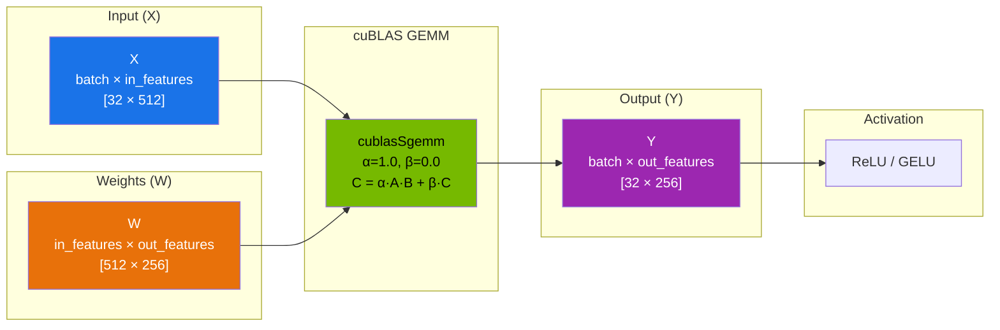
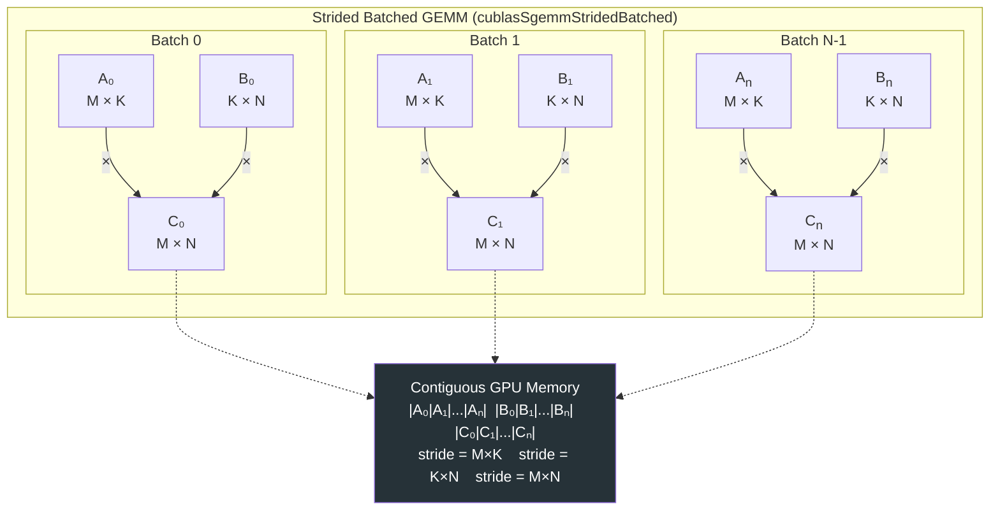

# Chapter 64 — cuBLAS: GPU Linear Algebra for ML

> **Difficulty:** ⚡ Advanced
> **Tags:** `#cuda` `#cublas` `#gemm` `#linear-algebra` `#ml-inference` `#tensor-cores`
> **Prerequisites:** Chapters 50–55 (CUDA Foundations), basic linear algebra (matrix multiplication)
> **Estimated Time:** 4–5 hours

---

## 1. Theory

### Why GEMM Is the Heart of Neural Networks

Every fully-connected (dense) layer in a neural network boils down to a single operation:

```
Y = X × W + b
```

where **X** is the input matrix (batch × features), **W** is the weight matrix (features × neurons), and **b** is a bias vector. That `X × W` is a **General Matrix Multiply (GEMM)** — the most compute-intensive operation in deep learning. Convolutional layers, attention mechanisms, and recurrent cells all decompose into GEMM at execution time.

A single forward pass through GPT-3 (175B parameters) performs thousands of large GEMMs. Optimizing GEMM by even 5% translates to millions of dollars in saved compute costs at scale.

**cuBLAS** is NVIDIA's implementation of the Basic Linear Algebra Subprograms (BLAS) for CUDA GPUs. It provides highly tuned routines for matrix operations that leverage Tensor Cores, memory hierarchy, and instruction-level parallelism — achieving performance that hand-written CUDA kernels rarely match.

### cuBLAS Core Concepts

**Handle:** Every cuBLAS call requires a `cublasHandle_t`. The handle holds internal state — stream association, math mode, workspace memory. Create one handle per GPU context and reuse it.

**Column-Major Order:** cuBLAS inherits Fortran's column-major convention. A matrix stored row-major in C/C++ must be interpreted carefully. For a row-major matrix **A** of dimensions M×N:
- cuBLAS sees it as a column-major matrix **Aᵀ** of dimensions N×M
- The leading dimension (lda) equals N (the row stride in memory)

This is the single most common source of bugs. The trick: for row-major data, swap the operand order and transpose flags: `C = A × B` becomes `cublasSgemm(..., B^T, A^T, ...)`.

**Leading Dimension:** The stride (in elements) between consecutive columns in column-major layout. For a column-major M×N matrix stored without padding, `lda = M`. For row-major, `lda = N`.

**Alpha/Beta Scalars:** GEMM computes `C = α·op(A)·op(B) + β·C`. These are passed by pointer (host or device) to allow device-side values from preceding kernels.

### Tensor Core Utilization

Modern NVIDIA GPUs (Volta+) include Tensor Cores that execute small matrix multiply-accumulate operations in hardware. cuBLAS automatically uses Tensor Cores when:
1. Math mode is set to `CUBLAS_TENSOR_OP_MATH` or `CUBLAS_DEFAULT_MATH`
2. Dimensions M, N, K are multiples of 8 (FP16) or 16 (INT8)
3. Data type supports it (FP16, BF16, TF32, INT8, FP8)

Tensor Core GEMMs can deliver 10–20× the throughput of standard FP32 CUDA cores.

---

## 2. Code Examples

### 2.1 — Single-Precision GEMM (cublasSgemm)

```cpp
// file: sgemm_basic.cu
// Compile: nvcc sgemm_basic.cu -lcublas -o sgemm_basic

#include <cstdio>
#include <cstdlib>
#include <cublas_v2.h>
#include <cuda_runtime.h>

// Macro for CUDA error checking
#define CUDA_CHECK(call) do {                                              \
    cudaError_t err = (call);                                              \
    if (err != cudaSuccess) {                                              \
        fprintf(stderr, "CUDA error %s:%d — %s\n",                        \
                __FILE__, __LINE__, cudaGetErrorString(err));               \
        exit(EXIT_FAILURE);                                                \
    }                                                                      \
} while (0)

// Macro for cuBLAS error checking
#define CUBLAS_CHECK(call) do {                                            \
    cublasStatus_t status = (call);                                        \
    if (status != CUBLAS_STATUS_SUCCESS) {                                 \
        fprintf(stderr, "cuBLAS error %s:%d — code %d\n",                 \
                __FILE__, __LINE__, (int)status);                           \
        exit(EXIT_FAILURE);                                                \
    }                                                                      \
} while (0)

// Fill matrix with sequential values for reproducibility
void fill_matrix(float* mat, int rows, int cols) {
    for (int j = 0; j < cols; ++j)
        for (int i = 0; i < rows; ++i)
            mat[j * rows + i] = static_cast<float>(i * cols + j) * 0.01f;
}

void print_matrix(const float* mat, int rows, int cols, const char* name) {
    printf("%s (%dx%d):\n", name, rows, cols);
    for (int i = 0; i < rows && i < 6; ++i) {
        for (int j = 0; j < cols && j < 6; ++j)
            printf("%8.3f", mat[j * rows + i]);  // column-major access
        printf("\n");
    }
    printf("\n");
}

int main() {
    // C = alpha * A * B + beta * C
    // A: M x K,  B: K x N,  C: M x N   (column-major)
    const int M = 4, K = 3, N = 5;
    const float alpha = 1.0f;
    const float beta  = 0.0f;

    // Host allocations (column-major)
    float h_A[M * K], h_B[K * N], h_C[M * N];
    fill_matrix(h_A, M, K);
    fill_matrix(h_B, K, N);

    // Device allocations
    float *d_A, *d_B, *d_C;
    CUDA_CHECK(cudaMalloc(&d_A, M * K * sizeof(float)));
    CUDA_CHECK(cudaMalloc(&d_B, K * N * sizeof(float)));
    CUDA_CHECK(cudaMalloc(&d_C, M * N * sizeof(float)));

    CUDA_CHECK(cudaMemcpy(d_A, h_A, M * K * sizeof(float), cudaMemcpyHostToDevice));
    CUDA_CHECK(cudaMemcpy(d_B, h_B, K * N * sizeof(float), cudaMemcpyHostToDevice));

    // Create cuBLAS handle
    cublasHandle_t handle;
    CUBLAS_CHECK(cublasCreate(&handle));

    // Perform GEMM: C = 1.0 * A * B + 0.0 * C
    // cublasSgemm(handle, transa, transb, m, n, k,
    //             &alpha, A, lda, B, ldb, &beta, C, ldc)
    CUBLAS_CHECK(cublasSgemm(
        handle,
        CUBLAS_OP_N,    // op(A) = A (no transpose)
        CUBLAS_OP_N,    // op(B) = B (no transpose)
        M, N, K,        // dimensions
        &alpha,
        d_A, M,         // A is M×K, leading dim = M
        d_B, K,         // B is K×N, leading dim = K
        &beta,
        d_C, M          // C is M×N, leading dim = M
    ));

    CUDA_CHECK(cudaMemcpy(h_C, d_C, M * N * sizeof(float), cudaMemcpyDeviceToHost));
    print_matrix(h_A, M, K, "A");
    print_matrix(h_B, K, N, "B");
    print_matrix(h_C, M, N, "C = A*B");

    // Cleanup
    CUBLAS_CHECK(cublasDestroy(handle));
    CUDA_CHECK(cudaFree(d_A));
    CUDA_CHECK(cudaFree(d_B));
    CUDA_CHECK(cudaFree(d_C));
    return 0;
}
```

### 2.2 — Mixed-Precision GEMM with cublasGemmEx

```cpp
// file: mixed_precision_gemm.cu
// Compile: nvcc mixed_precision_gemm.cu -lcublas -o mixed_gemm

#include <cstdio>
#include <cstdlib>
#include <cublas_v2.h>
#include <cuda_fp16.h>
#include <cuda_runtime.h>

#define CUDA_CHECK(call)                                                   \
    do {                                                                   \
        cudaError_t err = (call);                                          \
        if (err != cudaSuccess) {                                          \
            fprintf(stderr, "CUDA error: %s\n", cudaGetErrorString(err));  \
            exit(1);                                                       \
        }                                                                  \
    } while (0)

#define CUBLAS_CHECK(call)                                                 \
    do {                                                                   \
        cublasStatus_t s = (call);                                         \
        if (s != CUBLAS_STATUS_SUCCESS) {                                  \
            fprintf(stderr, "cuBLAS error: %d\n", (int)s);                \
            exit(1);                                                       \
        }                                                                  \
    } while (0)

int main() {
    const int M = 1024, N = 1024, K = 1024;

    // Allocate FP16 inputs and FP32 output on device
    half *d_A, *d_B;
    float *d_C;
    CUDA_CHECK(cudaMalloc(&d_A, M * K * sizeof(half)));
    CUDA_CHECK(cudaMalloc(&d_B, K * N * sizeof(half)));
    CUDA_CHECK(cudaMalloc(&d_C, M * N * sizeof(float)));
    CUDA_CHECK(cudaMemset(d_A, 0, M * K * sizeof(half)));
    CUDA_CHECK(cudaMemset(d_B, 0, K * N * sizeof(half)));

    const float alpha = 1.0f, beta = 0.0f;

    cublasHandle_t handle;
    CUBLAS_CHECK(cublasCreate(&handle));

    // Enable Tensor Core math
    CUBLAS_CHECK(cublasSetMathMode(handle, CUBLAS_TENSOR_OP_MATH));

    // Mixed precision: FP16 inputs, FP32 compute, FP32 output
    CUBLAS_CHECK(cublasGemmEx(
        handle,
        CUBLAS_OP_N, CUBLAS_OP_N,
        M, N, K,
        &alpha,
        d_A, CUDA_R_16F, M,   // A: FP16
        d_B, CUDA_R_16F, K,   // B: FP16
        &beta,
        d_C, CUDA_R_32F, M,   // C: FP32
        CUBLAS_COMPUTE_32F,    // Accumulation in FP32
        CUBLAS_GEMM_DEFAULT_TENSOR_OP  // Let cuBLAS pick best algo
    ));

    CUDA_CHECK(cudaDeviceSynchronize());
    printf("Mixed-precision GEMM (%dx%dx%d) completed.\n", M, N, K);
    printf("  Input:  FP16\n  Compute: FP32\n  Output: FP32\n");

    CUBLAS_CHECK(cublasDestroy(handle));
    CUDA_CHECK(cudaFree(d_A));
    CUDA_CHECK(cudaFree(d_B));
    CUDA_CHECK(cudaFree(d_C));
    return 0;
}
```

### 2.3 — Batched GEMM for Batch Processing

```cpp
// file: batched_gemm.cu
// Compile: nvcc batched_gemm.cu -lcublas -o batched_gemm

#include <cstdio>
#include <cstdlib>
#include <cublas_v2.h>
#include <cuda_runtime.h>

#define CUDA_CHECK(call) { cudaError_t e=(call); if(e!=cudaSuccess){ \
    fprintf(stderr,"CUDA %s:%d %s\n",__FILE__,__LINE__,cudaGetErrorString(e)); exit(1);}}
#define CUBLAS_CHECK(call) { cublasStatus_t s=(call); if(s!=CUBLAS_STATUS_SUCCESS){ \
    fprintf(stderr,"cuBLAS %s:%d %d\n",__FILE__,__LINE__,(int)s); exit(1);}}

int main() {
    const int M = 64, N = 64, K = 128;
    const int batchCount = 32;  // Process 32 samples simultaneously
    const float alpha = 1.0f, beta = 0.0f;

    // ── Approach 1: Strided Batched GEMM ──────────────────────
    // All matrices packed contiguously with fixed strides
    long long strideA = (long long)M * K;
    long long strideB = (long long)K * N;
    long long strideC = (long long)M * N;

    float *d_A, *d_B, *d_C;
    CUDA_CHECK(cudaMalloc(&d_A, strideA * batchCount * sizeof(float)));
    CUDA_CHECK(cudaMalloc(&d_B, strideB * batchCount * sizeof(float)));
    CUDA_CHECK(cudaMalloc(&d_C, strideC * batchCount * sizeof(float)));

    // In practice, fill with actual data; zero-fill here for demonstration
    CUDA_CHECK(cudaMemset(d_A, 0, strideA * batchCount * sizeof(float)));
    CUDA_CHECK(cudaMemset(d_B, 0, strideB * batchCount * sizeof(float)));

    cublasHandle_t handle;
    CUBLAS_CHECK(cublasCreate(&handle));

    // One API call multiplies all 32 matrix pairs
    CUBLAS_CHECK(cublasSgemmStridedBatched(
        handle,
        CUBLAS_OP_N, CUBLAS_OP_N,
        M, N, K,
        &alpha,
        d_A, M, strideA,   // A[i] at d_A + i*strideA
        d_B, K, strideB,   // B[i] at d_B + i*strideB
        &beta,
        d_C, M, strideC,   // C[i] at d_C + i*strideC
        batchCount
    ));

    CUDA_CHECK(cudaDeviceSynchronize());
    printf("Strided batched GEMM: %d × (%dx%d · %dx%d) done.\n",
           batchCount, M, K, K, N);

    // ── Approach 2: Pointer-Array Batched GEMM ────────────────
    // Each matrix can be at an arbitrary address
    float **h_Aptr = new float*[batchCount];
    float **h_Bptr = new float*[batchCount];
    float **h_Cptr = new float*[batchCount];

    for (int i = 0; i < batchCount; ++i) {
        h_Aptr[i] = d_A + i * strideA;
        h_Bptr[i] = d_B + i * strideB;
        h_Cptr[i] = d_C + i * strideC;
    }

    float **d_Aptr, **d_Bptr, **d_Cptr;
    CUDA_CHECK(cudaMalloc(&d_Aptr, batchCount * sizeof(float*)));
    CUDA_CHECK(cudaMalloc(&d_Bptr, batchCount * sizeof(float*)));
    CUDA_CHECK(cudaMalloc(&d_Cptr, batchCount * sizeof(float*)));
    CUDA_CHECK(cudaMemcpy(d_Aptr, h_Aptr, batchCount*sizeof(float*), cudaMemcpyHostToDevice));
    CUDA_CHECK(cudaMemcpy(d_Bptr, h_Bptr, batchCount*sizeof(float*), cudaMemcpyHostToDevice));
    CUDA_CHECK(cudaMemcpy(d_Cptr, h_Cptr, batchCount*sizeof(float*), cudaMemcpyHostToDevice));

    CUBLAS_CHECK(cublasSgemmBatched(
        handle,
        CUBLAS_OP_N, CUBLAS_OP_N,
        M, N, K,
        &alpha,
        (const float**)d_Aptr, M,
        (const float**)d_Bptr, K,
        &beta,
        d_Cptr, M,
        batchCount
    ));

    CUDA_CHECK(cudaDeviceSynchronize());
    printf("Pointer-array batched GEMM: %d batches done.\n", batchCount);

    // Cleanup
    delete[] h_Aptr; delete[] h_Bptr; delete[] h_Cptr;
    CUDA_CHECK(cudaFree(d_Aptr)); CUDA_CHECK(cudaFree(d_Bptr));
    CUDA_CHECK(cudaFree(d_Cptr));
    CUDA_CHECK(cudaFree(d_A)); CUDA_CHECK(cudaFree(d_B)); CUDA_CHECK(cudaFree(d_C));
    CUBLAS_CHECK(cublasDestroy(handle));
    return 0;
}
```

### 2.4 — Forward and Backward Pass with cuBLAS

```cpp
// file: forward_backward.cu
// Demonstrates a single linear layer: forward + backward using cuBLAS
// Compile: nvcc forward_backward.cu -lcublas -o fwd_bwd

#include <cstdio>
#include <cublas_v2.h>
#include <cuda_runtime.h>

#define CUDA_CHECK(c) { cudaError_t e=(c); if(e) { fprintf(stderr,"%s\n",cudaGetErrorString(e)); exit(1); } }
#define CUBLAS_CHECK(c) { cublasStatus_t s=(c); if(s) { fprintf(stderr,"cublas %d\n",(int)s); exit(1); } }

int main() {
    // Linear layer: Y = X * W   (row-major convention)
    // X: [batch=32, in_features=512]
    // W: [in_features=512, out_features=256]
    // Y: [batch=32, out_features=256]
    const int batch = 32, in_f = 512, out_f = 256;
    const float one = 1.0f, zero = 0.0f;

    float *d_X, *d_W, *d_Y, *d_dY, *d_dX, *d_dW;
    CUDA_CHECK(cudaMalloc(&d_X,  batch * in_f  * sizeof(float)));
    CUDA_CHECK(cudaMalloc(&d_W,  in_f  * out_f * sizeof(float)));
    CUDA_CHECK(cudaMalloc(&d_Y,  batch * out_f * sizeof(float)));
    CUDA_CHECK(cudaMalloc(&d_dY, batch * out_f * sizeof(float)));
    CUDA_CHECK(cudaMalloc(&d_dX, batch * in_f  * sizeof(float)));
    CUDA_CHECK(cudaMalloc(&d_dW, in_f  * out_f * sizeof(float)));

    cublasHandle_t handle;
    CUBLAS_CHECK(cublasCreate(&handle));

    // ── FORWARD PASS ──────────────────────────────────────────
    // Row-major: Y = X · W  →  cuBLAS column-major: Y^T = W^T · X^T
    // Y^T is (out_f × batch), W^T is (out_f × in_f), X^T is (in_f × batch)
    CUBLAS_CHECK(cublasSgemm(
        handle,
        CUBLAS_OP_N,     // W^T: no further transpose needed
        CUBLAS_OP_N,     // X^T: no further transpose needed
        out_f, batch, in_f,
        &one,
        d_W, out_f,      // W stored row-major → col-major W^T, ld=out_f
        d_X, in_f,       // X stored row-major → col-major X^T, ld=in_f
        &zero,
        d_Y, out_f       // Y stored row-major → col-major Y^T, ld=out_f
    ));
    printf("Forward pass:  Y[%d×%d] = X[%d×%d] × W[%d×%d]\n",
           batch, out_f, batch, in_f, in_f, out_f);

    // ── BACKWARD PASS ─────────────────────────────────────────
    // dX = dY · W^T   →  cuBLAS: dX^T = W · dY^T
    CUBLAS_CHECK(cublasSgemm(
        handle,
        CUBLAS_OP_T,     // W^T transposed back → W
        CUBLAS_OP_N,     // dY^T
        in_f, batch, out_f,
        &one,
        d_W, out_f,      // W with ld=out_f, transposed → in_f × out_f
        d_dY, out_f,     // dY^T: out_f × batch
        &zero,
        d_dX, in_f       // dX^T: in_f × batch
    ));
    printf("Backward dX:   dX[%d×%d] = dY[%d×%d] × W^T[%d×%d]\n",
           batch, in_f, batch, out_f, out_f, in_f);

    // dW = X^T · dY   →  cuBLAS: dW^T = dY^T · X
    //                                   (out_f×batch) · (batch×in_f)
    CUBLAS_CHECK(cublasSgemm(
        handle,
        CUBLAS_OP_N,     // dY^T
        CUBLAS_OP_T,     // X^T transposed → X
        out_f, in_f, batch,
        &one,
        d_dY, out_f,     // dY^T: out_f × batch
        d_X, in_f,       // X^T with ld=in_f, transposed → batch × in_f
        &zero,
        d_dW, out_f      // dW^T: out_f × in_f
    ));
    printf("Backward dW:   dW[%d×%d] = X^T[%d×%d] × dY[%d×%d]\n",
           in_f, out_f, in_f, batch, batch, out_f);

    CUBLAS_CHECK(cublasDestroy(handle));
    CUDA_CHECK(cudaFree(d_X));  CUDA_CHECK(cudaFree(d_W));  CUDA_CHECK(cudaFree(d_Y));
    CUDA_CHECK(cudaFree(d_dY)); CUDA_CHECK(cudaFree(d_dX)); CUDA_CHECK(cudaFree(d_dW));
    return 0;
}
```

---

## 3. Diagrams

### Diagram 1 — Neural Network Layer as GEMM Operation



### Diagram 2 — Batched GEMM: Multiple Matrix Pairs



---

## 4. Performance Tuning

### Algorithm Selection

`cublasGemmEx` accepts a `cublasGemmAlgo_t` to select from multiple internal implementations:

| Algorithm Constant | Description |
|---|---|
| `CUBLAS_GEMM_DEFAULT` | cuBLAS picks heuristically |
| `CUBLAS_GEMM_DEFAULT_TENSOR_OP` | Prefer Tensor Core path |
| `CUBLAS_GEMM_ALGO0` – `CUBLAS_GEMM_ALGO23` | Specific CUDA-core algorithms |
| `CUBLAS_GEMM_ALGO0_TENSOR_OP` – `CUBLAS_GEMM_ALGO15_TENSOR_OP` | Specific Tensor Core algorithms |

**Best practice:** Benchmark all algorithms for your specific (M, N, K) and pick the fastest. Libraries like cuBLAS LT and PyTorch's `torch.backends.cuda.matmul` automate this.

### Math Mode

```cpp
// Enable TF32 on Ampere+ (faster FP32 with slightly reduced precision)
cublasSetMathMode(handle, CUBLAS_TF32_TENSOR_OP_MATH);

// Force strict FP32 (no Tensor Cores for FP32)
cublasSetMathMode(handle, CUBLAS_PEDANTIC_MATH);

// Default: allows TF32 on Ampere, standard on older GPUs
cublasSetMathMode(handle, CUBLAS_DEFAULT_MATH);
```

### Custom GEMM vs cuBLAS: A Comparison

| Aspect | Custom CUDA Kernel | cuBLAS |
|---|---|---|
| **Peak % of theoretical FLOPS** | 30–60% (expert: 70–80%) | 85–95% |
| **Tensor Core support** | Manual `wmma` / `mma.sync` | Automatic |
| **Tiling & double-buffering** | Must implement yourself | Built-in |
| **Time to implement** | Weeks to months | 1 API call |
| **Flexibility** | Can fuse custom operations | GEMM only (use cuBLAS LT for fusion) |
| **Maintainability** | Must update per GPU arch | NVIDIA maintains it |

---

## 5. Exercises

### 🟢 Exercise 1 — Basic SGEMM

Write a program that multiplies two 128×128 matrices using `cublasSgemm`. Verify the result by comparing against a CPU implementation. Print the maximum absolute error.

### 🟡 Exercise 2 — Row-Major to Column-Major

You have two matrices stored in **row-major** order in C arrays. Without rearranging the data in memory, use `cublasSgemm` with appropriate transpose flags and dimension swaps to compute their product correctly. Verify against the CPU reference.

### 🟡 Exercise 3 — Batched Forward Pass

Implement a batched forward pass for a 3-layer MLP (784→256→128→10) using `cublasSgemmStridedBatched`. Process a batch of 64 MNIST-sized inputs. Print the output dimensions at each layer.

### 🔴 Exercise 4 — Algorithm Benchmarking

Write a benchmark that tests all `CUBLAS_GEMM_ALGO*` variants for a 4096×4096×4096 FP16 GEMM using `cublasGemmEx`. Record the time for each and report the top 3 fastest algorithms. Use CUDA events for timing.

### 🔴 Exercise 5 — Complete Training Step

Implement a full forward + backward pass for a single linear layer with gradient descent weight update. Use cuBLAS for all matrix operations. Verify that weights converge on a simple regression target (e.g., learn the identity mapping).

---

## 6. Solutions

### Solution 1 — Basic SGEMM

Follows the structure of Example 2.1. The key addition is a CPU reference loop for verification:

```cpp
// CPU reference (column-major layout)
for (int j = 0; j < N; j++)
    for (int i = 0; i < N; i++) {
        float sum = 0;
        for (int k = 0; k < N; k++)
            sum += h_A[k*N + i] * h_B[j*N + k];
        h_ref[j*N + i] = sum;
    }

// After cublasSgemm, compare:
float maxErr = 0;
for (int i = 0; i < N*N; i++)
    maxErr = fmaxf(maxErr, fabsf(h_C[i] - h_ref[i]));
printf("Max absolute error: %e\n", maxErr);  // expect ~1e-5 for N=128
```

### Solution 2 — Row-Major Trick

```cpp
// Key insight: For row-major A (M×K) and B (K×N), computing C = A*B:
// cuBLAS sees them as column-major A^T (K×M) and B^T (N×K).
// We want C^T = (A·B)^T = B^T · A^T — so swap operands!
cublasSgemm(handle, CUBLAS_OP_N, CUBLAS_OP_N,
            N, M, K,           // note: N first, then M
            &alpha,
            d_B, N,            // "B^T" in col-major has ld=N
            d_A, K,            // "A^T" in col-major has ld=K
            &beta,
            d_C, N);           // "C^T" in col-major has ld=N
// Result d_C now holds C in row-major order — no data rearrangement needed.
```

---

## 7. Quiz

**Q1.** What memory layout does cuBLAS expect by default?

- (a) Row-major
- (b) Column-major ✅
- (c) Block-cyclic
- (d) Sparse CSR

**Q2.** In `cublasSgemm(handle, opA, opB, M, N, K, &α, A, lda, B, ldb, &β, C, ldc)`, what does `lda` represent for a column-major matrix A of size M×K with no padding?

- (a) K
- (b) M ✅
- (c) M × K
- (d) The number of non-zero elements

**Q3.** Which cuBLAS function supports mixed input/output data types (e.g., FP16 input, FP32 output)?

- (a) `cublasSgemm`
- (b) `cublasHgemm`
- (c) `cublasGemmEx` ✅
- (d) `cublasDgemm`

**Q4.** To compute the backward pass gradient `dX = dY · Wᵀ` using cuBLAS, which transpose flag should be applied to `W`?

- (a) `CUBLAS_OP_N`
- (b) `CUBLAS_OP_T` ✅
- (c) `CUBLAS_OP_C`
- (d) No flag needed; cuBLAS auto-detects

**Q5.** What is the main advantage of `cublasSgemmStridedBatched` over `cublasSgemmBatched`?

- (a) It supports larger matrices
- (b) It avoids the overhead of a device pointer array ✅
- (c) It is always faster
- (d) It supports mixed precision

**Q6.** Which math mode enables TF32 Tensor Core operations on Ampere GPUs for FP32 inputs?

- (a) `CUBLAS_PEDANTIC_MATH`
- (b) `CUBLAS_DEFAULT_MATH`
- (c) `CUBLAS_TF32_TENSOR_OP_MATH` ✅
- (d) `CUBLAS_TENSOR_OP_MATH`

**Q7.** For Tensor Cores to be utilized with FP16 data, matrix dimensions should ideally be multiples of:

- (a) 2
- (b) 4
- (c) 8 ✅
- (d) 32

**Q8.** A typical cuBLAS SGEMM on modern GPUs achieves what percentage of peak theoretical FLOPS?

- (a) 30–40%
- (b) 50–60%
- (c) 70–80%
- (d) 85–95% ✅

---

## 8. Key Takeaways

- **GEMM is the computational core of deep learning** — every linear layer, convolution (via im2col), and attention head decomposes into matrix multiplication.
- **cuBLAS provides near-peak GPU utilization** (85–95% of theoretical FLOPS) with a single API call — don't write your own GEMM unless you need custom fusion.
- **Column-major layout** is the default. For row-major C/C++ data, swap operand order (`C = A·B` becomes `cublas(B^T, A^T)`) rather than transposing data.
- **`cublasGemmEx` is the workhorse for ML** — it supports mixed precision (FP16 in, FP32 accumulate), Tensor Core acceleration, and algorithm selection.
- **Batched GEMM** (`StridedBatched` preferred) eliminates kernel launch overhead when processing multiple independent matrix pairs.
- **Tensor Cores** deliver 10–20× throughput over CUDA cores; cuBLAS enables them through math mode settings and data type choices.
- **Pad dimensions to multiples of 8** (FP16) or 16 (INT8) to enable Tensor Core fast paths.
- **Alpha/beta are passed by pointer** — this allows device-resident scalars from prior kernels without an extra host-device sync.
- **The backward pass is just more GEMM** — `dX = dY · Wᵀ` and `dW = Xᵀ · dY` require only transpose flags, not data movement.
- **Always use error-checking macros** — silent cuBLAS failures are notoriously hard to debug.

---

## 9. Chapter Summary

This chapter covered cuBLAS as the foundational GPU library for matrix operations in machine learning. We started with why GEMM dominates neural network compute, then explored the cuBLAS API from handle creation through single-precision, mixed-precision, and batched GEMM calls. The critical column-major vs. row-major distinction was addressed with the operand-swap trick that avoids costly data transpositions. We demonstrated a complete forward and backward pass for a linear layer using only `cublasSgemm` calls with appropriate transpose flags. Performance tuning through algorithm selection, math modes, and Tensor Core enablement was covered, along with a realistic comparison showing why cuBLAS outperforms hand-written kernels. The exercises progress from basic verification through production-grade training loops.

---

## 10. Real-World Insight

> **PyTorch and TensorFlow call cuBLAS under the hood.** When you write `torch.nn.Linear(512, 256)` and run a forward pass, PyTorch dispatches to `cublasGemmEx` (or cuBLAS LT on newer versions). The framework handles the row-major to column-major translation, workspace allocation, and algorithm selection transparently. Understanding cuBLAS directly becomes critical when:
> - You're writing custom CUDA extensions for operations not in standard frameworks
> - You're building inference engines (TensorRT, custom serving) that need maximum throughput
> - You're debugging numerical mismatches between CPU and GPU results
> - You're optimizing multi-GPU training where GEMM latency directly impacts scaling efficiency
>
> At companies like NVIDIA, Google, and Meta, ML infrastructure teams routinely profile cuBLAS calls to find the optimal (M, N, K) decomposition, pad dimensions for Tensor Core alignment, and select algorithms per layer. A 3% GEMM improvement across a 1000-GPU training cluster saves hundreds of GPU-hours per run.

---

## 11. Common Mistakes

| Mistake | Symptom | Fix |
|---|---|---|
| **Wrong leading dimension** | Garbled output, crashes | For col-major M×N: `lda = M`. For row-major: `lda = num_columns` |
| **Forgetting column-major order** | Transposed or scrambled results | Swap operands for row-major: `C = A·B` → `cublas(B, A)` with adjusted dims |
| **Not checking cuBLAS status** | Silent wrong results | Always wrap calls in `CUBLAS_CHECK()` macro |
| **Mismatched alpha/beta pointer location** | Crash or wrong scaling | If alpha/beta are on host (default), use `cublasSetPointerMode(handle, CUBLAS_POINTER_MODE_HOST)` |
| **Dimensions not aligned for Tensor Cores** | Falls back to slower CUDA-core path | Pad M, N, K to multiples of 8 (FP16) or 4 (TF32) |
| **Creating handle per GEMM call** | Massive overhead, 100× slower | Create once, reuse across all calls |
| **Ignoring stream association** | Unexpected serialization | Use `cublasSetStream()` to assign the handle to your CUDA stream |
| **Using `cublasSgemmBatched` for contiguous data** | Extra pointer-array overhead | Use `cublasSgemmStridedBatched` when matrices are contiguous with uniform stride |

---

## 12. Interview Questions

### Q1: Why is GEMM central to deep learning, and how does cuBLAS optimize it?

**Answer:** Every fully-connected layer computes `Y = X·W + b`, where the matrix multiply `X·W` is a GEMM. Convolutions are converted to GEMM via im2col, and attention computes `Q·K^T` and `scores·V` — also GEMMs. cuBLAS optimizes GEMM through: (1) **tiled algorithms** that maximize L1/L2/shared memory reuse, (2) **Tensor Core** utilization for FP16/BF16/TF32 with hardware multiply-accumulate, (3) **auto-tuning** across multiple algorithm variants, and (4) **double-buffering** that overlaps global memory loads with computation. A well-tuned cuBLAS GEMM reaches 85–95% of peak GPU FLOPS, while naive implementations rarely exceed 30%.

### Q2: Explain how to multiply row-major matrices using cuBLAS without transposing data.

**Answer:** cuBLAS assumes column-major layout. A row-major matrix `A[M×K]` is equivalent to the column-major transpose `A^T[K×M]` in the same memory. To compute the row-major product `C = A·B`:

1. cuBLAS sees `A^T` (K×M) and `B^T` (N×K) in memory
2. We want `C^T = (A·B)^T = B^T · A^T`
3. Call: `cublasSgemm(handle, CUBLAS_OP_N, CUBLAS_OP_N, N, M, K, &alpha, d_B, N, d_A, K, &beta, d_C, N)`
4. The result `d_C` is `C^T` in column-major, which is `C` in row-major — exactly what we need

This avoids an explicit transpose kernel, which would cost O(M×K) memory bandwidth for no compute.

### Q3: Compare `cublasSgemmBatched` vs `cublasSgemmStridedBatched`. When would you use each?

**Answer:** Both multiply batches of matrix pairs in a single API call. **StridedBatched** assumes all A matrices (and all B, C) are packed contiguously with a fixed stride between them — it requires no pointer array and has lower launch overhead. This is ideal for batch processing in neural networks where data is naturally contiguous. **Batched** (pointer-array version) takes an array of device pointers, allowing each matrix to be at an arbitrary memory address. Use it when matrices are non-contiguously allocated (e.g., gathered from different buffers) or have variable sizes within the batch. In practice, StridedBatched is preferred 90%+ of the time in ML workloads.

### Q4: How do Tensor Cores interact with cuBLAS, and what conditions must be met?

**Answer:** Tensor Cores are hardware units that compute small matrix multiply-accumulate operations (e.g., 4×4×4 for FP16 on Volta, 8×4×8 on Ampere). cuBLAS automatically dispatches to Tensor Core kernels when: (1) Math mode is set appropriately (`CUBLAS_TENSOR_OP_MATH` or `CUBLAS_DEFAULT_MATH` on Ampere+); (2) Data types support it — FP16, BF16, TF32, INT8, FP8; (3) Dimensions M, N, K are multiples of 8 for FP16 or multiples of 4 for TF32. Non-aligned dimensions still work but fall back to CUDA-core paths for the remainder tiles. Using `cublasGemmEx` with `CUBLAS_COMPUTE_32F` and FP16 inputs is the most common Tensor Core configuration in production ML inference.

### Q5: Walk through the cuBLAS calls needed for the backward pass of a linear layer.

**Answer:** Given forward pass `Y = X·W` with loss gradient `dY`:

1. **Gradient w.r.t. input:** `dX = dY · W^T` — Use `cublasSgemm` with `CUBLAS_OP_T` on W. This propagates gradients to the preceding layer.
2. **Gradient w.r.t. weights:** `dW = X^T · dY` — Use `cublasSgemm` with `CUBLAS_OP_T` on X. This is accumulated (β=1.0) if processing multiple micro-batches.
3. **Weight update:** `W -= lr · dW` — Use `cublasSaxpy` with alpha = -lr, or a custom kernel.

All three operations are GEMMs with different transpose configurations. No data rearrangement is needed — only the `CUBLAS_OP_T` / `CUBLAS_OP_N` flags change. This is why cuBLAS is the computational backbone of training frameworks: the same function handles forward, backward-data, and backward-weight with just flag changes.
