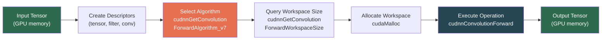
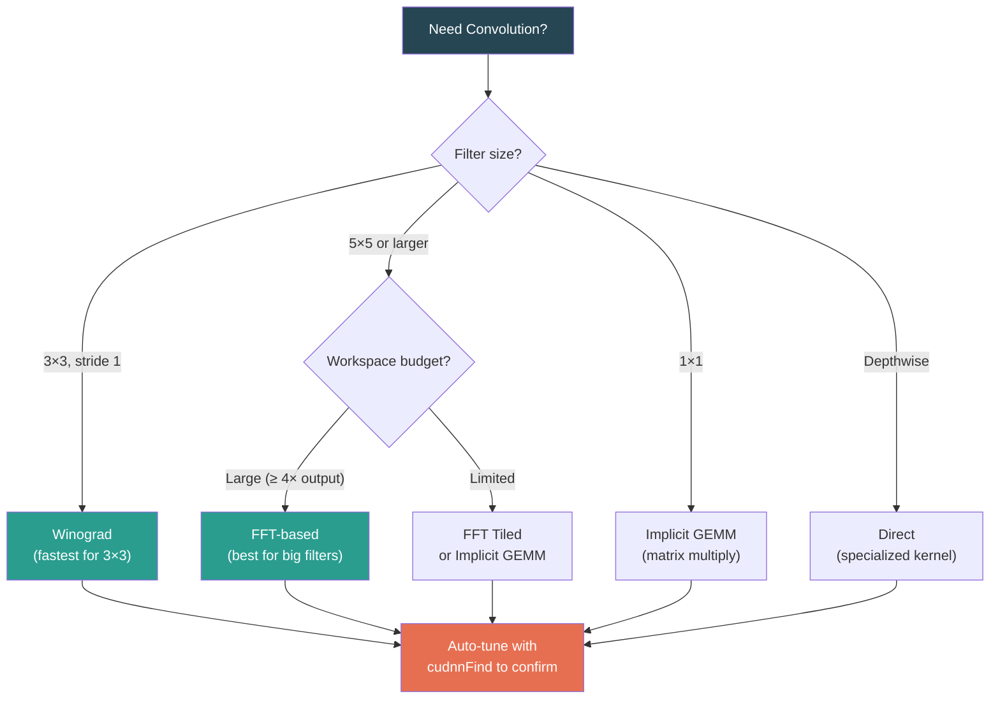

# Chapter 65: cuDNN — Deep Learning Primitives

**Difficulty:** ⭐⭐⭐⭐ (Advanced)
**Tags:** `cuDNN` · `Deep Learning` · `Convolution` · `GPU Acceleration` · `Neural Networks` · `CUDA Libraries`

---
## 1. Theory: What Is cuDNN and Why Does It Matter?

### What

cuDNN (CUDA Deep Neural Network library) is NVIDIA's GPU-accelerated library of primitives for deep neural networks. It provides highly tuned implementations of operations that form the backbone of modern deep learning: convolutions, pooling, normalization, activations, recurrent layers, and more.

### Why

Writing a fast GPU convolution kernel is extraordinarily difficult. Naïve implementations leave 90%+ of GPU throughput on the table. cuDNN encapsulates years of optimization work — algorithm selection, memory layout tuning, kernel fusion, and hardware-specific code paths — behind a clean C API that every major framework (PyTorch, TensorFlow, JAX) calls under the hood.

### How — Core Abstractions

cuDNN is built on four foundational concepts:

| Concept | Purpose |
|---------|---------|
| **Handle** (`cudnnHandle_t`) | Opaque context bound to a CUDA device; carries internal state such as stream associations. One handle per thread. |
| **Descriptors** | Metadata objects that describe the shape, data type, and memory layout of tensors, filters, convolutions, and other operations. |
| **Algorithm selection** | cuDNN can benchmark or heuristically choose the fastest algorithm for a given problem size and GPU. |
| **Workspace** | Scratch GPU memory that certain algorithms require. Larger workspaces often unlock faster algorithms. |

### Memory Layouts

cuDNN supports two primary tensor layouts:

- **NCHW** — Batch × Channels × Height × Width (channel-first). Traditional layout used by most frameworks.
- **NHWC** — Batch × Height × Width × Channels (channel-last). Preferred on Tensor Cores (Volta+) because it aligns with the hardware's native data path.

### Convolution Algorithms

cuDNN implements several convolution strategies and picks the best one per problem:

| Algorithm | When It Wins | Trade-offs |
|-----------|-------------|------------|
| **Implicit GEMM** | General-purpose; moderate filter/input sizes | Moderate workspace; reliable baseline |
| **Implicit GEMM (Precomputed)** | Same shape repeated many times | Extra precomputation step |
| **FFT** | Large filters (≥ 5×5) | High workspace; diminishing returns for small filters |
| **FFT with Tiling** | Very large inputs with large filters | Even more workspace; tiling reduces memory peak |
| **Winograd** | 3×3 filters, stride 1 | Minimal workspace; numerically less stable at FP16 |
| **Direct** | Tiny inputs or depthwise convolutions | Small workspace; lower peak FLOPS |

## 2. cuDNN Execution Pipeline



## 3. Convolution Algorithm Decision Tree



---

## 4. Code Examples

### 4.1 Error-Checking Macro

Every cuDNN call should be checked. This macro converts error codes into readable messages and aborts on failure:

```cpp
#include <cudnn.h>
#include <cuda_runtime.h>
#include <cstdio>
#include <cstdlib>

// cuDNN error-checking macro
#define CUDNN_CHECK(call)                                                   \
    do {                                                                    \
        cudnnStatus_t status = (call);                                      \
        if (status != CUDNN_STATUS_SUCCESS) {                               \
            fprintf(stderr, "cuDNN error at %s:%d — %s\n",                  \
                    __FILE__, __LINE__, cudnnGetErrorString(status));        \
            exit(EXIT_FAILURE);                                             \
        }                                                                   \
    } while (0)

// CUDA error-checking macro
#define CUDA_CHECK(call)                                                    \
    do {                                                                    \
        cudaError_t err = (call);                                           \
        if (err != cudaSuccess) {                                           \
            fprintf(stderr, "CUDA error at %s:%d — %s\n",                   \
                    __FILE__, __LINE__, cudaGetErrorString(err));            \
            exit(EXIT_FAILURE);                                             \
        }                                                                   \
    } while (0)
```

### 4.2 Complete Forward Pass — Conv → Bias → ReLU → Pooling → Softmax

This example builds a minimal CNN inference pipeline entirely with cuDNN. Compile with:

```bash
nvcc -o cudnn_cnn cudnn_cnn.cu -lcudnn
```

```cpp
#include <cudnn.h>
#include <cuda_runtime.h>
#include <cstdio>
#include <cstdlib>
#include <vector>
#include <numeric>
#include <cmath>

// ---- Error macros (from §4.1) ----
#define CUDNN_CHECK(call) do {                                      \
    cudnnStatus_t s = (call);                                       \
    if (s != CUDNN_STATUS_SUCCESS) {                                \
        fprintf(stderr, "cuDNN %s:%d %s\n", __FILE__, __LINE__,     \
                cudnnGetErrorString(s)); exit(1); }                 \
} while(0)

#define CUDA_CHECK(call) do {                                       \
    cudaError_t e = (call);                                         \
    if (e != cudaSuccess) {                                         \
        fprintf(stderr, "CUDA %s:%d %s\n", __FILE__, __LINE__,      \
                cudaGetErrorString(e)); exit(1); }                  \
} while(0)

int main() {
    // ========== 1. Create cuDNN handle ==========
    cudnnHandle_t cudnn;
    CUDNN_CHECK(cudnnCreate(&cudnn));

    // ========== 2. Input tensor: 1 image, 1 channel, 28×28 (MNIST) ==========
    const int batch = 1, in_c = 1, in_h = 28, in_w = 28;

    cudnnTensorDescriptor_t input_desc;
    CUDNN_CHECK(cudnnCreateTensorDescriptor(&input_desc));
    CUDNN_CHECK(cudnnSetTensor4dDescriptor(
        input_desc, CUDNN_TENSOR_NCHW, CUDNN_DATA_FLOAT,
        batch, in_c, in_h, in_w));

    // ========== 3. Convolution filter: 32 output channels, 5×5 ==========
    const int out_c = 32, filt_h = 5, filt_w = 5;

    cudnnFilterDescriptor_t filter_desc;
    CUDNN_CHECK(cudnnCreateFilterDescriptor(&filter_desc));
    CUDNN_CHECK(cudnnSetFilter4dDescriptor(
        filter_desc, CUDNN_DATA_FLOAT, CUDNN_TENSOR_NCHW,
        out_c, in_c, filt_h, filt_w));

    // ========== 4. Convolution descriptor: pad=2, stride=1, dilation=1 ==========
    cudnnConvolutionDescriptor_t conv_desc;
    CUDNN_CHECK(cudnnCreateConvolutionDescriptor(&conv_desc));
    CUDNN_CHECK(cudnnSetConvolution2dDescriptor(
        conv_desc,
        2, 2,   // padding height, width
        1, 1,   // stride height, width
        1, 1,   // dilation height, width
        CUDNN_CROSS_CORRELATION,
        CUDNN_DATA_FLOAT));

    // ========== 5. Compute output dimensions ==========
    int out_n, out_c_computed, out_h, out_w;
    CUDNN_CHECK(cudnnGetConvolution2dForwardOutputDim(
        conv_desc, input_desc, filter_desc,
        &out_n, &out_c_computed, &out_h, &out_w));
    printf("Conv output: %d x %d x %d x %d\n", out_n, out_c_computed, out_h, out_w);

    cudnnTensorDescriptor_t output_desc;
    CUDNN_CHECK(cudnnCreateTensorDescriptor(&output_desc));
    CUDNN_CHECK(cudnnSetTensor4dDescriptor(
        output_desc, CUDNN_TENSOR_NCHW, CUDNN_DATA_FLOAT,
        out_n, out_c_computed, out_h, out_w));

    // ========== 6. Algorithm selection (auto-tune) ==========
    int returned_count = 0;
    cudnnConvolutionFwdAlgoPerf_t perf_results[8];
    CUDNN_CHECK(cudnnFindConvolutionForwardAlgorithm(
        cudnn, input_desc, filter_desc, conv_desc, output_desc,
        8, &returned_count, perf_results));

    cudnnConvolutionFwdAlgo_t algo = perf_results[0].algo;
    printf("Selected algorithm: %d (time %.3f ms)\n",
           algo, perf_results[0].time);

    // ========== 7. Workspace allocation ==========
    size_t workspace_bytes = 0;
    CUDNN_CHECK(cudnnGetConvolutionForwardWorkspaceSize(
        cudnn, input_desc, filter_desc, conv_desc, output_desc,
        algo, &workspace_bytes));
    printf("Workspace: %zu bytes\n", workspace_bytes);

    void *d_workspace = nullptr;
    if (workspace_bytes > 0)
        CUDA_CHECK(cudaMalloc(&d_workspace, workspace_bytes));

    // ========== 8. Allocate device memory ==========
    size_t input_bytes  = batch * in_c * in_h * in_w * sizeof(float);
    size_t filter_bytes = out_c * in_c * filt_h * filt_w * sizeof(float);
    size_t output_bytes = out_n * out_c_computed * out_h * out_w * sizeof(float);

    float *d_input, *d_filter, *d_output;
    CUDA_CHECK(cudaMalloc(&d_input,  input_bytes));
    CUDA_CHECK(cudaMalloc(&d_filter, filter_bytes));
    CUDA_CHECK(cudaMalloc(&d_output, output_bytes));

    // Fill with dummy data
    std::vector<float> h_input(batch * in_c * in_h * in_w, 1.0f);
    std::vector<float> h_filter(out_c * in_c * filt_h * filt_w, 0.01f);
    CUDA_CHECK(cudaMemcpy(d_input,  h_input.data(),  input_bytes,  cudaMemcpyHostToDevice));
    CUDA_CHECK(cudaMemcpy(d_filter, h_filter.data(), filter_bytes, cudaMemcpyHostToDevice));

    // ========== 9. Execute convolution ==========
    float alpha = 1.0f, beta = 0.0f;
    CUDNN_CHECK(cudnnConvolutionForward(
        cudnn, &alpha,
        input_desc,  d_input,
        filter_desc, d_filter,
        conv_desc, algo, d_workspace, workspace_bytes,
        &beta,
        output_desc, d_output));

    // ========== 10. Add bias ==========
    cudnnTensorDescriptor_t bias_desc;
    CUDNN_CHECK(cudnnCreateTensorDescriptor(&bias_desc));
    CUDNN_CHECK(cudnnSetTensor4dDescriptor(
        bias_desc, CUDNN_TENSOR_NCHW, CUDNN_DATA_FLOAT,
        1, out_c_computed, 1, 1));

    float *d_bias;
    CUDA_CHECK(cudaMalloc(&d_bias, out_c_computed * sizeof(float)));
    CUDA_CHECK(cudaMemset(d_bias, 0, out_c_computed * sizeof(float)));

    alpha = 1.0f; beta = 1.0f; // add to existing output
    CUDNN_CHECK(cudnnAddTensor(cudnn, &alpha, bias_desc, d_bias,
                               &beta, output_desc, d_output));

    // ========== 11. ReLU activation ==========
    cudnnActivationDescriptor_t act_desc;
    CUDNN_CHECK(cudnnCreateActivationDescriptor(&act_desc));
    CUDNN_CHECK(cudnnSetActivationDescriptor(
        act_desc, CUDNN_ACTIVATION_RELU, CUDNN_PROPAGATE_NAN, 0.0));

    alpha = 1.0f; beta = 0.0f;
    CUDNN_CHECK(cudnnActivationForward(
        cudnn, act_desc, &alpha, output_desc, d_output,
        &beta, output_desc, d_output));  // in-place

    // ========== 12. Max pooling: 2×2, stride 2 ==========
    cudnnPoolingDescriptor_t pool_desc;
    CUDNN_CHECK(cudnnCreatePoolingDescriptor(&pool_desc));
    CUDNN_CHECK(cudnnSetPooling2dDescriptor(
        pool_desc, CUDNN_POOLING_MAX, CUDNN_PROPAGATE_NAN,
        2, 2,   // window
        0, 0,   // padding
        2, 2)); // stride

    int pool_n, pool_c, pool_h, pool_w;
    CUDNN_CHECK(cudnnGetPooling2dForwardOutputDim(
        pool_desc, output_desc, &pool_n, &pool_c, &pool_h, &pool_w));
    printf("Pool output: %d x %d x %d x %d\n", pool_n, pool_c, pool_h, pool_w);

    cudnnTensorDescriptor_t pool_out_desc;
    CUDNN_CHECK(cudnnCreateTensorDescriptor(&pool_out_desc));
    CUDNN_CHECK(cudnnSetTensor4dDescriptor(
        pool_out_desc, CUDNN_TENSOR_NCHW, CUDNN_DATA_FLOAT,
        pool_n, pool_c, pool_h, pool_w));

    size_t pool_out_bytes = pool_n * pool_c * pool_h * pool_w * sizeof(float);
    float *d_pool_out;
    CUDA_CHECK(cudaMalloc(&d_pool_out, pool_out_bytes));

    alpha = 1.0f; beta = 0.0f;
    CUDNN_CHECK(cudnnPoolingForward(
        cudnn, pool_desc, &alpha, output_desc, d_output,
        &beta, pool_out_desc, d_pool_out));

    printf("Forward pass complete.\n");

    // ========== 13. Cleanup ==========
    cudaFree(d_input); cudaFree(d_filter); cudaFree(d_output);
    cudaFree(d_bias);  cudaFree(d_pool_out);
    if (d_workspace) cudaFree(d_workspace);

    cudnnDestroyTensorDescriptor(input_desc);
    cudnnDestroyTensorDescriptor(output_desc);
    cudnnDestroyTensorDescriptor(bias_desc);
    cudnnDestroyTensorDescriptor(pool_out_desc);
    cudnnDestroyFilterDescriptor(filter_desc);
    cudnnDestroyConvolutionDescriptor(conv_desc);
    cudnnDestroyActivationDescriptor(act_desc);
    cudnnDestroyPoolingDescriptor(pool_desc);
    cudnnDestroy(cudnn);

    return 0;
}
```

### 4.3 Batch Normalization Inference

This function normalizes activations during inference using pre-computed running statistics (mean and variance accumulated during training) rather than computing them from the current batch. The normalization is applied in-place on the GPU through cuDNN's `cudnnBatchNormalizationForwardInference` primitive, which uses a spatial mode where a single mean/variance pair is shared across all spatial positions (H×W) per channel — the standard approach for convolutional layers.

```cpp
// Batch normalization during inference (using running mean/variance)
void batchnorm_inference(cudnnHandle_t cudnn,
                         cudnnTensorDescriptor_t x_desc, float* d_x,
                         int channels) {
    // BN parameter descriptor — 1×C×1×1
    cudnnTensorDescriptor_t bn_desc;
    CUDNN_CHECK(cudnnCreateTensorDescriptor(&bn_desc));
    CUDNN_CHECK(cudnnDeriveBNTensorDescriptor(
        bn_desc, x_desc, CUDNN_BATCHNORM_SPATIAL));

    size_t param_bytes = channels * sizeof(float);
    float *d_scale, *d_bias, *d_mean, *d_var;
    CUDA_CHECK(cudaMalloc(&d_scale, param_bytes));
    CUDA_CHECK(cudaMalloc(&d_bias,  param_bytes));
    CUDA_CHECK(cudaMalloc(&d_mean,  param_bytes));
    CUDA_CHECK(cudaMalloc(&d_var,   param_bytes));

    // Initialize scale=1, bias=0, mean=0, var=1
    std::vector<float> ones(channels, 1.0f), zeros(channels, 0.0f);
    CUDA_CHECK(cudaMemcpy(d_scale, ones.data(),  param_bytes, cudaMemcpyHostToDevice));
    CUDA_CHECK(cudaMemcpy(d_bias,  zeros.data(), param_bytes, cudaMemcpyHostToDevice));
    CUDA_CHECK(cudaMemcpy(d_mean,  zeros.data(), param_bytes, cudaMemcpyHostToDevice));
    CUDA_CHECK(cudaMemcpy(d_var,   ones.data(),  param_bytes, cudaMemcpyHostToDevice));

    float alpha = 1.0f, beta = 0.0f;
    double epsilon = 1e-5;

    CUDNN_CHECK(cudnnBatchNormalizationForwardInference(
        cudnn, CUDNN_BATCHNORM_SPATIAL,
        &alpha, &beta,
        x_desc, d_x,       // input
        x_desc, d_x,       // output (in-place)
        bn_desc,
        d_scale, d_bias,
        d_mean, d_var,
        epsilon));

    cudaFree(d_scale); cudaFree(d_bias);
    cudaFree(d_mean);  cudaFree(d_var);
    cudnnDestroyTensorDescriptor(bn_desc);
}
```

### 4.4 Fused Conv + Bias + Activation (cuDNN v7+)

cuDNN can fuse convolution, bias addition, and activation into a single kernel launch, dramatically reducing memory traffic:

```cpp
// Fused: output = activation( conv(input, filter) + bias )
void fused_conv_bias_relu(
        cudnnHandle_t cudnn,
        cudnnTensorDescriptor_t in_desc,   float* d_in,
        cudnnFilterDescriptor_t filt_desc, float* d_filt,
        cudnnConvolutionDescriptor_t conv_desc,
        cudnnTensorDescriptor_t out_desc,  float* d_out,
        cudnnTensorDescriptor_t bias_desc, float* d_bias) {

    cudnnActivationDescriptor_t act;
    CUDNN_CHECK(cudnnCreateActivationDescriptor(&act));
    CUDNN_CHECK(cudnnSetActivationDescriptor(
        act, CUDNN_ACTIVATION_RELU, CUDNN_PROPAGATE_NAN, 0.0));

    // Use the fused API — requires IMPLICIT_PRECOMP_GEMM
    cudnnConvolutionFwdAlgo_t algo =
        CUDNN_CONVOLUTION_FWD_ALGO_IMPLICIT_PRECOMP_GEMM;

    size_t ws_bytes = 0;
    CUDNN_CHECK(cudnnGetConvolutionForwardWorkspaceSize(
        cudnn, in_desc, filt_desc, conv_desc, out_desc,
        algo, &ws_bytes));

    void* d_ws = nullptr;
    if (ws_bytes > 0) CUDA_CHECK(cudaMalloc(&d_ws, ws_bytes));

    float alpha1 = 1.0f, alpha2 = 0.0f;

    // Single fused call: conv + bias + activation
    CUDNN_CHECK(cudnnConvolutionBiasActivationForward(
        cudnn,
        &alpha1,
        in_desc, d_in,
        filt_desc, d_filt,
        conv_desc, algo, d_ws, ws_bytes,
        &alpha2,
        out_desc, d_out,   // z tensor (residual add; set alpha2=0 to skip)
        bias_desc, d_bias,
        act,
        out_desc, d_out));  // y tensor (output)

    if (d_ws) cudaFree(d_ws);
    cudnnDestroyActivationDescriptor(act);
}
```

### 4.5 cuDNN Frontend API (v8+) — Operation Graphs

Starting with cuDNN v8, the **Frontend API** replaces manual algorithm enumeration with a graph-based approach:

```cpp
// Pseudocode — cuDNN Frontend (header-only C++ wrapper)
// #include <cudnn_frontend.h>
//
// 1. Build an operation graph
// auto conv_op = cudnn_frontend::OperationBuilder(
//         CUDNN_BACKEND_OPERATION_CONVOLUTION_FORWARD_DESCRIPTOR)
//     .setxDesc(x_tensor).setwDesc(w_tensor).setyDesc(y_tensor)
//     .setcDesc(conv_descriptor)
//     .setAlpha(1.0f).setBeta(0.0f).build();
//
// 2. Create the graph and get heuristic-ranked execution plans
// auto op_graph = cudnn_frontend::OperationGraphBuilder()
//     .setHandle(cudnn).setOperationGraph(1, &conv_op).build();
// auto plans = cudnn_frontend::EngineHeuristicsBuilder()
//     .setOperationGraph(op_graph)
//     .setHeurMode(CUDNN_HEUR_MODE_INSTANT).build().getEngineConfigs();
//
// 3. Execute the best plan
// auto plan = cudnn_frontend::ExecutionPlanBuilder()
//     .setHandle(cudnn).setEngineConfig(plans[0]).build();
// void* ptrs[] = {d_x, d_w, d_y};
// int64_t uids[] = {'x', 'w', 'y'};
// auto varpack = cudnn_frontend::VariantPackBuilder()
//     .setDataPointers(3, ptrs).setUids(3, uids)
//     .setWorkspacePointer(d_workspace).build();
// cudnnBackendExecute(cudnn, plan.get_raw_desc(), varpack.get_raw_desc());
```

> **Key advantage:** The Frontend API sees the entire sub-graph (conv → bias → relu → pooling) at once and fuses aggressively across operations.

## 5. Performance Considerations

### NCHW vs NHWC

| Aspect | NCHW | NHWC |
|--------|------|------|
| Tensor Core utilization | Requires internal transpose | Native — best on Volta+ |
| Memory coalescing | Good for per-channel ops | Good for spatial ops |
| Framework default | PyTorch (historically) | TensorFlow |
| Recommendation | Legacy models | **Prefer for new models** |

### Workspace Budget Strategy

```
Small workspace  →  Fewer algorithm choices  →  Possibly slower
Large workspace  →  FFT/Winograd available   →  Often faster
```

Budget **4× the output tensor size** for workspace. Use `cudnnFindConvolutionForwardAlgorithmEx` to auto-tune within your budget.

### Padding and Dilation

cuDNN supports asymmetric padding via the convolution descriptor. Dilation enlarges the receptive field without extra parameters — set dilation > 1 in `cudnnSetConvolution2dDescriptor`.

## 6. Common Mistakes

| # | Mistake | Consequence | Fix |
|---|---------|-------------|-----|
| 1 | Forgetting to destroy descriptors | GPU memory leaks accumulate | Use RAII wrappers or a cleanup block |
| 2 | Mismatched tensor layout (NCHW descriptor on NHWC data) | Silent wrong results | Verify layout matches actual data order |
| 3 | Zero workspace allocation | cuDNN falls back to slowest algorithm | Always query and allocate workspace |
| 4 | Using `cudnnGetConvolutionForwardAlgorithm` (deprecated v7) | Gets only heuristic, not benchmarked result | Use `cudnnFindConvolutionForwardAlgorithm` or Frontend API |
| 5 | Creating one handle per call | Extreme overhead from context setup | Create once, reuse throughout lifetime |
| 6 | Ignoring alpha/beta semantics | Accidental accumulation or zeroing | `beta=0` overwrites output; `beta=1` accumulates |
| 7 | Not setting math type for Tensor Cores | Missing 2-8× speedup on Volta+ | Call `cudnnSetConvolutionMathType(conv, CUDNN_TENSOR_OP_MATH)` |
| 8 | Passing CPU pointers for alpha/beta | Crash or wrong results | alpha/beta are **host** pointers to floats — this is correct; do not use device pointers |

## 7. Exercises

### 🟢 Exercise 1 — Descriptor Setup

Write code that creates a cuDNN tensor descriptor for a batch of 16 RGB images at 224×224 resolution in NCHW format, prints the total byte count, and destroys the descriptor.

### 🟢 Exercise 2 — Output Dimension Calculation

Given a 64×64 input with 3 channels, a 3×3 filter with 16 output channels, padding=1, stride=1, dilation=1, use `cudnnGetConvolution2dForwardOutputDim` to compute and print the output dimensions.

### 🟡 Exercise 3 — Algorithm Benchmarking

Use `cudnnFindConvolutionForwardAlgorithm` to benchmark all available algorithms for a 32-batch, 64-channel, 56×56 input with 128 output channels and 3×3 filters. Print each algorithm's name, time, and workspace requirement. Identify the fastest.

### 🟡 Exercise 4 — Fused Conv+Bias+ReLU

Implement a function using `cudnnConvolutionBiasActivationForward` that performs fused conv + bias + ReLU. Compare kernel launch counts (via `nvprof`) against separate conv, bias-add, and activation calls.

### 🔴 Exercise 5 — Full Inference Pipeline

Build a complete 3-layer CNN inference pipeline using cuDNN:
- Layer 1: Conv(3→32, 3×3) → BN → ReLU → MaxPool(2×2)
- Layer 2: Conv(32→64, 3×3) → BN → ReLU → MaxPool(2×2)
- Layer 3: Conv(64→10, 1×1) → Global Average Pool → Softmax

Load random weights, run a single forward pass on a 32×3×32×32 input, and verify the softmax output sums to 1.0.

## 8. Solutions

### Solution 1

This creates a cuDNN tensor descriptor for a batch of 16 RGB 224×224 images in NCHW layout and prints the total memory required. It demonstrates the first step of any cuDNN workflow: describing your data's shape and type so the library knows how to operate on it.

```cpp
#include <cudnn.h>
#include <cstdio>
int main() {
    cudnnHandle_t handle;
    cudnnCreate(&handle);
    cudnnTensorDescriptor_t desc;
    cudnnCreateTensorDescriptor(&desc);
    cudnnSetTensor4dDescriptor(desc, CUDNN_TENSOR_NCHW, CUDNN_DATA_FLOAT,
                               16, 3, 224, 224);
    size_t bytes = 16 * 3 * 224 * 224 * sizeof(float);
    printf("Tensor: 16x3x224x224, total bytes: %zu (%.1f MB)\n",
           bytes, bytes / (1024.0 * 1024.0));
    cudnnDestroyTensorDescriptor(desc);
    cudnnDestroy(handle);
    return 0;
}
```

### Solution 2

This sets up a convolution with a 3×3 filter (padding=1, stride=1) and uses `cudnnGetConvolution2dForwardOutputDim` to compute the output dimensions automatically. Instead of manually calculating output height and width — which is error-prone with varying padding, stride, and dilation — cuDNN performs the shape inference for you, ensuring the descriptor dimensions stay consistent throughout the pipeline.

```cpp
// Same includes as Solution 1
int main() {
    cudnnHandle_t handle;
    cudnnCreate(&handle);

    cudnnTensorDescriptor_t in_desc;
    cudnnCreateTensorDescriptor(&in_desc);
    cudnnSetTensor4dDescriptor(in_desc, CUDNN_TENSOR_NCHW, CUDNN_DATA_FLOAT,
                               1, 3, 64, 64);
    cudnnFilterDescriptor_t filt;
    cudnnCreateFilterDescriptor(&filt);
    cudnnSetFilter4dDescriptor(filt, CUDNN_DATA_FLOAT, CUDNN_TENSOR_NCHW,
                               16, 3, 3, 3);
    cudnnConvolutionDescriptor_t conv;
    cudnnCreateConvolutionDescriptor(&conv);
    cudnnSetConvolution2dDescriptor(conv, 1, 1, 1, 1, 1, 1,
                                    CUDNN_CROSS_CORRELATION, CUDNN_DATA_FLOAT);
    int n, c, h, w;
    cudnnGetConvolution2dForwardOutputDim(conv, in_desc, filt, &n, &c, &h, &w);
    printf("Output: %d x %d x %d x %d\n", n, c, h, w);
    // Expected: 1 x 16 x 64 x 64

    cudnnDestroyConvolutionDescriptor(conv);
    cudnnDestroyFilterDescriptor(filt);
    cudnnDestroyTensorDescriptor(in_desc);
    cudnnDestroy(handle);
    return 0;
}
```

### Solution 3

This benchmarks all available convolution algorithms for a given problem size using `cudnnFindConvolutionForwardAlgorithm`, which internally times each candidate and ranks them by speed. It prints each algorithm's execution time, workspace requirement, and status — demonstrating cuDNN's auto-tuning capability that lets you pick the fastest kernel for your specific tensor dimensions and hardware.

```cpp
// Key excerpt — full error checking omitted for brevity
cudnnFindConvolutionForwardAlgorithm(
    handle, in_desc, filt_desc, conv_desc, out_desc,
    8, &returned, perf);

for (int i = 0; i < returned; i++) {
    printf("Algo %d: time=%.3f ms, workspace=%zu bytes, status=%s\n",
           perf[i].algo, perf[i].time, perf[i].memory,
           cudnnGetErrorString(perf[i].status));
}
// The first entry (perf[0]) is the fastest that succeeded.
```

## 9. Quiz

**Q1.** What does a cuDNN handle represent?
- (a) A GPU memory allocation
- (b) An opaque context tied to a CUDA device
- (c) A tensor descriptor
- (d) A convolution algorithm

**Q2.** Which convolution algorithm is typically fastest for 3×3 filters with stride 1?
- (a) FFT
- (b) Direct
- (c) Winograd
- (d) Implicit GEMM

**Q3.** What is the purpose of workspace memory in cuDNN?
- (a) Storing the output tensor
- (b) Caching filter weights
- (c) Temporary scratch space needed by certain algorithms
- (d) Holding batch normalization statistics

**Q4.** In `cudnnConvolutionForward`, what does `beta = 1.0f` do?
- (a) Scales the filter weights
- (b) Adds the convolution result to existing output values
- (c) Sets the learning rate
- (d) Enables Tensor Core math

**Q5.** Which memory layout is recommended for Tensor Core acceleration on Volta+ GPUs?
- (a) NCHW
- (b) NHWC
- (c) CHWN
- (d) NWCH

**Q6.** What does `cudnnConvolutionBiasActivationForward` accomplish?
- (a) Only convolution
- (b) Convolution followed by softmax
- (c) Fused convolution + bias addition + activation in one kernel
- (d) Bias addition only

**Q7.** In the cuDNN Frontend API (v8+), what replaces manual algorithm enumeration?
- (a) Raw CUDA kernels
- (b) Operation graphs with heuristic-based execution plans
- (c) cuBLAS calls
- (d) Thrust algorithms

### Quiz Answers

| Q | Answer | Explanation |
|---|--------|-------------|
| 1 | **(b)** | A handle is an opaque context bound to a device, carrying stream and internal state. |
| 2 | **(c)** | Winograd reduces arithmetic complexity for 3×3 convolutions by ~2.25× vs. direct. |
| 3 | **(c)** | Workspace is scratch memory for intermediate data; larger budgets enable faster algorithms. |
| 4 | **(b)** | `output = alpha * conv_result + beta * output`. Beta=1 accumulates; beta=0 overwrites. |
| 5 | **(b)** | NHWC aligns with Tensor Core data paths on Volta, Turing, Ampere, and Hopper. |
| 6 | **(c)** | The fused API merges conv + bias + activation, eliminating extra memory round-trips. |
| 7 | **(b)** | The Frontend API uses operation graphs; cuDNN generates and ranks execution plans. |

## 10. Key Takeaways

- **cuDNN abstracts GPU kernel complexity** — you describe *what* to compute (via descriptors), and cuDNN decides *how* to compute it optimally.
- **Algorithm auto-tuning is critical** — always benchmark with `cudnnFind*` or use the Frontend API; never hard-code an algorithm.
- **Workspace size determines algorithm availability** — budget generously; the memory cost repays itself through faster kernels.
- **Fusion eliminates memory traffic** — `cudnnConvolutionBiasActivationForward` can be 2× faster than separate calls.
- **NHWC layout + Tensor Core math** is the highest-performance path on modern NVIDIA GPUs (Volta and later).
- **The Frontend API (v8+) is the future** — it sees the full operation graph and can fuse across operation boundaries.
- **Every descriptor must be destroyed** — treat them like heap allocations; use RAII wrappers in production code.
- **Alpha/beta scaling** follows `y = alpha * op(x) + beta * y` — understanding this pattern is essential for accumulation and residual connections.

## 11. Chapter Summary

cuDNN is the performance foundation beneath every major deep learning framework. This chapter covered its architecture — handles, descriptors, algorithm selection, and workspaces — and demonstrated a complete forward pass. We explored six convolution algorithms, auto-tuning, and the speedups from operation fusion. The Frontend API (v8+) represents the next evolution: operation graphs with globally-optimized execution plans. For production, prefer NHWC layout with Tensor Core math, budget adequate workspace, and use RAII patterns for descriptor management.

## 12. Real-World Insight

> **How PyTorch uses cuDNN:** When you call `torch.nn.Conv2d`, PyTorch creates cuDNN descriptors behind the scenes. With `torch.backends.cudnn.benchmark = True`, it runs `cudnnFindConvolutionForwardAlgorithm` on the first forward pass per unique shape and caches the winner. This is why the first training iteration is slower. In inference engines (TensorRT, ONNX Runtime), algorithm selection happens at build time and is baked into the serialized engine.

> **Workspace in practice:** LLM training frameworks (Megatron-LM, DeepSpeed) budget hundreds of megabytes for cuDNN workspace. 256 MB might unlock an FFT algorithm that is 40% faster than the fallback implicit GEMM — easily justified on an 80 GB A100.

## 13. Interview Questions

### Q1: Explain the relationship between cuDNN handles, descriptors, and algorithms.

**Answer:** A cuDNN **handle** is an opaque context tied to a specific GPU and CUDA stream — all API calls require one. **Descriptors** are metadata objects specifying properties (shape, data type, layout) of tensors, filters, convolutions, etc.; they carry no data, only describe GPU-resident data you manage. An **algorithm** is the specific implementation strategy (e.g., Winograd vs. FFT). You query available algorithms given descriptors, benchmark them, and pass the winner to the execution function along with workspace memory.

### Q2: Why does cuDNN need workspace memory, and what happens with zero workspace?

**Answer:** Certain algorithms (FFT, Winograd, some GEMM variants) need temporary buffers for intermediate results — transposed data, frequency-domain representations, or im2col matrices. With zero workspace, cuDNN falls back to the **slowest** in-place algorithms. Providing 4–8× the output tensor size typically unlocks the fastest algorithms. `cudnnGetConvolutionForwardWorkspaceSize` reports exact requirements per algorithm. Allocate once per layer and reuse across iterations.

### Q3: What are the advantages of the cuDNN Frontend API (v8+) over the legacy API?

**Answer:** The legacy API requires manually creating descriptors, enumerating algorithms, and calling execution functions per operation. The Frontend API introduces *operation graphs* — you compose multiple operations into a single graph, and cuDNN generates globally-optimized *execution plans*. Benefits: (1) cross-operation fusion beyond what the legacy API supports; (2) simplified auto-tuning via heuristic engines; (3) forward compatibility with new GPU architectures; (4) reduced API surface and fewer manual steps.

### Q4: When would you choose NCHW over NHWC layout?

**Answer:** NHWC is preferred on Volta+ GPUs for Tensor Core alignment. Choose NCHW when: (1) using legacy pre-trained models where transposing weights is costly; (2) doing per-channel operations (channel-wise attention, small-group normalization) where contiguous channels help; (3) targeting Pascal or older GPUs where layout difference is negligible.

### Q5: How does `cudnnConvolutionBiasActivationForward` improve performance?

**Answer:** Without fusion, conv → bias → ReLU requires three kernel launches and two extra global memory round-trips. The fused API executes everything in a single kernel: convolution results stay in registers/shared memory, bias is added, ReLU applied, and only then is the result written to DRAM. This eliminates two full read-write cycles, reducing execution time by 30–50% for large feature maps. Requires the `IMPLICIT_PRECOMP_GEMM` algorithm.

---

*Next Chapter: [Chapter 66 — cuBLAS and CUTLASS: Matrix Multiply Mastery](66_cuBLAS_CUTLASS.md)*
