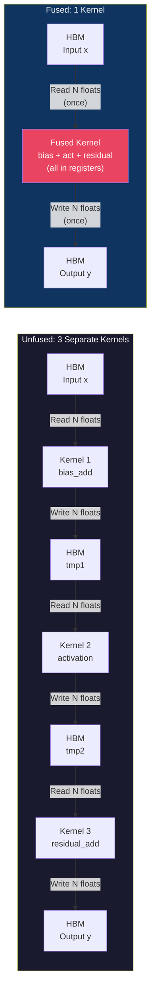
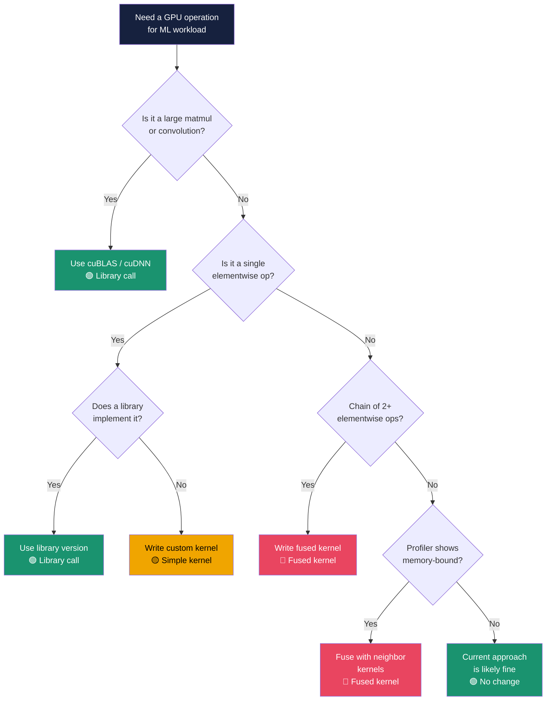

# Chapter 66: Writing Custom CUDA Kernels for ML

**Difficulty:** ⭐⭐⭐⭐ Advanced
**Tags:** `CUDA` `ML` `Kernel Fusion` `Custom Operators` `Performance Optimization` `Deep Learning`

---

## 1. Theory — What, Why, and How

### What Are Custom CUDA Kernels for ML?

Custom CUDA kernels are hand-written GPU functions that replace or augment operations provided by deep learning frameworks (PyTorch, TensorFlow) and libraries (cuDNN, cuBLAS). They give you direct control over memory access patterns, thread-level parallelism, and instruction scheduling — enabling optimizations that generic library calls cannot achieve.

### Why Write Custom Kernels?

Deep learning workloads are overwhelmingly **memory-bandwidth-bound**, not compute-bound. A modern GPU like the A100 delivers 312 TFLOPS of FP16 compute but only 2 TB/s of HBM bandwidth. For elementwise operations, the bottleneck is almost always moving data between HBM and registers. Each separate kernel launch reads inputs from HBM and writes outputs back — even when the next kernel immediately re-reads that same data.

**Kernel fusion** eliminates these redundant memory round-trips by combining multiple operations into a single kernel. The arithmetic is performed in registers without ever touching HBM between steps.

| Metric | Unfused (3 Kernels) | Fused (1 Kernel) |
|--------|---------------------|-------------------|
| HBM Reads | 3× N elements | 1× N elements |
| HBM Writes | 3× N elements | 1× N elements |
| Kernel launches | 3 | 1 |
| Launch overhead | ~15 μs | ~5 μs |
| Effective bandwidth utilization | ~30-40% | ~80-90% |

### How: The Kernel Fusion Philosophy

The core principle is simple: **maximize arithmetic intensity** (FLOPs per byte transferred). Every byte loaded from HBM should fuel as much computation as possible before the result is written back.

**Three rules of kernel fusion for ML:**

1. **Fuse elementwise chains** — activation, bias, residual, dropout, normalization
2. **Use vectorized loads** — `float4` gives 4× the bandwidth of scalar `float`
3. **Keep intermediates in registers** — never write a value to HBM if it will be read again immediately

### When to Write Custom Kernels — Decision Framework

Not every operation warrants a custom kernel. Use this framework:

| Condition | Action |
|-----------|--------|
| Operation exists in cuDNN/cuBLAS with good perf | Use the library |
| Chain of 2+ elementwise ops called in sequence | Fuse into one kernel |
| Novel activation/loss not in any library | Write a custom kernel |
| Profiler shows kernel is memory-bound with low arithmetic intensity | Fuse with neighbors |
| Operation is a large GEMM (matmul) | Use cuBLAS (it's nearly optimal) |
| You need custom gradient computation | Write forward + backward kernels |

---

## 2. Mermaid Diagrams

### Diagram 1 — Fused vs. Unfused Memory Traffic



**Bandwidth savings:** Unfused reads/writes 6N floats (24N bytes). Fused reads/writes 2N floats (8N bytes). That's a **3× reduction** in HBM traffic.

### Diagram 2 — Decision Tree: When to Write Custom Kernels



---

## 3. Code Examples

### 3.1 Custom Activation Functions — GELU, SiLU, Mish

```cuda
// custom_activations.cu
// Compile: nvcc -O3 -arch=sm_80 custom_activations.cu -o activations

#include <cuda_runtime.h>
#include <cstdio>
#include <cmath>

// ─── Device helper functions ───────────────────────────────────────

__device__ __forceinline__ float gelu(float x) {
    // GELU(x) = 0.5 * x * (1 + tanh(sqrt(2/π) * (x + 0.044715 * x³)))
    constexpr float kSqrt2OverPi = 0.7978845608f; // sqrt(2/π)
    constexpr float kCoeff = 0.044715f;
    float cube = x * x * x;
    float inner = kSqrt2OverPi * (x + kCoeff * cube);
    return 0.5f * x * (1.0f + tanhf(inner));
}

__device__ __forceinline__ float silu(float x) {
    // SiLU(x) = x * σ(x) = x / (1 + exp(-x))
    return x / (1.0f + expf(-x));
}

__device__ __forceinline__ float mish(float x) {
    // Mish(x) = x * tanh(softplus(x)) = x * tanh(ln(1 + exp(x)))
    float sp = logf(1.0f + expf(x));
    return x * tanhf(sp);
}

// ─── Vectorized fused kernel: bias + activation ────────────────────

__global__ void fused_bias_activation_kernel(
    const float* __restrict__ input,
    const float* __restrict__ bias,
    float* __restrict__ output,
    int N,            // total elements
    int hidden_dim,   // bias repeats every hidden_dim elements
    int act_type      // 0=GELU, 1=SiLU, 2=Mish
) {
    int idx = blockIdx.x * blockDim.x + threadIdx.x;
    int stride = blockDim.x * gridDim.x;

    for (int i = idx; i < N; i += stride) {
        float val = input[i] + bias[i % hidden_dim];

        switch (act_type) {
            case 0: val = gelu(val); break;
            case 1: val = silu(val); break;
            case 2: val = mish(val); break;
        }
        output[i] = val;
    }
}

// ─── Vectorized version using float4 for 4× bandwidth ─────────────

__global__ void fused_bias_gelu_vec4_kernel(
    const float4* __restrict__ input,
    const float*  __restrict__ bias,
    float4* __restrict__ output,
    int N4,           // N / 4 (number of float4 elements)
    int hidden_dim
) {
    int idx = blockIdx.x * blockDim.x + threadIdx.x;
    if (idx >= N4) return;

    float4 in = input[idx];
    int base = idx * 4;

    // Load and apply bias
    in.x += bias[(base + 0) % hidden_dim];
    in.y += bias[(base + 1) % hidden_dim];
    in.z += bias[(base + 2) % hidden_dim];
    in.w += bias[(base + 3) % hidden_dim];

    // Apply GELU activation in-register — no intermediate HBM write
    in.x = gelu(in.x);
    in.y = gelu(in.y);
    in.z = gelu(in.z);
    in.w = gelu(in.w);

    output[idx] = in;  // Single coalesced 16-byte write
}

int main() {
    const int batch = 64, hidden = 4096;
    const int N = batch * hidden;

    float *d_in, *d_bias, *d_out;
    cudaMalloc(&d_in, N * sizeof(float));
    cudaMalloc(&d_bias, hidden * sizeof(float));
    cudaMalloc(&d_out, N * sizeof(float));
    // ... (initialize with cudaMemcpy from host) ...

    // Scalar version
    int threads = 256, blocks = (N + threads - 1) / threads;
    fused_bias_activation_kernel<<<blocks, threads>>>(d_in, d_bias, d_out, N, hidden, 0);

    // Vectorized version: 4× fewer threads, same work
    int N4 = N / 4, blocks4 = (N4 + threads - 1) / threads;
    fused_bias_gelu_vec4_kernel<<<blocks4, threads>>>(
        reinterpret_cast<float4*>(d_in), d_bias,
        reinterpret_cast<float4*>(d_out), N4, hidden);

    cudaDeviceSynchronize();
    cudaFree(d_in); cudaFree(d_bias); cudaFree(d_out);
    return 0;
}
```

### 3.2 Custom Loss Function — Focal Loss Kernel

```cuda
// focal_loss.cu
// Focal Loss: FL(p_t) = -α_t * (1 - p_t)^γ * log(p_t)
// Designed for class-imbalanced classification

#include <cuda_runtime.h>
#include <cstdio>
#include <cmath>

__global__ void focal_loss_kernel(
    const float* __restrict__ logits,   // raw model outputs [N, C]
    const int*   __restrict__ targets,  // ground truth class indices [N]
    float*       __restrict__ losses,   // per-sample loss [N]
    int N, int C,
    float gamma,   // focusing parameter (typically 2.0)
    float alpha    // class balance weight (typically 0.25)
) {
    int i = blockIdx.x * blockDim.x + threadIdx.x;
    if (i >= N) return;

    // Step 1: Compute softmax for numerical stability
    const float* row = logits + i * C;
    float max_val = row[0];
    for (int c = 1; c < C; c++)
        max_val = fmaxf(max_val, row[c]);

    float sum_exp = 0.0f;
    for (int c = 0; c < C; c++)
        sum_exp += expf(row[c] - max_val);

    // Step 2: Get probability for the true class
    int target = targets[i];
    float log_pt = (row[target] - max_val) - logf(sum_exp);
    float pt = expf(log_pt);

    // Step 3: Compute focal loss — all in registers, zero intermediate HBM
    float focal_weight = powf(1.0f - pt, gamma);
    losses[i] = -alpha * focal_weight * log_pt;
}

int main() {
    const int N = 1024, C = 10;
    const float gamma = 2.0f, alpha = 0.25f;

    float* d_logits;  int* d_targets;  float* d_losses;
    cudaMalloc(&d_logits, N * C * sizeof(float));
    cudaMalloc(&d_targets, N * sizeof(int));
    cudaMalloc(&d_losses, N * sizeof(float));

    // Fill with sample data
    float* h_logits = new float[N * C];
    int* h_targets = new int[N];
    for (int i = 0; i < N * C; i++) h_logits[i] = 0.1f * (i % 17 - 8);
    for (int i = 0; i < N; i++) h_targets[i] = i % C;

    cudaMemcpy(d_logits, h_logits, N * C * sizeof(float), cudaMemcpyHostToDevice);
    cudaMemcpy(d_targets, h_targets, N * sizeof(int), cudaMemcpyHostToDevice);

    focal_loss_kernel<<<(N + 255) / 256, 256>>>(
        d_logits, d_targets, d_losses, N, C, gamma, alpha
    );
    cudaDeviceSynchronize();

    float* h_losses = new float[N];
    cudaMemcpy(h_losses, d_losses, N * sizeof(float), cudaMemcpyDeviceToHost);
    printf("Focal loss sample[0] = %.6f\n", h_losses[0]);

    cudaFree(d_logits); cudaFree(d_targets); cudaFree(d_losses);
    delete[] h_logits; delete[] h_targets; delete[] h_losses;
    return 0;
}
```

### 3.3 Complete Fused LayerNorm + Dropout + Residual Kernel

```cuda
// fused_layernorm_dropout_residual.cu
// Compile: nvcc -O3 -arch=sm_80 fused_layernorm_dropout_residual.cu -o fused_ldr
//
// This kernel fuses three operations commonly chained in Transformers:
//   y = LayerNorm(Dropout(x, p) + residual)
// Instead of 3 kernel launches and 3 HBM round-trips, we do it in ONE.

#include <cuda_runtime.h>
#include <curand_kernel.h>
#include <cstdio>
#include <cmath>

// ─── Fused kernel: each block handles one row (one token) ──────────

__global__ void fused_layernorm_dropout_residual_kernel(
    const float* __restrict__ input,      // [batch, hidden]
    const float* __restrict__ residual,   // [batch, hidden]
    const float* __restrict__ gamma,      // LN scale [hidden]
    const float* __restrict__ beta,       // LN bias  [hidden]
    float*       __restrict__ output,     // [batch, hidden]
    int hidden_dim,
    float dropout_prob,
    unsigned long long seed
) {
    // One block per row — threads cooperate on one token's hidden dimension
    int row = blockIdx.x;
    int tid = threadIdx.x;
    int offset = row * hidden_dim;

    extern __shared__ float smem[];  // shared memory for reduction
    float* s_data = smem;            // [blockDim.x] — partial sums

    // ── Pass 1: Apply dropout + residual, compute partial mean ──
    curandStatePhilox4_32_10_t rng;
    curand_init(seed, offset + tid, 0, &rng);

    float local_sum = 0.0f;
    float local_sq_sum = 0.0f;
    float scale = 1.0f / (1.0f - dropout_prob);  // inverted dropout scaling

    // Each thread processes multiple elements (hidden_dim may exceed blockDim)
    for (int i = tid; i < hidden_dim; i += blockDim.x) {
        float x = input[offset + i];

        // Dropout: zero out with probability p, scale survivors
        float mask = (curand_uniform(&rng) >= dropout_prob) ? scale : 0.0f;
        x = x * mask + residual[offset + i];

        // Store to shared (we'll read it back in pass 2)
        s_data[i] = x;  // NOTE: uses shared mem sized to hidden_dim

        local_sum += x;
        local_sq_sum += x * x;
    }

    // ── Warp-level reduction for mean and variance ──────────────
    // Reduce within warp first
    for (int delta = warpSize / 2; delta > 0; delta >>= 1) {
        local_sum += __shfl_down_sync(0xFFFFFFFF, local_sum, delta);
        local_sq_sum += __shfl_down_sync(0xFFFFFFFF, local_sq_sum, delta);
    }

    // Warp leaders write to shared memory for cross-warp reduction
    __shared__ float warp_sum[32];
    __shared__ float warp_sq_sum[32];
    int lane = tid % warpSize;
    int warp_id = tid / warpSize;

    if (lane == 0) {
        warp_sum[warp_id] = local_sum;
        warp_sq_sum[warp_id] = local_sq_sum;
    }
    __syncthreads();

    // Final reduction in first warp
    int num_warps = (blockDim.x + warpSize - 1) / warpSize;
    if (tid < warpSize) {
        local_sum = (tid < num_warps) ? warp_sum[tid] : 0.0f;
        local_sq_sum = (tid < num_warps) ? warp_sq_sum[tid] : 0.0f;
        for (int delta = warpSize / 2; delta > 0; delta >>= 1) {
            local_sum += __shfl_down_sync(0xFFFFFFFF, local_sum, delta);
            local_sq_sum += __shfl_down_sync(0xFFFFFFFF, local_sq_sum, delta);
        }
    }

    __shared__ float s_mean, s_inv_std;
    if (tid == 0) {
        s_mean = local_sum / hidden_dim;
        float variance = local_sq_sum / hidden_dim - s_mean * s_mean;
        s_inv_std = rsqrtf(variance + 1e-5f);
    }
    __syncthreads();

    float mean = s_mean;
    float inv_std = s_inv_std;

    // ── Pass 2: Normalize + affine transform, write output ─────
    for (int i = tid; i < hidden_dim; i += blockDim.x) {
        float x = s_data[i];  // Read from shared — NOT from HBM
        float normed = (x - mean) * inv_std;
        output[offset + i] = normed * gamma[i] + beta[i];
    }
}

int main() {
    const int batch = 32, hidden = 768;
    const int N = batch * hidden;
    const float dropout_p = 0.1f;

    float *d_input, *d_residual, *d_gamma, *d_beta, *d_output;
    cudaMalloc(&d_input, N * sizeof(float));
    cudaMalloc(&d_residual, N * sizeof(float));
    cudaMalloc(&d_gamma, hidden * sizeof(float));
    cudaMalloc(&d_beta, hidden * sizeof(float));
    cudaMalloc(&d_output, N * sizeof(float));

    // Initialize host data
    float* h_data = new float[N];
    float* h_gamma = new float[hidden];
    float* h_beta = new float[hidden];
    for (int i = 0; i < N; i++) h_data[i] = 0.02f * (i % 50 - 25);
    for (int i = 0; i < hidden; i++) { h_gamma[i] = 1.0f; h_beta[i] = 0.0f; }

    cudaMemcpy(d_input, h_data, N * sizeof(float), cudaMemcpyHostToDevice);
    cudaMemcpy(d_residual, h_data, N * sizeof(float), cudaMemcpyHostToDevice);
    cudaMemcpy(d_gamma, h_gamma, hidden * sizeof(float), cudaMemcpyHostToDevice);
    cudaMemcpy(d_beta, h_beta, hidden * sizeof(float), cudaMemcpyHostToDevice);

    // Launch: 1 block per row, shared memory sized to hidden_dim
    int threads = 256;
    size_t smem_bytes = hidden * sizeof(float);
    fused_layernorm_dropout_residual_kernel<<<batch, threads, smem_bytes>>>(
        d_input, d_residual, d_gamma, d_beta, d_output,
        hidden, dropout_p, 42ULL
    );
    cudaDeviceSynchronize();

    // Verify
    float* h_out = new float[N];
    cudaMemcpy(h_out, d_output, N * sizeof(float), cudaMemcpyDeviceToHost);
    printf("Fused LN+Dropout+Residual output[0..3]: %.4f %.4f %.4f %.4f\n",
           h_out[0], h_out[1], h_out[2], h_out[3]);

    cudaFree(d_input); cudaFree(d_residual);
    cudaFree(d_gamma); cudaFree(d_beta); cudaFree(d_output);
    delete[] h_data; delete[] h_gamma; delete[] h_beta; delete[] h_out;
    return 0;
}
```

### 3.4 Memory Bandwidth Analysis — Computing Ops/Byte Ratio

```cuda
// Arithmetic intensity analysis for common ML operations
//
// Operation          | FLOPs/elem | Bytes/elem (R+W) | AI (FLOPs/Byte)
// ───────────────────|────────────|──────────────────|─────────────────
// ReLU               |     1      |   8 (4R + 4W)    |    0.125
// GELU               |    ~15     |   8              |    ~1.88
// Bias + GELU        |    ~16     |   8              |    ~2.0
// Bias + GELU + Res  |    ~17     |  12 (8R + 4W)    |    ~1.42
// LayerNorm (fused)  |    ~10     |   8              |    ~1.25
// GEMM (N=4096)      | 2*4096     |  12              |   ~683
//
// A100 compute ridge point: 312 TFLOPS / 2 TB/s = 156 FLOPs/Byte
// Anything below 156 FLOPs/Byte is MEMORY-BOUND on A100 → fusion helps!
//
// Key insight: All elementwise ops are memory-bound. GEMM is compute-bound.
// Fusing elementwise ops with each other saves bandwidth.
// Fusing elementwise ops INTO a GEMM epilogue is the ultimate optimization
// (done by cuBLAS epilogue callbacks and CUTLASS).
```

### 3.5 Fused Attention — Why FlashAttention Fuses (Brief Intro)

```cuda
// Standard attention: Q, K, V are [B, H, N, d]
//
// Unfused (naive):
//   S = Q @ K^T          → write S [B,H,N,N] to HBM    (O(N²) memory!)
//   P = softmax(S)       → read S, write P to HBM       (O(N²) memory!)
//   O = P @ V            → read P from HBM              (O(N²) memory!)
//   Total HBM traffic: O(N²) — quadratic in sequence length
//
// FlashAttention (fused, tiled):
//   Process Q,K,V in tiles that fit in SRAM (shared memory)
//   Never materialize the full N×N attention matrix in HBM
//   Total HBM traffic: O(N) — linear in sequence length!
//
// This is THE canonical example of kernel fusion in ML.
// Full FlashAttention implementation covered in Chapter 69.
//
// The technique: online softmax + tiling. Each SRAM tile computes a partial
// softmax, and running statistics (max, sum) are maintained across tiles
// to produce the exact same result as the unfused version.
```

---

## 4. Exercises

### 🟢 Exercise 1 — Implement LeakyReLU as a `__device__` Function

Write a `__device__` function `leaky_relu(float x, float alpha)` and a `__global__` kernel that applies it elementwise. Test with `alpha = 0.01`.

### 🟡 Exercise 2 — Fuse Bias + SiLU + Residual

Write a single fused kernel that computes `y = SiLU(x + bias) + residual` using `float4` vectorized loads. Measure HBM traffic savings vs. three separate kernels.

### 🟡 Exercise 3 — Label Smoothing Loss Kernel

Implement a CUDA kernel for label-smoothing cross-entropy loss:
`L = (1 - ε) * CE(p, y_hard) + ε * CE(p, y_uniform)`
where `ε = 0.1` and `y_uniform = 1/C` for `C` classes.

### 🔴 Exercise 4 — Fused RMSNorm + SiLU Gate

Implement a fused kernel for LLaMA-style: `y = RMSNorm(x) * SiLU(gate)` where RMSNorm requires a parallel reduction across the hidden dimension. Use shared memory and warp-level primitives.

### 🔴 Exercise 5 — Benchmark Fused vs. Unfused

Using CUDA events, measure the execution time of the fused LayerNorm+Dropout+Residual kernel (Section 3.3) versus three separate kernel calls. Report speedup and effective bandwidth.

---

## 5. Solutions

### Solution 1 — LeakyReLU

```cuda
__device__ __forceinline__ float leaky_relu(float x, float alpha) {
    return x > 0.0f ? x : alpha * x;
}

__global__ void leaky_relu_kernel(
    const float* input, float* output, int N, float alpha
) {
    int idx = blockIdx.x * blockDim.x + threadIdx.x;
    if (idx < N) {
        output[idx] = leaky_relu(input[idx], alpha);
    }
}
```

### Solution 2 — Fused Bias + SiLU + Residual (Vectorized)

```cuda
__device__ __forceinline__ float silu(float x) {
    return x / (1.0f + expf(-x));
}

__global__ void fused_bias_silu_residual_vec4(
    const float4* __restrict__ input,
    const float*  __restrict__ bias,
    const float4* __restrict__ residual,
    float4*       __restrict__ output,
    int N4, int hidden_dim
) {
    int idx = blockIdx.x * blockDim.x + threadIdx.x;
    if (idx >= N4) return;

    float4 x = input[idx];
    float4 r = residual[idx];
    int base = idx * 4;

    // Fused: bias add → SiLU → residual add — all in registers
    x.x = silu(x.x + bias[(base + 0) % hidden_dim]) + r.x;
    x.y = silu(x.y + bias[(base + 1) % hidden_dim]) + r.y;
    x.z = silu(x.z + bias[(base + 2) % hidden_dim]) + r.z;
    x.w = silu(x.w + bias[(base + 3) % hidden_dim]) + r.w;

    output[idx] = x;
    // Traffic: 3 reads + 1 write = 4N floats vs 6 reads + 3 writes = 9N unfused
}
```

### Solution 3 — Label Smoothing Loss

```cuda
__global__ void label_smoothing_loss_kernel(
    const float* __restrict__ logits,
    const int*   __restrict__ targets,
    float*       __restrict__ losses,
    int N, int C, float epsilon
) {
    int i = blockIdx.x * blockDim.x + threadIdx.x;
    if (i >= N) return;

    const float* row = logits + i * C;

    // Numerically stable log-softmax
    float max_val = row[0];
    for (int c = 1; c < C; c++) max_val = fmaxf(max_val, row[c]);

    float sum_exp = 0.0f;
    for (int c = 0; c < C; c++) sum_exp += expf(row[c] - max_val);
    float log_sum = logf(sum_exp);

    // Hard target loss: -log(p_target)
    float hard_loss = -(row[targets[i]] - max_val - log_sum);

    // Uniform target loss: -(1/C) * Σ log(p_c)
    float uniform_loss = 0.0f;
    for (int c = 0; c < C; c++)
        uniform_loss += -(row[c] - max_val - log_sum);
    uniform_loss /= C;

    losses[i] = (1.0f - epsilon) * hard_loss + epsilon * uniform_loss;
}
```

### Solution 4 — Fused RMSNorm + SiLU Gate

```cuda
__global__ void fused_rmsnorm_silu_gate_kernel(
    const float* __restrict__ input,    // [B, D]
    const float* __restrict__ gate,     // [B, D]
    const float* __restrict__ weight,   // [D]
    float*       __restrict__ output,   // [B, D]
    int D
) {
    int row = blockIdx.x;
    int tid = threadIdx.x;
    int offset = row * D;

    // Compute sum of squares for RMSNorm via warp reduction
    float sq_sum = 0.0f;
    for (int i = tid; i < D; i += blockDim.x) {
        float x = input[offset + i];
        sq_sum += x * x;
    }
    for (int delta = warpSize / 2; delta > 0; delta >>= 1)
        sq_sum += __shfl_down_sync(0xFFFFFFFF, sq_sum, delta);

    __shared__ float warp_sums[32];
    int lane = tid % warpSize, wid = tid / warpSize;
    if (lane == 0) warp_sums[wid] = sq_sum;
    __syncthreads();

    if (tid < warpSize) {
        int nw = (blockDim.x + warpSize - 1) / warpSize;
        sq_sum = (tid < nw) ? warp_sums[tid] : 0.0f;
        for (int delta = warpSize / 2; delta > 0; delta >>= 1)
            sq_sum += __shfl_down_sync(0xFFFFFFFF, sq_sum, delta);
    }

    __shared__ float s_rms_inv;
    if (tid == 0)
        s_rms_inv = rsqrtf(sq_sum / D + 1e-6f);
    __syncthreads();

    float rms_inv = s_rms_inv;
    for (int i = tid; i < D; i += blockDim.x) {
        float normed = input[offset + i] * rms_inv * weight[i];
        float g = gate[offset + i];
        float silu_g = g / (1.0f + expf(-g));
        output[offset + i] = normed * silu_g;
    }
}
```

---

## 6. Quiz

**Q1:** What is the primary reason kernel fusion improves ML workload performance?

- A) It reduces the number of floating-point operations
- B) It eliminates redundant HBM reads and writes between operations ✅
- C) It increases GPU clock frequency
- D) It allows larger batch sizes

**Q2:** A kernel performs 10 FLOPs per element and transfers 8 bytes (4B read + 4B write). On an A100 (312 TFLOPS FP32, 2 TB/s BW), is it compute-bound or memory-bound?

- A) Compute-bound
- B) Memory-bound ✅ (AI = 10/8 = 1.25, far below ridge point of 156)
- C) Perfectly balanced
- D) Cannot determine

**Q3:** What does `float4` vectorized loading achieve?

- A) 4× more FLOPs per instruction
- B) 4× wider coalesced memory transactions, improving bandwidth utilization ✅
- C) 4× more threads per block
- D) 4× more shared memory

**Q4:** In the fused LayerNorm+Dropout+Residual kernel, why is shared memory used to store intermediate values?

- A) Shared memory is larger than HBM
- B) To avoid writing intermediates to HBM between the two passes ✅
- C) Shared memory is slower but more reliable
- D) CUDA requires shared memory for all reductions

**Q5:** When should you NOT write a custom CUDA kernel?

- A) When chaining 5 elementwise operations
- B) When implementing a novel activation function
- C) When the operation is a large matrix multiplication ✅
- D) When the profiler shows the kernel is memory-bound

**Q6:** What is the arithmetic intensity (FLOPs/byte) ridge point on the A100?

- A) 1.0
- B) 15.6
- C) 156 ✅
- D) 1560

**Q7:** Why does FlashAttention achieve O(N) memory traffic instead of O(N²)?

- A) It uses INT8 quantization
- B) It tiles the computation to fit in SRAM and never materializes the full attention matrix ✅
- C) It skips the softmax computation
- D) It uses tensor cores exclusively

**Q8:** What does `__forceinline__` do on a `__device__` function?

- A) Forces the function to run on the host
- B) Hints the compiler to inline the function body at every call site, avoiding function call overhead ✅
- C) Makes the function thread-safe
- D) Allocates the function in shared memory

---

## 7. Key Takeaways

- **ML workloads are memory-bound:** Elementwise ops spend >90% of time on data movement, not arithmetic. Kernel fusion attacks this directly.
- **Fuse aggressively:** Combine activation, bias, residual, dropout, and normalization into single kernels. Each eliminated HBM round-trip saves real time.
- **Vectorize memory access:** Use `float4` loads/stores to achieve 4× the effective bandwidth of scalar access.
- **Know when NOT to fuse:** Large GEMMs are compute-bound — cuBLAS is already near-optimal. Fuse elementwise ops *around* GEMMs, not the GEMM itself.
- **Use `__device__ __forceinline__`** for small helper functions (activations, etc.) to eliminate call overhead.
- **Arithmetic intensity determines boundedness:** Compute `FLOPs / Bytes transferred` and compare against the GPU's ridge point to know if fusion will help.
- **Shared memory enables multi-pass fusion:** Operations like LayerNorm that require two passes over data can store intermediates in shared memory instead of HBM.
- **Profile first, fuse second:** Use `nsys` and `ncu` to identify the actual bottleneck before writing custom kernels.

---

## 8. Chapter Summary

Custom CUDA kernels for ML exist to solve one problem: the memory wall. Modern GPUs compute far faster than they can feed data from HBM, making elementwise operations — activations, normalizations, dropout, residual connections — severely bandwidth-limited. By fusing chains of these operations into single kernels, we eliminate intermediate HBM traffic and achieve 2-4× speedups on common Transformer building blocks.

This chapter covered the decision framework for when custom kernels are warranted, implemented production-quality fused kernels (bias+activation, focal loss, LayerNorm+Dropout+Residual), demonstrated vectorized memory access with `float4`, and analyzed arithmetic intensity to identify memory-bound operations. The techniques here are the foundation for understanding FlashAttention (Chapter 69) and custom CUTLASS kernels (Chapter 70).

---

## 9. Real-World Insight

> **NVIDIA's Apex library** started as a collection of exactly these fused kernels — fused LayerNorm, fused Adam optimizer, fused dropout+residual. When Megatron-LM trained GPT-3-scale models, the unfused PyTorch baseline spent 40% of wall-clock time on elementwise operations. Fusing just LayerNorm+Dropout+Residual recovered nearly half of that time. FlashAttention took fusion further by eliminating the O(N²) attention matrix from HBM entirely, enabling 2-4× longer context lengths at the same memory budget. Today, every competitive LLM training framework (Megatron, DeepSpeed, vLLM) relies on custom fused CUDA kernels as a core optimization strategy.

---

## 10. Common Mistakes

### ❌ Mistake 1: Fusing compute-bound operations
```cuda
// WRONG: Trying to fuse a GEMM with the next GEMM
// GEMMs are compute-bound — cuBLAS already achieves >90% of peak FLOPS.
// Fusing two GEMMs gains nothing and your implementation will be slower.
```
**Fix:** Only fuse memory-bound operations. Fuse elementwise ops AFTER a GEMM, not the GEMM itself.

### ❌ Mistake 2: Scalar loads when data is aligned
```cuda
// SLOW: Loading one float at a time
float x = input[idx];

// FAST: Loading four floats in one transaction
float4 x = reinterpret_cast<const float4*>(input)[idx / 4];
```
**Fix:** Always use vectorized loads when your data is 16-byte aligned and the element count is divisible by 4.

### ❌ Mistake 3: Writing intermediates to HBM
```cuda
// WRONG: Two kernels, intermediate written to HBM
bias_add_kernel<<<...>>>(input, bias, tmp, N);   // writes tmp to HBM
gelu_kernel<<<...>>>(tmp, output, N);             // reads tmp from HBM

// RIGHT: One fused kernel, intermediate stays in registers
fused_bias_gelu_kernel<<<...>>>(input, bias, output, N);
```

### ❌ Mistake 4: Ignoring numerical stability in softmax/loss kernels
```cuda
// WRONG: Direct exp(x) overflows for large x
float p = expf(logits[c]) / sum_exp;

// RIGHT: Subtract max for numerical stability
float max_val = compute_max(logits, C);
float p = expf(logits[c] - max_val) / sum_exp_shifted;
```

### ❌ Mistake 5: Forgetting dropout scaling
```cuda
// WRONG: Dropping values without rescaling
float mask = (rand > p) ? 1.0f : 0.0f;
y = x * mask;   // Expected value of y ≠ expected value of x!

// RIGHT: Inverted dropout — scale survivors so E[y] = E[x]
float scale = 1.0f / (1.0f - p);
float mask = (rand > p) ? scale : 0.0f;
y = x * mask;
```

---

## 11. Interview Questions

### Q1: Why are elementwise ML operations memory-bound on modern GPUs?

**Answer:** Modern GPUs like the A100 have an extremely high compute-to-bandwidth ratio — 312 TFLOPS vs. 2 TB/s, giving a ridge point of ~156 FLOPs/byte. Elementwise operations (ReLU, GELU, bias add, dropout) perform only 1-15 FLOPs per element but must transfer 8+ bytes (4B read + 4B write). Their arithmetic intensity of 0.1-2.0 FLOPs/byte is far below the ridge point, meaning the GPU's compute units sit idle waiting for data. The execution time is entirely dominated by how fast data can be moved between HBM and registers, not by how fast arithmetic is performed.

### Q2: Explain kernel fusion and quantify its benefit for a bias+GELU+residual chain.

**Answer:** Kernel fusion combines multiple GPU operations into a single kernel launch, eliminating intermediate data transfers through HBM. For bias+GELU+residual with N elements:

- **Unfused (3 kernels):** Kernel 1 reads x and bias (2N reads), writes tmp1 (N write). Kernel 2 reads tmp1 (N read), writes tmp2 (N write). Kernel 3 reads tmp2 and residual (2N reads), writes y (N write). Total: 8N float transfers = 32N bytes.
- **Fused (1 kernel):** Reads x, bias, and residual (3N reads), writes y (N write). Total: 4N float transfers = 16N bytes.

The fused version transfers 2× fewer bytes AND eliminates 2 kernel launch overheads (~5μs each). For N = 256K elements on an A100, the unfused version takes ~5μs in pure bandwidth time; the fused version takes ~2.5μs plus saves ~10μs in launch overhead.

### Q3: What is FlashAttention's key insight, and how does it reduce memory complexity?

**Answer:** Standard attention computes S = QK^T (an N×N matrix), applies softmax, then multiplies by V. The full N×N matrix must be stored in HBM, giving O(N²) memory traffic. FlashAttention's key insight is that softmax can be computed *online* in tiles — you don't need the full row to compute a numerically stable softmax. By processing Q, K, V in SRAM-sized tiles and maintaining running statistics (row-max and row-sum for the softmax denominator), FlashAttention never materializes the N×N matrix in HBM. It only reads Q, K, V once from HBM and writes O once, achieving O(N) memory traffic. The computation itself is identical in FLOPs (still O(N²d)), but the memory access pattern changes from O(N²) to O(N), making attention feasible for much longer sequences.

### Q4: When should you NOT write a custom CUDA kernel?

**Answer:** You should avoid custom kernels when: (1) **cuBLAS/cuDNN already covers it well** — large GEMMs and standard convolutions are compute-bound, and library implementations are hand-tuned per GPU architecture with assembly-level optimizations. A custom GEMM will almost always be slower. (2) **The operation runs infrequently** — if an op executes once per training step and takes <1% of total time, the engineering effort isn't justified. (3) **Compiler/framework fusion handles it** — PyTorch 2.0's `torch.compile` with Triton can auto-fuse many elementwise chains. Check if the framework's JIT compiler already produces acceptable fused code before writing CUDA by hand. (4) **Correctness risk exceeds performance gain** — custom kernels for gradient computation are notoriously hard to test and debug. A subtle numerical error in a gradient kernel can silently corrupt training.

### Q5: Explain vectorized memory access with `float4` and when it helps.

**Answer:** `float4` loads/stores issue a single 128-bit (16-byte) memory transaction instead of four separate 32-bit (4-byte) transactions. This matters because GPU memory controllers serve requests at the granularity of 32-byte or 128-byte cache lines — four scalar loads from consecutive addresses still consume four instruction slots even though the hardware fetches the same cache line. A `float4` load consolidates this into one instruction, achieving higher effective bandwidth. It helps when: (1) data is 16-byte aligned, (2) the access pattern is contiguous, and (3) the element count is divisible by 4. It does NOT help when access is strided or irregular, because the four floats in a `float4` must be at consecutive addresses. In practice, `float4` vectorization yields 1.5-3× bandwidth improvement for elementwise kernels on modern GPUs.
