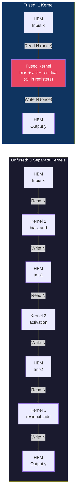
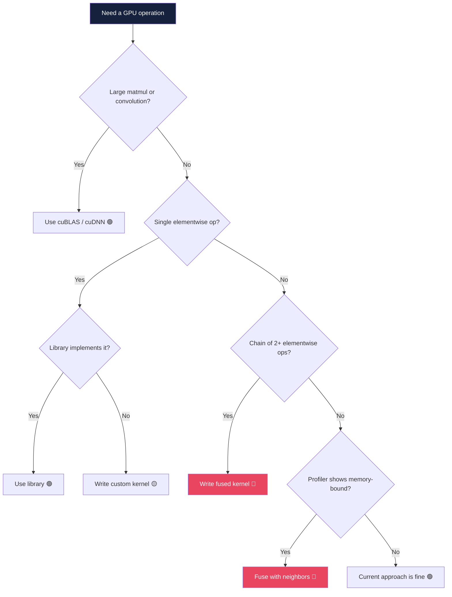

# Chapter 66: Writing Custom CUDA Kernels for ML

**Difficulty:** ⭐⭐⭐⭐ Advanced
**Tags:** `CUDA` `ML` `Kernel Fusion` `Custom Operators` `Performance Optimization` `Deep Learning`

---

## 1. Theory — What, Why, and How

### What Are Custom CUDA Kernels for ML?

Custom CUDA kernels are hand-written GPU functions that replace or augment operations from deep learning frameworks and libraries (cuDNN, cuBLAS). They give direct control over memory access, thread parallelism, and instruction scheduling — enabling optimizations that generic library calls cannot achieve.

### Why Write Custom Kernels?

Deep learning workloads are overwhelmingly **memory-bandwidth-bound**. An A100 delivers 312 TFLOPS of FP16 compute but only 2 TB/s of HBM bandwidth. For elementwise operations, the bottleneck is moving data between HBM and registers. Each separate kernel reads from and writes to HBM — even when the next kernel immediately re-reads that data. **Kernel fusion** eliminates these redundant round-trips.

| Metric | Unfused (3 Kernels) | Fused (1 Kernel) |
|--------|---------------------|-------------------|
| HBM Reads | 3× N elements | 1× N elements |
| HBM Writes | 3× N elements | 1× N elements |
| Kernel launches | 3 | 1 |
| Effective bandwidth utilization | ~30-40% | ~80-90% |

### How: The Kernel Fusion Philosophy

**Maximize arithmetic intensity** (FLOPs per byte transferred). Three rules:
1. **Fuse elementwise chains** — activation, bias, residual, dropout, normalization
2. **Use vectorized loads** — `float4` gives 4× the bandwidth of scalar `float`
3. **Keep intermediates in registers** — never write to HBM if the value is needed immediately

### When to Write Custom Kernels — Decision Framework

| Condition | Action |
|-----------|--------|
| Operation exists in cuDNN/cuBLAS with good perf | Use the library |
| Chain of 2+ elementwise ops called in sequence | Fuse into one kernel |
| Novel activation/loss not in any library | Write a custom kernel |
| Profiler shows kernel is memory-bound with low AI | Fuse with neighbors |
| Operation is a large GEMM (matmul) | Use cuBLAS |
| You need custom gradient computation | Write forward + backward kernels |

---

## 2. Mermaid Diagrams

### Diagram 1 — Fused vs. Unfused Memory Traffic



**Bandwidth savings:** Unfused transfers 6N floats (24N bytes). Fused transfers 2N floats (8N bytes) — a **3× reduction**.

### Diagram 2 — Decision Tree: When to Write Custom Kernels



---

## 3. Code Examples

### 3.1 Custom Activation Functions — GELU, SiLU, Mish

This code implements three modern activation functions (GELU, SiLU, and Mish) as `__device__` helper functions so any kernel can call them. It then provides two kernels: one that fuses bias addition with a selectable activation in a single pass, and a vectorized variant that uses `float4` loads to process four elements at once — quadrupling effective memory bandwidth because the GPU issues one wide transaction instead of four narrow ones.

```cuda
// custom_activations.cu — Compile: nvcc -O3 -arch=sm_80 custom_activations.cu
#include <cuda_runtime.h>
#include <cstdio>
#include <cmath>

__device__ __forceinline__ float gelu(float x) {
    constexpr float kSqrt2OverPi = 0.7978845608f;
    constexpr float kCoeff = 0.044715f;
    float inner = kSqrt2OverPi * (x + kCoeff * x * x * x);
    return 0.5f * x * (1.0f + tanhf(inner));
}

__device__ __forceinline__ float silu(float x) {
    return x / (1.0f + expf(-x));
}

__device__ __forceinline__ float mish(float x) {
    return x * tanhf(logf(1.0f + expf(x)));
}

// ─── Fused kernel: bias + activation ───────────────────────────────
__global__ void fused_bias_activation_kernel(
    const float* __restrict__ input, const float* __restrict__ bias,
    float* __restrict__ output, int N, int hidden_dim, int act_type
) {
    int idx = blockIdx.x * blockDim.x + threadIdx.x;
    int stride = blockDim.x * gridDim.x;
    for (int i = idx; i < N; i += stride) {
        float val = input[i] + bias[i % hidden_dim];
        switch (act_type) {
            case 0: val = gelu(val); break;
            case 1: val = silu(val); break;
            case 2: val = mish(val); break;
        }
        output[i] = val;
    }
}

// ─── Vectorized: float4 loads for 4× bandwidth ────────────────────
__global__ void fused_bias_gelu_vec4_kernel(
    const float4* __restrict__ input, const float* __restrict__ bias,
    float4* __restrict__ output, int N4, int hidden_dim
) {
    int idx = blockIdx.x * blockDim.x + threadIdx.x;
    if (idx >= N4) return;
    float4 in = input[idx];
    int base = idx * 4;
    in.x = gelu(in.x + bias[(base + 0) % hidden_dim]);
    in.y = gelu(in.y + bias[(base + 1) % hidden_dim]);
    in.z = gelu(in.z + bias[(base + 2) % hidden_dim]);
    in.w = gelu(in.w + bias[(base + 3) % hidden_dim]);
    output[idx] = in;  // Single coalesced 16-byte write
}

int main() {
    const int batch = 64, hidden = 4096, N = batch * hidden;
    float *d_in, *d_bias, *d_out;
    cudaMalloc(&d_in, N * sizeof(float));
    cudaMalloc(&d_bias, hidden * sizeof(float));
    cudaMalloc(&d_out, N * sizeof(float));
    // ... (initialize with cudaMemcpy) ...
    int threads = 256;
    fused_bias_activation_kernel<<<(N+threads-1)/threads, threads>>>(
        d_in, d_bias, d_out, N, hidden, 0);
    int N4 = N / 4;
    fused_bias_gelu_vec4_kernel<<<(N4+threads-1)/threads, threads>>>(
        reinterpret_cast<float4*>(d_in), d_bias,
        reinterpret_cast<float4*>(d_out), N4, hidden);
    cudaDeviceSynchronize();
    cudaFree(d_in); cudaFree(d_bias); cudaFree(d_out);
    return 0;
}
```

### 3.2 Custom Loss Function — Focal Loss Kernel

Focal loss down-weights easy, well-classified examples and focuses training on hard ones — it's the standard loss for object detection (e.g., RetinaNet) where background vastly outnumbers objects. This kernel computes focal loss entirely in registers: it first runs a numerically stable softmax (subtract max, exponentiate, normalize), then applies the focal weighting `(1 − p_t)^γ` to the log-probability of the true class.

```cuda
// focal_loss.cu — FL(p_t) = -α_t * (1 - p_t)^γ * log(p_t)
#include <cuda_runtime.h>
#include <cstdio>

__global__ void focal_loss_kernel(
    const float* __restrict__ logits, const int* __restrict__ targets,
    float* __restrict__ losses, int N, int C, float gamma, float alpha
) {
    int i = blockIdx.x * blockDim.x + threadIdx.x;
    if (i >= N) return;
    const float* row = logits + i * C;

    // Numerically stable softmax
    float max_val = row[0];
    for (int c = 1; c < C; c++) max_val = fmaxf(max_val, row[c]);
    float sum_exp = 0.0f;
    for (int c = 0; c < C; c++) sum_exp += expf(row[c] - max_val);

    float log_pt = (row[targets[i]] - max_val) - logf(sum_exp);
    float pt = expf(log_pt);
    // Focal weight + loss — all in registers, zero intermediate HBM
    losses[i] = -alpha * powf(1.0f - pt, gamma) * log_pt;
}

int main() {
    const int N = 1024, C = 10;
    float *d_logits, *d_losses; int *d_targets;
    cudaMalloc(&d_logits, N * C * sizeof(float));
    cudaMalloc(&d_targets, N * sizeof(int));
    cudaMalloc(&d_losses, N * sizeof(float));
    // ... (init logits/targets, cudaMemcpy) ...
    focal_loss_kernel<<<(N+255)/256, 256>>>(
        d_logits, d_targets, d_losses, N, C, 2.0f, 0.25f);
    cudaDeviceSynchronize();
    cudaFree(d_logits); cudaFree(d_targets); cudaFree(d_losses);
    return 0;
}
```

### 3.3 Fused LayerNorm + Dropout + Residual Kernel

This is the most complex fusion in the chapter: it combines layer normalization, dropout, and residual addition into a single kernel that touches HBM only once. Shared memory stores the intermediate dropout+residual values between the two passes — the first pass computes the mean and variance, the second normalizes — so no temporary tensors ever hit global memory. Each thread block handles one row (one token), making the pattern ideal for Transformer inference.

```cuda
// fused_layernorm_dropout_residual.cu
// Compile: nvcc -O3 -arch=sm_80 fused_layernorm_dropout_residual.cu -o fused_ldr
// Fuses: y = LayerNorm(Dropout(x, p) + residual) — 1 kernel, 1 HBM round-trip
#include <cuda_runtime.h>
#include <curand_kernel.h>
#include <cstdio>

__global__ void fused_layernorm_dropout_residual_kernel(
    const float* __restrict__ input,    const float* __restrict__ residual,
    const float* __restrict__ gamma,    const float* __restrict__ beta,
    float* __restrict__ output, int hidden_dim, float dropout_prob,
    unsigned long long seed
) {
    int row = blockIdx.x;  // One block per row (one token)
    int tid = threadIdx.x;
    int offset = row * hidden_dim;

    extern __shared__ float smem[];

    // ── Pass 1: Dropout + residual, compute partial mean/variance ──
    curandStatePhilox4_32_10_t rng;
    curand_init(seed, offset + tid, 0, &rng);
    float local_sum = 0.0f, local_sq_sum = 0.0f;
    float scale = 1.0f / (1.0f - dropout_prob);

    for (int i = tid; i < hidden_dim; i += blockDim.x) {
        float x = input[offset + i];
        float mask = (curand_uniform(&rng) >= dropout_prob) ? scale : 0.0f;
        x = x * mask + residual[offset + i];
        smem[i] = x;  // Store in shared — NOT HBM
        local_sum += x;
        local_sq_sum += x * x;
    }

    // ── Warp + cross-warp reduction for mean/variance ──────────────
    for (int d = warpSize/2; d > 0; d >>= 1) {
        local_sum += __shfl_down_sync(0xFFFFFFFF, local_sum, d);
        local_sq_sum += __shfl_down_sync(0xFFFFFFFF, local_sq_sum, d);
    }
    __shared__ float warp_sum[32], warp_sq[32];
    int lane = tid % warpSize, wid = tid / warpSize;
    if (lane == 0) { warp_sum[wid] = local_sum; warp_sq[wid] = local_sq_sum; }
    __syncthreads();

    int nwarps = (blockDim.x + warpSize - 1) / warpSize;
    if (tid < warpSize) {
        local_sum = (tid < nwarps) ? warp_sum[tid] : 0.0f;
        local_sq_sum = (tid < nwarps) ? warp_sq[tid] : 0.0f;
        for (int d = warpSize/2; d > 0; d >>= 1) {
            local_sum += __shfl_down_sync(0xFFFFFFFF, local_sum, d);
            local_sq_sum += __shfl_down_sync(0xFFFFFFFF, local_sq_sum, d);
        }
    }

    __shared__ float s_mean, s_inv_std;
    if (tid == 0) {
        s_mean = local_sum / hidden_dim;
        s_inv_std = rsqrtf(local_sq_sum / hidden_dim - s_mean * s_mean + 1e-5f);
    }
    __syncthreads();

    // ── Pass 2: Normalize + affine, write output ───────────────────
    float mean = s_mean, inv_std = s_inv_std;
    for (int i = tid; i < hidden_dim; i += blockDim.x) {
        float normed = (smem[i] - mean) * inv_std;
        output[offset + i] = normed * gamma[i] + beta[i];
    }
}

int main() {
    const int batch = 32, hidden = 768, N = batch * hidden;
    float *d_in, *d_res, *d_g, *d_b, *d_out;
    cudaMalloc(&d_in, N*sizeof(float)); cudaMalloc(&d_res, N*sizeof(float));
    cudaMalloc(&d_g, hidden*sizeof(float)); cudaMalloc(&d_b, hidden*sizeof(float));
    cudaMalloc(&d_out, N*sizeof(float));
    // ... (init gamma=1, beta=0, inputs via cudaMemcpy) ...
    size_t smem = hidden * sizeof(float);
    fused_layernorm_dropout_residual_kernel<<<batch, 256, smem>>>(
        d_in, d_res, d_g, d_b, d_out, hidden, 0.1f, 42ULL);
    cudaDeviceSynchronize();
    cudaFree(d_in); cudaFree(d_res);
    cudaFree(d_g); cudaFree(d_b); cudaFree(d_out);
    return 0;
}
```

### 3.4 Memory Bandwidth Analysis

This table shows the arithmetic intensity (FLOPs per byte transferred) of common ML operations. Operations below the GPU's ridge point are memory-bound — their speed is limited by how fast data moves, not how fast the GPU computes — which is why kernel fusion (reducing memory traffic) matters far more than raw FLOP optimization for elementwise ops.

```
Operation          | FLOPs/elem | Bytes/elem (R+W) | AI (FLOPs/Byte)
───────────────────|────────────|──────────────────|─────────────────
ReLU               |     1      |   8 (4R + 4W)    |    0.125
GELU               |    ~15     |   8              |    ~1.88
Bias + GELU + Res  |    ~17     |  12 (8R + 4W)    |    ~1.42
LayerNorm (fused)  |    ~10     |   8              |    ~1.25
GEMM (N=4096)      | 2*4096     |  12              |   ~683

A100 ridge point: 312 TFLOPS / 2 TB/s = 156 FLOPs/Byte
Everything below 156 is MEMORY-BOUND → fusion helps!
All elementwise ops are memory-bound. GEMM is compute-bound.
```

### 3.5 Fused Attention — Why FlashAttention Fuses

This pseudocode contrasts standard attention — which writes the full N×N score matrix to HBM three separate times, making it O(N²) in memory — with FlashAttention's fused approach that tiles the computation in SRAM and never materializes the full attention matrix. The result is O(N) HBM traffic instead of O(N²), which is why FlashAttention dominates modern Transformer training.

```
Standard attention (Q, K, V are [B, H, N, d]):
  S = Q @ K^T     → write [B,H,N,N] to HBM     (O(N²) memory!)
  P = softmax(S)  → read S, write P to HBM      (O(N²) memory!)
  O = P @ V       → read P from HBM             (O(N²) memory!)

FlashAttention (fused, tiled):
  Process Q,K,V in SRAM-sized tiles. Never materialize full N×N in HBM.
  Uses online softmax with running (max, sum) statistics across tiles.
  Total HBM traffic: O(N) — linear, not quadratic!
  Full implementation → Chapter 69.
```

---

## 4. Exercises

### 🟢 Exercise 1 — LeakyReLU `__device__` Function
Write a `__device__` function `leaky_relu(float x, float alpha)` and a kernel that applies it elementwise. Test with `alpha = 0.01`.

### 🟡 Exercise 2 — Fuse Bias + SiLU + Residual
Write a single fused kernel: `y = SiLU(x + bias) + residual` using `float4` vectorized loads. Measure HBM savings vs. three separate kernels.

### 🟡 Exercise 3 — Label Smoothing Loss Kernel
Implement: `L = (1 - ε) * CE(p, y_hard) + ε * CE(p, y_uniform)` where `ε = 0.1`, `y_uniform = 1/C`.

### 🔴 Exercise 4 — Fused RMSNorm + SiLU Gate
Implement LLaMA-style: `y = RMSNorm(x) * SiLU(gate)` with shared memory reduction and warp primitives.

### 🔴 Exercise 5 — Benchmark Fused vs. Unfused
Using CUDA events, measure the fused LN+Dropout+Residual kernel vs. three separate calls. Report speedup.

---

## 5. Solutions

### Solution 1 — LeakyReLU

This implements LeakyReLU as a simple `__device__` function that returns the input for positive values and scales it by `alpha` for negative values, applied elementwise via a standard grid-stride kernel.

```cuda
__device__ __forceinline__ float leaky_relu(float x, float alpha) {
    return x > 0.0f ? x : alpha * x;
}
__global__ void leaky_relu_kernel(const float* in, float* out, int N, float alpha) {
    int idx = blockIdx.x * blockDim.x + threadIdx.x;
    if (idx < N) out[idx] = leaky_relu(in[idx], alpha);
}
```

### Solution 2 — Fused Bias + SiLU + Residual (Vectorized)

This fused kernel performs bias addition, SiLU activation, and residual connection in a single pass using `float4` vectorized loads — reading three inputs and writing one output instead of the nine HBM transfers that three separate kernels would require.

```cuda
__global__ void fused_bias_silu_residual_vec4(
    const float4* __restrict__ input, const float* __restrict__ bias,
    const float4* __restrict__ residual, float4* __restrict__ output,
    int N4, int hidden_dim
) {
    int idx = blockIdx.x * blockDim.x + threadIdx.x;
    if (idx >= N4) return;
    float4 x = input[idx], r = residual[idx];
    int base = idx * 4;
    // Fused: bias → SiLU → residual — all in registers
    x.x += bias[(base+0)%hidden_dim]; x.x = x.x/(1.0f+expf(-x.x)) + r.x;
    x.y += bias[(base+1)%hidden_dim]; x.y = x.y/(1.0f+expf(-x.y)) + r.y;
    x.z += bias[(base+2)%hidden_dim]; x.z = x.z/(1.0f+expf(-x.z)) + r.z;
    x.w += bias[(base+3)%hidden_dim]; x.w = x.w/(1.0f+expf(-x.w)) + r.w;
    output[idx] = x;  // 3 reads + 1 write = 4N vs 9N unfused
}
```

### Solution 3 — Label Smoothing Loss

This kernel computes label smoothing loss, which blends the standard cross-entropy against the true label with a uniform distribution over all classes — a regularization technique that prevents the model from becoming overconfident. The blending factor `epsilon` controls how much probability mass is redistributed.

```cuda
__global__ void label_smoothing_loss_kernel(
    const float* __restrict__ logits, const int* __restrict__ targets,
    float* __restrict__ losses, int N, int C, float epsilon
) {
    int i = blockIdx.x * blockDim.x + threadIdx.x;
    if (i >= N) return;
    const float* row = logits + i * C;
    float max_val = row[0];
    for (int c = 1; c < C; c++) max_val = fmaxf(max_val, row[c]);
    float sum_exp = 0.0f;
    for (int c = 0; c < C; c++) sum_exp += expf(row[c] - max_val);
    float log_sum = logf(sum_exp);
    float hard_loss = -(row[targets[i]] - max_val - log_sum);
    float uniform_loss = 0.0f;
    for (int c = 0; c < C; c++) uniform_loss -= (row[c] - max_val - log_sum);
    losses[i] = (1.0f - epsilon) * hard_loss + epsilon * uniform_loss / C;
}
```

### Solution 4 — Fused RMSNorm + SiLU Gate

This implements the LLaMA-style fused RMSNorm + SiLU gating pattern: RMSNorm normalizes by the root-mean-square of activations (simpler than LayerNorm — no mean subtraction), and the result is multiplied by a SiLU-activated gate tensor. The reduction uses warp shuffles plus shared memory to compute the sum of squares across the full hidden dimension.

```cuda
__global__ void fused_rmsnorm_silu_gate_kernel(
    const float* __restrict__ input, const float* __restrict__ gate,
    const float* __restrict__ weight, float* __restrict__ output, int D
) {
    int row = blockIdx.x, tid = threadIdx.x, offset = row * D;
    // Sum of squares via warp + shared memory reduction
    float sq = 0.0f;
    for (int i = tid; i < D; i += blockDim.x) sq += input[offset+i]*input[offset+i];
    for (int d = warpSize/2; d > 0; d >>= 1)
        sq += __shfl_down_sync(0xFFFFFFFF, sq, d);

    __shared__ float ws[32];
    if (tid % warpSize == 0) ws[tid / warpSize] = sq;
    __syncthreads();
    if (tid < warpSize) {
        int nw = (blockDim.x + warpSize - 1) / warpSize;
        sq = (tid < nw) ? ws[tid] : 0.0f;
        for (int d = warpSize/2; d > 0; d >>= 1)
            sq += __shfl_down_sync(0xFFFFFFFF, sq, d);
    }
    __shared__ float s_rms_inv;
    if (tid == 0) s_rms_inv = rsqrtf(sq / D + 1e-6f);
    __syncthreads();

    for (int i = tid; i < D; i += blockDim.x) {
        float normed = input[offset+i] * s_rms_inv * weight[i];
        float g = gate[offset+i];
        output[offset+i] = normed * (g / (1.0f + expf(-g)));
    }
}
```

---

## 6. Quiz

**Q1:** What is the primary reason kernel fusion improves ML performance?
- A) Reduces floating-point operations
- B) Eliminates redundant HBM reads/writes between operations ✅
- C) Increases GPU clock frequency
- D) Allows larger batch sizes

**Q2:** A kernel does 10 FLOPs/element, transfers 8 bytes. On A100, is it memory-bound?
- A) Compute-bound
- B) Memory-bound ✅ (AI = 1.25, ridge = 156)
- C) Balanced
- D) Cannot determine

**Q3:** What does `float4` vectorized loading achieve?
- A) 4× more FLOPs per instruction
- B) 4× wider coalesced memory transactions ✅
- C) 4× more threads per block
- D) 4× more shared memory

**Q4:** Why use shared memory in fused LayerNorm+Dropout+Residual?
- A) Shared memory is larger than HBM
- B) Avoids writing intermediates to HBM between passes ✅
- C) CUDA requires it for reductions
- D) Shared memory is persistent

**Q5:** When should you NOT write a custom kernel?
- A) Chaining 5 elementwise operations
- B) Novel activation function
- C) Large matrix multiplication ✅
- D) Profiler shows memory-bound kernel

**Q6:** A100 arithmetic intensity ridge point?
- A) 1.0 &emsp; B) 15.6 &emsp; C) 156 ✅ &emsp; D) 1560

**Q7:** Why does FlashAttention achieve O(N) memory traffic?
- A) Uses INT8 quantization
- B) Tiles computation in SRAM, never materializes full attention matrix ✅
- C) Skips softmax
- D) Tensor cores only

---

## 7. Key Takeaways

- **ML workloads are memory-bound:** Elementwise ops spend >90% of time on data movement. Fusion attacks this.
- **Fuse aggressively:** Combine activation, bias, residual, dropout, normalization into single kernels.
- **Vectorize memory access:** `float4` loads achieve up to 4× effective bandwidth improvement.
- **Know when NOT to fuse:** Large GEMMs are compute-bound — cuBLAS is near-optimal.
- **Use `__device__ __forceinline__`** for activation helpers to eliminate call overhead.
- **Arithmetic intensity = FLOPs / Bytes:** Compare against GPU ridge point to determine if fusion helps.
- **Shared memory enables multi-pass fusion:** LayerNorm stores intermediates in SRAM, not HBM.
- **Profile first:** Use `nsys` / `ncu` to identify bottlenecks before writing custom kernels.

---

## 8. Chapter Summary

Custom CUDA kernels for ML exist to solve one problem: the memory wall. Modern GPUs compute far faster than they can feed data from HBM, making elementwise operations severely bandwidth-limited. By fusing chains of these operations into single kernels, we eliminate intermediate HBM traffic and achieve 2-4× speedups on common Transformer building blocks.

This chapter covered the decision framework for when custom kernels are warranted, implemented fused kernels (bias+activation, focal loss, LayerNorm+Dropout+Residual), demonstrated `float4` vectorized access, and analyzed arithmetic intensity. These techniques are foundational for FlashAttention (Chapter 69) and custom CUTLASS kernels (Chapter 70).

---

## 9. Real-World Insight

> **NVIDIA's Apex library** started as exactly these fused kernels — fused LayerNorm, fused Adam, fused dropout+residual. When Megatron-LM trained GPT-3-scale models, unfused PyTorch spent 40% of wall-clock time on elementwise ops. Fusing LayerNorm+Dropout+Residual recovered nearly half that time. FlashAttention eliminated the O(N²) attention matrix from HBM entirely, enabling 2-4× longer contexts. Today, every competitive LLM framework (Megatron, DeepSpeed, vLLM) relies on fused CUDA kernels as a core optimization.

---

## 10. Common Mistakes

### ❌ Mistake 1: Fusing compute-bound operations
GEMMs are compute-bound — cuBLAS achieves >90% peak. Fusing two GEMMs gains nothing.
**Fix:** Only fuse memory-bound (elementwise) operations around GEMMs, not the GEMM itself.

### ❌ Mistake 2: Scalar loads when data is aligned
```cuda
float x = input[idx];                                    // SLOW: 4-byte load
float4 x = reinterpret_cast<const float4*>(input)[idx/4]; // FAST: 16-byte load
```
**Fix:** Use `float4` when data is 16-byte aligned and count is divisible by 4.

### ❌ Mistake 3: Writing intermediates to HBM
```cuda
bias_add_kernel<<<...>>>(input, bias, tmp, N);   // WRONG: writes tmp to HBM
gelu_kernel<<<...>>>(tmp, output, N);             // then reads it back
fused_bias_gelu_kernel<<<...>>>(input, bias, output, N); // RIGHT: registers only
```

### ❌ Mistake 4: Ignoring numerical stability
```cuda
float p = expf(logits[c]) / sum;                  // WRONG: overflows
float p = expf(logits[c] - max_val) / sum_shifted; // RIGHT: subtract max
```

### ❌ Mistake 5: Forgetting dropout scaling
```cuda
float mask = (r > p) ? 1.0f : 0.0f;               // WRONG: E[y] ≠ E[x]
float mask = (r > p) ? 1.0f/(1.0f-p) : 0.0f;      // RIGHT: inverted dropout
```

---

## 11. Interview Questions

### Q1: Why are elementwise ML operations memory-bound on modern GPUs?

**Answer:** Modern GPUs like the A100 deliver 312 TFLOPS but only 2 TB/s bandwidth, giving a ridge point of ~156 FLOPs/byte. Elementwise operations perform 1-15 FLOPs per element but transfer 8+ bytes (4B read + 4B write), yielding arithmetic intensity of 0.1-2.0 — far below the ridge point. The compute units sit idle waiting for data, making execution time dominated by memory bandwidth, not arithmetic throughput.

### Q2: Explain kernel fusion and quantify its benefit for a bias+GELU+residual chain.

**Answer:** Kernel fusion combines multiple operations into one launch, eliminating intermediate HBM transfers. For bias+GELU+residual with N elements: **Unfused** (3 kernels) transfers 8N floats (32N bytes) — each reads inputs and writes outputs to HBM. **Fused** (1 kernel) transfers 4N floats (16N bytes) — reads x, bias, residual once, writes y once. Result: 2× less bandwidth plus ~10μs saved in kernel launch overhead.

### Q3: What is FlashAttention's key insight?

**Answer:** Standard attention materializes the N×N score matrix in HBM, requiring O(N²) memory traffic. FlashAttention computes softmax *online* in SRAM-sized tiles, maintaining running statistics (row-max, row-sum) across tiles. The full N×N matrix never touches HBM — only Q, K, V are read once and O written once, achieving O(N) memory traffic while computing the mathematically identical result.

### Q4: When should you NOT write a custom CUDA kernel?

**Answer:** (1) **cuBLAS/cuDNN covers it** — large GEMMs are compute-bound; library implementations use assembly-level per-architecture tuning. (2) **The op is <1% of runtime.** (3) **Framework JIT handles it** — PyTorch 2.0's `torch.compile` auto-fuses many elementwise chains. (4) **Correctness risk exceeds performance gain** — gradient kernels are hard to verify; subtle numerical errors silently corrupt training.

### Q5: Explain vectorized memory access with `float4`.

**Answer:** `float4` issues one 128-bit (16-byte) transaction instead of four 32-bit transactions. GPU memory controllers serve cache-line-granularity requests — four scalar loads from consecutive addresses still consume four instruction slots. `float4` consolidates into one instruction. It requires 16-byte alignment, contiguous access, and element count divisible by 4. Yields 1.5-3× bandwidth improvement for elementwise kernels.
