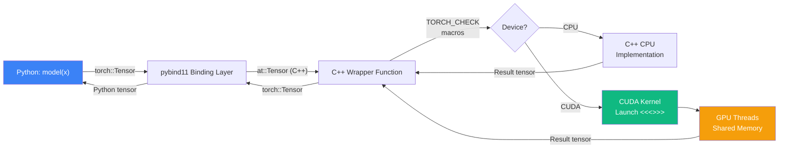
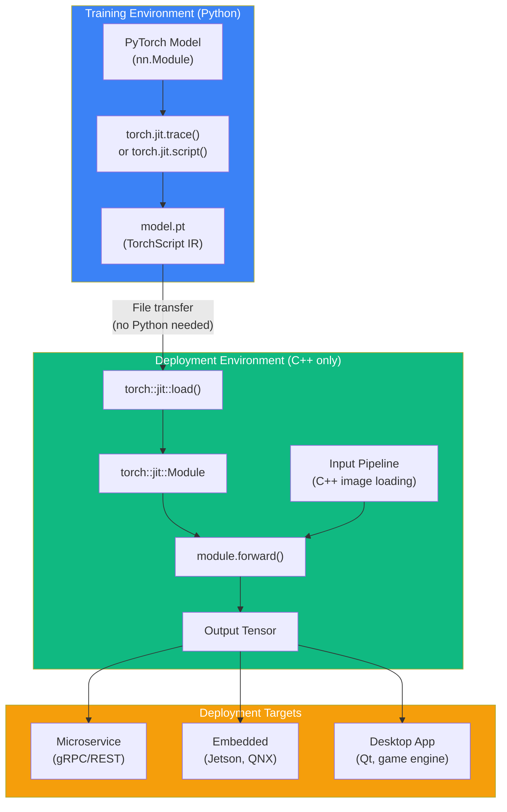

# Chapter 67: PyTorch C++ Extensions & LibTorch

`Difficulty: Advanced`
`Tags: #PyTorch #LibTorch #CppExtension #CUDAExtension #pybind11 #TorchScript #Autograd #JIT #Inference`

---

## 1. Theory — Bridging Python and C++/CUDA

PyTorch's Python frontend is convenient for prototyping, but production workloads demand more. C++ extensions let you write performance-critical operators in C++/CUDA while keeping the rest of your pipeline in Python. LibTorch goes further — it runs PyTorch models in pure C++ with **zero Python dependency**.

### What / Why / How

- **What**: Two complementary mechanisms — (1) C++ Extensions that compile custom C++/CUDA ops and expose them to Python via pybind11, and (2) LibTorch, a standalone C++ library for loading and running TorchScript models without Python.
- **Why**: Python's GIL and interpreter overhead add 5-50 µs per op dispatch. For latency-sensitive inference (autonomous driving, HFT, robotics) or custom CUDA kernels (flash attention, quantized ops), C++ eliminates that overhead. LibTorch enables deployment on embedded devices, microservices, and environments where Python cannot be installed.
- **How**: `torch.utils.cpp_extension` provides two paths — `setup.py` builds with `CppExtension`/`CUDAExtension`, and `load()` for JIT compilation. pybind11 binds C++ functions to Python. LibTorch links against `libtorch.so` directly, loading serialized TorchScript modules via `torch::jit::load()`.

### Extension Architecture Overview

The call path flows from Python through pybind11 into C++ wrapper functions that dispatch to CUDA kernels. Autograd backward calls follow the same path in reverse. The `torch::Tensor` type is shared across all layers — no data copying at boundaries.

### CppExtension vs CUDAExtension

| Feature | CppExtension | CUDAExtension |
|---|---|---|
| Sources | `.cpp` only | `.cpp` + `.cu` |
| Compiler | Host C++ | nvcc + host |
| GPU kernels | No | Yes |

### JIT vs Setuptools

| Method | `load()` (JIT) | `setup.py` (Setuptools) |
|---|---|---|
| Build trigger | First `load()` call | `pip install .` |
| Best for | Development | Production |
| Rebuild | Auto on source change | Manual reinstall |

## 2. Data Flow — Python to CUDA Kernel



## 3. Code — Complete C++ Extension with CUDA

### 3.1 The CUDA Kernel (`relu_cuda_kernel.cu`)

```cuda
// relu_cuda_kernel.cu — Custom fused ReLU + scale kernel
#include <torch/extension.h>
#include <cuda.h>
#include <cuda_runtime.h>

template <typename scalar_t>
__global__ void relu_scale_forward_kernel(
    const scalar_t* __restrict__ input,
    scalar_t* __restrict__ output,
    const scalar_t scale,
    const int64_t N)
{
    const int64_t idx = blockIdx.x * blockDim.x + threadIdx.x;
    if (idx < N) {
        scalar_t val = input[idx];
        output[idx] = (val > scalar_t(0)) ? val * scale : scalar_t(0);
    }
}

template <typename scalar_t>
__global__ void relu_scale_backward_kernel(
    const scalar_t* __restrict__ grad_output,
    const scalar_t* __restrict__ input,
    scalar_t* __restrict__ grad_input,
    const scalar_t scale, const int64_t N)
{
    const int64_t idx = blockIdx.x * blockDim.x + threadIdx.x;
    if (idx < N)
        grad_input[idx] = (input[idx] > scalar_t(0)) ? grad_output[idx] * scale : scalar_t(0);
}

// C++ wrapper dispatching to correct scalar type
torch::Tensor relu_scale_forward_cuda(torch::Tensor input, float scale) {
    TORCH_CHECK(input.is_cuda(), "Input must be a CUDA tensor");
    TORCH_CHECK(input.is_contiguous(), "Input must be contiguous");

    auto output = torch::empty_like(input);
    const int64_t N = input.numel();
    const int threads = 256;
    const int blocks = (N + threads - 1) / threads;

    AT_DISPATCH_FLOATING_TYPES(input.scalar_type(), "relu_scale_forward", ([&] {
        relu_scale_forward_kernel<scalar_t><<<blocks, threads>>>(
            input.data_ptr<scalar_t>(),
            output.data_ptr<scalar_t>(),
            static_cast<scalar_t>(scale),
            N);
    }));

    return output;
}

torch::Tensor relu_scale_backward_cuda(
    torch::Tensor grad_output, torch::Tensor input, float scale)
{
    TORCH_CHECK(grad_output.is_cuda() && input.is_cuda());
    auto grad_input = torch::empty_like(input);
    const int64_t N = input.numel();
    const int threads = 256, blocks = (N + threads - 1) / threads;

    AT_DISPATCH_FLOATING_TYPES(input.scalar_type(), "relu_scale_backward", ([&] {
        relu_scale_backward_kernel<scalar_t><<<blocks, threads>>>(
            grad_output.data_ptr<scalar_t>(), input.data_ptr<scalar_t>(),
            grad_input.data_ptr<scalar_t>(), static_cast<scalar_t>(scale), N);
    }));
    return grad_input;
}
```

### 3.2 The C++ Binding File (`relu_scale.cpp`)

```cpp
// relu_scale.cpp — pybind11 bindings + autograd Function
#include <torch/extension.h>
#include <vector>

// Forward declarations of CUDA implementations
torch::Tensor relu_scale_forward_cuda(torch::Tensor input, float scale);
torch::Tensor relu_scale_backward_cuda(
    torch::Tensor grad_output, torch::Tensor input, float scale);

#define CHECK_CUDA(x) TORCH_CHECK(x.device().is_cuda(), #x " must be CUDA")
#define CHECK_CONTIGUOUS(x) TORCH_CHECK(x.is_contiguous(), #x " contiguous")
#define CHECK_INPUT(x) CHECK_CUDA(x); CHECK_CONTIGUOUS(x)

// Custom autograd Function
class ReluScaleFunction : public torch::autograd::Function<ReluScaleFunction> {
public:
    static torch::Tensor forward(
        torch::autograd::AutogradContext* ctx,
        torch::Tensor input,
        double scale)
    {
        CHECK_INPUT(input);
        ctx->save_for_backward({input});
        ctx->saved_data["scale"] = scale;
        return relu_scale_forward_cuda(input, static_cast<float>(scale));
    }

    static torch::autograd::variable_list backward(
        torch::autograd::AutogradContext* ctx,
        torch::autograd::variable_list grad_outputs)
    {
        auto saved = ctx->get_saved_variables();
        auto input = saved[0];
        float scale = static_cast<float>(ctx->saved_data["scale"].toDouble());

        auto grad_input = relu_scale_backward_cuda(
            grad_outputs[0], input, scale);

        // Return gradients: one per forward() argument (input, scale)
        // scale is not differentiable → torch::Tensor()
        return {grad_input, torch::Tensor()};
    }
};

// Convenience wrapper
torch::Tensor relu_scale(torch::Tensor input, double scale) {
    return ReluScaleFunction::apply(input, scale);
}

// pybind11 module definition
PYBIND11_MODULE(TORCH_EXTENSION_NAME, m) {
    m.def("forward",  &relu_scale_forward_cuda,  "ReLU-Scale forward (CUDA)");
    m.def("backward", &relu_scale_backward_cuda, "ReLU-Scale backward (CUDA)");
    m.def("relu_scale", &relu_scale,
          "ReLU-Scale with autograd (CUDA)",
          py::arg("input"), py::arg("scale") = 1.0);
}
```

### 3.3 Setuptools Build (`setup.py`)

```python
# setup.py — Build the extension as an installable package
from setuptools import setup
from torch.utils.cpp_extension import CUDAExtension, BuildExtension

setup(
    name='relu_scale_cuda',
    ext_modules=[
        CUDAExtension(
            name='relu_scale_cuda',
            sources=[
                'relu_scale.cpp',
                'relu_cuda_kernel.cu',
            ],
            extra_compile_args={
                'cxx': ['-O3'],
                'nvcc': ['-O3', '--use_fast_math',
                         '-gencode=arch=compute_80,code=sm_80'],
            },
        ),
    ],
    cmdclass={'build_ext': BuildExtension},
)
# Build:  python setup.py install
# Or:     pip install .
```

### 3.4 JIT Compilation Alternative

```python
# jit_load.py — Compile on-the-fly, no setup.py needed
from torch.utils.cpp_extension import load

relu_scale_cuda = load(
    name='relu_scale_cuda',
    sources=['relu_scale.cpp', 'relu_cuda_kernel.cu'],
    extra_cuda_cflags=['-O3', '--use_fast_math'],
    verbose=True,
)

# Cached in ~/.cache/torch_extensions/ — rebuilds only when source changes
```

### 3.5 Python Usage

```python
# train_with_extension.py
import torch
import relu_scale_cuda

x = torch.randn(1024, 512, device='cuda', requires_grad=True)
y = relu_scale_cuda.relu_scale(x, scale=2.0)
y.sum().backward()  # Calls our custom backward kernel automatically
print(f"Output: {y.shape}, Grad nonzero: {(x.grad != 0).sum().item()}")

# Integrate into nn.Module
class ScaledReLUNet(torch.nn.Module):
    def __init__(self, in_feat, out_feat, scale=2.0):
        super().__init__()
        self.linear = torch.nn.Linear(in_feat, out_feat)
        self.scale = scale

    def forward(self, x):
        return relu_scale_cuda.relu_scale(self.linear(x), self.scale)
```

## 4. torch::Tensor C++ API Essentials

```cpp
#include <torch/torch.h>

void tensor_api_demo() {
    auto a = torch::zeros({3, 4}, torch::kFloat32);          // Creation
    auto b = torch::randn({3, 4}, torch::device(torch::kCUDA));
    auto d = a.to(torch::kCUDA);                              // CPU → GPU
    float* ptr = a.data_ptr<float>();                          // Raw pointer
    float val = a[1][2].item<float>();                         // Single element

    auto f = torch::matmul(a, a.t());                          // Ops mirror Python
    auto g = torch::relu(a);
    a.fill_(1.0);                                              // In-place
}
```

## 5. LibTorch — Pure C++ Inference

### 5.1 Export from Python (TorchScript)

```python
# export_model.py — Serialize model for C++ inference
import torch

class MyModel(torch.nn.Module):
    def __init__(self):
        super().__init__()
        self.conv1 = torch.nn.Conv2d(3, 16, 3, padding=1)
        self.bn1   = torch.nn.BatchNorm2d(16)
        self.fc    = torch.nn.Linear(16 * 32 * 32, 10)

    def forward(self, x):
        x = torch.relu(self.bn1(self.conv1(x)))
        return self.fc(x.view(x.size(0), -1))

model = MyModel().eval()
example = torch.randn(1, 3, 32, 32)
torch.jit.trace(model, example).save("model_traced.pt")   # Static graphs
torch.jit.script(model).save("model_scripted.pt")          # Dynamic control flow
```

### 5.2 LibTorch Deployment Architecture



### 5.3 C++ Inference Application

```cpp
// inference.cpp — Pure C++ inference, no Python dependency
#include <torch/script.h>
#include <iostream>
#include <chrono>

int main(int argc, const char* argv[]) {
    if (argc != 2) {
        std::cerr << "Usage: inference <path-to-model.pt>\n";
        return 1;
    }

    // Load serialized TorchScript model
    torch::jit::script::Module module;
    try {
        module = torch::jit::load(argv[1]);
        module.eval();
    } catch (const c10::Error& e) {
        std::cerr << "Failed to load model: " << e.what() << "\n";
        return 1;
    }

    // Move to GPU if available
    torch::Device device(torch::kCPU);
    if (torch::cuda::is_available()) {
        device = torch::Device(torch::kCUDA);
        module.to(device);
    }

    // Prepare input and run inference
    auto input = torch::randn({1, 3, 32, 32}).to(device);
    std::vector<torch::jit::IValue> inputs{input};

    auto output = module.forward(inputs).toTensor();
    auto pred = output.argmax(1).item<int64_t>();
    std::cout << "Predicted class: " << pred << "\n";

    // Benchmark: 1000 iterations
    torch::NoGradGuard no_grad;
    auto start = std::chrono::high_resolution_clock::now();
    for (int i = 0; i < 1000; ++i) module.forward(inputs);
    if (device.is_cuda()) torch::cuda::synchronize();
    auto ms = std::chrono::duration<double, std::milli>(
        std::chrono::high_resolution_clock::now() - start).count();
    std::cout << "Avg latency: " << ms / 1000.0 << " ms\n";
    return 0;
}
```

### 5.4 CMakeLists.txt for LibTorch

```cmake
cmake_minimum_required(VERSION 3.18)
project(libtorch_inference LANGUAGES CXX)
set(CMAKE_CXX_STANDARD 17)

find_package(Torch REQUIRED)  # cmake -DCMAKE_PREFIX_PATH=/path/to/libtorch ..
add_executable(inference inference.cpp)
target_link_libraries(inference "${TORCH_LIBRARIES}")
```

Build: `mkdir build && cd build && cmake -DCMAKE_PREFIX_PATH=/path/to/libtorch .. && cmake --build .`

## 6. C++ Training Loop with LibTorch

```cpp
// train.cpp — Full training loop in C++, no Python
#include <torch/torch.h>
#include <iostream>

struct ConvNet : torch::nn::Module {
    torch::nn::Conv2d conv1{nullptr}, conv2{nullptr};
    torch::nn::Linear fc1{nullptr}, fc2{nullptr};

    ConvNet() {
        conv1 = register_module("conv1", torch::nn::Conv2d(1, 32, 3));
        conv2 = register_module("conv2", torch::nn::Conv2d(32, 64, 3));
        fc1   = register_module("fc1",   torch::nn::Linear(64 * 12 * 12, 128));
        fc2   = register_module("fc2",   torch::nn::Linear(128, 10));
    }

    torch::Tensor forward(torch::Tensor x) {
        x = torch::relu(conv1->forward(x));
        x = torch::relu(conv2->forward(x));
        x = x.view({x.size(0), -1});
        return torch::log_softmax(fc2->forward(torch::relu(fc1->forward(x))), 1);
    }
};

int main() {
    auto device = torch::cuda::is_available() ? torch::kCUDA : torch::kCPU;
    auto dataset = torch::data::datasets::MNIST("./data")
        .map(torch::data::transforms::Stack<>());
    auto loader = torch::data::make_data_loader(
        std::move(dataset), torch::data::DataLoaderOptions().batch_size(64));

    ConvNet model;
    model.to(device);
    torch::optim::Adam optimizer(model.parameters(), torch::optim::AdamOptions(1e-3));

    for (int epoch = 0; epoch < 5; ++epoch) {
        double total_loss = 0; int n = 0;
        for (auto& batch : *loader) {
            auto data = batch.data.to(device), target = batch.target.to(device);
            optimizer.zero_grad();
            auto loss = torch::nll_loss(model.forward(data), target);
            loss.backward();
            optimizer.step();
            total_loss += loss.item<double>(); ++n;
        }
        std::cout << "Epoch " << epoch+1 << " Loss: " << total_loss/n << "\n";
    }
    torch::save(model, "convnet.pt");
}
```

## 7. Performance: Python vs C++ Extension Overhead

| Scenario | Overhead | Notes |
|---|---|---|
| Python op dispatch | 5-50 µs/call | GIL + interpreter |
| C++ extension call | 1-5 µs/call | pybind11 marshaling |
| LibTorch (pure C++) | <1 µs/call | No Python |
| Large tensor compute | Negligible diff | GPU-bound, dispatch irrelevant |

**Rule**: Extensions matter for many small ops (custom activations). For large matmuls, built-in kernels are already optimal.

## 8. Exercises

### 🟢 Exercise 1 — JIT Compile a CPU Extension

Write `double_tensor(torch::Tensor x)` returning `x * 2`. JIT-compile with `load()` and verify from Python.

### 🟡 Exercise 2 — CUDA Softmax Extension

Implement a numerically stable softmax CUDA kernel (subtract max, exp, normalize). Build with `CUDAExtension` and verify against `torch.softmax()` within `1e-5`.

### 🟡 Exercise 3 — Custom Autograd Backward

Add a backward pass to the softmax extension. Wrap in `torch::autograd::Function` and verify with `gradcheck()`.

### 🔴 Exercise 4 — LibTorch Inference Server

Build a C++ app that loads a TorchScript ResNet-18, preprocesses images with OpenCV, runs batch inference, and reports throughput in images/second.

## 9. Solutions

### Solution 1 — CPU Extension

```cpp
// double_op.cpp
#include <torch/extension.h>

torch::Tensor double_tensor(torch::Tensor x) {
    TORCH_CHECK(x.is_contiguous(), "Input must be contiguous");
    return x * 2;
}

PYBIND11_MODULE(TORCH_EXTENSION_NAME, m) {
    m.def("double_tensor", &double_tensor, "Double a tensor");
}
```

```python
# test_double.py
from torch.utils.cpp_extension import load
import torch

ext = load(name='double_op', sources=['double_op.cpp'], verbose=True)
x = torch.tensor([1.0, 2.0, 3.0])
result = ext.double_tensor(x)
assert torch.allclose(result, x * 2)
print("Passed:", result)
```

### Solution 2 — CUDA Softmax (key kernel)

```cuda
// softmax_kernel.cu — one block per row for simplicity
template <typename scalar_t>
__global__ void softmax_forward_kernel(
    const scalar_t* __restrict__ input,
    scalar_t* __restrict__ output,
    const int rows, const int cols)
{
    int row = blockIdx.x;
    if (row >= rows) return;
    const scalar_t* in_row = input + row * cols;
    scalar_t* out_row = output + row * cols;

    scalar_t max_val = in_row[0];
    for (int j = 1; j < cols; ++j) max_val = max(max_val, in_row[j]);

    scalar_t sum = 0;
    for (int j = 0; j < cols; ++j) {
        out_row[j] = exp(in_row[j] - max_val);
        sum += out_row[j];
    }
    for (int j = 0; j < cols; ++j) out_row[j] /= sum;
}

torch::Tensor softmax_forward_cuda(torch::Tensor input) {
    TORCH_CHECK(input.dim() == 2 && input.is_cuda());
    auto output = torch::empty_like(input);
    AT_DISPATCH_FLOATING_TYPES(input.scalar_type(), "softmax_fwd", ([&] {
        softmax_forward_kernel<scalar_t><<<input.size(0), 1>>>(
            input.data_ptr<scalar_t>(), output.data_ptr<scalar_t>(),
            input.size(0), input.size(1));
    }));
    return output;
}
```

### Solution 3 — Autograd Backward (binding excerpt)

```cpp
// Wrap softmax_forward_cuda in autograd::Function
class SoftmaxFunction : public torch::autograd::Function<SoftmaxFunction> {
public:
    static torch::Tensor forward(
        torch::autograd::AutogradContext* ctx, torch::Tensor input) {
        auto output = softmax_forward_cuda(input);
        ctx->save_for_backward({output});
        return output;
    }
    static torch::autograd::variable_list backward(
        torch::autograd::AutogradContext* ctx,
        torch::autograd::variable_list grad_outputs) {
        auto S = ctx->get_saved_variables()[0];
        auto grad = grad_outputs[0];
        // dL/dx_i = S_i * (dL/dS_i - sum_j(dL/dS_j * S_j))
        auto sum_term = (grad * S).sum(1, /*keepdim=*/true);
        return {S * (grad - sum_term)};
    }
};
```

Verify with `torch.autograd.gradcheck(ext.softmax, (x,), eps=1e-6, atol=1e-4)` using float64 inputs.

## 10. Quiz

**Q1.** What is the role of `AT_DISPATCH_FLOATING_TYPES` in a C++ extension?

A) It selects the GPU to run on
B) It generates template instantiations for float and double at runtime
C) It dispatches the correct scalar_t type based on the input tensor's dtype
D) It converts tensors between float16 and float32

**Q2.** Which function is used to JIT-compile a C++ extension without `setup.py`?

A) `torch.compile()`
B) `torch.utils.cpp_extension.load()`
C) `torch.jit.trace()`
D) `torch.utils.cpp_extension.build()`

**Q3.** In a custom `torch::autograd::Function`, what must `backward()` return?

A) A single tensor — the loss gradient
B) A `variable_list` with one gradient per `forward()` input
C) A Python dictionary mapping input names to gradients
D) Nothing — gradients are computed automatically

**Q4.** What does `torch::jit::load()` return?

A) A `torch::nn::Module`
B) A `torch::jit::script::Module`
C) A Python module object
D) A raw tensor

**Q5.** Which macro should you use to validate tensor properties in C++ extensions?

A) `assert()`
B) `CHECK()`
C) `TORCH_CHECK()`
D) `AT_ASSERT()`

**Q6.** What is the main advantage of LibTorch over Python PyTorch for deployment?

A) LibTorch models are always faster
B) LibTorch has more operators
C) LibTorch requires no Python runtime dependency
D) LibTorch supports more GPU architectures

**Q7.** In `setup.py`, what class should `cmdclass['build_ext']` be set to?

A) `setuptools.Extension`
B) `torch.utils.cpp_extension.BuildExtension`
C) `distutils.build_ext`
D) `torch.utils.build.CUDABuild`

### Answers

| Q | Ans | Key Reason |
|---|---|---|
| 1 | **C** | Switches on tensor's `scalar_type()` to instantiate the correct template |
| 2 | **B** | `load()` compiles and caches; rebuilds on source change |
| 3 | **B** | One gradient per `forward()` input; `torch::Tensor()` for non-differentiable |
| 4 | **B** | Returns `torch::jit::script::Module` wrapping TorchScript IR |
| 5 | **C** | `TORCH_CHECK` throws `c10::Error` with file/line info |
| 6 | **C** | Links `libtorch.so` directly — no CPython needed |
| 7 | **B** | Handles mixed C++/CUDA compilation and ABI |

## 11. Key Takeaways

- **`CppExtension`** = CPU-only ops; **`CUDAExtension`** = CPU + `.cu` kernels with nvcc.
- **`load()`** = zero-config JIT compilation; **`setup.py`** = production distribution.
- **pybind11** glues C++ to Python — `PYBIND11_MODULE` auto-converts `torch::Tensor`.
- Custom **autograd Functions** need static `forward()` + `backward()`, one gradient per input.
- **`TORCH_CHECK`** > `assert()` — works in release builds, throws structured `c10::Error`.
- **`AT_DISPATCH_FLOATING_TYPES`** generates type-correct kernel instantiations at runtime.
- **LibTorch** = Python-free inference: `torch.jit.trace/script` → `torch::jit::load()` → C++ binary.
- Extensions matter for **small, frequent ops**; large tensor ops are GPU-bound regardless.

## 12. Chapter Summary

This chapter covered extending PyTorch with C++/CUDA and deploying without Python. We built a complete CUDA extension — kernel, pybind11 bindings, `setup.py` — integrated with autograd. We serialized models as TorchScript and loaded them in C++ with `torch::jit::load()` for standalone inference, and implemented a full C++ training loop with LibTorch.

## 13. Real-World Insight

**NVIDIA's FasterTransformer** (now TensorRT-LLM) started as PyTorch C++ extensions — custom CUDA kernels for attention and beam search wrapped via pybind11. Meta's inference stack uses LibTorch for ranking models: trained in Python, exported via TorchScript, served by C++ at millions of QPS with sub-millisecond latency. Tesla's Autopilot runs LibTorch on custom hardware where Python is unavailable. The pattern: **prototype in Python, optimize in CUDA, deploy in C++**.

## 14. Common Mistakes

| Mistake | Fix |
|---|---|
| Forgetting `CHECK_CONTIGUOUS` | Non-contiguous `data_ptr` reads wrong values — always check or call `.contiguous()` |
| `assert()` instead of `TORCH_CHECK` | `assert` stripped in release; `TORCH_CHECK` active in all builds |
| Not returning `torch::Tensor()` for non-diff args | Autograd expects exactly one gradient per forward argument |
| CXX ABI mismatch | Match `_GLIBCXX_USE_CXX11_ABI` between LibTorch and compiler |
| `trace()` with control flow | `trace` records one path; use `script` for if/else and dynamic loops |
| Missing `module.eval()` before export | BatchNorm/Dropout behave differently in train mode |

## 15. Interview Questions

### Q1: What is the difference between `torch.jit.trace()` and `torch.jit.script()`?

**Answer:** `trace()` records operations by running the model with a concrete input — it captures the exact op sequence but **ignores control flow** (if/else, data-dependent loops). `script()` analyzes Python source and compiles to TorchScript IR, **preserving control flow**. Use `trace()` for static feed-forward models (ResNet, VGG). Use `script()` for models with dynamic behavior — variable-length sequences, conditional computation. You can mix both: trace static submodules and script the top-level router.

### Q2: How does `AT_DISPATCH_FLOATING_TYPES` work?

**Answer:** It switches on a tensor's `ScalarType` at runtime and instantiates a template lambda for each floating-point type (float, double). Inside the lambda, `scalar_t` resolves to the concrete type. This bridges the gap between CUDA's compile-time templates and PyTorch's runtime dtypes. Variants like `AT_DISPATCH_FLOATING_TYPES_AND_HALF` add float16 support for mixed-precision training.

### Q3: How does a custom `torch::autograd::Function` integrate with autograd?

**Answer:** You subclass `torch::autograd::Function<YourClass>` with static `forward()` and `backward()`. Forward receives `AutogradContext*` to save tensors via `ctx->save_for_backward()`. Backward receives saved context and upstream gradients, returning a `variable_list` with one gradient per forward input (`torch::Tensor()` for non-differentiable args). Calling `YourClass::apply()` registers a node in the autograd graph; during `loss.backward()`, the engine invokes your custom backward.

### Q4: What are key considerations for LibTorch production deployment?

**Answer:** (1) **ABI compatibility** — match `_GLIBCXX_USE_CXX11_ABI` between LibTorch and your compiler. (2) **Input preprocessing** — reimplement all transforms in C++ since Python code doesn't transfer. (3) **Thread safety** — call `.eval()` and use `torch::NoGradGuard`; the module is then safe for concurrent inference. (4) **Error handling** — catch `c10::Error`; no Python tracebacks available. (5) **GPU memory** — use CUDA streams for concurrent inference.

### Q5: When should you write a C++ extension vs use `torch.compile()`?

**Answer:** Write C++ extensions for: fused kernels that `torch.compile` cannot fuse, warp-level CUDA primitives (`__shfl_sync`), custom memory management, or new hardware backends. Prefer `torch.compile()` for standard op compositions — it auto-generates optimized CUDA/Triton code with less effort. Prefer existing PyTorch ops when available, as they are extensively tested and optimized.
