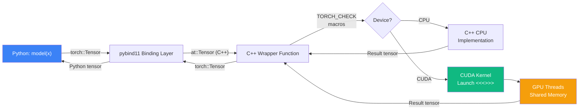
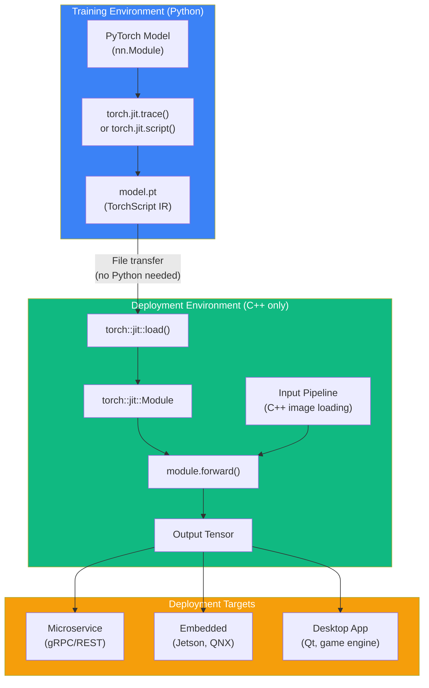

# Chapter 67: PyTorch C++ Extensions & LibTorch

`Difficulty: Advanced`
`Tags: #PyTorch #LibTorch #CppExtension #CUDAExtension #pybind11 #TorchScript #Autograd #JIT #Inference`

---

## 1. Theory — Bridging Python and C++/CUDA

PyTorch's Python frontend is convenient for prototyping, but production workloads demand more. C++ extensions let you write performance-critical operators in C++/CUDA while keeping the rest of your pipeline in Python. LibTorch goes further — it runs PyTorch models in pure C++ with **zero Python dependency**.

### What / Why / How

- **What**: Two complementary mechanisms — (1) C++ Extensions that compile custom C++/CUDA ops and expose them to Python via pybind11, and (2) LibTorch, a standalone C++ library for loading and running TorchScript models without Python.
- **Why**: Python's GIL and interpreter overhead add 5-50 µs per op dispatch. For latency-sensitive inference (autonomous driving, HFT, robotics) or custom CUDA kernels (flash attention, quantized ops), C++ eliminates that overhead. LibTorch enables deployment on embedded devices, microservices, and environments where Python cannot be installed.
- **How**: `torch.utils.cpp_extension` provides two paths — `setup.py` builds with `CppExtension`/`CUDAExtension`, and `load()` for JIT compilation. pybind11 binds C++ functions to Python. LibTorch links against `libtorch.so` directly, loading serialized TorchScript modules via `torch::jit::load()`.

### Extension Architecture Overview

```
Python Layer          │  C++ Extension Layer      │  CUDA Layer
──────────────────────┼───────────────────────────┼──────────────────
import my_ext         │  pybind11 TORCH_LIBRARY    │  __global__ kernel
my_ext.forward(x)  ──┼──► C++ wrapper function ───┼──► CUDA kernel launch
                      │  torch::Tensor API         │  shared memory, warps
autograd.backward() ──┼──► custom backward()    ───┼──► gradient kernel
```

### CppExtension vs CUDAExtension

| Feature | CppExtension | CUDAExtension |
|---|---|---|
| Source files | `.cpp` only | `.cpp` + `.cu` |
| Compiler | System C++ compiler | nvcc + host compiler |
| GPU kernels | No | Yes |
| Use case | CPU-only custom ops | Custom CUDA kernels |
| Setup | `CppExtension(...)` | `CUDAExtension(...)` |

### JIT vs Setuptools Compilation

| Method | `load()` (JIT) | `setup.py` (Setuptools) |
|---|---|---|
| Build trigger | First `import` or `load()` call | Explicit `python setup.py install` |
| Caching | `~/.cache/torch_extensions/` | Site-packages |
| Best for | Development / prototyping | Production / distribution |
| Rebuild | Automatic on source change | Manual reinstall |

---

## 2. Data Flow — Python to CUDA Kernel



---

## 3. Code — Complete C++ Extension with CUDA

### 3.1 The CUDA Kernel (`relu_cuda_kernel.cu`)

```cuda
// relu_cuda_kernel.cu — Custom fused ReLU + scale kernel
#include <torch/extension.h>
#include <cuda.h>
#include <cuda_runtime.h>

template <typename scalar_t>
__global__ void relu_scale_forward_kernel(
    const scalar_t* __restrict__ input,
    scalar_t* __restrict__ output,
    const scalar_t scale,
    const int64_t N)
{
    const int64_t idx = blockIdx.x * blockDim.x + threadIdx.x;
    if (idx < N) {
        scalar_t val = input[idx];
        output[idx] = (val > scalar_t(0)) ? val * scale : scalar_t(0);
    }
}

template <typename scalar_t>
__global__ void relu_scale_backward_kernel(
    const scalar_t* __restrict__ grad_output,
    const scalar_t* __restrict__ input,
    scalar_t* __restrict__ grad_input,
    const scalar_t scale,
    const int64_t N)
{
    const int64_t idx = blockIdx.x * blockDim.x + threadIdx.x;
    if (idx < N) {
        grad_input[idx] = (input[idx] > scalar_t(0))
            ? grad_output[idx] * scale
            : scalar_t(0);
    }
}

// C++ wrapper dispatching to correct scalar type
torch::Tensor relu_scale_forward_cuda(torch::Tensor input, float scale) {
    TORCH_CHECK(input.is_cuda(), "Input must be a CUDA tensor");
    TORCH_CHECK(input.is_contiguous(), "Input must be contiguous");

    auto output = torch::empty_like(input);
    const int64_t N = input.numel();
    const int threads = 256;
    const int blocks = (N + threads - 1) / threads;

    AT_DISPATCH_FLOATING_TYPES(input.scalar_type(), "relu_scale_forward", ([&] {
        relu_scale_forward_kernel<scalar_t><<<blocks, threads>>>(
            input.data_ptr<scalar_t>(),
            output.data_ptr<scalar_t>(),
            static_cast<scalar_t>(scale),
            N);
    }));

    return output;
}

torch::Tensor relu_scale_backward_cuda(
    torch::Tensor grad_output, torch::Tensor input, float scale)
{
    TORCH_CHECK(grad_output.is_cuda(), "grad_output must be CUDA");
    TORCH_CHECK(input.is_cuda(), "input must be CUDA");

    auto grad_input = torch::empty_like(input);
    const int64_t N = input.numel();
    const int threads = 256;
    const int blocks = (N + threads - 1) / threads;

    AT_DISPATCH_FLOATING_TYPES(input.scalar_type(), "relu_scale_backward", ([&] {
        relu_scale_backward_kernel<scalar_t><<<blocks, threads>>>(
            grad_output.data_ptr<scalar_t>(),
            input.data_ptr<scalar_t>(),
            grad_input.data_ptr<scalar_t>(),
            static_cast<scalar_t>(scale),
            N);
    }));

    return grad_input;
}
```

### 3.2 The C++ Binding File (`relu_scale.cpp`)

```cpp
// relu_scale.cpp — pybind11 bindings + autograd Function
#include <torch/extension.h>
#include <vector>

// Forward declarations of CUDA implementations
torch::Tensor relu_scale_forward_cuda(torch::Tensor input, float scale);
torch::Tensor relu_scale_backward_cuda(
    torch::Tensor grad_output, torch::Tensor input, float scale);

// Input validation macro
#define CHECK_CUDA(x) TORCH_CHECK(x.device().is_cuda(), #x " must be CUDA")
#define CHECK_CONTIGUOUS(x) TORCH_CHECK(x.is_contiguous(), #x " must be contiguous")
#define CHECK_INPUT(x) CHECK_CUDA(x); CHECK_CONTIGUOUS(x)

// Custom autograd Function
class ReluScaleFunction : public torch::autograd::Function<ReluScaleFunction> {
public:
    static torch::Tensor forward(
        torch::autograd::AutogradContext* ctx,
        torch::Tensor input,
        double scale)
    {
        CHECK_INPUT(input);
        ctx->save_for_backward({input});
        ctx->saved_data["scale"] = scale;
        return relu_scale_forward_cuda(input, static_cast<float>(scale));
    }

    static torch::autograd::variable_list backward(
        torch::autograd::AutogradContext* ctx,
        torch::autograd::variable_list grad_outputs)
    {
        auto saved = ctx->get_saved_variables();
        auto input = saved[0];
        float scale = static_cast<float>(ctx->saved_data["scale"].toDouble());

        auto grad_input = relu_scale_backward_cuda(
            grad_outputs[0], input, scale);

        // Return gradients: one per forward() argument (input, scale)
        // scale is not differentiable → torch::Tensor()
        return {grad_input, torch::Tensor()};
    }
};

// Convenience wrapper
torch::Tensor relu_scale(torch::Tensor input, double scale) {
    return ReluScaleFunction::apply(input, scale);
}

// pybind11 module definition
PYBIND11_MODULE(TORCH_EXTENSION_NAME, m) {
    m.def("forward",  &relu_scale_forward_cuda,  "ReLU-Scale forward (CUDA)");
    m.def("backward", &relu_scale_backward_cuda, "ReLU-Scale backward (CUDA)");
    m.def("relu_scale", &relu_scale,
          "ReLU-Scale with autograd (CUDA)",
          py::arg("input"), py::arg("scale") = 1.0);
}
```

### 3.3 Setuptools Build (`setup.py`)

```python
# setup.py — Build the extension as an installable package
from setuptools import setup
from torch.utils.cpp_extension import CUDAExtension, BuildExtension

setup(
    name='relu_scale_cuda',
    ext_modules=[
        CUDAExtension(
            name='relu_scale_cuda',
            sources=[
                'relu_scale.cpp',
                'relu_cuda_kernel.cu',
            ],
            extra_compile_args={
                'cxx': ['-O3'],
                'nvcc': ['-O3', '--use_fast_math',
                         '-gencode=arch=compute_80,code=sm_80'],
            },
        ),
    ],
    cmdclass={'build_ext': BuildExtension},
)
# Build:  python setup.py install
# Or:     pip install .
```

### 3.4 JIT Compilation Alternative

```python
# jit_load.py — Compile on-the-fly, no setup.py needed
from torch.utils.cpp_extension import load

relu_scale_cuda = load(
    name='relu_scale_cuda',
    sources=['relu_scale.cpp', 'relu_cuda_kernel.cu'],
    extra_cuda_cflags=['-O3', '--use_fast_math'],
    verbose=True,
)

# Cached in ~/.cache/torch_extensions/ — rebuilds only when source changes
```

### 3.5 Python Usage

```python
# train_with_extension.py
import torch
import relu_scale_cuda  # Our compiled extension

# Use the autograd-aware version
x = torch.randn(1024, 512, device='cuda', requires_grad=True)
y = relu_scale_cuda.relu_scale(x, scale=2.0)

loss = y.sum()
loss.backward()  # Calls our custom backward kernel automatically

print(f"Output shape: {y.shape}")
print(f"Grad shape:   {x.grad.shape}")
print(f"Grad nonzero: {(x.grad != 0).sum().item()}")

# Integrate into an nn.Module
class ScaledReLUNet(torch.nn.Module):
    def __init__(self, in_features, out_features, scale=2.0):
        super().__init__()
        self.linear = torch.nn.Linear(in_features, out_features)
        self.scale = scale

    def forward(self, x):
        return relu_scale_cuda.relu_scale(self.linear(x), self.scale)

model = ScaledReLUNet(512, 256).cuda()
out = model(x)
out.sum().backward()
```

---

## 4. torch::Tensor C++ API Essentials

```cpp
#include <torch/torch.h>

void tensor_api_demo() {
    auto a = torch::zeros({3, 4}, torch::kFloat32);          // Creation
    auto b = torch::randn({3, 4}, torch::device(torch::kCUDA));
    auto d = a.to(torch::kCUDA);                              // CPU → GPU
    float* ptr = a.data_ptr<float>();                          // Raw pointer
    float val = a[1][2].item<float>();                         // Single element

    auto f = torch::matmul(a, a.t());                          // Ops mirror Python
    auto g = torch::relu(a);
    a.fill_(1.0);                                              // In-place
}
```

---

## 5. LibTorch — Pure C++ Inference

### 5.1 Export from Python (TorchScript)

```python
# export_model.py — Serialize model for C++ inference
import torch

class MyModel(torch.nn.Module):
    def __init__(self):
        super().__init__()
        self.conv1 = torch.nn.Conv2d(3, 16, 3, padding=1)
        self.bn1   = torch.nn.BatchNorm2d(16)
        self.fc    = torch.nn.Linear(16 * 32 * 32, 10)

    def forward(self, x):
        x = torch.relu(self.bn1(self.conv1(x)))
        x = x.view(x.size(0), -1)
        return self.fc(x)

model = MyModel().eval()
example_input = torch.randn(1, 3, 32, 32)

# Method 1: Trace (follows execution path)
traced = torch.jit.trace(model, example_input)
traced.save("model_traced.pt")

# Method 2: Script (preserves control flow)
scripted = torch.jit.script(model)
scripted.save("model_scripted.pt")
```

### 5.2 LibTorch Deployment Architecture



### 5.3 C++ Inference Application

```cpp
// inference.cpp — Pure C++ inference, no Python dependency
#include <torch/script.h>
#include <iostream>
#include <memory>
#include <chrono>

int main(int argc, const char* argv[]) {
    if (argc != 2) {
        std::cerr << "Usage: inference <path-to-model.pt>\n";
        return 1;
    }

    // Load serialized TorchScript model
    torch::jit::script::Module module;
    try {
        module = torch::jit::load(argv[1]);
        module.eval();
    } catch (const c10::Error& e) {
        std::cerr << "Failed to load model: " << e.what() << "\n";
        return 1;
    }

    // Move to GPU if available
    torch::Device device(torch::kCPU);
    if (torch::cuda::is_available()) {
        device = torch::Device(torch::kCUDA);
        module.to(device);
        std::cout << "Running on GPU\n";
    }

    // Prepare input (batch=1, channels=3, H=32, W=32)
    auto input = torch::randn({1, 3, 32, 32}).to(device);
    std::vector<torch::jit::IValue> inputs{input};

    // Warm-up
    for (int i = 0; i < 10; ++i)
        module.forward(inputs);

    // Benchmark
    torch::cuda::synchronize();
    auto start = std::chrono::high_resolution_clock::now();

    const int N_ITERS = 1000;
    for (int i = 0; i < N_ITERS; ++i) {
        auto output = module.forward(inputs).toTensor();
    }

    torch::cuda::synchronize();
    auto end = std::chrono::high_resolution_clock::now();
    double ms = std::chrono::duration<double, std::milli>(end - start).count();

    std::cout << "Avg latency: " << ms / N_ITERS << " ms\n";

    // Get prediction
    auto output = module.forward(inputs).toTensor();
    auto pred = output.argmax(1).item<int64_t>();
    std::cout << "Predicted class: " << pred << "\n";

    return 0;
}
```

### 5.4 CMakeLists.txt for LibTorch

```cmake
# CMakeLists.txt — Build C++ inference app against LibTorch
cmake_minimum_required(VERSION 3.18)
project(libtorch_inference LANGUAGES CXX)

set(CMAKE_CXX_STANDARD 17)

# Point to downloaded LibTorch
# cmake -DCMAKE_PREFIX_PATH=/path/to/libtorch ..
find_package(Torch REQUIRED)

add_executable(inference inference.cpp)
target_link_libraries(inference "${TORCH_LIBRARIES}")
set_property(TARGET inference PROPERTY CXX_STANDARD 17)

# Copy runtime DLLs on Windows
if(MSVC)
    file(GLOB TORCH_DLLS "${TORCH_INSTALL_PREFIX}/lib/*.dll")
    add_custom_command(TARGET inference POST_BUILD
        COMMAND ${CMAKE_COMMAND} -E copy_if_different
        ${TORCH_DLLS} $<TARGET_FILE_DIR:inference>)
endif()
```

Build commands:

```bash
# Download LibTorch (C++ only, no Python)
wget https://download.pytorch.org/libtorch/cu121/libtorch-cxx11-abi-shared-with-deps-2.2.0%2Bcu121.zip
unzip libtorch-*.zip

# Build
mkdir build && cd build
cmake -DCMAKE_PREFIX_PATH=$(pwd)/../libtorch ..
cmake --build . --config Release
./inference ../model_traced.pt
```

---

## 6. C++ Training Loop with LibTorch

```cpp
// train.cpp — Full training loop in C++, no Python
#include <torch/torch.h>
#include <iostream>

struct ConvNet : torch::nn::Module {
    torch::nn::Conv2d conv1{nullptr}, conv2{nullptr};
    torch::nn::Linear fc1{nullptr}, fc2{nullptr};

    ConvNet() {
        conv1 = register_module("conv1", torch::nn::Conv2d(1, 32, 3));
        conv2 = register_module("conv2", torch::nn::Conv2d(32, 64, 3));
        fc1   = register_module("fc1",   torch::nn::Linear(64 * 12 * 12, 128));
        fc2   = register_module("fc2",   torch::nn::Linear(128, 10));
    }

    torch::Tensor forward(torch::Tensor x) {
        x = torch::relu(conv1->forward(x));
        x = torch::relu(conv2->forward(x));
        x = x.view({x.size(0), -1});
        x = torch::relu(fc1->forward(x));
        x = fc2->forward(x);
        return torch::log_softmax(x, /*dim=*/1);
    }
};

int main() {
    torch::Device device(torch::cuda::is_available() ? torch::kCUDA : torch::kCPU);

    // MNIST dataset (download separately)
    auto dataset = torch::data::datasets::MNIST("./data")
        .map(torch::data::transforms::Stack<>());
    auto loader = torch::data::make_data_loader(
        std::move(dataset),
        torch::data::DataLoaderOptions().batch_size(64).workers(4));

    ConvNet model;
    model.to(device);
    torch::optim::Adam optimizer(model.parameters(),
                                 torch::optim::AdamOptions(1e-3));

    model.train();
    for (int epoch = 0; epoch < 5; ++epoch) {
        double epoch_loss = 0.0;
        int batch_count = 0;

        for (auto& batch : *loader) {
            auto data   = batch.data.to(device);
            auto target = batch.target.to(device);

            optimizer.zero_grad();
            auto output = model.forward(data);
            auto loss   = torch::nll_loss(output, target);
            loss.backward();
            optimizer.step();

            epoch_loss += loss.item<double>();
            ++batch_count;
        }
        std::cout << "Epoch " << epoch + 1
                  << " | Loss: " << epoch_loss / batch_count << "\n";
    }

    // Save for later inference
    torch::save(model, "convnet.pt");
    return 0;
}
```

---

## 7. Performance: Python vs C++ Extension Overhead

| Scenario | Typical Overhead | Notes |
|---|---|---|
| Python op dispatch | 5-50 µs per call | GIL + interpreter |
| C++ extension call | 1-5 µs per call | pybind11 marshaling |
| LibTorch (pure C++) | <1 µs per call | No Python at all |
| Kernel launch | ~5-10 µs | GPU driver overhead, same in both |
| Large tensor compute | Negligible difference | GPU-bound, dispatch cost irrelevant |

**Rule of thumb**: Extensions matter most for many small operations (custom activation, normalization). For large matrix ops, PyTorch's built-in CUDA kernels are already optimal.

---

## 8. Exercises

### 🟢 Exercise 1 — JIT Compile a CPU Extension

Write a C++ function `double_tensor(torch::Tensor x)` that returns `x * 2`. Use `torch.utils.cpp_extension.load()` to JIT-compile and call it from Python.

### 🟡 Exercise 2 — CUDA Softmax Extension

Implement a CUDA kernel for numerically stable softmax (subtract max, exponentiate, normalize). Expose it via `CUDAExtension` in `setup.py`. Verify outputs match `torch.softmax()` within `1e-5` tolerance.

### 🟡 Exercise 3 — Custom Autograd Backward

Extend the softmax extension from Exercise 2 to include a backward pass. Wrap it in a `torch::autograd::Function` and verify gradients using `torch.autograd.gradcheck()`.

### 🔴 Exercise 4 — LibTorch Real-Time Inference Server

Build a C++ application using LibTorch that:
1. Loads a TorchScript ResNet-18 model
2. Reads images from a directory
3. Preprocesses (resize, normalize) using OpenCV
4. Runs batch inference and prints top-5 predictions
5. Reports throughput in images/second

---

## 9. Solutions

### Solution 1 — CPU Extension

```cpp
// double_op.cpp
#include <torch/extension.h>

torch::Tensor double_tensor(torch::Tensor x) {
    TORCH_CHECK(x.is_contiguous(), "Input must be contiguous");
    return x * 2;
}

PYBIND11_MODULE(TORCH_EXTENSION_NAME, m) {
    m.def("double_tensor", &double_tensor, "Double a tensor");
}
```

```python
# test_double.py
from torch.utils.cpp_extension import load
import torch

ext = load(name='double_op', sources=['double_op.cpp'], verbose=True)
x = torch.tensor([1.0, 2.0, 3.0])
result = ext.double_tensor(x)
assert torch.allclose(result, x * 2)
print("Passed:", result)
```

### Solution 2 — CUDA Softmax (key kernel)

```cuda
// softmax_kernel.cu — one block per row for simplicity
template <typename scalar_t>
__global__ void softmax_forward_kernel(
    const scalar_t* __restrict__ input,
    scalar_t* __restrict__ output,
    const int rows, const int cols)
{
    int row = blockIdx.x;
    if (row >= rows) return;
    const scalar_t* in_row = input + row * cols;
    scalar_t* out_row = output + row * cols;

    scalar_t max_val = in_row[0];
    for (int j = 1; j < cols; ++j) max_val = max(max_val, in_row[j]);

    scalar_t sum = 0;
    for (int j = 0; j < cols; ++j) {
        out_row[j] = exp(in_row[j] - max_val);
        sum += out_row[j];
    }
    for (int j = 0; j < cols; ++j) out_row[j] /= sum;
}

torch::Tensor softmax_forward_cuda(torch::Tensor input) {
    TORCH_CHECK(input.dim() == 2 && input.is_cuda());
    auto output = torch::empty_like(input);
    AT_DISPATCH_FLOATING_TYPES(input.scalar_type(), "softmax_fwd", ([&] {
        softmax_forward_kernel<scalar_t><<<input.size(0), 1>>>(
            input.data_ptr<scalar_t>(), output.data_ptr<scalar_t>(),
            input.size(0), input.size(1));
    }));
    return output;
}
```

### Solution 3 — Autograd Backward (binding excerpt)

```cpp
// Wrap softmax_forward_cuda in autograd::Function
class SoftmaxFunction : public torch::autograd::Function<SoftmaxFunction> {
public:
    static torch::Tensor forward(
        torch::autograd::AutogradContext* ctx, torch::Tensor input) {
        auto output = softmax_forward_cuda(input);
        ctx->save_for_backward({output});
        return output;
    }
    static torch::autograd::variable_list backward(
        torch::autograd::AutogradContext* ctx,
        torch::autograd::variable_list grad_outputs) {
        auto S = ctx->get_saved_variables()[0];
        auto grad = grad_outputs[0];
        // dL/dx_i = S_i * (dL/dS_i - sum_j(dL/dS_j * S_j))
        auto sum_term = (grad * S).sum(1, /*keepdim=*/true);
        return {S * (grad - sum_term)};
    }
};
```

```python
# Verification
import torch
from torch.autograd import gradcheck

x = torch.randn(4, 8, device='cuda', dtype=torch.float64, requires_grad=True)
assert gradcheck(ext.softmax, (x,), eps=1e-6, atol=1e-4)
print("Gradcheck passed!")
```

---

## 10. Quiz

**Q1.** What is the role of `AT_DISPATCH_FLOATING_TYPES` in a C++ extension?

A) It selects the GPU to run on
B) It generates template instantiations for float and double at runtime
C) It dispatches the correct scalar_t type based on the input tensor's dtype
D) It converts tensors between float16 and float32

**Q2.** Which function is used to JIT-compile a C++ extension without `setup.py`?

A) `torch.compile()`
B) `torch.utils.cpp_extension.load()`
C) `torch.jit.trace()`
D) `torch.utils.cpp_extension.build()`

**Q3.** In a custom `torch::autograd::Function`, what must `backward()` return?

A) A single tensor — the loss gradient
B) A `variable_list` with one gradient per `forward()` input
C) A Python dictionary mapping input names to gradients
D) Nothing — gradients are computed automatically

**Q4.** What does `torch::jit::load()` return?

A) A `torch::nn::Module`
B) A `torch::jit::script::Module`
C) A Python module object
D) A raw tensor

**Q5.** Which macro should you use to validate tensor properties in C++ extensions?

A) `assert()`
B) `CHECK()`
C) `TORCH_CHECK()`
D) `AT_ASSERT()`

**Q6.** What is the main advantage of LibTorch over Python PyTorch for deployment?

A) LibTorch models are always faster
B) LibTorch has more operators
C) LibTorch requires no Python runtime dependency
D) LibTorch supports more GPU architectures

**Q7.** In `setup.py`, what class should `cmdclass['build_ext']` be set to?

A) `setuptools.Extension`
B) `torch.utils.cpp_extension.BuildExtension`
C) `distutils.build_ext`
D) `torch.utils.build.CUDABuild`

### Answers

| Q | Answer | Explanation |
|---|---|---|
| 1 | **C** | `AT_DISPATCH_FLOATING_TYPES` switches on the tensor's `scalar_type()` to instantiate the correct template (float or double). |
| 2 | **B** | `load()` compiles sources on first call and caches the result. |
| 3 | **B** | One `torch::Tensor` (or `torch::Tensor()` for non-differentiable inputs) per `forward()` argument. |
| 4 | **B** | It returns a `torch::jit::script::Module` that wraps the TorchScript IR. |
| 5 | **C** | `TORCH_CHECK` throws informative `c10::Error` exceptions with file/line info. |
| 6 | **C** | LibTorch links directly against `libtorch.so` — no CPython interpreter needed. |
| 7 | **B** | `BuildExtension` handles mixed C++/CUDA compilation, nvcc flags, and ABI compatibility. |

---

## 11. Key Takeaways

- **`CppExtension`** compiles CPU-only ops; **`CUDAExtension`** adds `.cu` file support with nvcc.
- **`load()`** provides zero-config JIT compilation; **`setup.py`** is better for distribution.
- **pybind11** is the glue — `PYBIND11_MODULE` exposes C++ functions to Python with automatic type conversion for `torch::Tensor`.
- **Custom autograd Functions** require implementing both `forward()` and `backward()` as static methods, returning one gradient per forward input.
- **`TORCH_CHECK`** replaces raw `assert()` — it throws structured errors and works in both debug and release builds.
- **`AT_DISPATCH_FLOATING_TYPES`** eliminates manual template instantiation — it generates the correct code path based on the tensor's runtime dtype.
- **LibTorch** enables Python-free inference: export via `torch.jit.trace`/`script`, load with `torch::jit::load()`, deploy as a standalone C++ binary.
- **C++ training loops** are fully supported via `torch::nn`, `torch::optim`, and `torch::data` — identical API shape to Python.
- For large tensor ops, Python vs C++ dispatch overhead is negligible. Extensions matter for **small, frequent operations**.

---

## 12. Chapter Summary

This chapter covered the full stack for extending PyTorch with C++/CUDA and deploying models without Python. We built a complete custom CUDA extension — from kernel (`relu_scale_forward_kernel`) to pybind11 bindings to `setup.py` — and integrated it with PyTorch's autograd system. We then explored LibTorch for production deployment: serializing models as TorchScript, loading them in C++ with `torch::jit::load()`, and building standalone inference applications with CMake. Finally, we implemented a complete C++ training loop using the LibTorch `torch::nn` and `torch::optim` APIs, demonstrating that PyTorch's C++ frontend is a first-class citizen for both training and inference.

---

## 13. Real-World Insight

**NVIDIA's FasterTransformer** (now TensorRT-LLM) started as a collection of PyTorch C++ extensions — custom CUDA kernels for multi-head attention, layer norm, and beam search wrapped via pybind11. Meta's production inference stack for ranking models uses LibTorch extensively: models are trained in Python, exported via TorchScript, and served by C++ inference servers handling millions of requests per second with sub-millisecond latency requirements. Tesla's Autopilot inference pipeline similarly uses LibTorch on custom hardware where Python is not available. The pattern is universal: **prototype in Python, optimize hot paths in CUDA, deploy in C++**.

---

## 14. Common Mistakes

| Mistake | Why It Fails | Fix |
|---|---|---|
| Forgetting `CHECK_CONTIGUOUS` | Non-contiguous tensors have gaps in memory; raw `data_ptr` reads wrong values | Always call `.contiguous()` or check with `TORCH_CHECK` |
| Using `assert()` instead of `TORCH_CHECK` | `assert` is stripped in release builds, silently passing invalid inputs | Use `TORCH_CHECK` — active in all build modes |
| Not returning `torch::Tensor()` for non-differentiable args | Autograd expects exactly one gradient per forward argument | Return `torch::Tensor()` (null) for constants |
| Mixing CXX ABI versions | LibTorch pre-cxx11-abi vs system compiler using cxx11 ABI causes linker errors | Match `_GLIBCXX_USE_CXX11_ABI` between LibTorch and your build |
| Tracing models with control flow | `torch.jit.trace` records a single execution path, ignoring if/else branches | Use `torch.jit.script` for models with dynamic control flow |
| Forgetting `module.eval()` before export | BatchNorm and Dropout behave differently in train mode | Always call `.eval()` before tracing or scripting |

---

## 15. Interview Questions

### Q1: What is the difference between `torch.jit.trace()` and `torch.jit.script()`? When would you use each?

**Answer:** `trace()` records operations by running the model with a concrete input — it captures the exact sequence of ops but **ignores control flow** (if/else, loops with data-dependent bounds). `script()` analyzes the Python source code and compiles it to TorchScript IR, **preserving control flow**. Use `trace()` for simple feed-forward models (ResNet, VGG) where the compute graph is static. Use `script()` for models with dynamic behavior — variable-length sequences, conditional computation, recursive structures. In practice, you can mix both: trace submodules with static graphs and script the top-level module that routes between them.

### Q2: How does `AT_DISPATCH_FLOATING_TYPES` work, and why is it necessary?

**Answer:** `AT_DISPATCH_FLOATING_TYPES` is a macro that switches on a tensor's `ScalarType` at runtime and instantiates a template lambda for each floating-point type (float, double). Inside the lambda, the type alias `scalar_t` resolves to the concrete type. This is necessary because CUDA kernels are compiled C++ templates — they need concrete types at compile time — but PyTorch tensors carry their dtype at runtime. The macro bridges this gap, generating specialized kernel code for each supported type. Variants like `AT_DISPATCH_FLOATING_TYPES_AND_HALF` add float16 support, critical for mixed-precision training.

### Q3: Explain how a custom `torch::autograd::Function` integrates with PyTorch's autograd engine.

**Answer:** You create a class inheriting from `torch::autograd::Function<YourClass>` with two static methods: `forward()` receives an `AutogradContext*` and input tensors, saves anything needed for the backward pass via `ctx->save_for_backward()`, and returns the output. `backward()` receives the saved context and upstream gradients (`grad_outputs`), computes local gradients, and returns a `variable_list` with one `torch::Tensor` per `forward()` input (or `torch::Tensor()` for non-differentiable inputs). When you call `YourClass::apply(inputs...)`, PyTorch registers a node in the autograd graph. During `loss.backward()`, the engine calls your `backward()` with the chain-rule gradients, and your custom CUDA kernel computes the local Jacobian-vector product.

### Q4: What are the key considerations when deploying a LibTorch model to production?

**Answer:** (1) **ABI compatibility** — the LibTorch build must match your compiler's C++ ABI (`cxx11` vs `pre-cxx11`). (2) **Model export** — choose trace vs script based on control flow requirements; test that the exported model produces identical outputs. (3) **Input preprocessing** — all transforms (resize, normalize, tokenize) must be reimplemented in C++ since Python preprocessing code doesn't transfer. (4) **Thread safety** — `torch::jit::Module` is thread-safe for inference after calling `.eval()`, but use `torch::NoGradGuard` to disable gradient tracking. (5) **GPU memory** — use CUDA streams for concurrent inference and `torch::cuda::synchronize()` for benchmarking. (6) **Error handling** — catch `c10::Error` exceptions; LibTorch doesn't print Python tracebacks.

### Q5: When should you write a PyTorch C++ extension versus using `torch.compile()` or existing PyTorch ops?

**Answer:** Use C++ extensions when: (1) you need a **fused kernel** combining multiple ops that `torch.compile` cannot fuse (e.g., custom attention with non-standard masking), (2) you need **non-tensor side effects** like custom memory management or hardware-specific intrinsics, (3) you're writing operators for **new hardware** not supported by PyTorch's backend, or (4) the operation requires **warp-level primitives** (`__shfl_sync`, cooperative groups) that can't be expressed in PyTorch. Prefer `torch.compile()` (Inductor) for standard op compositions — it automatically generates triton/CUDA code with less engineering effort. Prefer existing PyTorch ops when they exist, as they are extensively tested and optimized.
