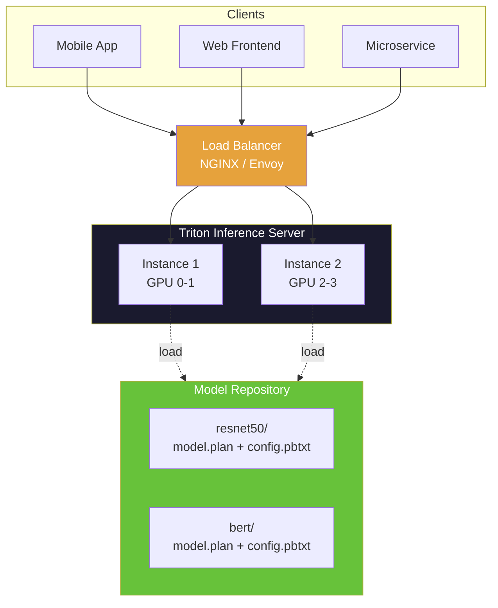

# Chapter 68: TensorRT — Production Inference Optimization

**Difficulty:** ★★★★☆ (Advanced)
**Tags:** `TensorRT` · `Inference` · `Model Optimization` · `INT8 Calibration` · `ONNX` · `Deployment` · `C++ CUDA`

---

## 1. Theory: What, Why, and How

TensorRT (TRT) is NVIDIA's high-performance deep learning inference SDK. It takes a trained model and optimizes it into a tightly packed engine that squeezes maximum throughput from NVIDIA GPUs through graph-level transformations no general-purpose runtime can match.

### Why TensorRT?

| Concern | Training Framework | TensorRT |
|---|---|---|
| **Latency** | Milliseconds–seconds | Sub-millisecond possible |
| **Throughput** | Moderate | 2–10× higher |
| **Memory** | Full FP32 weights | FP16/INT8 compressed |
| **Graph fusion** | Limited | Aggressive |

### The Four-Stage Pipeline

Every TensorRT workflow follows: **Build → Serialize → Deserialize → Execute**.


### Key Optimizations

**Layer Fusion** — Conv+BN+ReLU → single kernel, eliminating memory round-trips.
**Precision Calibration** — FP32 → FP16 → INT8 with calibration data.
**Kernel Auto-Tuning** — Benchmarks dozens of implementations per layer, picks fastest.
**Memory Reuse** — Shares GPU buffers across layers with non-overlapping lifetimes.

---

## 2. Layer Fusion Deep Dive

A ResNet bottleneck block **before** fusion has 10 separate CUDA kernels. After TRT fusion, only 3 remain:

```
Before: Conv → BN → ReLU → Conv → BN → ReLU → Conv → BN → Add → ReLU  (10 kernels)
After:  [Conv+BN+ReLU] → [Conv+BN+ReLU] → [Conv+BN+Add+ReLU]           (3 kernels)
```

| Metric | Separate Kernels | Fused Kernel |
|---|---|---|
| Conv+BN+ReLU memory ops | 6× tensor size | 2× tensor size |
| Kernel launches | 3 | 1 |
| BatchNorm | Separate pass | Folded into conv weights |

---

## 3. Complete Code: ONNX → TensorRT → C++ Inference

```cpp
#include <NvInfer.h>
#include <NvOnnxParser.h>
#include <cuda_runtime.h>
#include <fstream>
#include <iostream>
#include <memory>
#include <vector>
#include <cassert>
#include <chrono>

struct TRTDeleter {
    template <typename T>
    void operator()(T* obj) const { delete obj; }
};
template <typename T>
using TRTPtr = std::unique_ptr<T, TRTDeleter>;

class TRTLogger : public nvinfer1::ILogger {
public:
    void log(Severity severity, const char* msg) noexcept override {
        if (severity <= Severity::kWARNING)
            std::cerr << "[TRT] " << msg << "\n";
    }
};

// ── Build & Serialize ──
bool buildEngine(const std::string& onnxPath,
                 const std::string& enginePath,
                 int maxBatch, bool fp16) {
    TRTLogger logger;
    TRTPtr<nvinfer1::IBuilder> builder(
        nvinfer1::createInferBuilder(logger));
    if (!builder) return false;

    const auto flags = 1U << static_cast<uint32_t>(
        nvinfer1::NetworkDefinitionCreationFlag::kEXPLICIT_BATCH);
    TRTPtr<nvinfer1::INetworkDefinition> network(
        builder->createNetworkV2(flags));

    TRTPtr<nvonnxparser::IParser> parser(
        nvonnxparser::createParser(*network, logger));
    if (!parser->parseFromFile(onnxPath.c_str(),
            static_cast<int>(nvinfer1::ILogger::Severity::kWARNING))) {
        std::cerr << "ONNX parse failed\n";
        return false;
    }

    TRTPtr<nvinfer1::IBuilderConfig> config(
        builder->createBuilderConfig());
    config->setMemoryPoolLimit(
        nvinfer1::MemoryPoolType::kWORKSPACE, 1ULL << 30);

    if (fp16 && builder->platformHasFastFp16())
        config->setFlag(nvinfer1::BuilderFlag::kFP16);

    // Dynamic shape profile
    auto* profile = builder->createOptimizationProfile();
    auto* input = network->getInput(0);
    auto d = input->getDimensions();
    profile->setDimensions(input->getName(),
        nvinfer1::OptProfileSelector::kMIN, {4, {1, d.d[1], d.d[2], d.d[3]}});
    profile->setDimensions(input->getName(),
        nvinfer1::OptProfileSelector::kOPT, {4, {maxBatch/2, d.d[1], d.d[2], d.d[3]}});
    profile->setDimensions(input->getName(),
        nvinfer1::OptProfileSelector::kMAX, {4, {maxBatch, d.d[1], d.d[2], d.d[3]}});
    config->addOptimizationProfile(profile);

    TRTPtr<nvinfer1::IHostMemory> serialized(
        builder->buildSerializedNetwork(*network, *config));
    if (!serialized) return false;

    std::ofstream f(enginePath, std::ios::binary);
    f.write(static_cast<const char*>(serialized->data()), serialized->size());
    std::cout << "Engine saved: " << enginePath << "\n";
    return true;
}

// ── Deserialize & Execute ──
class TRTInferencer {
public:
    TRTInferencer(const std::string& enginePath) {
        std::ifstream f(enginePath, std::ios::binary | std::ios::ate);
        size_t sz = f.tellg();
        f.seekg(0);
        std::vector<char> buf(sz);
        f.read(buf.data(), sz);

        TRTPtr<nvinfer1::IRuntime> runtime(
            nvinfer1::createInferRuntime(logger_));
        engine_.reset(runtime->deserializeCudaEngine(buf.data(), buf.size()));
        ctx_.reset(engine_->createExecutionContext());
        cudaStreamCreate(&stream_);
    }
    ~TRTInferencer() { cudaStreamDestroy(stream_); }

    std::vector<float> infer(const std::vector<float>& input,
                             const nvinfer1::Dims4& dims) {
        ctx_->setInputShape(engine_->getIOTensorName(0), dims);

        auto outDims = ctx_->getTensorShape(engine_->getIOTensorName(1));
        size_t outN = 1;
        for (int i = 0; i < outDims.nbDims; ++i) outN *= outDims.d[i];

        void *gpuIn, *gpuOut;
        cudaMalloc(&gpuIn, input.size() * sizeof(float));
        cudaMalloc(&gpuOut, outN * sizeof(float));

        cudaMemcpyAsync(gpuIn, input.data(),
            input.size() * sizeof(float), cudaMemcpyHostToDevice, stream_);

        ctx_->setTensorAddress(engine_->getIOTensorName(0), gpuIn);
        ctx_->setTensorAddress(engine_->getIOTensorName(1), gpuOut);
        ctx_->enqueueV3(stream_);

        std::vector<float> output(outN);
        cudaMemcpyAsync(output.data(), gpuOut,
            outN * sizeof(float), cudaMemcpyDeviceToHost, stream_);
        cudaStreamSynchronize(stream_);
        cudaFree(gpuIn); cudaFree(gpuOut);
        return output;
    }

private:
    TRTLogger logger_;
    TRTPtr<nvinfer1::ICudaEngine> engine_;
    TRTPtr<nvinfer1::IExecutionContext> ctx_;
    cudaStream_t stream_;
};

int main() {
    buildEngine("resnet50.onnx", "resnet50.engine", 32, true);
    TRTInferencer inf("resnet50.engine");
    std::vector<float> input(1 * 3 * 224 * 224, 0.5f);
    auto out = inf.infer(input, {4, {1, 3, 224, 224}});
    std::cout << "Output size: " << out.size() << "\n";
}
```

> **Compile:** `g++ -std=c++17 -o trt_infer main.cpp -lnvinfer -lnvonnxparser -lcudart`

---

## 4. INT8 Calibration

```cpp
class Int8Calibrator : public nvinfer1::IInt8EntropyCalibrator2 {
public:
    Int8Calibrator(const std::vector<std::vector<float>>& data,
                   int batchSize, const std::string& cache)
        : data_(data), bs_(batchSize), cache_(cache), idx_(0) {
        cudaMalloc(&gpu_, data[0].size() * sizeof(float));
    }
    ~Int8Calibrator() { cudaFree(gpu_); }

    int getBatchSize() const noexcept override { return bs_; }

    bool getBatch(void* bindings[], const char*[], int) noexcept override {
        if (idx_ >= static_cast<int>(data_.size())) return false;
        cudaMemcpy(gpu_, data_[idx_].data(),
                   data_[idx_].size() * sizeof(float), cudaMemcpyHostToDevice);
        bindings[0] = gpu_;
        ++idx_;
        return true;
    }

    const void* readCalibrationCache(size_t& len) noexcept override {
        std::ifstream f(cache_, std::ios::binary | std::ios::ate);
        if (!f) return nullptr;
        len = f.tellg(); f.seekg(0);
        buf_.resize(len); f.read(buf_.data(), len);
        return buf_.data();
    }

    void writeCalibrationCache(const void* p, size_t len) noexcept override {
        std::ofstream(cache_, std::ios::binary).write((const char*)p, len);
    }

private:
    std::vector<std::vector<float>> data_;
    int bs_, idx_;
    void* gpu_;
    std::string cache_;
    std::vector<char> buf_;
};
// Usage: config->setFlag(BuilderFlag::kINT8); config->setInt8Calibrator(&cal);
```

| Strategy | Method | Best For |
|---|---|---|
| **Entropy** | Minimize KL-divergence | CNNs, general models |
| **MinMax** | Full observed range | Uniform distributions |
| **Percentile** | Clip outliers at 99.99% | Long-tail activations |

---

## 5. Custom TensorRT Plugin

```cpp
#include <NvInferPlugin.h>

__global__ void swishKernel(const float* in, float* out, int n) {
    int i = blockIdx.x * blockDim.x + threadIdx.x;
    if (i < n) {
        float x = in[i];
        out[i] = x / (1.0f + expf(-x));
    }
}

class SwishPlugin : public nvinfer1::IPluginV2DynamicExt {
public:
    const char* getPluginType() const noexcept override { return "Swish"; }
    const char* getPluginVersion() const noexcept override { return "1"; }
    int getNbOutputs() const noexcept override { return 1; }

    nvinfer1::DimsExprs getOutputDimensions(int, const nvinfer1::DimsExprs* in,
        int, nvinfer1::IExprBuilder&) noexcept override { return in[0]; }

    int enqueue(const nvinfer1::PluginTensorDesc* inDesc,
                const nvinfer1::PluginTensorDesc*, const void* const* inputs,
                void* const* outputs, void*, cudaStream_t s) noexcept override {
        int n = 1;
        for (int i = 0; i < inDesc[0].dims.nbDims; ++i) n *= inDesc[0].dims.d[i];
        swishKernel<<<(n+255)/256, 256, 0, s>>>(
            (const float*)inputs[0], (float*)outputs[0], n);
        return 0;
    }
    // ... other required interface methods omitted for brevity
};
```

---

## 6. ONNX → TensorRT Workflow

```python
# Step 1: Export from PyTorch
import torch, torchvision.models as models
model = models.resnet50(pretrained=True).eval().cuda()
torch.onnx.export(model, torch.randn(1,3,224,224).cuda(), "resnet50.onnx",
    input_names=["input"], output_names=["output"],
    dynamic_axes={"input": {0: "batch"}, "output": {0: "batch"}}, opset_version=17)
```

```bash
# Step 2: Build engine with trtexec
trtexec --onnx=resnet50.onnx --saveEngine=resnet50.engine --fp16 \
  --minShapes=input:1x3x224x224 --optShapes=input:16x3x224x224 \
  --maxShapes=input:32x3x224x224
```

Then use the `TRTInferencer` C++ class from Section 3.

| ONNX Op Status | Operators |
|---|---|
| ✅ Supported | Conv, MatMul, Relu, Softmax, BatchNorm, Add, Concat, Reshape |
| ⚠️ Partial | Resize (some modes), NonMaxSuppression |
| ❌ Plugin needed | Custom activations, dynamic control flow |

---

## 7. Deployment Architecture



| Pattern | Use Case |
|---|---|
| **Standalone C++** | Edge, robotics, latency-critical |
| **Triton Server** | Cloud, multi-model, dynamic batching |
| **TensorRT-LLM** | Large language model inference |
| **DeepStream** | Video analytics pipelines |

---

## 8. Latency Benchmarks

Measured on A100, ResNet-50, batch=1, 3×224×224:

| Runtime | Precision | Latency (ms) | Throughput (img/s) | GPU Mem |
|---|---|---|---|---|
| PyTorch (eager) | FP32 | 4.2 | 238 | 1.8 GB |
| PyTorch (compile) | FP32 | 2.8 | 357 | 1.5 GB |
| ONNX Runtime | FP16 | 1.2 | 833 | 0.5 GB |
| **TensorRT** | **FP16** | **0.5** | **2000** | **0.4 GB** |
| **TensorRT** | **INT8** | **0.3** | **3333** | **0.3 GB** |

> TensorRT INT8 achieves **14×** the throughput of PyTorch eager mode.

---

## 9. Exercises

### 🟢 Exercise 1: Basic Engine Building
Use `trtexec` to convert a two-layer MLP from ONNX to a TensorRT FP16 engine. Report conversion time and file size.

### 🟡 Exercise 2: Dynamic Batch Benchmark
Extend `TRTInferencer` to benchmark latency at batch sizes 1, 4, 8, 16, 32. Print a throughput table.

### 🟡 Exercise 3: INT8 Calibration
Implement INT8 calibration for ResNet-18 with 500 images. Compare Top-1 accuracy across FP32, FP16, INT8.

### 🔴 Exercise 4: Custom Plugin
Write a TRT plugin for Mish activation (`x * tanh(softplus(x))`). Register it and verify in an ONNX model.

### 🔴 Exercise 5: Multi-Model Triton
Deploy ResNet-50 + YOLOv8 on Triton with ensemble scheduling. Write a gRPC client for combined inference.

---

## 10. Solutions

### Solution 1
```bash
python -c "
import torch, torch.nn as nn
m = nn.Sequential(nn.Linear(784,256), nn.ReLU(), nn.Linear(256,10)).eval()
torch.onnx.export(m, torch.randn(1,784), 'mlp.onnx',
                  input_names=['input'], output_names=['output'],
                  dynamic_axes={'input':{0:'batch'}})
"
time trtexec --onnx=mlp.onnx --saveEngine=mlp.engine --fp16
ls -lh mlp.engine
```

### Solution 2
```cpp
void benchmarkBatches(TRTInferencer& inf) {
    for (int bs : {1, 4, 8, 16, 32}) {
        std::vector<float> in(bs * 3 * 224 * 224, 0.5f);
        nvinfer1::Dims4 d{4, {bs, 3, 224, 224}};
        for (int i = 0; i < 10; ++i) inf.infer(in, d);  // warmup
        auto t0 = std::chrono::high_resolution_clock::now();
        for (int i = 0; i < 100; ++i) inf.infer(in, d);
        double ms = std::chrono::duration<double, std::milli>(
            std::chrono::high_resolution_clock::now() - t0).count() / 100;
        std::cout << "Batch " << bs << ": " << ms << " ms, "
                  << bs * 1000.0 / ms << " img/s\n";
    }
}
```

### Solution 3
```cpp
void buildINT8(const std::string& onnxPath) {
    auto calibData = loadImages("imagenet_val/", 500);  // user-implemented
    Int8Calibrator cal(calibData, 1, "cache.bin");
    // ... standard builder setup ...
    config->setFlag(nvinfer1::BuilderFlag::kINT8);
    config->setInt8Calibrator(&cal);
    // ... build and serialize ...
}
```

---

## 11. Quiz

**Q1.** What is the primary benefit of TensorRT's layer fusion?
A) Reduces model accuracy  B) Eliminates intermediate memory traffic
C) Converts layers to INT8  D) Replaces GPU with CPU ops
**Answer:** B

**Q2.** What does INT8 calibration require?
A) Full training dataset  B) 500–1000 representative samples
C) Only model weights  D) A pre-quantized model
**Answer:** B

**Q3.** What does an optimization profile specify?
A) Target GPU  B) Min/opt/max tensor dimensions for dynamic shapes
C) Learning rate  D) Training memory budget
**Answer:** B

**Q4.** Why aren't TRT engines portable across GPUs?
A) GPU-specific kernel selections and timing  B) Licensing restrictions
C) Per-device encryption  D) Different file systems
**Answer:** A

**Q5.** When do you write a TensorRT plugin?
A) Model too large for GPU  B) TRT doesn't support a required operation
C) Want to train with TRT  D) Need multi-GPU inference
**Answer:** B

**Q6.** What format does TRT use for serialized engines?
A) `.onnx`  B) `.pt`  C) `.engine` / `.plan`  D) `.tflite`
**Answer:** C

**Q7.** What does Triton Inference Server provide?
A) Model training  B) HTTP/gRPC serving, dynamic batching, multi-model management
C) ONNX conversion  D) INT8 calibration
**Answer:** B

---

## 12. Key Takeaways

- **Build → Serialize → Deserialize → Execute** is the universal TRT pipeline
- **Layer fusion** merges Conv+BN+ReLU into single kernels, cutting memory traffic by 3×
- **INT8 calibration** gives ~2–4× speedup over FP16 with <1% accuracy loss for CNNs
- **Engines are GPU-specific** — always rebuild for each target architecture
- **Dynamic shapes** need optimization profiles with min/opt/max dimensions
- **ONNX is the bridge** from any training framework to TensorRT
- **Triton Server** adds batching, versioning, and monitoring for production serving
- **Custom plugins** extend TRT when built-in ops are insufficient

---

## 13. Chapter Summary

TensorRT transforms trained models into optimized inference engines via graph-level fusion, precision reduction, and kernel auto-tuning. The C++ API (`IBuilder`, `IBuilderConfig`, `INetworkDefinition`, `ICudaEngine`, `IExecutionContext`) provides full control over the optimization and execution pipeline. INT8 calibration with entropy minimization enables maximum throughput with minimal accuracy loss. For production, Triton Inference Server adds dynamic batching and multi-model management, while custom plugins extend TRT for unsupported operations.

---

## 14. Real-World Insight

> At scale, **engine cache management** becomes the real challenge. Teams maintain caches keyed by `(model_version, gpu_arch, precision, max_batch)`. A single model may have 6+ engine variants. CI/CD pipelines automatically rebuild engines when models retrain or new GPU SKUs join the fleet. Never rebuild at startup — always pre-build and cache.

---

## 15. Common Mistakes

### ❌ Rebuilding engines on every start
```cpp
// WRONG — expensive rebuild each launch
auto engine = buildEngine("model.onnx");
// RIGHT — serialize once, load fast
if (!exists("model.engine")) buildAndSave("model.onnx", "model.engine");
auto engine = deserialize("model.engine");
```

### ❌ Using engine from a different GPU
Engines contain GPU-specific kernel choices. Always rebuild for the target arch.

### ❌ Insufficient workspace
```cpp
// WRONG: 1 MB — too small for complex optimization
config->setMemoryPoolLimit(MemoryPoolType::kWORKSPACE, 1ULL << 20);
// RIGHT: 1 GB
config->setMemoryPoolLimit(MemoryPoolType::kWORKSPACE, 1ULL << 30);
```

### ❌ Skipping warmup before benchmarking
First runs include CUDA context init overhead. Always run 10+ warmup iterations.

### ❌ Forgetting setInputShape for dynamic batches
```cpp
// WRONG — undefined behavior
ctx->enqueueV3(stream);
// RIGHT
ctx->setInputShape("input", nvinfer1::Dims4{bs, 3, 224, 224});
ctx->enqueueV3(stream);
```

---

## 16. Interview Questions

### Q1: Describe the TensorRT optimization pipeline.

**Answer:** Four stages: (1) **Build** — parse ONNX, fuse layers, select precision, auto-tune kernels for target GPU. (2) **Serialize** — write engine to `.plan` file. (3) **Deserialize** — load plan (seconds vs. minutes for build). (4) **Execute** — `enqueueV3()` on a CUDA stream. Build is expensive and done offline; deserialization is fast for production startup.

### Q2: How does INT8 calibration work?

**Answer:** Run 500–1000 representative samples through the network in FP32 to collect per-tensor activation histograms. The calibrator (e.g., `IInt8EntropyCalibrator2`) computes optimal clipping thresholds via KL-divergence minimization, mapping FP32 ranges to 8-bit integers with minimal information loss. Scale factors are baked into the engine. Typical accuracy loss is <1% for CNNs.

### Q3: Why aren't TRT engines portable across GPUs?

**Answer:** During build, TRT benchmarks dozens of kernel implementations per layer — different tiling, shared memory configs, instruction mixes — and picks the fastest for the specific GPU's SM count, memory bandwidth, cache sizes, and Tensor Core generation. An A100-optimized engine uses kernels suboptimal for T4 or H100.

### Q4: Standalone TRT vs. Triton — when to use which?

**Answer:** **Standalone** for edge/robotics where the app owns the GPU and needs minimal latency (no RPC overhead). **Triton** for cloud deployments serving multiple models to many clients — it provides dynamic batching, model versioning, gRPC/HTTP endpoints, Prometheus metrics, and horizontal scaling.

---

*Next Chapter: [Chapter 69 — cuDNN: Deep Neural Network Primitives →](69_cuDNN.md)*
