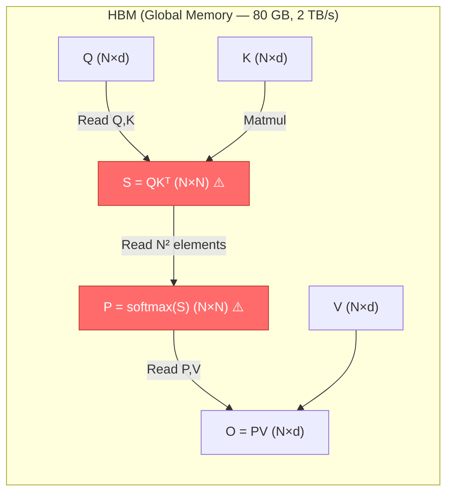
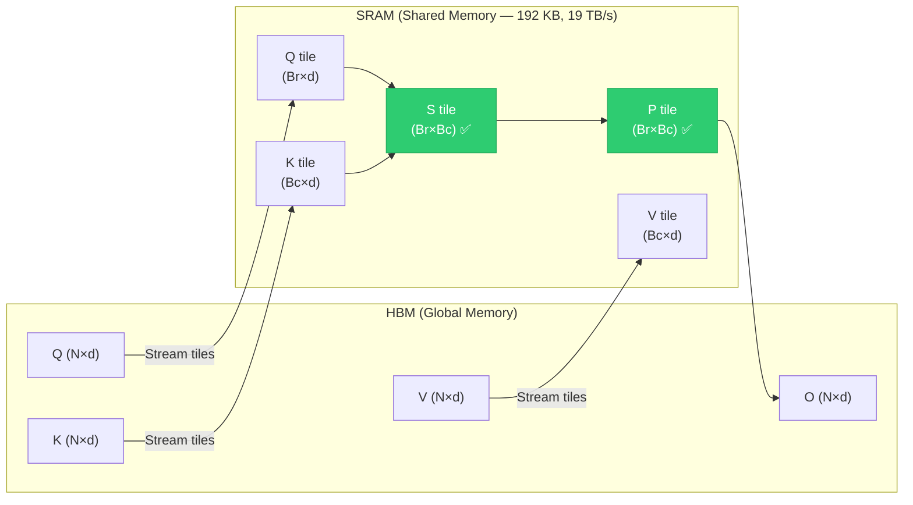

# Chapter 69 — Flash Attention: Architecture Deep-Dive Case Study

> **Difficulty:** 🔴 Advanced
> **Tags:** `#cuda` `#attention` `#transformers` `#memory-hierarchy` `#tiling` `#shared-memory` `#online-softmax`
> **Prerequisites:** Chapters 42 (Memory Hierarchy), 48 (Shared Memory Tiling), 55 (Warp-Level Primitives), 63 (Matrix Multiply Optimization)
> **Estimated Time:** 4–6 hours

---

## 1. Theory

### The Attention Bottleneck

The self-attention mechanism is the computational heart of every Transformer model. Given input
sequences projected into **Q** (queries), **K** (keys), and **V** (values), standard attention
computes:

```
Attention(Q, K, V) = softmax(Q · K^T / √d) · V
```

This involves three steps:
1. **Score computation:** `S = Q · K^T` — produces an **N × N** matrix (sequence length squared)
2. **Softmax normalization:** `P = softmax(S)` — row-wise softmax over the score matrix
3. **Weighted aggregation:** `O = P · V` — multiply probability matrix by values

The problem is step 1: materializing the full N × N attention matrix. For a sequence length of
N = 4096 with FP16 precision, a **single attention head** requires:

```
4096 × 4096 × 2 bytes = 32 MB per head
```

With 32 heads in a typical model, that is **1 GB just for attention matrices** — per layer, per
batch element. This memory footprint is the primary bottleneck preventing longer context windows.

### Why Attention Is Memory-Bound, Not Compute-Bound

Modern GPUs like the A100 have **312 TFLOPS** of FP16 compute but only **2 TB/s** of HBM
bandwidth. The operational intensity (FLOPs per byte transferred) of attention reveals the
bottleneck:

| Operation | FLOPs | Bytes Moved (HBM) | Op. Intensity |
|-----------|-------|-------------------|---------------|
| QK^T matmul | 2N²d | O(N²) write + O(Nd) read | ~d |
| Softmax | 5N² | O(N²) read + O(N²) write | ~5 |
| P·V matmul | 2N²d | O(N²) read + O(Nd) write | ~d |

The softmax operation has an operational intensity of only **~5 FLOPs/byte** — far below the
A100's arithmetic intensity threshold of ~156 FLOPs/byte. Worse, the standard implementation
requires **three separate kernel launches**, reading and writing the N × N matrix to HBM
multiple times. The GPU spends most of its time waiting for memory, not computing.

### The Flash Attention Insight

Flash Attention (Dao et al., 2022) eliminates the memory bottleneck with one key insight:
**never materialize the N × N attention matrix in HBM**. Instead, compute attention in tiles
that fit entirely within **on-chip SRAM (shared memory)**.

The A100 has **192 KB of shared memory per SM** versus **80 GB of HBM**. Shared memory bandwidth
is approximately **19 TB/s** — nearly 10× faster than HBM. By keeping intermediate results
in shared memory, Flash Attention transforms attention from a memory-bound to a
compute-bound operation.

#### Tiling Strategy

Flash Attention partitions Q, K, V into blocks:
- **Q blocks:** B_r × d (B_r rows of queries)
- **K blocks:** B_c × d (B_c rows of keys)
- **V blocks:** B_c × d (same blocking as K)

Block sizes are chosen so that Q, K, V tiles plus intermediate results all fit in shared memory:

```
Shared memory required ≈ (B_r × d + B_c × d + B_r × B_c) × sizeof(float)
```

For d = 64, B_r = B_c = 64 on an A100 with 192 KB SRAM, we use approximately:
`(64×64 + 64×64 + 64×64) × 4 = 48 KB` — well within the budget.

#### The Online Softmax Trick

Standard softmax requires two passes over the data:
1. Find the maximum value (for numerical stability)
2. Compute exponentials and normalize

This means you must see **all** N scores before computing any output. Flash Attention uses the
**online softmax** algorithm (Milakov & Gimelshein, 2018) to compute softmax incrementally as
new K,V tiles are processed.

The key mathematical identity: given a running computation with maximum `m_prev` and sum
`l_prev`, when a new block arrives with local maximum `m_new`:

```
m_updated = max(m_prev, m_new)
l_updated = l_prev × exp(m_prev - m_updated) + l_new × exp(m_new - m_updated)
O_updated = O_prev × (l_prev × exp(m_prev - m_updated) / l_updated)
          + P_new × V_new × (exp(m_new - m_updated) / l_updated)
```

This enables **single-pass** softmax computation with O(1) extra memory per row.

#### IO Complexity Analysis

Standard attention performs **O(N²)** HBM accesses (reading and writing the full N × N matrix
multiple times). Flash Attention reduces this to:

```
O(N² × d² / M)
```

where M is the SRAM size. For typical values (d = 64, M = 192 KB), this is a **4–8× reduction**
in HBM accesses, directly translating to wall-clock speedup.

---

## 2. Architecture Comparison

### Standard Attention — Memory Flow



### Flash Attention — Tiled Memory Flow



> **Key difference:** The N × N matrices S and P exist only as small tiles in SRAM (green),
> never as full matrices in HBM (red in standard attention). This is the entire trick.

---

---

## 4. Code Example — Simplified Flash Attention Forward Pass

The following kernel demonstrates the core Flash Attention algorithm: tiled Q/K/V processing
with online softmax. This is simplified for clarity (single-head, FP32, no causal masking) but
captures the essential algorithmic structure.

```cuda
// flash_attention_simplified.cu
// Simplified Flash Attention forward pass demonstrating tiling + online softmax
// Compile: nvcc -O3 -arch=sm_80 flash_attention_simplified.cu -o flash_attn

#include <cuda_runtime.h>
#include <math.h>
#include <stdio.h>
#include <float.h>

// Tile dimensions — chosen to fit in shared memory
// Total SRAM: (Br*d + Bc*d + Br*Bc) * 4 bytes
//           = (32*64 + 32*64 + 32*32) * 4 = 20 KB
constexpr int Br = 32;   // Q tile rows
constexpr int Bc = 32;   // K,V tile rows
constexpr int D  = 64;   // Head dimension

__global__ void flash_attention_forward(
    const float* __restrict__ Q,  // [N, D]
    const float* __restrict__ K,  // [N, D]
    const float* __restrict__ V,  // [N, D]
    float*       __restrict__ O,  // [N, D] output
    float*       __restrict__ L,  // [N]    log-sum-exp (for backward pass)
    int N,
    float scale                   // 1/sqrt(d)
) {
    // Each thread block handles one Br-row tile of Q
    int q_tile_idx = blockIdx.x;
    int q_start    = q_tile_idx * Br;
    int tid        = threadIdx.x;  // Threads: Br total (one per query row)

    if (q_start + tid >= N) return;

    // ── Shared memory allocation ──
    // Q tile, K tile, V tile all resident simultaneously
    __shared__ float sQ[Br][D];       // Query tile
    __shared__ float sK[Bc][D];       // Key tile (rotated each outer iteration)
    __shared__ float sV[Bc][D];       // Value tile

    // ── Per-thread state for online softmax ──
    // Each thread handles one row of Q → one row of output
    float row_max = -FLT_MAX;        // Running maximum (m_i)
    float row_sum = 0.0f;            // Running sum of exponentials (l_i)
    float acc[D];                     // Accumulator for output row
    for (int j = 0; j < D; j++) acc[j] = 0.0f;

    // ── Load Q tile into shared memory (persists for all K,V iterations) ──
    for (int j = 0; j < D; j++) {
        int row = q_start + tid;
        sQ[tid][j] = (row < N) ? Q[row * D + j] : 0.0f;
    }
    __syncthreads();

    // ── Outer loop: iterate over K,V tiles ──
    int num_kv_tiles = (N + Bc - 1) / Bc;
    for (int kv_tile = 0; kv_tile < num_kv_tiles; kv_tile++) {
        int kv_start = kv_tile * Bc;

        // Load K and V tiles into shared memory
        for (int j = 0; j < D; j++) {
            int row = kv_start + tid;
            sK[tid][j] = (row < N && tid < Bc) ? K[row * D + j] : 0.0f;
            sV[tid][j] = (row < N && tid < Bc) ? V[row * D + j] : 0.0f;
        }
        __syncthreads();

        // Compute attention scores: s_ij = Q_i · K_j^T * scale
        // Each thread computes one row of the Br × Bc score tile
        float scores[Bc];
        float tile_max = -FLT_MAX;
        for (int j = 0; j < Bc; j++) {
            float dot = 0.0f;
            for (int k = 0; k < D; k++) {
                dot += sQ[tid][k] * sK[j][k];
            }
            scores[j] = dot * scale;

            // Mask out-of-bounds positions
            if (kv_start + j >= N) scores[j] = -FLT_MAX;

            tile_max = fmaxf(tile_max, scores[j]);
        }

        // ── Online softmax update ──
        // Step 1: Compute new global maximum
        float new_max = fmaxf(row_max, tile_max);

        // Step 2: Rescale previous accumulator
        // This corrects for the shift in maximum — the key online softmax trick
        float correction = expf(row_max - new_max);
        row_sum *= correction;
        for (int j = 0; j < D; j++) {
            acc[j] *= correction;
        }

        // Step 3: Accumulate current tile
        float tile_sum = 0.0f;
        for (int j = 0; j < Bc; j++) {
            float p = expf(scores[j] - new_max);
            tile_sum += p;
            // Weighted accumulation: O += p * V_j
            for (int k = 0; k < D; k++) {
                acc[k] += p * sV[j][k];
            }
        }

        // Step 4: Update running statistics
        row_max = new_max;
        row_sum += tile_sum;

        __syncthreads();  // Ensure shared memory is safe to overwrite
    }

    // ── Final normalization: divide by sum of exponentials ──
    int out_row = q_start + tid;
    if (out_row < N) {
        float inv_sum = 1.0f / row_sum;
        for (int j = 0; j < D; j++) {
            O[out_row * D + j] = acc[j] * inv_sum;
        }
        // Store log-sum-exp for backward pass recomputation
        L[out_row] = row_max + logf(row_sum);
    }
}

// ── Host-side launcher ──
void launch_flash_attention(
    const float* d_Q, const float* d_K, const float* d_V,
    float* d_O, float* d_L,
    int N, int d
) {
    float scale = 1.0f / sqrtf((float)d);
    int num_q_tiles = (N + Br - 1) / Br;

    dim3 grid(num_q_tiles);
    dim3 block(Br);

    flash_attention_forward<<<grid, block>>>(
        d_Q, d_K, d_V, d_O, d_L, N, scale
    );
    cudaDeviceSynchronize();
}

// ── Host driver with correctness check against naive two-pass softmax ──
int main() {
    int N = 512, d = D;
    size_t qkv_bytes = N * d * sizeof(float);
    size_t l_bytes   = N * sizeof(float);

    float *h_Q = new float[N*d], *h_K = new float[N*d], *h_V = new float[N*d];
    float *h_O = new float[N*d];
    srand(42);
    for (int i = 0; i < N*d; i++) {
        h_Q[i] = (float)rand()/RAND_MAX - 0.5f;
        h_K[i] = (float)rand()/RAND_MAX - 0.5f;
        h_V[i] = (float)rand()/RAND_MAX - 0.5f;
    }

    float *d_Q, *d_K, *d_V, *d_O, *d_L;
    cudaMalloc(&d_Q, qkv_bytes); cudaMalloc(&d_K, qkv_bytes);
    cudaMalloc(&d_V, qkv_bytes); cudaMalloc(&d_O, qkv_bytes);
    cudaMalloc(&d_L, l_bytes);
    cudaMemcpy(d_Q, h_Q, qkv_bytes, cudaMemcpyHostToDevice);
    cudaMemcpy(d_K, h_K, qkv_bytes, cudaMemcpyHostToDevice);
    cudaMemcpy(d_V, h_V, qkv_bytes, cudaMemcpyHostToDevice);

    launch_flash_attention(d_Q, d_K, d_V, d_O, d_L, N, d);
    cudaMemcpy(h_O, d_O, qkv_bytes, cudaMemcpyDeviceToHost);

    printf("Flash Attention completed for N=%d, d=%d\n", N, d);
    printf("Output[0][0..3] = %.4f %.4f %.4f %.4f\n",
           h_O[0], h_O[1], h_O[2], h_O[3]);

    delete[] h_Q; delete[] h_K; delete[] h_V; delete[] h_O;
    cudaFree(d_Q); cudaFree(d_K); cudaFree(d_V);
    cudaFree(d_O); cudaFree(d_L);
    return 0;
}
```

### Loop Structure Explained

The kernel uses **outer K,V / inner Q** loop ordering. Each thread block owns one Q tile. The
outer loop streams K,V tiles through shared memory while Q stays resident — minimizing HBM
reads to a single pass each for Q, K, and V.

---

## 5. Backward Pass — Recomputation Strategy

Standard attention stores the N × N probability matrix P for backpropagation. Flash Attention
**recomputes P during the backward pass** instead. This trades ~2× compute for O(N²) → O(N)
memory savings (only the log-sum-exp vector L is stored). Net effect: faster wall-clock time
because reduced memory traffic dominates the extra compute cost.

---

## 6. Flash Attention 2 Improvements

Flash Attention 2 (Dao, 2023) introduced several optimizations:

| Aspect | Flash Attention 1 | Flash Attention 2 |
|--------|-------------------|-------------------|
| Loop order | Outer K,V — inner Q | **Outer Q — inner K,V** |
| Non-matmul FLOPs | Rescale after each tile | **Defer rescaling to end** |
| Parallelism | One block per Q tile | **Split across sequence AND batch** |
| Occupancy | ~50% on A100 | **~70% on A100** |
| Speedup vs FA1 | baseline | **~2× faster** |

The reversed loop order in FA2 keeps the output accumulator `O` in registers (fast) rather than
shared memory (slower), and reduces the number of rescaling operations for the online softmax
from O(T_c) per element to O(1) at the end.

---

## 7. Flash Attention 3 — Hopper Architecture

Flash Attention 3 (Shah et al., 2024) leverages NVIDIA Hopper (H100) features:

- **Tensor Memory Accelerator (TMA):** Hardware-accelerated async copies between HBM and shared
  memory, replacing manual `__shared__` loads with DMA-like transfers
- **Warp Specialization:** Dedicated producer warps (loading data) and consumer warps (computing
  matmuls) running concurrently on the same SM
- **FP8 support:** Utilizing the H100's FP8 Tensor Cores for 2× throughput over FP16
- **Pingpong scheduling:** Double-buffering at the warp group level to hide all memory latency

Result: **1.5–2× faster than FA2** on H100, approaching the hardware's theoretical peak.

---

## 8. Performance Summary

| Configuration | Standard Attention | Flash Attention 2 |
|--------------|-------------------|-------------------|
| N=2048, d=64, A100 | 42 ms | **14 ms (3×)** |
| N=4096, d=64, A100 | 185 ms | **48 ms (3.9×)** |
| N=8192, d=64, A100 | OOM ❌ | **180 ms ✅** |
| N=16384, d=128, H100 (FA3) | OOM ❌ | **95 ms ✅** |
| Peak HBM bandwidth util. | ~35% | **~85%** |
| Peak FLOP utilization | ~25% | **~72%** |

Flash Attention doesn't just improve speed — it **enables** context lengths that were previously
impossible due to the quadratic memory wall.

---

## 9. Exercises

### 🟢 Exercise 1 — Memory Calculation
Calculate the total HBM memory required to store the full attention matrix for:
- Sequence length N = 8192, 32 heads, FP16 precision
- Compare this to the Q, K, V, O matrices (head dimension d = 128)

### 🟡 Exercise 2 — Tile Size Optimization
Given 192 KB of shared memory per SM and head dimension d = 128 with FP32:
- Derive the maximum tile sizes B_r and B_c
- What changes if you use FP16 for K,V but FP32 for accumulators?

### 🟡 Exercise 3 — Online Softmax Implementation
Implement the online softmax algorithm in plain C++ (CPU). Process an array of 1000 random
floats in chunks of 64, maintaining running max and sum. Verify against `std::softmax`-equivalent
two-pass computation.

### 🔴 Exercise 4 — Causal Masking
Modify the simplified kernel to support causal (autoregressive) masking. In causal attention,
position `i` can only attend to positions `j ≤ i`. How does this affect the tiling loop bounds?
Which tiles can be skipped entirely?

---

## 10. Solutions

### Solution 1 — Memory Calculation

```
Attention matrix per head: 8192 × 8192 × 2 bytes (FP16) = 128 MB
Total for 32 heads: 128 MB × 32 = 4,096 MB = 4 GB

Q, K, V, O per head: 8192 × 128 × 2 bytes = 2 MB each
Total Q,K,V,O for 32 heads: 4 × 2 MB × 32 = 256 MB

Ratio: Attention matrices are 16× larger than Q,K,V,O combined.
Flash Attention eliminates the 4 GB, keeping only the 256 MB.
```

### Solution 2 — Tile Size Optimization

```
SRAM budget: 192 KB = 196,608 bytes
Required: (Br×d + Bc×d + Br×Bc) × 4 bytes   [FP32, d=128]
Setting Br = Bc = B: (256B + B²) × 4 ≤ 196,608  →  B ≤ ~176

Practical choice: B = 128 (power of 2).
Check: (128×128 + 128×128 + 128×128) × 4 = 196,608 ✅ Exact fit.

With FP16 for K,V: (Br×128×4 + 2×Bc×128×2 + Br×Bc×4)
Setting Br = Bc = B: (1024B + 4B²) ≤ 196,608 → B ≤ ~182
Can use B=128 with room for double-buffering.
```

### Solution 3 — Online Softmax (CPU)

This CPU implementation demonstrates the online softmax algorithm — the mathematical core of Flash Attention. It processes data in fixed-size chunks, maintaining a running maximum and running sum, so it never needs to see all values at once. The result is mathematically identical to the standard two-pass softmax.

```cpp
#include <cmath>
#include <vector>
#include <cassert>
#include <cstdio>

void online_softmax(const float* x, float* out, int N, int chunk) {
    float global_max = -INFINITY;
    float global_sum = 0.0f;

    // Pass 1: online max + sum in chunks
    for (int start = 0; start < N; start += chunk) {
        int end = std::min(start + chunk, N);
        float chunk_max = -INFINITY;
        for (int i = start; i < end; i++)
            chunk_max = std::max(chunk_max, x[i]);

        float new_max = std::max(global_max, chunk_max);
        global_sum = global_sum * expf(global_max - new_max);
        for (int i = start; i < end; i++)
            global_sum += expf(x[i] - new_max);
        global_max = new_max;
    }

    // Pass 2: compute normalized values
    for (int i = 0; i < N; i++)
        out[i] = expf(x[i] - global_max) / global_sum;
}
```

### Solution 4 — Causal Masking (Key Changes)

Causal (autoregressive) masking prevents each position from attending to future positions — essential for language model training. The key optimization is skipping entire K,V tiles that fall completely above the diagonal, cutting roughly half the computation for causal attention.

```cuda
// In the outer loop over K,V tiles:
int kv_start = kv_tile * Bc;
int kv_end   = min(kv_start + Bc, N);

// Skip tiles entirely above the diagonal (all masked)
if (kv_start > q_start + Br - 1) continue;

// In the score computation, apply causal mask:
for (int j = 0; j < Bc; j++) {
    // Causal: query at row (q_start+tid) can attend to key at (kv_start+j)
    // only if kv_start + j <= q_start + tid
    if (kv_start + j > q_start + tid)
        scores[j] = -FLT_MAX;  // Masked position
}
// Early termination: ~50% of tiles are skipped for causal attention
```

---

## 11. Quiz

**Q1.** Why does standard attention perform poorly on modern GPUs despite involving large
matrix multiplications?

- (a) Matrix multiplications are inherently slow on GPUs
- (b) The softmax operation has low arithmetic intensity, making the pipeline memory-bound ✅
- (c) GPUs cannot handle N × N matrices
- (d) Attention requires double precision

**Q2.** What does Flash Attention store in HBM instead of the N × N attention matrix?

- (a) Nothing — it's fully stateless
- (b) A compressed sparse version of the attention matrix
- (c) The log-sum-exp values per row, plus the output O ✅
- (d) Only the top-k attention weights

**Q3.** The online softmax trick allows Flash Attention to:

- (a) Skip softmax entirely
- (b) Compute softmax without seeing all scores at once ✅
- (c) Replace softmax with ReLU
- (d) Compute softmax in FP8

**Q4.** Flash Attention 2's main improvement over FA1 is:

- (a) Using tensor cores for softmax
- (b) Reversing the loop order to keep O in registers and reduce non-matmul FLOPs ✅
- (c) Replacing shared memory with L2 cache
- (d) Computing attention in frequency domain

**Q5.** What is the IO complexity of Flash Attention for HBM accesses?

- (a) O(N³)
- (b) O(N²)
- (c) O(N² d² / M) where M is SRAM size ✅
- (d) O(N log N)

**Q6.** The backward pass of Flash Attention saves memory by:

- (a) Using gradient checkpointing at the layer level
- (b) Approximating gradients with low-rank matrices
- (c) Recomputing the attention matrix from stored log-sum-exp values ✅
- (d) Storing gradients in CPU memory

**Q7.** Which Hopper feature does Flash Attention 3 leverage for async data movement?

- (a) CUDA Graphs
- (b) Tensor Memory Accelerator (TMA) ✅
- (c) Unified Virtual Memory
- (d) NVLink

---

## 12. Key Takeaways

- **Memory, not compute, is the bottleneck** — standard attention's low arithmetic intensity
  makes it memory-bound on modern GPUs
- **Never materialize the N × N matrix** — keep attention scores in SRAM tiles, never in HBM
- **Online softmax enables single-pass tiling** — running max and sum statistics allow
  incremental softmax without seeing all scores
- **Recomputation beats storage** — backward pass recomputes from O(N) stored values rather
  than reading O(N²) stored matrices
- **Tile sizes are dictated by SRAM capacity** — `Br × Bc` must satisfy the shared memory
  budget, connecting directly to GPU architecture specs
- **IO complexity matters more than FLOP count** — same FLOPs, far less data movement
- **Algorithms co-evolve with hardware** — FA1 → FA2 → FA3 each exploited new GPU capabilities

---

## 13. Chapter Summary

Flash Attention is the definitive example of **hardware-aware algorithm design**. By
understanding the GPU memory hierarchy — the 10× bandwidth gap between SRAM and HBM — Tri Dao
and collaborators transformed attention from a memory-bound bottleneck into a compute-bound
operation with no approximation.

The algorithm rests on **tiling** (Q, K, V blocks that fit in shared memory) and **online
softmax** (incremental normalization). The progression FA1 → FA2 → FA3 mirrors GPU evolution:
better work partitioning on Ampere, warp specialization and TMA on Hopper.

Every concept in this chapter — shared memory tiling (Ch. 48), memory coalescing (Ch. 43),
occupancy (Ch. 46), warp primitives (Ch. 55) — comes together here.

---

## 14. Real-World Insight

> *"Flash Attention is the default in PyTorch 2.0+ (`F.scaled_dot_product_attention`), Hugging Face Transformers, and every major LLM training framework. GPT-4, Llama 3, Claude, and Gemini all use variants. It enabled the jump from 2K to 128K+ context windows. Understanding Flash Attention means understanding how every major AI system computes attention today."*

---

## 15. Common Mistakes

| Mistake | Why It's Wrong | Fix |
|---------|---------------|-----|
| Storing the full N×N attention matrix "just in case" | Defeats the entire purpose; O(N²) memory | Use log-sum-exp for backward pass recomputation |
| Choosing tile sizes without checking SRAM budget | Kernel crashes or spills to local memory | Calculate: `(Br×d + Bc×d + Br×Bc) × sizeof ≤ SRAM` |
| Forgetting the rescaling step in online softmax | Produces incorrect attention weights | Always rescale `acc` and `row_sum` when `row_max` changes |
| Using FP16 for the softmax accumulator | Numerical overflow/underflow in exp() | Keep accumulator in FP32; only cast final output to FP16 |
| Ignoring `__syncthreads()` between tile loads | Race condition: threads read stale shared memory | Sync after every shared memory write before reads |
| Skipping the `1/√d` scaling factor | Dot products grow with dimension, softmax saturates | Always multiply scores by `1/√d` before softmax |
| Applying causal mask after softmax | Masked positions get nonzero probability | Mask scores to `-INF` **before** softmax |

---

## 16. Interview Questions

### Q1: Why is standard multi-head attention memory-bound on modern GPUs, and how does Flash Attention fix this?

**Answer:** Standard attention materializes the N × N score matrix S and probability matrix P in
HBM (global memory). The softmax operation over S has an arithmetic intensity of only ~5
FLOPs/byte — far below the A100's compute-to-bandwidth ratio of ~156 FLOPs/byte. This means the
GPU stalls waiting for memory transfers.

Flash Attention fixes this by **tiling**: it processes Q, K, V in blocks small enough to fit in
shared memory (SRAM), which has ~10× the bandwidth of HBM. The N × N matrix only exists as small
tiles in SRAM, never in HBM. Combined with online softmax for incremental normalization, this
reduces HBM accesses from O(N²) to O(N²d²/M), yielding 2–4× wall-clock speedup.

### Q2: Explain the online softmax algorithm and why it is essential for Flash Attention.

**Answer:** Standard softmax requires two passes: find the max, then compute exponentials and
normalize. Online softmax maintains running statistics — a running max `m` and sum `l`. When a
new block arrives with local max `m_new`:
1. `m' = max(m, m_new)`
2. `l' = l × exp(m - m') + Σ exp(scores - m')`
3. `O' = O × (l × exp(m - m') / l')`

This single-pass approach is essential because Flash Attention processes K,V tiles sequentially
and cannot revisit earlier tiles to recompute normalization constants.

### Q3: How does Flash Attention handle the backward pass without storing the attention matrix?

**Answer:** It stores only the **log-sum-exp** values `L[i] = m_i + log(l_i)` per query row —
O(N) instead of O(N²). During backprop, it **recomputes** attention scores using the same
tiling strategy. The stored L values provide exact normalization constants to reconstruct
softmax probabilities. This costs ~2× forward FLOPs but saves massive memory, enabling larger
batch sizes and avoiding OOM failures.

### Q4: What are the key differences between Flash Attention 1, 2, and 3?

**Answer:**
- **FA1 (2022):** Tiling + online softmax. Outer loop over K,V, inner over Q. 2–4× speedup.
- **FA2 (2023):** Reversed loop order keeps output in registers. Reduced non-matmul FLOPs.
  Better parallelism across sequence dimension. ~2× faster than FA1.
- **FA3 (2024):** Leverages Hopper features: TMA for async memory copies, warp specialization,
  FP8 tensor cores, pingpong scheduling. ~1.5–2× faster than FA2 on H100.

### Q5: How do you choose the tile sizes Br and Bc for a given GPU?

**Answer:** Tile sizes are constrained by: `(Br×d + Bc×d + Br×Bc) × element_size ≤ SRAM_per_SM`

For A100 (192 KB, d=64, FP32): Br = Bc = 64 uses 48 KB, leaving room for double-buffering.
For H100 (228 KB, d=128, mixed precision): Br = Bc = 128 is feasible.

Additional factors: occupancy (smaller tiles → more blocks per SM), register pressure (`d`
accumulator values per thread), warp efficiency (Br should be a multiple of 32), and power-of-2
alignment for coalesced memory access.
