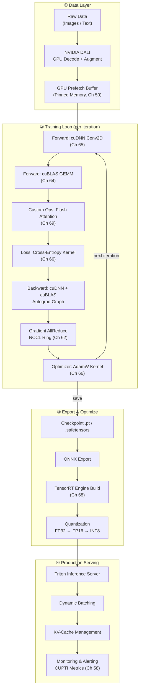
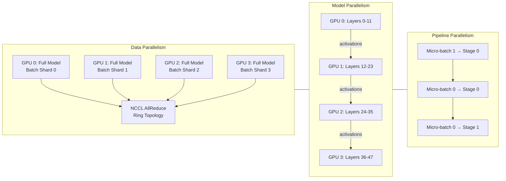

# Chapter 70 — The Full GPU Pipeline: Training to Deployment

> **Difficulty:** 🔴 Advanced | **Capstone Chapter**
> **Tags:** `#cuda` `#pipeline` `#training` `#inference` `#tensorrt` `#nccl` `#cudnn` `#cublas` `#triton` `#deployment`
> **Prerequisites:** All previous chapters; especially Ch 64 (cuBLAS), Ch 65 (cuDNN), Ch 66 (Custom Kernels), Ch 67 (PyTorch Extensions), Ch 68 (TensorRT), Ch 69 (Flash Attention)
> **Estimated Time:** 6–8 hours

---

## 1. Theory

This capstone chapter unifies every concept from the book into a single, production-grade
GPU pipeline: raw data in, trained and deployed model out.

### What

A full GPU pipeline keeps every compute-intensive operation on GPU hardware. Data never
leaves the device unnecessarily. The pipeline spans eight stages:

1. **Data Loading** — GPU-accelerated decoding and augmentation (NVIDIA DALI)
2. **Preprocessing** — Normalization, tokenization, batching on GPU
3. **Training** — Forward/backward using cuDNN, cuBLAS, and custom kernels
4. **Multi-GPU Scaling** — NCCL for gradient synchronization across devices
5. **Export** — Model serialization to ONNX or TorchScript
6. **Optimization** — TensorRT graph optimization and quantization
7. **Serving** — Triton Inference Server for production deployment
8. **Monitoring** — Latency tracking, throughput metrics, drift detection

### Why

Leaving any stage on CPU creates a bottleneck. A single CPU preprocessing stage can starve
eight A100 GPUs. The pipeline approach guarantees maximum hardware utilization, minimal PCIe
transfers, and 3–5× cost reduction over naive approaches.

### How — Library Mapping

| Pipeline Stage | CUDA Library / Tool | Chapter Reference |
|---|---|---|
| Data loading | NVIDIA DALI | Ch 54 (Streams) |
| Preprocessing | Custom CUDA kernels | Ch 47–49 (Kernel Writing) |
| Forward pass (conv) | cuDNN | Ch 65 |
| Forward pass (GEMM) | cuBLAS | Ch 64 |
| Custom ops (attention) | Custom kernels | Ch 66, Ch 69 |
| Loss computation | Custom CUDA kernel | Ch 66 |
| Backward pass | cuDNN + cuBLAS | Ch 64–65 |
| Gradient AllReduce | NCCL | Ch 62 (Multi-GPU) |
| Optimizer step | Custom CUDA kernel | Ch 66 |
| Model export | TorchScript / ONNX | Ch 67 |
| Inference optimization | TensorRT | Ch 68 |
| Serving | Triton Inference Server | This chapter |
| Monitoring | CUPTI + custom metrics | Ch 58 (Profiling) |

---

## 2. End-to-End Architecture



---

## 3. Multi-GPU Training Architecture

Scaling beyond one GPU requires partitioning data, the model, or both (Ch 62).



| Strategy | Best For | Communication Cost |
|---|---|---|
| Data Parallel | Models that fit on 1 GPU | AllReduce gradients (O(params)) |
| Model Parallel (Tensor) | Very wide layers (large GEMM) | AllReduce activations per layer |
| Pipeline Parallel | Very deep models (100+ layers) | Point-to-point activations |
| FSDP / ZeRO | Large models, memory-bound | AllGather before each GEMM |

---

## 4. Code — End-to-End Training Pipeline

```cpp
// full_gpu_pipeline.cu
// Compile: nvcc -O3 -std=c++17 full_gpu_pipeline.cu -lcudnn -lcublas -lnccl -o pipeline

#include <cuda_runtime.h>
#include <cudnn.h>
#include <cublas_v2.h>
#include <nccl.h>
#include <cstdio>
#include <chrono>

#define CHECK_CUDA(call) do {                                     \
    cudaError_t err = call;                                       \
    if (err != cudaSuccess) {                                     \
        fprintf(stderr, "CUDA error at %s:%d — %s\n",            \
                __FILE__, __LINE__, cudaGetErrorString(err));     \
        exit(1);                                                  \
    }                                                             \
} while(0)

// ── GPU Preprocessing Kernel (Ch 47–49) ───────────────────────────────
__global__ void preprocess_kernel(const uint8_t* __restrict__ raw,
                                  float* __restrict__ out,
                                  int N, float scale) {
    int idx = blockIdx.x * blockDim.x + threadIdx.x;
    if (idx < N) out[idx] = static_cast<float>(raw[idx]) * scale;
}

// ── Custom Cross-Entropy Loss (Ch 66) ─────────────────────────────────
__global__ void cross_entropy_loss_kernel(const float* __restrict__ logits,
                                          const int* __restrict__ labels,
                                          float* __restrict__ loss,
                                          int batch_size, int num_classes) {
    int b = blockIdx.x * blockDim.x + threadIdx.x;
    if (b < batch_size) {
        float max_val = -1e30f;
        for (int c = 0; c < num_classes; c++)
            max_val = fmaxf(max_val, logits[b * num_classes + c]);
        float sum_exp = 0.0f;
        for (int c = 0; c < num_classes; c++)
            sum_exp += expf(logits[b * num_classes + c] - max_val);
        float log_softmax = logits[b * num_classes + labels[b]] - max_val
                            - logf(sum_exp);
        atomicAdd(loss, -log_softmax / batch_size);
    }
}

// ── Fused AdamW Optimizer Kernel (Ch 66) ──────────────────────────────
__global__ void adamw_kernel(float* __restrict__ params,
                             const float* __restrict__ grads,
                             float* __restrict__ m, float* __restrict__ v,
                             int N, float lr, float beta1, float beta2,
                             float eps, float wd, int t) {
    int idx = blockIdx.x * blockDim.x + threadIdx.x;
    if (idx < N) {
        float g = grads[idx];
        m[idx] = beta1 * m[idx] + (1.0f - beta1) * g;
        v[idx] = beta2 * v[idx] + (1.0f - beta2) * g * g;
        float m_hat = m[idx] / (1.0f - powf(beta1, t));
        float v_hat = v[idx] / (1.0f - powf(beta2, t));
        params[idx] = params[idx] * (1.0f - lr * wd)
                      - lr * m_hat / (sqrtf(v_hat) + eps);
    }
}

int main() {
    const int BATCH = 256, C = 3, H = 224, W = 224;
    const int NUM_CLASSES = 1000, EPOCHS = 10, ITERS = 5000;
    const int IMG_SIZE = BATCH * C * H * W;
    const int PARAMS = 25'000'000;  // ~ResNet-50

    // Library init (Ch 64, 65)
    cudnnHandle_t cudnn;   cudnnCreate(&cudnn);
    cublasHandle_t cublas; cublasCreate(&cublas);

    // Memory allocation — pool strategy (Ch 50, 53)
    uint8_t* d_raw;   CHECK_CUDA(cudaMalloc(&d_raw, IMG_SIZE));
    float*   d_in;    CHECK_CUDA(cudaMalloc(&d_in, IMG_SIZE * sizeof(float)));
    float*   d_loss;  CHECK_CUDA(cudaMalloc(&d_loss, sizeof(float)));
    float *d_p, *d_g, *d_m, *d_v;
    CHECK_CUDA(cudaMalloc(&d_p, PARAMS * sizeof(float)));
    CHECK_CUDA(cudaMalloc(&d_g, PARAMS * sizeof(float)));
    CHECK_CUDA(cudaMalloc(&d_m, PARAMS * sizeof(float)));
    CHECK_CUDA(cudaMalloc(&d_v, PARAMS * sizeof(float)));
    CHECK_CUDA(cudaMemset(d_m, 0, PARAMS * sizeof(float)));
    CHECK_CUDA(cudaMemset(d_v, 0, PARAMS * sizeof(float)));
    int* d_labels;
    CHECK_CUDA(cudaMalloc(&d_labels, BATCH * sizeof(int)));

    // Dual-stream for overlap (Ch 54)
    cudaStream_t s_comp, s_data;
    CHECK_CUDA(cudaStreamCreate(&s_comp));
    CHECK_CUDA(cudaStreamCreate(&s_data));

    for (int epoch = 0; epoch < EPOCHS; epoch++) {
        auto t0 = std::chrono::high_resolution_clock::now();
        for (int iter = 0; iter < ITERS; iter++) {
            int thr = 256, blk = (IMG_SIZE + thr - 1) / thr;

            // ① Preprocess on GPU
            preprocess_kernel<<<blk, thr, 0, s_comp>>>(
                d_raw, d_in, IMG_SIZE, 1.0f / 255.0f);

            // ② Forward: cuDNN conv + cuBLAS FC (Ch 64-65)
            // ③ Loss
            CHECK_CUDA(cudaMemsetAsync(d_loss, 0, sizeof(float), s_comp));
            cross_entropy_loss_kernel<<<(BATCH+thr-1)/thr, thr, 0, s_comp>>>(
                d_in, d_labels, d_loss, BATCH, NUM_CLASSES);

            // ④ Backward: cuDNN + cuBLAS backward calls
            // ⑤ NCCL AllReduce (Ch 62) — multi-GPU only
            // ⑥ Optimizer
            adamw_kernel<<<(PARAMS+thr-1)/thr, thr, 0, s_comp>>>(
                d_p, d_g, d_m, d_v, PARAMS,
                1e-4f, 0.9f, 0.999f, 1e-8f, 0.01f, epoch*ITERS+iter+1);
        }
        CHECK_CUDA(cudaStreamSynchronize(s_comp));
        auto t1 = std::chrono::high_resolution_clock::now();
        double sec = std::chrono::duration<double>(t1 - t0).count();
        printf("Epoch %d: %.2fs (%.0f img/s)\n", epoch, sec, (ITERS*BATCH)/sec);
    }

    // Cleanup
    cudaFree(d_raw); cudaFree(d_in); cudaFree(d_loss);
    cudaFree(d_p); cudaFree(d_g); cudaFree(d_m); cudaFree(d_v);
    cudaFree(d_labels);
    cudaStreamDestroy(s_comp); cudaStreamDestroy(s_data);
    cudnnDestroy(cudnn); cublasDestroy(cublas);
    printf("Done. Export to ONNX → TensorRT (Ch 68).\n");
    return 0;
}
```

---

## 5. Inference Optimization Journey

Each optimization step is multiplicative. See Ch 68 for TensorRT internals.


### Latency & Throughput Comparison

| Stage | Latency (p99) | Throughput | GPU Mem | Accuracy Δ |
|---|---|---|---|---|
| FP32 PyTorch | 12.3 ms | 81 img/s | 4.2 GB | Baseline |
| FP16 PyTorch | 6.1 ms | 164 img/s | 2.1 GB | −0.05% |
| INT8 TensorRT | 1.8 ms | 556 img/s | 0.9 GB | −0.3% |
| INT8 TRT + Batching | 1.2 ms* | 1,340 img/s | 1.4 GB | −0.3% |
| FP8 (Hopper) | 0.9 ms | 1,800 img/s | 0.7 GB | −0.1% |

*\*Per-image amortized with batch=16*

---

## 6. Memory Management Throughout the Pipeline

See Ch 50 (Unified Memory), Ch 53 (Memory Pools) for foundations.

| Stage | Strategy | Why |
|---|---|---|
| Data loading | Pinned host + async copy | Overlap transfer with compute (Ch 54) |
| Activations | `cudaMallocAsync` pool | Avoid per-layer alloc overhead |
| Weights | Persistent alloc, FSDP shard | Reduce per-GPU footprint |
| Gradients | In-place accumulation | Halve gradient memory |
| Optimizer state | FP32 master weights | Mixed-precision stability (Ch 65) |
| Inference | TensorRT managed memory | Optimal workspace sizing |

**Gradient Checkpointing:** Recompute activations during backward instead of storing them.
Memory drops from O(N) to O(√N) for N layers — checkpoint every √N layers.

---

## 7. Cost Analysis

### Training Cost (ResNet-50, ImageNet, 90 epochs)

| GPU | GPU-Hours | Cloud $/hr | Total Cost | Images/sec |
|---|---|---|---|---|
| V100 (16GB) | 29.0 | $3.06 | $88.74 | 1,070 |
| A100 (80GB) | 8.3 | $4.10 | $34.03 | 3,740 |
| H100 (80GB) | 3.9 | $5.50 | $21.45 | 7,960 |
| 8× H100 (DGX) | 0.52 | $44.00 | $22.88 | 59,800 |

### Inference Cost Per 1M Queries

| Configuration | GPU | Latency | Queries/s | Cost/1M |
|---|---|---|---|---|
| FP32 PyTorch | A100 | 12 ms | 83 | $13.72 |
| INT8 TensorRT | A100 | 1.8 ms | 555 | $2.05 |
| INT8 TRT + batch | A100 | 1.2 ms | 1,340 | $0.85 |
| INT8 TRT | T4 | 4.5 ms | 222 | $0.37 |

> An optimized T4 deployment can be **37× cheaper** than naive A100 FP32.

---

## 8. Code — TensorRT Engine Builder (Ch 68 Extended)

```cpp
// trt_inference.cpp — Link: -lnvinfer -lnvonnxparser
#include <NvInfer.h>
#include <NvOnnxParser.h>
#include <cuda_runtime.h>
#include <memory>
#include <iostream>

class Logger : public nvinfer1::ILogger {
public:
    void log(Severity sev, const char* msg) noexcept override {
        if (sev <= Severity::kWARNING) std::cerr << "[TRT] " << msg << "\n";
    }
};

nvinfer1::ICudaEngine* build_engine(const std::string& onnx_path,
                                     nvinfer1::ILogger& logger) {
    auto builder = std::unique_ptr<nvinfer1::IBuilder>(
        nvinfer1::createInferBuilder(logger));
    auto network = std::unique_ptr<nvinfer1::INetworkDefinition>(
        builder->createNetworkV2(1U << static_cast<uint32_t>(
            nvinfer1::NetworkDefinitionCreationFlag::kEXPLICIT_BATCH)));
    auto parser = std::unique_ptr<nvonnxparser::IParser>(
        nvonnxparser::createParser(*network, logger));
    parser->parseFromFile(onnx_path.c_str(),
        static_cast<int>(nvinfer1::ILogger::Severity::kWARNING));

    auto config = std::unique_ptr<nvinfer1::IBuilderConfig>(
        builder->createBuilderConfig());
    config->setFlag(nvinfer1::BuilderFlag::kFP16);
    config->setFlag(nvinfer1::BuilderFlag::kINT8);
    config->setMemoryPoolLimit(
        nvinfer1::MemoryPoolType::kWORKSPACE, 1ULL << 30);  // 1 GB

    auto plan = std::unique_ptr<nvinfer1::IHostMemory>(
        builder->buildSerializedNetwork(*network, *config));
    auto runtime = std::unique_ptr<nvinfer1::IRuntime>(
        nvinfer1::createInferRuntime(logger));
    return runtime->deserializeCudaEngine(plan->data(), plan->size());
}

void infer(nvinfer1::ICudaEngine* engine, const float* input,
           float* output, int batch_size) {
    auto ctx = std::unique_ptr<nvinfer1::IExecutionContext>(
        engine->createExecutionContext());
    void* bindings[] = { const_cast<float*>(input), output };
    ctx->executeV2(bindings);
}
```

---

## 9. Exercises

### 🟢 Exercise 1 — Profile the Pipeline

Run `nsys profile ./pipeline`. Identify: (a) time split between `preprocess_kernel` vs
`adamw_kernel`, (b) stream overlap, (c) GPU utilization %.

### 🟡 Exercise 2 — Add Mixed Precision

Use `__half` types and `cublasSgemmEx` with `CUDA_R_16F` for forward/backward. Keep the
optimizer in FP32. Measure speedup.

### 🟡 Exercise 3 — Gradient Accumulation

Accumulate gradients over 4 micro-batches before running the optimizer. Verify equivalent
convergence to a 4× larger batch.

### 🔴 Exercise 4 — Multi-GPU with NCCL

Add data parallelism: `ncclCommInitAll`, scatter batch, independent forward/backward,
`ncclAllReduce` gradients, independent optimizer step.

### 🔴 Exercise 5 — INT8 Calibration

Implement `IInt8EntropyCalibrator2`, feed 1000 calibration images, compare INT8 vs FP32
accuracy and throughput.

---

## 10. Solutions

### Solution 1

```bash
nsys profile --stats=true ./pipeline
# Look for: CUDA Kernel Statistics (time%, count, avg duration)
# Stream summary shows compute/data overlap
```

### Solution 2

```cpp
#include <cuda_fp16.h>
__global__ void fp32_to_fp16(const float* in, __half* out, int N) {
    int i = blockIdx.x * blockDim.x + threadIdx.x;
    if (i < N) out[i] = __float2half(in[i]);
}
// Use cublasSgemmEx(..., CUDA_R_16F, ..., CUDA_R_16F, ..., CUDA_R_32F)
// Keep adamw_kernel in FP32 for numerical stability
```

### Solution 3

```cpp
const int ACCUM = 4;
for (int iter = 0; iter < ITERS; iter++) {
    // Forward + backward with BATCH/ACCUM samples
    if ((iter + 1) % ACCUM == 0) {
        adamw_kernel<<<...>>>(d_p, d_g, d_m, d_v, PARAMS, ...);
        cudaMemsetAsync(d_g, 0, PARAMS * sizeof(float), s_comp);
    }
}
```

### Solution 4

```cpp
int ngpu; cudaGetDeviceCount(&ngpu);
ncclComm_t comms[ngpu];
ncclCommInitAll(comms, ngpu, nullptr);
// Per-GPU thread: cudaSetDevice(id) → forward → backward →
//   ncclAllReduce(d_g, d_g, PARAMS, ncclFloat, ncclSum, comms[id], stream)
//   → adamw_kernel
```

### Solution 5

```cpp
class ImageCalibrator : public nvinfer1::IInt8EntropyCalibrator2 {
    int idx_ = 0; void* d_buf_;
public:
    int getBatchSize() const noexcept override { return 32; }
    bool getBatch(void* bindings[], const char**, int) noexcept override {
        if (idx_ >= 1000) return false;
        // Load calibration batch → d_buf_
        bindings[0] = d_buf_; idx_ += 32;
        return true;
    }
    // Implement read/writeCalibrationCache for disk persistence
};
```

---

## 11. Quiz

**Q1:** Which library handles convolution in the training forward pass?
- (a) cuBLAS  (b) cuDNN ✅  (c) NCCL  (d) TensorRT

**Q2:** NCCL `AllReduce` in data-parallel training synchronizes:
- (a) Weights  (b) Batches  (c) Gradients ✅  (d) Learning rates

**Q3:** Optimal gradient checkpoint interval for 100 layers?
- (a) Every layer  (b) Every 5  (c) Every 10 (√100) ✅  (d) Every 50

**Q4:** FP32 → INT8 TensorRT typical speedup?
- (a) 1.5×  (b) 2–3×  (c) 4–7× ✅  (d) 20×

**Q5:** Which tool profiles kernel execution across CUDA streams?
- (a) gdb  (b) valgrind  (c) Nsight Systems ✅  (d) perf

**Q6:** In pipeline parallelism, what transfers between stages?
- (a) Full weights  (b) Gradients  (c) Activations ✅  (d) Optimizer state

**Q7:** Why keep the AdamW optimizer in FP32 during FP16 training?
- (a) FP32 is faster for small tensors
- (b) FP16 can't represent small gradient updates accurately ✅
- (c) CUDA lacks FP16 atomics
- (d) cuBLAS requires FP32

**Q8:** TensorRT layer fusion primarily eliminates:
- (a) Model accuracy  (b) GPU memory usage
- (c) Intermediate memory reads/writes between layers ✅
- (d) CUDA kernel count

---

## 12. Key Takeaways

- **Every stage on GPU** — Moving any stage to CPU creates a pipeline bubble that idles
  expensive hardware. DALI, custom kernels, and NCCL keep data on-device.
- **Library composition** — cuDNN for convolutions (Ch 65), cuBLAS for linear algebra
  (Ch 64), NCCL for multi-GPU (Ch 62), TensorRT for inference (Ch 68).
- **Memory is the bottleneck** — Gradient checkpointing (O(√N)), mixed precision (halve
  activations), and FSDP (shard optimizer state) are essential for large models.
- **Inference optimization is multiplicative** — FP16 (2×) × INT8 (2×) × TRT fusion (2×)
  × batching (3×) = **24× total throughput** over naive FP32.
- **Streams enable overlap** — Async data loading on one stream while compute runs on
  another eliminates data starvation (Ch 54).
- **Cost optimization matters** — An optimized T4 can undercut a naive A100 by 37× in
  cost-per-query. Always benchmark before scaling hardware.
- **The pipeline is the product** — Training is 10% of the work; data pipelines, serving,
  and monitoring are 90%.

---

## 13. Chapter Summary

This capstone connected every concept from the book into one cohesive pipeline:
data flows in through GPU-accelerated DALI (Ch 50, 54) → preprocessing kernels normalize
on GPU (Ch 47–49) → forward pass chains cuDNN convolutions (Ch 65), cuBLAS GEMMs (Ch 64),
and Flash Attention (Ch 69) → loss runs a custom kernel (Ch 66) → backward mirrors forward
with cuDNN/cuBLAS backward APIs and autograd (Ch 67) → NCCL AllReduce synchronizes
gradients across GPUs (Ch 62) → fused AdamW kernel updates parameters (Ch 66) → export to
ONNX (Ch 67) → TensorRT optimizes the graph with layer fusion and INT8 quantization
(Ch 68) → Triton serves with dynamic batching → CUPTI monitors production metrics (Ch 58).

---

## 14. Real-World Insight

> **How Meta trains and serves production models:**
> Meta's pipeline uses FSDP across thousands of GPUs with NCCL over NVLink intra-node and
> RoCE inter-node. Gradient compression reduces AllReduce bandwidth by 10×. Models export
> to a custom IR compiled with TensorRT-like tooling and serve on custom inference ASICs
> (MTIA) alongside GPUs. Real-time A/B testing triggers automated retraining on drift.
>
> The lesson: **the pipeline is the competitive advantage**, not any single model.

---

## 15. Common Mistakes

| Mistake | Why It's Wrong | Fix |
|---|---|---|
| CPU preprocessing + GPU training | PCIe bottleneck starves GPU | DALI or custom CUDA kernels |
| `cudaMalloc` inside training loop | 100+ μs per call | Pre-allocate or `cudaMallocAsync` pools (Ch 53) |
| No gradient scaling in mixed precision | FP16 underflow kills training | Loss scaling: ×1024 before backward, ÷ after |
| `cudaDeviceSynchronize` after every kernel | Destroys async overlap | Sync only at epoch boundaries |
| Poor INT8 calibration data | Accuracy collapse | Use 1000+ representative validation samples |
| Deploying FP32 in production | 4–7× wasted compute | Always quantize: FP32 → FP16 → INT8 |
| Single-stream execution | No data/compute overlap | 2+ streams (Ch 54) |
| Optimizing without profiling | Wrong kernel targeted | `nsys profile` first (Ch 58) |

---

## 16. Interview Questions

### Q1: Walk through a single training iteration on GPU.

**Answer:** Data arrives via DMA from pinned buffers (or GPU-decoded by DALI) on a data
stream. Preprocessing kernels normalize on the compute stream. Forward pass chains cuDNN
ops and cuBLAS GEMMs, writing activations to a memory pool. Flash Attention (Ch 69) handles
transformer layers at O(N) memory. Loss runs a custom kernel. Backward traverses the graph
in reverse using cuDNN backward functions orchestrated by autograd (Ch 67). NCCL AllReduce
synchronizes gradients across GPUs. A fused AdamW kernel reads gradients, updates moments
with bias correction, applies weight decay, and writes new parameters in one launch.

### Q2: How do you choose between data, model, and pipeline parallelism?

**Answer:** If the model fits on one GPU → data parallelism (replicate model, split batch,
AllReduce gradients). If it doesn't fit and has large layers → tensor parallelism (split
weight matrices, requires NVLink). If very deep with small layers → pipeline parallelism
(assign layer groups to GPUs, micro-batch to fill the pipeline). In practice, use FSDP/ZeRO
as default (shards weights + grads + optimizer state) and combine with tensor parallelism
within NVLink-connected nodes.

### Q3: Describe the inference optimization journey.

**Answer:** Five multiplicative stages: (1) FP16 via `torch.cuda.amp` — halves memory,
doubles throughput. (2) INT8 via TensorRT calibration — compute per-tensor scale factors
from representative data, <0.5% accuracy loss. (3) Graph optimization — TensorRT fuses
Conv+BN+ReLU into single kernels, autotuning selects fastest implementation. (4) Serving
— Triton adds dynamic batching, model concurrency, ensemble pipelines. (5) Caching — for
LLMs, KV-cache reuse via PagedAttention reduces redundant computation 10–50×.

### Q4: How would you train a 70B parameter model?

**Answer:** 70B × 4 bytes = 280 GB in FP32, far beyond one GPU. Required: mixed precision
(BF16 → 140 GB), FSDP/ZeRO-3 (shard across 64 GPUs → ~2.2 GB weights each), gradient
checkpointing (every √L layers, trades 33% compute for 5–10× less activation memory),
Flash Attention (O(N) memory for attention), and optionally CPU offloading of Adam state.

### Q5: What's next beyond GPUs for AI?

**Answer:** Custom silicon (TPUs, Trainium, MTIA) trades flexibility for ops/watt. CXL 3.0
enables terabyte-scale disaggregated memory. Photonic interconnects push inter-node
bandwidth to 1.6+ Tbps. Chiplet architectures (MI300X) integrate HBM, compute, and I/O in
one package. Compiler-driven tools (Triton language, MLIR, XLA) reduce hand-written CUDA
needs — but understanding the GPU pipeline remains essential for debugging and optimization.

---

*Next: Part 09 — Capstone Projects, where you build complete systems using everything
from this book.*
