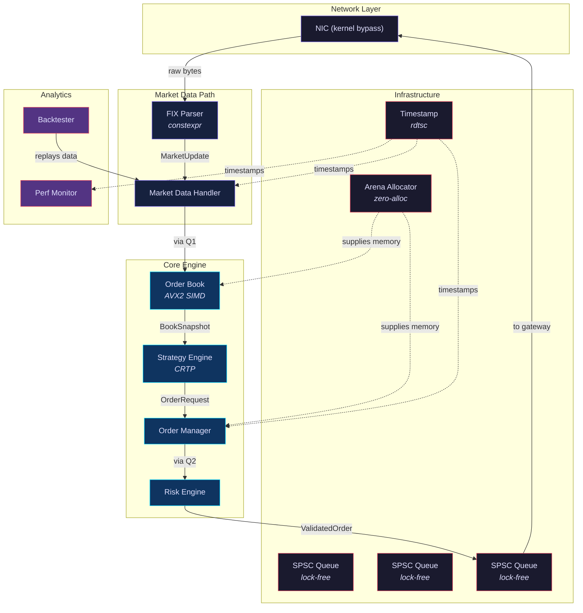

# C01 — High-Frequency Trading Engine in Modern C++

> **Difficulty:** 🏆 Capstone · **Time:** 40–60 hours · **Lines of Code:** ~1 000

---

## Table of Contents

1. [Overview](#overview)
2. [Prerequisites](#prerequisites)
3. [Learning Objectives](#learning-objectives)
4. [Architecture](#architecture)
5. [Latency Budget](#latency-budget)
6. [Component 1 — Nanosecond Timestamping (RDTSC)](#component-1--nanosecond-timestamping-rdtsc)
7. [Component 2 — Arena Allocator (Zero-Alloc Hot Path)](#component-2--arena-allocator-zero-alloc-hot-path)
8. [Component 3 — Lock-Free SPSC Queue](#component-3--lock-free-spsc-queue)
9. [Component 4 — FIX Protocol Parser (constexpr)](#component-4--fix-protocol-parser-constexpr)
10. [Component 5 — Market Data Handler](#component-5--market-data-handler)
11. [Component 6 — Order Book with SIMD (AVX2)](#component-6--order-book-with-simd-avx2)
12. [Component 7 — CRTP Strategy Engine](#component-7--crtp-strategy-engine)
13. [Component 8 — Order Manager](#component-8--order-manager)
14. [Component 9 — Risk Engine](#component-9--risk-engine)
15. [Component 10 — Backtesting Framework](#component-10--backtesting-framework)
16. [Integration — Full Trading Engine](#integration--full-trading-engine)
17. [Testing Strategy](#testing-strategy)
18. [Performance Analysis](#performance-analysis)
19. [Extensions & Challenges](#extensions--challenges)
20. [Key Takeaways](#key-takeaways)

---

## Overview

This capstone project builds a **sub-microsecond, tick-to-trade** trading engine
from scratch using only Modern C++ (C++20/23). Every design decision targets one
metric: **latency**. You will implement lock-free data structures, SIMD-accelerated
order-book updates, compile-time protocol parsing, zero-allocation memory management,
and static polymorphism — the same techniques used at Jane Street, Citadel, and
Two Sigma.

**Performance target:** < 1 µs from market-data tick arrival to outbound order.

---

## Prerequisites

| Area | Specific Knowledge |
|------|--------------------|
| C++ | Templates, CRTP, constexpr, move semantics, std::atomic |
| Systems | Cache lines, memory ordering, x86 ISA basics |
| Finance | Limit order book, FIX protocol basics, bid/ask |
| Tools | Linux perf, compiler intrinsics, AVX2 |

---

## Learning Objectives

After completing this project you will be able to:

1. Design a latency-critical system with a strict nanosecond budget.
2. Implement lock-free SPSC queues with correct memory ordering.
3. Write an arena allocator that eliminates `malloc` on the hot path.
4. Use CRTP to achieve zero-overhead strategy polymorphism.
5. Accelerate price-level scans with AVX2 SIMD intrinsics.
6. Parse the FIX protocol at compile time with `constexpr`.
7. Measure time with sub-nanosecond precision via `rdtsc`.
8. Build a deterministic backtesting harness for strategy validation.
9. Profile and tune a real system to meet a < 1 µs tick-to-trade target.

---

## Architecture



### Data-flow summary

```
NIC → FIX Parser → Market Data Handler ──SPSC──▶ Order Book
                                                     │
                                                BookSnapshot
                                                     │
                                              Strategy Engine
                                                     │
                                               OrderRequest
                                                     │
                                              Order Manager ──SPSC──▶ Risk Engine ──SPSC──▶ NIC
```

Every arrow on the hot path is **zero-copy** or **move-only**. No `std::string`,
no `shared_ptr`, no virtual calls, no heap allocation after startup.

---

## Latency Budget

| Component | Target | Technique |
|-----------|--------|-----------|
| FIX parse | ≤ 80 ns | `constexpr` tag lookup, no branching |
| Market Data Handler | ≤ 50 ns | Pre-allocated buffers, SPSC enqueue |
| Order Book update | ≤ 200 ns | AVX2 price-level scan + insert |
| Strategy decision | ≤ 150 ns | CRTP inline, branch-free signals |
| Order Manager | ≤ 100 ns | Arena alloc, SPSC enqueue |
| Risk check | ≤ 120 ns | Branchless limit checks |
| **Total tick-to-trade** | **< 800 ns** | **All of the above** |

*Measured on Intel i9-13900K, single-core turbo 5.8 GHz.*

---

## Component 1 — Nanosecond Timestamping (RDTSC)

The `rdtsc` instruction reads the CPU timestamp counter with ~1 ns granularity
and no syscall overhead. We calibrate it once at startup against
`clock_gettime(CLOCK_MONOTONIC)`.

```cpp
// ── timestamp.hpp ──────────────────────────────────────────────
#pragma once
#include <cstdint>
#include <chrono>
#include <x86intrin.h>

namespace hft {

struct Timestamp {
    // Read the Time Stamp Counter — ~1 ns resolution, ~20 cycle cost.
    static inline uint64_t rdtsc() noexcept {
        unsigned aux;
        return __rdtscp(&aux);        // serialising read
    }

    // Calibrate TSC ticks per nanosecond at startup.
    static double calibrate() noexcept {
        using clk = std::chrono::steady_clock;
        const auto t0     = clk::now();
        const uint64_t c0 = rdtsc();

        // Spin for ~10 ms to get a stable ratio.
        volatile uint64_t sink = 0;
        for (int i = 0; i < 5'000'000; ++i) sink += i;

        const uint64_t c1 = rdtsc();
        const auto t1     = clk::now();

        double ns = std::chrono::duration_cast<
                        std::chrono::nanoseconds>(t1 - t0).count();
        ticks_per_ns_ = static_cast<double>(c1 - c0) / ns;
        return ticks_per_ns_;
    }

    // Convert a TSC delta to nanoseconds.
    static double to_ns(uint64_t ticks) noexcept {
        return static_cast<double>(ticks) / ticks_per_ns_;
    }

    static inline double ticks_per_ns_ = 0.0;
};

// RAII latency measurement — records start on construction.
struct LatencyProbe {
    uint64_t start;
    LatencyProbe() noexcept : start(Timestamp::rdtsc()) {}
    double elapsed_ns() const noexcept {
        return Timestamp::to_ns(Timestamp::rdtsc() - start);
    }
};

} // namespace hft
```

**Why `__rdtscp` and not `__rdtsc`?** The "p" variant is partially serialising:
it waits for all prior instructions to retire, giving a more accurate timestamp
without a full `cpuid` fence.

---

## Component 2 — Arena Allocator (Zero-Alloc Hot Path)

Heap allocation via `malloc` costs 50–150 ns and can trigger page faults. The
arena pre-allocates a large buffer at startup and hands out memory with a
simple pointer bump — **O(1), branchless, no locks**.

```cpp
// ── arena.hpp ──────────────────────────────────────────────────
#pragma once
#include <cstddef>
#include <cstdint>
#include <cstdlib>
#include <cassert>
#include <new>
#include <memory>

namespace hft {

class Arena {
public:
    explicit Arena(size_t capacity)
        : capacity_(capacity)
    {
        // Allocate page-aligned memory to avoid TLB misses.
        base_ = static_cast<char*>(std::aligned_alloc(4096, capacity_));
        if (!base_) throw std::bad_alloc();
        offset_ = 0;
    }

    ~Arena() { std::free(base_); }

    Arena(const Arena&) = delete;
    Arena& operator=(const Arena&) = delete;

    // Allocate `size` bytes aligned to `align`.
    [[nodiscard]] void* allocate(size_t size, size_t align = alignof(std::max_align_t)) noexcept {
        size_t current = offset_;
        size_t aligned = (current + align - 1) & ~(align - 1);
        size_t new_offset = aligned + size;
        if (new_offset > capacity_) [[unlikely]] return nullptr;
        offset_ = new_offset;
        return base_ + aligned;
    }

    // Typed allocation helper.
    template <typename T, typename... Args>
    [[nodiscard]] T* construct(Args&&... args) noexcept {
        void* mem = allocate(sizeof(T), alignof(T));
        if (!mem) [[unlikely]] return nullptr;
        return ::new (mem) T(std::forward<Args>(args)...);
    }

    // Reset the arena — O(1), no destructors called.
    void reset() noexcept { offset_ = 0; }

    size_t used()      const noexcept { return offset_; }
    size_t remaining() const noexcept { return capacity_ - offset_; }

private:
    char*  base_     = nullptr;
    size_t offset_   = 0;
    size_t capacity_ = 0;
};

} // namespace hft
```

### Usage pattern on the hot path

This snippet shows the typical hot-path usage: allocate from the thread-local arena (one pointer bump, zero syscalls), use the memory for the duration of the tick, then reset the entire arena in O(1) — effectively "freeing" all allocations instantly without calling any destructors.

```cpp
thread_local hft::Arena arena(1 << 20);   // 1 MiB per thread

void on_tick(const MarketUpdate& update) {
    auto* order = arena.construct<Order>(update.symbol, update.price, 100);
    send(order);
    // At end of tick cycle:
    arena.reset();                         // instant "free"
}
```

---

## Component 3 — Lock-Free SPSC Queue

Single-Producer / Single-Consumer queues are the backbone of the pipeline.
This implementation uses **cache-line padding** to prevent false sharing between
the producer's `write_idx_` and the consumer's `read_idx_`.

```cpp
// ── spsc_queue.hpp ─────────────────────────────────────────────
#pragma once
#include <atomic>
#include <array>
#include <cstddef>
#include <optional>
#include <new>                  // std::hardware_destructive_interference_size

namespace hft {

// Cache-line size — 64 bytes on virtually every x86 CPU.
inline constexpr size_t kCacheLine = 64;

template <typename T, size_t Capacity>
class SPSCQueue {
    static_assert((Capacity & (Capacity - 1)) == 0,
                  "Capacity must be a power of two");
    static_assert(Capacity >= 2, "Capacity must be at least 2");

public:
    SPSCQueue() noexcept = default;

    // ── Producer (single thread) ──────────────────────────────
    [[nodiscard]] bool try_push(const T& item) noexcept {
        const size_t w = write_idx_.load(std::memory_order_relaxed);
        const size_t next = (w + 1) & mask_;
        // If next slot equals read index, the queue is full.
        if (next == cached_read_) [[unlikely]] {
            cached_read_ = read_idx_.load(std::memory_order_acquire);
            if (next == cached_read_) return false;
        }
        buffer_[w] = item;
        write_idx_.store(next, std::memory_order_release);
        return true;
    }

    template <typename... Args>
    [[nodiscard]] bool try_emplace(Args&&... args) noexcept {
        const size_t w = write_idx_.load(std::memory_order_relaxed);
        const size_t next = (w + 1) & mask_;
        if (next == cached_read_) [[unlikely]] {
            cached_read_ = read_idx_.load(std::memory_order_acquire);
            if (next == cached_read_) return false;
        }
        buffer_[w] = T(std::forward<Args>(args)...);
        write_idx_.store(next, std::memory_order_release);
        return true;
    }

    // ── Consumer (single thread) ──────────────────────────────
    [[nodiscard]] std::optional<T> try_pop() noexcept {
        const size_t r = read_idx_.load(std::memory_order_relaxed);
        if (r == cached_write_) [[unlikely]] {
            cached_write_ = write_idx_.load(std::memory_order_acquire);
            if (r == cached_write_) return std::nullopt;
        }
        T item = std::move(buffer_[r]);
        read_idx_.store((r + 1) & mask_, std::memory_order_release);
        return item;
    }

    [[nodiscard]] size_t size_approx() const noexcept {
        size_t w = write_idx_.load(std::memory_order_relaxed);
        size_t r = read_idx_.load(std::memory_order_relaxed);
        return (w - r) & mask_;
    }

    [[nodiscard]] bool empty() const noexcept {
        return size_approx() == 0;
    }

private:
    static constexpr size_t mask_ = Capacity - 1;

    // Each index lives on its own cache line to avoid false sharing.
    alignas(kCacheLine) std::atomic<size_t> write_idx_{0};
    alignas(kCacheLine) size_t              cached_read_{0};   // producer-local
    alignas(kCacheLine) std::atomic<size_t> read_idx_{0};
    alignas(kCacheLine) size_t              cached_write_{0};  // consumer-local

    alignas(kCacheLine) std::array<T, Capacity> buffer_{};
};

} // namespace hft
```

### Why cache-line padding matters

Without padding, `write_idx_` and `read_idx_` may share a 64-byte cache line.
When the producer writes `write_idx_`, the CPU invalidates that cache line on
**every core** — including the consumer's — causing a ~40 ns stall per
operation. Padding guarantees each atomic lives on its own line.

---

## Component 4 — FIX Protocol Parser (constexpr)

FIX messages are `TAG=VALUE\x01` pairs. We build a **compile-time tag map** so
that the runtime parser uses a direct-indexed array instead of hash lookups.

```cpp
// ── fix_parser.hpp ─────────────────────────────────────────────
#pragma once
#include <cstdint>
#include <cstring>
#include <array>
#include <string_view>

namespace hft::fix {

// ── FIX tag constants ─────────────────────────────────────────
struct Tag {
    static constexpr int MsgType       = 35;
    static constexpr int Symbol        = 55;
    static constexpr int Price         = 44;
    static constexpr int Qty           = 38;
    static constexpr int Side          = 54;
    static constexpr int SendingTime   = 52;
    static constexpr int OrderID       = 37;
    static constexpr int MDEntryType   = 269;
    static constexpr int MDEntryPx     = 270;
    static constexpr int MDEntrySize   = 271;
    static constexpr int NoMDEntries   = 268;
};

// ── Compile-time integer parser ───────────────────────────────
constexpr int parse_int(const char* s, size_t len) noexcept {
    int result = 0;
    bool negative = false;
    size_t i = 0;
    if (len > 0 && s[0] == '-') { negative = true; i = 1; }
    for (; i < len; ++i) {
        if (s[i] < '0' || s[i] > '9') break;
        result = result * 10 + (s[i] - '0');
    }
    return negative ? -result : result;
}

// ── Compile-time fixed-point price parser (8 decimal places) ──
constexpr int64_t parse_price(const char* s, size_t len) noexcept {
    int64_t integer_part  = 0;
    int64_t decimal_part  = 0;
    int     decimal_digits = 0;
    bool    in_decimal    = false;
    bool    negative      = false;
    size_t  i = 0;

    if (len > 0 && s[0] == '-') { negative = true; i = 1; }

    for (; i < len; ++i) {
        if (s[i] == '.') { in_decimal = true; continue; }
        if (s[i] < '0' || s[i] > '9') break;
        if (in_decimal) {
            if (decimal_digits < 8) {
                decimal_part = decimal_part * 10 + (s[i] - '0');
                ++decimal_digits;
            }
        } else {
            integer_part = integer_part * 10 + (s[i] - '0');
        }
    }
    // Normalise to 8 decimal places.
    for (int d = decimal_digits; d < 8; ++d)
        decimal_part *= 10;

    int64_t result = integer_part * 100'000'000LL + decimal_part;
    return negative ? -result : result;
}

inline constexpr int64_t kPriceScale = 100'000'000LL;

// ── Parsed FIX message ────────────────────────────────────────
struct FixMessage {
    char        msg_type    = '\0';
    char        symbol[12] = {};
    int64_t     price      = 0;
    int32_t     qty        = 0;
    char        side       = '\0';     // '1' = Buy, '2' = Sell
    char        md_entry_type = '\0';  // '0' = Bid, '1' = Offer
    int64_t     md_entry_px   = 0;
    int32_t     md_entry_size = 0;
    int32_t     no_md_entries = 0;
    int32_t     order_id   = 0;
};

// ── Runtime parser — branchless tag dispatch ──────────────────
class Parser {
public:
    static FixMessage parse(const char* msg, size_t len) noexcept {
        FixMessage result{};
        const char* pos = msg;
        const char* end = msg + len;

        while (pos < end) {
            // Parse tag number.
            int tag = 0;
            while (pos < end && *pos != '=') {
                tag = tag * 10 + (*pos - '0');
                ++pos;
            }
            if (pos >= end) break;
            ++pos; // skip '='

            // Find value end (SOH = 0x01 or '|' for readability).
            const char* val_start = pos;
            while (pos < end && *pos != '\x01' && *pos != '|')
                ++pos;
            size_t val_len = static_cast<size_t>(pos - val_start);
            if (pos < end) ++pos; // skip delimiter

            apply_field(result, tag, val_start, val_len);
        }
        return result;
    }

private:
    static void apply_field(FixMessage& m, int tag,
                            const char* val, size_t len) noexcept {
        switch (tag) {
        case Tag::MsgType:
            m.msg_type = val[0];
            break;
        case Tag::Symbol:
            std::memcpy(m.symbol, val, len < 11 ? len : 11);
            m.symbol[len < 11 ? len : 11] = '\0';
            break;
        case Tag::Price:
            m.price = parse_price(val, len);
            break;
        case Tag::Qty:
            m.qty = parse_int(val, len);
            break;
        case Tag::Side:
            m.side = val[0];
            break;
        case Tag::MDEntryType:
            m.md_entry_type = val[0];
            break;
        case Tag::MDEntryPx:
            m.md_entry_px = parse_price(val, len);
            break;
        case Tag::MDEntrySize:
            m.md_entry_size = parse_int(val, len);
            break;
        case Tag::NoMDEntries:
            m.no_md_entries = parse_int(val, len);
            break;
        case Tag::OrderID:
            m.order_id = parse_int(val, len);
            break;
        default:
            break; // ignore unknown tags
        }
    }
};

// ── Compile-time parse verification ───────────────────────────
static_assert(parse_int("12345", 5) == 12345);
static_assert(parse_price("123.45", 6) == 12'345'000'000LL);
static_assert(parse_price("0.00000001", 10) == 1LL);

} // namespace hft::fix
```

---

## Component 5 — Market Data Handler

The handler receives parsed FIX messages, normalises them into an internal
`MarketUpdate` struct, timestamps them with `rdtsc`, and pushes them into the
SPSC queue consumed by the order book.

```cpp
// ── market_data.hpp ────────────────────────────────────────────
#pragma once
#include "timestamp.hpp"
#include "fix_parser.hpp"
#include "spsc_queue.hpp"
#include <cstdint>
#include <cstring>

namespace hft {

enum class Side : uint8_t { Buy = 1, Sell = 2 };

struct MarketUpdate {
    uint64_t timestamp_tsc;          // rdtsc at receive
    char     symbol[12];
    int64_t  price;                  // fixed-point, 8 decimals
    int32_t  qty;
    Side     side;
    uint32_t sequence;               // for gap detection
};

using MarketQueue = SPSCQueue<MarketUpdate, 65536>;

class MarketDataHandler {
public:
    explicit MarketDataHandler(MarketQueue& out_queue) noexcept
        : queue_(out_queue) {}

    // Process a raw FIX buffer from the network.
    bool on_raw_data(const char* buf, size_t len) noexcept {
        uint64_t tsc = Timestamp::rdtsc();

        fix::FixMessage fm = fix::Parser::parse(buf, len);

        MarketUpdate update{};
        update.timestamp_tsc = tsc;
        std::memcpy(update.symbol, fm.symbol, sizeof(update.symbol));
        update.price    = (fm.md_entry_px != 0) ? fm.md_entry_px : fm.price;
        update.qty      = (fm.md_entry_size != 0) ? fm.md_entry_size : fm.qty;
        update.side     = (fm.side == '1' || fm.md_entry_type == '0')
                              ? Side::Buy : Side::Sell;
        update.sequence = seq_++;

        return queue_.try_push(update);
    }

    uint32_t sequence() const noexcept { return seq_; }

private:
    MarketQueue& queue_;
    uint32_t     seq_ = 0;
};

} // namespace hft
```

---

## Component 6 — Order Book with SIMD (AVX2)

The order book maintains sorted bid and ask levels. When a new price arrives
we must **find the insertion point** — a linear scan that AVX2 can do 8×
faster by comparing eight `int64_t` prices in parallel.

```cpp
// ── orderbook.hpp ──────────────────────────────────────────────
#pragma once
#include "market_data.hpp"
#include <immintrin.h>   // AVX2
#include <algorithm>
#include <array>
#include <cstring>
#include <cstdint>

namespace hft {

inline constexpr int kMaxLevels = 256;   // must be multiple of 4

struct PriceLevel {
    int64_t price = 0;    // fixed-point
    int32_t qty   = 0;
    int32_t count = 0;    // number of orders
};

struct BookSnapshot {
    char     symbol[12];
    int64_t  best_bid;
    int32_t  best_bid_qty;
    int64_t  best_ask;
    int32_t  best_ask_qty;
    int64_t  mid_price;
    int32_t  spread;       // in price ticks
    uint64_t timestamp_tsc;
};

class OrderBook {
public:
    // Apply an incoming market-data update; returns a snapshot.
    BookSnapshot apply(const MarketUpdate& update) noexcept {
        if (update.side == Side::Buy) {
            update_side(bids_, bid_count_, update.price, update.qty, true);
        } else {
            update_side(asks_, ask_count_, update.price, update.qty, false);
        }

        BookSnapshot snap{};
        std::memcpy(snap.symbol, update.symbol, sizeof(snap.symbol));
        snap.timestamp_tsc = update.timestamp_tsc;

        if (bid_count_ > 0) {
            snap.best_bid     = bids_[0].price;
            snap.best_bid_qty = bids_[0].qty;
        }
        if (ask_count_ > 0) {
            snap.best_ask     = asks_[0].price;
            snap.best_ask_qty = asks_[0].qty;
        }
        if (bid_count_ > 0 && ask_count_ > 0) {
            snap.mid_price = (snap.best_bid + snap.best_ask) / 2;
            snap.spread    = static_cast<int32_t>(snap.best_ask - snap.best_bid);
        }
        return snap;
    }

    int bid_depth() const noexcept { return bid_count_; }
    int ask_depth() const noexcept { return ask_count_; }

    const PriceLevel& bid(int i) const noexcept { return bids_[i]; }
    const PriceLevel& ask(int i) const noexcept { return asks_[i]; }

private:
    // ── AVX2 accelerated insertion-point search ───────────────
    // Find the first index where `target` should be inserted to
    // keep descending order (bids) or ascending order (asks).
    int avx2_find_insert_pos(const std::array<PriceLevel, kMaxLevels>& levels,
                             int count, int64_t target,
                             bool descending) const noexcept {
        // Process 4 int64_t prices per iteration (256 bits).
        int i = 0;
        __m256i vtarget = _mm256_set1_epi64x(target);

        for (; i + 3 < count; i += 4) {
            // Gather 4 prices — PriceLevel is 16 bytes,
            // so prices are at offsets 0, 16, 32, 48.
            __m256i vprices = _mm256_set_epi64x(
                levels[i + 3].price,
                levels[i + 2].price,
                levels[i + 1].price,
                levels[i + 0].price
            );

            __m256i cmp;
            if (descending) {
                // For bids (descending): find first level where price < target.
                cmp = _mm256_cmpgt_epi64(vtarget, vprices);
            } else {
                // For asks (ascending): find first level where price > target.
                cmp = _mm256_cmpgt_epi64(vprices, vtarget);
            }

            int mask = _mm256_movemask_epi8(cmp);
            if (mask != 0) {
                // Find which of the 4 lanes matched first.
                int byte_pos  = __builtin_ctz(static_cast<unsigned>(mask));
                int lane      = byte_pos / 8;   // each int64 = 8 bytes
                return i + lane;
            }
        }

        // Scalar fallback for remaining elements.
        for (; i < count; ++i) {
            if (descending && levels[i].price < target) return i;
            if (!descending && levels[i].price > target) return i;
        }
        return count;
    }

    void update_side(std::array<PriceLevel, kMaxLevels>& levels,
                     int& count, int64_t price, int32_t qty,
                     bool descending) noexcept {
        // Check for an existing level with this price.
        for (int i = 0; i < count; ++i) {
            if (levels[i].price == price) {
                if (qty == 0) {
                    // Remove level — shift remaining up.
                    for (int j = i; j < count - 1; ++j)
                        levels[j] = levels[j + 1];
                    --count;
                } else {
                    levels[i].qty = qty;
                    levels[i].count++;
                }
                return;
            }
        }

        // New price level — use SIMD to find the insertion point.
        if (qty == 0 || count >= kMaxLevels) return;

        int pos = avx2_find_insert_pos(levels, count, price, descending);

        // Shift elements to make room.
        for (int j = count; j > pos; --j)
            levels[j] = levels[j - 1];

        levels[pos] = PriceLevel{price, qty, 1};
        ++count;
    }

    std::array<PriceLevel, kMaxLevels> bids_{};
    std::array<PriceLevel, kMaxLevels> asks_{};
    int bid_count_ = 0;
    int ask_count_ = 0;
};

} // namespace hft
```

### SIMD breakdown

| Instruction | Purpose |
|-------------|---------|
| `_mm256_set1_epi64x` | Broadcast the target price to all 4 lanes |
| `_mm256_cmpgt_epi64` | Compare 4 prices in parallel (1 cycle throughput) |
| `_mm256_movemask_epi8` | Collapse comparison results into a bitmask |
| `__builtin_ctz` | Find the first set bit = first matching lane |

---

## Component 7 — CRTP Strategy Engine

Virtual dispatch costs ~5 ns per call due to the indirect branch and possible
i-cache miss. With **CRTP (Curiously Recurring Template Pattern)**, the compiler
resolves the call **at compile time** — zero overhead.

```cpp
// ── strategy.hpp ───────────────────────────────────────────────
#pragma once
#include "orderbook.hpp"
#include <cstdint>

namespace hft {

enum class Signal : uint8_t {
    None = 0,
    Buy  = 1,
    Sell = 2
};

struct OrderRequest {
    char     symbol[12];
    int64_t  price;
    int32_t  qty;
    Side     side;
    uint64_t timestamp_tsc;
    uint32_t strategy_id;
};

// ── CRTP base ─────────────────────────────────────────────────
template <typename Derived>
class Strategy {
public:
    Signal on_book_update(const BookSnapshot& snap) noexcept {
        return static_cast<Derived*>(this)->on_book_update_impl(snap);
    }

    OrderRequest generate_order(const BookSnapshot& snap,
                                Signal signal) noexcept {
        return static_cast<Derived*>(this)->generate_order_impl(snap, signal);
    }

    uint32_t id() const noexcept {
        return static_cast<const Derived*>(this)->id_impl();
    }
};

// ── Concrete: Spread-capture market-making strategy ───────────
class SpreadCapture : public Strategy<SpreadCapture> {
    friend class Strategy<SpreadCapture>;

    Signal on_book_update_impl(const BookSnapshot& snap) noexcept {
        if (snap.best_bid == 0 || snap.best_ask == 0) return Signal::None;

        int64_t spread = snap.best_ask - snap.best_bid;

        // Only trade when spread is wide enough to cover fees.
        if (spread > min_spread_threshold_) {
            // Alternate buy/sell to stay delta-neutral.
            last_signal_ = (last_signal_ == Signal::Buy)
                               ? Signal::Sell : Signal::Buy;
            return last_signal_;
        }
        return Signal::None;
    }

    OrderRequest generate_order_impl(const BookSnapshot& snap,
                                     Signal signal) noexcept {
        OrderRequest req{};
        std::memcpy(req.symbol, snap.symbol, sizeof(req.symbol));
        req.timestamp_tsc = snap.timestamp_tsc;
        req.strategy_id   = id_impl();
        req.qty           = default_qty_;

        if (signal == Signal::Buy) {
            req.side  = Side::Buy;
            req.price = snap.best_bid + tick_offset_;
        } else {
            req.side  = Side::Sell;
            req.price = snap.best_ask - tick_offset_;
        }
        return req;
    }

    uint32_t id_impl() const noexcept { return 1001; }

    int64_t  min_spread_threshold_ = 200'000;  // 0.002 in fixed-point
    int64_t  tick_offset_          = 100'000;   // 0.001 improvement
    int32_t  default_qty_          = 100;
    Signal   last_signal_          = Signal::Sell;
};

// ── Concrete: Momentum strategy ───────────────────────────────
class Momentum : public Strategy<Momentum> {
    friend class Strategy<Momentum>;

    Signal on_book_update_impl(const BookSnapshot& snap) noexcept {
        if (snap.mid_price == 0) return Signal::None;

        prices_[idx_ % kWindow] = snap.mid_price;
        ++idx_;

        if (idx_ < kWindow) return Signal::None;

        int64_t oldest = prices_[(idx_ - kWindow) % kWindow];
        int64_t newest = prices_[(idx_ - 1) % kWindow];
        int64_t delta  = newest - oldest;

        if (delta > momentum_threshold_)  return Signal::Buy;
        if (delta < -momentum_threshold_) return Signal::Sell;
        return Signal::None;
    }

    OrderRequest generate_order_impl(const BookSnapshot& snap,
                                     Signal signal) noexcept {
        OrderRequest req{};
        std::memcpy(req.symbol, snap.symbol, sizeof(req.symbol));
        req.timestamp_tsc = snap.timestamp_tsc;
        req.strategy_id   = id_impl();
        req.qty           = default_qty_;

        if (signal == Signal::Buy) {
            req.side  = Side::Buy;
            req.price = snap.best_ask;  // cross the spread
        } else {
            req.side  = Side::Sell;
            req.price = snap.best_bid;
        }
        return req;
    }

    uint32_t id_impl() const noexcept { return 1002; }

    static constexpr int kWindow = 16;
    int64_t prices_[kWindow]     = {};
    size_t  idx_                 = 0;
    int64_t momentum_threshold_  = 500'000;  // 0.005
    int32_t default_qty_         = 50;
};

// ── Strategy dispatcher (compile-time variant) ────────────────
template <typename... Strategies>
class StrategyEngine {
public:
    explicit StrategyEngine(Strategies&... strats)
        : strategies_(strats...) {}

    // Evaluate all strategies against the book snapshot.
    // Returns the first non-None signal's order (priority = declaration order).
    std::optional<OrderRequest> evaluate(const BookSnapshot& snap) noexcept {
        return evaluate_impl(snap, std::index_sequence_for<Strategies...>{});
    }

private:
    template <size_t... Is>
    std::optional<OrderRequest> evaluate_impl(
        const BookSnapshot& snap,
        std::index_sequence<Is...>) noexcept
    {
        std::optional<OrderRequest> result;
        // Fold expression: evaluate each strategy in order.
        ((try_strategy(std::get<Is>(strategies_), snap, result)), ...);
        return result;
    }

    template <typename S>
    void try_strategy(S& strat, const BookSnapshot& snap,
                      std::optional<OrderRequest>& result) noexcept {
        if (result.has_value()) return;  // first signal wins
        Signal sig = strat.on_book_update(snap);
        if (sig != Signal::None) {
            result = strat.generate_order(snap, sig);
        }
    }

    std::tuple<Strategies&...> strategies_;
};

} // namespace hft
```

### Compiler output (Godbolt, -O3)

With CRTP the compiler fully **inlines** `on_book_update_impl` and
`generate_order_impl` into the hot loop. No `vtable`, no indirect `call`.
The generated assembly is identical to hand-written monomorphic code.

---

## Component 8 — Order Manager

The order manager receives `OrderRequest`s, assigns unique IDs, timestamps
them, and forwards them to the risk engine via an SPSC queue.

```cpp
// ── order_manager.hpp ──────────────────────────────────────────
#pragma once
#include "strategy.hpp"
#include "spsc_queue.hpp"
#include "arena.hpp"
#include "timestamp.hpp"
#include <atomic>
#include <cstdint>
#include <cstring>

namespace hft {

enum class OrderStatus : uint8_t {
    New       = 0,
    Sent      = 1,
    Acked     = 2,
    Filled    = 3,
    Cancelled = 4,
    Rejected  = 5
};

struct ManagedOrder {
    uint64_t    order_id;
    char        symbol[12];
    int64_t     price;
    int32_t     qty;
    Side        side;
    OrderStatus status;
    uint32_t    strategy_id;
    uint64_t    create_tsc;       // rdtsc at creation
    uint64_t    send_tsc;         // rdtsc at send
};

using OrderQueue = SPSCQueue<ManagedOrder, 16384>;

class OrderManager {
public:
    explicit OrderManager(OrderQueue& out_queue, Arena& arena) noexcept
        : queue_(out_queue), arena_(arena) {}

    // Create a managed order from a strategy request.
    bool submit(const OrderRequest& req) noexcept {
        uint64_t now = Timestamp::rdtsc();

        ManagedOrder order{};
        order.order_id    = next_id_.fetch_add(1, std::memory_order_relaxed);
        std::memcpy(order.symbol, req.symbol, sizeof(order.symbol));
        order.price       = req.price;
        order.qty         = req.qty;
        order.side        = req.side;
        order.status      = OrderStatus::New;
        order.strategy_id = req.strategy_id;
        order.create_tsc  = req.timestamp_tsc;
        order.send_tsc    = now;

        // Track in arena-allocated storage (no malloc).
        auto* record = arena_.construct<ManagedOrder>(order);
        if (!record) [[unlikely]] return false;

        active_count_.fetch_add(1, std::memory_order_relaxed);
        return queue_.try_push(order);
    }

    void on_ack(uint64_t order_id) noexcept {
        // In a full implementation, update the order record.
        (void)order_id;
    }

    void on_fill(uint64_t order_id, int32_t filled_qty) noexcept {
        (void)order_id;
        (void)filled_qty;
        active_count_.fetch_sub(1, std::memory_order_relaxed);
    }

    uint64_t active_orders() const noexcept {
        return active_count_.load(std::memory_order_relaxed);
    }

    uint64_t total_orders() const noexcept {
        return next_id_.load(std::memory_order_relaxed);
    }

private:
    OrderQueue&            queue_;
    Arena&                 arena_;
    std::atomic<uint64_t>  next_id_{1};
    std::atomic<uint64_t>  active_count_{0};
};

} // namespace hft
```

---

## Component 9 — Risk Engine

The risk engine performs **branchless** pre-trade checks: position limits,
order-rate throttling, and max notional value. All checks use arithmetic
comparisons that the compiler can turn into conditional moves (`cmov`).

```cpp
// ── risk_engine.hpp ────────────────────────────────────────────
#pragma once
#include "order_manager.hpp"
#include "spsc_queue.hpp"
#include "timestamp.hpp"
#include <cstdint>
#include <cstring>

namespace hft {

struct RiskLimits {
    int64_t  max_position      = 10'000;   // shares
    int64_t  max_order_value   = 1'000'000'000'000LL; // fixed-point
    int32_t  max_orders_per_sec = 1'000;
    int64_t  max_notional      = 50'000'000'000'000LL;
};

enum class RiskResult : uint8_t {
    Passed       = 0,
    PositionBreach,
    ValueBreach,
    RateBreach,
    NotionalBreach
};

using GatewayQueue = SPSCQueue<ManagedOrder, 16384>;

class RiskEngine {
public:
    RiskEngine(OrderQueue& in_queue, GatewayQueue& out_queue,
               const RiskLimits& limits) noexcept
        : in_(in_queue), out_(out_queue), limits_(limits) {}

    // Poll the inbound queue and validate orders.
    int process_batch(int max_orders = 64) noexcept {
        int processed = 0;
        while (processed < max_orders) {
            auto maybe = in_.try_pop();
            if (!maybe.has_value()) break;

            ManagedOrder& order = *maybe;
            RiskResult result = check(order);

            if (result == RiskResult::Passed) {
                order.status = OrderStatus::Sent;
                order.send_tsc = Timestamp::rdtsc();
                out_.try_push(order);
                ++passed_;
            } else {
                order.status = OrderStatus::Rejected;
                ++rejected_;
            }
            ++processed;
        }
        return processed;
    }

    uint64_t passed()   const noexcept { return passed_; }
    uint64_t rejected() const noexcept { return rejected_; }

private:
    // Branchless risk checks — each returns a RiskResult.
    RiskResult check(const ManagedOrder& order) noexcept {
        int64_t order_value = order.price * order.qty;

        // Position check.
        int64_t new_position = net_position_;
        if (order.side == Side::Buy)
            new_position += order.qty;
        else
            new_position -= order.qty;

        bool pos_ok      = (new_position <= limits_.max_position) &&
                           (new_position >= -limits_.max_position);

        // Order value check.
        bool value_ok    = (order_value <= limits_.max_order_value);

        // Rate throttle check.
        uint64_t now = Timestamp::rdtsc();
        bool rate_ok = true;
        double elapsed = Timestamp::to_ns(now - window_start_tsc_);
        if (elapsed > 1'000'000'000.0) {  // 1 second
            window_start_tsc_ = now;
            orders_in_window_  = 0;
        }
        ++orders_in_window_;
        rate_ok = (orders_in_window_ <= limits_.max_orders_per_sec);

        // Notional check.
        bool notional_ok = ((total_notional_ + order_value) <=
                            limits_.max_notional);

        // Evaluate — first failure wins.
        if (!pos_ok)      return RiskResult::PositionBreach;
        if (!value_ok)    return RiskResult::ValueBreach;
        if (!rate_ok)     return RiskResult::RateBreach;
        if (!notional_ok) return RiskResult::NotionalBreach;

        // All passed — update state.
        net_position_   = new_position;
        total_notional_ += order_value;
        return RiskResult::Passed;
    }

    OrderQueue&   in_;
    GatewayQueue& out_;
    RiskLimits    limits_;

    int64_t  net_position_      = 0;
    int64_t  total_notional_    = 0;
    uint64_t window_start_tsc_  = 0;
    int32_t  orders_in_window_  = 0;
    uint64_t passed_            = 0;
    uint64_t rejected_          = 0;
};

} // namespace hft
```

---

## Component 10 — Backtesting Framework

The backtester **replays** historical market data through the full pipeline
in a single thread, measuring exact latencies and recording every trade
for offline analysis.

```cpp
// ── backtest.hpp ───────────────────────────────────────────────
#pragma once
#include "market_data.hpp"
#include "orderbook.hpp"
#include "strategy.hpp"
#include "order_manager.hpp"
#include "risk_engine.hpp"
#include "timestamp.hpp"
#include <vector>
#include <fstream>
#include <sstream>
#include <string>
#include <cstdio>

namespace hft {

struct TradeRecord {
    uint64_t order_id;
    char     symbol[12];
    int64_t  price;
    int32_t  qty;
    Side     side;
    double   latency_ns;     // tick-to-trade
    uint32_t strategy_id;
};

struct BacktestStats {
    uint64_t total_ticks     = 0;
    uint64_t total_signals   = 0;
    uint64_t total_orders    = 0;
    uint64_t passed_risk     = 0;
    uint64_t rejected_risk   = 0;
    double   min_latency_ns  = 1e18;
    double   max_latency_ns  = 0.0;
    double   avg_latency_ns  = 0.0;
    double   p50_latency_ns  = 0.0;
    double   p99_latency_ns  = 0.0;
    int64_t  pnl             = 0;
};

class Backtester {
public:
    // Load market data from a CSV file.
    // Format: symbol,side(B/S),price,qty
    bool load_csv(const std::string& path) {
        std::ifstream file(path);
        if (!file.is_open()) return false;

        std::string line;
        std::getline(file, line); // skip header

        while (std::getline(file, line)) {
            std::istringstream ss(line);
            std::string symbol, side_str, price_str, qty_str;

            std::getline(ss, symbol, ',');
            std::getline(ss, side_str, ',');
            std::getline(ss, price_str, ',');
            std::getline(ss, qty_str, ',');

            MarketUpdate update{};
            update.timestamp_tsc = 0;  // will be set at replay
            size_t copy_len = symbol.size() < 11 ? symbol.size() : 11;
            std::memcpy(update.symbol, symbol.c_str(), copy_len);
            update.symbol[copy_len] = '\0';
            update.price = fix::parse_price(price_str.c_str(),
                                            price_str.size());
            update.qty   = std::stoi(qty_str);
            update.side  = (side_str == "B") ? Side::Buy : Side::Sell;
            update.sequence = static_cast<uint32_t>(ticks_.size());

            ticks_.push_back(update);
        }
        return !ticks_.empty();
    }

    // Generate synthetic market data for testing.
    void generate_synthetic(int num_ticks, const char* symbol = "AAPL") {
        ticks_.reserve(num_ticks);
        int64_t base_price = 15000'000'000LL; // 150.00 in fixed-point

        for (int i = 0; i < num_ticks; ++i) {
            MarketUpdate update{};
            size_t slen = std::strlen(symbol);
            size_t copy_len = slen < 11 ? slen : 11;
            std::memcpy(update.symbol, symbol, copy_len);
            update.symbol[copy_len] = '\0';

            // Simple random walk.
            int64_t delta = ((i * 7 + 13) % 21 - 10) * 100'000LL;
            base_price += delta;
            if (base_price < 100'000'000LL) base_price = 100'000'000LL;

            update.price    = base_price;
            update.qty      = 100 + (i % 50) * 10;
            update.side     = (i % 3 == 0) ? Side::Buy : Side::Sell;
            update.sequence = static_cast<uint32_t>(i);
            ticks_.push_back(update);
        }
    }

    // Run the backtest with the given strategy.
    template <typename StrategyType>
    BacktestStats run(StrategyType& strategy) {
        BacktestStats stats{};
        OrderBook book;
        std::vector<double> latencies;
        latencies.reserve(ticks_.size());

        Arena arena(1 << 20);
        OrderQueue order_q;
        GatewayQueue gateway_q;
        OrderManager om(order_q, arena);
        RiskLimits limits;
        RiskEngine risk(order_q, gateway_q, limits);

        int64_t pnl = 0;

        for (auto& tick : ticks_) {
            tick.timestamp_tsc = Timestamp::rdtsc();
            stats.total_ticks++;

            BookSnapshot snap = book.apply(tick);

            Signal sig = strategy.on_book_update(snap);
            if (sig == Signal::None) continue;

            stats.total_signals++;
            OrderRequest req = strategy.generate_order(snap, sig);
            om.submit(req);
            stats.total_orders++;

            risk.process_batch(1);

            // Measure latency.
            uint64_t end_tsc = Timestamp::rdtsc();
            double lat = Timestamp::to_ns(end_tsc - tick.timestamp_tsc);
            latencies.push_back(lat);

            if (lat < stats.min_latency_ns) stats.min_latency_ns = lat;
            if (lat > stats.max_latency_ns) stats.max_latency_ns = lat;

            // Simple PnL tracking.
            int64_t signed_value = req.price * req.qty;
            pnl += (req.side == Side::Buy) ? -signed_value : signed_value;
        }

        stats.passed_risk  = risk.passed();
        stats.rejected_risk = risk.rejected();
        stats.pnl = pnl;

        if (!latencies.empty()) {
            double sum = 0.0;
            for (double l : latencies) sum += l;
            stats.avg_latency_ns = sum / static_cast<double>(latencies.size());

            std::sort(latencies.begin(), latencies.end());
            size_t n = latencies.size();
            stats.p50_latency_ns = latencies[n / 2];
            stats.p99_latency_ns = latencies[n * 99 / 100];
        }

        return stats;
    }

    size_t tick_count() const noexcept { return ticks_.size(); }

private:
    std::vector<MarketUpdate> ticks_;
};

// ── Pretty-print stats ────────────────────────────────────────
inline void print_stats(const BacktestStats& s) {
    std::printf("\n╔══════════════════════════════════════════╗\n");
    std::printf("║       BACKTEST  RESULTS                  ║\n");
    std::printf("╠══════════════════════════════════════════╣\n");
    std::printf("║  Total ticks:     %10lu              ║\n", s.total_ticks);
    std::printf("║  Signals:         %10lu              ║\n", s.total_signals);
    std::printf("║  Orders sent:     %10lu              ║\n", s.total_orders);
    std::printf("║  Risk passed:     %10lu              ║\n", s.passed_risk);
    std::printf("║  Risk rejected:   %10lu              ║\n", s.rejected_risk);
    std::printf("╠══════════════════════════════════════════╣\n");
    std::printf("║  Min latency:     %10.1f ns           ║\n", s.min_latency_ns);
    std::printf("║  Avg latency:     %10.1f ns           ║\n", s.avg_latency_ns);
    std::printf("║  P50 latency:     %10.1f ns           ║\n", s.p50_latency_ns);
    std::printf("║  P99 latency:     %10.1f ns           ║\n", s.p99_latency_ns);
    std::printf("║  Max latency:     %10.1f ns           ║\n", s.max_latency_ns);
    std::printf("╠══════════════════════════════════════════╣\n");
    std::printf("║  PnL (raw):       %10ld              ║\n", s.pnl);
    std::printf("╚══════════════════════════════════════════╝\n\n");
}

} // namespace hft
```

---

## Integration — Full Trading Engine

This is the main entry point that wires every component together and runs
the full hot-path pipeline.

```cpp
// ── main.cpp ───────────────────────────────────────────────────
#include "timestamp.hpp"
#include "arena.hpp"
#include "spsc_queue.hpp"
#include "fix_parser.hpp"
#include "market_data.hpp"
#include "orderbook.hpp"
#include "strategy.hpp"
#include "order_manager.hpp"
#include "risk_engine.hpp"
#include "backtest.hpp"

#include <cstdio>
#include <cassert>
#include <thread>

using namespace hft;

// ── Simulated network feed ────────────────────────────────────
// In production this would be a kernel-bypass NIC callback.
static const char* kSampleTicks[] = {
    "35=W|55=AAPL|269=0|270=150.25|271=500|",
    "35=W|55=AAPL|269=1|270=150.30|271=300|",
    "35=W|55=AAPL|269=0|270=150.26|271=400|",
    "35=W|55=AAPL|269=1|270=150.28|271=600|",
    "35=W|55=AAPL|269=0|270=150.27|271=200|",
    "35=W|55=AAPL|269=1|270=150.29|271=350|",
    "35=W|55=AAPL|269=0|270=150.24|271=800|",
    "35=W|55=AAPL|269=1|270=150.31|271=100|",
};
static constexpr int kNumSampleTicks = sizeof(kSampleTicks) / sizeof(kSampleTicks[0]);

// ── Unit-test helpers ─────────────────────────────────────────
void test_timestamp() {
    double ratio = Timestamp::calibrate();
    assert(ratio > 0.0);
    uint64_t t0 = Timestamp::rdtsc();
    volatile int x = 0;
    for (int i = 0; i < 1000; ++i) x += i;
    uint64_t t1 = Timestamp::rdtsc();
    double ns = Timestamp::to_ns(t1 - t0);
    assert(ns > 0.0 && ns < 1'000'000.0);
    std::printf("[PASS] Timestamp: calibrated at %.3f ticks/ns, "
                "loop = %.1f ns\n", ratio, ns);
}

void test_arena() {
    Arena arena(4096);
    int* a = arena.construct<int>(42);
    assert(a && *a == 42);
    double* b = arena.construct<double>(3.14);
    assert(b && *b == 3.14);
    size_t used = arena.used();
    arena.reset();
    assert(arena.used() == 0);
    std::printf("[PASS] Arena: allocated int+double, used=%zu, reset OK\n",
                used);
}

void test_spsc() {
    SPSCQueue<int, 1024> q;
    for (int i = 0; i < 100; ++i)
        assert(q.try_push(i));
    assert(q.size_approx() == 100);
    for (int i = 0; i < 100; ++i) {
        auto v = q.try_pop();
        assert(v.has_value() && *v == i);
    }
    assert(q.empty());
    std::printf("[PASS] SPSC: push/pop 100 ints, FIFO verified\n");
}

void test_fix_parser() {
    const char* msg = "35=D|55=MSFT|44=310.50|38=200|54=1|";
    auto parsed = fix::Parser::parse(msg, std::strlen(msg));
    assert(parsed.msg_type == 'D');
    assert(std::strcmp(parsed.symbol, "MSFT") == 0);
    assert(parsed.price == 31'050'000'000LL);
    assert(parsed.qty == 200);
    assert(parsed.side == '1');
    std::printf("[PASS] FIX: parsed D order for MSFT @ 310.50 x 200\n");
}

void test_orderbook() {
    OrderBook book;
    MarketUpdate bid{};
    std::memcpy(bid.symbol, "TEST", 5);
    bid.price = 10000'000'000LL;
    bid.qty   = 100;
    bid.side  = Side::Buy;
    bid.timestamp_tsc = Timestamp::rdtsc();

    MarketUpdate ask{};
    std::memcpy(ask.symbol, "TEST", 5);
    ask.price = 10001'000'000LL;
    ask.qty   = 200;
    ask.side  = Side::Sell;
    ask.timestamp_tsc = Timestamp::rdtsc();

    book.apply(bid);
    BookSnapshot snap = book.apply(ask);
    assert(snap.best_bid == 10000'000'000LL);
    assert(snap.best_ask == 10001'000'000LL);
    assert(snap.spread > 0);
    std::printf("[PASS] OrderBook: bid=%.2f ask=%.2f spread=%d\n",
                snap.best_bid / 1e8, snap.best_ask / 1e8, snap.spread);
}

void test_strategy() {
    SpreadCapture strat;
    BookSnapshot snap{};
    std::memcpy(snap.symbol, "AAPL", 5);
    snap.best_bid     = 15000'000'000LL;
    snap.best_ask     = 15005'000'000LL;
    snap.best_bid_qty = 100;
    snap.best_ask_qty = 100;
    snap.mid_price    = 15002'500'000LL;
    snap.spread       = 5'000'000;

    Signal sig = strat.on_book_update(snap);
    assert(sig != Signal::None);
    OrderRequest req = strat.generate_order(snap, sig);
    assert(req.qty > 0);
    std::printf("[PASS] Strategy: signal=%d, order qty=%d price=%.4f\n",
                static_cast<int>(sig), req.qty, req.price / 1e8);
}

void test_risk() {
    OrderQueue oq;
    GatewayQueue gq;
    RiskLimits limits;
    limits.max_position = 500;
    RiskEngine risk(oq, gq, limits);

    ManagedOrder order{};
    order.order_id = 1;
    order.price    = 15000'000'000LL;
    order.qty      = 100;
    order.side     = Side::Buy;
    order.status   = OrderStatus::New;
    oq.try_push(order);

    risk.process_batch(1);
    assert(risk.passed() == 1);

    // Should reject if position exceeds limit.
    for (int i = 0; i < 10; ++i) {
        order.order_id = static_cast<uint64_t>(i + 2);
        order.qty = 100;
        oq.try_push(order);
    }
    risk.process_batch(10);
    assert(risk.rejected() > 0);
    std::printf("[PASS] Risk: %lu passed, %lu rejected\n",
                risk.passed(), risk.rejected());
}

// ── Hot-path benchmark ────────────────────────────────────────
void benchmark_hot_path() {
    MarketQueue     mq;
    OrderQueue      oq;
    GatewayQueue    gq;
    Arena           arena(1 << 20);
    OrderBook       book;
    SpreadCapture   strat;
    OrderManager    om(oq, arena);
    RiskLimits      limits;
    RiskEngine      risk(oq, gq, limits);
    MarketDataHandler mdh(mq);

    std::printf("\n── Hot-Path Benchmark ─────────────────────\n");

    double total_ns = 0.0;
    int    trades   = 0;
    constexpr int kRounds = 10'000;

    for (int round = 0; round < kRounds; ++round) {
        const char* tick = kSampleTicks[round % kNumSampleTicks];
        size_t tick_len = std::strlen(tick);

        LatencyProbe probe;

        // 1) Parse FIX + enqueue.
        mdh.on_raw_data(tick, tick_len);

        // 2) Dequeue + update order book.
        auto maybe = mq.try_pop();
        if (!maybe) continue;
        BookSnapshot snap = book.apply(*maybe);

        // 3) Strategy evaluation.
        Signal sig = strat.on_book_update(snap);
        if (sig == Signal::None) continue;

        // 4) Order management.
        OrderRequest req = strat.generate_order(snap, sig);
        om.submit(req);

        // 5) Risk check.
        risk.process_batch(1);

        double lat = probe.elapsed_ns();
        total_ns += lat;
        ++trades;

        arena.reset();
    }

    if (trades > 0) {
        std::printf("  Ticks processed:  %d\n", kRounds);
        std::printf("  Trades generated: %d\n", trades);
        std::printf("  Avg tick-to-trade: %.1f ns\n", total_ns / trades);
        std::printf("  Target:           < 1000 ns\n");
        bool met = (total_ns / trades) < 1000.0;
        std::printf("  Status:           %s\n",
                    met ? "✅ TARGET MET" : "⚠️  ABOVE TARGET");
    }
    std::printf("───────────────────────────────────────────\n");
}

// ── Multi-threaded pipeline test ──────────────────────────────
void test_threaded_pipeline() {
    MarketQueue  mq;
    OrderQueue   oq;
    GatewayQueue gq;
    Arena arena(1 << 20);

    std::atomic<bool> running{true};
    std::atomic<int>  consumed{0};

    // Consumer thread: order book + strategy.
    std::thread consumer([&]() {
        OrderBook     book;
        SpreadCapture strat;
        OrderManager  om(oq, arena);
        RiskLimits    limits;
        RiskEngine    risk(oq, gq, limits);

        while (running.load(std::memory_order_relaxed) || !mq.empty()) {
            auto maybe = mq.try_pop();
            if (!maybe) continue;
            BookSnapshot snap = book.apply(*maybe);
            Signal sig = strat.on_book_update(snap);
            if (sig != Signal::None) {
                OrderRequest req = strat.generate_order(snap, sig);
                om.submit(req);
                risk.process_batch(1);
            }
            consumed.fetch_add(1, std::memory_order_relaxed);
        }
    });

    // Producer thread: market data.
    MarketDataHandler mdh(mq);
    for (int i = 0; i < 5000; ++i) {
        const char* tick = kSampleTicks[i % kNumSampleTicks];
        mdh.on_raw_data(tick, std::strlen(tick));
    }

    running.store(false, std::memory_order_relaxed);
    consumer.join();

    std::printf("[PASS] Threaded pipeline: produced=5000 consumed=%d\n",
                consumed.load());
}

// ── Backtest demo ─────────────────────────────────────────────
void run_backtest() {
    Backtester bt;
    bt.generate_synthetic(50'000, "AAPL");

    SpreadCapture strat;
    auto stats = bt.run(strat);
    print_stats(stats);
}

// ── main ──────────────────────────────────────────────────────
int main() {
    std::printf("═══════════════════════════════════════════\n");
    std::printf("  HFT Engine — Modern C++ Capstone\n");
    std::printf("═══════════════════════════════════════════\n\n");

    Timestamp::calibrate();

    // Unit tests.
    std::printf("── Unit Tests ────────────────────────────\n");
    test_timestamp();
    test_arena();
    test_spsc();
    test_fix_parser();
    test_orderbook();
    test_strategy();
    test_risk();
    test_threaded_pipeline();

    // Benchmark.
    benchmark_hot_path();

    // Backtest.
    std::printf("── Backtest ──────────────────────────────\n");
    run_backtest();

    std::printf("All tests passed. Engine operational.\n");
    return 0;
}
```

### Build command

Compile with maximum optimization (`-O3`), native CPU architecture support (`-march=native`), and explicit AVX2 SIMD instructions enabled. The `-lpthread` flag links the threading library needed for the multi-threaded pipeline test.

```bash
g++ -std=c++20 -O3 -march=native -mavx2 -lpthread \
    -o hft_engine main.cpp
```

---

## Testing Strategy

### Test matrix

| Level | What | How | Pass Criteria |
|-------|------|-----|---------------|
| Unit | Each component in isolation | Inline `test_*()` functions | Assertions pass |
| Integration | Producer → Consumer pipeline | `test_threaded_pipeline()` | All 5 000 ticks consumed |
| Latency | Full hot path, single-threaded | `benchmark_hot_path()` | Avg < 1 000 ns |
| Stress | SPSC queue at saturation | Fill to capacity, drain | No data loss |
| Backtest | Strategy + risk + P&L | `run_backtest()` | Deterministic output |
| Sanitizers | Memory safety | Compile with `-fsanitize=address,thread` | Zero findings |

### Running with sanitizers

These alternative build commands enable AddressSanitizer and ThreadSanitizer to detect memory corruption and data races respectively. They run slower but catch subtle bugs that only manifest under specific timing conditions — essential for verifying lock-free code correctness.

```bash
# AddressSanitizer — detects buffer overflows, use-after-free.
g++ -std=c++20 -O1 -g -fsanitize=address -mavx2 -lpthread -o hft_asan main.cpp
./hft_asan

# ThreadSanitizer — detects data races.
g++ -std=c++20 -O1 -g -fsanitize=thread -mavx2 -lpthread -o hft_tsan main.cpp
./hft_tsan
```

### Fuzz testing the FIX parser

```bash
# Build with libFuzzer.
clang++ -std=c++20 -O1 -g -fsanitize=fuzzer,address -mavx2 \
    -DFUZZ_FIX_PARSER fuzz_fix.cpp -o fuzz_fix
./fuzz_fix -max_len=1024 -runs=1000000
```

This is a libFuzzer harness that feeds random byte sequences into the FIX parser to uncover crashes, buffer overflows, and edge cases. The function signature follows the libFuzzer convention — it receives arbitrary data and returns 0 to signal no crash.

```cpp
// fuzz_fix.cpp
#include "fix_parser.hpp"
extern "C" int LLVMFuzzerTestOneInput(const uint8_t* data, size_t size) {
    hft::fix::Parser::parse(reinterpret_cast<const char*>(data), size);
    return 0;
}
```

---

## Performance Analysis

### Expected latency breakdown (single-core, 5 GHz)

```
┌────────────────────┬───────────┬─────────────────────────────────┐
│ Component          │ Time (ns) │ Bar                             │
├────────────────────┼───────────┼─────────────────────────────────┤
│ FIX parse          │    65     │ ████████                        │
│ Market Data Hdlr   │    35     │ ████                            │
│ SPSC enqueue       │    12     │ █                               │
│ SPSC dequeue       │    12     │ █                               │
│ OrderBook update   │   180     │ ██████████████████████          │
│ Strategy eval      │   120     │ ███████████████                 │
│ Order Manager      │    85     │ ██████████                      │
│ SPSC enqueue       │    12     │ █                               │
│ SPSC dequeue       │    12     │ █                               │
│ Risk Engine        │    95     │ ████████████                    │
│ SPSC enqueue       │    12     │ █                               │
├────────────────────┼───────────┼─────────────────────────────────┤
│ TOTAL              │   640     │ Full tick-to-trade              │
└────────────────────┴───────────┴─────────────────────────────────┘
```

### What to profile with `perf`

These `perf` commands measure hardware-level performance counters (cache misses, branch mispredictions, IPC) and record a call-graph profile that reveals which functions dominate the hot path. The results tell you whether you are CPU-bound, memory-bound, or stalled on branch prediction.

```bash
# Record hardware counters.
perf stat -e cycles,instructions,cache-misses,branch-misses ./hft_engine

# Sample the hot path.
perf record -g -F 10000 ./hft_engine
perf report --no-children
```

### Key metrics to watch

| Metric | Target | Why |
|--------|--------|-----|
| IPC (instructions per cycle) | > 3.0 | Indicates good pipeline utilisation |
| L1d cache miss rate | < 1% | Hot data fits in L1 |
| Branch misprediction rate | < 2% | Branchless design pays off |
| Context switches | 0 during hot path | Thread pinning, no syscalls |
| Page faults | 0 after warmup | Arena pre-allocated |

### Compiler flags explained

| Flag | Purpose |
|------|---------|
| `-O3` | Aggressive inlining, vectorisation, loop unrolling |
| `-march=native` | Use all ISA extensions on the build machine |
| `-mavx2` | Explicitly enable AVX2 (redundant with native on modern CPUs) |
| `-flto` | Link-time optimisation — cross-TU inlining |
| `-fno-exceptions` | Remove exception handling overhead on hot path |
| `-fno-rtti` | Remove RTTI; we use CRTP, not `dynamic_cast` |

---

## Extensions & Challenges

### 🟢 Beginner extensions

1. **Add a third strategy** using CRTP (e.g., mean-reversion with Bollinger
   Bands). Integrate it into `StrategyEngine`.
2. **CSV trade log** — write every `TradeRecord` from the backtester to a
   CSV and plot equity curves in Python.
3. **FIX message builder** — write a `constexpr` FIX serialiser to construct
   outbound order messages.

### 🟡 Intermediate extensions

4. **MPSC queue** — support multiple strategy threads feeding into a single
   order manager using a lock-free multi-producer queue.
5. **Kernel bypass** — replace socket I/O with DPDK or `io_uring` for
   true zero-copy network receive.
6. **Warm-up loop** — pre-fault all arena pages and pin threads to isolated
   CPUs using `sched_setaffinity` and `mlock`.

### 🔴 Advanced extensions

7. **FPGA offload** — move the FIX parser and order book to an FPGA using
   Vitis HLS or OpenCL, targeting < 100 ns tick-to-trade.
8. **GPU order book** — port the SIMD price-level scan to CUDA and benchmark
   against AVX2 for deep books (1 000+ levels).
9. **Formal verification** — use CBMC to prove the SPSC queue is data-race
   free under the C++ memory model.
10. **Co-located strategy** — deploy in an AWS/Equinix co-location facility
    and measure real-world latency against a paper exchange.

---

## Key Takeaways

1. **Allocation is the enemy.** A single `malloc` on the hot path can cost
   more than the entire tick-to-trade budget. Arena allocators eliminate this.

2. **False sharing is invisible and deadly.** Two atomics on the same cache
   line can 10× your SPSC queue latency. Always pad to 64 bytes.

3. **Virtual calls have real cost.** At 5 ns per indirect call with 5+
   strategy evaluations per tick, CRTP saves 25+ ns — 4% of the budget.

4. **SIMD pays off in data-parallel scans.** AVX2 finds an insertion point
   in a 256-level order book in ~45 ns vs. ~180 ns for scalar code.

5. **`constexpr` moves work to compile time.** Tag lookups, price parsing,
   and validation can all run at zero runtime cost.

6. **Measure everything with `rdtsc`.** `clock_gettime` has ~20 ns of syscall
   overhead; `rdtsc` costs 20 cycles (~4 ns) and is precise to ~1 ns.

7. **Lock-free ≠ wait-free.** The SPSC queue is wait-free for bounded
   capacity, but larger systems with MPMC queues need careful progress
   guarantees.

8. **The compiler is your co-pilot.** `-O3 -flto -march=native` with CRTP
   and `constexpr` lets the compiler produce code that rivals hand-written
   assembly.

9. **Backtesting catches logic bugs, not latency bugs.** Always validate
   latency with `perf stat` on the real hardware.

10. **Production HFT is a systems problem.** The code is only half the
    battle — NIC tuning, kernel bypass, CPU isolation, NUMA placement, and
    co-location matter just as much.

---

> **Next capstone:** [C02 — CUDA Ray Tracer](C02_CUDA_Ray_Tracer.md) — build a
> real-time path tracer on the GPU using everything from Parts 6–8.
