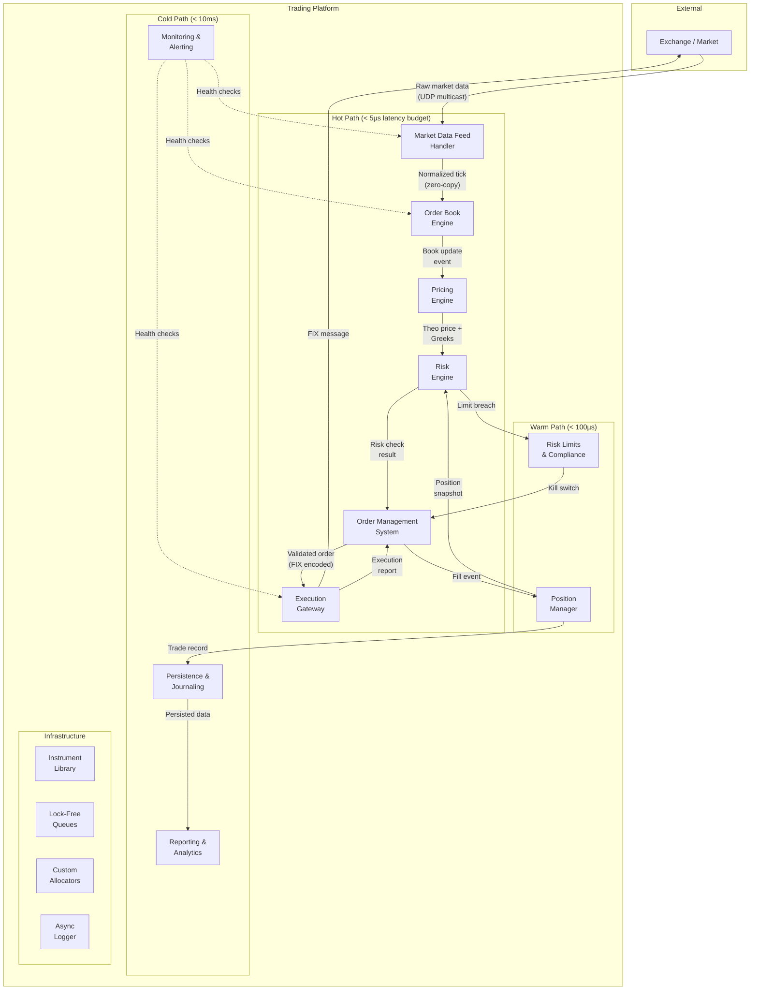
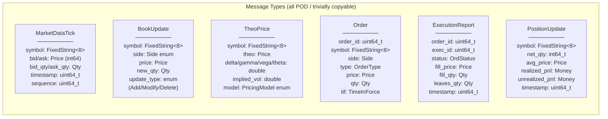
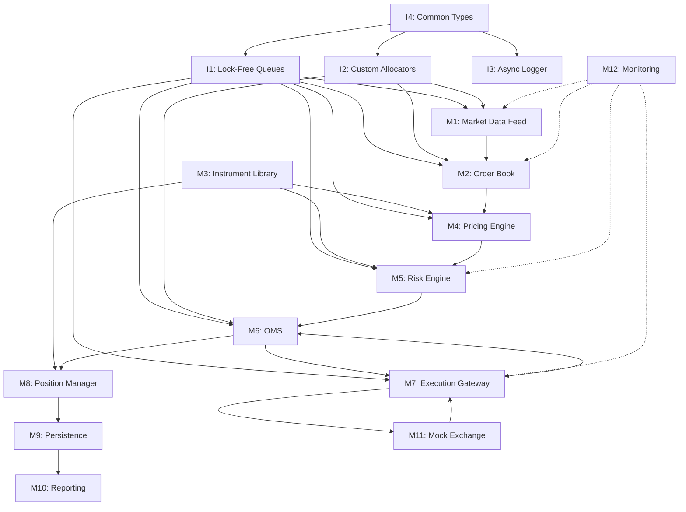

# Investment Banking Trading Platform — Architecture Overview

> **Capstone Project C03** — The definitive architecture document for our electronic trading
> platform. Read this first. Everything else references back to here.

---

## Table of Contents

1. [Project Introduction](#1-project-introduction)
2. [Investment Banking Domain Primer](#2-investment-banking-domain-primer)
3. [System Architecture](#3-system-architecture)
4. [Design Principles](#4-design-principles)
5. [C++ Concepts Coverage Map](#5-c-concepts-coverage-map)
6. [Module Map](#6-module-map)
7. [Performance Targets](#7-performance-targets)
8. [How to Read This Project](#8-how-to-read-this-project)
9. [Building and Running](#9-building-and-running)

---

## 1. Project Introduction

### What We Are Building

A **complete electronic trading platform** that covers the full lifecycle of a trade:

```
Market Data Ingestion → Price Discovery → Risk Assessment → Order Execution → Reporting
```

This is not a toy. We build every component that a real trading desk relies on — a market
data feed handler that parses millions of messages per second, an order book that updates
in under 500 nanoseconds, a pricing engine that computes fair value across instrument
classes, a risk engine that monitors Greeks and Value-at-Risk in real time, an order
management system that enforces limits before every trade, an execution gateway that speaks
FIX protocol, and a persistence layer that journals every event for regulatory compliance.

Every component is written in modern C++ (C++20/23). No third-party trading libraries.
No black-box frameworks. Every line of code is ours and every design decision is explained.

### Why Investment Banking

Investment banking systems are the **ultimate stress-test** for C++:

| Challenge | Why It Matters for Learning |
|---|---|
| **Nanosecond latency** | Forces you to understand memory layout, cache lines, branch prediction, and lock-free programming at the hardware level |
| **Correctness under load** | A single bug can lose millions — teaches defensive programming, RAII, strong types, and compile-time validation |
| **Massive throughput** | 1M+ messages/sec means you must master move semantics, zero-copy techniques, and efficient container design |
| **24/7 reliability** | No restarts allowed — teaches resource management, graceful degradation, and exception safety |
| **Regulatory requirements** | Every trade must be auditable — teaches logging, serialization, and data integrity |
| **Heterogeneous instruments** | Stocks, bonds, FX, derivatives — a natural fit for templates, CRTP, concepts, and polymorphism |

If you can build a trading platform in C++, you can build *anything* in C++.

### Project Scope

We target **production-quality architecture** while remaining focused on C++ mastery:

- **In scope**: Core trading infrastructure, realistic data structures, correct algorithms,
  production threading models, real FIX protocol parsing, mock exchange simulation.
- **Out of scope**: Actual exchange connectivity, regulatory reporting formats (e.g., MiFID II
  XML), GUI front-end, database integration (we use memory-mapped files instead).
- **Learning focus**: Every module is designed to exercise specific C++ concepts from Parts 1–5
  of the course. The concept coverage map in §5 shows exactly which chapter maps to which
  module.

### Prerequisites

You should have completed **Parts 1–5** of the C++ course before starting this project:

| Part | Chapters | Key Skills |
|------|----------|------------|
| Part 1: Foundations | Ch01–Ch09 | Variables, control flow, functions, arrays, pointers, references |
| Part 2: Intermediate | Ch10–Ch19 | OOP, inheritance, operator overloading, smart pointers, STL containers |
| Part 3: Advanced | Ch20–Ch29 | Move semantics, templates, CRTP, concepts, concurrency, lock-free |
| Part 4: Modern Evolution | Ch30–Ch37 | C++20 modules, ranges, coroutines, pattern matching, reflection |
| Part 5: Systems Programming | Ch38–Ch43 | Memory-mapped I/O, networking, SIMD, profiling, custom allocators |

---

## 2. Investment Banking Domain Primer

> This section teaches you enough finance to understand every design decision in the
> platform. No prior finance knowledge assumed.

### 2.1 What Is a Trading Platform?

A trading platform is software that sits between **traders** (humans or algorithms) and
**exchanges** (NASDAQ, NYSE, CME, LSE). Its job:

1. **Receive market data** — a continuous stream of price updates from exchanges.
2. **Maintain order books** — organized views of who wants to buy/sell, at what price.
3. **Compute fair value** — pricing models that tell traders whether something is cheap or
   expensive.
4. **Manage risk** — ensure the firm does not take on more risk than it can handle.
5. **Execute trades** — send orders to exchanges, receive confirmations.
6. **Report** — record everything for the firm, regulators, and clients.

Think of it as a **pipeline**: raw data flows in on the left, decisions happen in the
middle, and orders flow out on the right.

### 2.2 Order Types

When a trader wants to buy or sell, they submit an **order**. Different order types give
different instructions to the exchange:

| Order Type | Meaning | Example |
|------------|---------|---------|
| **Market** | Buy/sell immediately at the best available price | "Buy 100 shares of AAPL at whatever the current price is" |
| **Limit** | Buy/sell only at a specified price or better | "Buy 100 AAPL only if the price is $150 or lower" |
| **Stop** | Becomes a market order when a trigger price is hit | "If AAPL drops to $140, sell my 100 shares" |
| **IOC** (Immediate-or-Cancel) | Fill whatever you can immediately, cancel the rest | "Buy up to 100 AAPL right now — don't wait" |
| **FOK** (Fill-or-Kill) | Fill the entire order immediately, or cancel it all | "Buy exactly 100 AAPL right now — all or nothing" |

In our platform, orders are represented as a `struct Order` with a `Type` enum and
associated parameters. The Order Management System validates every field before forwarding
to the Execution Gateway.

### 2.3 Instruments

An **instrument** is anything you can trade. Our platform supports four classes:

**Equities (Stocks)**
- Ownership shares in a company. Ticker symbols like AAPL, GOOGL, MSFT.
- Simplest instrument — price is just what someone will pay for it.
- In our code: `Equity` class with `ticker`, `price`, `volume`, `market_cap`.

**Fixed Income (Bonds)**
- Loans to governments or corporations. The issuer pays interest (coupon) and returns
  principal at maturity.
- Priced using yield curves and discount factors — more math than equities.
- In our code: `Bond` class with `coupon_rate`, `maturity_date`, `yield_to_maturity`,
  `face_value`.

**FX (Foreign Exchange)**
- Currency pairs like EUR/USD, GBP/JPY. Always traded in pairs because you are
  simultaneously buying one currency and selling another.
- Quoted as "1 EUR = 1.0850 USD". The first currency is the "base", the second is the
  "quote".
- In our code: `FXPair` class with `base_currency`, `quote_currency`, `bid`, `ask`,
  `pip_size`.

**Derivatives (Options and Futures)**
- Contracts whose value derives from an underlying instrument.
- **Options**: The *right* (not obligation) to buy (call) or sell (put) at a fixed price
  (strike) by a fixed date (expiry). Priced using the Black-Scholes model.
- **Futures**: An *obligation* to buy/sell at a fixed price on a fixed date. Priced via
  cost-of-carry models.
- In our code: `Option` class and `Future` class, inheriting from a `Derivative` base.

The instrument hierarchy is one of the richest uses of C++ OOP in this project — see
the Instrument Library module (§6, Module 3) for the full class design.

### 2.4 The Trade Lifecycle

Every trade follows this lifecycle, from intention to settlement:

```
┌─────────┐    ┌─────────┐    ┌──────┐    ┌──────────┐    ┌────────────┐
│  Quote  │───▶│  Order  │───▶│ Fill │───▶│ Position │───▶│ Settlement │
└─────────┘    └─────────┘    └──────┘    └──────────┘    └────────────┘
```

1. **Quote**: The trader sees a price (bid/ask) on their screen. The market data feed
   provides this continuously.
2. **Order**: The trader decides to trade and submits an order (e.g., "buy 100 AAPL at
   $150 limit"). The OMS validates and risk-checks it.
3. **Fill**: The exchange matches the order with a counterparty. We receive a fill
   confirmation (price, quantity, timestamp).
4. **Position**: The fill updates our position — we now own 100 shares of AAPL. The
   Position Manager tracks all positions and computes PnL.
5. **Settlement**: After T+1 or T+2 days (depending on the instrument), the actual
   transfer of cash and securities happens. Our platform records the settlement date
   but does not handle the actual transfer.

### 2.5 Market Data

Market data is the **continuous stream of price information** from exchanges. Two levels:

**Level 1 — Top of Book (Best Bid/Ask)**
```
AAPL | Bid: 150.25 × 300 | Ask: 150.27 × 500 | Last: 150.26 | Volume: 12,345,678
```
- **Bid**: The highest price someone is willing to pay (and the quantity available).
- **Ask** (or Offer): The lowest price someone is willing to sell at.
- **Spread**: Ask minus Bid. Tighter spreads = more liquid markets.
- **Last**: The price of the most recent trade.

**Level 2 — Full Order Book Depth**
```
         Bids                    Asks
  Qty    Price     |     Price    Qty
  300    150.25    |     150.27   500
  200    150.24    |     150.28   150
  450    150.23    |     150.30   800
  100    150.22    |     150.31   200
```

Level 2 shows *all* the resting orders at each price level, not just the best. This is
what our Order Book module maintains — a sorted data structure of every bid and ask,
updated in real time as new orders arrive, existing orders are cancelled, and trades occur.

Our platform processes **both levels**. The Market Data Feed handler parses raw exchange
messages, the Order Book stores them, and downstream components consume a normalized view.

### 2.6 Risk Management

Risk management answers one question: **"How much can we lose?"**

**The Greeks** (for options and portfolios containing options):

| Greek | What It Measures | Intuition |
|-------|-----------------|-----------|
| **Delta (Δ)** | Price sensitivity to underlying | "If AAPL moves $1, my option moves $Δ" |
| **Gamma (Γ)** | Rate of change of Delta | "How quickly does my Delta change?" (curvature) |
| **Vega (ν)** | Sensitivity to volatility | "If implied vol moves 1%, my option moves $ν" |
| **Theta (Θ)** | Time decay per day | "My option loses $Θ every day just from time passing" |
| **Rho (ρ)** | Sensitivity to interest rates | "If rates move 1%, my option moves $ρ" |

**Value-at-Risk (VaR)**: "With 99% confidence, what is the maximum we can lose in one
day?" Computed using historical simulation, parametric (variance-covariance), or Monte
Carlo methods. Our Risk Engine implements the parametric method with configurable
confidence intervals.

**PnL (Profit and Loss)**: The running total of how much money we are making or losing.
- **Realized PnL**: Profit from trades that have been closed.
- **Unrealized PnL**: Profit on positions we still hold (paper profit/loss).
- **Total PnL** = Realized + Unrealized.

Our Risk Engine computes Greeks for every option position, aggregates risk across the
portfolio, checks VaR limits before every trade, and publishes PnL updates every tick.

### 2.7 FIX Protocol

**FIX** (Financial Information eXchange) is the standard protocol for electronic trading.
Nearly every exchange and broker speaks FIX.

Format: `Tag=Value` pairs separated by the SOH character (ASCII 0x01):

```
8=FIX.4.4|9=148|35=D|49=SENDER|56=TARGET|34=12|52=20240115-09:30:00.123|
11=ORD-0042|21=1|55=AAPL|54=1|38=100|40=2|44=150.25|60=20240115-09:30:00.123|10=185|
```

Key tags:

| Tag | Name | Meaning |
|-----|------|---------|
| 8 | BeginString | Protocol version (FIX.4.4) |
| 35 | MsgType | Message type: D=NewOrder, 8=ExecutionReport, 0=Heartbeat |
| 49 | SenderCompID | Who sent this message |
| 56 | TargetCompID | Who should receive it |
| 55 | Symbol | Instrument ticker |
| 54 | Side | 1=Buy, 2=Sell |
| 38 | OrderQty | Quantity |
| 40 | OrdType | 1=Market, 2=Limit |
| 44 | Price | Limit price |

Our Execution Gateway module implements a FIX 4.4 encoder/decoder using zero-copy parsing
techniques (no `std::string` allocations — just `std::string_view` over the raw buffer).

### 2.8 Why Latency Matters

In high-frequency trading (HFT), speed is profit:

```
                         Latency Budget: 5 microseconds (5,000 ns)
  ┌────────────────────────────────────────────────────────────────┐
  │  Network recv │ Parse │ Book │ Price │ Risk │ OMS │ FIX │ Send│
  │    ~500ns     │ 300ns │500ns │ 800ns │500ns │300ns│400ns│700ns│
  └────────────────────────────────────────────────────────────────┘
```

- **1 microsecond** of advantage over a competitor can mean **millions of dollars** per
  year in captured spread.
- A single `malloc()` call takes **~100ns** — that is 2% of our entire latency budget.
- A `std::mutex` lock/unlock cycle costs **~25ns each** — 1% of budget *per lock*.
- A virtual function call with a cache miss costs **~5-15ns**.
- A branch misprediction costs **~15-20ns**.

This is why our hot path (the code executed on every market data tick) uses **zero
allocations**, **lock-free queues**, **static polymorphism (CRTP)**, and
**branch-free algorithms** wherever possible.

---

## 3. System Architecture

### 3.1 High-Level Component Diagram



### 3.2 Data Flow — Message Types

Every arrow in the diagram above carries a specific, strongly-typed message. Here is the
complete catalog:



**Critical design decision**: All hot-path messages are **trivially copyable POD structs**
with fixed-size fields (no `std::string`, no heap pointers). This enables:
- Zero-copy transfer through lock-free queues (just `memcpy` the struct).
- Deterministic size for ring buffer slot allocation.
- Safe `reinterpret_cast` from raw network buffers (with endianness checks).
- `static_assert(std::is_trivially_copyable_v<MarketDataTick>)` enforced at compile time.

### 3.3 Thread Architecture

Our threading model is designed around **thread-per-component** with **lock-free SPSC
(Single-Producer Single-Consumer) queues** between them:

```mermaid
graph LR
    subgraph "Thread 0: Network I/O"
        T0[Market Data Feed<br/>Recv + Parse]
    end

    subgraph "Thread 1: Book + Pricing"
        T1[Order Book Update<br/>+ Pricing Engine]
    end

    subgraph "Thread 2: Risk"
        T2[Risk Engine<br/>+ Limit Checks]
    end

    subgraph "Thread 3: Order Management"
        T3[OMS + Order<br/>Validation]
    end

    subgraph "Thread 4: Execution"
        T4[FIX Encode/Decode<br/>+ Network Send]
    end

    subgraph "Thread 5: Position"
        T5[Position Manager<br/>+ PnL Calc]
    end

    subgraph "Thread 6: Persistence"
        T6[Journal Writer<br/>(async flush)]
    end

    subgraph "Thread 7: Monitoring"
        T7[Health Checks<br/>+ Metrics]
    end

    T0 -- "SPSC Queue<br/>MarketDataTick" --> T1
    T1 -- "SPSC Queue<br/>TheoPrice" --> T2
    T2 -- "SPSC Queue<br/>RiskResult" --> T3
    T3 -- "SPSC Queue<br/>ValidatedOrder" --> T4
    T4 -- "SPSC Queue<br/>ExecReport" --> T3
    T3 -- "SPSC Queue<br/>Fill" --> T5
    T5 -- "SPSC Queue<br/>TradeRecord" --> T6
```

**Why thread-per-component?**
- Each thread owns its data — no shared mutable state, no locks needed.
- SPSC queues between adjacent threads provide **wait-free** communication (both
  producer and consumer make progress in a bounded number of steps).
- Threads are **pinned to specific CPU cores** using `pthread_setaffinity_np` to
  eliminate context-switch jitter and keep caches warm.
- The hot-path threads (0–4) are isolated on their own cores; cold-path threads (5–7)
  can share cores.

**SPSC Ring Buffer Design**:
```cpp
template <typename T, std::size_t Capacity>
    requires std::is_trivially_copyable_v<T>
class SPSCQueue {
    alignas(64) std::atomic<std::size_t> head_{0};  // cache line 1: writer
    char pad1_[64 - sizeof(std::atomic<std::size_t>)];
    alignas(64) std::atomic<std::size_t> tail_{0};  // cache line 2: reader
    char pad2_[64 - sizeof(std::atomic<std::size_t>)];
    alignas(64) std::array<T, Capacity> buffer_;    // cache line 3+: data

public:
    bool try_push(const T& item) noexcept;  // wait-free
    bool try_pop(T& item) noexcept;         // wait-free
};
```

Key details:
- `head_` and `tail_` are on **separate cache lines** (64-byte aligned) to prevent
  false sharing between producer and consumer threads.
- `Capacity` must be a power of two so modular arithmetic uses a bitmask (`& (Capacity-1)`)
  instead of expensive division.
- The `requires` clause ensures only trivially copyable types are stored (no destructors
  to call, safe `memcpy`).

### 3.4 Memory Architecture

```
┌─────────────────────────────────────────────────────────────────────┐
│                        Process Address Space                        │
├──────────────────┬──────────────────┬───────────────────────────────┤
│  Arena Allocator │   Ring Buffers   │     Memory-Mapped Files       │
│  (Hot Path)      │   (IPC)          │     (Persistence)             │
│                  │                  │                               │
│  ┌────────────┐  │  ┌────────────┐  │  ┌─────────────────────────┐  │
│  │ Order Pool │  │  │ MDF → Book │  │  │ Trade Journal           │  │
│  │ 64K slots  │  │  │ 64K slots  │  │  │ (append-only mmap)      │  │
│  │ 128B each  │  │  │ 128B each  │  │  │                         │  │
│  ├────────────┤  │  ├────────────┤  │  ├─────────────────────────┤  │
│  │ Tick Pool  │  │  │ Book → PE  │  │  │ Position Snapshot       │  │
│  │ 256K slots │  │  │ 32K slots  │  │  │ (periodic mmap)         │  │
│  │ 96B each   │  │  │ 256B each  │  │  │                         │  │
│  ├────────────┤  │  ├────────────┤  │  ├─────────────────────────┤  │
│  │ Book Level │  │  │ PE → Risk  │  │  │ Market Data Replay      │  │
│  │ Pool       │  │  │ 32K slots  │  │  │ (read-only mmap)        │  │
│  │ 128K slots │  │  │ 192B each  │  │  │                         │  │
│  └────────────┘  │  └────────────┘  │  └─────────────────────────┘  │
│                  │                  │                               │
│  All allocated   │  All pre-alloc'd │   OS manages page faults;     │
│  at startup.     │  at startup.     │   we manage file layout.      │
│  Zero mallocs    │  Zero mallocs    │                               │
│  during trading. │  during trading. │                               │
└──────────────────┴──────────────────┴───────────────────────────────┘
```

**Arena Allocator** (also called a bump allocator):
- Pre-allocates a large contiguous block at startup (e.g., 8 MB for the Order pool).
- Allocation is a single pointer increment — `O(1)`, ~2 ns.
- Deallocation happens in bulk (reset the pointer) — no per-object `free()`.
- Used for objects that share a lifecycle (e.g., all orders within one trading session).

**Pool Allocator**:
- Pre-allocates N fixed-size slots.
- Maintains a free list (intrusive linked list — the free slot itself stores the next
  pointer, so zero overhead).
- Allocation = pop from free list. Deallocation = push to free list. Both `O(1)`.
- Used for objects with uniform size and unpredictable lifetimes (e.g., order book levels).

**Zero-Copy Principle**:
- Market data arrives in a network buffer. We parse it **in place** using
  `std::string_view` and offset arithmetic — no copies into `std::string`.
- Messages flow between components via the SPSC queues. The queues store the actual
  struct (not a pointer to it), so there is exactly one `memcpy` per hop.
- FIX messages are serialized directly into a pre-allocated send buffer — no intermediate
  string construction.

---

## 4. Design Principles

These six principles govern every design decision in the platform. Each is motivated by
a concrete performance or correctness requirement.

### 4.1 Zero-Allocation Hot Path

**Why**: A single `malloc()` call costs ~100 ns. Our total tick-to-trade latency budget
is 5,000 ns. If we allocate memory even 10 times per tick, that is 1,000 ns — 20% of our
budget — just for memory management.

Worse, `malloc` acquires a global lock internally. Under contention from multiple threads,
a single allocation can spike to **1,000+ ns** and completely blow the budget.

**How we achieve it**:
- **Arena allocators** for session-scoped objects (allocated at startup, reset at session
  end).
- **Pool allocators** for fixed-size objects with dynamic lifetimes (order book levels,
  active orders).
- **Pre-allocated ring buffers** for all inter-thread communication.
- **`FixedString<N>`** instead of `std::string` for symbols, client IDs, and other
  short strings. Stack-allocated, trivially copyable, no heap.
- **`static_assert`** in every hot-path data structure to verify `sizeof` at compile time
  and catch accidental heap usage.

```cpp
// Every hot-path struct enforces this at compile time:
struct MarketDataTick {
    FixedString<8> symbol;
    int64_t bid_price;
    int64_t ask_price;
    // ...
};
static_assert(std::is_trivially_copyable_v<MarketDataTick>,
    "MarketDataTick must be trivially copyable for zero-copy queues");
static_assert(sizeof(MarketDataTick) <= 128,
    "MarketDataTick must fit in a single ring buffer slot");
```

### 4.2 Lock-Free Communication

**Why**: A `std::mutex` lock/unlock pair costs ~50 ns (25 ns each). Under contention,
a thread may **spin or sleep for microseconds** waiting for the lock. In a trading system
with 8 threads touching shared data, mutexes create unpredictable latency spikes —
the enemy of consistent performance.

**How we achieve it**:
- **SPSC ring buffers** between every pair of communicating components. SPSC queues are
  the simplest lock-free structure — they require only `std::atomic` loads and stores
  with appropriate memory ordering, no CAS loops, no ABA problem.
- **Memory ordering**: We use `std::memory_order_release` on the writer side and
  `std::memory_order_acquire` on the reader side. This is the minimum ordering that
  guarantees the reader sees all data written before the index update.
- **No MPMC queues** on the hot path. If a component needs to publish to multiple
  consumers, it has a **dedicated SPSC queue for each consumer** (fan-out pattern).

```cpp
// Producer (writer thread):
bool try_push(const T& item) noexcept {
    const auto h = head_.load(std::memory_order_relaxed);
    const auto next = (h + 1) & (Capacity - 1);
    if (next == tail_.load(std::memory_order_acquire))
        return false;  // queue full
    buffer_[h] = item;
    head_.store(next, std::memory_order_release);
    return true;
}

// Consumer (reader thread):
bool try_pop(T& item) noexcept {
    const auto t = tail_.load(std::memory_order_relaxed);
    if (t == head_.load(std::memory_order_acquire))
        return false;  // queue empty
    item = buffer_[t];
    tail_.store((t + 1) & (Capacity - 1), std::memory_order_release);
    return true;
}
```

### 4.3 Static Polymorphism (CRTP)

**Why**: Our Pricing Engine must handle multiple instrument types (Equity, Bond, Option,
Future). The natural OOP approach is a virtual `price()` method:

```cpp
struct Instrument {
    virtual TheoPrice price(const MarketData& md) const = 0;  // ~5-15ns overhead
};
```

But a virtual call costs ~5 ns with a warm cache and up to **15 ns with a cold cache**
(because the CPU must dereference the vptr, load the vtable, dereference the function
pointer, and then branch to the actual function — four potential cache misses).

On the hot path, we call `price()` for every instrument on every tick. With 1,000
instruments, that is 5,000–15,000 ns of virtual dispatch overhead *per tick*.

**How we achieve it**:
The **Curiously Recurring Template Pattern (CRTP)** resolves the function call at
**compile time** — zero runtime overhead:

```cpp
template <typename Derived>
struct InstrumentBase {
    TheoPrice price(const MarketData& md) const {
        // Compile-time dispatch — no vtable lookup
        return static_cast<const Derived*>(this)->price_impl(md);
    }
};

struct Equity : InstrumentBase<Equity> {
    TheoPrice price_impl(const MarketData& md) const {
        // Simple: theo = mid price
        return TheoPrice{(md.bid + md.ask) / 2};
    }
};

struct Option : InstrumentBase<Option> {
    TheoPrice price_impl(const MarketData& md) const {
        // Black-Scholes model
        return black_scholes(md, strike_, expiry_, vol_);
    }
};
```

**Trade-off**: CRTP requires knowing the concrete type at compile time. For situations
where we genuinely need runtime polymorphism (e.g., iterating a heterogeneous portfolio
in the Position Manager — a cold-path operation), we use `std::variant` + `std::visit`
instead of virtual functions. The variant approach keeps data contiguous (no pointer
chasing) and the visitor is resolved via a jump table, which is typically faster than
virtual dispatch for small variant sets.

### 4.4 Value Semantics

**Why**: Pointer chasing — following a chain of pointers to reach data — is catastrophic
for cache performance. Every pointer dereference is a potential cache miss (~100 ns to
fetch from main memory). Modern CPUs are fast at *sequential* access (prefetcher can
predict it) but terrible at *random* access (each pointer goes to an unpredictable
location).

**How we achieve it**:
- **Store data contiguously**: Order book levels are stored in a `std::vector` (or a
  flat array in our pool allocator), not a `std::list` or `std::map` of pointers.
- **Pass small objects by value**: Our `Price` type is an `int64_t` wrapper (8 bytes) —
  passed by value, not by pointer. Our `FixedString<8>` is 8 bytes — passed by value.
- **Avoid `std::shared_ptr` on the hot path**: Shared pointers add atomic reference
  counting overhead (~10 ns per copy) and introduce shared mutable state. We use them
  only on the cold path (e.g., instrument definitions that outlive a single request).
- **Prefer aggregation over indirection**: A `Position` struct *contains* its fields
  inline, not as pointers to separately allocated objects.

```cpp
// BAD: Pointer chasing, scattered memory
struct Position {
    std::shared_ptr<Instrument> instrument;  // heap alloc + refcount
    std::unique_ptr<RiskMetrics> risk;       // another heap alloc
    std::string account;                     // yet another heap alloc
};

// GOOD: Contiguous, cache-friendly
struct Position {
    FixedString<8> symbol;           // inline, 8 bytes
    int64_t net_qty;                 // inline
    Price avg_price;                 // inline, 8 bytes
    Money realized_pnl;             // inline, 8 bytes
    Money unrealized_pnl;           // inline, 8 bytes
    InstrumentId instrument_id;     // index into a contiguous array
};
static_assert(sizeof(Position) <= 64, "Position must fit in one cache line");
```

### 4.5 Compile-Time Validation

**Why**: A bug caught at compile time costs 30 seconds of your time. A bug caught by a
unit test costs 30 minutes. A bug caught in production at 3 AM — during a volatile market
event — costs the firm millions and costs you your weekend.

**How we achieve it**:

- **C++20 Concepts** to constrain template parameters:
```cpp
template <typename T>
concept Priceable = requires(T t, const MarketData& md) {
    { t.price_impl(md) } -> std::same_as<TheoPrice>;
    { t.symbol() } -> std::convertible_to<std::string_view>;
    requires std::is_trivially_copyable_v<T>;
};
```

- **`constexpr` validation** for configuration:
```cpp
constexpr RiskLimits DEFAULT_LIMITS{
    .max_position_size = 10'000,
    .max_order_value = 1'000'000,
    .max_daily_loss = 500'000
};
static_assert(DEFAULT_LIMITS.max_order_value > 0, "Order value limit must be positive");
static_assert(DEFAULT_LIMITS.max_daily_loss < DEFAULT_LIMITS.max_order_value * 100,
    "Daily loss limit seems unreasonably high — verify");
```

- **`static_assert`** on data structure sizes and alignment:
```cpp
static_assert(sizeof(Order) == 128, "Order size changed — update ring buffer slot size");
static_assert(alignof(Order) == 8, "Order alignment changed — review cache strategy");
```

- **Strong types** to prevent unit confusion:
```cpp
// Without strong types: Is this price in dollars, cents, or basis points?
void submit_order(int64_t price, int64_t qty);  // easy to swap arguments

// With strong types: the compiler catches swapped arguments
void submit_order(Price price, Quantity qty);    // Price and Quantity are distinct types
```

### 4.6 RAII Everywhere

**Why**: A trading system cannot tolerate resource leaks. A leaked file descriptor
means we eventually cannot open new network connections. A leaked memory allocation
eventually causes an out-of-memory crash. A leaked lock means a deadlock. These failures
tend to happen at the worst possible moment — when the system is under peak load.

**How we achieve it**:
- **Smart pointers** for all heap allocations outside the arena (though we minimize heap
  usage on the hot path).
- **Scoped locks** (`std::scoped_lock`) for any mutex usage on the cold path.
- **Custom RAII wrappers** for OS resources:

```cpp
class Socket {
    int fd_ = -1;
public:
    explicit Socket(int domain, int type) : fd_(::socket(domain, type, 0)) {
        if (fd_ < 0) throw SystemError("socket creation failed", errno);
    }
    ~Socket() { if (fd_ >= 0) ::close(fd_); }

    Socket(Socket&& other) noexcept : fd_(std::exchange(other.fd_, -1)) {}
    Socket& operator=(Socket&& other) noexcept {
        if (this != &other) { if (fd_ >= 0) ::close(fd_); fd_ = std::exchange(other.fd_, -1); }
        return *this;
    }

    Socket(const Socket&) = delete;
    Socket& operator=(const Socket&) = delete;

    int get() const noexcept { return fd_; }
};
```

Every resource in the platform follows this pattern: acquire in constructor, release in
destructor, delete copy operations, implement move operations. No `close()` calls
scattered through business logic. No `finally` blocks. No cleanup code in `catch` blocks.

---

## 5. C++ Concepts Coverage Map

This table maps **every major C++ concept** from the course to its specific usage in the
trading platform. This is the pedagogical backbone of the project — every design decision
was made to exercise real C++ skills.

| C++ Concept | Course Chapter | Platform Module | Specific Usage |
|---|---|---|---|
| **Variables & types** | Ch01–Ch02 | All | Price (int64_t cents), Quantity (uint32_t), Side (enum) — strong type wrappers |
| **Control flow** | Ch03 | OMS | Order validation: nested `if/else` for limit checks, `switch` on OrderType |
| **Functions** | Ch04 | Pricing Engine | Pure functions for Black-Scholes, yield curve interpolation |
| **Arrays & C-strings** | Ch05 | Market Data Feed | `FixedString<N>` backed by `std::array<char, N>`, raw buffer parsing |
| **Pointers & references** | Ch06–Ch07 | Lock-Free Queues | Raw pointer arithmetic in ring buffer, reference semantics in API |
| **Operator overloading** | Ch13 | Instrument Library | `Price` arithmetic (`+`, `-`, `*`), comparison operators for order book sorting |
| **OOP & inheritance** | Ch10–Ch12 | Instrument Library | `Instrument` base → `Equity`, `Bond`, `Option`, `Future` hierarchy |
| **Encapsulation** | Ch10 | All | Private data members, public interfaces, friend declarations for serialization |
| **Composition** | Ch11 | Position Manager | `Position` contains `FixedString`, `Price`, `Money` value types |
| **Virtual functions** | Ch12 | Reporting (cold path) | `ReportGenerator` base with `HTMLReport`, `CSVReport`, `JSONReport` |
| **Smart pointers** | Ch16 | Infrastructure | `shared_ptr` for instrument definitions, `unique_ptr` for module ownership |
| **Move semantics** | Ch20 | Execution Gateway | Zero-copy order message passing via `std::move`, move-only `Socket` |
| **STL containers** | Ch14–Ch15 | Order Book | `std::vector` for price levels, `std::unordered_map` for order lookup |
| **Iterators** | Ch14 | Order Book | Custom iterator over price levels for top-of-book queries |
| **Algorithms** | Ch15 | Risk Engine | `std::transform` for Greek aggregation, `std::accumulate` for PnL |
| **Templates (basics)** | Ch21 | All | `SPSCQueue<T, N>`, `FixedString<N>`, `Pool<T, N>` |
| **Template specialization** | Ch22 | Pricing Engine | Specialized pricing for `Option` vs generic instruments |
| **CRTP** | Ch23 | Pricing Engine | `InstrumentBase<Derived>` for static dispatch of pricing models |
| **Concepts** | Ch24 | Risk Engine | `Priceable`, `Tradeable`, `Serializable` concept constraints |
| **Variadic templates** | Ch22 | Async Logger | `log(fmt, args...)` with compile-time format string validation |
| **Concurrency (threads)** | Ch25–Ch26 | All | Thread-per-component architecture, `std::jthread` for lifecycle |
| **Mutexes & condition vars** | Ch26 | Cold path only | `std::scoped_lock` for position snapshot, `condition_variable` for journal flush |
| **Atomics** | Ch27 | Lock-Free Queues | `std::atomic<size_t>` head/tail with acquire/release ordering |
| **Lock-free programming** | Ch27 | SPSC Queue | Wait-free SPSC ring buffer, sequence counters, false sharing prevention |
| **Memory ordering** | Ch27 | SPSC Queue | `memory_order_acquire`, `memory_order_release`, `memory_order_relaxed` |
| **C++20 Modules** | Ch30 | Project structure | Each platform component is a C++20 module (where compiler supports it) |
| **Ranges & views** | Ch31 | Risk Engine | `views::filter` for active positions, `views::transform` for Greek calc |
| **Coroutines** | Ch32 | Network I/O | `co_await` for async socket operations in the Execution Gateway |
| **`std::format`** | Ch33 | Reporting | Formatted output for trade reports and risk summaries |
| **`constexpr`** | Ch34 | Configuration | Compile-time risk limit validation, constant expression pricing params |
| **Structured bindings** | Ch20 | All | `auto [price, qty] = get_best_bid(book);` |
| **`std::variant`** | Ch20 | Position Manager | `std::variant<Equity, Bond, Option, Future>` for heterogeneous portfolios |
| **`std::optional`** | Ch20 | Order Book | `std::optional<PriceLevel>` for best bid/ask (empty book case) |
| **`std::string_view`** | Ch20 | FIX Parser | Zero-copy views into raw FIX message buffers |
| **SIMD intrinsics** | Ch41 | Market Data Feed | SSE4.2 `_mm_cmpeq_epi8` for delimiter scanning in FIX messages |
| **Memory-mapped I/O** | Ch38 | Persistence | `mmap` for trade journal and position snapshots |
| **Custom allocators** | Ch43 | Hot Path | Arena allocator, pool allocator, `std::pmr` integration |
| **Socket programming** | Ch39 | Network Layer | UDP multicast for market data, TCP for FIX execution |
| **Profiling & benchmarks** | Ch42 | All | `perf` integration, `std::chrono` micro-benchmarks, latency histograms |
| **Error handling** | Ch08 | All | `std::expected` for recoverable errors, exceptions only at startup |
| **Enums & enum classes** | Ch09 | All | `Side`, `OrderType`, `TimeInForce`, `OrdStatus` — scoped enums everywhere |
| **Lambda expressions** | Ch15 | Risk Engine | Callbacks for limit breach notifications, predicate filters |
| **`consteval` / `constinit`** | Ch34 | Configuration | `consteval` for compile-time config validation |
| **Bit manipulation** | Ch05 | SPSC Queue | Power-of-two masking: `index & (Capacity - 1)` |
| **Aggregate initialization** | Ch20 | All | Designated initializers for message structs |
| **Type traits** | Ch21 | Infrastructure | `is_trivially_copyable_v`, `is_standard_layout_v` in `static_assert` |
| **SFINAE / `if constexpr`** | Ch22 | Pricing Engine | Compile-time branch on instrument type for model selection |
| **Thread-local storage** | Ch26 | Async Logger | `thread_local` log buffer to avoid contention |
| **`std::span`** | Ch31 | Market Data Feed | Non-owning view over received network buffer |

---

## 6. Module Map

The platform is organized into **12 application modules** and **4 infrastructure modules**.
Each has a dedicated document with full implementation details.

### Application Modules

| # | Module | Document | Summary |
|---|--------|----------|---------|
| 1 | **Market Data Feed** | `01_Market_Data_Feed.md` | Receives raw market data over UDP multicast, parses it into normalized `MarketDataTick` structs using zero-copy techniques (SIMD + `string_view`), publishes to the Order Book via SPSC queue. Exercises: network programming, SIMD, `std::span`, custom parsing. |
| 2 | **Order Book Engine** | `02_Order_Book.md` | Maintains a sorted book of bids and asks for each symbol. Supports add/modify/delete operations in < 500 ns using a pool-allocated flat structure. Publishes book updates and best-bid/ask to the Pricing Engine. Exercises: STL containers, custom iterators, pool allocators. |
| 3 | **Instrument Library** | `03_Instrument_Library.md` | Defines the class hierarchy for all tradeable instruments: Equity, Bond, FXPair, Option, Future. Uses OOP for the reference data model and CRTP for the pricing interface. Exercises: inheritance, operator overloading, CRTP, concepts. |
| 4 | **Pricing Engine** | `04_Pricing_Engine.md` | Computes theoretical prices and Greeks for each instrument. Equity: mid-price. Bond: DCF with yield curve. Option: Black-Scholes. Uses CRTP for zero-overhead dispatch and `constexpr` for model parameters. Exercises: templates, CRTP, `constexpr`, math. |
| 5 | **Risk Engine** | `05_Risk_Engine.md` | Computes portfolio Greeks, VaR, and PnL in real time. Aggregates risk across all positions, checks pre-trade limits, fires kill-switch on breaches. Uses ranges and parallel algorithms. Exercises: concurrency, ranges, algorithms, lambdas. |
| 6 | **Order Management System** | `06_Order_Management.md` | Central order lifecycle manager. Validates orders (field checks, risk limits, position limits), assigns order IDs, tracks order state machine (New → PartialFill → Filled / Cancelled). Exercises: state machines, `std::variant`, error handling. |
| 7 | **Execution Gateway** | `07_Execution_Gateway.md` | Encodes orders into FIX protocol, sends over TCP to the exchange, receives execution reports, decodes them. Implements FIX 4.4 session management (logon, heartbeat, sequence numbers). Exercises: move semantics, socket programming, RAII, coroutines. |
| 8 | **Position Manager** | `08_Position_Manager.md` | Tracks all open positions, computes realized/unrealized PnL per position and for the portfolio. Handles position updates from fills, provides snapshots to the Risk Engine. Exercises: `std::variant`, composition, value semantics, smart pointers. |
| 9 | **Persistence & Journaling** | `09_Persistence.md` | Append-only trade journal using memory-mapped files. Provides crash recovery (replay journal on startup) and periodic position snapshots. Exercises: memory-mapped I/O, `mmap`, RAII file handles, serialization. |
| 10 | **Reporting & Analytics** | `10_Reporting.md` | Generates end-of-day reports: PnL summary, position report, trade blotter, risk summary. Multiple output formats via runtime polymorphism. Exercises: virtual functions, `std::format`, file I/O, algorithms. |
| 11 | **Mock Exchange** | `11_Mock_Exchange.md` | A simulated exchange that accepts FIX orders, matches them against a synthetic order book, and returns execution reports. Enables end-to-end testing without a real exchange. Exercises: networking, state machines, randomized testing. |
| 12 | **Monitoring & Alerting** | `12_Monitoring.md` | Health checks for all components (latency histograms, queue depths, error counters). Exposes metrics via a simple HTTP endpoint. Exercises: threading, `std::chrono`, formatted output, lambda callbacks. |

### Infrastructure Modules

| # | Module | Document | Summary |
|---|--------|----------|---------|
| I1 | **Lock-Free Queues** | `I1_Lock_Free_Queues.md` | SPSC ring buffer implementation with false-sharing prevention, memory ordering, and compile-time capacity validation. The backbone of all inter-component communication. |
| I2 | **Custom Allocators** | `I2_Custom_Allocators.md` | Arena allocator, pool allocator, and `std::pmr` integration. Used by hot-path components to achieve zero-allocation trading. |
| I3 | **Async Logger** | `I3_Async_Logger.md` | Lock-free logging with thread-local buffers, background flush thread, and compile-time log-level filtering. Variadic templates for type-safe formatting. |
| I4 | **Common Types** | `I4_Common_Types.md` | `Price`, `Quantity`, `Money`, `FixedString<N>`, `Side`, `OrderType`, `TimeInForce` — the strongly-typed vocabulary used across every module. |

### Cross-Module Dependencies



---

## 7. Performance Targets

### Latency Targets

| Metric | Target | p50 Goal | p99 Goal | How Achieved |
|--------|--------|----------|----------|--------------|
| **Tick-to-trade** (market data in → order out) | < 5 µs | 2.5 µs | 5.0 µs | Lock-free SPSC queues, zero-alloc hot path, CRTP dispatch, core pinning |
| **Market data parse** (raw bytes → normalized tick) | < 500 ns | 200 ns | 500 ns | SIMD delimiter scan, `string_view` parsing, pre-validated field offsets |
| **Order book update** (add/modify/delete one level) | < 500 ns | 200 ns | 500 ns | Pool allocator for levels, flat sorted vector, branch-free insert |
| **Pricing (equity)** | < 100 ns | 50 ns | 100 ns | Inline mid-price calc, no virtual dispatch (CRTP) |
| **Pricing (option, Black-Scholes)** | < 1 µs | 500 ns | 1 µs | Precomputed vol surface, CRTP dispatch, `constexpr` constants |
| **Risk check (single order)** | < 500 ns | 200 ns | 500 ns | Pre-aggregated portfolio Greeks, limit comparison is simple integer math |
| **FIX encode** | < 400 ns | 200 ns | 400 ns | Pre-allocated buffer, integer-to-string via lookup table, zero `std::string` |
| **FIX decode** | < 300 ns | 150 ns | 300 ns | Zero-copy `string_view` extraction, SIMD tag scanning |

### Throughput Targets

| Metric | Target | How Achieved |
|--------|--------|--------------|
| **Market data ingestion** | 1,000,000 msgs/sec | SIMD parsing, batch processing, ring buffer |
| **Order book updates** | 500,000 updates/sec | Pool allocator, cache-friendly layout |
| **Orders processed** | 100,000 orders/sec | Pre-validated fast path, lock-free queues |
| **Risk calculations** | 10,000 full-portfolio recalcs/sec | Incremental Greeks, parallel reduction |
| **Journal writes** | 200,000 records/sec | Memory-mapped append-only file, batched fsync |

### Resource Targets

| Resource | Budget | Rationale |
|----------|--------|-----------|
| **Memory (hot path)** | < 256 MB | Pre-allocated pools and arenas, no runtime growth |
| **Memory (total)** | < 1 GB | Including mmap'd journal files and position snapshots |
| **CPU cores (hot path)** | 5 dedicated | Threads 0–4 pinned, no sharing |
| **CPU cores (cold path)** | 3 shared | Threads 5–7 can share cores |
| **File descriptors** | < 50 | UDP market data + TCP FIX + journal files + monitoring |
| **Startup time** | < 2 seconds | Pre-allocate all memory, load instruments, open connections |

### How We Measure

```cpp
// Built-in latency measurement using rdtsc for nanosecond precision:
struct LatencyTracker {
    static constexpr size_t HISTOGRAM_BUCKETS = 1000;  // 1ns resolution up to 1µs
    std::array<uint64_t, HISTOGRAM_BUCKETS> histogram_{};
    uint64_t count_ = 0;
    uint64_t sum_ = 0;
    uint64_t max_ = 0;

    void record(uint64_t nanos) noexcept {
        ++count_;
        sum_ += nanos;
        max_ = std::max(max_, nanos);
        if (nanos < HISTOGRAM_BUCKETS)
            ++histogram_[nanos];
    }

    double p50() const noexcept;   // median
    double p99() const noexcept;   // 99th percentile
    double mean() const noexcept;  // average
};
```

Each component maintains its own `LatencyTracker`. The Monitoring module collects them
all and publishes a unified dashboard.

---

## 8. How to Read This Project

### Recommended Reading Order

This is a **large project** — 12 application modules, 4 infrastructure modules, and
thousands of lines of C++. Here is the recommended order, designed to build understanding
incrementally:

```
Phase 1: Understand the Foundation
  ├── 00_Architecture_Overview.md  ← YOU ARE HERE
  ├── I4_Common_Types.md           ← vocabulary types used everywhere
  └── I1_Lock_Free_Queues.md       ← communication backbone

Phase 2: The Instrument Model (OOP + Templates)
  ├── 03_Instrument_Library.md     ← class hierarchy, CRTP, concepts
  └── 04_Pricing_Engine.md         ← template specialization, constexpr math

Phase 3: Market Data Pipeline (Systems Programming)
  ├── 01_Market_Data_Feed.md       ← network I/O, SIMD, zero-copy parsing
  └── 02_Order_Book.md             ← STL containers, custom allocators, iterators

Phase 4: Risk & Execution (Concurrency)
  ├── 05_Risk_Engine.md            ← parallel algorithms, ranges, atomics
  ├── 06_Order_Management.md       ← state machines, variant, error handling
  └── 07_Execution_Gateway.md      ← FIX protocol, sockets, move semantics

Phase 5: Supporting Systems
  ├── 08_Position_Manager.md       ← composition, value semantics, PnL
  ├── 09_Persistence.md            ← mmap, journaling, crash recovery
  └── 10_Reporting.md              ← virtual functions, formatting, file I/O

Phase 6: Testing & Integration
  ├── 11_Mock_Exchange.md          ← end-to-end simulation
  ├── 12_Monitoring.md             ← observability, health checks
  ├── I2_Custom_Allocators.md      ← arena + pool allocator internals
  └── I3_Async_Logger.md           ← lock-free logging, variadic templates
```

### How Each Module Document Is Structured

Every module document follows the same template:

1. **Purpose**: What this module does and why it exists.
2. **C++ Concepts Exercised**: Which chapters this module covers.
3. **Architecture**: Where this module sits in the system, what it receives, what it
   produces.
4. **Data Structures**: Every struct, class, and enum with field-level documentation.
5. **Implementation**: The complete source code, explained section by section.
6. **Testing**: Unit tests, integration tests, and benchmark tests.
7. **Performance**: Latency and throughput measurements for this module.
8. **Exercises**: Challenges for the reader to extend the module.

### Navigating the Code

The C++ source files are organized to mirror the module structure:

```
C03_Investment_Banking_Platform/
├── 00_Architecture_Overview.md          ← this file
├── 01_Market_Data_Feed.md               ← module docs
├── 02_Order_Book.md
├── ...
├── src/
│   ├── CMakeLists.txt                   ← root build file
│   ├── common/                          ← I4: Common Types
│   │   ├── types.hpp                    ← Price, Qty, Side, OrderType, ...
│   │   ├── fixed_string.hpp             ← FixedString<N>
│   │   └── message_types.hpp            ← MarketDataTick, Order, ExecReport, ...
│   ├── infrastructure/
│   │   ├── spsc_queue.hpp               ← I1: Lock-Free SPSC Queue
│   │   ├── arena_allocator.hpp          ← I2: Arena Allocator
│   │   ├── pool_allocator.hpp           ← I2: Pool Allocator
│   │   └── async_logger.hpp             ← I3: Async Logger
│   ├── market_data/
│   │   ├── feed_handler.hpp / .cpp      ← M1: Market Data Feed
│   │   └── simd_parser.hpp              ← SIMD-optimized FIX parser
│   ├── order_book/
│   │   ├── order_book.hpp / .cpp        ← M2: Order Book Engine
│   │   └── price_level.hpp              ← Pool-allocated price level
│   ├── instruments/
│   │   ├── instrument_base.hpp          ← M3: CRTP base
│   │   ├── equity.hpp                   ← Equity instrument
│   │   ├── bond.hpp                     ← Bond instrument
│   │   ├── option.hpp                   ← Option (Black-Scholes)
│   │   └── future.hpp                   ← Futures contract
│   ├── pricing/
│   │   ├── pricing_engine.hpp / .cpp    ← M4: Pricing Engine
│   │   └── black_scholes.hpp            ← Black-Scholes implementation
│   ├── risk/
│   │   ├── risk_engine.hpp / .cpp       ← M5: Risk Engine
│   │   ├── greeks.hpp                   ← Greek calculations
│   │   └── var_calculator.hpp           ← Value-at-Risk
│   ├── oms/
│   │   ├── order_manager.hpp / .cpp     ← M6: Order Management System
│   │   └── order_validator.hpp          ← Pre-trade validation
│   ├── execution/
│   │   ├── execution_gateway.hpp / .cpp ← M7: Execution Gateway
│   │   ├── fix_encoder.hpp              ← FIX 4.4 message builder
│   │   └── fix_decoder.hpp              ← FIX 4.4 parser
│   ├── position/
│   │   ├── position_manager.hpp / .cpp  ← M8: Position Manager
│   │   └── pnl_calculator.hpp           ← PnL computation
│   ├── persistence/
│   │   ├── journal.hpp / .cpp           ← M9: Append-only journal
│   │   └── snapshot.hpp                 ← Position snapshots
│   ├── reporting/
│   │   ├── report_generator.hpp / .cpp  ← M10: Report generation
│   │   └── formatters.hpp               ← HTML, CSV, JSON formatters
│   ├── mock_exchange/
│   │   ├── mock_exchange.hpp / .cpp     ← M11: Simulated exchange
│   │   └── matching_engine.hpp          ← Simple price-time matching
│   ├── monitoring/
│   │   ├── monitor.hpp / .cpp           ← M12: Health & metrics
│   │   └── latency_tracker.hpp          ← Histogram-based latency tracking
│   └── main.cpp                         ← Platform entry point & wiring
├── tests/
│   ├── CMakeLists.txt
│   ├── test_spsc_queue.cpp
│   ├── test_order_book.cpp
│   ├── test_pricing.cpp
│   ├── test_risk.cpp
│   ├── test_fix_codec.cpp
│   ├── test_allocators.cpp
│   └── test_integration.cpp             ← End-to-end pipeline test
├── benchmarks/
│   ├── CMakeLists.txt
│   ├── bench_spsc_queue.cpp
│   ├── bench_order_book.cpp
│   ├── bench_pricing.cpp
│   └── bench_fix_codec.cpp
└── data/
    ├── sample_market_data.csv           ← Mock market data for testing
    ├── instruments.json                 ← Instrument reference data
    └── risk_limits.json                 ← Risk configuration
```

---

## 9. Building and Running

### Prerequisites

| Tool | Minimum Version | Purpose |
|------|----------------|---------|
| **C++ compiler** | GCC 12+ or Clang 15+ | C++20 support (concepts, ranges, coroutines) |
| **CMake** | 3.25+ | Build system |
| **Ninja** | 1.11+ | Fast parallel builds (optional, but recommended) |
| **Google Test** | 1.13+ | Unit testing framework |
| **Google Benchmark** | 1.8+ | Micro-benchmarking framework |

### Build Commands

```bash
# Clone and enter the project
cd C03_Investment_Banking_Platform/src

# Configure — Debug build (with sanitizers)
cmake -B build-debug -G Ninja \
    -DCMAKE_BUILD_TYPE=Debug \
    -DCMAKE_CXX_STANDARD=20 \
    -DENABLE_SANITIZERS=ON

# Configure — Release build (with optimizations)
cmake -B build-release -G Ninja \
    -DCMAKE_BUILD_TYPE=Release \
    -DCMAKE_CXX_STANDARD=20 \
    -DCMAKE_CXX_FLAGS="-O3 -march=native -DNDEBUG"

# Build
cmake --build build-debug      # debug build
cmake --build build-release    # optimized build

# Run tests
cd build-debug && ctest --output-on-failure

# Run benchmarks (always use release build!)
cd build-release && ./benchmarks/bench_spsc_queue
cd build-release && ./benchmarks/bench_order_book
```

### CMake Project Structure

```cmake
# Root CMakeLists.txt
cmake_minimum_required(VERSION 3.25)
project(InvestmentBankingPlatform LANGUAGES CXX)

set(CMAKE_CXX_STANDARD 20)
set(CMAKE_CXX_STANDARD_REQUIRED ON)
set(CMAKE_CXX_EXTENSIONS OFF)

# Compiler warnings — treat warnings as errors in CI
add_compile_options(-Wall -Wextra -Wpedantic -Werror)

# Optional sanitizers for debug builds
option(ENABLE_SANITIZERS "Enable ASan + UBSan" OFF)
if(ENABLE_SANITIZERS)
    add_compile_options(-fsanitize=address,undefined -fno-omit-frame-pointer)
    add_link_options(-fsanitize=address,undefined)
endif()

# Platform library (all modules compiled as a static library)
add_library(trading_platform STATIC
    common/types.cpp
    infrastructure/async_logger.cpp
    market_data/feed_handler.cpp
    order_book/order_book.cpp
    pricing/pricing_engine.cpp
    risk/risk_engine.cpp
    oms/order_manager.cpp
    execution/execution_gateway.cpp
    position/position_manager.cpp
    persistence/journal.cpp
    reporting/report_generator.cpp
    mock_exchange/mock_exchange.cpp
    monitoring/monitor.cpp
)
target_include_directories(trading_platform PUBLIC ${CMAKE_CURRENT_SOURCE_DIR})
target_link_libraries(trading_platform PRIVATE pthread)

# Main executable
add_executable(trading_main main.cpp)
target_link_libraries(trading_main PRIVATE trading_platform)

# Tests
add_subdirectory(../tests tests)

# Benchmarks
add_subdirectory(../benchmarks benchmarks)
```

### Running the Platform

```bash
# Run with mock market data (default mode)
./trading_main --mode=simulation --data=../data/sample_market_data.csv

# Run with mock exchange (full end-to-end)
./trading_main --mode=full \
    --instruments=../data/instruments.json \
    --risk-limits=../data/risk_limits.json \
    --log-level=INFO

# Run in replay mode (replay a recorded trading session)
./trading_main --mode=replay --journal=../data/trading_session_001.journal
```

**Expected output** (simulation mode):

```
[2024-01-15 09:30:00.001] [INFO] Trading Platform v1.0 starting...
[2024-01-15 09:30:00.010] [INFO] Loading 500 instruments from instruments.json
[2024-01-15 09:30:00.015] [INFO] Allocating memory pools...
[2024-01-15 09:30:00.020] [INFO]   Order pool:  64K slots × 128B = 8 MB
[2024-01-15 09:30:00.020] [INFO]   Tick pool:  256K slots ×  96B = 24 MB
[2024-01-15 09:30:00.020] [INFO]   Level pool: 128K slots ×  64B = 8 MB
[2024-01-15 09:30:00.025] [INFO] Starting component threads...
[2024-01-15 09:30:00.026] [INFO]   Thread 0: MarketDataFeed  → core 0
[2024-01-15 09:30:00.026] [INFO]   Thread 1: OrderBook+Price → core 1
[2024-01-15 09:30:00.026] [INFO]   Thread 2: RiskEngine      → core 2
[2024-01-15 09:30:00.027] [INFO]   Thread 3: OMS             → core 3
[2024-01-15 09:30:00.027] [INFO]   Thread 4: ExecGateway     → core 4
[2024-01-15 09:30:00.028] [INFO]   Thread 5: PositionMgr     → core 5 (shared)
[2024-01-15 09:30:00.028] [INFO]   Thread 6: Persistence     → core 6 (shared)
[2024-01-15 09:30:00.028] [INFO]   Thread 7: Monitoring      → core 7 (shared)
[2024-01-15 09:30:00.030] [INFO] All components ready. Processing market data...
[2024-01-15 09:30:01.000] [INFO] Stats: 1,042,857 ticks/sec | p50=2.1µs p99=4.7µs | 0 errors
[2024-01-15 09:30:02.000] [INFO] Stats: 1,038,461 ticks/sec | p50=2.2µs p99=4.9µs | 0 errors
```

### Troubleshooting

| Problem | Cause | Fix |
|---------|-------|-----|
| `concept` not recognized | Compiler too old | Use GCC 12+ or Clang 15+ |
| Latency > 10µs | Debug build with sanitizers | Run benchmarks on release build only |
| "Queue full" warnings | Consumer too slow | Increase queue capacity (power of 2) |
| Segfault in ring buffer | Capacity not power of 2 | `static_assert((Capacity & (Capacity-1)) == 0)` |
| Mock exchange not responding | Port conflict | Change port in `--exchange-port=` flag |

---

## Summary

This document is the **single source of truth** for the Investment Banking Trading Platform
architecture. Every component, every design decision, every data structure traces back to
a principle explained here.

The platform is purpose-built to exercise **every major C++ concept** from Parts 1–5 of
the course in a realistic, performance-critical context. It is not a toy — the
architecture, data structures, and threading model are drawn from real production trading
systems.

Start with this document. Understand the domain (§2), the architecture (§3), and the
design principles (§4). Then follow the reading order in §8 to work through each module.
By the time you complete all 12 modules, you will have written a complete trading system
and mastered modern C++.

---

> **Next**: Begin with [I4: Common Types](I4_Common_Types.md) to understand the vocabulary
> types, then [I1: Lock-Free Queues](I1_Lock_Free_Queues.md) for the communication backbone.
