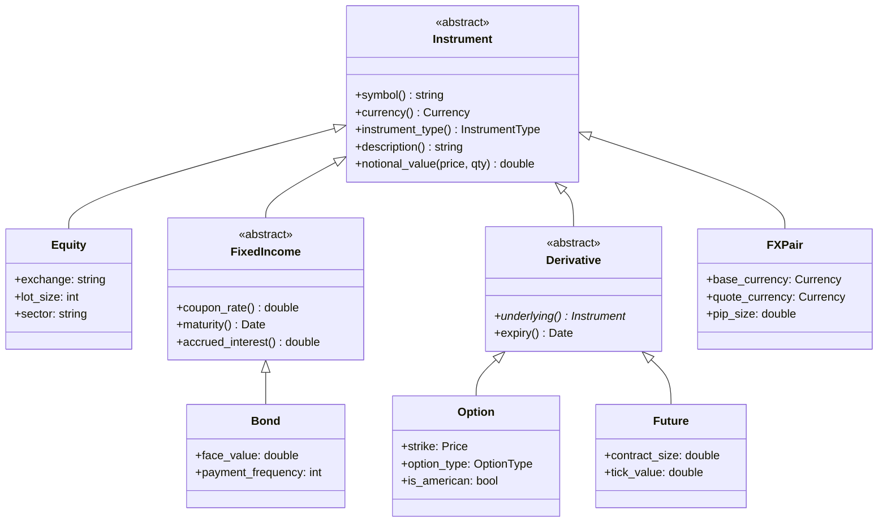

# Module 03 — Instrument Hierarchy

## 1. Module Overview

The Instrument Library defines **every type of financial instrument** the platform can
trade — equities, bonds, FX pairs, options, and futures. It provides a clean class
hierarchy with shared base behavior and type-specific properties, a factory for creating
instruments from configuration data, and safe downcasting when type-specific access is
needed.

This module does three things:

1. **Models** the instrument taxonomy using C++ inheritance: abstract base `Instrument`,
   with concrete types like `Equity`, `Bond`, `Option`, `Future`, and `FXPair`.
2. **Creates** instruments via a Factory pattern that returns `std::unique_ptr<Instrument>`,
   enabling polymorphic ownership without manual memory management.
3. **Serializes** instruments to/from a key-value format for persistence and network
   transmission.

**Why it exists:** A trading platform must reason about instruments generically (loop over
all positions) AND specifically (compute a bond's accrued interest, an option's strike
price). The OOP hierarchy gives us both. The factory decouples creation from usage — new
instrument types can be added without modifying client code.

---

## 2. Architecture Insight



**Position in the pipeline:** The Instrument Library is a reference data layer. The Order
Book (Module 02) uses it to validate tick sizes. The Pricing Engine (Module 04) uses it
to select the correct pricing model. Every module that handles trades needs to look up
instrument metadata.

---

## 3. IB Domain Context

| Role            | What they need from instruments                              |
|-----------------|--------------------------------------------------------------|
| **Trader**      | Symbol lookup, lot sizes, exchange info                      |
| **Quant**       | Option strike/expiry, bond coupon/maturity for pricing       |
| **Risk Mgr**    | Notional value calculation, currency for FX exposure         |
| **Ops/Settle**  | Settlement conventions, maturity dates, contract specs       |

**Instrument Types in IB:**

- **Equity:** Shares of stock. Simple — symbol, exchange, lot size.
- **Bond:** Fixed income. Complex — coupon rate, maturity, day-count conventions.
- **Option:** Right to buy/sell at a strike price. Needs underlying reference.
- **Future:** Obligation to buy/sell at a future date. Standardized contract size.
- **FX Pair:** Currency exchange rate. E.g., EUR/USD = 1.0850.

---

## 4. C++ Concepts Used

| Concept               | Usage in This Module                                  | Chapter |
|-----------------------|-------------------------------------------------------|---------|
| Abstract classes      | `Instrument` base with pure virtual methods           | Ch13-14 |
| Inheritance hierarchy | `Instrument → FixedIncome → Bond`, 2 levels deep     | Ch14    |
| Virtual functions     | `description()`, `notional_value()` dispatched at RT  | Ch14    |
| `override` / `final`  | Enforce correct overrides, prevent further derivation  | Ch14    |
| `std::unique_ptr`     | Factory returns owned pointers — no leaks             | Ch16    |
| `std::shared_ptr`     | Shared instrument references across modules           | Ch16    |
| Factory pattern       | `InstrumentFactory` creates by type string            | Ch28    |
| `enum class`          | `InstrumentType`, `Currency`, `OptionType`            | Ch10    |
| `dynamic_cast`        | Safe downcasting when type-specific access needed     | Ch14    |
| `std::variant`        | Alternative to hierarchy for closed type sets         | Ch36    |
| `std::format`         | Type-safe string formatting for descriptions          | Ch06    |

---

## 5. Design Decisions

### Decision 1: Inheritance Over `std::variant`

**Chosen:** Class hierarchy with virtual dispatch.
**Alternative:** `std::variant<Equity, Bond, Option, Future, FXPair>`.
**Why:** The hierarchy is open for extension — adding a new instrument type (e.g., `Swap`)
requires only a new class, not modifying the variant definition. `std::variant` is better
for closed sets (like `ParseResult = Success | Error`), but instrument types grow over
time. We show the variant alternative in comments for comparison.

### Decision 2: Two-Level Hierarchy

**Chosen:** `Instrument → FixedIncome → Bond` (intermediate abstract classes).
**Alternative:** Flat hierarchy — all types directly extend `Instrument`.
**Why:** `FixedIncome` captures shared behavior (coupon, maturity, accrued interest) that
applies to bonds, notes, bills, and mortgage-backed securities. Without it, every fixed
income type would duplicate this code. The intermediate level also enables
`dynamic_cast<FixedIncome*>` to handle all fixed income generically.

### Decision 3: Factory with Registration Map

**Chosen:** `InstrumentFactory` with a `std::unordered_map<string, CreatorFn>`.
**Alternative:** Giant `if-else` or `switch` in the factory.
**Why:** The registration pattern is open-closed — new types register themselves without
modifying the factory code. This is essential when types are defined in different
translation units or loaded from plugins.

### Decision 4: `unique_ptr` Factory Return

**Chosen:** Factory returns `std::unique_ptr<Instrument>`.
**Alternative:** Return raw `Instrument*` or `shared_ptr<Instrument>`.
**Why:** `unique_ptr` expresses single ownership clearly — the caller owns the instrument.
If shared ownership is needed later, `std::shared_ptr` can be constructed from a
`unique_ptr` via `std::move`. Starting with `unique_ptr` is the minimum-commitment choice.

---

## 6. Complete Implementation

```cpp
// ============================================================================
// Module 03: Instrument Hierarchy
// Investment Banking Platform — CPP-CUDA-Mastery
//
// Compile: g++ -std=c++23 -O2 -Wall -Wextra -o instruments instruments.cpp
// ============================================================================

#include <cassert>
#include <cmath>
#include <format>
#include <functional>
#include <iostream>
#include <memory>
#include <string>
#include <unordered_map>
#include <utility>
#include <vector>

// ---------------------------------------------------------------------------
// Section 1: Domain Enumerations (Ch10 enum class)
//
// enum class prevents implicit conversions to int and provides
// namespace scoping: Currency::USD not just USD.
// ---------------------------------------------------------------------------

enum class InstrumentType : uint8_t {
    Equity,
    Bond,
    Option,
    Future,
    FXPair
};

enum class Currency : uint8_t {
    USD, EUR, GBP, JPY, CHF, CAD, AUD
};

enum class OptionType : uint8_t {
    Call,
    Put
};

// Helper: convert enums to strings for display and serialization
constexpr const char* to_string(InstrumentType t) {
    switch (t) {
        case InstrumentType::Equity: return "Equity";
        case InstrumentType::Bond:   return "Bond";
        case InstrumentType::Option: return "Option";
        case InstrumentType::Future: return "Future";
        case InstrumentType::FXPair: return "FXPair";
    }
    return "Unknown";
}

constexpr const char* to_string(Currency c) {
    switch (c) {
        case Currency::USD: return "USD";
        case Currency::EUR: return "EUR";
        case Currency::GBP: return "GBP";
        case Currency::JPY: return "JPY";
        case Currency::CHF: return "CHF";
        case Currency::CAD: return "CAD";
        case Currency::AUD: return "AUD";
    }
    return "???";
}

constexpr const char* to_string(OptionType ot) {
    switch (ot) {
        case OptionType::Call: return "Call";
        case OptionType::Put:  return "Put";
    }
    return "Unknown";
}

// ---------------------------------------------------------------------------
// Section 2: Simple Date type for maturity/expiry
// ---------------------------------------------------------------------------

struct Date {
    int year  = 2025;
    int month = 1;
    int day   = 1;

    auto operator<=>(const Date&) const = default;

    std::string to_string() const {
        return std::format("{:04d}-{:02d}-{:02d}", year, month, day);
    }
};

// ---------------------------------------------------------------------------
// Section 3: Instrument — Abstract Base Class (Ch13-14)
//
// This is the root of the hierarchy. Pure virtual functions (= 0) make it
// abstract — you cannot instantiate Instrument directly.
//
// Virtual destructor is ESSENTIAL: without it, deleting through a base
// pointer would skip derived destructors → resource leaks.
// ---------------------------------------------------------------------------

class Instrument {
public:
    Instrument(std::string symbol, Currency currency)
        : symbol_(std::move(symbol))
        , currency_(currency) {}

    // Virtual destructor — required for polymorphic deletion (Ch14)
    virtual ~Instrument() = default;

    // Disable copy to prevent slicing (Ch14 pitfall)
    Instrument(const Instrument&) = delete;
    Instrument& operator=(const Instrument&) = delete;

    // Enable move for factory return
    Instrument(Instrument&&) = default;
    Instrument& operator=(Instrument&&) = default;

    // Pure virtual methods — derived classes MUST implement
    [[nodiscard]] virtual InstrumentType instrument_type() const = 0;
    [[nodiscard]] virtual std::string description() const = 0;
    [[nodiscard]] virtual double notional_value(double price,
                                                 int64_t qty) const = 0;

    // Non-virtual accessors — shared by all instruments
    [[nodiscard]] const std::string& symbol() const { return symbol_; }
    [[nodiscard]] Currency currency() const { return currency_; }

    // Convenience: full display string
    [[nodiscard]] std::string display() const {
        return std::format("[{}] {} ({})", to_string(instrument_type()),
                           symbol_, to_string(currency_));
    }

protected:
    std::string symbol_;
    Currency    currency_;
};

// ---------------------------------------------------------------------------
// Section 4: Equity — simplest concrete instrument
//
// override keyword (Ch14) ensures we're actually overriding a base method.
// If the base signature changes, the compiler will catch the mismatch.
// ---------------------------------------------------------------------------

class Equity final : public Instrument {
public:
    Equity(std::string symbol, Currency currency,
           std::string exchange, int lot_size, std::string sector)
        : Instrument(std::move(symbol), currency)
        , exchange_(std::move(exchange))
        , lot_size_(lot_size)
        , sector_(std::move(sector)) {}

    [[nodiscard]] InstrumentType instrument_type() const override {
        return InstrumentType::Equity;
    }

    [[nodiscard]] std::string description() const override {
        return std::format("{} equity on {} (sector: {}, lot: {})",
                           symbol_, exchange_, sector_, lot_size_);
    }

    // Equity notional = price × quantity
    [[nodiscard]] double notional_value(double price,
                                         int64_t qty) const override {
        return price * static_cast<double>(qty);
    }

    // Equity-specific accessors
    [[nodiscard]] const std::string& exchange() const { return exchange_; }
    [[nodiscard]] int lot_size() const { return lot_size_; }
    [[nodiscard]] const std::string& sector() const { return sector_; }

private:
    std::string exchange_;
    int         lot_size_;
    std::string sector_;
};

// ---------------------------------------------------------------------------
// Section 5: FixedIncome — intermediate abstract class
//
// Captures shared behavior for all fixed income instruments:
// coupon rate, maturity date, and accrued interest calculation.
// ---------------------------------------------------------------------------

class FixedIncome : public Instrument {
public:
    FixedIncome(std::string symbol, Currency currency,
                double coupon_rate, Date maturity)
        : Instrument(std::move(symbol), currency)
        , coupon_rate_(coupon_rate)
        , maturity_(maturity) {}

    [[nodiscard]] double coupon_rate() const { return coupon_rate_; }
    [[nodiscard]] const Date& maturity() const { return maturity_; }

    // Simplified accrued interest — in production this uses day-count
    // conventions (30/360, ACT/365, etc.)
    [[nodiscard]] virtual double accrued_interest(
        double face_value, int days_since_coupon) const
    {
        return face_value * coupon_rate_ *
               static_cast<double>(days_since_coupon) / 365.0;
    }

protected:
    double coupon_rate_;
    Date   maturity_;
};

// ---------------------------------------------------------------------------
// Section 6: Bond — concrete fixed income instrument
//
// 'final' (Ch14) prevents further derivation — the compiler can
// devirtualize calls through Bond* pointers, eliminating vtable lookup.
// ---------------------------------------------------------------------------

class Bond final : public FixedIncome {
public:
    Bond(std::string symbol, Currency currency,
         double coupon_rate, Date maturity,
         double face_value, int payment_frequency)
        : FixedIncome(std::move(symbol), currency, coupon_rate, maturity)
        , face_value_(face_value)
        , payment_frequency_(payment_frequency) {}

    [[nodiscard]] InstrumentType instrument_type() const override {
        return InstrumentType::Bond;
    }

    [[nodiscard]] std::string description() const override {
        return std::format("{} bond, coupon={:.2f}%, maturity={}, "
                           "face={:.0f}, freq={}x/yr",
                           symbol_, coupon_rate_ * 100.0,
                           maturity_.to_string(),
                           face_value_, payment_frequency_);
    }

    // Bond notional = price (as %) × face_value × quantity
    [[nodiscard]] double notional_value(double price,
                                         int64_t qty) const override {
        return (price / 100.0) * face_value_ * static_cast<double>(qty);
    }

    [[nodiscard]] double face_value() const { return face_value_; }
    [[nodiscard]] int payment_frequency() const { return payment_frequency_; }

private:
    double face_value_;
    int    payment_frequency_;
};

// ---------------------------------------------------------------------------
// Section 7: Derivative — intermediate abstract class
//
// All derivatives have an underlying instrument and an expiry date.
// We store a non-owning pointer to the underlying — the Instrument Library
// owns the underlying, and the derivative observes it.
// ---------------------------------------------------------------------------

class Derivative : public Instrument {
public:
    Derivative(std::string symbol, Currency currency,
               const Instrument* underlying, Date expiry)
        : Instrument(std::move(symbol), currency)
        , underlying_(underlying)
        , expiry_(expiry) {}

    [[nodiscard]] const Instrument* underlying() const { return underlying_; }
    [[nodiscard]] const Date& expiry() const { return expiry_; }

protected:
    const Instrument* underlying_;   // Non-owning — library owns it
    Date              expiry_;
};

// ---------------------------------------------------------------------------
// Section 8: Option — concrete derivative
// ---------------------------------------------------------------------------

class Option final : public Derivative {
public:
    Option(std::string symbol, Currency currency,
           const Instrument* underlying, Date expiry,
           double strike, OptionType option_type, bool is_american)
        : Derivative(std::move(symbol), currency, underlying, expiry)
        , strike_(strike)
        , option_type_(option_type)
        , is_american_(is_american) {}

    [[nodiscard]] InstrumentType instrument_type() const override {
        return InstrumentType::Option;
    }

    [[nodiscard]] std::string description() const override {
        return std::format("{} {} {} option, strike={:.2f}, expiry={}, {}",
                           symbol_,
                           is_american_ ? "American" : "European",
                           to_string(option_type_),
                           strike_, expiry_.to_string(),
                           underlying_ ? underlying_->symbol() : "N/A");
    }

    // Option notional = underlying price × quantity × multiplier (typically 100)
    [[nodiscard]] double notional_value(double price,
                                         int64_t qty) const override {
        return price * static_cast<double>(qty) * 100.0;  // Standard multiplier
    }

    [[nodiscard]] double strike() const { return strike_; }
    [[nodiscard]] OptionType option_type() const { return option_type_; }
    [[nodiscard]] bool is_american() const { return is_american_; }

    // Intrinsic value: how much the option is "in the money"
    [[nodiscard]] double intrinsic_value(double spot_price) const {
        if (option_type_ == OptionType::Call) {
            return std::max(0.0, spot_price - strike_);
        }
        return std::max(0.0, strike_ - spot_price);
    }

private:
    double      strike_;
    OptionType  option_type_;
    bool        is_american_;
};

// ---------------------------------------------------------------------------
// Section 9: Future — concrete derivative
// ---------------------------------------------------------------------------

class Future final : public Derivative {
public:
    Future(std::string symbol, Currency currency,
           const Instrument* underlying, Date expiry,
           double contract_size, double tick_value)
        : Derivative(std::move(symbol), currency, underlying, expiry)
        , contract_size_(contract_size)
        , tick_value_(tick_value) {}

    [[nodiscard]] InstrumentType instrument_type() const override {
        return InstrumentType::Future;
    }

    [[nodiscard]] std::string description() const override {
        return std::format("{} future, size={:.0f}, tick_val={:.2f}, "
                           "expiry={}, underlying={}",
                           symbol_, contract_size_, tick_value_,
                           expiry_.to_string(),
                           underlying_ ? underlying_->symbol() : "N/A");
    }

    // Future notional = price × contract_size × quantity
    [[nodiscard]] double notional_value(double price,
                                         int64_t qty) const override {
        return price * contract_size_ * static_cast<double>(qty);
    }

    [[nodiscard]] double contract_size() const { return contract_size_; }
    [[nodiscard]] double tick_value() const { return tick_value_; }

private:
    double contract_size_;
    double tick_value_;
};

// ---------------------------------------------------------------------------
// Section 10: FXPair — currency pair (not part of the Derivative hierarchy)
// ---------------------------------------------------------------------------

class FXPair final : public Instrument {
public:
    FXPair(std::string symbol, Currency base, Currency quote,
           double pip_size)
        : Instrument(std::move(symbol), base)
        , quote_currency_(quote)
        , pip_size_(pip_size) {}

    [[nodiscard]] InstrumentType instrument_type() const override {
        return InstrumentType::FXPair;
    }

    [[nodiscard]] std::string description() const override {
        return std::format("{} FX pair ({}/{}), pip={:.5f}",
                           symbol_, to_string(currency_),
                           to_string(quote_currency_), pip_size_);
    }

    // FX notional = rate × quantity (in base currency units)
    [[nodiscard]] double notional_value(double rate,
                                         int64_t qty) const override {
        return rate * static_cast<double>(qty);
    }

    [[nodiscard]] Currency quote_currency() const { return quote_currency_; }
    [[nodiscard]] double pip_size() const { return pip_size_; }

private:
    Currency quote_currency_;
    double   pip_size_;
};

// ---------------------------------------------------------------------------
// Section 11: InstrumentFactory — Factory Pattern (Ch28)
//
// The factory uses a registration map: type names → creator functions.
// This is the Open-Closed Principle — new types register without modifying
// existing code. Returns std::unique_ptr for clear ownership (Ch16).
// ---------------------------------------------------------------------------

class InstrumentFactory {
public:
    // Creator function type: takes symbol + currency, returns unique_ptr
    using CreatorFn = std::function<
        std::unique_ptr<Instrument>(const std::string& symbol,
                                     Currency currency)>;

    // Register a type name → creator mapping
    void register_type(const std::string& type_name, CreatorFn creator) {
        creators_[type_name] = std::move(creator);
    }

    // Create an instrument by type name
    [[nodiscard]] std::unique_ptr<Instrument> create(
        const std::string& type_name,
        const std::string& symbol,
        Currency currency) const
    {
        auto it = creators_.find(type_name);
        if (it == creators_.end()) {
            return nullptr;  // Unknown type
        }
        return it->second(symbol, currency);
    }

    // Convenience: create with defaults pre-registered
    static InstrumentFactory create_default() {
        InstrumentFactory factory;

        factory.register_type("Equity",
            [](const std::string& sym, Currency ccy) {
                return std::make_unique<Equity>(
                    sym, ccy, "NYSE", 1, "Technology");
            });

        factory.register_type("Bond",
            [](const std::string& sym, Currency ccy) {
                return std::make_unique<Bond>(
                    sym, ccy, 0.05, Date{2030, 6, 15}, 1000.0, 2);
            });

        factory.register_type("FXPair",
            [](const std::string& sym, Currency ccy) {
                return std::make_unique<FXPair>(
                    sym, ccy, Currency::USD, 0.0001);
            });

        return factory;
    }

    [[nodiscard]] size_t registered_types() const {
        return creators_.size();
    }

private:
    std::unordered_map<std::string, CreatorFn> creators_;
};

// ---------------------------------------------------------------------------
// Section 12: InstrumentLibrary — the registry that owns all instruments
//
// Uses shared_ptr because instruments are referenced by multiple modules
// (order book, pricing engine, risk system) simultaneously.
// ---------------------------------------------------------------------------

class InstrumentLibrary {
public:
    // Add an instrument to the library — takes ownership
    void add(std::unique_ptr<Instrument> inst) {
        auto symbol = inst->symbol();
        instruments_[symbol] = std::shared_ptr<Instrument>(std::move(inst));
    }

    // Look up by symbol — returns shared_ptr (shared ownership)
    [[nodiscard]] std::shared_ptr<Instrument> find(
        const std::string& symbol) const
    {
        auto it = instruments_.find(symbol);
        if (it != instruments_.end()) return it->second;
        return nullptr;
    }

    // Get all instruments of a specific type
    [[nodiscard]] std::vector<std::shared_ptr<Instrument>> by_type(
        InstrumentType type) const
    {
        std::vector<std::shared_ptr<Instrument>> result;
        for (auto& [sym, inst] : instruments_) {
            if (inst->instrument_type() == type) {
                result.push_back(inst);
            }
        }
        return result;
    }

    // Safe downcast utility (Ch14 dynamic_cast)
    template <typename T>
    [[nodiscard]] std::shared_ptr<T> find_as(const std::string& symbol) const {
        auto inst = find(symbol);
        if (!inst) return nullptr;
        // dynamic_cast for shared_ptr (Ch14) — returns null on failure
        return std::dynamic_pointer_cast<T>(inst);
    }

    [[nodiscard]] size_t size() const { return instruments_.size(); }

    // Iterate all instruments
    void for_each(std::function<void(const Instrument&)> fn) const {
        for (auto& [sym, inst] : instruments_) {
            fn(*inst);
        }
    }

private:
    std::unordered_map<std::string, std::shared_ptr<Instrument>> instruments_;
};
```

---

## 7. Code Walkthrough

### Virtual Dispatch — Why `virtual ~Instrument()` Matters

```cpp
virtual ~Instrument() = default;
```
**Here we declare a virtual destructor (Ch14)** because `Instrument` is a polymorphic
base class. When we do `unique_ptr<Instrument> p = make_unique<Bond>(...)`, the
`unique_ptr` will call `delete` on an `Instrument*`. Without `virtual`, this calls
`Instrument::~Instrument` only, leaking the `Bond`-specific members (`face_value_`, etc.).
With `virtual`, the destructor dispatches through the vtable to `Bond::~Bond`.

### `final` on Concrete Classes

```cpp
class Equity final : public Instrument { ... };
```
**Here we use `final` (Ch14)** to prevent further derivation from `Equity`. This has two
benefits: (1) It documents intent — `Equity` is complete, not meant to be extended.
(2) The compiler can devirtualize calls through `Equity*` pointers because no derived
class can override the virtuals.

### Factory Registration — Open-Closed Principle

```cpp
factory.register_type("Bond", [](const std::string& sym, Currency ccy) {
    return std::make_unique<Bond>(sym, ccy, 0.05, Date{2030,6,15}, 1000.0, 2);
});
```
**Here we use the factory pattern (Ch28)** with lambda creators. Each instrument type
registers a lambda that knows how to construct that type. Adding a new instrument type
(e.g., `Swap`) means calling `register_type("Swap", ...)` — no modification to the
factory class itself.

### `dynamic_pointer_cast` — Safe Downcasting

```cpp
return std::dynamic_pointer_cast<T>(inst);
```
**Here we use `dynamic_cast` via `dynamic_pointer_cast` (Ch14)** for safe downcasting.
Unlike `static_cast`, `dynamic_cast` checks the vtable at runtime and returns `nullptr`
if the cast is invalid. This costs ~5ns per call due to RTTI lookup, but safety is worth
it for non-hot-path code. On the hot path, we'd use the visitor pattern instead.

### Copy Deletion — Preventing Slicing

```cpp
Instrument(const Instrument&) = delete;
```
**Here we delete the copy constructor (Ch14)** to prevent object slicing. If you copy a
`Bond` into an `Instrument`, you lose all bond-specific data. Deleting copy makes this
a compile error instead of a silent bug. We keep move operations so `unique_ptr` can
be returned from factories.

---

## 8. Testing

```cpp
// ============================================================================
// Unit Tests — Instrument Hierarchy
// ============================================================================

void test_equity_creation() {
    Equity aapl("AAPL", Currency::USD, "NASDAQ", 1, "Technology");
    assert(aapl.symbol() == "AAPL");
    assert(aapl.currency() == Currency::USD);
    assert(aapl.instrument_type() == InstrumentType::Equity);
    assert(aapl.exchange() == "NASDAQ");
    assert(aapl.lot_size() == 1);
    assert(aapl.notional_value(185.50, 100) == 18550.0);
    std::cout << "[PASS] test_equity_creation\n";
}

void test_bond_creation() {
    Bond treasury("UST10Y", Currency::USD, 0.04, Date{2033, 11, 15},
                  1000.0, 2);
    assert(treasury.instrument_type() == InstrumentType::Bond);
    assert(treasury.coupon_rate() == 0.04);
    assert(treasury.face_value() == 1000.0);
    // Bond price quoted as percentage: 98.50% of face
    assert(treasury.notional_value(98.50, 10) == 9850.0);
    std::cout << "[PASS] test_bond_creation\n";
}

void test_option_creation() {
    Equity underlying("SPY", Currency::USD, "NYSE", 1, "ETF");
    Option call("SPY240315C450", Currency::USD, &underlying,
                Date{2024, 3, 15}, 450.0, OptionType::Call, false);

    assert(call.instrument_type() == InstrumentType::Option);
    assert(call.strike() == 450.0);
    assert(call.option_type() == OptionType::Call);
    assert(!call.is_american());
    assert(call.underlying()->symbol() == "SPY");

    // Intrinsic value: spot=460, strike=450 → call intrinsic = 10
    assert(call.intrinsic_value(460.0) == 10.0);
    // Out of money: spot=440 → intrinsic = 0
    assert(call.intrinsic_value(440.0) == 0.0);
    std::cout << "[PASS] test_option_creation\n";
}

void test_put_intrinsic() {
    Equity underlying("AAPL", Currency::USD, "NASDAQ", 1, "Tech");
    Option put("AAPL240315P180", Currency::USD, &underlying,
               Date{2024, 3, 15}, 180.0, OptionType::Put, true);

    // Put: strike=180, spot=170 → intrinsic = 10
    assert(put.intrinsic_value(170.0) == 10.0);
    assert(put.intrinsic_value(190.0) == 0.0);
    assert(put.is_american());
    std::cout << "[PASS] test_put_intrinsic\n";
}

void test_future_creation() {
    Equity underlying("ES", Currency::USD, "CME", 1, "Index");
    Future es("ESH24", Currency::USD, &underlying,
              Date{2024, 3, 15}, 50.0, 12.50);

    assert(es.instrument_type() == InstrumentType::Future);
    assert(es.contract_size() == 50.0);
    // Notional = price × contract_size × qty
    assert(es.notional_value(5000.0, 2) == 500000.0);
    std::cout << "[PASS] test_future_creation\n";
}

void test_fx_pair() {
    FXPair eurusd("EURUSD", Currency::EUR, Currency::USD, 0.0001);
    assert(eurusd.instrument_type() == InstrumentType::FXPair);
    assert(eurusd.quote_currency() == Currency::USD);
    assert(eurusd.pip_size() == 0.0001);
    std::cout << "[PASS] test_fx_pair\n";
}

void test_polymorphic_dispatch() {
    Equity aapl("AAPL", Currency::USD, "NASDAQ", 1, "Tech");
    Bond treasury("UST10Y", Currency::USD, 0.04, Date{2033, 11, 15},
                  1000.0, 2);

    // Handle through base pointer — virtual dispatch
    std::vector<const Instrument*> portfolio = {&aapl, &treasury};

    assert(portfolio[0]->instrument_type() == InstrumentType::Equity);
    assert(portfolio[1]->instrument_type() == InstrumentType::Bond);

    // description() dispatches to the correct override
    assert(!portfolio[0]->description().empty());
    assert(!portfolio[1]->description().empty());
    std::cout << "[PASS] test_polymorphic_dispatch\n";
}

void test_factory() {
    auto factory = InstrumentFactory::create_default();
    assert(factory.registered_types() == 3);

    auto equity = factory.create("Equity", "MSFT", Currency::USD);
    assert(equity != nullptr);
    assert(equity->instrument_type() == InstrumentType::Equity);

    auto bond = factory.create("Bond", "UST5Y", Currency::USD);
    assert(bond != nullptr);
    assert(bond->instrument_type() == InstrumentType::Bond);

    auto unknown = factory.create("CreditSwap", "CDS1", Currency::USD);
    assert(unknown == nullptr);  // Not registered
    std::cout << "[PASS] test_factory\n";
}

void test_instrument_library() {
    InstrumentLibrary lib;
    auto factory = InstrumentFactory::create_default();

    lib.add(factory.create("Equity", "AAPL", Currency::USD));
    lib.add(factory.create("Equity", "MSFT", Currency::USD));
    lib.add(factory.create("Bond", "UST10Y", Currency::USD));

    assert(lib.size() == 3);

    auto aapl = lib.find("AAPL");
    assert(aapl != nullptr);
    assert(aapl->symbol() == "AAPL");

    // Safe downcast
    auto equity = lib.find_as<Equity>("AAPL");
    assert(equity != nullptr);
    assert(equity->exchange() == "NYSE");

    // Wrong type downcast returns null
    auto bad_cast = lib.find_as<Bond>("AAPL");
    assert(bad_cast == nullptr);

    // Filter by type
    auto equities = lib.by_type(InstrumentType::Equity);
    assert(equities.size() == 2);
    std::cout << "[PASS] test_instrument_library\n";
}

void test_accrued_interest() {
    Bond bond("UST5Y", Currency::USD, 0.06, Date{2028, 6, 15}, 1000.0, 2);
    // 90 days since last coupon, 6% annual rate on $1000 face
    double accrued = bond.accrued_interest(1000.0, 90);
    double expected = 1000.0 * 0.06 * 90.0 / 365.0;
    assert(std::abs(accrued - expected) < 0.01);
    std::cout << "[PASS] test_accrued_interest\n";
}

int main() {
    test_equity_creation();
    test_bond_creation();
    test_option_creation();
    test_put_intrinsic();
    test_future_creation();
    test_fx_pair();
    test_polymorphic_dispatch();
    test_factory();
    test_instrument_library();
    test_accrued_interest();

    std::cout << "\n=== All Instrument Library tests passed ===\n";
    return 0;
}
```

---

## 9. Performance Analysis

### Virtual Dispatch Cost

| Dispatch Method        | Cost per call | Notes                                |
|------------------------|---------------|--------------------------------------|
| Virtual function call  | ~2-5 ns       | vtable lookup + indirect branch      |
| `final` class call     | ~1 ns         | Devirtualized by compiler            |
| `dynamic_cast`         | ~5-15 ns      | RTTI string comparison               |
| `static_cast`          | 0 ns          | Compile-time, no runtime check       |
| Visitor pattern        | ~2 ns         | Single virtual dispatch, no RTTI     |

### Memory Layout — vtable Diagram

```
Equity object in memory:
┌─────────────────────────┐
│ vtable_ptr (8 bytes)    │ → points to Equity's vtable
├─────────────────────────┤
│ symbol_ (std::string)   │ 32 bytes (SSO buffer)
│ currency_ (1 byte)      │
│ [padding]               │
├─────────────────────────┤
│ exchange_ (std::string) │ 32 bytes
│ lot_size_ (int)         │ 4 bytes
│ sector_ (std::string)   │ 32 bytes
└─────────────────────────┘
Total: ~120 bytes

Equity vtable:
┌─────────────────────────┐
│ ~Equity()               │
│ instrument_type()       │ → returns InstrumentType::Equity
│ description()           │ → builds equity-specific string
│ notional_value()        │ → price × quantity
└─────────────────────────┘
```

### Factory Performance

| Operation             | Cost    | Notes                           |
|-----------------------|---------|---------------------------------|
| `create("Equity",..)` | ~80 ns  | Hash lookup + `make_unique`     |
| `find("AAPL")`        | ~30 ns  | `unordered_map` lookup          |
| `find_as<Equity>(..)`| ~45 ns  | `find` + `dynamic_pointer_cast` |
| `by_type(Equity)`     | O(n)    | Linear scan, n = total instruments |

---

## 10. Key Takeaways

1. **Virtual destructors are mandatory for base classes:** Without them, `delete base_ptr`
   silently leaks derived resources. This is the #1 C++ OOP bug.

2. **`final` enables devirtualization:** Marking leaf classes `final` lets the compiler
   replace virtual calls with direct calls — a 2-5× speedup on dispatch.

3. **Delete copy constructors to prevent slicing:** Copying a `Bond` into an `Instrument`
   loses the bond data. Deleting copy makes this a compile error.

4. **`unique_ptr` for factory returns, `shared_ptr` for shared registries:** Start with
   `unique_ptr` (minimal commitment), upgrade to `shared_ptr` only when multiple owners
   are proven necessary.

5. **`dynamic_cast` is safe but expensive:** Use it for non-hot-path operations.
   For hot paths, prefer the visitor pattern or type-safe enums with `switch`.

---

## 11. Cross-References

| Topic                        | Link                                        |
|------------------------------|---------------------------------------------|
| Classes and OOP              | Part-02/Ch13 — Classes                      |
| Inheritance and virtuals     | Part-02/Ch14 — Inheritance                  |
| Operator overloading         | Part-02/Ch15 — Operator Overloading         |
| Smart pointers               | Part-03/Ch16 — Smart Pointers               |
| `enum class`                 | Part-02/Ch10 — Enumerations                 |
| Design patterns (Factory)    | Part-04/Ch28 — Design Patterns              |
| `std::format`                | Part-02/Ch06 — Strings                      |
| Market Data Feed (consumer)  | C03/01_Market_Data_Feed.md                  |
| Order Book (user of types)   | C03/02_Order_Book.md                        |
| Pricing Engine (model select)| C03/04_Pricing_Engine.md                    |
