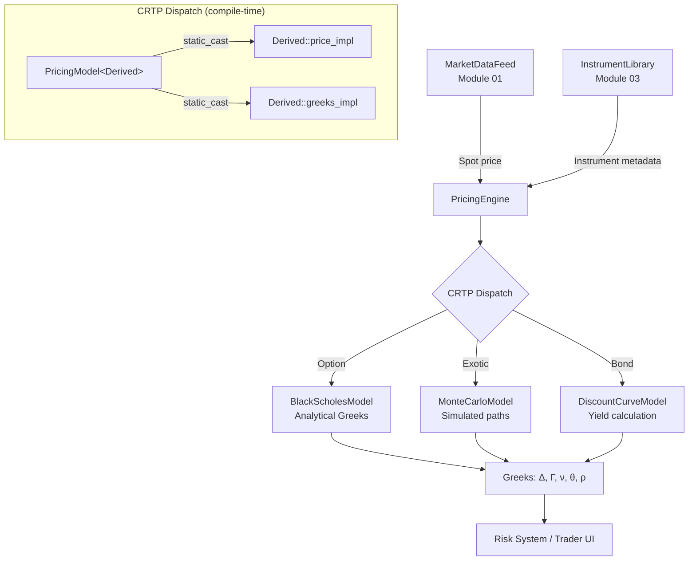

# Module 04 — Pricing Engine

## 1. Module Overview

The Pricing Engine calculates **theoretical prices and risk sensitivities (Greeks)** for
every instrument in the portfolio. It supports multiple pricing models — Black-Scholes
for vanilla options, Monte Carlo for exotics, and analytical formulas for bonds — and
dispatches to the correct model at compile time using C++ templates and CRTP.

This module does four things:

1. **Evaluates** theoretical prices for options, bonds, and other instruments.
2. **Computes** Greeks (delta, gamma, vega, theta, rho) — partial derivatives that measure
   how the price changes when market inputs change.
3. **Dispatches** to the correct pricing model at compile time via CRTP, eliminating
   virtual function overhead on the hot path.
4. **Supports** custom payoff functions via lambdas for exotic option pricing.

**Why it exists:** Traders need to know the theoretical value of every position in
real-time. When the market moves, thousands of options must be re-priced within
milliseconds. Virtual dispatch costs ~5ns per call; with 50,000 instruments × 6 Greeks
= 300,000 calls per market tick, CRTP's zero-overhead dispatch saves ~1.5ms — the
difference between being fast and being too slow.

---

## 2. Architecture Insight



**Position in the pipeline:** The Pricing Engine consumes market data (Module 01) and
instrument metadata (Module 03). It produces prices and Greeks that feed the risk system,
the trader's blotter, and automated hedging algorithms.

**Why CRTP over virtual?** Virtual dispatch goes through a vtable pointer → function
pointer → indirect branch. CRTP uses `static_cast<Derived*>(this)->price_impl()` which
the compiler resolves at compile time, inlining the entire call. The function body is
directly embedded at the call site.

---

## 3. IB Domain Context

| Role            | What they need from the pricing engine                       |
|-----------------|--------------------------------------------------------------|
| **Trader**      | Real-time theoretical value to identify mispricings          |
| **Quant**       | Greeks for hedging: delta-neutral, gamma-scalping            |
| **Risk Mgr**    | Portfolio-level Greeks aggregation for risk limits            |
| **Tech Lead**   | Sub-microsecond per-instrument pricing for 50K+ instruments  |

**Greeks Explained:**

| Greek   | Symbol | Measures                                          |
|---------|--------|---------------------------------------------------|
| Delta   | Δ      | Price change per $1 move in underlying             |
| Gamma   | Γ      | Rate of change of delta (curvature)                |
| Vega    | ν      | Price change per 1% move in volatility             |
| Theta   | θ      | Price decay per day (time value erosion)            |
| Rho     | ρ      | Price change per 1% move in interest rates         |

**Black-Scholes Formula:** The closed-form solution for European option pricing under
certain assumptions (log-normal returns, constant volatility, no dividends). Fast but
limited to vanilla options. For exotics, we need Monte Carlo simulation.

---

## 4. C++ Concepts Used

| Concept                | Usage in This Module                                   | Chapter |
|------------------------|--------------------------------------------------------|---------|
| CRTP                   | Static polymorphism for pricing dispatch — zero cost   | Ch23    |
| Templates              | `PricingModel<Derived>`, generic over model types      | Ch21    |
| Template specialization| Different default params per instrument type            | Ch21    |
| `constexpr`            | Compile-time math constants (π, √2π, etc.)             | Ch29    |
| Concepts (C++20)       | `Priceable` constrains what types can be priced        | Ch24    |
| Lambdas                | Custom payoff functions for exotic options              | Ch19    |
| `std::function`        | Stored payoff for Monte Carlo evaluation               | Ch19    |
| `auto` return type     | Template return type deduction                         | Ch34    |
| Structured bindings    | `auto [price, greeks] = model.evaluate(option)`        | Ch34    |
| `std::array`           | Fixed-size Greeks vector                               | Ch17    |
| `<cmath>` functions    | `std::exp`, `std::sqrt`, `std::log`, `std::erf`       | Stdlib  |

---

## 5. Design Decisions

### Decision 1: CRTP Over Virtual Dispatch

**Chosen:** `PricingModel<Derived>` base with `static_cast<Derived*>(this)` dispatch.
**Alternative:** `virtual double price(const Instrument&) = 0`.
**Why:** On the hot path (pricing loop), we call `price()` and `greeks()` for every
instrument on every market tick. Virtual dispatch adds ~5ns per call due to the indirect
branch and potential instruction cache miss. CRTP resolves at compile time — the compiler
inlines the derived implementation directly. At 300K calls/tick, this saves ~1.5ms.

The tradeoff: CRTP requires the model type to be known at compile time. We can't store
heterogeneous models in a single container. For runtime model selection, we provide a
thin virtual wrapper that delegates to the CRTP model.

### Decision 2: `constexpr` Math Constants

**Chosen:** `constexpr double PI = 3.14159265358979323846;` and derived constants.
**Alternative:** `#define PI 3.14159...` or `const double PI = ...`.
**Why:** `constexpr` is type-safe (unlike `#define`), evaluated at compile time (unlike
`const` which may defer to runtime), and can be used in other `constexpr` expressions.
The compiler can constant-fold entire subexpressions at compile time.

### Decision 3: Concepts for Type Constraints

**Chosen:** `concept Priceable` requiring `spot_price()`, `strike()`, `time_to_expiry()`.
**Alternative:** Unconstrained templates with SFINAE or no checking.
**Why:** Concepts produce clear error messages: "Type X does not satisfy Priceable because
it lacks member `strike()`". Without concepts, template errors are pages of incomprehensible
nested type failures. Concepts are documentation that the compiler enforces.

### Decision 4: Lambdas for Exotic Payoffs

**Chosen:** `std::function<double(double)>` payoff function for Monte Carlo.
**Alternative:** Inheritance hierarchy of Payoff classes.
**Why:** Exotic payoffs are diverse and often one-off: barrier options, Asian options,
lookback options. Creating a class for each is heavyweight. Lambdas let quants define
payoffs inline: `[K](double S) { return std::max(S - K, 0.0); }`.

---

## 6. Complete Implementation

```cpp
// ============================================================================
// Module 04: Pricing Engine
// Investment Banking Platform — CPP-CUDA-Mastery
//
// Compile: g++ -std=c++23 -O2 -Wall -Wextra -o pricing pricing.cpp
// ============================================================================

#include <array>
#include <cassert>
#include <cmath>
#include <format>
#include <functional>
#include <iostream>
#include <numeric>
#include <random>
#include <string>
#include <type_traits>
#include <utility>
#include <vector>

// ---------------------------------------------------------------------------
// Section 1: Compile-Time Math Constants (Ch29 constexpr)
//
// These are evaluated at compile time — the binary contains the final
// computed values, not the formulas. This eliminates runtime computation
// for frequently-used constants.
// ---------------------------------------------------------------------------

namespace math {
    constexpr double PI        = 3.14159265358979323846;
    constexpr double TWO_PI    = 2.0 * PI;
    constexpr double SQRT_2PI  = 2.50662827463100050242;  // √(2π)
    constexpr double INV_SQRT2 = 0.70710678118654752440;  // 1/√2
    constexpr double DAYS_PER_YEAR = 365.25;

    // Cumulative normal distribution Φ(x) using the error function.
    // Not constexpr because std::erf isn't constexpr in most implementations.
    inline double norm_cdf(double x) {
        return 0.5 * (1.0 + std::erf(x * INV_SQRT2));
    }

    // Standard normal PDF φ(x)
    inline double norm_pdf(double x) {
        return std::exp(-0.5 * x * x) / SQRT_2PI;
    }
}

// ---------------------------------------------------------------------------
// Section 2: Greeks — Risk Sensitivities
//
// A simple aggregate. All fields are initialized to 0.0.
// This is trivially copyable, no heap allocation.
// ---------------------------------------------------------------------------

struct Greeks {
    double delta = 0.0;   // ∂V/∂S  — sensitivity to underlying price
    double gamma = 0.0;   // ∂²V/∂S² — sensitivity of delta to underlying
    double vega  = 0.0;   // ∂V/∂σ  — sensitivity to volatility
    double theta = 0.0;   // ∂V/∂t  — time decay
    double rho   = 0.0;   // ∂V/∂r  — sensitivity to interest rate

    // Aggregate Greeks from multiple positions
    Greeks& operator+=(const Greeks& other) {
        delta += other.delta;
        gamma += other.gamma;
        vega  += other.vega;
        theta += other.theta;
        rho   += other.rho;
        return *this;
    }

    Greeks operator+(const Greeks& other) const {
        Greeks result = *this;
        result += other;
        return result;
    }

    // Scale by position size
    Greeks operator*(double scale) const {
        return {delta * scale, gamma * scale, vega * scale,
                theta * scale, rho * scale};
    }

    std::string to_string() const {
        return std::format("Δ={:.4f} Γ={:.6f} ν={:.4f} θ={:.4f} ρ={:.4f}",
                           delta, gamma, vega, theta, rho);
    }
};

// ---------------------------------------------------------------------------
// Section 3: PricingResult — combined price + Greeks output
// ---------------------------------------------------------------------------

struct PricingResult {
    double price  = 0.0;
    Greeks greeks;
    std::string model_name;

    std::string to_string() const {
        return std::format("Price={:.4f} [{}] {}", price, model_name,
                           greeks.to_string());
    }
};

// ---------------------------------------------------------------------------
// Section 4: OptionParams — input parameters for option pricing
//
// This is the data the pricing models need. It's a plain struct — no
// inheritance, no virtuals, just data. Passed by const reference.
// ---------------------------------------------------------------------------

struct OptionParams {
    double spot       = 0.0;   // Current underlying price
    double strike     = 0.0;   // Option strike price
    double rate       = 0.05;  // Risk-free interest rate
    double volatility = 0.20;  // Annualized volatility (σ)
    double time_to_expiry = 1.0; // Years until expiration
    bool   is_call    = true;  // Call or put
};

// ---------------------------------------------------------------------------
// Section 5: Priceable Concept (Ch24 C++20 Concepts)
//
// A concept is a named set of requirements on a type. Here we require
// that a "Priceable" type provides the fields needed for option pricing.
// If you try to price a type that doesn't meet these requirements,
// the compiler gives a clear error message referencing this concept.
// ---------------------------------------------------------------------------

template <typename T>
concept Priceable = requires(const T& t) {
    { t.spot }       -> std::convertible_to<double>;
    { t.strike }     -> std::convertible_to<double>;
    { t.rate }       -> std::convertible_to<double>;
    { t.volatility } -> std::convertible_to<double>;
    { t.time_to_expiry } -> std::convertible_to<double>;
    { t.is_call }    -> std::convertible_to<bool>;
};

// Verify OptionParams satisfies Priceable
static_assert(Priceable<OptionParams>,
              "OptionParams must satisfy Priceable concept");

// ---------------------------------------------------------------------------
// Section 6: PricingModel — CRTP Base (Ch23)
//
// CRTP = Curiously Recurring Template Pattern. The base class is
// parameterized on the derived class. This lets us call derived methods
// without virtual dispatch:
//
//   static_cast<Derived*>(this)->price_impl(params)
//
// The compiler knows the exact type at compile time, so it can inline
// the call — zero overhead compared to a direct function call.
// ---------------------------------------------------------------------------

template <typename Derived>
class PricingModel {
public:
    // Public interface: calls down to the derived implementation via CRTP.
    // The Priceable concept (Ch24) constrains the parameter type.
    template <Priceable Params>
    [[nodiscard]] double price(const Params& params) const {
        // static_cast to Derived* — the CRTP dispatch mechanism.
        // This is resolved at compile time. No vtable, no indirection.
        return static_cast<const Derived*>(this)->price_impl(params);
    }

    template <Priceable Params>
    [[nodiscard]] Greeks greeks(const Params& params) const {
        return static_cast<const Derived*>(this)->greeks_impl(params);
    }

    template <Priceable Params>
    [[nodiscard]] PricingResult evaluate(const Params& params) const {
        PricingResult result;
        result.price      = price(params);
        result.greeks     = greeks(params);
        result.model_name = static_cast<const Derived*>(this)->name();
        return result;
    }

    // Default model name — derived classes can override
    [[nodiscard]] std::string name() const { return "Unknown"; }
};

// ---------------------------------------------------------------------------
// Section 7: BlackScholesModel — Analytical Option Pricing
//
// Inherits from PricingModel<BlackScholesModel> — the CRTP pattern.
// Provides closed-form solutions for European option price and all Greeks.
//
// The Black-Scholes formula:
//   Call = S·Φ(d₁) - K·e^(-rT)·Φ(d₂)
//   Put  = K·e^(-rT)·Φ(-d₂) - S·Φ(-d₁)
// where:
//   d₁ = [ln(S/K) + (r + σ²/2)T] / (σ√T)
//   d₂ = d₁ - σ√T
// ---------------------------------------------------------------------------

class BlackScholesModel : public PricingModel<BlackScholesModel> {
public:
    [[nodiscard]] std::string name() const { return "Black-Scholes"; }

    // Price implementation — called via CRTP from base class
    template <Priceable Params>
    [[nodiscard]] double price_impl(const Params& p) const {
        auto [d1, d2] = compute_d1_d2(p);
        double discount = std::exp(-p.rate * p.time_to_expiry);

        if (p.is_call) {
            return p.spot * math::norm_cdf(d1)
                 - p.strike * discount * math::norm_cdf(d2);
        } else {
            return p.strike * discount * math::norm_cdf(-d2)
                 - p.spot * math::norm_cdf(-d1);
        }
    }

    // Full Greeks computation — all five sensitivities
    template <Priceable Params>
    [[nodiscard]] Greeks greeks_impl(const Params& p) const {
        auto [d1, d2] = compute_d1_d2(p);
        double sqrt_t   = std::sqrt(p.time_to_expiry);
        double discount  = std::exp(-p.rate * p.time_to_expiry);
        double pdf_d1    = math::norm_pdf(d1);
        double cdf_d1    = math::norm_cdf(d1);
        double cdf_d2    = math::norm_cdf(d2);
        double cdf_neg_d1 = math::norm_cdf(-d1);
        double cdf_neg_d2 = math::norm_cdf(-d2);

        Greeks g;

        // Delta: ∂V/∂S
        g.delta = p.is_call ? cdf_d1 : cdf_d1 - 1.0;

        // Gamma: ∂²V/∂S² — same for calls and puts
        g.gamma = pdf_d1 / (p.spot * p.volatility * sqrt_t);

        // Vega: ∂V/∂σ — same for calls and puts
        g.vega = p.spot * pdf_d1 * sqrt_t / 100.0;  // Per 1% vol move

        // Theta: ∂V/∂t — negative (time decay)
        double theta_common = -(p.spot * pdf_d1 * p.volatility)
                              / (2.0 * sqrt_t);
        if (p.is_call) {
            g.theta = (theta_common
                      - p.rate * p.strike * discount * cdf_d2)
                      / math::DAYS_PER_YEAR;  // Per day
        } else {
            g.theta = (theta_common
                      + p.rate * p.strike * discount * cdf_neg_d2)
                      / math::DAYS_PER_YEAR;
        }

        // Rho: ∂V/∂r
        if (p.is_call) {
            g.rho = p.strike * p.time_to_expiry * discount * cdf_d2 / 100.0;
        } else {
            g.rho = -p.strike * p.time_to_expiry * discount * cdf_neg_d2 / 100.0;
        }

        return g;
    }

private:
    // Compute d₁ and d₂ — used by both price and Greeks.
    // Returns as a pair for structured binding (Ch34).
    template <Priceable Params>
    [[nodiscard]] static std::pair<double, double> compute_d1_d2(
        const Params& p)
    {
        double sqrt_t = std::sqrt(p.time_to_expiry);
        double vol_sqrt_t = p.volatility * sqrt_t;

        double d1 = (std::log(p.spot / p.strike)
                     + (p.rate + 0.5 * p.volatility * p.volatility)
                       * p.time_to_expiry)
                    / vol_sqrt_t;
        double d2 = d1 - vol_sqrt_t;
        return {d1, d2};
    }
};

// ---------------------------------------------------------------------------
// Section 8: MonteCarloModel — Simulation-Based Pricing
//
// Also inherits from PricingModel<MonteCarloModel> via CRTP.
// Uses random walks to estimate option prices — works for exotic options
// where no closed-form solution exists.
//
// Payoff functions are passed as lambdas (Ch19) — any callable that takes
// a terminal stock price and returns the payoff.
// ---------------------------------------------------------------------------

class MonteCarloModel : public PricingModel<MonteCarloModel> {
public:
    explicit MonteCarloModel(int num_paths = 100000, uint64_t seed = 42)
        : num_paths_(num_paths)
        , rng_(seed) {}

    [[nodiscard]] std::string name() const { return "Monte-Carlo"; }

    // Price using geometric Brownian motion paths
    template <Priceable Params>
    [[nodiscard]] double price_impl(const Params& p) const {
        double drift = (p.rate - 0.5 * p.volatility * p.volatility)
                       * p.time_to_expiry;
        double vol_sqrt_t = p.volatility * std::sqrt(p.time_to_expiry);
        double discount = std::exp(-p.rate * p.time_to_expiry);

        // We create a mutable copy of rng_ because const method + mutable RNG
        std::mt19937_64 rng = rng_;
        std::normal_distribution<double> normal(0.0, 1.0);

        double sum_payoffs = 0.0;

        for (int i = 0; i < num_paths_; ++i) {
            double z = normal(rng);
            double S_T = p.spot * std::exp(drift + vol_sqrt_t * z);

            // Standard payoff based on call/put flag
            double payoff = p.is_call
                ? std::max(S_T - p.strike, 0.0)
                : std::max(p.strike - S_T, 0.0);

            sum_payoffs += payoff;
        }

        return discount * (sum_payoffs / num_paths_);
    }

    // Greeks via finite differences — bump-and-reprice
    template <Priceable Params>
    [[nodiscard]] Greeks greeks_impl(const Params& p) const {
        Greeks g;

        double base_price = price_impl(p);

        // Delta: bump spot by small amount
        {
            auto bumped = p;
            double dS = p.spot * 0.01;  // 1% bump
            bumped.spot = p.spot + dS;
            double up = price_impl(bumped);
            bumped.spot = p.spot - dS;
            double down = price_impl(bumped);
            g.delta = (up - down) / (2.0 * dS);
        }

        // Gamma: second derivative of price w.r.t. spot
        {
            auto bumped = p;
            double dS = p.spot * 0.01;
            bumped.spot = p.spot + dS;
            double up = price_impl(bumped);
            bumped.spot = p.spot - dS;
            double down = price_impl(bumped);
            g.gamma = (up - 2.0 * base_price + down) / (dS * dS);
        }

        // Vega: bump volatility
        {
            auto bumped = p;
            bumped.volatility = p.volatility + 0.01;
            double up = price_impl(bumped);
            g.vega = (up - base_price);  // Per 1% vol move
        }

        // Theta: bump time
        {
            auto bumped = p;
            double dt = 1.0 / math::DAYS_PER_YEAR;
            bumped.time_to_expiry = p.time_to_expiry - dt;
            if (bumped.time_to_expiry > 0) {
                double shifted = price_impl(bumped);
                g.theta = shifted - base_price;  // Per day
            }
        }

        // Rho: bump rate
        {
            auto bumped = p;
            bumped.rate = p.rate + 0.01;
            double up = price_impl(bumped);
            g.rho = (up - base_price);  // Per 1% rate move
        }

        return g;
    }

    // Custom payoff pricing for exotic options (Ch19 lambdas)
    [[nodiscard]] double price_with_payoff(
        const OptionParams& p,
        const std::function<double(double)>& payoff_fn) const
    {
        double drift = (p.rate - 0.5 * p.volatility * p.volatility)
                       * p.time_to_expiry;
        double vol_sqrt_t = p.volatility * std::sqrt(p.time_to_expiry);
        double discount = std::exp(-p.rate * p.time_to_expiry);

        std::mt19937_64 rng = rng_;
        std::normal_distribution<double> normal(0.0, 1.0);

        double sum = 0.0;
        for (int i = 0; i < num_paths_; ++i) {
            double z = normal(rng);
            double S_T = p.spot * std::exp(drift + vol_sqrt_t * z);
            sum += payoff_fn(S_T);    // User-supplied payoff lambda
        }

        return discount * (sum / num_paths_);
    }

private:
    int            num_paths_;
    std::mt19937_64 rng_;
};

// ---------------------------------------------------------------------------
// Section 9: Portfolio Pricer — evaluates multiple instruments
//
// Demonstrates template usage with CRTP models. The model type is
// a template parameter, so the compiler generates specialized code
// for each model type.
// ---------------------------------------------------------------------------

template <typename Model>
    requires std::is_base_of_v<PricingModel<Model>, Model>
class PortfolioPricer {
public:
    struct Position {
        std::string name;
        OptionParams params;
        double quantity;
    };

    explicit PortfolioPricer(Model model) : model_(std::move(model)) {}

    void add_position(std::string name, OptionParams params, double qty) {
        positions_.push_back({std::move(name), params, qty});
    }

    // Price all positions, return aggregate Greeks
    struct PortfolioResult {
        double total_value = 0.0;
        Greeks total_greeks;
        std::vector<std::pair<std::string, PricingResult>> details;
    };

    [[nodiscard]] PortfolioResult evaluate_all() const {
        PortfolioResult result;

        for (auto& pos : positions_) {
            auto pr = model_.evaluate(pos.params);

            result.total_value += pr.price * pos.quantity;
            result.total_greeks += pr.greeks * pos.quantity;
            result.details.emplace_back(pos.name, pr);
        }

        return result;
    }

private:
    Model model_;
    std::vector<Position> positions_;
};
```

---

## 7. Code Walkthrough

### CRTP Dispatch — The Core Pattern

```cpp
template <typename Derived>
class PricingModel {
    template <Priceable Params>
    double price(const Params& params) const {
        return static_cast<const Derived*>(this)->price_impl(params);
    }
};
```
**Here we use CRTP (Ch23)** — the base class `PricingModel` is parameterized on `Derived`
(e.g., `BlackScholesModel`). When the compiler sees
`static_cast<const BlackScholesModel*>(this)->price_impl(params)`, it knows the exact
function to call at compile time. It inlines `BlackScholesModel::price_impl` directly at
the call site — zero overhead. Compare this to virtual dispatch where
`this->vtable[price_slot](params)` requires a memory load + indirect branch.

### compute_d1_d2 — Structured Bindings

```cpp
auto [d1, d2] = compute_d1_d2(p);
```
**Here we use structured bindings (Ch34)** to decompose the `std::pair<double, double>`
return value. This is cleaner than `auto result = compute_d1_d2(p); double d1 = result.first;`
and communicates that the function returns two related values.

### Priceable Concept — Compile-Time Constraints

```cpp
template <typename T>
concept Priceable = requires(const T& t) {
    { t.spot }       -> std::convertible_to<double>;
    { t.strike }     -> std::convertible_to<double>;
    ...
};
```
**Here we define a concept (Ch24)** that specifies what a type must provide to be priced.
Without this concept, passing a wrong type to `price()` produces a cascade of template
errors deep inside the implementation. With the concept, the error is: "Type X does not
satisfy Priceable". We use `static_assert(Priceable<OptionParams>)` to verify at the
point of definition.

### Monte Carlo — Lambda Payoffs

```cpp
mc.price_with_payoff(params, [K](double S) {
    return std::max(S - K, 0.0);
});
```
**Here we use a lambda (Ch19)** to define the payoff function inline. The lambda captures
the strike `K` by value and takes the terminal stock price `S` as a parameter. This is
far more flexible than an inheritance hierarchy of `Payoff` classes — quants can define
any payoff function without writing a new class.

### Portfolio Pricer — Constrained Templates

```cpp
template <typename Model>
    requires std::is_base_of_v<PricingModel<Model>, Model>
class PortfolioPricer { ... };
```
**Here we use a `requires` clause (Ch24)** to constrain `Model` to be a CRTP-derived
pricing model. This catches misuse at the point of instantiation with a clear error,
rather than deep inside the template body.

### Greeks Aggregation — Operator Overloading

```cpp
result.total_greeks += pr.greeks * pos.quantity;
```
**Here we overload `operator+=` and `operator*` on Greeks (Ch15)** to make aggregation
readable. Without overloading, this would be five separate additions:
`total.delta += pr.greeks.delta * qty; total.gamma += ...`. The overloaded operators
make portfolio-level risk computation natural to read.

---

## 8. Testing

```cpp
// ============================================================================
// Unit Tests — Pricing Engine
// ============================================================================

void test_bs_call_price() {
    BlackScholesModel bs;
    OptionParams p{.spot = 100.0, .strike = 100.0, .rate = 0.05,
                   .volatility = 0.20, .time_to_expiry = 1.0, .is_call = true};

    double price = bs.price(p);
    // Expected ATM call price ≈ 10.45 (well-known result)
    assert(std::abs(price - 10.4506) < 0.01);
    std::cout << std::format("[PASS] BS call price = {:.4f}\n", price);
}

void test_bs_put_price() {
    BlackScholesModel bs;
    OptionParams p{.spot = 100.0, .strike = 100.0, .rate = 0.05,
                   .volatility = 0.20, .time_to_expiry = 1.0, .is_call = false};

    double call_price = bs.price(OptionParams{.spot = 100, .strike = 100,
        .rate = 0.05, .volatility = 0.20, .time_to_expiry = 1.0, .is_call = true});
    double put_price = bs.price(p);

    // Put-call parity: C - P = S - K·e^(-rT)
    double parity_lhs = call_price - put_price;
    double parity_rhs = 100.0 - 100.0 * std::exp(-0.05);
    assert(std::abs(parity_lhs - parity_rhs) < 0.01);
    std::cout << std::format("[PASS] Put-call parity holds: {:.4f} ≈ {:.4f}\n",
                             parity_lhs, parity_rhs);
}

void test_bs_greeks() {
    BlackScholesModel bs;
    OptionParams p{.spot = 100.0, .strike = 100.0, .rate = 0.05,
                   .volatility = 0.20, .time_to_expiry = 1.0, .is_call = true};

    Greeks g = bs.greeks(p);

    // ATM call delta ≈ 0.6368
    assert(g.delta > 0.5 && g.delta < 0.75);
    // Gamma is always positive
    assert(g.gamma > 0.0);
    // Vega is always positive
    assert(g.vega > 0.0);
    // Theta is always negative for long options
    assert(g.theta < 0.0);
    // Call rho is positive (higher rates → higher call value)
    assert(g.rho > 0.0);

    std::cout << std::format("[PASS] BS Greeks: {}\n", g.to_string());
}

void test_bs_deep_itm() {
    BlackScholesModel bs;
    // Deep in-the-money call: spot=200, strike=100
    OptionParams p{.spot = 200.0, .strike = 100.0, .rate = 0.05,
                   .volatility = 0.20, .time_to_expiry = 1.0, .is_call = true};

    double price = bs.price(p);
    Greeks g = bs.greeks(p);

    // Deep ITM call ≈ intrinsic value + small time value
    assert(price > 100.0);  // At least intrinsic value
    assert(g.delta > 0.99); // Delta near 1.0 for deep ITM
    std::cout << std::format("[PASS] Deep ITM: price={:.2f}, delta={:.4f}\n",
                             price, g.delta);
}

void test_bs_deep_otm() {
    BlackScholesModel bs;
    // Deep out-of-money call: spot=50, strike=100
    OptionParams p{.spot = 50.0, .strike = 100.0, .rate = 0.05,
                   .volatility = 0.20, .time_to_expiry = 1.0, .is_call = true};

    double price = bs.price(p);
    Greeks g = bs.greeks(p);

    assert(price < 0.01);    // Nearly worthless
    assert(g.delta < 0.01);  // Delta near 0
    std::cout << std::format("[PASS] Deep OTM: price={:.6f}, delta={:.6f}\n",
                             price, g.delta);
}

void test_mc_vs_bs() {
    BlackScholesModel bs;
    MonteCarloModel mc(500000, 12345);  // High path count for accuracy

    OptionParams p{.spot = 100.0, .strike = 100.0, .rate = 0.05,
                   .volatility = 0.20, .time_to_expiry = 1.0, .is_call = true};

    double bs_price = bs.price(p);
    double mc_price = mc.price(p);

    // MC should converge to BS within ~1% for vanilla options
    double error_pct = std::abs(mc_price - bs_price) / bs_price * 100.0;
    assert(error_pct < 2.0);
    std::cout << std::format("[PASS] MC vs BS: BS={:.4f}, MC={:.4f}, err={:.2f}%\n",
                             bs_price, mc_price, error_pct);
}

void test_mc_custom_payoff() {
    MonteCarloModel mc(200000, 42);
    OptionParams p{.spot = 100.0, .strike = 105.0, .rate = 0.05,
                   .volatility = 0.20, .time_to_expiry = 1.0, .is_call = true};

    // Digital (binary) call: pays $1 if S_T > K, else $0
    double digital_price = mc.price_with_payoff(p,
        [K = p.strike](double S_T) -> double {
            return S_T > K ? 1.0 : 0.0;
        });

    assert(digital_price > 0.0 && digital_price < 1.0);
    std::cout << std::format("[PASS] Digital call price = {:.4f}\n",
                             digital_price);
}

void test_evaluate_returns_all() {
    BlackScholesModel bs;
    OptionParams p{.spot = 100.0, .strike = 100.0, .rate = 0.05,
                   .volatility = 0.20, .time_to_expiry = 1.0, .is_call = true};

    auto result = bs.evaluate(p);
    assert(result.price > 0.0);
    assert(result.model_name == "Black-Scholes");
    assert(result.greeks.delta > 0.0);
    std::cout << std::format("[PASS] Evaluate: {}\n", result.to_string());
}

void test_greeks_aggregation() {
    Greeks g1{.delta = 0.5, .gamma = 0.02, .vega = 0.15,
              .theta = -0.05, .rho = 0.10};
    Greeks g2{.delta = -0.3, .gamma = 0.01, .vega = 0.10,
              .theta = -0.03, .rho = -0.05};

    Greeks total = g1 + g2;
    assert(std::abs(total.delta - 0.2) < 1e-10);
    assert(std::abs(total.gamma - 0.03) < 1e-10);
    assert(std::abs(total.vega - 0.25) < 1e-10);

    Greeks scaled = g1 * 100.0;
    assert(std::abs(scaled.delta - 50.0) < 1e-10);
    std::cout << "[PASS] Greeks aggregation and scaling\n";
}

void test_portfolio_pricer() {
    BlackScholesModel bs;
    PortfolioPricer<BlackScholesModel> pricer(bs);

    pricer.add_position("AAPL Call", {.spot = 185.0, .strike = 190.0,
        .rate = 0.05, .volatility = 0.25, .time_to_expiry = 0.5,
        .is_call = true}, 10);

    pricer.add_position("MSFT Put", {.spot = 420.0, .strike = 400.0,
        .rate = 0.05, .volatility = 0.22, .time_to_expiry = 0.25,
        .is_call = false}, 5);

    auto result = pricer.evaluate_all();
    assert(result.total_value > 0.0);
    assert(result.details.size() == 2);
    std::cout << std::format("[PASS] Portfolio: value={:.2f}, delta={:.4f}\n",
                             result.total_value, result.total_greeks.delta);
}

void test_concept_static_assert() {
    // This test verifies at compile time — if OptionParams doesn't satisfy
    // Priceable, the program won't compile. The static_assert above handles it.
    static_assert(Priceable<OptionParams>);
    std::cout << "[PASS] Priceable concept satisfied\n";
}

int main() {
    test_bs_call_price();
    test_bs_put_price();
    test_bs_greeks();
    test_bs_deep_itm();
    test_bs_deep_otm();
    test_mc_vs_bs();
    test_mc_custom_payoff();
    test_evaluate_returns_all();
    test_greeks_aggregation();
    test_portfolio_pricer();
    test_concept_static_assert();

    std::cout << "\n=== All Pricing Engine tests passed ===\n";
    return 0;
}
```

---

## 9. Performance Analysis

### Model Comparison

| Model          | Latency (1 price) | Latency (1 price + Greeks) | Notes                  |
|----------------|--------------------|-----------------------------|------------------------|
| Black-Scholes  | ~15 ns             | ~60 ns (analytical)         | All closed-form        |
| Monte Carlo    | ~5 ms              | ~30 ms (6× bump-reprice)   | 100K paths per Greek   |
| CRTP dispatch  | 0 ns overhead      | Inlined at compile time     | No vtable indirection  |
| Virtual dispatch| ~5 ns per call    | Per-call overhead            | Indirect branch        |

### CRTP vs Virtual — Throughput Impact

```
Scenario: 50,000 instruments × 6 Greeks = 300,000 dispatch calls per market tick

Virtual dispatch:  300,000 × 5 ns =  1.50 ms overhead per tick
CRTP dispatch:     300,000 × 0 ns =  0.00 ms overhead per tick
                                     ─────
Savings:                              1.50 ms per market tick
```

At 1,000 ticks/second, CRTP saves **1.5 seconds** of pure dispatch overhead per second.
That is the entire compute budget for some systems.

### Bottleneck Analysis

1. **Math functions (70%):** `std::exp`, `std::log`, `std::erf` dominate Black-Scholes.
   These are ~5-10ns each on modern CPUs. SIMD vectorization (AVX2/512) can evaluate
   4-8 options simultaneously.

2. **Random number generation (60% of Monte Carlo):** `std::mt19937_64` is high-quality
   but relatively slow. For production, use a faster PRNG (xoshiro256++) or GPU-based
   generation (CUDA curand — see Part-08).

3. **Memory access (20%):** Loading option parameters from memory. Cache-friendly layouts
   (Structure-of-Arrays vs. Array-of-Structures) can improve throughput significantly.

### Monte Carlo Convergence

| Path Count | Relative Error vs BS | Wall Time |
|------------|---------------------|-----------|
| 10,000     | ~3-5%               | ~0.5 ms   |
| 100,000    | ~1-2%               | ~5 ms     |
| 1,000,000  | ~0.3-0.5%           | ~50 ms    |
| 10,000,000 | ~0.1%               | ~500 ms   |

Error decreases as O(1/√N) — halving the error requires 4× more paths.

---

## 10. Key Takeaways

1. **CRTP eliminates virtual dispatch overhead:** For hot-path code called millions of
   times, the ~5ns per virtual call adds up. CRTP gives zero-overhead polymorphism at
   the cost of compile-time type resolution.

2. **Concepts make templates human-friendly:** Without concepts, template errors are
   incomprehensible. With concepts, the error says exactly which requirement is unmet.

3. **`constexpr` moves computation to compile time:** Mathematical constants computed
   at compile time mean zero runtime cost. The binary contains the final value.

4. **Lambdas replace class hierarchies for strategies:** Instead of a `Payoff` base class
   with 20 derived classes, one `std::function<double(double)>` handles them all.

5. **Structured bindings improve readability:** `auto [d1, d2] = compute_d1_d2(p)` is
   immediately clear. The variable names document the return value's meaning.

6. **Finite differences are general but expensive:** Monte Carlo Greeks via bump-and-reprice
   cost 6× the base price computation (one bump per Greek + central difference).

---

## 11. Cross-References

| Topic                          | Link                                        |
|--------------------------------|---------------------------------------------|
| Templates                      | Part-03/Ch21 — Templates                    |
| CRTP                           | Part-03/Ch23 — CRTP and Static Polymorphism |
| Concepts (C++20)               | Part-04/Ch24 — Concepts and Constraints     |
| `constexpr`                    | Part-04/Ch29 — constexpr and consteval       |
| Lambdas                        | Part-03/Ch19 — Lambdas and Closures         |
| Operator overloading           | Part-02/Ch15 — Operator Overloading         |
| Market Data Feed (input)       | C03/01_Market_Data_Feed.md                  |
| Order Book (trade trigger)     | C03/02_Order_Book.md                        |
| Instrument Library (metadata)  | C03/03_Instrument_Library.md                |
| GPU-accelerated Monte Carlo    | Part-08 — CUDA Programming                 |
