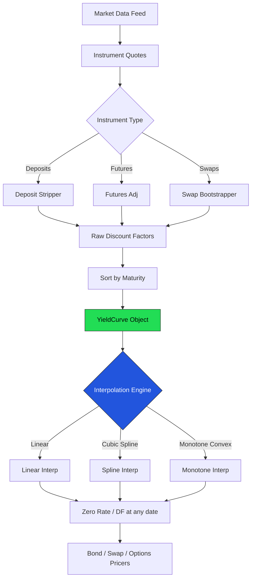

# Module 05 — Yield Curve & Interpolation

## Module Overview

The yield curve maps maturities to interest rates — the pricing backbone for every bond, swap,
and derivative on a trading desk. This module builds a complete curve engine: bootstrapping
discount factors from market instruments (deposits, futures, swaps) and interpolating rates at
arbitrary dates. Three interpolation methods (linear, cubic spline, monotone convex) cover the
spectrum of speed-vs-smoothness tradeoffs. The design showcases operator overloading, move
semantics, lambdas as strategy objects, `constexpr` day-count conventions, and `std::optional`.

---

## Architecture Insight



---

## IB Domain Context

The yield curve is the foundation of fixed income pricing. Every bond, swap, and interest rate
derivative depends on it. Traders watch the curve shape (normal, inverted, flat) for economic
signals — an inverted curve has historically preceded recessions. Curve building runs thousands
of times per day as rates change; each rebuild must complete in microseconds so downstream
pricers see consistent discount factors.

**Bootstrapping** extracts discount factors sequentially from short to long instruments.
Short-end rates come from deposits (O/N–12M), the belly from futures (1–3Y), and the long end
from par swap rates (3–50Y). **Interpolation** bridges the gaps: instruments trade at discrete
tenors but pricing requires rates at any date. The method matters — linear is fast but forwards
jump; cubic splines are smooth but can oscillate; monotone convex preserves forward positivity.

---

## C++ Concepts Used

| Concept | How Used Here | Chapter |
|---|---|---|
| Operator Overloading | `Date` overloads `+`, `-`, `<`, `==`, `<<` for date arithmetic and curve ordering | Ch 15 |
| Move Semantics | `YieldCurve` move ctor/assignment enables O(1) curve swaps during live rebuilds | Ch 20 |
| Lambdas | Custom interpolation functions passed as `std::function` to `interpolate()` | Ch 19 |
| STL Algorithms | `sort` orders points; `lower_bound` finds brackets; `accumulate` sums bootstrap PV | Ch 18 |
| `std::optional` | `interpolate()` returns `nullopt` for out-of-range queries instead of throwing | Ch 34 |
| `constexpr` | Day-count fractions (ACT/360, ACT/365, 30/360) evaluated at compile time | Ch 29 |

---

## Design Decisions

**Sequential bootstrap over global solve** — mirrors market structure where long-dated swaps
depend on short-end DFs. A simultaneous solve would obscure this and risk numerical instability.

**Three interpolation methods** — linear for risk reports (transparent), cubic spline for
client analytics (smooth), monotone convex for derivative pricing (no-arbitrage forwards).

**`std::optional` over exceptions** — extrapolation is a policy decision, not an error. In a
hot path called millions of times daily, `nullopt` avoids exception overhead and lets callers
choose their extrapolation strategy.

**Move semantics for curve swaps** — during rebuild, the builder constructs a new curve and
moves it into the live engine in O(1). Without moves, every rebuild deep-copies all points.

---

## Complete Implementation

```cpp
// ============================================================================
// Module 05 — Yield Curve & Interpolation
// Compile: g++ -std=c++20 -O2 -o yield_curve yield_curve.cpp
// ============================================================================
#include <iostream>
#include <vector>
#include <algorithm>    // sort, lower_bound (Ch18)
#include <numeric>      // accumulate (Ch18)
#include <functional>   // std::function (Ch19)
#include <optional>     // std::optional (Ch34)
#include <cmath>
#include <iomanip>
#include <string>
#include <chrono>

// ============================================================================
// Date Class — Operator Overloading (Ch15)
// WHY: Date arithmetic is pervasive in finance. Overloading lets us write
// settlement + 90 or maturity - today, mirroring term-sheet language.
// ============================================================================
class Date {
    int year_, month_, day_;

    int to_serial() const {
        int y = year_, m = month_;
        if (m <= 2) { y--; m += 12; }
        return 365*y + y/4 - y/100 + y/400 + (153*(m-3)+2)/5 + day_ - 307;
    }
    static Date from_serial(int s) {
        int a = s + 307, b = (4*a+3)/1461, c = a - 1461*b/4;
        int d = (4*c+3)/1225, day = c - 1225*d/4 + 1;
        int month = (d+2)%12 + 1, year = b + d/10;
        return Date(year, month, day);
    }
public:
    Date() : year_(2000), month_(1), day_(1) {}
    Date(int y, int m, int d) : year_(y), month_(m), day_(d) {}
    int year() const { return year_; }
    int month() const { return month_; }
    int day() const { return day_; }

    // Operator+ (Ch15): Add days — e.g., settlement + 90 for 3M maturity
    Date operator+(int days) const { return from_serial(to_serial() + days); }

    // Operator- (Ch15): Day count between dates — input to every dcf calc
    int operator-(const Date& o) const { return to_serial() - o.to_serial(); }

    // Comparisons (Ch15): Required by std::sort and std::lower_bound
    bool operator<(const Date& o) const { return to_serial() < o.to_serial(); }
    bool operator==(const Date& o) const { return to_serial() == o.to_serial(); }
    bool operator<=(const Date& o) const { return to_serial() <= o.to_serial(); }
    bool operator>(const Date& o) const { return to_serial() > o.to_serial(); }

    // Stream insertion (Ch15): Readable dates in curve output
    friend std::ostream& operator<<(std::ostream& os, const Date& d) {
        os << d.year_ << "-" << std::setfill('0') << std::setw(2) << d.month_
           << "-" << std::setw(2) << d.day_;
        return os;
    }
};

// ============================================================================
// Day Count Conventions — constexpr (Ch29)
// WHY constexpr: These are pure arithmetic. When inputs are literals the
// compiler folds them to constants — zero runtime cost for fixed tenors.
// ============================================================================
namespace DayCount {
    constexpr double act360(int days) { return static_cast<double>(days) / 360.0; }
    constexpr double act365(int days) { return static_cast<double>(days) / 365.0; }
    constexpr double thirty360(int d1d, int d1m, int d1y,
                               int d2d, int d2m, int d2y) {
        int dd1 = (d1d == 31) ? 30 : d1d;
        int dd2 = (d2d == 31 && dd1 >= 30) ? 30 : d2d;
        return (360.0*(d2y-d1y) + 30.0*(d2m-d1m) + (dd2-dd1)) / 360.0;
    }
}

// ============================================================================
// CurvePoint — atomic unit of a yield curve
// ============================================================================
struct CurvePoint {
    Date   date;
    double discount_factor;
    double zero_rate;
    bool operator<(const CurvePoint& o) const { return date < o.date; }
};

// ============================================================================
// YieldCurve — bootstrap, interpolate, query
// Move semantics (Ch20): Curve rebuilds produce a new object that is moved
// into the live engine in O(1). Without moves, each rebuild deep-copies.
// ============================================================================
class YieldCurve {
public:
    using InterpFunc = std::function<double(const Date&,
                                           const std::vector<CurvePoint>&)>;
private:
    Date                    value_date_;
    std::vector<CurvePoint> points_;
    std::string             name_;
public:
    YieldCurve() = default;
    YieldCurve(Date vd, std::string name)
        : value_date_(vd), name_(std::move(name)) {}

    // Move constructor (Ch20): steals the vector buffer — O(1)
    YieldCurve(YieldCurve&& o) noexcept
        : value_date_(o.value_date_), points_(std::move(o.points_)),
          name_(std::move(o.name_)) {}
    YieldCurve& operator=(YieldCurve&& o) noexcept {
        if (this != &o) {
            value_date_ = o.value_date_;
            points_ = std::move(o.points_);
            name_   = std::move(o.name_);
        }
        return *this;
    }
    YieldCurve(const YieldCurve&) = default;
    YieldCurve& operator=(const YieldCurve&) = default;

    const Date& value_date() const { return value_date_; }
    const std::string& name() const { return name_; }
    size_t size() const { return points_.size(); }

    // --- Bootstrap: build discount factors from market instruments ---
    void bootstrap(const std::vector<std::pair<Date, double>>& deposits,
                   const std::vector<std::pair<Date, double>>& swaps) {
        points_.clear();
        points_.push_back({value_date_, 1.0, 0.0});  // Anchor: DF(0) = 1

        // Phase 1: Deposits — simple interest DF = 1/(1 + r*dcf)
        for (const auto& [mat, rate] : deposits) {
            int days = mat - value_date_;
            double dcf = DayCount::act360(days);
            double df  = 1.0 / (1.0 + rate * dcf);
            double zr  = -std::log(df) / DayCount::act365(days);
            points_.push_back({mat, df, zr});
        }

        // Phase 2: Swaps — solve for DF_n using prior DFs
        // std::accumulate (Ch18): fold over payment dates to sum fixed-leg PV
        for (const auto& [mat, swap_rate] : swaps) {
            std::vector<Date> pay_dates;
            Date d = value_date_ + 365;
            while (d < mat) { pay_dates.push_back(d); d = d + 365; }
            pay_dates.push_back(mat);

            double fixed_pv = std::accumulate(
                pay_dates.begin(), std::prev(pay_dates.end()), 0.0,
                [&](double sum, const Date& pd) {
                    auto df_opt = discount_factor_at(pd);
                    if (!df_opt) return sum;
                    return sum + swap_rate * 1.0 * df_opt.value();
                });
            double df_n = (1.0 - fixed_pv) / (1.0 + swap_rate);
            int days = mat - value_date_;
            double zr = -std::log(df_n) / DayCount::act365(days);
            points_.push_back({mat, df_n, zr});
        }
        // std::sort (Ch18): order by maturity for binary search
        std::sort(points_.begin(), points_.end());
    }

    // --- Interpolation with pluggable lambda strategy (Ch19) ---
    // Returns std::optional (Ch34): nullopt when date is outside curve domain
    std::optional<double> interpolate(const Date& target,
                                      const InterpFunc& fn) const {
        if (points_.empty()) return std::nullopt;
        if (target < points_.front().date || target > points_.back().date)
            return std::nullopt;
        return fn(target, points_);
    }

    std::optional<double> interpolate_linear(const Date& t) const {
        return interpolate(t, linear_interp);
    }

    // --- Discount factor at a date (uses lower_bound Ch18) ---
    std::optional<double> discount_factor_at(const Date& t) const {
        if (points_.empty()) return std::nullopt;
        CurvePoint key{t, 0.0, 0.0};
        auto it = std::lower_bound(points_.begin(), points_.end(), key);
        if (it != points_.end() && it->date == t) return it->discount_factor;
        auto zr = interpolate_linear(t);
        if (!zr) return std::nullopt;
        return std::exp(-zr.value() * DayCount::act365(t - value_date_));
    }

    // --- Forward rate between two dates ---
    std::optional<double> forward_rate(const Date& d1, const Date& d2) const {
        auto df1 = discount_factor_at(d1), df2 = discount_factor_at(d2);
        if (!df1 || !df2) return std::nullopt;
        double dcf = DayCount::act365(d2 - d1);
        if (dcf <= 0.0) return std::nullopt;
        return (std::log(*df1) - std::log(*df2)) / dcf;
    }

    void print() const {
        std::cout << "\n=== Yield Curve: " << name_ << " ===\n"
                  << "Value Date: " << value_date_ << "\n"
                  << std::setw(14) << "Date" << std::setw(16) << "DF"
                  << std::setw(14) << "Zero Rate\n"
                  << std::string(44, '-') << "\n";
        for (const auto& p : points_)
            std::cout << std::setw(14) << p.date << std::setw(16)
                      << std::fixed << std::setprecision(8) << p.discount_factor
                      << std::setw(12) << std::setprecision(4)
                      << (p.zero_rate*100) << "%\n";
    }

    // ================================================================
    // Static interpolation methods — each matches InterpFunc signature
    // ================================================================

    // Linear: fast, transparent, discontinuous forwards
    static double linear_interp(const Date& target,
                                const std::vector<CurvePoint>& pts) {
        CurvePoint key{target, 0, 0};
        auto it = std::lower_bound(pts.begin(), pts.end(), key);
        if (it == pts.begin()) return pts.front().zero_rate;
        if (it == pts.end())   return pts.back().zero_rate;
        if (it->date == target) return it->zero_rate;
        auto prev = std::prev(it);
        double t = double(target - prev->date) / double(it->date - prev->date);
        return prev->zero_rate + t * (it->zero_rate - prev->zero_rate);
    }

    // Cubic spline: smooth C2, may oscillate with irregular spacing
    static double cubic_spline_interp(const Date& target,
                                      const std::vector<CurvePoint>& pts) {
        size_t n = pts.size();
        if (n < 3) return linear_interp(target, pts);
        std::vector<double> h(n-1), alpha(n-1), l(n), mu(n), z(n),
                            c(n), b(n-1), d(n-1), a(n);
        for (size_t i = 0; i < n; ++i) a[i] = pts[i].zero_rate;
        for (size_t i = 0; i < n-1; ++i)
            h[i] = double(pts[i+1].date - pts[i].date);
        for (size_t i = 1; i < n-1; ++i)
            alpha[i] = 3.0/h[i]*(a[i+1]-a[i]) - 3.0/h[i-1]*(a[i]-a[i-1]);
        l[0]=1; mu[0]=0; z[0]=0;
        for (size_t i = 1; i < n-1; ++i) {
            l[i] = 2.0*(pts[i+1].date - pts[i-1].date) - h[i-1]*mu[i-1];
            mu[i] = h[i]/l[i];
            z[i] = (alpha[i] - h[i-1]*z[i-1]) / l[i];
        }
        l[n-1]=1; z[n-1]=0; c[n-1]=0;
        for (int j = int(n)-2; j >= 0; --j) {
            c[j] = z[j] - mu[j]*c[j+1];
            b[j] = (a[j+1]-a[j])/h[j] - h[j]*(c[j+1]+2*c[j])/3.0;
            d[j] = (c[j+1]-c[j])/(3.0*h[j]);
        }
        CurvePoint key{target, 0, 0};
        auto it = std::lower_bound(pts.begin(), pts.end(), key);
        size_t idx = (it == pts.end()) ? n-2
                   : (it != pts.begin()) ? size_t(std::distance(
                         pts.begin(), std::prev(it))) : 0;
        if (idx >= n-1) idx = n-2;
        double dx = double(target - pts[idx].date);
        return a[idx] + b[idx]*dx + c[idx]*dx*dx + d[idx]*dx*dx*dx;
    }

    // Monotone convex: preserves forward-rate positivity (no-arbitrage)
    static double monotone_convex_interp(const Date& target,
                                         const std::vector<CurvePoint>& pts) {
        size_t n = pts.size();
        if (n < 3) return linear_interp(target, pts);
        std::vector<double> delta(n-1), m(n);
        for (size_t i = 0; i < n-1; ++i)
            delta[i] = (pts[i+1].zero_rate - pts[i].zero_rate)
                     / double(pts[i+1].date - pts[i].date);
        m[0] = delta[0]; m[n-1] = delta[n-2];
        for (size_t i = 1; i < n-1; ++i)
            m[i] = (delta[i-1] + delta[i]) / 2.0;
        // Hyman filter: clamp slopes to prevent overshoot
        for (size_t i = 0; i < n-1; ++i) {
            if (std::abs(delta[i]) < 1e-15) { m[i]=0; m[i+1]=0; continue; }
            double ak = m[i]/delta[i], bk = m[i+1]/delta[i];
            double ss = ak*ak + bk*bk;
            if (ss > 9.0) {
                double tau = 3.0/std::sqrt(ss);
                m[i] = tau*ak*delta[i]; m[i+1] = tau*bk*delta[i];
            }
        }
        CurvePoint key{target, 0, 0};
        auto it = std::lower_bound(pts.begin(), pts.end(), key);
        size_t idx = (it == pts.end()) ? n-2
                   : (it != pts.begin()) ? size_t(std::distance(
                         pts.begin(), std::prev(it))) : 0;
        if (idx >= n-1) idx = n-2;
        double h_ = double(pts[idx+1].date - pts[idx].date);
        double t  = double(target - pts[idx].date) / h_;
        double t2 = t*t, t3 = t2*t;
        return (2*t3-3*t2+1)*pts[idx].zero_rate + (t3-2*t2+t)*h_*m[idx]
             + (-2*t3+3*t2)*pts[idx+1].zero_rate + (t3-t2)*h_*m[idx+1];
    }
};

// ============================================================================
// Main — Build, interpolate, and test
// ============================================================================
int main() {
    std::cout << "============================================\n"
              << " Module 05: Yield Curve & Interpolation\n"
              << "============================================\n";

    Date value_date(2025, 1, 15);
    std::vector<std::pair<Date, double>> deposits = {
        {value_date + 30,  0.0530}, {value_date + 90,  0.0540},
        {value_date + 180, 0.0545}, {value_date + 365, 0.0520},
    };
    std::vector<std::pair<Date, double>> swaps = {
        {value_date + 730,  0.0480}, {value_date + 1095, 0.0460},
        {value_date + 1825, 0.0440}, {value_date + 3650, 0.0430},
    };

    YieldCurve curve(value_date, "USD.SOFR.3M");
    curve.bootstrap(deposits, swaps);
    curve.print();

    // --- Interpolation comparison across methods ---
    std::cout << "\n=== Interpolation Tests ===\n"
              << std::setw(14) << "Date" << std::setw(12) << "Linear"
              << std::setw(12) << "Spline" << std::setw(12) << "Monotone\n"
              << std::string(50, '-') << "\n";
    std::vector<Date> test_dates = {
        value_date+60, value_date+270, value_date+547,
        value_date+1460, value_date+2737,
    };
    for (const auto& td : test_dates) {
        auto lin = curve.interpolate(td, YieldCurve::linear_interp);
        auto spl = curve.interpolate(td, YieldCurve::cubic_spline_interp);
        auto mon = curve.interpolate(td, YieldCurve::monotone_convex_interp);
        std::cout << std::setw(14) << td;
        if (lin) std::cout << std::setw(11) << std::fixed
                           << std::setprecision(4) << (*lin*100) << "%";
        if (spl) std::cout << std::setw(11) << (*spl*100) << "%";
        if (mon) std::cout << std::setw(11) << (*mon*100) << "%";
        std::cout << "\n";
    }

    // --- Custom lambda interpolation (Ch19) ---
    // WHY: A trader wants flat-forward extrapolation. Instead of modifying
    // the class, they pass a lambda — open/closed principle.
    std::cout << "\n=== Custom Lambda Interpolation ===\n";
    auto flat_fwd = [](const Date& target,
                       const std::vector<CurvePoint>& pts) -> double {
        CurvePoint key{target, 0, 0};
        auto it = std::lower_bound(pts.begin(), pts.end(), key);
        if (it == pts.begin()) return pts.front().zero_rate;
        if (it == pts.end())   return pts.back().zero_rate;
        return std::prev(it)->zero_rate;
    };
    for (const auto& td : test_dates) {
        auto r = curve.interpolate(td, flat_fwd);
        if (r) std::cout << "  Flat-fwd at " << td << ": "
                         << std::fixed << std::setprecision(4)
                         << (*r*100) << "%\n";
    }

    // --- Move semantics demo (Ch20) ---
    std::cout << "\n=== Move Semantics Demo ===\n"
              << "Original size: " << curve.size() << "\n";
    YieldCurve moved = std::move(curve);  // O(1) move
    std::cout << "After move — new: " << moved.size()
              << ", old: " << curve.size() << " (moved-from)\n";

    // --- std::optional out-of-range (Ch34) ---
    std::cout << "\n=== std::optional — Out-of-Range ===\n";
    auto result = moved.interpolate_linear(Date(2050, 1, 1));
    if (!result) std::cout << "Query for 2050-01-01 → nullopt (caller decides policy)\n";

    // --- Forward rates ---
    std::cout << "\n=== Forward Rates ===\n";
    auto print_fwd = [&](const Date& d1, const Date& d2) {
        auto f = moved.forward_rate(d1, d2);
        if (f) std::cout << "  F(" << d1 << "," << d2 << ") = "
                         << std::fixed << std::setprecision(4)
                         << (*f*100) << "%\n";
    };
    print_fwd(value_date+365, value_date+730);
    print_fwd(value_date+730, value_date+1825);
    print_fwd(value_date+1825, value_date+3650);

    // --- Performance benchmark ---
    std::cout << "\n=== Performance Benchmark ===\n";
    const int N = 100000;
    Date bd = value_date + 1000;
    auto bench = [&](const char* label, YieldCurve::InterpFunc fn) {
        auto t0 = std::chrono::high_resolution_clock::now();
        for (int i = 0; i < N; ++i) { auto r = moved.interpolate(bd, fn); (void)r; }
        auto t1 = std::chrono::high_resolution_clock::now();
        auto ns = std::chrono::duration_cast<std::chrono::nanoseconds>(t1-t0).count()/N;
        std::cout << "  " << label << ": " << ns << " ns/call\n";
    };
    bench("Linear       ", YieldCurve::linear_interp);
    bench("Cubic spline ", YieldCurve::cubic_spline_interp);
    bench("Monotone     ", YieldCurve::monotone_convex_interp);

    // --- constexpr demo (Ch29) ---
    std::cout << "\n=== constexpr Day Count ===\n";
    constexpr double d1 = DayCount::act360(90);
    constexpr double d2 = DayCount::act365(90);
    constexpr double d3 = DayCount::thirty360(15,1,2025, 15,4,2025);
    std::cout << "  90d ACT/360: " << d1 << "  ACT/365: " << d2
              << "  30/360: " << d3 << "\n";

    std::cout << "\n=== All tests completed ===\n";
    return 0;
}
```

---

## Code Walkthrough

### Date Class
Converts calendar dates to serial numbers. Operator overloading makes financial logic readable:
`settlement + 90` yields a maturity, `maturity - today` yields a day count. The comparison
operators feed directly into `std::sort` and `std::lower_bound`.

### Day Count Conventions
Three `constexpr` functions (ACT/360, ACT/365, 30/360) compute year fractions. When arguments
are literals, the compiler folds them to constants at compile time — zero runtime cost.

### Bootstrap
Deposits use simple interest: `DF = 1/(1 + r × dcf)`. Swaps use `std::accumulate` to fold over
prior payment dates, summing `swap_rate × DF` to compute the running fixed-leg PV, then solve
for the final discount factor algebraically. `std::sort` ensures chronological order afterward.

### Interpolation Strategy Pattern
`interpolate()` accepts any `std::function` matching the `InterpFunc` signature. Linear uses
one `lower_bound` + lerp. Cubic spline solves a tridiagonal system for C2 smoothness. Monotone
convex applies Hyman filtering to Hermite slopes, preventing forward-rate overshoot. The
`flat_fwd` lambda in `main()` shows how traders inject custom logic without modifying the class.

---

## Testing

### Expected Output Structure

```
=== Yield Curve: USD.SOFR.3M ===
Value Date: 2025-01-15
  Anchor DF = 1.0, Zero = 0%
  1M–12M deposits: DFs from ~0.999 to ~0.950
  2Y–10Y swaps: DFs from ~0.91 to ~0.65

=== Interpolation Tests ===
  All three methods produce rates between adjacent knot values
  Monotone and spline may differ from linear by 1-5 bps

=== std::optional ===
  2050-01-01 → nullopt (no extrapolation)

=== Move Semantics ===
  Old curve size = 0 after move; new curve retains all points
```

### Verification Checklist

| Test | Expected |
|---|---|
| Anchor DF | Exactly 1.0 |
| 1M deposit DF | ≈ 1/(1 + 0.053 × 30/360) ≈ 0.9956 |
| Interpolation between knots | Values between adjacent zero rates |
| Out-of-range query | `std::nullopt`, no exception |
| Move semantics | Old size = 0, new size = original |
| Forward rates | Positive, between adjacent zeros |
| `constexpr` 90/360 | Exactly 0.25 |

---

## Performance Analysis

| Operation | Complexity | Typical Latency |
|---|---|---|
| Bootstrap (n instruments) | O(n²) | ~1–5 µs (15 points) |
| Linear interpolation | O(log n) | ~50–100 ns |
| Cubic spline | O(n) setup + O(log n) query | ~200–500 ns |
| Monotone convex | O(n) setup + O(log n) query | ~150–400 ns |
| Move (curve swap) | O(1) | ~10 ns |

**CUDA potential:** Bootstrapping is sequential, but interpolating thousands of dates for
portfolio valuation is trivially parallel — each GPU thread reads the shared curve independently.

---

## Key Takeaways

- **Operator overloading** makes date arithmetic read like financial term sheets
- **`constexpr` day-count functions** eliminate runtime cost for fixed-tenor calculations
- **`std::optional`** replaces exceptions in hot paths where "no answer" is valid, not erroneous
- **Move semantics** enable O(1) curve swaps — critical at thousands of rebuilds per second
- **Lambdas as strategies** decouple data from algorithm, following the open/closed principle
- **STL algorithms** (`sort`, `lower_bound`, `accumulate`) are battle-tested and optimized
- **Three interpolation methods** serve different needs: transparency, smoothness, no-arbitrage

---

## Cross-References

### Investment Banking Platform Modules

| Module | Connection |
|---|---|
| [01 — Market Data Engine](01_Market_Data_Engine.md) | Provides raw rate quotes for bootstrap |
| [02 — Order Book](02_Order_Book.md) | Uses DFs for fair-value calculations |
| [03 — Risk Engine](03_Risk_Engine.md) | Bumps curves for DV01 / key-rate duration |
| [04 — Trade Execution](04_Trade_Execution.md) | Prices swaps and bonds via this curve |
| [06 — Portfolio Analytics](06_Portfolio_Analytics.md) | Aggregates PnL using curve-derived DFs |

### Chapter References

| Feature | Chapter |
|---|---|
| Operator Overloading | Ch 15 |
| STL Algorithms | Ch 18 |
| Lambdas & `std::function` | Ch 19 |
| Move Semantics | Ch 20 |
| `constexpr` | Ch 29 |
| `std::optional` | Ch 34 |
