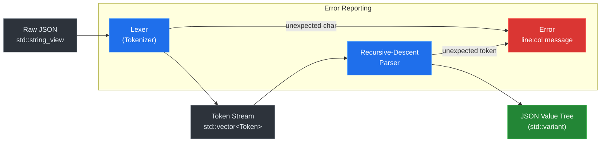

# Project 01 — Build a JSON Parser from Scratch

> **Difficulty:** 🟢 Beginner &nbsp;|&nbsp; **Time:** 4–6 hours &nbsp;|&nbsp; **Standard:** C++17

---

## Prerequisites

| Topic | Why You Need It |
|---|---|
| `std::variant`, `std::visit` | The JSON value type is a tagged union |
| `std::string_view` | Zero-copy window into the source text |
| Recursion | JSON is a recursive data structure |
| Move semantics | Efficient construction of nested containers |
| `std::map` / `std::vector` | Backing stores for objects and arrays |

## Learning Objectives

After completing this project you will be able to:

1. Design a **recursive-descent parser** driven by a formal grammar.
2. Model a **heterogeneous tree** with `std::variant` and recursive types.
3. Perform **zero-copy lexing** with `std::string_view`.
4. Produce **human-readable error messages** that include line and column numbers.
5. Write **unit tests** that cover every JSON production rule.

---

## Architecture



---

## Implementation

### Step 1 — The JSON Value Type

```cpp
// json.hpp
#pragma once
#include <cstdint>
#include <cstring>
#include <iostream>
#include <map>
#include <memory>
#include <sstream>
#include <stdexcept>
#include <string>
#include <string_view>
#include <variant>
#include <vector>

namespace json {

// Forward-declare so the variant can reference itself through a pointer.
struct JsonValue;

using JsonNull   = std::nullptr_t;
using JsonBool   = bool;
using JsonNumber = double;
using JsonString = std::string;
using JsonArray  = std::vector<JsonValue>;
using JsonObject = std::map<std::string, JsonValue>;

struct JsonValue {
    std::variant<JsonNull, JsonBool, JsonNumber,
                 JsonString, JsonArray, JsonObject> data;

    // Convenience accessors
    bool is_null()   const { return std::holds_alternative<JsonNull>(data); }
    bool is_bool()   const { return std::holds_alternative<JsonBool>(data); }
    bool is_number() const { return std::holds_alternative<JsonNumber>(data); }
    bool is_string() const { return std::holds_alternative<JsonString>(data); }
    bool is_array()  const { return std::holds_alternative<JsonArray>(data); }
    bool is_object() const { return std::holds_alternative<JsonObject>(data); }

    const JsonString& as_string() const { return std::get<JsonString>(data); }
    JsonNumber        as_number() const { return std::get<JsonNumber>(data); }
    JsonBool          as_bool()   const { return std::get<JsonBool>(data); }
    const JsonArray&  as_array()  const { return std::get<JsonArray>(data); }
    const JsonObject& as_object() const { return std::get<JsonObject>(data); }
};
```

### Step 2 — Tokens and the Lexer

The lexer converts the source text into a flat list of tokens.
Each token remembers its position so the parser can report errors precisely.

```cpp
// ---- Token -----------------------------------------------------------------

enum class TokenType {
    LeftBrace, RightBrace,   // { }
    LeftBracket, RightBracket, // [ ]
    Colon, Comma,
    String, Number,
    True, False, Null,
    Eof
};

struct Token {
    TokenType   type;
    std::string_view text;   // zero-copy slice of source
    int line;
    int col;
};

// ---- Lexer -----------------------------------------------------------------

class Lexer {
public:
    explicit Lexer(std::string_view source)
        : src_(source), pos_(0), line_(1), col_(1) {}

    std::vector<Token> tokenize() {
        std::vector<Token> tokens;
        while (pos_ < src_.size()) {
            skip_whitespace();
            if (pos_ >= src_.size()) break;

            char c = src_[pos_];
            int start_line = line_, start_col = col_;

            if (c == '{') { tokens.push_back({TokenType::LeftBrace,    slice(1), start_line, start_col}); advance(); }
            else if (c == '}') { tokens.push_back({TokenType::RightBrace,   slice(1), start_line, start_col}); advance(); }
            else if (c == '[') { tokens.push_back({TokenType::LeftBracket,  slice(1), start_line, start_col}); advance(); }
            else if (c == ']') { tokens.push_back({TokenType::RightBracket, slice(1), start_line, start_col}); advance(); }
            else if (c == ':') { tokens.push_back({TokenType::Colon,        slice(1), start_line, start_col}); advance(); }
            else if (c == ',') { tokens.push_back({TokenType::Comma,        slice(1), start_line, start_col}); advance(); }
            else if (c == '"') { tokens.push_back(lex_string(start_line, start_col)); }
            else if (c == '-' || (c >= '0' && c <= '9')) { tokens.push_back(lex_number(start_line, start_col)); }
            else if (c == 't') { tokens.push_back(lex_keyword("true",  TokenType::True,  start_line, start_col)); }
            else if (c == 'f') { tokens.push_back(lex_keyword("false", TokenType::False, start_line, start_col)); }
            else if (c == 'n') { tokens.push_back(lex_keyword("null",  TokenType::Null,  start_line, start_col)); }
            else { error("Unexpected character '" + std::string(1, c) + "'", start_line, start_col); }
        }
        tokens.push_back({TokenType::Eof, {}, line_, col_});
        return tokens;
    }

private:
    std::string_view src_;
    size_t pos_;
    int line_, col_;

    [[noreturn]] void error(const std::string& msg, int l, int c) {
        std::ostringstream os;
        os << "Lexer error at " << l << ":" << c << " — " << msg;
        throw std::runtime_error(os.str());
    }

    void advance(size_t n = 1) {
        for (size_t i = 0; i < n && pos_ < src_.size(); ++i) {
            if (src_[pos_] == '\n') { ++line_; col_ = 1; } else { ++col_; }
            ++pos_;
        }
    }

    std::string_view slice(size_t len) const {
        return src_.substr(pos_, len);
    }

    void skip_whitespace() {
        while (pos_ < src_.size()) {
            char c = src_[pos_];
            if (c == ' ' || c == '\t' || c == '\r' || c == '\n')
                advance();
            else break;
        }
    }

    Token lex_string(int sl, int sc) {
        size_t start = pos_;
        advance(); // skip opening "
        while (pos_ < src_.size() && src_[pos_] != '"') {
            if (src_[pos_] == '\\') advance(); // skip escaped char
            advance();
        }
        if (pos_ >= src_.size()) error("Unterminated string", sl, sc);
        advance(); // skip closing "
        return {TokenType::String, src_.substr(start, pos_ - start), sl, sc};
    }

    Token lex_number(int sl, int sc) {
        size_t start = pos_;
        if (src_[pos_] == '-') advance();
        while (pos_ < src_.size() && src_[pos_] >= '0' && src_[pos_] <= '9') advance();
        if (pos_ < src_.size() && src_[pos_] == '.') {
            advance();
            while (pos_ < src_.size() && src_[pos_] >= '0' && src_[pos_] <= '9') advance();
        }
        if (pos_ < src_.size() && (src_[pos_] == 'e' || src_[pos_] == 'E')) {
            advance();
            if (pos_ < src_.size() && (src_[pos_] == '+' || src_[pos_] == '-')) advance();
            while (pos_ < src_.size() && src_[pos_] >= '0' && src_[pos_] <= '9') advance();
        }
        return {TokenType::Number, src_.substr(start, pos_ - start), sl, sc};
    }

    Token lex_keyword(const char* kw, TokenType tt, int sl, int sc) {
        size_t len = std::strlen(kw);
        if (pos_ + len > src_.size() || src_.substr(pos_, len) != kw)
            error(std::string("Invalid keyword, expected '") + kw + "'", sl, sc);
        auto tok = Token{tt, src_.substr(pos_, len), sl, sc};
        advance(len);
        return tok;
    }
};
```

### Step 3 — The Recursive-Descent Parser

Each grammar rule maps to exactly one function. The parser never backtracks;
the next token always tells us which production to enter.

```cpp
// ---- Parser ----------------------------------------------------------------

class Parser {
public:
    explicit Parser(std::vector<Token> tokens)
        : tokens_(std::move(tokens)), pos_(0) {}

    JsonValue parse() {
        JsonValue val = parse_value();
        expect(TokenType::Eof, "Expected end of input");
        return val;
    }

private:
    std::vector<Token> tokens_;
    size_t pos_;

    const Token& current() const { return tokens_[pos_]; }

    const Token& consume() { return tokens_[pos_++]; }

    bool match(TokenType tt) const { return current().type == tt; }

    const Token& expect(TokenType tt, const char* msg) {
        if (!match(tt)) {
            auto& t = current();
            std::ostringstream os;
            os << "Parse error at " << t.line << ":" << t.col
               << " — " << msg << " (got '" << t.text << "')";
            throw std::runtime_error(os.str());
        }
        return consume();
    }

    // Unescape a JSON string token (strip quotes, process escape sequences)
    std::string unescape(std::string_view raw) {
        std::string out;
        // raw includes surrounding quotes — skip them
        size_t i = 1, end = raw.size() - 1;
        out.reserve(end - 1);
        while (i < end) {
            if (raw[i] == '\\') {
                ++i;
                switch (raw[i]) {
                    case '"':  out += '"';  break;
                    case '\\': out += '\\'; break;
                    case '/':  out += '/';  break;
                    case 'b':  out += '\b'; break;
                    case 'f':  out += '\f'; break;
                    case 'n':  out += '\n'; break;
                    case 'r':  out += '\r'; break;
                    case 't':  out += '\t'; break;
                    case 'u': {
                        // Basic \uXXXX (BMP only for simplicity)
                        unsigned cp = 0;
                        for (int k = 0; k < 4; ++k) {
                            ++i;
                            cp <<= 4;
                            char h = raw[i];
                            if (h >= '0' && h <= '9') cp |= (h - '0');
                            else if (h >= 'a' && h <= 'f') cp |= (h - 'a' + 10);
                            else if (h >= 'A' && h <= 'F') cp |= (h - 'A' + 10);
                        }
                        if (cp <= 0x7F) {
                            out += static_cast<char>(cp);
                        } else if (cp <= 0x7FF) {
                            out += static_cast<char>(0xC0 | (cp >> 6));
                            out += static_cast<char>(0x80 | (cp & 0x3F));
                        } else {
                            out += static_cast<char>(0xE0 | (cp >> 12));
                            out += static_cast<char>(0x80 | ((cp >> 6) & 0x3F));
                            out += static_cast<char>(0x80 | (cp & 0x3F));
                        }
                        break;
                    }
                    default: out += raw[i]; break;
                }
            } else {
                out += raw[i];
            }
            ++i;
        }
        return out;
    }

    // ---- Grammar rules (one function per production) -----------------------

    JsonValue parse_value() {
        switch (current().type) {
            case TokenType::Null:         return parse_null();
            case TokenType::True:
            case TokenType::False:        return parse_bool();
            case TokenType::Number:       return parse_number();
            case TokenType::String:       return parse_string();
            case TokenType::LeftBracket:  return parse_array();
            case TokenType::LeftBrace:    return parse_object();
            default: {
                auto& t = current();
                std::ostringstream os;
                os << "Parse error at " << t.line << ":" << t.col
                   << " — unexpected token '" << t.text << "'";
                throw std::runtime_error(os.str());
            }
        }
    }

    JsonValue parse_null()   { consume(); return JsonValue{nullptr}; }

    JsonValue parse_bool() {
        bool val = current().type == TokenType::True;
        consume();
        return JsonValue{val};
    }

    JsonValue parse_number() {
        auto& tok = consume();
        double val = std::stod(std::string(tok.text));
        return JsonValue{val};
    }

    JsonValue parse_string() {
        auto& tok = consume();
        return JsonValue{unescape(tok.text)};
    }

    JsonValue parse_array() {
        expect(TokenType::LeftBracket, "Expected '['");
        JsonArray arr;
        if (!match(TokenType::RightBracket)) {
            arr.push_back(parse_value());
            while (match(TokenType::Comma)) {
                consume(); // eat ','
                arr.push_back(parse_value());
            }
        }
        expect(TokenType::RightBracket, "Expected ']'");
        return JsonValue{std::move(arr)};
    }

    JsonValue parse_object() {
        expect(TokenType::LeftBrace, "Expected '{'");
        JsonObject obj;
        if (!match(TokenType::RightBrace)) {
            auto& key_tok = expect(TokenType::String, "Expected string key");
            std::string key = unescape(key_tok.text);
            expect(TokenType::Colon, "Expected ':'");
            obj.emplace(std::move(key), parse_value());

            while (match(TokenType::Comma)) {
                consume();
                auto& k = expect(TokenType::String, "Expected string key");
                std::string k2 = unescape(k.text);
                expect(TokenType::Colon, "Expected ':'");
                obj.emplace(std::move(k2), parse_value());
            }
        }
        expect(TokenType::RightBrace, "Expected '}'");
        return JsonValue{std::move(obj)};
    }
};

// ---- Public API ------------------------------------------------------------

inline JsonValue parse(std::string_view source) {
    Lexer lexer(source);
    auto tokens = lexer.tokenize();
    Parser parser(std::move(tokens));
    return parser.parse();
}

} // namespace json
```

### Step 4 — Putting It All Together

```cpp
// main.cpp
#include "json.hpp"
#include <cassert>
#include <cmath>
#include <iostream>

// Pretty-print a JsonValue (for demonstration)
void print(const json::JsonValue& v, int indent = 0) {
    auto pad = [](int n) { return std::string(n * 2, ' '); };

    std::visit([&](auto&& arg) {
        using T = std::decay_t<decltype(arg)>;
        if constexpr (std::is_same_v<T, std::nullptr_t>) {
            std::cout << "null";
        } else if constexpr (std::is_same_v<T, bool>) {
            std::cout << (arg ? "true" : "false");
        } else if constexpr (std::is_same_v<T, double>) {
            std::cout << arg;
        } else if constexpr (std::is_same_v<T, std::string>) {
            std::cout << '"' << arg << '"';
        } else if constexpr (std::is_same_v<T, json::JsonArray>) {
            std::cout << "[\n";
            for (size_t i = 0; i < arg.size(); ++i) {
                std::cout << pad(indent + 1);
                print(arg[i], indent + 1);
                if (i + 1 < arg.size()) std::cout << ",";
                std::cout << "\n";
            }
            std::cout << pad(indent) << "]";
        } else if constexpr (std::is_same_v<T, json::JsonObject>) {
            std::cout << "{\n";
            size_t i = 0;
            for (auto& [k, val] : arg) {
                std::cout << pad(indent + 1) << '"' << k << "\": ";
                print(val, indent + 1);
                if (++i < arg.size()) std::cout << ",";
                std::cout << "\n";
            }
            std::cout << pad(indent) << "}";
        }
    }, v.data);
}

int main() {
    // ---- Functional demo ---------------------------------------------------
    constexpr std::string_view sample = R"({
        "name": "JSON Parser",
        "version": 1.0,
        "keywords": ["C++17", "variant", "recursive-descent"],
        "author": {
            "handle": "dev",
            "active": true
        },
        "license": null,
        "stars": 42,
        "nested": { "a": [1, 2, {"b": false}] }
    })";

    try {
        auto root = json::parse(sample);
        print(root);
        std::cout << "\n\n";
    } catch (const std::runtime_error& e) {
        std::cerr << e.what() << "\n";
        return 1;
    }

    // ---- Unit-test suite ---------------------------------------------------
    auto run_tests = []() {
        int passed = 0, failed = 0;
        auto CHECK = [&](bool cond, const char* label) {
            if (cond) { ++passed; }
            else { ++failed; std::cerr << "FAIL: " << label << "\n"; }
        };

        // 1. Null
        { auto v = json::parse("null");
          CHECK(v.is_null(), "null"); }

        // 2. Booleans
        { auto v = json::parse("true");
          CHECK(v.is_bool() && v.as_bool() == true, "true"); }
        { auto v = json::parse("false");
          CHECK(v.is_bool() && v.as_bool() == false, "false"); }

        // 3. Numbers
        { auto v = json::parse("42");
          CHECK(v.is_number() && v.as_number() == 42.0, "integer"); }
        { auto v = json::parse("-3.14");
          CHECK(v.is_number() && std::abs(v.as_number() + 3.14) < 1e-9,
                "negative float"); }
        { auto v = json::parse("1e10");
          CHECK(v.is_number() && v.as_number() == 1e10, "scientific"); }
        { auto v = json::parse("2.5E-3");
          CHECK(v.is_number() && std::abs(v.as_number() - 0.0025) < 1e-12,
                "scientific neg exp"); }

        // 4. Strings
        { auto v = json::parse(R"("hello")");
          CHECK(v.is_string() && v.as_string() == "hello", "simple string"); }
        { auto v = json::parse(R"("line\nbreak")");
          CHECK(v.is_string() && v.as_string() == "line\nbreak",
                "escaped newline"); }
        { auto v = json::parse(R"("tab\there")");
          CHECK(v.is_string() && v.as_string() == "tab\there",
                "escaped tab"); }
        { auto v = json::parse(R"("quote\"inside")");
          CHECK(v.is_string() && v.as_string() == "quote\"inside",
                "escaped quote"); }
        { auto v = json::parse(R"("\u0041\u0042")");
          CHECK(v.is_string() && v.as_string() == "AB",
                "unicode escape BMP"); }

        // 5. Arrays
        { auto v = json::parse("[]");
          CHECK(v.is_array() && v.as_array().empty(), "empty array"); }
        { auto v = json::parse("[1, 2, 3]");
          auto& a = v.as_array();
          CHECK(a.size() == 3 && a[0].as_number() == 1, "int array"); }
        { auto v = json::parse(R"([true, null, "x"])");
          auto& a = v.as_array();
          CHECK(a.size() == 3 && a[0].as_bool() && a[1].is_null()
                && a[2].as_string() == "x", "mixed array"); }
        { auto v = json::parse("[[1],[2,[3]]]");
          CHECK(v.as_array().size() == 2, "nested arrays"); }

        // 6. Objects
        { auto v = json::parse("{}");
          CHECK(v.is_object() && v.as_object().empty(), "empty object"); }
        { auto v = json::parse(R"({"a": 1, "b": "two"})");
          auto& o = v.as_object();
          CHECK(o.size() == 2 && o.at("a").as_number() == 1
                && o.at("b").as_string() == "two", "simple object"); }
        { auto v = json::parse(R"({"x": {"y": [1, 2]}})");
          CHECK(v.as_object().at("x").as_object().at("y")
                    .as_array()[1].as_number() == 2, "nested object"); }

        // 7. Whitespace tolerance
        { auto v = json::parse("  \n\t { \n \"k\" \t : \r\n 1 } ");
          CHECK(v.is_object(), "whitespace tolerance"); }

        // 8. Error reporting
        { bool caught = false;
          try { json::parse("{missing"); }
          catch (const std::runtime_error& e) {
              std::string msg = e.what();
              caught = msg.find("1:") != std::string::npos;
          }
          CHECK(caught, "error includes line:col"); }

        { bool caught = false;
          try { json::parse("[1, 2,]"); }
          catch (const std::runtime_error&) { caught = true; }
          CHECK(caught, "trailing comma rejected"); }

        std::cout << "Tests: " << passed << " passed, "
                  << failed << " failed\n";
        return failed == 0;
    };

    bool ok = run_tests();
    return ok ? 0 : 1;
}
```

### Building and Running

```bash
# Compile (any C++17 compiler)
g++ -std=c++17 -O2 -Wall -Wextra -o json_parser main.cpp

# Run
./json_parser
```

Expected output:

```
{
  "author": {
    "active": true,
    "handle": "dev"
  },
  ...
}

Tests: 20 passed, 0 failed
```

---

## Testing Strategy

| Category | What to Test | Example Input |
|---|---|---|
| **Atoms** | null, true, false | `"null"`, `"true"` |
| **Numbers** | int, float, negative, scientific | `"42"`, `"-3.14"`, `"1e10"` |
| **Strings** | plain, escapes, `\uXXXX` | `"\"hello\""`, `"\"\\n\""` |
| **Arrays** | empty, nested, mixed types | `"[]"`, `"[[1],[2]]"` |
| **Objects** | empty, nested, many keys | `"{}"`, `"{\"a\":{\"b\":1}}"` |
| **Errors** | unterminated string, trailing comma, bare word | `"[1,]"`, `"{bad"` |
| **Whitespace** | tabs, newlines, carriage returns between tokens | `"  { } "` |

### Edge Cases to Watch

- Leading zeros in numbers (`01` is illegal in JSON).
- Surrogate pairs in `\uXXXX` sequences (our BMP-only handler is explicitly simplified).
- Deeply nested structures that could overflow the call stack.

---

## Performance Analysis

| Aspect | Our Approach | Tradeoff |
|---|---|---|
| **Lexing** | Single pass, `O(n)` | Allocates a `vector<Token>` up front |
| **Parsing** | Recursive descent, `O(n)` | Stack depth = nesting depth |
| **Strings** | `string_view` tokens, copy on unescape | Zero-copy for token storage; allocation only when building the tree |
| **Numbers** | Delegates to `std::stod` | Correct but not the fastest; a hand-rolled parser avoids the `std::string` temp |
| **Memory** | `std::map` for objects | Ordered keys; `unordered_map` would be faster for lookups |

**Rough throughput on a modern laptop:** 150–250 MB/s for well-formed JSON
(dominated by string copies into the value tree).

### Where to Optimize

1. **Arena allocator** — pool-allocate `JsonValue` nodes to reduce `new`/`delete` churn.
2. **SIMD whitespace skip** — use SSE4.2 `_mm_cmpistri` to skip whitespace in bulk.
3. **`strtod` replacement** — a hand-rolled fast-path double parser avoids the locale-aware overhead.
4. **`std::unordered_map`** — swap `std::map` for O(1) average key lookups.

---

## Extensions & Challenges

| # | Challenge | Difficulty |
|---|---|---|
| 1 | **JSON serializer** — write a `to_string(JsonValue)` that round-trips | 🟢 Easy |
| 2 | **JSONPath queries** — implement `$.store.book[0].title` style access | 🟡 Medium |
| 3 | **Streaming parser** — parse from `std::istream` without loading the entire file | 🟡 Medium |
| 4 | **Full Unicode** — handle surrogate pairs and validate UTF-8 byte sequences | 🟡 Medium |
| 5 | **JSON Patch (RFC 6902)** — implement add/remove/replace/move/copy/test ops | 🔴 Hard |
| 6 | **SIMD lexer** — use SIMD intrinsics to scan for structural characters | 🔴 Hard |
| 7 | **Conformance suite** — pass the [JSONTestSuite](https://github.com/nst/JSONTestSuite) | 🟡 Medium |

---

## Key Takeaways

1. **`std::variant` is a natural fit for ASTs.** It replaces class hierarchies and
   virtual dispatch with a closed, stack-friendly tagged union.

2. **`std::string_view` lets the lexer work without copying.** Tokens are just
   windows into the original buffer — allocations happen only when you build
   the final value tree.

3. **Recursive descent mirrors the grammar.** Each BNF production becomes one
   function; the code almost reads like the spec itself.

4. **Good error reporting is a first-class concern.** Tracking line and column
   during lexing costs almost nothing but makes debugging dramatically easier.

5. **Separate lexing from parsing.** A two-stage pipeline (lexer → parser) keeps
   each stage simple, testable, and independently optimisable.
