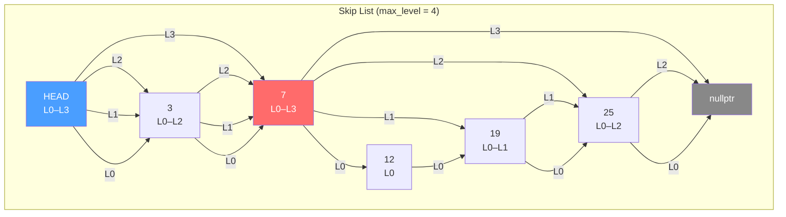

# Project 02 — STL-Compatible Skip List Container

> **Difficulty:** 🟡 Intermediate  |  **Time:** 8–12 hours  |  **Standard:** C++20 (`-std=c++20`)

## Prerequisites

| Topic | Why |
|---|---|
| Templates & concepts | Key constraint enforcement with `std::three_way_comparable` |
| Iterators | Forward-iterator interface for range-`for` and `<algorithm>` |
| Allocators | `std::allocator_traits` for pluggable memory |
| Probability | Geometric distribution governs level promotion |
| `operator<=>` | Spaceship operator for three-way node comparison |

## Learning Objectives

1. Design a probabilistic data structure with **O(log n)** search, insert, and erase.
2. Implement a **forward iterator** satisfying `std::forward_iterator`.
3. Wire up **allocator-aware** node management via `rebind` and `allocator_traits`.
4. Enforce key ordering at compile time with C++20 **concepts**.
5. Benchmark against `std::set` and reason about cache-line behaviour.

## Architecture



**Key insight:** each node stores a *variable-length* array of forward pointers. Searching starts at the highest level and drops down, yielding expected **O(log n)** hops.

## Step-by-Step Implementation

### `skip_list.hpp`

This is the complete skip list implementation as a header-only C++ template. It uses a randomized tower of linked lists where each higher level acts as an "express lane" for faster search — achieving O(log n) average-case lookup, insertion, and deletion. The `random_level()` function uses a geometric distribution (coin flips) to determine how many levels each new node participates in, and the template parameter `MaxLevel` caps the tower height. This demonstrates probabilistic data structures as a practical alternative to balanced trees, with simpler code and comparable performance.

```cpp
#pragma once
#include <cassert>
#include <cstddef>
#include <compare>
#include <concepts>
#include <functional>
#include <initializer_list>
#include <iterator>
#include <memory>
#include <random>
#include <utility>
#include <vector>

template <typename K>
concept OrderedKey = std::three_way_comparable<K>
                  && std::copyable<K>
                  && std::default_initializable<K>;

template <OrderedKey K, typename Alloc> class SkipList;
template <OrderedKey K>                 struct SkipNode;

template <OrderedKey K>
struct SkipNode {
    K                          key{};
    std::vector<SkipNode*>     forward;   // forward[i] = next at level i

    explicit SkipNode(int level)
        : forward(static_cast<std::size_t>(level + 1), nullptr) {}
    SkipNode(K k, int level)
        : key{std::move(k)},
          forward(static_cast<std::size_t>(level + 1), nullptr) {}
    [[nodiscard]] int level() const noexcept {
        return static_cast<int>(forward.size()) - 1;
    }
};
template <OrderedKey K>
class SkipListIterator {
public:
    using iterator_category = std::forward_iterator_tag;
    using value_type        = K;
    using difference_type   = std::ptrdiff_t;
    using pointer           = const K*;
    using reference         = const K&;
    SkipListIterator() noexcept = default;
    explicit SkipListIterator(SkipNode<K>* n) noexcept : node_{n} {}
    reference   operator*()  const noexcept { return node_->key; }
    pointer     operator->() const noexcept { return &node_->key; }
    SkipListIterator& operator++() noexcept {
        node_ = node_->forward[0];
        return *this;
    }
    SkipListIterator operator++(int) noexcept {
        auto tmp = *this; ++*this; return tmp;
    }
    bool operator==(const SkipListIterator& o) const noexcept = default;
private:
    SkipNode<K>* node_{nullptr};
    template <OrderedKey, typename> friend class SkipList;
};
static_assert(std::forward_iterator<SkipListIterator<int>>);
template <OrderedKey K, typename Alloc = std::allocator<K>>
class SkipList {
public:
    using key_type       = K;
    using value_type     = K;
    using size_type      = std::size_t;
    using difference_type= std::ptrdiff_t;
    using allocator_type = Alloc;
    using iterator       = SkipListIterator<K>;
    using const_iterator = iterator;  // keys are immutable
    static constexpr int kMaxLevel  = 16;
    static constexpr double kProb   = 0.5;

    explicit SkipList(const Alloc& alloc = Alloc{})
        : alloc_{alloc},
          head_{create_node(K{}, kMaxLevel)},
          gen_{std::random_device{}()} {}
    SkipList(std::initializer_list<K> init, const Alloc& alloc = Alloc{})
        : SkipList(alloc)
    {
        for (auto& k : init) insert(k);
    }
    ~SkipList() { clear(); destroy_node(head_); }
    SkipList(const SkipList&)            = delete;
    SkipList& operator=(const SkipList&) = delete;

    SkipList(SkipList&& o) noexcept
        : alloc_{std::move(o.alloc_)}, head_{o.head_},
          level_{o.level_}, size_{o.size_}, gen_{std::move(o.gen_)}
    {
        o.head_  = nullptr;
        o.size_  = 0;
        o.level_ = 0;
    }
    SkipList& operator=(SkipList&& o) noexcept {
        if (this != &o) {
            clear();
            destroy_node(head_);
            alloc_ = std::move(o.alloc_);
            head_  = o.head_;  level_ = o.level_;
            size_  = o.size_;  gen_   = std::move(o.gen_);
            o.head_ = nullptr; o.size_ = 0; o.level_ = 0;
        }
        return *this;
    }
    [[nodiscard]] bool      empty() const noexcept { return size_ == 0; }
    [[nodiscard]] size_type size()  const noexcept { return size_; }
    iterator begin() const noexcept { return iterator{head_->forward[0]}; }
    iterator end()   const noexcept { return iterator{nullptr}; }
    iterator find(const K& key) const noexcept {
        auto* x = head_;
        for (int i = level_; i >= 0; --i)
            while (x->forward[i] && (x->forward[i]->key <=> key) < 0)
                x = x->forward[i];
        x = x->forward[0];
        if (x && (x->key <=> key) == 0)
            return iterator{x};
        return end();
    }
    bool contains(const K& key) const noexcept {
        return find(key) != end();
    }

    std::pair<iterator, bool> insert(const K& key) {
        // collect update path
        std::vector<SkipNode<K>*> update(
            static_cast<size_type>(kMaxLevel + 1), nullptr);
        auto* x = head_;
        for (int i = level_; i >= 0; --i) {
            while (x->forward[i] && (x->forward[i]->key <=> key) < 0)
                x = x->forward[i];
            update[static_cast<size_type>(i)] = x;
        }
        x = x->forward[0];

        if (x && (x->key <=> key) == 0)
            return {iterator{x}, false};   // duplicate

        int new_level = random_level();
        if (new_level > level_) {
            for (int i = level_ + 1; i <= new_level; ++i)
                update[static_cast<size_type>(i)] = head_;
            level_ = new_level;
        }

        auto* node = create_node(key, new_level);
        for (int i = 0; i <= new_level; ++i) {
            auto idx = static_cast<size_type>(i);
            node->forward[idx]             = update[idx]->forward[idx];
            update[idx]->forward[idx]      = node;
        }
        ++size_;
        return {iterator{node}, true};
    }

    size_type erase(const K& key) {
        std::vector<SkipNode<K>*> update(
            static_cast<size_type>(kMaxLevel + 1), nullptr);
        auto* x = head_;
        for (int i = level_; i >= 0; --i) {
            while (x->forward[i] && (x->forward[i]->key <=> key) < 0)
                x = x->forward[i];
            update[static_cast<size_type>(i)] = x;
        }
        x = x->forward[0];

        if (!x || (x->key <=> key) != 0)
            return 0;  // not found

        for (int i = 0; i <= level_; ++i) {
            auto idx = static_cast<size_type>(i);
            if (update[idx]->forward[idx] != x) break;
            update[idx]->forward[idx] = x->forward[idx];
        }
        destroy_node(x);
        while (level_ > 0 && head_->forward[static_cast<size_type>(level_)] == nullptr)
            --level_;
        --size_;
        return 1;
    }

    iterator erase(iterator pos) {
        if (pos == end()) return end();
        auto next_it = std::next(pos);
        erase(*pos);
        return next_it;
    }

    void clear() noexcept {
        auto* x = head_ ? head_->forward[0] : nullptr;
        while (x) {
            auto* next = x->forward[0];
            destroy_node(x);
            x = next;
        }
        if (head_) {
            for (auto& ptr : head_->forward) ptr = nullptr;
        }
        level_ = 0;
        size_  = 0;
    }

    friend auto operator<=>(const SkipList& a, const SkipList& b) {
        return std::lexicographical_compare_three_way(
            a.begin(), a.end(), b.begin(), b.end());
    }
    friend bool operator==(const SkipList& a, const SkipList& b) {
        if (a.size() != b.size()) return false;
        return (a <=> b) == 0;
    }

    allocator_type get_allocator() const noexcept { return alloc_; }

    [[nodiscard]] std::vector<int> level_histogram() const {
        std::vector<int> hist(static_cast<size_type>(kMaxLevel + 1), 0);
        for (auto* n = head_->forward[0]; n; n = n->forward[0])
            ++hist[static_cast<size_type>(n->level())];
        return hist;
    }

private:
    using NodeAlloc = typename std::allocator_traits<Alloc>
                        ::template rebind_alloc<SkipNode<K>>;
    using NodeTraits = std::allocator_traits<NodeAlloc>;

    NodeAlloc         alloc_;
    SkipNode<K>*      head_{nullptr};
    int               level_{0};
    size_type         size_{0};
    std::mt19937      gen_;

    int random_level() {
        int lvl = 0;
        std::bernoulli_distribution coin(kProb);
        while (coin(gen_) && lvl < kMaxLevel) ++lvl;
        return lvl;
    }

    SkipNode<K>* create_node(const K& key, int lvl) {
        NodeAlloc na{alloc_};
        auto* p = NodeTraits::allocate(na, 1);
        NodeTraits::construct(na, p, key, lvl);
        return p;
    }

    void destroy_node(SkipNode<K>* p) {
        if (!p) return;
        NodeAlloc na{alloc_};
        NodeTraits::destroy(na, p);
        NodeTraits::deallocate(na, p, 1);
    }
};
```

### Companion Test File — `skip_list_test.cpp`

```cpp
#include "skip_list.hpp"
#include <algorithm>
#include <cassert>
#include <iostream>
#include <numeric>
#include <ranges>
#include <string>
#include <vector>

#define ASSERT_EQ(a, b)  assert((a) == (b))
#define ASSERT_TRUE(x)   assert((x))
#define ASSERT_FALSE(x)  assert(!(x))

void test_insert_find_erase() {
    SkipList<int> sl;
    auto [it1, ok1] = sl.insert(10);
    ASSERT_TRUE(ok1);  ASSERT_EQ(*it1, 10);
    auto [it2, ok2] = sl.insert(10);
    ASSERT_FALSE(ok2); ASSERT_EQ(*it2, 10);  // duplicate rejected
    sl.insert(5); sl.insert(20); sl.insert(15);
    ASSERT_EQ(sl.size(), 4u);
    ASSERT_TRUE(sl.contains(5));
    ASSERT_FALSE(sl.contains(99));
    // find
    ASSERT_EQ(*sl.find(15), 15);
    ASSERT_TRUE(sl.find(42) == sl.end());
    // erase by key
    ASSERT_EQ(sl.erase(15), 1u);
    ASSERT_EQ(sl.erase(15), 0u);
    ASSERT_FALSE(sl.contains(15));
    // erase via iterator
    auto it = sl.find(10);
    auto next = sl.erase(it);
    ASSERT_EQ(sl.size(), 2u);
    if (next != sl.end()) ASSERT_EQ(*next, 20);
    std::cout << "  [PASS] insert / find / erase\n";
}

void test_sorted_order() {
    SkipList<int> sl{30, 10, 50, 20, 40};
    std::vector<int> out(sl.begin(), sl.end());
    ASSERT_EQ(out, (std::vector<int>{10, 20, 30, 40, 50}));
    std::cout << "  [PASS] sorted iteration\n";
}

void test_clear_and_reuse() {
    SkipList<int> sl{1, 2, 3};
    sl.clear();
    ASSERT_TRUE(sl.empty());
    ASSERT_TRUE(sl.begin() == sl.end());
    sl.insert(42);
    ASSERT_EQ(sl.size(), 1u);
    std::cout << "  [PASS] clear & reuse\n";
}

void test_move_semantics() {
    SkipList<int> a{1, 2, 3};
    SkipList<int> b{std::move(a)};
    ASSERT_EQ(b.size(), 3u);
    ASSERT_TRUE(b.contains(2));
    SkipList<int> c;
    c = std::move(b);
    ASSERT_EQ(c.size(), 3u);
    std::cout << "  [PASS] move semantics\n";
}

void test_comparison() {
    SkipList<int> a{1, 2, 3}, b{1, 2, 3}, c{1, 2, 4};
    ASSERT_TRUE(a == b);
    ASSERT_TRUE((a <=> c) < 0);
    ASSERT_TRUE((c <=> a) > 0);
    std::cout << "  [PASS] operator<=> & ==\n";
}

void test_string_keys() {
    SkipList<std::string> sl;
    sl.insert("banana"); sl.insert("apple"); sl.insert("cherry");
    std::vector<std::string> out(sl.begin(), sl.end());
    ASSERT_EQ(out, (std::vector<std::string>{"apple", "banana", "cherry"}));
    std::cout << "  [PASS] string keys\n";
}

void test_large_scale() {
    SkipList<int> sl;
    constexpr int N = 10'000;
    std::vector<int> vals(N);
    std::iota(vals.begin(), vals.end(), 0);
    std::mt19937 rng{42};
    std::ranges::shuffle(vals, rng);
    for (int v : vals) sl.insert(v);
    ASSERT_EQ(sl.size(), static_cast<std::size_t>(N));
    int prev = -1;
    for (int k : sl) { ASSERT_TRUE(k > prev); prev = k; }
    std::cout << "  [PASS] large-scale (N=" << N << ")\n";
}

void test_stl_compat() {
    SkipList<int> sl{5, 3, 8, 1, 9};
    ASSERT_EQ(*std::find(sl.begin(), sl.end(), 8), 8);
    ASSERT_EQ(std::accumulate(sl.begin(), sl.end(), 0), 26);
    ASSERT_EQ(std::ranges::count_if(sl, [](int x){ return x > 4; }), 3);
    std::cout << "  [PASS] STL algorithm compatibility\n";
}

void test_level_distribution() {
    SkipList<int> sl;
    for (int i = 0; i < 1000; ++i) sl.insert(i);
    auto hist = sl.level_histogram();
    ASSERT_TRUE(hist[0] > 0);
    std::cout << "  [PASS] level distribution (L0=" << hist[0] << ")\n";
}

int main() {
    std::cout << "=== SkipList Test Suite ===\n";
    test_insert_find_erase();
    test_sorted_order();
    test_clear_and_reuse();
    test_move_semantics();
    test_comparison();
    test_string_keys();
    test_large_scale();
    test_stl_compat();
    test_level_distribution();
    std::cout << "=== All tests passed ===\n";
}
```

**Compile & run:**

```bash
g++ -std=c++20 -O2 -Wall -Wextra -o skip_test skip_list_test.cpp && ./skip_test
```

## Testing Strategy

| Layer | What to verify | Method |
|---|---|---|
| **Unit** | insert/find/erase, duplicates rejected | Assert-based tests above |
| **Ordering** | Iteration yields sorted output | Shuffle N values, insert, verify monotone |
| **Iterator** | `std::forward_iterator` satisfied | `static_assert` in header |
| **Edge cases** | Empty list, single element, clear-then-reuse | `test_clear`, erase first/last |
| **STL compat** | Works with `<algorithm>` and `<ranges>` | `std::find`, `std::accumulate`, `ranges::count_if` |

## Performance Analysis

| Operation | Expected | Worst case |
|---|---|---|
| `insert` | O(log n) | O(n) — astronomically unlikely |
| `find` | O(log n) | O(n) |
| `erase` | O(log n) | O(n) |
| `begin` / `++` | O(1) | O(1) |
| Space | O(n) expected | O(n log n) theoretical max |

**`std::set` comparison:** Skip lists have higher constant factors (pointer chasing across levels) and `std::set` (red-black tree) is cache-friendlier for small keys. However, skip lists win on **lock-free concurrent extensions** and at N > 100k both converge to similar O(log n) scaling. Benchmark with shuffled input — sorted insertion doesn't exercise multi-level search.

## Extensions & Challenges

1. **Bidirectional iterator** — add `backward` pointer to each node; update on insert/erase.
2. **`lower_bound` / `upper_bound`** — stop descent one step earlier; mirrors `std::set` API.
3. **Concurrent skip list** — use `std::atomic` per-level forward pointers with CAS-based insert.
4. **Custom comparator** — template on `Compare = std::less<K>` instead of requiring `<=>`.
5. **Memory pool allocator** — write a `PoolAllocator<SkipNode<K>>` and benchmark throughput.
6. **`std::pmr` support** — use `std::pmr::polymorphic_allocator` for arena-based allocation.

## Key Takeaways

1. **Probabilistic ≠ unreliable.** With p = 0.5, expected height is log₂ n; catastrophic imbalance probability is negligible (< 1/n²).
2. **Allocator awareness** via `rebind_alloc` + `allocator_traits` makes your container a first-class citizen in any allocator ecosystem.
3. **Concepts enforce invariants at compile time** — `OrderedKey` prevents instantiation with types lacking `<=>`.
4. **Iterator design is the gateway to STL interop.** Satisfying `std::forward_iterator` unlocks range-`for`, `<algorithm>`, and `<ranges>`.
5. **`operator<=>`** on containers composes naturally via `std::lexicographical_compare_three_way`.
