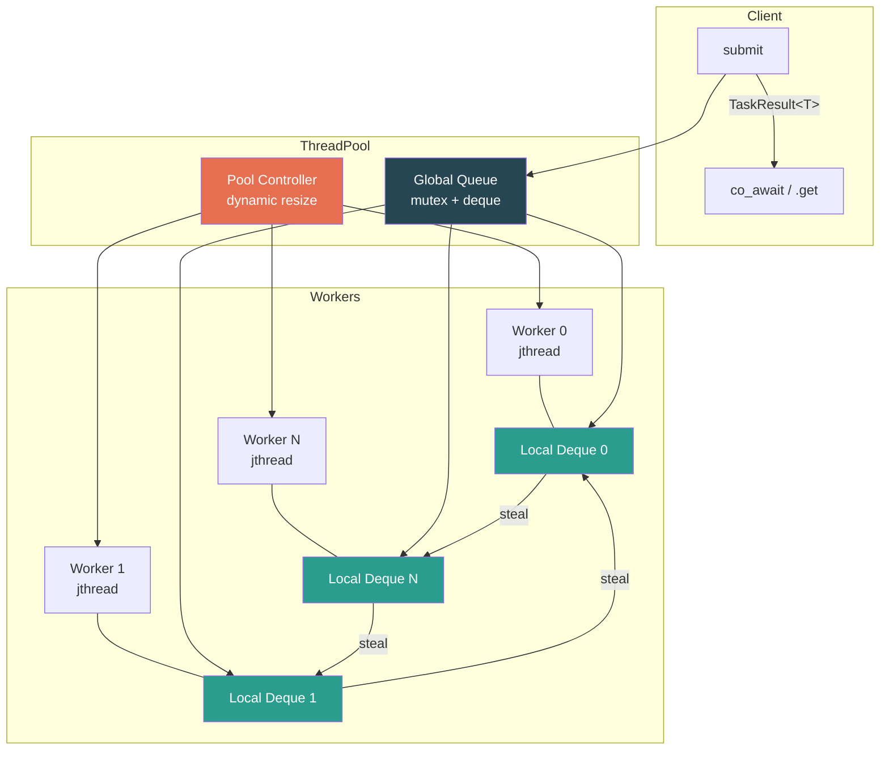

# P03 — Lock-Free Thread Pool with C++20/23

> **Difficulty:** 🟡 Intermediate · **Time:** 6–8 hours · **Standard:** C++23 · **Flags:** `-std=c++23 -pthread`

---

## Prerequisites

| Topic | Why |
|---|---|
| `std::jthread` / `stop_token` | Cooperative cancellation for shutdown |
| `std::atomic`, `std::mutex` | Queue synchronisation primitives |
| Move semantics | Tasks are type-erased callables moved into the pool |
| `std::expected` (C++23) | Error propagation without exceptions on the hot path |
| Coroutine basics (`co_await`) | Callers suspend until a result is ready |

## Learning Objectives

1. Design a **Chase–Lev work-stealing deque** for per-thread task queues.
2. Use `std::jthread` + `stop_token` for **cooperative shutdown**.
3. Model results as **awaitables** so callers can `co_await` completion.
4. Return errors via `std::expected` instead of throwing across threads.
5. Implement **dynamic pool sizing** — grow under load, shrink when idle.
6. Measure **throughput, latency, and contention**.

---

## Architecture



**Flow:** `submit()` → global queue → worker drains to local deque (LIFO pop, cache-warm) → idle workers **steal** from peers (FIFO, oldest task) → controller spawns/retires threads.

---

## Implementation

### thread_pool.hpp

```cpp
#pragma once
#include <atomic>
#include <cassert>
#include <concepts>
#include <coroutine>
#include <deque>
#include <expected>
#include <functional>
#include <memory>
#include <mutex>
#include <random>
#include <semaphore>
#include <stop_token>
#include <thread>
#include <vector>

#ifdef __cpp_lib_hardware_interference_size
inline constexpr std::size_t kCacheLine = std::hardware_destructive_interference_size;
#else
inline constexpr std::size_t kCacheLine = 64;
#endif

enum class PoolError { Shutdown, QueueFull, InvalidTask };

// ── Circular buffer for Chase-Lev deque ─────────────────────────────
template <typename T>
struct CircularBuffer {
    explicit CircularBuffer(int32_t cap)
        : cap_{cap}, mask_{cap - 1}, buf_{std::make_unique<T[]>(cap)} {
        assert((cap & (cap - 1)) == 0);
    }
    T    load(int32_t i) const noexcept { return buf_[i & mask_]; }
    void store(int32_t i, T v) noexcept { buf_[i & mask_] = v; }
    int32_t capacity() const noexcept   { return cap_; }

    std::unique_ptr<CircularBuffer> grow(int32_t bot, int32_t top) const {
        auto nb = std::make_unique<CircularBuffer>(cap_ * 2);
        for (int32_t i = top; i < bot; ++i) nb->store(i, load(i));
        return nb;
    }
private:
    int32_t cap_, mask_;
    std::unique_ptr<T[]> buf_;
};

// ── Chase-Lev work-stealing deque ───────────────────────────────────
class WorkStealingDeque {
    using Task = std::function<void()>;
public:
    WorkStealingDeque()
        : bottom_{0}, top_{0},
          buf_{new CircularBuffer<Task>(64)} {}

    void push(Task task) {
        int32_t b = bottom_.load(std::memory_order_relaxed);
        int32_t t = top_.load(std::memory_order_acquire);
        auto* a   = buf_.load(std::memory_order_relaxed);
        if (b - t >= a->capacity()) {
            auto g = a->grow(b, t);
            old_.emplace_back(a);
            a = g.release();
            buf_.store(a, std::memory_order_release);
        }
        a->store(b, std::move(task));
        std::atomic_thread_fence(std::memory_order_release);
        bottom_.store(b + 1, std::memory_order_relaxed);
    }

    std::expected<Task, PoolError> pop() {
        int32_t b = bottom_.load(std::memory_order_relaxed) - 1;
        bottom_.store(b, std::memory_order_relaxed);
        auto* a = buf_.load(std::memory_order_relaxed);
        std::atomic_thread_fence(std::memory_order_seq_cst);
        int32_t t = top_.load(std::memory_order_relaxed);
        if (t <= b) {
            Task task = a->load(b);
            if (t == b) {
                if (!top_.compare_exchange_strong(t, t + 1,
                        std::memory_order_seq_cst, std::memory_order_relaxed)) {
                    bottom_.store(t + 1, std::memory_order_relaxed);
                    return std::unexpected{PoolError::QueueFull};
                }
                bottom_.store(t + 1, std::memory_order_relaxed);
            }
            return task;
        }
        bottom_.store(t, std::memory_order_relaxed);
        return std::unexpected{PoolError::QueueFull};
    }

    std::expected<Task, PoolError> steal() {
        int32_t t = top_.load(std::memory_order_acquire);
        std::atomic_thread_fence(std::memory_order_seq_cst);
        int32_t b = bottom_.load(std::memory_order_acquire);
        if (t < b) {
            Task task = buf_.load(std::memory_order_relaxed)->load(t);
            if (!top_.compare_exchange_strong(t, t + 1,
                    std::memory_order_seq_cst, std::memory_order_relaxed))
                return std::unexpected{PoolError::QueueFull};
            return task;
        }
        return std::unexpected{PoolError::QueueFull};
    }

    int32_t size() const noexcept {
        int32_t s = bottom_.load(std::memory_order_relaxed)
                  - top_.load(std::memory_order_relaxed);
        return s > 0 ? s : 0;
    }

private:
    alignas(kCacheLine) std::atomic<int32_t> bottom_;
    alignas(kCacheLine) std::atomic<int32_t> top_;
    std::atomic<CircularBuffer<Task>*> buf_;
    std::vector<std::unique_ptr<CircularBuffer<Task>>> old_;
};

// ── Shared state + awaitable result ─────────────────────────────────
template <typename T>
struct SharedState {
    std::atomic<bool>            ready{false};
    std::expected<T, PoolError>  result{std::unexpected{PoolError::Shutdown}};
    std::coroutine_handle<>      waiter{nullptr};
    std::mutex                   mtx;

    void set_value(T val) {
        { std::lock_guard lk(mtx); result = std::move(val); ready.store(true, std::memory_order_release); }
        if (waiter) waiter.resume();
    }
    void set_error(PoolError e) {
        { std::lock_guard lk(mtx); result = std::unexpected{e}; ready.store(true, std::memory_order_release); }
        if (waiter) waiter.resume();
    }
};

template <typename T>
class TaskResult {
public:
    explicit TaskResult(std::shared_ptr<SharedState<T>> s) : st_{std::move(s)} {}

    bool await_ready() const noexcept { return st_->ready.load(std::memory_order_acquire); }
    void await_suspend(std::coroutine_handle<> h) { st_->waiter = h; }
    std::expected<T, PoolError> await_resume() { return std::move(st_->result); }

    std::expected<T, PoolError> get() {
        while (!st_->ready.load(std::memory_order_acquire))
            std::this_thread::yield();
        return std::move(st_->result);
    }
private:
    std::shared_ptr<SharedState<T>> st_;
};

// ── Thread Pool ─────────────────────────────────────────────────────
class ThreadPool {
public:
    explicit ThreadPool(uint32_t min_th = std::thread::hardware_concurrency(),
                        uint32_t max_th = std::thread::hardware_concurrency() * 2)
        : min_th_{min_th}, max_th_{max_th}, notify_{0} {
        deques_.resize(max_th_);
        for (auto& d : deques_) d = std::make_unique<WorkStealingDeque>();
        for (uint32_t i = 0; i < min_th_; ++i) spawn(i);
    }
    ~ThreadPool() { shutdown(); }
    ThreadPool(const ThreadPool&) = delete;
    ThreadPool& operator=(const ThreadPool&) = delete;

    template <std::invocable F, typename T = std::invoke_result_t<F>>
    TaskResult<T> submit(F&& func) {
        auto state = std::make_shared<SharedState<T>>();
        auto wrapper = [f = std::forward<F>(func), st = state]() mutable {
            try { st->set_value(f()); }
            catch (...) { st->set_error(PoolError::InvalidTask); }
        };
        { std::lock_guard lk(gq_mtx_); gq_.push_back(std::move(wrapper)); }
        notify_.release();
        maybe_grow();
        return TaskResult<T>{state};
    }

    void shutdown() {
        if (stopped_.exchange(true)) return;
        for (auto& w : workers_) w.request_stop();
        for (std::size_t i = 0; i < workers_.size() + 4; ++i) notify_.release();
        workers_.clear();
    }

    uint32_t worker_count() const noexcept { return static_cast<uint32_t>(workers_.size()); }

private:
    void worker_loop(std::stop_token st, uint32_t id) {
        thread_local std::mt19937 rng{std::random_device{}()};
        while (!st.stop_requested()) {
            if (auto t = deques_[id]->pop()) { (*t)(); continue; }

            uint32_t wc = active_.load(std::memory_order_relaxed);
            if (wc > 1) {
                std::uniform_int_distribution<uint32_t> dist(0, wc - 1);
                for (uint32_t a = 0; a < 3; ++a) {
                    uint32_t v = dist(rng);
                    if (v != id) if (auto t = deques_[v]->steal()) { (*t)(); goto next; }
                }
            }
            {
                std::function<void()> task;
                { std::lock_guard lk(gq_mtx_); if (!gq_.empty()) { task = std::move(gq_.front()); gq_.pop_front(); } }
                if (task) { deques_[id]->push(std::move(task)); continue; }
            }
            notify_.try_acquire_for(std::chrono::microseconds(500));
            next:;
        }
    }

    void spawn(uint32_t id) {
        workers_.emplace_back([this, id](std::stop_token s) { worker_loop(s, id); });
        active_.fetch_add(1, std::memory_order_relaxed);
    }

    void maybe_grow() {
        uint32_t cur = active_.load(std::memory_order_relaxed);
        if (cur >= max_th_) return;
        std::lock_guard lk(gq_mtx_);
        if (gq_.size() > cur * 2) spawn(cur);
    }

    uint32_t min_th_, max_th_;
    std::atomic<bool> stopped_{false};
    std::atomic<uint32_t> active_{0};
    mutable std::mutex gq_mtx_;
    std::deque<std::function<void()>> gq_;
    std::vector<std::unique_ptr<WorkStealingDeque>> deques_;
    std::vector<std::jthread> workers_;
    std::counting_semaphore<> notify_;
};
```

### main.cpp — Driver & Benchmark

```cpp
#include "thread_pool.hpp"
#include <chrono>
#include <cstdio>
#include <vector>

int main() {
    using namespace std::chrono;
    constexpr int N = 100'000;
    ThreadPool pool{4, 8};

    std::vector<TaskResult<int>> results;
    results.reserve(N);
    auto t0 = steady_clock::now();

    for (int i = 0; i < N; ++i)
        results.push_back(pool.submit([i] {
            int s = 0;
            for (int j = 0; j < 100; ++j) s += (i + j) * (i - j);
            return s;
        }));

    int ok = 0, err = 0;
    for (auto& r : results) { if (r.get().has_value()) ++ok; else ++err; }

    auto us = duration_cast<microseconds>(steady_clock::now() - t0).count();
    std::printf("Tasks: %d  OK/Err: %d/%d  Workers: %u\n", N, ok, err, pool.worker_count());
    std::printf("Elapsed: %ld µs  Throughput: %.2f M tasks/s\n", us, N / (us / 1e6) / 1e6);

    pool.shutdown();
    auto late = pool.submit([] { return 42; });
    if (!late.get().has_value())
        std::printf("Post-shutdown submit correctly returned error.\n");
}
```

**Build:** `g++ -std=c++23 -O2 -pthread -o pool main.cpp && ./pool`

---

## Testing Strategy

| Test | Verifies |
|------|----------|
| Submit 1 task, check result | Basic round-trip |
| Submit 50 000 tasks, verify `i*i` | No lost tasks under load |
| `shutdown()` then `submit()` | Returns `PoolError::Shutdown` |
| Recursive submit (task submits task) | No deadlock with stealing |
| Single-thread pool, 1 000 tasks | Correctness without concurrency |

```cpp
// stress_test.cpp
#include "thread_pool.hpp"
#include <cassert>
#include <cstdio>
#include <atomic>

void test_correctness() {
    ThreadPool pool{4};
    std::atomic<int> ctr{0};
    constexpr int N = 50'000;
    std::vector<TaskResult<int>> futs;
    futs.reserve(N);
    for (int i = 0; i < N; ++i)
        futs.push_back(pool.submit([&ctr, i] { ctr.fetch_add(1); return i * i; }));
    for (int i = 0; i < N; ++i) { auto v = futs[i].get(); assert(v.has_value() && *v == i * i); }
    assert(ctr.load() == N);
    std::printf("[PASS] correctness: %d tasks\n", N);
}

void test_work_stealing() {
    ThreadPool pool{4};
    constexpr int N = 40'000;
    std::atomic<int> done{0};
    std::vector<TaskResult<int>> futs;
    for (int i = 0; i < N; ++i)
        futs.push_back(pool.submit([&done] {
            volatile int x = 0; for (int j = 0; j < 200; ++j) x += j;
            done.fetch_add(1); return int(x);
        }));
    for (auto& f : futs) f.get();
    assert(done.load() == N);
    std::printf("[PASS] work-stealing: %d tasks\n", N);
}

int main() { test_correctness(); test_work_stealing(); std::printf("All passed.\n"); }
```

**Build with sanitizers:** `g++ -std=c++23 -O1 -g -fsanitize=thread -pthread -o stress stress_test.cpp`

---

## Performance Analysis

| Metric | How to Measure | Target (8-core) |
|--------|---------------|-----------------|
| Throughput | tasks / wall-clock sec | > 2 M tasks/s |
| Submit latency | instrument `submit()` → dequeue | < 1 µs p50 |
| Steal rate | count `steal()` successes | > 30 % under load |
| Contention | `perf stat -e cache-misses` | Minimal cross-core bouncing |

```bash
perf stat -e task-clock,cache-misses,context-switches ./pool
```

**Expected scaling:** near-linear to physical core count, then diminishing returns as hyper-threads share execution units and the global-queue mutex becomes the bottleneck.

---

## Extensions & Challenges

| # | Challenge | Hint |
|---|-----------|------|
| 🔵 | **Priority tasks** | `std::priority_queue` for the global queue |
| 🔵 | **Task cancellation** | Thread `stop_token` into each wrapper |
| 🟡 | **Lock-free global queue** | Michael–Scott queue replaces mutex deque |
| 🟡 | **Task DAG scheduling** | Tasks declare deps; schedule when predecessors finish |
| 🔴 | **NUMA-aware stealing** | Pin workers to nodes; prefer same-node steals |
| 🔴 | **Coroutine Task\<T\>** | Full coroutine return type for `co_await pool.submit(...)` |

---

## Key Takeaways

1. **LIFO pop / FIFO steal** — owner gets cache-warm work; thief takes oldest independent task.
2. **`jthread` + `stop_token`** — destructor requests stop *and* joins; no flag + `join()` boilerplate.
3. **`std::expected`** — errors are values, not stack-unwinding events; critical on the hot path.
4. **Dynamic sizing is a trade-off** — growing helps latency; retiring saves resources. Tune the heuristic.
5. **Always profile under realistic load** — mix CPU- and I/O-bound tasks to see real contention.

---

*Next → [P04 — GPU-Accelerated Matrix Multiply (CUDA)](P04_GPU_MatMul.md)*
