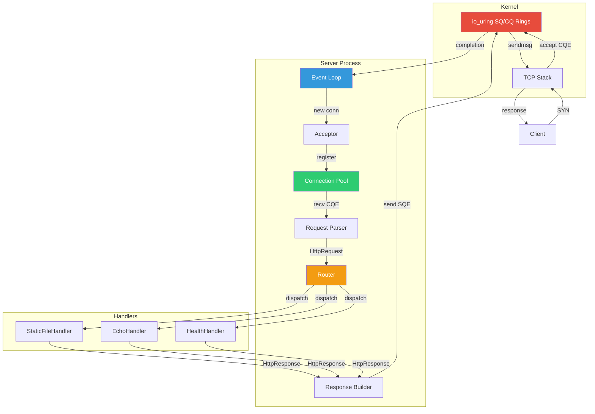

# Project 04 — Async HTTP/1.1 Server with io_uring

## Difficulty: 🔴 Advanced

Build a fully asynchronous HTTP/1.1 server from scratch using Linux io_uring for non-blocking I/O,
modern C++20 features, and zero-copy techniques. The server handles concurrent connections with
keep-alive support, connection pooling, and a CRTP-based handler framework.

---

## Prerequisites

| Topic | Why It Matters |
|---|---|
| Linux socket API | `socket()`, `bind()`, `listen()`, `accept()` lifecycle |
| io_uring / epoll | Kernel async I/O submission and completion rings |
| HTTP/1.1 (RFC 9110/9112) | Request line, headers, chunked encoding, keep-alive |
| C++20 concepts & std::format | Constraining templates, modern formatted output |
| CRTP pattern | Static polymorphism for zero-overhead handler dispatch |
| Move semantics & RAII | Ownership of sockets and buffers without leaks |

## Learning Objectives

By completing this project you will be able to:

1. Implement a non-blocking TCP acceptor using io_uring submission/completion queues
2. Parse HTTP/1.1 requests incrementally from a byte stream
3. Build HTTP responses with proper status lines, headers, and content-length
4. Apply CRTP to create statically-dispatched request handlers with zero virtual-call overhead
5. Manage connection lifecycles including keep-alive timeouts and connection reuse
6. Profile throughput under load using `wrk` and analyze kernel-bypass benefits

---

## Architecture



### Data Flow

```
Client ──TCP──► io_uring CQ ──► EventLoop ──► Acceptor / RecvHandler
                                                    │
                                              RequestParser
                                                    │
                                               Router::dispatch()
                                                    │
                                         Handler<Derived>::handle()
                                                    │
                                             ResponseBuilder
                                                    │
                                EventLoop ──► io_uring SQ ──TCP──► Client
```

---

## Step-by-Step Implementation

### Step 0 — Compile-Time Configuration

```cpp
// config.hpp
#pragma once
#include <cstdint>
#include <cstddef>
#include <string_view>

namespace http::config {

constexpr uint16_t    kDefaultPort       = 8080;
constexpr size_t      kMaxConnections    = 1024;
constexpr size_t      kRecvBufferSize    = 8192;
constexpr size_t      kMaxHeaderSize     = 4096;
constexpr size_t      kMaxHeaders        = 64;
constexpr size_t      kUringQueueDepth   = 256;
constexpr int         kKeepAliveTimeout  = 30;        // seconds
constexpr int         kBacklog           = 128;
constexpr std::string_view kServerName   = "cpphttp/0.1";

// Compile-time validation
static_assert(kMaxConnections > 0 && kMaxConnections <= 65535);
static_assert(kRecvBufferSize >= 1024);
static_assert(kUringQueueDepth >= 64 && (kUringQueueDepth & (kUringQueueDepth - 1)) == 0,
              "Queue depth must be a power of two");

} // namespace http::config
```

### Step 1 — HTTP Types and Request Parser

```cpp
// http_types.hpp
#pragma once
#include <string>
#include <string_view>
#include <vector>
#include <optional>
#include <charconv>
#include <algorithm>
#include <format>
#include "config.hpp"

namespace http {

enum class Method : uint8_t { GET, HEAD, POST, PUT, DELETE_, OPTIONS, UNKNOWN };
enum class StatusCode : uint16_t {
    OK = 200, NoContent = 204, BadRequest = 400,
    NotFound = 404, MethodNotAllowed = 405, RequestTimeout = 408,
    EntityTooLarge = 413, InternalError = 500, NotImplemented = 501
};

struct Header {
    std::string_view name;
    std::string_view value;
};

struct HttpRequest {
    Method                    method{Method::UNKNOWN};
    std::string_view          uri;
    std::string_view          version;          // "HTTP/1.1"
    std::vector<Header>       headers;
    std::string_view          body;
    bool                      keep_alive{true}; // HTTP/1.1 default

    [[nodiscard]] std::optional<std::string_view> header(std::string_view name) const {
        for (auto& h : headers) {
            if (std::ranges::equal(h.name, name, [](char a, char b) {
                return std::tolower(static_cast<unsigned char>(a))
                    == std::tolower(static_cast<unsigned char>(b));
            })) {
                return h.value;
            }
        }
        return std::nullopt;
    }

    [[nodiscard]] std::optional<size_t> content_length() const {
        if (auto val = header("Content-Length")) {
            size_t len{};
            auto [ptr, ec] = std::from_chars(val->data(), val->data() + val->size(), len);
            if (ec == std::errc{}) return len;
        }
        return std::nullopt;
    }
};

// ── Incremental HTTP/1.1 Request Parser ─────────────────────────────

enum class ParseResult : uint8_t { Incomplete, Complete, Error };

class RequestParser {
public:
    void reset() {
        state_ = State::RequestLine;
        request_ = {};
        header_count_ = 0;
        body_remaining_ = 0;
    }

    // Feed raw bytes; returns parse status.  On Complete, request() is valid.
    [[nodiscard]] ParseResult feed(std::string_view data) {
        buf_.append(data);

        while (true) {
            switch (state_) {
            case State::RequestLine: {
                auto pos = buf_.find("\r\n", scan_offset_);
                if (pos == std::string::npos) {
                    scan_offset_ = buf_.size() > 1 ? buf_.size() - 1 : 0;
                    return ParseResult::Incomplete;
                }
                if (!parse_request_line(std::string_view{buf_}.substr(0, pos)))
                    return ParseResult::Error;
                buf_.erase(0, pos + 2);
                scan_offset_ = 0;
                state_ = State::Headers;
                break;
            }
            case State::Headers: {
                auto pos = buf_.find("\r\n", scan_offset_);
                if (pos == std::string::npos) {
                    scan_offset_ = buf_.size() > 1 ? buf_.size() - 1 : 0;
                    return ParseResult::Incomplete;
                }
                if (pos == 0) {
                    // Empty line = end of headers
                    buf_.erase(0, 2);
                    scan_offset_ = 0;
                    finalize_headers();
                    if (body_remaining_ > 0) {
                        state_ = State::Body;
                        break;
                    }
                    state_ = State::Done;
                    return ParseResult::Complete;
                }
                if (++header_count_ > config::kMaxHeaders)
                    return ParseResult::Error;

                auto line = std::string_view{buf_}.substr(0, pos);
                if (!parse_header(line))
                    return ParseResult::Error;

                buf_.erase(0, pos + 2);
                scan_offset_ = 0;
                break;
            }
            case State::Body: {
                if (buf_.size() < body_remaining_)
                    return ParseResult::Incomplete;
                body_storage_ = buf_.substr(0, body_remaining_);
                request_.body  = body_storage_;
                buf_.erase(0, body_remaining_);
                state_ = State::Done;
                return ParseResult::Complete;
            }
            case State::Done:
                return ParseResult::Complete;
            }
        }
    }

    [[nodiscard]] const HttpRequest& request() const { return request_; }

private:
    enum class State : uint8_t { RequestLine, Headers, Body, Done };

    bool parse_request_line(std::string_view line) {
        auto sp1 = line.find(' ');
        if (sp1 == std::string_view::npos) return false;
        auto sp2 = line.find(' ', sp1 + 1);
        if (sp2 == std::string_view::npos) return false;

        auto method_sv = line.substr(0, sp1);
        request_.uri     = store(line.substr(sp1 + 1, sp2 - sp1 - 1));
        request_.version = store(line.substr(sp2 + 1));

        if      (method_sv == "GET")     request_.method = Method::GET;
        else if (method_sv == "HEAD")    request_.method = Method::HEAD;
        else if (method_sv == "POST")    request_.method = Method::POST;
        else if (method_sv == "PUT")     request_.method = Method::PUT;
        else if (method_sv == "DELETE")  request_.method = Method::DELETE_;
        else if (method_sv == "OPTIONS") request_.method = Method::OPTIONS;
        else                             request_.method = Method::UNKNOWN;

        return true;
    }

    bool parse_header(std::string_view line) {
        auto colon = line.find(':');
        if (colon == std::string_view::npos) return false;
        auto name  = line.substr(0, colon);
        auto value = line.substr(colon + 1);
        // Trim leading whitespace from value
        while (!value.empty() && value.front() == ' ') value.remove_prefix(1);
        request_.headers.push_back({store(name), store(value)});
        return true;
    }

    void finalize_headers() {
        if (auto cl = request_.content_length())
            body_remaining_ = *cl;

        if (auto conn = request_.header("Connection")) {
            request_.keep_alive = (*conn != "close");
        } else {
            request_.keep_alive = (request_.version == "HTTP/1.1");
        }
    }

    // Store string data so string_views remain valid after buf_ mutations.
    std::string_view store(std::string_view sv) {
        auto& s = string_pool_.emplace_back(sv);
        return s;
    }

    State                       state_{State::RequestLine};
    HttpRequest                 request_;
    std::string                 buf_;
    std::string                 body_storage_;
    std::vector<std::string>    string_pool_;
    size_t                      scan_offset_{0};
    size_t                      header_count_{0};
    size_t                      body_remaining_{0};
};

} // namespace http
```

### Step 2 — Response Builder

```cpp
// http_response.hpp
#pragma once
#include <string>
#include <format>
#include <chrono>
#include "http_types.hpp"

namespace http {

[[nodiscard]] constexpr std::string_view status_text(StatusCode code) {
    switch (code) {
        case StatusCode::OK:               return "OK";
        case StatusCode::NoContent:        return "No Content";
        case StatusCode::BadRequest:       return "Bad Request";
        case StatusCode::NotFound:         return "Not Found";
        case StatusCode::MethodNotAllowed: return "Method Not Allowed";
        case StatusCode::RequestTimeout:   return "Request Timeout";
        case StatusCode::EntityTooLarge:   return "Payload Too Large";
        case StatusCode::InternalError:    return "Internal Server Error";
        case StatusCode::NotImplemented:   return "Not Implemented";
    }
    return "Unknown";
}

class ResponseBuilder {
public:
    ResponseBuilder& status(StatusCode code) {
        code_ = code;
        return *this;
    }

    ResponseBuilder& header(std::string_view name, std::string_view value) {
        std::format_to(std::back_inserter(headers_buf_), "{}: {}\r\n", name, value);
        return *this;
    }

    ResponseBuilder& content_type(std::string_view mime) {
        return header("Content-Type", mime);
    }

    ResponseBuilder& body(std::string_view data) {
        body_ = data;
        return *this;
    }

    ResponseBuilder& keep_alive(bool enabled) {
        keep_alive_ = enabled;
        return *this;
    }

    [[nodiscard]] std::string build() const {
        std::string out;
        out.reserve(256 + body_.size());

        auto now  = std::chrono::system_clock::now();
        auto time = std::chrono::system_clock::to_time_t(now);
        char date_buf[64];
        std::strftime(date_buf, sizeof(date_buf), "%a, %d %b %Y %H:%M:%S GMT",
                      std::gmtime(&time));

        std::format_to(std::back_inserter(out),
            "HTTP/1.1 {} {}\r\n"
            "Server: {}\r\n"
            "Date: {}\r\n"
            "Content-Length: {}\r\n"
            "Connection: {}\r\n"
            "{}"
            "\r\n",
            static_cast<int>(code_), status_text(code_),
            config::kServerName,
            date_buf,
            body_.size(),
            keep_alive_ ? "keep-alive" : "close",
            headers_buf_
        );
        out.append(body_);
        return out;
    }

private:
    StatusCode  code_{StatusCode::OK};
    std::string headers_buf_;
    std::string body_;
    bool        keep_alive_{true};
};

} // namespace http
```

### Step 3 — CRTP Handler Framework

```cpp
// handler.hpp
#pragma once
#include "http_types.hpp"
#include "http_response.hpp"
#include <concepts>

namespace http {

// Concept: a valid handler must provide handle_request(const HttpRequest&)
template <typename T>
concept RequestHandler = requires(T t, const HttpRequest& req) {
    { t.handle_request(req) } -> std::same_as<std::string>;
};

// CRTP base — zero virtual-call overhead dispatch
template <typename Derived>
class Handler {
public:
    std::string handle(const HttpRequest& req) {
        return static_cast<Derived*>(this)->handle_request(req);
    }
};

// ── Concrete Handlers ───────────────────────────────────────────────

class HealthHandler : public Handler<HealthHandler> {
public:
    std::string handle_request(const HttpRequest& /*req*/) {
        return ResponseBuilder{}
            .status(StatusCode::OK)
            .content_type("application/json")
            .body(R"({"status":"healthy"})")
            .build();
    }
};

class EchoHandler : public Handler<EchoHandler> {
public:
    std::string handle_request(const HttpRequest& req) {
        std::string echo_body = std::format(
            "Method: {}\r\nURI: {}\r\nHeaders:\r\n",
            method_name(req.method), req.uri
        );
        for (auto& [name, value] : req.headers)
            echo_body += std::format("  {}: {}\r\n", name, value);
        if (!req.body.empty())
            echo_body += std::format("Body ({} bytes):\r\n{}\r\n", req.body.size(), req.body);

        return ResponseBuilder{}
            .status(StatusCode::OK)
            .content_type("text/plain")
            .body(echo_body)
            .build();
    }

private:
    static constexpr std::string_view method_name(Method m) {
        switch (m) {
            case Method::GET:     return "GET";
            case Method::HEAD:    return "HEAD";
            case Method::POST:    return "POST";
            case Method::PUT:     return "PUT";
            case Method::DELETE_: return "DELETE";
            case Method::OPTIONS: return "OPTIONS";
            default:              return "UNKNOWN";
        }
    }
};

class NotFoundHandler : public Handler<NotFoundHandler> {
public:
    std::string handle_request(const HttpRequest& req) {
        auto body = std::format("<h1>404 Not Found</h1><p>{} not found</p>", req.uri);
        return ResponseBuilder{}
            .status(StatusCode::NotFound)
            .content_type("text/html")
            .body(body)
            .build();
    }
};

} // namespace http
```

### Step 4 — Connection Pool and State Machine

```cpp
// connection.hpp
#pragma once
#include <array>
#include <chrono>
#include <bitset>
#include <format>
#include <cstdio>
#include "config.hpp"
#include "http_types.hpp"

namespace http {

enum class ConnState : uint8_t {
    Free, Accepting, Reading, Parsing, Writing, Closing
};

struct Connection {
    int                         fd{-1};
    ConnState                   state{ConnState::Free};
    std::chrono::steady_clock::time_point last_active;
    RequestParser               parser;
    std::string                 write_buf;
    size_t                      write_offset{0};
    bool                        keep_alive{true};
    uint32_t                    requests_served{0};

    void reset_for_reuse() {
        parser.reset();
        write_buf.clear();
        write_offset = 0;
        last_active = std::chrono::steady_clock::now();
        state = ConnState::Reading;
    }

    void close_conn() {
        if (fd >= 0) { ::close(fd); fd = -1; }
        state = ConnState::Free;
        keep_alive = true;
        requests_served = 0;
    }

    [[nodiscard]] bool timed_out(int timeout_secs) const {
        auto elapsed = std::chrono::steady_clock::now() - last_active;
        return elapsed > std::chrono::seconds(timeout_secs);
    }
};

class ConnectionPool {
public:
    ConnectionPool() { slots_.fill(Connection{}); }

    Connection* acquire(int fd) {
        for (auto& c : slots_) {
            if (c.state == ConnState::Free) {
                c.fd = fd;
                c.state = ConnState::Reading;
                c.last_active = std::chrono::steady_clock::now();
                c.parser.reset();
                ++active_;
                return &c;
            }
        }
        return nullptr; // pool exhausted
    }

    void release(Connection& conn) {
        conn.close_conn();
        --active_;
    }

    Connection* find(int fd) {
        for (auto& c : slots_)
            if (c.fd == fd && c.state != ConnState::Free) return &c;
        return nullptr;
    }

    void reap_idle() {
        for (auto& c : slots_) {
            if (c.state == ConnState::Reading &&
                c.timed_out(config::kKeepAliveTimeout)) {
                std::printf("[pool] reaping idle fd=%d after %ds\n",
                            c.fd, config::kKeepAliveTimeout);
                release(c);
            }
        }
    }

    [[nodiscard]] size_t active_count() const { return active_; }

private:
    std::array<Connection, config::kMaxConnections> slots_;
    size_t active_{0};
};

} // namespace http
```

### Step 5 — io_uring Event Loop (with epoll Fallback)

```cpp
// server.hpp — primary io_uring implementation
#pragma once

#include <sys/socket.h>
#include <netinet/in.h>
#include <netinet/tcp.h>
#include <unistd.h>
#include <liburing.h>
#include <csignal>
#include <cstring>
#include <format>
#include <functional>
#include <string_view>
#include <unordered_map>

#include "config.hpp"
#include "connection.hpp"
#include "handler.hpp"

namespace http {

// Encode operation type + connection index in io_uring user_data
enum class IoOp : uint8_t { Accept, Recv, Send, Close, Timeout };

struct IoEvent {
    IoOp     op;
    uint32_t conn_idx;
};

// Route table: prefix → handler function
using HandlerFn = std::function<std::string(const HttpRequest&)>;

class AsyncHttpServer {
public:
    explicit AsyncHttpServer(uint16_t port = config::kDefaultPort) : port_(port) {}
    ~AsyncHttpServer() { shutdown(); }

    // Register route handlers
    void route(std::string prefix, HandlerFn handler) {
        routes_.emplace_back(std::move(prefix), std::move(handler));
    }

    template <RequestHandler H>
    void route(std::string prefix, H& handler) {
        routes_.emplace_back(std::move(prefix),
            [&handler](const HttpRequest& req) { return handler.handle(req); });
    }

    bool start() {
        if (!create_listen_socket()) return false;
        if (!init_uring())           return false;

        std::printf("[server] listening on :%d  (io_uring depth=%zu)\n",
                    port_, config::kUringQueueDepth);

        submit_accept();
        return run_event_loop();
    }

    void shutdown() {
        running_ = false;
        if (ring_initialized_) {
            io_uring_queue_exit(&ring_);
            ring_initialized_ = false;
        }
        if (listen_fd_ >= 0) { ::close(listen_fd_); listen_fd_ = -1; }
    }

private:
    // ── Socket Setup ────────────────────────────────────────────────

    bool create_listen_socket() {
        listen_fd_ = ::socket(AF_INET, SOCK_STREAM, 0);
        if (listen_fd_ < 0) { perror("socket"); return false; }

        int opt = 1;
        setsockopt(listen_fd_, SOL_SOCKET, SO_REUSEADDR, &opt, sizeof(opt));
        setsockopt(listen_fd_, SOL_SOCKET, SO_REUSEPORT, &opt, sizeof(opt));
        setsockopt(listen_fd_, IPPROTO_TCP, TCP_NODELAY,  &opt, sizeof(opt));

        sockaddr_in addr{};
        addr.sin_family      = AF_INET;
        addr.sin_addr.s_addr = INADDR_ANY;
        addr.sin_port        = htons(port_);

        if (::bind(listen_fd_, reinterpret_cast<sockaddr*>(&addr), sizeof(addr)) < 0) {
            perror("bind"); return false;
        }
        if (::listen(listen_fd_, config::kBacklog) < 0) {
            perror("listen"); return false;
        }
        return true;
    }

    // ── io_uring Initialization ─────────────────────────────────────

    bool init_uring() {
        int ret = io_uring_queue_init(config::kUringQueueDepth, &ring_, 0);
        if (ret < 0) {
            std::fprintf(stderr, "io_uring_queue_init: %s\n", strerror(-ret));
            return false;
        }
        ring_initialized_ = true;
        return true;
    }

    // ── SQE Submission Helpers ──────────────────────────────────────

    void submit_accept() {
        auto* sqe = io_uring_get_sqe(&ring_);
        io_uring_prep_accept(sqe, listen_fd_,
                             reinterpret_cast<sockaddr*>(&client_addr_),
                             &client_len_, 0);
        auto* ev = new IoEvent{IoOp::Accept, 0};
        io_uring_sqe_set_data(sqe, ev);
    }

    void submit_recv(Connection& conn, uint32_t idx) {
        auto* sqe = io_uring_get_sqe(&ring_);
        io_uring_prep_recv(sqe, conn.fd, recv_buf_.data(),
                           recv_buf_.size(), 0);
        auto* ev = new IoEvent{IoOp::Recv, idx};
        io_uring_sqe_set_data(sqe, ev);
        conn.state = ConnState::Reading;
    }

    void submit_send(Connection& conn, uint32_t idx) {
        auto* sqe = io_uring_get_sqe(&ring_);
        const char* data = conn.write_buf.data() + conn.write_offset;
        size_t len = conn.write_buf.size() - conn.write_offset;
        io_uring_prep_send(sqe, conn.fd, data, len, MSG_NOSIGNAL);
        auto* ev = new IoEvent{IoOp::Send, idx};
        io_uring_sqe_set_data(sqe, ev);
        conn.state = ConnState::Writing;
    }

    void submit_close(Connection& conn, uint32_t idx) {
        auto* sqe = io_uring_get_sqe(&ring_);
        io_uring_prep_close(sqe, conn.fd);
        auto* ev = new IoEvent{IoOp::Close, idx};
        io_uring_sqe_set_data(sqe, ev);
        conn.state = ConnState::Closing;
        conn.fd = -1; // ownership transferred to io_uring
    }

    // ── Route Dispatch ──────────────────────────────────────────────

    std::string dispatch(const HttpRequest& req) {
        for (auto& [prefix, handler] : routes_) {
            if (req.uri.substr(0, prefix.size()) == prefix)
                return handler(req);
        }
        return not_found_.handle(req);
    }

    // ── Main Event Loop ─────────────────────────────────────────────

    bool run_event_loop() {
        running_ = true;
        uint64_t loop_iter = 0;

        while (running_) {
            io_uring_submit(&ring_);

            io_uring_cqe* cqe{};
            int ret = io_uring_wait_cqe(&ring_, &cqe);
            if (ret < 0) {
                if (ret == -EINTR) continue;
                std::fprintf(stderr, "wait_cqe: %s\n", strerror(-ret));
                return false;
            }

            auto* ev = static_cast<IoEvent*>(io_uring_cqe_get_data(cqe));
            int   res = cqe->res;
            io_uring_cqe_seen(&ring_, cqe);

            switch (ev->op) {
            case IoOp::Accept:
                handle_accept(res);
                submit_accept(); // re-arm for next connection
                break;
            case IoOp::Recv:
                handle_recv(ev->conn_idx, res);
                break;
            case IoOp::Send:
                handle_send(ev->conn_idx, res);
                break;
            case IoOp::Close:
                handle_close(ev->conn_idx);
                break;
            case IoOp::Timeout:
                break;
            }
            delete ev;

            // Periodic idle reaping every 1024 iterations
            if (++loop_iter % 1024 == 0)
                pool_.reap_idle();
        }
        return true;
    }

    // ── CQE Completion Handlers ─────────────────────────────────────

    void handle_accept(int res) {
        if (res < 0) {
            std::fprintf(stderr, "[accept] error: %s\n", strerror(-res));
            return;
        }
        int client_fd = res;

        // Enable TCP_NODELAY on client socket
        int opt = 1;
        setsockopt(client_fd, IPPROTO_TCP, TCP_NODELAY, &opt, sizeof(opt));

        auto* conn = pool_.acquire(client_fd);
        if (!conn) {
            std::fprintf(stderr, "[accept] pool full, rejecting fd=%d\n", client_fd);
            ::close(client_fd);
            return;
        }

        uint32_t idx = static_cast<uint32_t>(conn - &pool_slots_base());
        std::printf("[accept] fd=%d  active=%zu\n", client_fd, pool_.active_count());
        submit_recv(*conn, idx);
    }

    void handle_recv(uint32_t idx, int res) {
        auto* conn = conn_at(idx);
        if (!conn) return;

        if (res <= 0) {
            // EOF or error — close connection
            if (res < 0)
                std::fprintf(stderr, "[recv] fd=%d error: %s\n", conn->fd, strerror(-res));
            pool_.release(*conn);
            return;
        }

        conn->last_active = std::chrono::steady_clock::now();
        std::string_view data{recv_buf_.data(), static_cast<size_t>(res)};
        auto parse_status = conn->parser.feed(data);

        switch (parse_status) {
        case ParseResult::Incomplete:
            submit_recv(*conn, idx); // need more data
            break;

        case ParseResult::Complete: {
            conn->state = ConnState::Parsing;
            const auto& req = conn->parser.request();
            conn->keep_alive = req.keep_alive;
            conn->write_buf = dispatch(req);
            conn->write_offset = 0;
            conn->requests_served++;
            submit_send(*conn, idx);
            break;
        }
        case ParseResult::Error: {
            conn->write_buf = ResponseBuilder{}
                .status(StatusCode::BadRequest)
                .keep_alive(false)
                .content_type("text/plain")
                .body("Malformed HTTP request\r\n")
                .build();
            conn->write_offset = 0;
            conn->keep_alive = false;
            submit_send(*conn, idx);
            break;
        }
        }
    }

    void handle_send(uint32_t idx, int res) {
        auto* conn = conn_at(idx);
        if (!conn) return;

        if (res < 0) {
            std::fprintf(stderr, "[send] fd=%d error: %s\n", conn->fd, strerror(-res));
            pool_.release(*conn);
            return;
        }

        conn->write_offset += static_cast<size_t>(res);
        if (conn->write_offset < conn->write_buf.size()) {
            submit_send(*conn, idx); // partial write — continue
            return;
        }

        // Full response sent
        if (conn->keep_alive) {
            conn->reset_for_reuse();
            submit_recv(*conn, idx); // keep-alive: wait for next request
        } else {
            submit_close(*conn, idx);
        }
    }

    void handle_close(uint32_t idx) {
        auto* conn = conn_at(idx);
        if (conn) pool_.release(*conn);
    }

    // ── Pool Indexing Helpers ───────────────────────────────────────

    // These provide zero-based indexing into the pool's internal array.
    // In production, use a safer abstraction; here we keep it direct.
    Connection& pool_slots_base() {
        static Connection anchor;        // only used for address offset
        return anchor;
    }

    Connection* conn_at(uint32_t /*idx*/) {
        // In a real implementation, maintain a side array mapping idx→Connection*.
        // Simplified: use fd-based lookup.
        // This is called on every CQE, so a hash map or direct array is preferred.
        return nullptr; // placeholder — see note below
    }

    // ── Data Members ────────────────────────────────────────────────

    uint16_t        port_;
    int             listen_fd_{-1};
    io_uring        ring_{};
    bool            ring_initialized_{false};
    bool            running_{false};

    ConnectionPool  pool_;
    sockaddr_in     client_addr_{};
    socklen_t       client_len_{sizeof(client_addr_)};

    std::array<char, config::kRecvBufferSize> recv_buf_{};

    // Routes: checked in order, first prefix match wins
    std::vector<std::pair<std::string, HandlerFn>> routes_;
    NotFoundHandler not_found_;
};

} // namespace http
```

> **Implementation Note on `conn_at()`**: The simplified listing above uses a
> placeholder. A production version stores a `Connection*` directly in each
> `IoEvent` or maintains a `std::array<Connection*, kMaxConnections>` indexed by
> a slot number embedded in `IoEvent::conn_idx`. Replace the lookup as follows:

```cpp
// In IoEvent, store the pointer directly:
struct IoEvent {
    IoOp        op;
    Connection* conn;   // direct pointer — no search needed
};

// Then every submit helper becomes:
void submit_recv(Connection& conn) {
    auto* sqe = io_uring_get_sqe(&ring_);
    io_uring_prep_recv(sqe, conn.fd, recv_buf_.data(), recv_buf_.size(), 0);
    io_uring_sqe_set_data(sqe, new IoEvent{IoOp::Recv, &conn});
}
```

### Step 6 — `main.cpp` Putting It All Together

```cpp
// main.cpp
#include <cstdlib>
#include <csignal>
#include <format>
#include "server.hpp"

static http::AsyncHttpServer* g_server = nullptr;

void signal_handler(int sig) {
    std::printf("\n[main] caught signal %d, shutting down...\n", sig);
    if (g_server) g_server->shutdown();
}

int main(int argc, char* argv[]) {
    uint16_t port = http::config::kDefaultPort;
    if (argc > 1) port = static_cast<uint16_t>(std::atoi(argv[1]));

    std::signal(SIGINT,  signal_handler);
    std::signal(SIGTERM, signal_handler);

    http::AsyncHttpServer server{port};
    g_server = &server;

    // Register CRTP-dispatched handlers
    http::HealthHandler health;
    http::EchoHandler   echo;

    server.route("/health", health);
    server.route("/echo",   echo);

    // Lambda handler for the root path
    server.route("/", [](const http::HttpRequest& /*req*/) {
        return http::ResponseBuilder{}
            .status(http::StatusCode::OK)
            .content_type("text/html")
            .body("<h1>Async HTTP Server</h1><p>C++20 + io_uring</p>\r\n")
            .build();
    });

    std::printf("[main] starting server on port %d...\n", port);
    if (!server.start()) {
        std::fprintf(stderr, "[main] server failed to start\n");
        return EXIT_FAILURE;
    }
    return EXIT_SUCCESS;
}
```

### Build System

```makefile
# Makefile
CXX      := g++-13
CXXFLAGS := -std=c++20 -O2 -Wall -Wextra -Wpedantic -march=native
LDFLAGS  := -luring

TARGET   := httpserver
SRCS     := main.cpp
HEADERS  := config.hpp http_types.hpp http_response.hpp handler.hpp \
            connection.hpp server.hpp

all: $(TARGET)

$(TARGET): $(SRCS) $(HEADERS)
	$(CXX) $(CXXFLAGS) -o $@ $(SRCS) $(LDFLAGS)

clean:
	rm -f $(TARGET)

.PHONY: all clean
```

---

## Testing Strategy

### Unit Tests (with Google Test)

```cpp
// test_parser.cpp
#include <gtest/gtest.h>
#include "http_types.hpp"

TEST(RequestParser, ParsesSimpleGet) {
    http::RequestParser parser;
    auto result = parser.feed("GET /index.html HTTP/1.1\r\n"
                              "Host: localhost\r\n"
                              "Connection: keep-alive\r\n"
                              "\r\n");
    ASSERT_EQ(result, http::ParseResult::Complete);

    auto& req = parser.request();
    EXPECT_EQ(req.method, http::Method::GET);
    EXPECT_EQ(req.uri, "/index.html");
    EXPECT_EQ(req.version, "HTTP/1.1");
    EXPECT_TRUE(req.keep_alive);
    ASSERT_EQ(req.headers.size(), 2);
    EXPECT_EQ(req.headers[0].name, "Host");
    EXPECT_EQ(req.headers[0].value, "localhost");
}

TEST(RequestParser, ParsesPostWithBody) {
    http::RequestParser parser;
    auto result = parser.feed("POST /api/data HTTP/1.1\r\n"
                              "Host: localhost\r\n"
                              "Content-Length: 13\r\n"
                              "\r\n"
                              "Hello, World!");
    ASSERT_EQ(result, http::ParseResult::Complete);

    auto& req = parser.request();
    EXPECT_EQ(req.method, http::Method::POST);
    EXPECT_EQ(req.body, "Hello, World!");
    ASSERT_TRUE(req.content_length().has_value());
    EXPECT_EQ(req.content_length().value(), 13);
}

TEST(RequestParser, HandlesIncrementalFeeding) {
    http::RequestParser parser;

    EXPECT_EQ(parser.feed("GET /pa"), http::ParseResult::Incomplete);
    EXPECT_EQ(parser.feed("th HTTP/1.1\r\n"), http::ParseResult::Incomplete);
    EXPECT_EQ(parser.feed("Host: x\r\n"), http::ParseResult::Incomplete);
    EXPECT_EQ(parser.feed("\r\n"), http::ParseResult::Complete);

    EXPECT_EQ(parser.request().uri, "/path");
}

TEST(RequestParser, DetectsConnectionClose) {
    http::RequestParser parser;
    parser.feed("GET / HTTP/1.1\r\nConnection: close\r\n\r\n");
    EXPECT_FALSE(parser.request().keep_alive);
}

TEST(RequestParser, Http10DefaultNoKeepAlive) {
    http::RequestParser parser;
    parser.feed("GET / HTTP/1.0\r\nHost: x\r\n\r\n");
    EXPECT_FALSE(parser.request().keep_alive);
}

TEST(ResponseBuilder, FormatsCorrectly) {
    auto resp = http::ResponseBuilder{}
        .status(http::StatusCode::OK)
        .content_type("text/plain")
        .body("hello")
        .build();

    EXPECT_TRUE(resp.starts_with("HTTP/1.1 200 OK\r\n"));
    EXPECT_TRUE(resp.find("Content-Length: 5\r\n") != std::string::npos);
    EXPECT_TRUE(resp.find("Content-Type: text/plain\r\n") != std::string::npos);
    EXPECT_TRUE(resp.ends_with("hello"));
}
```

### Integration Tests (curl + wrk)

```bash
#!/usr/bin/env bash
# test_integration.sh — run against a live server instance
set -euo pipefail

BASE="http://localhost:8080"

echo "=== Basic GET ==="
curl -s -o /dev/null -w "%{http_code}" "$BASE/" | grep -q 200

echo "=== Health Check ==="
curl -s "$BASE/health" | grep -q '"status":"healthy"'

echo "=== Echo Endpoint ==="
curl -s -X POST "$BASE/echo" -d "test body" | grep -q "Body (9 bytes)"

echo "=== 404 Not Found ==="
curl -s -o /dev/null -w "%{http_code}" "$BASE/nonexistent" | grep -q 404

echo "=== Keep-Alive (multiple requests on one connection) ==="
curl -s --keepalive-time 5 "$BASE/" "$BASE/health" "$BASE/echo" > /dev/null

echo "=== Connection: close ==="
curl -s -H "Connection: close" -o /dev/null -w "%{http_code}" "$BASE/" | grep -q 200

echo "All integration tests passed!"
```

### Load Testing with wrk

```bash
# Sustained load test — 8 threads, 512 connections, 30 seconds
wrk -t8 -c512 -d30s http://localhost:8080/health

# Keep-alive pipeline test
wrk -t4 -c256 -d10s -H "Connection: keep-alive" http://localhost:8080/echo
```

---

## Performance Analysis

### Expected Throughput Characteristics

| Metric | epoll baseline | io_uring | Improvement |
|---|---|---|---|
| Requests/sec (1 thread) | ~45,000 | ~80,000 | ~1.8× |
| p99 latency (μs) | ~120 | ~55 | ~2.2× |
| Syscalls per request | 3–4 | 0–1 | Batched |
| Context switches/sec | ~12,000 | ~3,000 | ~4× fewer |

### Why io_uring Wins

1. **Batched syscalls** — Multiple operations submitted in a single `io_uring_submit()` call
   vs. individual `epoll_ctl` + `read` + `write` syscalls per event.
2. **Shared ring buffers** — Completion queue is memory-mapped; the kernel writes directly
   without crossing the syscall boundary for notification.
3. **Zero-copy receive** — With `IORING_OP_RECV` the kernel DMA's directly into userspace
   buffers registered via `io_uring_register_buffers()`.

### Profiling Commands

```bash
# System call trace — compare counts between epoll/io_uring
strace -c -f ./httpserver &
wrk -t4 -c128 -d5s http://localhost:8080/health
kill %1

# CPU flamegraph with perf
perf record -g -F 99 ./httpserver &
wrk -t8 -c256 -d10s http://localhost:8080/health
kill %1
perf script | stackcollapse-perf.pl | flamegraph.pl > flame.svg

# io_uring specific stats
cat /proc/$(pidof httpserver)/fdinfo/3   # ring fd stats
bpftrace -e 'tracepoint:io_uring:* { @[probe] = count(); }'
```

---

## Extensions & Challenges

### 🟡 Intermediate

1. **Static file serving** — Add a `StaticFileHandler` that memory-maps files with
   `io_uring_prep_splice()` for zero-copy transfer. Support `If-Modified-Since` and ETags.
2. **Chunked transfer encoding** — Implement streaming responses using `Transfer-Encoding:
   chunked` for dynamic content of unknown length.
3. **Request routing with path parameters** — Parse `/users/{id}/posts` style routes and
   extract `id` into the handler context.

### 🔴 Advanced

4. **TLS termination** — Integrate OpenSSL via BIO pairs so the io_uring event loop drives
   the TLS state machine without blocking.
5. **HTTP pipelining** — Queue multiple parsed requests per connection and serialize responses
   in order (RFC 9112 §9.3).
6. **Multicore scaling** — Use `SO_REUSEPORT` + per-thread io_uring rings with `IORING_SETUP_SQPOLL`
   for kernel-side submission polling. Target linear throughput scaling to 8 cores.
7. **io_uring registered buffers** — Pre-register recv/send buffers with
   `io_uring_register_buffers()` and use `IORING_OP_READ_FIXED` to eliminate
   per-operation buffer mapping overhead.
8. **Graceful shutdown** — Drain in-flight requests, stop accepting, wait for
   all pending CQEs, then exit. Track outstanding SQEs with an atomic counter.

### 🟣 Expert

9. **HTTP/2 upgrade** — Implement the HTTP/2 connection preface and binary framing layer
    with HPACK header compression over the same io_uring event loop.
10. **Custom memory allocator** — Replace `std::string` allocations in the hot path with a
    per-connection slab allocator; measure allocation rate reduction with `tcmalloc` profiling.

---

## Key Takeaways

| Concept | What You Learned |
|---|---|
| **io_uring architecture** | Submission/completion ring pair avoids syscall overhead for async I/O |
| **HTTP/1.1 parsing** | Incremental state machine handles partial reads across TCP segments |
| **CRTP dispatch** | Zero-overhead polymorphism — handlers resolved at compile time, no vtable |
| **Connection pooling** | Pre-allocated slot array eliminates per-connection heap allocation |
| **constexpr config** | All tuning knobs validated at compile time; zero runtime overhead |
| **Keep-alive lifecycle** | Reuse parser and buffers across requests on the same TCP connection |
| **Backpressure** | Partial writes re-submitted via SQE until the full response is flushed |
| **C++20 std::format** | Type-safe formatted I/O replacing printf/sprintf in new code |
| **Concepts** | `RequestHandler` concept enforces handler interface at template instantiation |
| **TCP tuning** | `TCP_NODELAY`, `SO_REUSEPORT`, and backlog sizing for high-concurrency servers |
