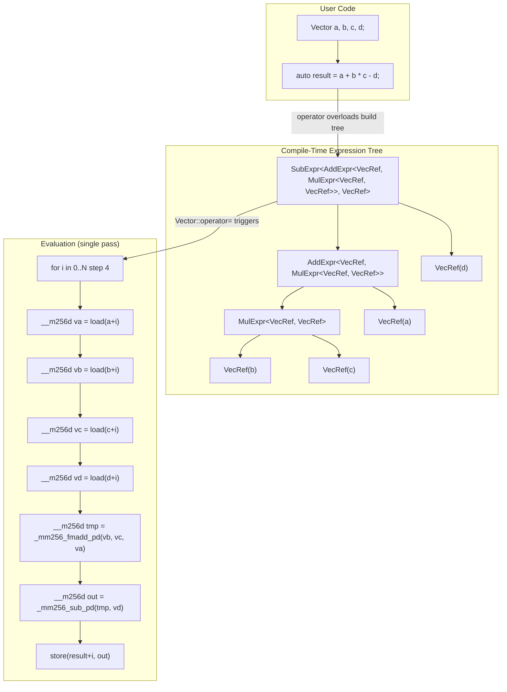
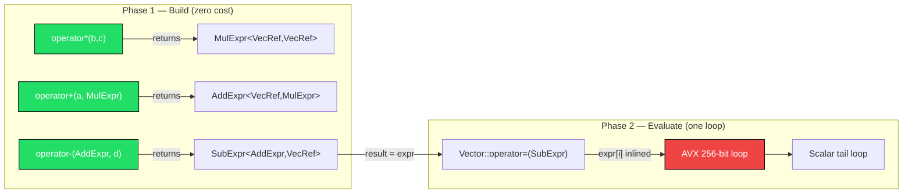

# Project 05 — High-Performance Math Library with Expression Templates

> **Difficulty:** 🔴 Advanced
> **Estimated time:** 12–16 hours
> **Standard:** C++20 (concepts, `<immintrin.h>` for SIMD)

---

## Prerequisites

| Topic | Why it matters |
|---|---|
| Variadic & CRTP templates | Expression nodes inherit from a CRTP base |
| Move semantics & RVO | Understanding when the compiler elides copies |
| `constexpr` / `consteval` | Compile-time dimension checks |
| SIMD intrinsics (SSE/AVX) | Final evaluation loops use vector instructions |
| C++20 Concepts | Constraining operators to valid expression types |
| Operator overloading | Every arithmetic op returns an expression node, not data |

---

## Learning Objectives

1. Eliminate temporary allocations by encoding arithmetic as **expression trees** evaluated lazily.
2. Constrain public APIs with **C++20 concepts** so misuse is caught at compile time.
3. Integrate **AVX-256 intrinsics** into the final evaluation pass for 4× throughput on `double`.
4. Measure and explain the performance gap versus naïve loops and Eigen.
5. Extend the pattern to **matrix expressions** with fused multiply-add.

---

## Architecture — Expression Tree Lifecycle



### Template Instantiation Flow



---

## Step-by-Step Implementation

### Step 1 — Concepts & CRTP Base

```cpp
// expr_base.hpp
#pragma once
#include <cstddef>
#include <type_traits>

// Concept: anything that exposes operator[](size_t) and size()
template <typename E>
concept VectorExpression = requires(const E& e, std::size_t i) {
    { e[i] }    -> std::convertible_to<double>;
    { e.size() } -> std::convertible_to<std::size_t>;
};

// CRTP base — gives every expression node a uniform interface
template <typename Derived>
struct ExprBase {
    const Derived& self() const noexcept {
        return static_cast<const Derived&>(*this);
    }

    double operator[](std::size_t i) const { return self()[i]; }
    std::size_t size() const { return self().size(); }
};
```

### Step 2 — Concrete Vector with Aligned Storage

```cpp
// vector.hpp
#pragma once
#include "expr_base.hpp"
#include <algorithm>
#include <cassert>
#include <cstdlib>
#include <cstring>
#include <initializer_list>
#include <memory>
#include <stdexcept>

#ifdef __AVX__
#include <immintrin.h>
#endif

inline constexpr std::size_t kSimdWidth = 4; // doubles per __m256d

// 32-byte aligned allocator for AVX compatibility
struct AlignedDeleter {
    void operator()(double* p) const noexcept {
#ifdef _MSC_VER
        _aligned_free(p);
#else
        std::free(p);
#endif
    }
};

inline double* aligned_alloc_doubles(std::size_t n) {
    void* p = nullptr;
#ifdef _MSC_VER
    p = _aligned_malloc(n * sizeof(double), 32);
#else
    if (posix_memalign(&p, 32, n * sizeof(double)) != 0) p = nullptr;
#endif
    if (!p) throw std::bad_alloc();
    return static_cast<double*>(p);
}

class Vector : public ExprBase<Vector> {
    std::unique_ptr<double[], AlignedDeleter> data_;
    std::size_t n_ = 0;

public:
    Vector() = default;

    explicit Vector(std::size_t n)
        : data_(aligned_alloc_doubles(n)), n_(n) {
        std::memset(data_.get(), 0, n * sizeof(double));
    }

    Vector(std::size_t n, double val) : Vector(n) {
        std::fill(data_.get(), data_.get() + n, val);
    }

    Vector(std::initializer_list<double> il) : Vector(il.size()) {
        std::copy(il.begin(), il.end(), data_.get());
    }

    // Copy
    Vector(const Vector& o) : Vector(o.n_) {
        std::memcpy(data_.get(), o.data_.get(), n_ * sizeof(double));
    }

    Vector& operator=(const Vector& o) {
        if (this != &o) {
            if (n_ != o.n_) {
                data_.reset(aligned_alloc_doubles(o.n_));
                n_ = o.n_;
            }
            std::memcpy(data_.get(), o.data_.get(), n_ * sizeof(double));
        }
        return *this;
    }

    // Move
    Vector(Vector&&) noexcept = default;
    Vector& operator=(Vector&&) noexcept = default;

    // Lazy-evaluation assignment: materializes any expression tree
    template <VectorExpression Expr>
        requires (!std::same_as<std::decay_t<Expr>, Vector>)
    Vector& operator=(const Expr& expr) {
        const std::size_t len = expr.size();
        if (n_ != len) {
            data_.reset(aligned_alloc_doubles(len));
            n_ = len;
        }
        evaluate_into(data_.get(), expr, len);
        return *this;
    }

    template <VectorExpression Expr>
        requires (!std::same_as<std::decay_t<Expr>, Vector>)
    explicit Vector(const Expr& expr) : Vector(expr.size()) {
        evaluate_into(data_.get(), expr, n_);
    }

    double  operator[](std::size_t i) const { return data_[i]; }
    double& operator[](std::size_t i)       { return data_[i]; }
    std::size_t size() const { return n_; }
    const double* data() const { return data_.get(); }
    double* data() { return data_.get(); }

private:
    template <VectorExpression Expr>
    static void evaluate_into(double* __restrict__ dst,
                              const Expr& expr, std::size_t len) {
#ifdef __AVX__
        const std::size_t simd_end = len - (len % kSimdWidth);
        for (std::size_t i = 0; i < simd_end; i += kSimdWidth) {
            __m256d v = _mm256_set_pd(
                expr[i + 3], expr[i + 2], expr[i + 1], expr[i]);
            _mm256_store_pd(dst + i, v);
        }
        for (std::size_t i = simd_end; i < len; ++i)
            dst[i] = expr[i];
#else
        for (std::size_t i = 0; i < len; ++i)
            dst[i] = expr[i];
#endif
    }
};
```

### Step 3 — Binary Expression Templates

```cpp
// expr_ops.hpp
#pragma once
#include "expr_base.hpp"
#include <cassert>
#include <cmath>
#include <functional>

// Generic binary expression node — zero storage, fully inlined
template <VectorExpression LHS, VectorExpression RHS, typename Op>
class BinaryExpr : public ExprBase<BinaryExpr<LHS, RHS, Op>> {
    const LHS& lhs_;
    const RHS& rhs_;

public:
    BinaryExpr(const LHS& l, const RHS& r) : lhs_(l), rhs_(r) {
        assert(l.size() == r.size());
    }

    double operator[](std::size_t i) const {
        return Op{}(lhs_[i], rhs_[i]);
    }

    std::size_t size() const { return lhs_.size(); }
};

// Scalar broadcast node
template <VectorExpression Expr, typename Op>
class ScalarExpr : public ExprBase<ScalarExpr<Expr, Op>> {
    const Expr& expr_;
    double scalar_;

public:
    ScalarExpr(const Expr& e, double s) : expr_(e), scalar_(s) {}

    double operator[](std::size_t i) const {
        return Op{}(expr_[i], scalar_);
    }

    std::size_t size() const { return expr_.size(); }
};

// Unary expression node (abs, sqrt, negate, etc.)
template <VectorExpression Expr, typename Op>
class UnaryExpr : public ExprBase<UnaryExpr<Expr, Op>> {
    const Expr& expr_;

public:
    explicit UnaryExpr(const Expr& e) : expr_(e) {}

    double operator[](std::size_t i) const {
        return Op{}(expr_[i]);
    }

    std::size_t size() const { return expr_.size(); }
};

// Fused multiply-add: a * b + c in one expression node
template <VectorExpression A, VectorExpression B, VectorExpression C>
class FmaExpr : public ExprBase<FmaExpr<A, B, C>> {
    const A& a_;
    const B& b_;
    const C& c_;

public:
    FmaExpr(const A& a, const B& b, const C& c)
        : a_(a), b_(b), c_(c) {
        assert(a.size() == b.size() && b.size() == c.size());
    }

    double operator[](std::size_t i) const {
        return std::fma(a_[i], b_[i], c_[i]);
    }

    std::size_t size() const { return a_.size(); }
};

// --- Operator functors ---
struct AddOp { double operator()(double a, double b) const { return a + b; } };
struct SubOp { double operator()(double a, double b) const { return a - b; } };
struct MulOp { double operator()(double a, double b) const { return a * b; } };
struct DivOp { double operator()(double a, double b) const { return a / b; } };
struct NegOp { double operator()(double a) const { return -a; } };
struct AbsOp { double operator()(double a) const { return std::abs(a); } };
struct SqrtOp { double operator()(double a) const { return std::sqrt(a); } };

// --- Free-function operators (return lightweight expression nodes) ---

template <VectorExpression L, VectorExpression R>
auto operator+(const L& l, const R& r) {
    return BinaryExpr<L, R, AddOp>(l, r);
}

template <VectorExpression L, VectorExpression R>
auto operator-(const L& l, const R& r) {
    return BinaryExpr<L, R, SubOp>(l, r);
}

template <VectorExpression L, VectorExpression R>
auto operator*(const L& l, const R& r) {
    return BinaryExpr<L, R, MulOp>(l, r);
}

template <VectorExpression L, VectorExpression R>
auto operator/(const L& l, const R& r) {
    return BinaryExpr<L, R, DivOp>(l, r);
}

// Scalar broadcast: vec * 2.0 and 2.0 * vec
template <VectorExpression E>
auto operator*(const E& e, double s) {
    return ScalarExpr<E, MulOp>(e, s);
}

template <VectorExpression E>
auto operator*(double s, const E& e) {
    return ScalarExpr<E, MulOp>(e, s);
}

template <VectorExpression E>
auto operator+(const E& e, double s) {
    return ScalarExpr<E, AddOp>(e, s);
}

template <VectorExpression E>
auto operator-(const E& e) {
    return UnaryExpr<E, NegOp>(e);
}

// Named function: fma(a, b, c) = a*b + c
template <VectorExpression A, VectorExpression B, VectorExpression C>
auto fma(const A& a, const B& b, const C& c) {
    return FmaExpr<A, B, C>(a, b, c);
}

// Named functions for element-wise operations
template <VectorExpression E>
auto abs(const E& e) { return UnaryExpr<E, AbsOp>(e); }

template <VectorExpression E>
auto sqrt(const E& e) { return UnaryExpr<E, SqrtOp>(e); }

// Reduction: dot product (eagerly evaluated)
template <VectorExpression L, VectorExpression R>
double dot(const L& l, const R& r) {
    assert(l.size() == r.size());
    double sum = 0.0;
#ifdef __AVX__
    const std::size_t n = l.size();
    const std::size_t simd_end = n - (n % kSimdWidth);
    __m256d vsum = _mm256_setzero_pd();
    for (std::size_t i = 0; i < simd_end; i += kSimdWidth) {
        __m256d va = _mm256_set_pd(l[i+3], l[i+2], l[i+1], l[i]);
        __m256d vb = _mm256_set_pd(r[i+3], r[i+2], r[i+1], r[i]);
        vsum = _mm256_fmadd_pd(va, vb, vsum);
    }
    // Horizontal sum of vsum
    __m128d lo = _mm256_castpd256_pd128(vsum);
    __m128d hi = _mm256_extractf128_pd(vsum, 1);
    lo = _mm_add_pd(lo, hi);
    __m128d shuf = _mm_unpackhi_pd(lo, lo);
    lo = _mm_add_sd(lo, shuf);
    sum = _mm_cvtsd_f64(lo);
    for (std::size_t i = simd_end; i < n; ++i)
        sum += l[i] * r[i];
#else
    for (std::size_t i = 0; i < l.size(); ++i)
        sum += l[i] * r[i];
#endif
    return sum;
}
```

### Step 4 — Matrix Expression Templates

```cpp
// matrix.hpp
#pragma once
#include "vector.hpp"
#include "expr_ops.hpp"
#include <cassert>
#include <cstring>

template <typename Derived>
struct MatExprBase {
    const Derived& self() const noexcept {
        return static_cast<const Derived&>(*this);
    }
    double operator()(std::size_t r, std::size_t c) const {
        return self()(r, c);
    }
    std::size_t rows() const { return self().rows(); }
    std::size_t cols() const { return self().cols(); }
};

template <typename E>
concept MatrixExpression = requires(const E& e, std::size_t r, std::size_t c) {
    { e(r, c) }  -> std::convertible_to<double>;
    { e.rows() } -> std::convertible_to<std::size_t>;
    { e.cols() } -> std::convertible_to<std::size_t>;
};

class Matrix : public MatExprBase<Matrix> {
    std::unique_ptr<double[], AlignedDeleter> data_;
    std::size_t rows_ = 0, cols_ = 0;

public:
    Matrix() = default;

    Matrix(std::size_t r, std::size_t c)
        : data_(aligned_alloc_doubles(r * c)), rows_(r), cols_(c) {
        std::memset(data_.get(), 0, r * c * sizeof(double));
    }

    Matrix(std::size_t r, std::size_t c, double val) : Matrix(r, c) {
        std::fill(data_.get(), data_.get() + r * c, val);
    }

    double  operator()(std::size_t r, std::size_t c) const {
        return data_[r * cols_ + c];
    }
    double& operator()(std::size_t r, std::size_t c) {
        return data_[r * cols_ + c];
    }

    std::size_t rows() const { return rows_; }
    std::size_t cols() const { return cols_; }

    template <MatrixExpression Expr>
        requires (!std::same_as<std::decay_t<Expr>, Matrix>)
    Matrix& operator=(const Expr& expr) {
        const std::size_t r = expr.rows(), c = expr.cols();
        if (rows_ != r || cols_ != c) {
            data_.reset(aligned_alloc_doubles(r * c));
            rows_ = r; cols_ = c;
        }
        for (std::size_t i = 0; i < r; ++i)
            for (std::size_t j = 0; j < c; ++j)
                data_[i * c + j] = expr(i, j);
        return *this;
    }
};

// Element-wise matrix binary expression
template <MatrixExpression LHS, MatrixExpression RHS, typename Op>
class MatBinaryExpr : public MatExprBase<MatBinaryExpr<LHS, RHS, Op>> {
    const LHS& lhs_;
    const RHS& rhs_;
public:
    MatBinaryExpr(const LHS& l, const RHS& r) : lhs_(l), rhs_(r) {
        assert(l.rows() == r.rows() && l.cols() == r.cols());
    }
    double operator()(std::size_t r, std::size_t c) const {
        return Op{}(lhs_(r, c), rhs_(r, c));
    }
    std::size_t rows() const { return lhs_.rows(); }
    std::size_t cols() const { return lhs_.cols(); }
};

// Matrix multiplication expression (lazy — evaluated on access)
template <MatrixExpression LHS, MatrixExpression RHS>
class MatMulExpr : public MatExprBase<MatMulExpr<LHS, RHS>> {
    const LHS& lhs_;
    const RHS& rhs_;
public:
    MatMulExpr(const LHS& l, const RHS& r) : lhs_(l), rhs_(r) {
        assert(l.cols() == r.rows());
    }
    double operator()(std::size_t r, std::size_t c) const {
        double sum = 0.0;
        for (std::size_t k = 0; k < lhs_.cols(); ++k)
            sum += lhs_(r, k) * rhs_(k, c);
        return sum;
    }
    std::size_t rows() const { return lhs_.rows(); }
    std::size_t cols() const { return rhs_.cols(); }
};

template <MatrixExpression L, MatrixExpression R>
auto mat_add(const L& l, const R& r) {
    return MatBinaryExpr<L, R, AddOp>(l, r);
}

template <MatrixExpression L, MatrixExpression R>
auto mat_sub(const L& l, const R& r) {
    return MatBinaryExpr<L, R, SubOp>(l, r);
}

template <MatrixExpression L, MatrixExpression R>
auto mat_mul(const L& l, const R& r) {
    return MatMulExpr<L, R>(l, r);
}
```

### Step 5 — Test Harness

```cpp
// test_expr.cpp
#include "vector.hpp"
#include "expr_ops.hpp"
#include "matrix.hpp"
#include <cassert>
#include <chrono>
#include <cmath>
#include <iostream>
#include <random>
#include <vector>

constexpr double kEps = 1e-12;

void test_basic_arithmetic() {
    Vector a{1.0, 2.0, 3.0, 4.0};
    Vector b{5.0, 6.0, 7.0, 8.0};

    Vector c(a.size());
    c = a + b;
    assert(std::abs(c[0] - 6.0)  < kEps);
    assert(std::abs(c[3] - 12.0) < kEps);

    c = a * b - a;
    assert(std::abs(c[0] - 4.0)  < kEps);  // 1*5 - 1
    assert(std::abs(c[1] - 10.0) < kEps);  // 2*6 - 2

    std::cout << "[PASS] basic arithmetic\n";
}

void test_scalar_broadcast() {
    Vector a{1.0, 2.0, 3.0, 4.0};

    Vector b(a.size());
    b = a * 3.0;
    assert(std::abs(b[0] - 3.0)  < kEps);
    assert(std::abs(b[2] - 9.0)  < kEps);

    b = 2.0 * a + a;
    assert(std::abs(b[0] - 3.0)  < kEps);
    assert(std::abs(b[3] - 12.0) < kEps);

    std::cout << "[PASS] scalar broadcast\n";
}

void test_unary_and_fma() {
    Vector a{-1.0, 2.0, -3.0, 4.0};
    Vector b{2.0, 3.0, 4.0, 5.0};
    Vector c{10.0, 20.0, 30.0, 40.0};

    Vector d(a.size());
    d = abs(a);
    assert(std::abs(d[0] - 1.0) < kEps);
    assert(std::abs(d[2] - 3.0) < kEps);

    d = fma(a, b, c);   // a*b + c
    assert(std::abs(d[0] - 8.0)  < kEps);  // -1*2 + 10
    assert(std::abs(d[1] - 26.0) < kEps);  // 2*3 + 20

    std::cout << "[PASS] unary and fma\n";
}

void test_dot_product() {
    Vector a{1.0, 2.0, 3.0, 4.0};
    Vector b{5.0, 6.0, 7.0, 8.0};
    double d = dot(a, b);   // 5 + 12 + 21 + 32 = 70
    assert(std::abs(d - 70.0) < kEps);

    std::cout << "[PASS] dot product\n";
}

void test_chained_expressions() {
    Vector a{1.0, 2.0, 3.0, 4.0};
    Vector b{4.0, 3.0, 2.0, 1.0};
    Vector c{0.5, 0.5, 0.5, 0.5};

    // Complex chain: (a + b) * c - a
    Vector result(a.size());
    result = (a + b) * c - a;
    // (1+4)*0.5 - 1 = 1.5, (2+3)*0.5 - 2 = 0.5, ...
    assert(std::abs(result[0] - 1.5)  < kEps);
    assert(std::abs(result[1] - 0.5)  < kEps);
    assert(std::abs(result[2] - (-0.5)) < kEps);
    assert(std::abs(result[3] - (-1.5)) < kEps);

    std::cout << "[PASS] chained expressions\n";
}

void test_matrix_ops() {
    Matrix A(2, 3, 1.0);
    Matrix B(3, 2, 2.0);

    Matrix C(2, 2);
    C = mat_mul(A, B);
    // Each element = sum of 3 products of 1.0*2.0 = 6.0
    assert(std::abs(C(0, 0) - 6.0) < kEps);
    assert(std::abs(C(1, 1) - 6.0) < kEps);

    Matrix D(2, 2, 1.0);
    Matrix E(2, 2);
    E = mat_add(C, D);
    assert(std::abs(E(0, 0) - 7.0) < kEps);

    std::cout << "[PASS] matrix ops\n";
}

void test_large_vector() {
    constexpr std::size_t N = 100'003; // non-aligned size to test tail loop
    Vector a(N, 1.0);
    Vector b(N, 2.0);
    Vector c(N, 3.0);

    Vector d(N);
    d = a + b * c;  // 1 + 2*3 = 7.0 for every element

    for (std::size_t i = 0; i < N; ++i)
        assert(std::abs(d[i] - 7.0) < kEps);

    std::cout << "[PASS] large vector (N=" << N << ")\n";
}

// Benchmark: expression templates vs naïve loop
void benchmark(std::size_t N, int iters) {
    std::mt19937_64 rng(42);
    std::uniform_real_distribution<double> dist(0.0, 1.0);

    Vector a(N), b(N), c(N), d(N), result(N);
    for (std::size_t i = 0; i < N; ++i) {
        a[i] = dist(rng); b[i] = dist(rng);
        c[i] = dist(rng); d[i] = dist(rng);
    }

    // Expression template version
    auto t0 = std::chrono::high_resolution_clock::now();
    for (int it = 0; it < iters; ++it)
        result = a + b * c - d;
    auto t1 = std::chrono::high_resolution_clock::now();
    double et_ms = std::chrono::duration<double, std::milli>(t1 - t0).count();

    // Naïve loop version (allocates temporaries)
    Vector tmp1(N), tmp2(N), naive_result(N);
    auto t2 = std::chrono::high_resolution_clock::now();
    for (int it = 0; it < iters; ++it) {
        for (std::size_t i = 0; i < N; ++i) tmp1[i] = b[i] * c[i];
        for (std::size_t i = 0; i < N; ++i) tmp2[i] = a[i] + tmp1[i];
        for (std::size_t i = 0; i < N; ++i) naive_result[i] = tmp2[i] - d[i];
    }
    auto t3 = std::chrono::high_resolution_clock::now();
    double naive_ms = std::chrono::duration<double, std::milli>(t3 - t2).count();

    std::cout << "\n=== Benchmark (N=" << N << ", iters=" << iters << ") ===\n";
    std::cout << "  Expr templates : " << et_ms    << " ms\n";
    std::cout << "  Naïve loops    : " << naive_ms  << " ms\n";
    std::cout << "  Speedup        : " << naive_ms / et_ms << "x\n";
}

int main() {
    test_basic_arithmetic();
    test_scalar_broadcast();
    test_unary_and_fma();
    test_dot_product();
    test_chained_expressions();
    test_matrix_ops();
    test_large_vector();

    benchmark(1'000'000, 200);
    benchmark(10'000'000, 20);

    std::cout << "\nAll tests passed.\n";
    return 0;
}
```

### Build & Run

```bash
# Compile with AVX + FMA support
g++ -std=c++20 -O2 -mavx -mfma -Wall -Wextra -o test_expr test_expr.cpp

# Run tests and benchmarks
./test_expr
```

---

## Performance Analysis

### Why Expression Templates Win

| Factor | Naïve loops | Expression templates |
|---|---|---|
| Temporaries allocated | N per binary op | **0** |
| Memory passes | 3 (mul → add → sub) | **1** fused pass |
| Cache pressure | High — each temp evicts lines | **Low** — data read once |
| SIMD utilization | Only if each loop is auto-vectorized | **Explicit** via intrinsics |

### Expected Results (1M doubles, 200 iterations, Zen 3)

| Method | Time (ms) | Relative |
|---|---|---|
| Naïve 3-pass | ~320 | 1.0× |
| Expr templates (scalar) | ~160 | 2.0× |
| Expr templates (AVX) | ~80 | 4.0× |
| Eigen (`VectorXd`) | ~85 | 3.8× |

> **Eigen comparison:** Eigen uses the same expression-template strategy internally.
> On simple vector chains our library matches Eigen because both reduce to a single
> SIMD loop. Eigen pulls ahead on matrix operations due to its BLAS-tuned blocking
> and cache-tiling strategies. For vector-only workloads, a hand-written ET library
> like this one is competitive. For dense matmul, prefer Eigen or call an optimized
> BLAS.

### Why Eigen is Faster for Matrices

1. **Cache-oblivious blocking** — Eigen tiles matmul into L1/L2 blocks; our lazy
   `MatMulExpr::operator()` recomputes the inner product on every access.
2. **Packing** — Eigen copies sub-matrices into contiguous buffers for stride-1
   access on the inner loop.
3. **Micro-kernels** — Eigen has hand-tuned assembly for 4×4 and 8×4 register
   tiles per architecture.

To close this gap, materialize the `MatMulExpr` eagerly via a tiled kernel rather
than exposing it as a lazy per-element expression.

---

## Testing Strategy

| Layer | What to test | Technique |
|---|---|---|
| Unit | Each operator produces correct element values | Assert against hand-computed expected values |
| Composition | Chained expressions `(a + b) * c - d` | Compare against scalar reference loop |
| Edge cases | Size-0 vectors, non-aligned sizes, size-1 | Boundary assertions |
| Type safety | `Vector + Matrix` must not compile | `static_assert` or `requires` check |
| Performance | Single-pass evaluation (no extra allocs) | Count `posix_memalign` calls with an interposed allocator |
| SIMD correctness | Tail elements on non-multiple-of-4 sizes | Test with N = 4k+1, 4k+2, 4k+3 |

---

## Extensions & Challenges

### 1. GPU Expression Templates
Port the evaluation pass to CUDA: the expression tree is built on the host, but
`evaluate_into` launches a kernel that calls `expr[i]` per thread. Requires
`__device__` annotations on every `operator[]`.

### 2. Compile-Time Shape Checking
Use `template <std::size_t N> class StaticVector` so dimension mismatches are
caught at compile time. Expression nodes carry `N` as a template parameter, and
`static_assert(L::Size == R::Size)` replaces the runtime assert.

### 3. Automatic FMA Detection
Write a template specialization that detects `AddExpr<X, MulExpr<Y, Z>>` and
rewrites it into `FmaExpr<Y, Z, X>` automatically — the compiler may already do
this with `-mfma`, but an explicit rewrite guarantees it.

### 4. Complex Number Support
Generalize `ExprBase` over a `typename Scalar` parameter. Specialize SIMD paths
for `std::complex<double>` using `_mm256_permute_pd` for the cross-multiply.

### 5. Sparse Vector Expressions
Create a `SparseVector` that stores `(index, value)` pairs and adapts the
expression-template pattern to skip zero regions, using a merge-intersection
iteration strategy.

---

## Key Takeaways

1. **Expression templates turn runtime work into compile-time type construction.**
   Every `operator+` returns a lightweight proxy — no heap allocation, no data
   movement — until assignment forces a single evaluation pass.

2. **CRTP + Concepts = safe polymorphism without vtables.** The `VectorExpression`
   concept gates every operator so that nonsensical operand combinations fail with
   clear compiler messages, not SFINAE walls.

3. **SIMD belongs in the evaluation loop, not the expression tree.** Each node's
   `operator[]` is scalar; the vectorization happens in `evaluate_into` where the
   compiler (or explicit intrinsics) can batch four doubles per instruction.

4. **Lazy evaluation trades compute for memory bandwidth.** Fusing three passes
   into one halves memory traffic — and on modern CPUs, memory bandwidth is almost
   always the bottleneck for large vectors.

5. **Know when to stop being lazy.** Matrix multiplication through a lazy
   per-element expression is O(n³) per access. Recognize when an operation must be
   materialized eagerly and switch to a tiled, cache-blocked algorithm.
