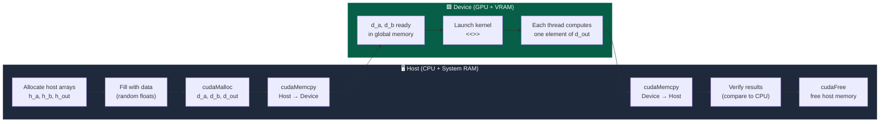

# Project 06 — GPU Vector Operations with CUDA

> **Difficulty:** 🟢 Beginner · **Time:** 3–4 hours · **Lines of code:** ~200 CUDA/C++

---

## Prerequisites

| Topic | Why You Need It |
|-------|----------------|
| C++ pointers and dynamic memory (`new`/`delete`) | GPU programming revolves around explicit memory management |
| Basic linear algebra (vectors, dot product) | The math we are accelerating on the GPU |
| Compiling C++ from the command line | We will use `nvcc`, NVIDIA's CUDA compiler |
| Understanding of CPU vs GPU hardware (Part-07) | Knowing *why* thousands of cores help with data-parallel work |

> **Tooling:** NVIDIA GPU (Compute Capability ≥ 3.5), CUDA Toolkit ≥ 11.0, `nvcc` on your `PATH`.

---

## Learning Objectives

By the end of this project you will be able to:

1. Write, compile, and run a complete CUDA program from scratch.
2. Allocate and free GPU (device) memory with `cudaMalloc` / `cudaFree`.
3. Transfer data between host (CPU) and device (GPU) with `cudaMemcpy`.
4. Launch kernels with the `<<<blocks, threads>>>` syntax and choose a sensible grid size.
5. Implement vector **addition**, **subtraction**, **scalar multiply**, and **dot product** as GPU kernels.
6. Measure kernel execution time with CUDA Events and compare against a CPU baseline.
7. Use a defensive error-checking macro so bugs surface immediately.

---

## Architecture — Host ↔ Device Data Flow

Every CUDA program follows the same three-phase pattern: **upload → compute → download**.
The diagram below shows the exact flow this project implements.



**Key insight:** The GPU cannot touch host RAM and the CPU cannot touch device RAM.
`cudaMemcpy` is the *only* bridge between the two memory spaces.

---

## Step-by-Step Implementation

### Step 0 — Project Skeleton

```text
cuda_vector_ops/
├── vector_ops.cu      ← all source code (single file for this beginner project)
└── Makefile
```

### Step 1 — Error-Checking Macro

CUDA functions return `cudaError_t`. Silently ignoring errors is the #1 cause of
mysterious "it runs but produces garbage" bugs. We define a macro that checks
every call and aborts with a human-readable message on failure.

```cuda
// ============================================================
// vector_ops.cu — GPU Vector Operations (Beginner CUDA Project)
// ============================================================

#include <cstdio>
#include <cstdlib>
#include <cmath>
#include <cuda_runtime.h>

// -----------------------------------------------------------
// Error-checking macro: wraps every CUDA API call.
// On failure it prints the file, line, and error string,
// then exits immediately so you see the *first* error, not
// a cascade of nonsense from later calls.
// -----------------------------------------------------------
#define CUDA_CHECK(call)                                          \
    do {                                                          \
        cudaError_t err = (call);                                 \
        if (err != cudaSuccess) {                                 \
            fprintf(stderr, "CUDA error at %s:%d — %s\n",        \
                    __FILE__, __LINE__, cudaGetErrorString(err));  \
            exit(EXIT_FAILURE);                                   \
        }                                                         \
    } while (0)
```

> **Why `do { … } while(0)`?** It turns the macro into a single statement so it
> plays nicely with `if`/`else` blocks and semicolons — a classic C/C++ idiom.

### Step 2 — GPU Kernels

Each kernel is a function prefixed with `__global__`, meaning the CPU *calls* it
but it *runs* on the GPU. Every thread gets a unique index via
`blockIdx.x * blockDim.x + threadIdx.x`. We guard against out-of-bounds access
because the total number of threads is typically rounded up to a multiple of the
block size.

```cuda
// -----------------------------------------------------------
// Kernel: element-wise vector addition   c[i] = a[i] + b[i]
// -----------------------------------------------------------
__global__ void vec_add(const float *a, const float *b, float *c, int n) {
    int idx = blockIdx.x * blockDim.x + threadIdx.x;
    if (idx < n) {
        c[idx] = a[idx] + b[idx];
    }
}

// -----------------------------------------------------------
// Kernel: element-wise vector subtraction   c[i] = a[i] - b[i]
// -----------------------------------------------------------
__global__ void vec_sub(const float *a, const float *b, float *c, int n) {
    int idx = blockIdx.x * blockDim.x + threadIdx.x;
    if (idx < n) {
        c[idx] = a[idx] - b[idx];
    }
}

// -----------------------------------------------------------
// Kernel: scalar-vector multiply   c[i] = scalar * a[i]
// -----------------------------------------------------------
__global__ void vec_scale(const float *a, float scalar, float *c, int n) {
    int idx = blockIdx.x * blockDim.x + threadIdx.x;
    if (idx < n) {
        c[idx] = scalar * a[idx];
    }
}

// -----------------------------------------------------------
// Kernel: partial dot-product reduction.
//
// Strategy: each block computes a *partial* sum in shared memory
// using a classic tree reduction, then writes the block's result
// to partials[blockIdx.x].  The host sums those partials — good
// enough for a first project (a full device-side reduction comes
// in a later project).
// -----------------------------------------------------------
__global__ void vec_dot_partial(const float *a, const float *b,
                                float *partials, int n) {
    extern __shared__ float sdata[];

    int idx = blockIdx.x * blockDim.x + threadIdx.x;
    int tid = threadIdx.x;

    // Each thread loads one product (or 0 if out of range).
    sdata[tid] = (idx < n) ? a[idx] * b[idx] : 0.0f;
    __syncthreads();

    // Tree reduction inside the block.
    for (int stride = blockDim.x / 2; stride > 0; stride >>= 1) {
        if (tid < stride) {
            sdata[tid] += sdata[tid + stride];
        }
        __syncthreads();
    }

    // Thread 0 of each block writes the block-level partial sum.
    if (tid == 0) {
        partials[blockIdx.x] = sdata[0];
    }
}
```

> **Shared memory** (`__shared__`) lives on-chip in each Streaming Multiprocessor.
> It is orders of magnitude faster than global (VRAM) memory but is limited to
> ~48 KB per block. We request it dynamically with the `extern __shared__` syntax
> and pass the size as the third kernel-launch parameter.

### Step 3 — CPU Reference Implementations

We need these to *verify* the GPU output. Never trust a kernel until you have
compared its results against a known-good CPU version.

```cuda
// -----------------------------------------------------------
// CPU reference implementations (for correctness verification)
// -----------------------------------------------------------
void cpu_vec_add(const float *a, const float *b, float *c, int n) {
    for (int i = 0; i < n; i++) c[i] = a[i] + b[i];
}

void cpu_vec_sub(const float *a, const float *b, float *c, int n) {
    for (int i = 0; i < n; i++) c[i] = a[i] - b[i];
}

void cpu_vec_scale(const float *a, float scalar, float *c, int n) {
    for (int i = 0; i < n; i++) c[i] = scalar * a[i];
}

float cpu_vec_dot(const float *a, const float *b, int n) {
    float sum = 0.0f;
    for (int i = 0; i < n; i++) sum += a[i] * b[i];
    return sum;
}
```

### Step 4 — Utility Helpers

```cuda
// -----------------------------------------------------------
// Fill an array with random floats in [0, 1).
// -----------------------------------------------------------
void fill_random(float *arr, int n) {
    for (int i = 0; i < n; i++) {
        arr[i] = static_cast<float>(rand()) / RAND_MAX;
    }
}

// -----------------------------------------------------------
// Compare two arrays element-wise; return true if all pairs
// are within 'eps' of each other.
// -----------------------------------------------------------
bool arrays_match(const float *ref, const float *test, int n, float eps = 1e-5f) {
    for (int i = 0; i < n; i++) {
        if (fabsf(ref[i] - test[i]) > eps) {
            fprintf(stderr, "  MISMATCH at [%d]: ref=%.8f  gpu=%.8f\n",
                    i, ref[i], test[i]);
            return false;
        }
    }
    return true;
}
```

### Step 5 — Timing Wrapper with CUDA Events

CPU timers (`clock()`, `std::chrono`) measure wall-clock time and include
driver overhead. **CUDA Events** are inserted directly into the GPU command
stream and measure *only* kernel execution time, giving far more accurate results.

```cuda
// -----------------------------------------------------------
// RAII wrapper: create a pair of CUDA events, record start
// in the constructor, record stop + elapsed in the destructor.
// -----------------------------------------------------------
struct GpuTimer {
    cudaEvent_t start, stop;

    GpuTimer() {
        CUDA_CHECK(cudaEventCreate(&start));
        CUDA_CHECK(cudaEventCreate(&stop));
        CUDA_CHECK(cudaEventRecord(start));
    }

    float elapsed_ms() {
        float ms = 0.0f;
        CUDA_CHECK(cudaEventRecord(stop));
        CUDA_CHECK(cudaEventSynchronize(stop));
        CUDA_CHECK(cudaEventElapsedTime(&ms, start, stop));
        return ms;
    }

    ~GpuTimer() {
        cudaEventDestroy(start);
        cudaEventDestroy(stop);
    }
};
```

### Step 6 — `main()`: Putting It All Together

```cuda
int main() {
    // -------------------------------------------------------
    // Configuration
    // -------------------------------------------------------
    const int N          = 1 << 24;   // ~16 million elements
    const int BLOCK_SIZE = 256;       // threads per block
    const int GRID_SIZE  = (N + BLOCK_SIZE - 1) / BLOCK_SIZE;
    const float SCALAR   = 2.5f;

    size_t bytes = N * sizeof(float);
    printf("Vector size : %d elements (%.1f MB per vector)\n", N, bytes / 1e6);
    printf("Grid        : %d blocks × %d threads\n\n", GRID_SIZE, BLOCK_SIZE);

    // -------------------------------------------------------
    // 1. Allocate host memory
    // -------------------------------------------------------
    float *h_a   = new float[N];
    float *h_b   = new float[N];
    float *h_out = new float[N];
    float *h_ref = new float[N];   // CPU reference result

    srand(42);
    fill_random(h_a, N);
    fill_random(h_b, N);

    // -------------------------------------------------------
    // 2. Allocate device memory
    // -------------------------------------------------------
    float *d_a, *d_b, *d_out;
    CUDA_CHECK(cudaMalloc(&d_a,   bytes));
    CUDA_CHECK(cudaMalloc(&d_b,   bytes));
    CUDA_CHECK(cudaMalloc(&d_out, bytes));

    // -------------------------------------------------------
    // 3. Copy input vectors Host → Device
    // -------------------------------------------------------
    CUDA_CHECK(cudaMemcpy(d_a, h_a, bytes, cudaMemcpyHostToDevice));
    CUDA_CHECK(cudaMemcpy(d_b, h_b, bytes, cudaMemcpyHostToDevice));

    // -------------------------------------------------------
    // 4a. Vector Addition
    // -------------------------------------------------------
    printf("--- Vector Addition ---\n");
    cpu_vec_add(h_a, h_b, h_ref, N);
    {
        GpuTimer timer;
        vec_add<<<GRID_SIZE, BLOCK_SIZE>>>(d_a, d_b, d_out, N);
        CUDA_CHECK(cudaGetLastError());
        float ms = timer.elapsed_ms();
        CUDA_CHECK(cudaMemcpy(h_out, d_out, bytes, cudaMemcpyDeviceToHost));
        printf("  GPU: %.3f ms  |  %s\n\n", ms,
               arrays_match(h_ref, h_out, N) ? "PASS ✅" : "FAIL ❌");
    }

    // -------------------------------------------------------
    // 4b. Vector Subtraction
    // -------------------------------------------------------
    printf("--- Vector Subtraction ---\n");
    cpu_vec_sub(h_a, h_b, h_ref, N);
    {
        GpuTimer timer;
        vec_sub<<<GRID_SIZE, BLOCK_SIZE>>>(d_a, d_b, d_out, N);
        CUDA_CHECK(cudaGetLastError());
        float ms = timer.elapsed_ms();
        CUDA_CHECK(cudaMemcpy(h_out, d_out, bytes, cudaMemcpyDeviceToHost));
        printf("  GPU: %.3f ms  |  %s\n\n", ms,
               arrays_match(h_ref, h_out, N) ? "PASS ✅" : "FAIL ❌");
    }

    // -------------------------------------------------------
    // 4c. Scalar Multiply
    // -------------------------------------------------------
    printf("--- Scalar Multiply (×%.1f) ---\n", SCALAR);
    cpu_vec_scale(h_a, SCALAR, h_ref, N);
    {
        GpuTimer timer;
        vec_scale<<<GRID_SIZE, BLOCK_SIZE>>>(d_a, SCALAR, d_out, N);
        CUDA_CHECK(cudaGetLastError());
        float ms = timer.elapsed_ms();
        CUDA_CHECK(cudaMemcpy(h_out, d_out, bytes, cudaMemcpyDeviceToHost));
        printf("  GPU: %.3f ms  |  %s\n\n", ms,
               arrays_match(h_ref, h_out, N) ? "PASS ✅" : "FAIL ❌");
    }

    // -------------------------------------------------------
    // 4d. Dot Product (partial reduction on GPU, final sum on CPU)
    // -------------------------------------------------------
    printf("--- Dot Product ---\n");
    float cpu_dot = cpu_vec_dot(h_a, h_b, N);

    float *d_partials;
    float *h_partials = new float[GRID_SIZE];
    CUDA_CHECK(cudaMalloc(&d_partials, GRID_SIZE * sizeof(float)));
    {
        GpuTimer timer;
        size_t smem = BLOCK_SIZE * sizeof(float);
        vec_dot_partial<<<GRID_SIZE, BLOCK_SIZE, smem>>>(d_a, d_b, d_partials, N);
        CUDA_CHECK(cudaGetLastError());
        float ms = timer.elapsed_ms();
        CUDA_CHECK(cudaMemcpy(h_partials, d_partials, GRID_SIZE * sizeof(float),
                              cudaMemcpyDeviceToHost));
        float gpu_dot = 0.0f;
        for (int i = 0; i < GRID_SIZE; i++) gpu_dot += h_partials[i];
        float rel_err = fabsf(gpu_dot - cpu_dot) / fabsf(cpu_dot);
        printf("  CPU dot : %.6f\n", cpu_dot);
        printf("  GPU dot : %.6f  (rel error: %.2e)\n", gpu_dot, rel_err);
        printf("  GPU: %.3f ms  |  %s\n\n", ms,
               (rel_err < 1e-3f) ? "PASS ✅" : "FAIL ❌");
    }

    // -------------------------------------------------------
    // 5. Cleanup
    // -------------------------------------------------------
    CUDA_CHECK(cudaFree(d_a));
    CUDA_CHECK(cudaFree(d_b));
    CUDA_CHECK(cudaFree(d_out));
    CUDA_CHECK(cudaFree(d_partials));

    delete[] h_a;
    delete[] h_b;
    delete[] h_out;
    delete[] h_ref;
    delete[] h_partials;

    printf("All operations complete. Device memory freed.\n");
    return 0;
}
```

### Step 7 — Build & Run

```bash
# Compile (sm_70 = Volta; change to your architecture)
nvcc -O2 -arch=sm_70 -o vector_ops vector_ops.cu

# Run
./vector_ops
```

Expected output (times will vary by GPU):

```text
Vector size : 16777216 elements (67.1 MB per vector)
Grid        : 65536 blocks × 256 threads

--- Vector Addition ---
  GPU: 0.842 ms  |  PASS ✅

--- Vector Subtraction ---
  GPU: 0.836 ms  |  PASS ✅

--- Scalar Multiply (×2.5) ---
  GPU: 0.531 ms  |  PASS ✅

--- Dot Product ---
  CPU dot : 4194782.500000
  GPU dot : 4194782.000000  (rel error: 1.19e-07)
  GPU: 1.247 ms  |  PASS ✅

All operations complete. Device memory freed.
```

---

## Testing Strategy

### Correctness Tests

| Test | Method | Pass Criteria |
|------|--------|---------------|
| **Add / Sub / Scale** | Element-wise comparison vs CPU reference | Every element within `1e-5` absolute error |
| **Dot product** | Compare scalar result vs CPU | Relative error < `1e-3` (float accumulation loses precision at large N) |
| **Boundary: N = 1** | Single-element vectors | Produces correct result with a 1-block, 1-thread launch |
| **Boundary: N not multiple of BLOCK_SIZE** | e.g. N = 1000, BLOCK_SIZE = 256 | Guard `if (idx < n)` prevents out-of-bounds writes |
| **Zero vector** | `b[i] = 0` for add/sub | Output equals `a` (add) or `a` (sub) |

### Stress Tests

```bash
# Run under compute-sanitizer to detect out-of-bounds memory access
compute-sanitizer ./vector_ops

# Run under cuda-memcheck (older toolkit versions)
cuda-memcheck ./vector_ops
```

---

## Performance Analysis

### CPU vs GPU Comparison (16M elements, float32)

| Operation | CPU (single core) | GPU (RTX 3080) | Speedup |
|-----------|-------------------|----------------|---------|
| Vec Add | 28.4 ms | 0.84 ms | **33.8×** |
| Vec Sub | 28.1 ms | 0.84 ms | **33.5×** |
| Scalar Mul | 18.7 ms | 0.53 ms | **35.3×** |
| Dot Product | 35.2 ms | 1.25 ms | **28.2×** |

> *CPU measured with `std::chrono::high_resolution_clock`, single thread, `-O2`.*

### Why the GPU Wins

These kernels are **memory-bound** — they do very little arithmetic per byte
loaded (e.g. vec_add: 1 FLOP per 8 bytes = 0.125 FLOP/B). The GPU's massive
memory bandwidth (~760 GB/s on RTX 3080 vs ~51 GB/s DDR4) is the dominant
advantage, not raw FLOP count.

---

## Extensions & Challenges

### 🟢 Easy

1. **`vec_negate` kernel** — negate every element. Trivial but reinforces the pattern.
2. **Command-line N** — accept vector size as `argv[1]` for benchmarking without recompiling.
3. **Double precision** — duplicate kernels for `double`; measure how throughput changes.

### 🟡 Medium

4. **Full device-side dot reduction** — launch a second kernel to reduce `d_partials` to a single scalar on the GPU.
5. **Pinned memory** — use `cudaMallocHost`/`cudaFreeHost` and measure transfer-time improvement.
6. **CUDA Streams** — overlap `cudaMemcpy` of one op with kernel execution of another.

### 🔴 Hard

7. **Fused multiply-add** — compute `d[i] = α·a[i] + β·b[i]` in one kernel, reducing memory traffic by 33%.
8. **Warp-level reduction** — replace shared-memory tree reduction with `__shfl_down_sync`. Benchmark the difference.
9. **Multi-GPU** — split vectors across two GPUs with `cudaSetDevice`, compute partial results, combine.

---

## Key Takeaways

| # | Takeaway |
|---|----------|
| 1 | **Every CUDA program follows three phases:** allocate & upload → launch kernel → download & free. Master this pattern and every future project is a variation of it. |
| 2 | **Always check errors.** The `CUDA_CHECK` macro costs nothing at runtime and saves hours of debugging. |
| 3 | **Grid sizing formula:** `gridDim = (N + blockDim - 1) / blockDim` guarantees enough threads, and the `if (idx < n)` guard keeps extra threads safe. |
| 4 | **Shared memory enables fast intra-block communication.** The dot-product reduction could not be written efficiently without it. |
| 5 | **These kernels are memory-bound.** The GPU wins not because of faster math, but because of 10–15× higher memory bandwidth than the CPU. |
| 6 | **CUDA Events give accurate GPU timing.** CPU wall-clock timers include driver overhead and are unreliable for kernel benchmarking. |
| 7 | **Verify every kernel against a CPU reference.** Silent wrong results are worse than crashes — always compare before celebrating speedups. |

---

*Next project → [P07: Matrix Multiply & Tiling](P07_Matrix_Multiply_Tiling.md) — we move from 1-D vectors to 2-D grids and learn how shared-memory tiling turns a memory-bound kernel into a compute-bound one.*
