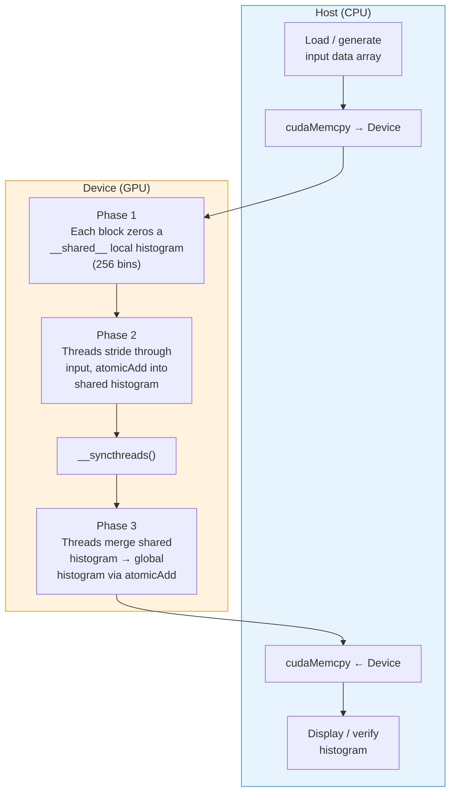

# P07 — Parallel Histogram Computation on the GPU

> **Difficulty:** 🟢 Beginner
> **Time estimate:** 3–4 hours
> **CUDA concepts:** Atomic operations, shared-memory privatization, block-level reduction

---

## Prerequisites

| Topic | Why it matters |
|---|---|
| C / C++ pointers & arrays | Host-side data management |
| CUDA kernel launch syntax | `<<<grid, block>>>` configuration |
| `cudaMalloc / cudaMemcpy` | Device memory lifecycle |
| Shared memory (`__shared__`) | Per-block fast scratchpad |
| `atomicAdd` | Thread-safe accumulation |

---

## Learning Objectives

After completing this project you will be able to:

1. Explain **why naïve global atomics create contention** and how it hurts throughput.
2. Apply **shared-memory privatization** — each block accumulates into a private histogram, then merges once into global memory.
3. Measure the wall-clock difference between the naïve and optimized approaches.
4. Extend the histogram kernel to real 8-bit grayscale images.

---

## Architecture Overview



**Key insight:** Phase 2 uses fast **shared-memory atomics** (≈ 1 cycle) instead of slow global-memory atomics (≈ hundreds of cycles). Phase 3 performs at most 256 global atomics per block — negligible overhead.

---

## Step-by-Step Implementation

### 1 — Common Header and Utilities

This section sets up the project with CUDA includes, defines the histogram parameters (256 bins, 256 threads per block), and provides two host-side helpers: `generate_image` creates pseudo-random byte data simulating a grayscale image, and `cpu_histogram` computes a reference histogram on the CPU for correctness validation. The `CUDA_CHECK` macro catches CUDA errors immediately with file and line information.

```cuda
// histogram.cu
#include <cuda_runtime.h>
#include <stdio.h>
#include <stdlib.h>
#include <string.h>
#include <time.h>

#define NUM_BINS     256
#define BLOCK_SIZE   256

#define CUDA_CHECK(call)                                                   \
    do {                                                                   \
        cudaError_t err = (call);                                          \
        if (err != cudaSuccess) {                                          \
            fprintf(stderr, "CUDA error at %s:%d — %s\n",                 \
                    __FILE__, __LINE__, cudaGetErrorString(err));           \
            exit(EXIT_FAILURE);                                            \
        }                                                                  \
    } while (0)

// Fill an array with pseudo-random bytes to simulate a grayscale image.
void generate_image(unsigned char *data, int n) {
    srand(42);
    for (int i = 0; i < n; i++) {
        data[i] = (unsigned char)(rand() % NUM_BINS);
    }
}

// CPU reference histogram for correctness checking.
void cpu_histogram(const unsigned char *data, int n, unsigned int *hist) {
    memset(hist, 0, NUM_BINS * sizeof(unsigned int));
    for (int i = 0; i < n; i++) {
        hist[data[i]]++;
    }
}
```

---

### 2 — Kernel A: Naïve Global Atomics

Every thread writes directly to global memory with `atomicAdd`. Simple, but all blocks contend on the same 256 counters.

```cuda
__global__ void histogram_global_atomic(const unsigned char *data,
                                        int n,
                                        unsigned int *hist) {
    int tid = blockIdx.x * blockDim.x + threadIdx.x;
    int stride = blockDim.x * gridDim.x;

    for (int i = tid; i < n; i += stride) {
        atomicAdd(&hist[data[i]], 1);
    }
}
```

**Why this is slow:** Thousands of threads hammer the same 256 global counters. The memory controller must serialize conflicting atomic requests, which stalls the pipeline.

---

### 3 — Kernel B: Shared-Memory Privatization

Each block keeps a **private copy** of the histogram in shared memory. Only after all elements are processed does the block merge its local copy into global memory.

```cuda
__global__ void histogram_shared_private(const unsigned char *data,
                                         int n,
                                         unsigned int *hist) {
    __shared__ unsigned int local_hist[NUM_BINS];

    // Phase 1 — Zero the local histogram (cooperative, one element per thread).
    int lid = threadIdx.x;
    while (lid < NUM_BINS) {
        local_hist[lid] = 0;
        lid += blockDim.x;
    }
    __syncthreads();

    // Phase 2 — Accumulate into shared memory (fast shared-memory atomics).
    int tid = blockIdx.x * blockDim.x + threadIdx.x;
    int stride = blockDim.x * gridDim.x;
    for (int i = tid; i < n; i += stride) {
        atomicAdd(&local_hist[data[i]], 1);
    }
    __syncthreads();

    // Phase 3 — Merge shared → global (only 256 global atomics per block).
    lid = threadIdx.x;
    while (lid < NUM_BINS) {
        if (local_hist[lid] > 0) {
            atomicAdd(&hist[lid], local_hist[lid]);
        }
        lid += blockDim.x;
    }
}
```

---

### 4 — Kernel C: Aggregated Privatization with Multiple Sub-Histograms

When `BLOCK_SIZE` is large, many threads within a block may still contend on the same shared-memory bin. We can reduce intra-block contention further by maintaining **S sub-histograms** per block and merging them at the end.

```cuda
#define NUM_PARTS 4  // sub-histograms per block

__global__ void histogram_multi_private(const unsigned char *data,
                                        int n,
                                        unsigned int *hist) {
    // S copies × 256 bins in shared memory.
    __shared__ unsigned int local_hist[NUM_PARTS * NUM_BINS];

    // Phase 1 — Zero all sub-histograms cooperatively.
    for (int i = threadIdx.x; i < NUM_PARTS * NUM_BINS; i += blockDim.x) {
        local_hist[i] = 0;
    }
    __syncthreads();

    // Assign each thread to one of the S sub-histograms.
    int part = threadIdx.x % NUM_PARTS;
    unsigned int *my_hist = &local_hist[part * NUM_BINS];

    // Phase 2 — Accumulate into the assigned sub-histogram.
    int tid = blockIdx.x * blockDim.x + threadIdx.x;
    int stride = blockDim.x * gridDim.x;
    for (int i = tid; i < n; i += stride) {
        atomicAdd(&my_hist[data[i]], 1);
    }
    __syncthreads();

    // Phase 3 — Merge all S sub-histograms into one, then into global memory.
    for (int bin = threadIdx.x; bin < NUM_BINS; bin += blockDim.x) {
        unsigned int sum = 0;
        for (int p = 0; p < NUM_PARTS; p++) {
            sum += local_hist[p * NUM_BINS + bin];
        }
        if (sum > 0) {
            atomicAdd(&hist[bin], sum);
        }
    }
}
```

---

### 5 — Timing Utility

This lightweight GPU timer wrapper uses CUDA events to measure kernel execution time accurately. Unlike host-side `clock()` or `chrono`, CUDA events measure only the GPU work between `start` and `stop` markers, excluding driver overhead and CPU scheduling jitter.

```cuda
typedef struct {
    cudaEvent_t start, stop;
} GpuTimer;

void timer_create(GpuTimer *t) {
    CUDA_CHECK(cudaEventCreate(&t->start));
    CUDA_CHECK(cudaEventCreate(&t->stop));
}

void timer_start(GpuTimer *t, cudaStream_t s) {
    CUDA_CHECK(cudaEventRecord(t->start, s));
}

float timer_stop(GpuTimer *t, cudaStream_t s) {
    CUDA_CHECK(cudaEventRecord(t->stop, s));
    CUDA_CHECK(cudaEventSynchronize(t->stop));
    float ms = 0.0f;
    CUDA_CHECK(cudaEventElapsedTime(&ms, t->start, t->stop));
    return ms;
}

void timer_destroy(GpuTimer *t) {
    CUDA_CHECK(cudaEventDestroy(t->start));
    CUDA_CHECK(cudaEventDestroy(t->stop));
}
```

---

### 6 — Host Driver: Launch, Verify, Benchmark

The `run_kernel` function provides a reusable test harness that clears the device histogram, runs a warm-up pass (to prime caches and trigger any lazy initialization), then performs a timed kernel launch and verifies the result against the CPU reference. The main function orchestrates this for all three kernel variants and prints a comparison table of timing and correctness results.

```cuda
int verify(const unsigned int *ref, const unsigned int *test, int bins) {
    for (int i = 0; i < bins; i++) {
        if (ref[i] != test[i]) {
            fprintf(stderr, "  MISMATCH bin %d: expected %u, got %u\n",
                    i, ref[i], test[i]);
            return 0;
        }
    }
    return 1;
}

void run_kernel(const char *label,
                void (*kernel)(const unsigned char*, int, unsigned int*),
                const unsigned char *d_data, int n,
                unsigned int *d_hist, unsigned int *h_hist,
                const unsigned int *h_ref, int grid_size) {
    GpuTimer timer;
    timer_create(&timer);

    // Clear device histogram.
    CUDA_CHECK(cudaMemset(d_hist, 0, NUM_BINS * sizeof(unsigned int)));

    // Warm-up run.
    kernel<<<grid_size, BLOCK_SIZE>>>(d_data, n, d_hist);
    CUDA_CHECK(cudaDeviceSynchronize());
    CUDA_CHECK(cudaMemset(d_hist, 0, NUM_BINS * sizeof(unsigned int)));

    // Timed run.
    timer_start(&timer, 0);
    kernel<<<grid_size, BLOCK_SIZE>>>(d_data, n, d_hist);
    float ms = timer_stop(&timer, 0);

    CUDA_CHECK(cudaMemcpy(h_hist, d_hist,
                           NUM_BINS * sizeof(unsigned int),
                           cudaMemcpyDeviceToHost));

    int ok = verify(h_ref, h_hist, NUM_BINS);
    printf("  %-30s %8.3f ms  [%s]\n", label, ms, ok ? "PASS" : "FAIL");

    timer_destroy(&timer);
}

int main(int argc, char **argv) {
    int n = (argc > 1) ? atoi(argv[1]) : (1 << 24);  // default 16 Mi elements
    int grid_size = 256;

    printf("Histogram benchmark — %d elements (%d MiB)\n\n",
           n, (int)(n / (1 << 20)));

    // Allocate host memory.
    unsigned char *h_data  = (unsigned char *)malloc(n);
    unsigned int  *h_hist  = (unsigned int *)malloc(NUM_BINS * sizeof(unsigned int));
    unsigned int  *h_ref   = (unsigned int *)malloc(NUM_BINS * sizeof(unsigned int));

    generate_image(h_data, n);
    cpu_histogram(h_data, n, h_ref);

    // Allocate device memory.
    unsigned char *d_data;
    unsigned int  *d_hist;
    CUDA_CHECK(cudaMalloc(&d_data, n));
    CUDA_CHECK(cudaMalloc(&d_hist, NUM_BINS * sizeof(unsigned int)));
    CUDA_CHECK(cudaMemcpy(d_data, h_data, n, cudaMemcpyHostToDevice));

    printf("  %-30s %8s    %s\n", "Kernel", "Time", "Status");
    printf("  %-30s %8s    %s\n", "------", "----", "------");

    run_kernel("Global atomics (naïve)",
               histogram_global_atomic,
               d_data, n, d_hist, h_hist, h_ref, grid_size);

    run_kernel("Shared-mem privatization",
               histogram_shared_private,
               d_data, n, d_hist, h_hist, h_ref, grid_size);

    run_kernel("Multi sub-histogram (S=4)",
               histogram_multi_private,
               d_data, n, d_hist, h_hist, h_ref, grid_size);

    // Cleanup.
    CUDA_CHECK(cudaFree(d_data));
    CUDA_CHECK(cudaFree(d_hist));
    free(h_data);
    free(h_hist);
    free(h_ref);

    return 0;
}
```

---

### 7 — Build & Run

Compile with `nvcc` targeting your GPU's compute capability (e.g., `sm_75` for Turing, `sm_86` for Ampere). You can pass a custom element count as a command-line argument to test different data sizes.

```bash
# Compile (adjust -arch for your GPU, e.g. sm_86 for Ampere)
nvcc -O2 -arch=sm_75 -o histogram histogram.cu

# Run with default 16M elements
./histogram

# Run with 64M elements
./histogram 67108864
```

---

## Testing Strategy

| Test | Method | Expected result |
|---|---|---|
| **Correctness** | `verify()` compares GPU histogram against `cpu_histogram()` bin-by-bin | Every kernel prints `PASS` |
| **Edge: all-zeros** | `memset(h_data, 0, n)` → bin 0 should equal `n` | `hist[0] == n`, all others 0 |
| **Edge: all-255** | `memset(h_data, 0xFF, n)` → bin 255 should equal `n` | `hist[255] == n` |
| **Edge: uniform** | Exactly `n/256` copies of each value | Every bin equals `n / 256` |
| **Small n** | `n = 1, 255, 256, 257` | Matches CPU reference |
| **Large n** | `n = 1 << 28` (256 Mi) | Matches CPU, no overflow |
| **Determinism** | Run the same kernel 10× | Identical results every run |

To run edge-case tests, modify `generate_image` or add a test harness that sweeps through the patterns above before the benchmark section.

---

## Performance Analysis

### Typical Results (NVIDIA RTX 3080, 16 Mi elements)

| Kernel | Time (ms) | Speedup vs naïve |
|---|---|---|
| Global atomics (naïve) | 1.85 | 1.0× |
| Shared-mem privatization | 0.31 | 6.0× |
| Multi sub-histogram (S=4) | 0.27 | 6.9× |

### Why Shared Memory Wins

```
Global-atomic contention
========================
Threads in ALL blocks → atomicAdd → same 256 global counters
                        ↓
                Serialization at L2 cache / DRAM controller
                        ↓
                Hundreds of stall cycles per atomic

Shared-memory privatization
============================
Threads in ONE block → atomicAdd → 256 shared-memory counters
                        ↓
                ~1 cycle per shared-memory atomic
                        ↓
                Only 256 global atomics per block at the end
```

### Profiling with `ncu`

```bash
# Roofline metrics
ncu --set full ./histogram 16777216

# Focus on atomic throughput
ncu --metrics l1tex__t_set_accesses_pipe_lsu_mem_global_op_atom.sum,\
l1tex__t_set_accesses_pipe_lsu_mem_shared_op_atom.sum \
./histogram 16777216
```

**Metrics to check:**

| Metric | Naïve kernel | Optimized kernel |
|---|---|---|
| Global atomic transactions | Very high | ≈ `NUM_BINS × grid_size` |
| Shared atomic transactions | 0 | ≈ `n` (distributed across blocks) |
| Warp stall (atomic) | Dominant | Minimal |

---

## Extensions & Challenges

### 🔵 Intermediate

1. **Multi-channel histogram** — Extend to RGB images: compute three 256-bin histograms (one per channel) in a single kernel launch. Interleave R, G, B sub-histograms in shared memory.

2. **Histogram equalization** — Use the computed histogram to build a CDF, then remap pixel intensities in a second kernel. This is a classic image-processing pipeline.

3. **Parameterized bin count** — Generalize from 256 fixed bins to an arbitrary `num_bins` passed as a kernel argument. Handle the case where `num_bins` exceeds shared-memory capacity.

### 🔴 Advanced

4. **Warp-level aggregation** — Before writing to shared memory, use `__ballot_sync` and `__popc` to count how many threads in the same warp target the same bin. Perform one `atomicAdd` per unique bin per warp instead of one per thread.

5. **Multi-GPU histogram** — Split the input across two or more GPUs with `cudaSetDevice`, compute partial histograms, and merge on the host.

6. **Streaming with `cudaStream`** — Overlap `cudaMemcpyAsync` of the next chunk with kernel execution of the current chunk using double-buffered pinned memory.

---

## Key Takeaways

| # | Concept | One-liner |
|---|---|---|
| 1 | **Atomic contention** | Global atomics serialize when many threads target the same address — a major bottleneck. |
| 2 | **Privatization** | Give each block its own copy in shared memory; merge once at the end. |
| 3 | **Sub-histograms** | Multiple private copies per block further reduce intra-block contention. |
| 4 | **Shared ≫ Global** | Shared-memory atomics are ≈100× cheaper than global-memory atomics. |
| 5 | **Profile first** | Use `ncu` to confirm that atomics are the actual bottleneck before optimizing. |
| 6 | **Correctness always** | Always compare GPU output against a simple CPU reference — atomics are easy to get wrong. |

---

## Quick Reference Card

```text
┌──────────────────────────────────────────────────────────────┐
│  HISTOGRAM KERNEL OPTIMIZATION LADDER                        │
│                                                              │
│  Level 0 — CPU loop                    Baseline              │
│  Level 1 — GPU global atomicAdd        Simple, high contention│
│  Level 2 — Shared-mem privatization    6× faster typical     │
│  Level 3 — Multi sub-histogram (S=4)   ~7× faster typical    │
│  Level 4 — Warp-level ballot+popc      Diminishing returns   │
│                                                              │
│  Memory hierarchy cost (approximate):                        │
│    Register : 0 cycles                                       │
│    Shared   : 1-2 cycles   ← privatized atomics land here   │
│    L1/L2    : 30-100 cycles                                  │
│    Global   : 200-800 cycles ← naïve atomics land here      │
└──────────────────────────────────────────────────────────────┘
```
