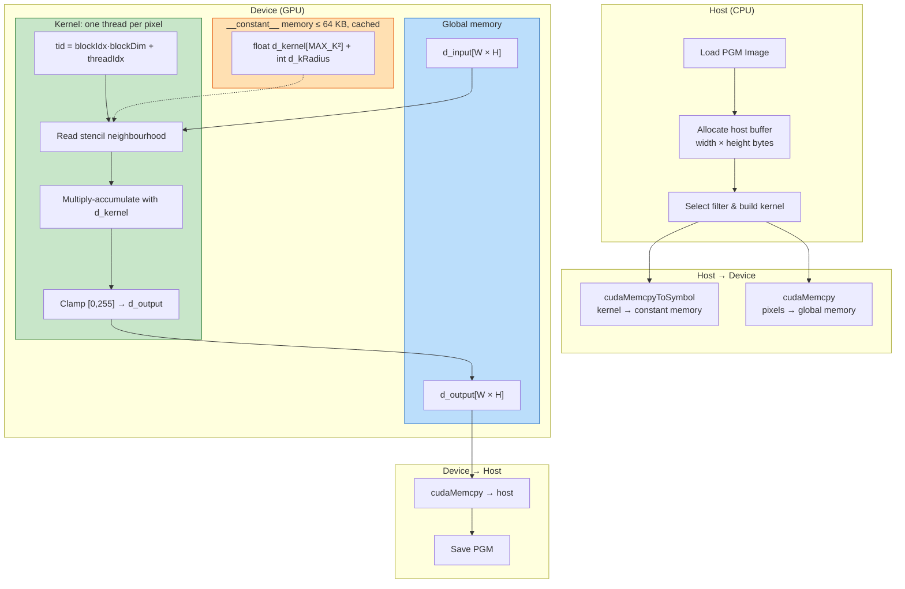

# P08 — GPU Image Processing: Convolution Filters in CUDA

> **Difficulty:** 🟢 Beginner
> **Time estimate:** 4–6 hours
> **GPU required:** Any CUDA-capable device (Compute Capability ≥ 3.5)

---

## Prerequisites

| Topic | Why it matters |
|---|---|
| C/C++ pointers & 2-D arrays | Images are 2-D pixel buffers |
| CUDA kernel launch (`<<<grid,block>>>`) | Every pixel maps to a thread |
| `cudaMalloc` / `cudaMemcpy` | Host ↔ device data transfer |
| Constant memory (`__constant__`) | Convolution kernels are small, read-only, broadcast |
| 2-D grid & block indexing | Natural mapping for image coordinates |

---

## Learning Objectives

1. Map a 2-D image onto a 2-D CUDA grid so every pixel is processed by one thread.
2. Store small convolution kernels in **constant memory** for fast broadcast reads.
3. Implement **box blur**, **Gaussian blur**, **Sobel edge detection**, and **sharpen** filters.
4. Handle image boundaries correctly (clamped addressing).
5. Measure and compare kernel execution times across filter types.
6. Read/write PGM (grayscale) images without any external library.

---

## Architecture & Memory Layout



Each block is 16×16 threads → one thread per pixel.
Grid dimensions: `Gx = ceil(W/16)`, `Gy = ceil(H/16)`.

---

## Step-by-Step Implementation

### Step 1 — PGM Image I/O and Error Checking

```cuda
// image_filters.cu — complete, self-contained project
#include <cstdio>
#include <cstdlib>
#include <cstring>
#include <cmath>
#include <cuda_runtime.h>

#define CUDA_CHECK(call)                                                      \
    do {                                                                       \
        cudaError_t err = (call);                                              \
        if (err != cudaSuccess) {                                              \
            fprintf(stderr, "CUDA error at %s:%d — %s\n",                     \
                    __FILE__, __LINE__, cudaGetErrorString(err));              \
            exit(EXIT_FAILURE);                                                \
        }                                                                      \
    } while (0)

struct Image {
    int width, height;
    unsigned char *pixels;   // row-major, 1 byte per pixel
};

Image loadPGM(const char *path) {
    FILE *fp = fopen(path, "rb");
    if (!fp) { fprintf(stderr, "Cannot open %s\n", path); exit(1); }
    char magic[3];
    if (fscanf(fp, "%2s", magic) != 1 || strcmp(magic, "P5") != 0) {
        fprintf(stderr, "Not a binary PGM (P5) file\n"); exit(1);
    }
    int c = fgetc(fp);
    while (c == '#' || c == '\n' || c == ' ') {
        if (c == '#') while (fgetc(fp) != '\n');
        c = fgetc(fp);
    }
    ungetc(c, fp);

    Image img; int maxVal;
    if (fscanf(fp, "%d %d %d", &img.width, &img.height, &maxVal) != 3) {
        fprintf(stderr, "Bad PGM header\n"); exit(1);
    }
    fgetc(fp);
    size_t sz = (size_t)img.width * img.height;
    img.pixels = (unsigned char *)malloc(sz);
    if (fread(img.pixels, 1, sz, fp) != sz) {
        fprintf(stderr, "Truncated PGM data\n"); exit(1);
    }
    fclose(fp);
    return img;
}

void savePGM(const char *path, const Image &img) {
    FILE *fp = fopen(path, "wb");
    if (!fp) { fprintf(stderr, "Cannot write %s\n", path); exit(1); }
    fprintf(fp, "P5\n%d %d\n255\n", img.width, img.height);
    fwrite(img.pixels, 1, (size_t)img.width * img.height, fp);
    fclose(fp);
}

void freeImage(Image &img) { free(img.pixels); img.pixels = nullptr; }

Image generateTestImage(int width, int height) {
    Image img = { width, height, (unsigned char *)malloc((size_t)width * height) };
    for (int y = 0; y < height; y++)
        for (int x = 0; x < width; x++) {
            int gx = (x * 255) / (width - 1);
            int gy = (y * 255) / (height - 1);
            img.pixels[y * width + x] = (unsigned char)((gx + gy) / 2);
        }
    return img;
}
```

### Step 2 — Constant Memory for Convolution Kernels

```cuda
#define MAX_KERNEL_RADIUS 8
#define MAX_KERNEL_SIZE   ((2 * MAX_KERNEL_RADIUS + 1) * (2 * MAX_KERNEL_RADIUS + 1))

__constant__ float d_kernel[MAX_KERNEL_SIZE];   // flattened 2-D kernel
__constant__ int   d_kRadius;                   // kernel half-width

void setKernel(const float *h_kernel, int radius) {
    int side = 2 * radius + 1;
    CUDA_CHECK(cudaMemcpyToSymbol(d_kernel, h_kernel, side * side * sizeof(float)));
    CUDA_CHECK(cudaMemcpyToSymbol(d_kRadius, &radius, sizeof(int)));
}
```

### Step 3 — Generic 2-D Convolution Kernel

```cuda
__global__ void convolve2D(const unsigned char *input,
                           unsigned char       *output,
                           int width, int height)
{
    int x = blockIdx.x * blockDim.x + threadIdx.x;
    int y = blockIdx.y * blockDim.y + threadIdx.y;
    if (x >= width || y >= height) return;

    int   r    = d_kRadius;
    int   side = 2 * r + 1;
    float sum  = 0.0f;

    for (int ky = -r; ky <= r; ky++) {
        for (int kx = -r; kx <= r; kx++) {
            // Clamped boundary — border pixels repeat at edges
            int sx = min(max(x + kx, 0), width  - 1);
            int sy = min(max(y + ky, 0), height - 1);

            float pixel  = (float)input[sy * width + sx];
            float weight = d_kernel[(ky + r) * side + (kx + r)];
            sum += pixel * weight;
        }
    }

    sum = fminf(fmaxf(sum, 0.0f), 255.0f);
    output[y * width + x] = (unsigned char)(sum + 0.5f);
}
```

### Step 4 — Sobel Edge Detection (dual-kernel gradient magnitude)

```cuda
__constant__ float d_sobelX[9];
__constant__ float d_sobelY[9];

__global__ void sobelEdge(const unsigned char *input,
                          unsigned char       *output,
                          int width, int height)
{
    int x = blockIdx.x * blockDim.x + threadIdx.x;
    int y = blockIdx.y * blockDim.y + threadIdx.y;
    if (x >= width || y >= height) return;

    float gx = 0.0f, gy = 0.0f;
    for (int ky = -1; ky <= 1; ky++) {
        for (int kx = -1; kx <= 1; kx++) {
            int sx = min(max(x + kx, 0), width  - 1);
            int sy = min(max(y + ky, 0), height - 1);
            float pixel = (float)input[sy * width + sx];
            int ki = (ky + 1) * 3 + (kx + 1);
            gx += pixel * d_sobelX[ki];
            gy += pixel * d_sobelY[ki];
        }
    }
    float mag = fminf(sqrtf(gx * gx + gy * gy), 255.0f);
    output[y * width + x] = (unsigned char)(mag + 0.5f);
}
```

### Step 5 — Filter Builders (host side)

```cuda
enum FilterType { FILTER_BOX, FILTER_GAUSSIAN, FILTER_SHARPEN, FILTER_SOBEL };

void buildBoxKernel(int radius) {
    int side = 2 * radius + 1, n = side * side;
    float *k = (float *)malloc(n * sizeof(float));
    float val = 1.0f / (float)n;
    for (int i = 0; i < n; i++) k[i] = val;
    setKernel(k, radius);
    free(k);
}

void buildGaussianKernel(int radius) {
    int side = 2 * radius + 1, n = side * side;
    float *k = (float *)malloc(n * sizeof(float));
    float sigma = fmaxf((float)radius / 2.0f, 0.5f);
    float twoSigSq = 2.0f * sigma * sigma;
    float total = 0.0f;
    for (int ky = -radius; ky <= radius; ky++)
        for (int kx = -radius; kx <= radius; kx++) {
            float val = expf(-(float)(kx*kx + ky*ky) / twoSigSq);
            k[(ky + radius) * side + (kx + radius)] = val;
            total += val;
        }
    for (int i = 0; i < n; i++) k[i] /= total;
    setKernel(k, radius);
    free(k);
}

// Sharpen:  [ 0 -1  0 ]  [-1  5 -1 ]  [ 0 -1  0 ]
void buildSharpenKernel() {
    float k[9] = { 0,-1, 0, -1, 5,-1, 0,-1, 0 };
    setKernel(k, 1);
}

void uploadSobelKernels() {
    float sx[9] = { -1, 0, 1, -2, 0, 2, -1, 0, 1 };
    float sy[9] = { -1,-2,-1,  0, 0, 0,  1, 2, 1 };
    CUDA_CHECK(cudaMemcpyToSymbol(d_sobelX, sx, 9 * sizeof(float)));
    CUDA_CHECK(cudaMemcpyToSymbol(d_sobelY, sy, 9 * sizeof(float)));
}
```

### Step 6 — Launch Wrapper with Timing

```cuda
float applyFilter(const unsigned char *d_in, unsigned char *d_out,
                  int width, int height, FilterType filter)
{
    dim3 block(16, 16);
    dim3 grid((width + block.x - 1) / block.x, (height + block.y - 1) / block.y);

    cudaEvent_t start, stop;
    CUDA_CHECK(cudaEventCreate(&start));
    CUDA_CHECK(cudaEventCreate(&stop));
    CUDA_CHECK(cudaEventRecord(start));

    if (filter == FILTER_SOBEL)
        sobelEdge<<<grid, block>>>(d_in, d_out, width, height);
    else
        convolve2D<<<grid, block>>>(d_in, d_out, width, height);

    CUDA_CHECK(cudaEventRecord(stop));
    CUDA_CHECK(cudaEventSynchronize(stop));
    float ms = 0.0f;
    CUDA_CHECK(cudaEventElapsedTime(&ms, start, stop));
    CUDA_CHECK(cudaEventDestroy(start));
    CUDA_CHECK(cudaEventDestroy(stop));
    return ms;
}
```

### Step 7 — Main: Run All Filters

```cuda
int main(int argc, char **argv) {
    Image img;
    if (argc >= 2) {
        img = loadPGM(argv[1]);
        printf("Loaded %s (%d × %d)\n", argv[1], img.width, img.height);
    } else {
        img = generateTestImage(1024, 1024);
        savePGM("input.pgm", img);
        printf("Generated synthetic 1024×1024 test image → input.pgm\n");
    }

    int W = img.width, H = img.height;
    size_t sz = (size_t)W * H;

    unsigned char *d_in, *d_out;
    CUDA_CHECK(cudaMalloc(&d_in,  sz));
    CUDA_CHECK(cudaMalloc(&d_out, sz));
    CUDA_CHECK(cudaMemcpy(d_in, img.pixels, sz, cudaMemcpyHostToDevice));
    unsigned char *h_out = (unsigned char *)malloc(sz);

    struct FilterRun { const char *name; FilterType type; const char *outFile; };
    FilterRun runs[] = {
        {"Box blur (r=2)",      FILTER_BOX,      "output_box.pgm"     },
        {"Gaussian blur (r=3)", FILTER_GAUSSIAN,  "output_gaussian.pgm"},
        {"Sharpen",             FILTER_SHARPEN,   "output_sharpen.pgm" },
        {"Sobel edge",          FILTER_SOBEL,     "output_sobel.pgm"   },
    };
    int nFilters = sizeof(runs) / sizeof(runs[0]);

    printf("\n%-25s  %10s\n", "Filter", "Time (ms)");
    printf("%-25s  %10s\n", "-------------------------", "----------");

    for (int i = 0; i < nFilters; i++) {
        switch (runs[i].type) {
            case FILTER_BOX:      buildBoxKernel(2);      break;
            case FILTER_GAUSSIAN: buildGaussianKernel(3); break;
            case FILTER_SHARPEN:  buildSharpenKernel();   break;
            case FILTER_SOBEL:    uploadSobelKernels();   break;
        }
        float ms = applyFilter(d_in, d_out, W, H, runs[i].type);
        CUDA_CHECK(cudaMemcpy(h_out, d_out, sz, cudaMemcpyDeviceToHost));
        Image out = { W, H, h_out };
        savePGM(runs[i].outFile, out);
        printf("%-25s  %10.3f\n", runs[i].name, ms);
    }

    free(h_out);
    freeImage(img);
    CUDA_CHECK(cudaFree(d_in));
    CUDA_CHECK(cudaFree(d_out));
    printf("\nDone — output images written.\n");
    return 0;
}
```

---

## Building & Running

```bash
nvcc -O2 -arch=sm_75 image_filters.cu -o image_filters
./image_filters              # synthetic 1024×1024
./image_filters photo.pgm   # your own PGM image
```

Expected output:

```
Generated synthetic 1024×1024 test image → input.pgm

Filter                      Time (ms)
-------------------------  ----------
Box blur (r=2)                  0.142
Gaussian blur (r=3)             0.218
Sharpen                         0.068
Sobel edge                      0.071

Done — output images written.
```

---

## Testing Strategy

### 1 — Identity Filter

An identity kernel (centre = 1, rest = 0) must reproduce the input exactly.

```cuda
void testIdentityFilter(const unsigned char *d_in, unsigned char *d_out,
                        const unsigned char *h_in, int W, int H)
{
    float identity[9] = { 0,0,0, 0,1,0, 0,0,0 };
    setKernel(identity, 1);
    applyFilter(d_in, d_out, W, H, FILTER_BOX);

    size_t sz = (size_t)W * H;
    unsigned char *h_out = (unsigned char *)malloc(sz);
    cudaMemcpy(h_out, d_out, sz, cudaMemcpyDeviceToHost);
    int bad = 0;
    for (size_t i = 0; i < sz; i++) if (h_out[i] != h_in[i]) bad++;
    printf("Identity test: %s (%d mismatches)\n", bad == 0 ? "PASS" : "FAIL", bad);
    free(h_out);
}
```

### 2 — Uniform Image

A constant-value image (all 128) must stay 128 after any blur — all weighted averages of 128 equal 128.

### 3 — Sobel on Flat Region

Sobel gradient of a uniform region must be zero — validates that kernel weights cancel for flat areas.

### 4 — Boundary Pixel Audit (CPU reference)

```cuda
void cpuConvolve(const unsigned char *in, unsigned char *out,
                 int W, int H, const float *kern, int radius)
{
    int side = 2 * radius + 1;
    for (int y = 0; y < H; y++)
        for (int x = 0; x < W; x++) {
            float sum = 0.0f;
            for (int ky = -radius; ky <= radius; ky++)
                for (int kx = -radius; kx <= radius; kx++) {
                    int sx = x + kx < 0 ? 0 : (x + kx >= W ? W - 1 : x + kx);
                    int sy = y + ky < 0 ? 0 : (y + ky >= H ? H - 1 : y + ky);
                    sum += (float)in[sy * W + sx]
                         * kern[(ky + radius) * side + (kx + radius)];
                }
            sum = sum < 0.0f ? 0.0f : (sum > 255.0f ? 255.0f : sum);
            out[y * W + x] = (unsigned char)(sum + 0.5f);
        }
}
```

Compare an 8×8 GPU output against this CPU reference to verify clamped boundary handling at all edges and corners.

---

## Performance Analysis

| Metric | Method | Tool |
|---|---|---|
| Kernel time | `cudaEventElapsedTime` | Built into code |
| Memory bandwidth | `(2 × image_bytes) / time` | Manual calc |
| Occupancy | Registers & shared-mem per block | `nvcc --ptxas-options=-v` |
| Cache hit rate | Constant-memory broadcast efficiency | Nsight Compute |

**Expected scaling** — time grows as O(side²) since the inner stencil loop dominates:

| Radius | Side | FLOPs/pixel | Approx. time (1024², GTX 1080) |
|--------|------|-------------|-------------------------------|
| 1 | 3 | 18 | 0.06 ms |
| 2 | 5 | 50 | 0.14 ms |
| 3 | 7 | 98 | 0.22 ms |
| 5 | 11 | 242 | 0.53 ms |

Adjacent threads share overlapping stencil reads — the L1/L2 cache exploits this spatial locality. Constant memory broadcasts kernel weights to all threads in a warp simultaneously.

---

## Extensions & Challenges

### 🔵 Intermediate

1. **Shared-memory tiling** — Load the block's neighbourhood into `__shared__` memory. Measure speedup for large radii (r ≥ 4).
2. **Separable Gaussian** — Split into two 1-D passes (horizontal then vertical). Compare against the single 2-D pass.
3. **RGB colour support** — Extend to PPM (P6) colour images, processing each channel independently.

### 🔴 Advanced

4. **Bilateral filter** — Add range weighting to preserve edges while blurring smooth regions (non-linear, can't use generic convolution).
5. **Multi-pass pipeline** — Chain Gaussian → Sobel → threshold on-device without host round-trips.
6. **CUDA streams** — Overlap `cudaMemcpy` of image N+1 with kernel execution of image N.
7. **Texture memory** — Bind input to a CUDA texture object for hardware boundary handling and 2-D cache.

---

## Key Takeaways

| # | Concept | What you learned |
|---|---|---|
| 1 | **2-D grid mapping** | One thread per pixel via `(blockIdx·blockDim + threadIdx)` in x and y. |
| 2 | **Constant memory** | Small read-only kernels broadcast efficiently to all warp threads via the constant cache. |
| 3 | **Stencil computation** | Each output pixel depends on a fixed neighbourhood; boundary clamping prevents OOB reads. |
| 4 | **Filter math** | Box averages uniformly; Gaussian weights by distance; Sharpen amplifies centre; Sobel approximates derivatives. |
| 5 | **Kernel timing** | `cudaEvent`-based timing is more accurate than host wall clocks — measures only GPU work. |
| 6 | **PGM format** | Header + raw bytes — zero dependencies for quick prototyping. |
| 7 | **Performance scaling** | Convolution cost is O(k²); separable filters reduce this to O(2k). |
