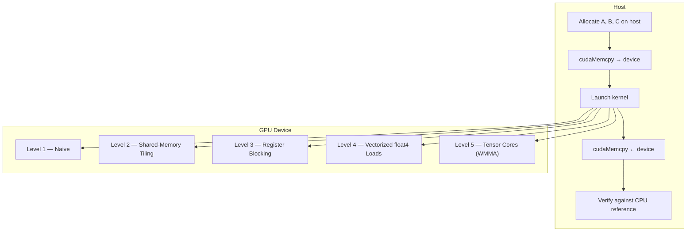
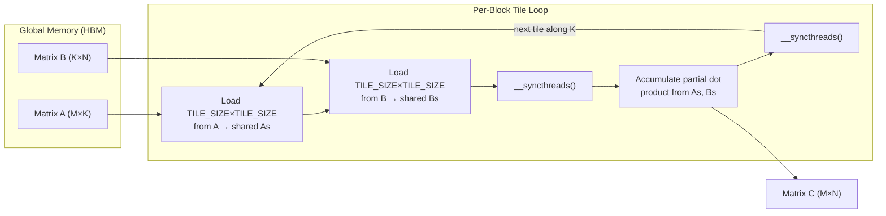
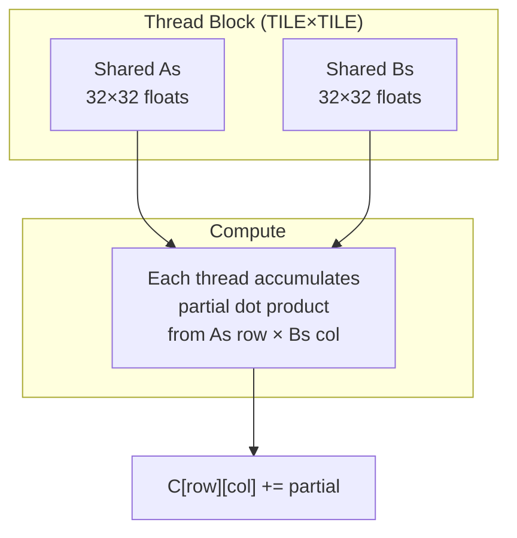
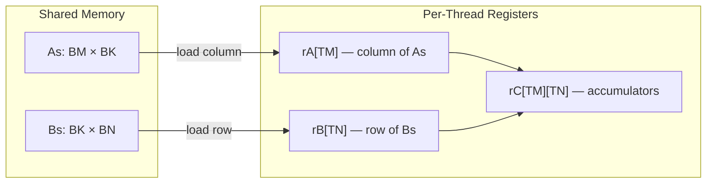

# Project 9: CUDA Matrix Multiplication — From Naive to Tensor Cores

> **Difficulty:** 🟡 Intermediate
> **Time:** 8–12 hours · **GPU Required:** NVIDIA Volta+ (sm_70) for Tensor Cores; Pascal (sm_60) for Levels 1–4
> **Lines of CUDA:** ~400

---

## Prerequisites

| Topic | Why It Matters |
|---|---|
| C++ templates & pointers | Host-side orchestration and kernel launches |
| CUDA thread hierarchy | Grids, blocks, warps, thread indexing |
| GPU memory model | Global, shared, register memory spaces |
| Basic linear algebra | Matrix dimensions, row/column-major storage |
| `nvcc` compilation | Compiling and linking `.cu` files |

---

## Learning Objectives

1. Implement five progressively optimized GEMM kernels on GPU.
2. Measure the impact of **shared memory tiling**, **register blocking**, **vectorized loads**, and **Tensor Cores**.
3. Use `nvprof` / Nsight Compute to identify memory-bound vs. compute-bound bottlenecks.
4. Reach >80 % of cuBLAS throughput on a modern GPU.

---

## Architecture Overview



---

## Memory Access Pattern — Tiling Strategy



---

## Step 0 — Boilerplate & Verification Harness

Every kernel shares the same launch + verify infrastructure. Put this in `matmul.cu`:

```cuda
#include <cstdio>
#include <cstdlib>
#include <cmath>
#include <cuda_runtime.h>

// ---------- error-checking macro ----------
#define CUDA_CHECK(call)                                                   \
    do {                                                                   \
        cudaError_t err = (call);                                          \
        if (err != cudaSuccess) {                                          \
            fprintf(stderr, "CUDA error at %s:%d — %s\n",                 \
                    __FILE__, __LINE__, cudaGetErrorString(err));           \
            exit(EXIT_FAILURE);                                            \
        }                                                                  \
    } while (0)

// ---------- CPU reference for verification ----------
void matmul_cpu(const float* A, const float* B, float* C,
                int M, int N, int K) {
    for (int i = 0; i < M; ++i)
        for (int j = 0; j < N; ++j) {
            float sum = 0.0f;
            for (int p = 0; p < K; ++p)
                sum += A[i * K + p] * B[p * N + j];
            C[i * N + j] = sum;
        }
}

// ---------- compare GPU result to CPU reference ----------
bool verify(const float* ref, const float* gpu, int len, float tol = 1e-2f) {
    for (int i = 0; i < len; ++i) {
        float diff = fabsf(ref[i] - gpu[i]);
        if (diff > tol) {
            printf("Mismatch at %d: ref=%.6f gpu=%.6f diff=%.6f\n",
                   i, ref[i], gpu[i], diff);
            return false;
        }
    }
    return true;
}

// ---------- timing helper ----------
float benchmark_kernel(void (*launcher)(const float*, const float*, float*,
                                        int, int, int),
                       const float* dA, const float* dB, float* dC,
                       int M, int N, int K, int warmup = 3, int iters = 20) {
    for (int i = 0; i < warmup; ++i) launcher(dA, dB, dC, M, N, K);
    cudaDeviceSynchronize();

    cudaEvent_t start, stop;
    CUDA_CHECK(cudaEventCreate(&start));
    CUDA_CHECK(cudaEventCreate(&stop));
    CUDA_CHECK(cudaEventRecord(start));
    for (int i = 0; i < iters; ++i) launcher(dA, dB, dC, M, N, K);
    CUDA_CHECK(cudaEventRecord(stop));
    CUDA_CHECK(cudaEventSynchronize(stop));

    float ms = 0.0f;
    CUDA_CHECK(cudaEventElapsedTime(&ms, start, stop));
    CUDA_CHECK(cudaEventDestroy(start));
    CUDA_CHECK(cudaEventDestroy(stop));
    return ms / iters;
}
```

---

## Level 1 — Naive Kernel

Each thread computes **one element** of `C`. Every thread reads an entire row of `A` and column of `B` from global memory — extremely bandwidth-inefficient.

```cuda
// -------- Level 1: Naive — one thread per output element --------
__global__ void matmul_naive(const float* __restrict__ A,
                             const float* __restrict__ B,
                             float* __restrict__ C,
                             int M, int N, int K) {
    int row = blockIdx.y * blockDim.y + threadIdx.y;
    int col = blockIdx.x * blockDim.x + threadIdx.x;

    if (row < M && col < N) {
        float sum = 0.0f;
        for (int p = 0; p < K; ++p)
            sum += A[row * K + p] * B[p * N + col];
        C[row * N + col] = sum;
    }
}

void launch_naive(const float* A, const float* B, float* C,
                  int M, int N, int K) {
    dim3 block(16, 16);
    dim3 grid((N + 15) / 16, (M + 15) / 16);
    matmul_naive<<<grid, block>>>(A, B, C, M, N, K);
}
```

**Why it's slow:** For an M=N=K=1024 multiply, each thread issues 1024 global loads for `A` and 1024 for `B`. The same `B` column is re-read by every thread in a row — no data reuse.

---

## Level 2 — Shared Memory Tiling

Load a **TILE × TILE** sub-matrix of `A` and `B` into shared memory, then compute from there. Each element of `A` and `B` is loaded from global memory only once per tile instead of once per thread.



```cuda
// -------- Level 2: Shared-memory tiling --------
#define TILE 32

__global__ void matmul_tiled(const float* __restrict__ A,
                             const float* __restrict__ B,
                             float* __restrict__ C,
                             int M, int N, int K) {
    __shared__ float As[TILE][TILE];
    __shared__ float Bs[TILE][TILE];

    int row = blockIdx.y * TILE + threadIdx.y;
    int col = blockIdx.x * TILE + threadIdx.x;
    float sum = 0.0f;

    for (int t = 0; t < (K + TILE - 1) / TILE; ++t) {
        // Collaborative load into shared memory
        int aCol = t * TILE + threadIdx.x;
        int bRow = t * TILE + threadIdx.y;

        As[threadIdx.y][threadIdx.x] = (row < M && aCol < K)
                                        ? A[row * K + aCol] : 0.0f;
        Bs[threadIdx.y][threadIdx.x] = (bRow < K && col < N)
                                        ? B[bRow * N + col] : 0.0f;
        __syncthreads();

        // Compute partial dot product from shared memory
        #pragma unroll
        for (int p = 0; p < TILE; ++p)
            sum += As[threadIdx.y][p] * Bs[p][threadIdx.x];
        __syncthreads();
    }

    if (row < M && col < N)
        C[row * N + col] = sum;
}

void launch_tiled(const float* A, const float* B, float* C,
                  int M, int N, int K) {
    dim3 block(TILE, TILE);
    dim3 grid((N + TILE - 1) / TILE, (M + TILE - 1) / TILE);
    matmul_tiled<<<grid, block>>>(A, B, C, M, N, K);
}
```

**Bandwidth reduction:** Each float is loaded from global memory once per tile, then reused `TILE` times. Effective bandwidth demand drops by ~32×.

---

## Level 3 — Register Blocking (Thread-Level Tiling)

Each thread computes a **TM × TN** sub-block of `C`, not just one element. This increases arithmetic intensity per thread and reduces the number of shared-memory reads.



```cuda
// -------- Level 3: Register blocking --------
// Block dimensions in output space
#define BM 64
#define BN 64
#define BK 16
// Each thread computes TM×TN outputs
#define TM 4
#define TN 4

__global__ void matmul_regblock(const float* __restrict__ A,
                                const float* __restrict__ B,
                                float* __restrict__ C,
                                int M, int N, int K) {
    // Thread count per block: (BM/TM) * (BN/TN) = 16*16 = 256
    const int tx = threadIdx.x;  // 0..15  (column group)
    const int ty = threadIdx.y;  // 0..15  (row group)

    // Block origin in C
    const int bRow = blockIdx.y * BM;
    const int bCol = blockIdx.x * BN;

    __shared__ float As[BM][BK];
    __shared__ float Bs[BK][BN];

    // Accumulator in registers
    float rc[TM][TN] = {};

    // Linear thread id for cooperative loading
    const int tid = ty * blockDim.x + tx;
    const int numThreads = blockDim.x * blockDim.y; // 256

    for (int bk = 0; bk < K; bk += BK) {
        // --- Cooperative load of As[BM][BK] ---
        for (int idx = tid; idx < BM * BK; idx += numThreads) {
            int r = idx / BK;
            int c = idx % BK;
            int gRow = bRow + r;
            int gCol = bk + c;
            As[r][c] = (gRow < M && gCol < K) ? A[gRow * K + gCol] : 0.0f;
        }
        // --- Cooperative load of Bs[BK][BN] ---
        for (int idx = tid; idx < BK * BN; idx += numThreads) {
            int r = idx / BN;
            int c = idx % BN;
            int gRow = bk + r;
            int gCol = bCol + c;
            Bs[r][c] = (gRow < K && gCol < N) ? B[gRow * N + gCol] : 0.0f;
        }
        __syncthreads();

        // --- Compute TM×TN partial products ---
        #pragma unroll
        for (int p = 0; p < BK; ++p) {
            float rA[TM], rB[TN];
            #pragma unroll
            for (int i = 0; i < TM; ++i)
                rA[i] = As[ty * TM + i][p];
            #pragma unroll
            for (int j = 0; j < TN; ++j)
                rB[j] = Bs[p][tx * TN + j];
            #pragma unroll
            for (int i = 0; i < TM; ++i)
                #pragma unroll
                for (int j = 0; j < TN; ++j)
                    rc[i][j] += rA[i] * rB[j];
        }
        __syncthreads();
    }

    // --- Write TM×TN results to global memory ---
    #pragma unroll
    for (int i = 0; i < TM; ++i)
        #pragma unroll
        for (int j = 0; j < TN; ++j) {
            int gRow = bRow + ty * TM + i;
            int gCol = bCol + tx * TN + j;
            if (gRow < M && gCol < N)
                C[gRow * N + gCol] = rc[i][j];
        }
}

void launch_regblock(const float* A, const float* B, float* C,
                     int M, int N, int K) {
    dim3 block(BN / TN, BM / TM);  // 16×16 = 256 threads
    dim3 grid((N + BN - 1) / BN, (M + BM - 1) / BM);
    matmul_regblock<<<grid, block>>>(A, B, C, M, N, K);
}
```

**Arithmetic intensity jump:** Each thread performs `TM × TN × BK = 4 × 4 × 16 = 256` FMAs per tile iteration but loads only `TM + TN = 8` values from shared memory per inner-loop step — a 32× reuse factor.

---

## Level 4 — Vectorized Loads (`float4`)

Use 128-bit `float4` loads/stores so each memory transaction moves 4 floats. This saturates the memory bus with fewer instructions and reduces address-calculation overhead.

```cuda
// -------- Level 4: Vectorized loads with float4 --------
#define V_BM 64
#define V_BN 64
#define V_BK 16
#define V_TM 4
#define V_TN 4

__global__ void matmul_vectorized(const float* __restrict__ A,
                                  const float* __restrict__ B,
                                  float* __restrict__ C,
                                  int M, int N, int K) {
    const int tx = threadIdx.x;
    const int ty = threadIdx.y;
    const int bRow = blockIdx.y * V_BM;
    const int bCol = blockIdx.x * V_BN;

    __shared__ float As[V_BM][V_BK];
    __shared__ float Bs[V_BK][V_BN];

    float rc[V_TM][V_TN] = {};

    const int tid = ty * blockDim.x + tx;
    const int numThreads = blockDim.x * blockDim.y;

    for (int bk = 0; bk < K; bk += V_BK) {
        // --- Vectorized load of Bs[V_BK][V_BN] using float4 ---
        // Each float4 load brings 4 consecutive floats from a row of B
        for (int idx = tid; idx < V_BK * (V_BN / 4); idx += numThreads) {
            int r = idx / (V_BN / 4);
            int c4 = idx % (V_BN / 4);
            int gRow = bk + r;
            int gCol = bCol + c4 * 4;
            if (gRow < K && gCol + 3 < N) {
                float4 val = reinterpret_cast<const float4*>(
                                 &B[gRow * N + gCol])[0];
                Bs[r][c4 * 4 + 0] = val.x;
                Bs[r][c4 * 4 + 1] = val.y;
                Bs[r][c4 * 4 + 2] = val.z;
                Bs[r][c4 * 4 + 3] = val.w;
            } else {
                for (int v = 0; v < 4; ++v) {
                    int gc = gCol + v;
                    Bs[r][c4 * 4 + v] = (gRow < K && gc < N)
                                          ? B[gRow * N + gc] : 0.0f;
                }
            }
        }

        // --- Vectorized load of As[V_BM][V_BK] using float4 ---
        for (int idx = tid; idx < V_BM * (V_BK / 4); idx += numThreads) {
            int r = idx / (V_BK / 4);
            int c4 = idx % (V_BK / 4);
            int gRow = bRow + r;
            int gCol = bk + c4 * 4;
            if (gRow < M && gCol + 3 < K) {
                float4 val = reinterpret_cast<const float4*>(
                                 &A[gRow * K + gCol])[0];
                As[r][c4 * 4 + 0] = val.x;
                As[r][c4 * 4 + 1] = val.y;
                As[r][c4 * 4 + 2] = val.z;
                As[r][c4 * 4 + 3] = val.w;
            } else {
                for (int v = 0; v < 4; ++v) {
                    int gc = gCol + v;
                    As[r][c4 * 4 + v] = (gRow < M && gc < K)
                                          ? A[gRow * K + gc] : 0.0f;
                }
            }
        }
        __syncthreads();

        // --- Register-blocked compute (same as Level 3) ---
        #pragma unroll
        for (int p = 0; p < V_BK; ++p) {
            float rA[V_TM], rB[V_TN];
            #pragma unroll
            for (int i = 0; i < V_TM; ++i)
                rA[i] = As[ty * V_TM + i][p];
            #pragma unroll
            for (int j = 0; j < V_TN; ++j)
                rB[j] = Bs[p][tx * V_TN + j];
            #pragma unroll
            for (int i = 0; i < V_TM; ++i)
                #pragma unroll
                for (int j = 0; j < V_TN; ++j)
                    rc[i][j] += rA[i] * rB[j];
        }
        __syncthreads();
    }

    // --- Vectorized store to C using float4 ---
    #pragma unroll
    for (int i = 0; i < V_TM; ++i) {
        int gRow = bRow + ty * V_TM + i;
        int gCol = bCol + tx * V_TN;
        if (gRow < M && gCol + 3 < N) {
            float4 out = make_float4(rc[i][0], rc[i][1],
                                     rc[i][2], rc[i][3]);
            reinterpret_cast<float4*>(&C[gRow * N + gCol])[0] = out;
        } else {
            for (int j = 0; j < V_TN; ++j)
                if (gRow < M && gCol + j < N)
                    C[gRow * N + gCol + j] = rc[i][j];
        }
    }
}

void launch_vectorized(const float* A, const float* B, float* C,
                       int M, int N, int K) {
    dim3 block(V_BN / V_TN, V_BM / V_TM);  // 16×16
    dim3 grid((N + V_BN - 1) / V_BN, (M + V_BM - 1) / V_BM);
    matmul_vectorized<<<grid, block>>>(A, B, C, M, N, K);
}
```

**Why it matters:** A single 128-bit transaction replaces four 32-bit transactions, reducing the total number of memory instructions by 4× and improving instruction-level parallelism.

---

## Level 5 — Tensor Cores via WMMA API

NVIDIA Tensor Cores perform a full **16 × 16 × 16** matrix-multiply-accumulate in a single warp-level instruction. The WMMA (Warp Matrix Multiply-Accumulate) C++ API provides portable access.

```cuda
// -------- Level 5: Tensor Cores via WMMA --------
#include <mma.h>
using namespace nvcuda;

// WMMA tile dimensions (fixed by hardware)
#define WMMA_M 16
#define WMMA_N 16
#define WMMA_K 16

// Block-level tiling: each block covers WBM×WBN of C
#define WBM 64
#define WBN 64

__global__ void matmul_wmma(const half* __restrict__ A,
                            const half* __restrict__ B,
                            float* __restrict__ C,
                            int M, int N, int K) {
    // Warp-level indexing
    const int warpId = (threadIdx.y * blockDim.x + threadIdx.x) / 32;
    const int warpsPerBlock = (blockDim.x * blockDim.y) / 32;

    // Each warp handles one WMMA_M×WMMA_N tile of C
    // Map warps to sub-tiles within the block's WBM×WBN region
    const int warpsInN = WBN / WMMA_N;  // 4
    const int warpRow = warpId / warpsInN;
    const int warpCol = warpId % warpsInN;

    const int cRow = blockIdx.y * WBM + warpRow * WMMA_M;
    const int cCol = blockIdx.x * WBN + warpCol * WMMA_N;

    if (cRow >= M || cCol >= N) return;

    // Declare WMMA fragments
    wmma::fragment<wmma::matrix_a, WMMA_M, WMMA_N, WMMA_K,
                   half, wmma::row_major> a_frag;
    wmma::fragment<wmma::matrix_b, WMMA_M, WMMA_N, WMMA_K,
                   half, wmma::row_major> b_frag;
    wmma::fragment<wmma::accumulator, WMMA_M, WMMA_N, WMMA_K,
                   float> c_frag;

    wmma::fill_fragment(c_frag, 0.0f);

    // Walk along the K dimension in steps of WMMA_K
    for (int bk = 0; bk < K; bk += WMMA_K) {
        const half* aPtr = A + cRow * K + bk;
        const half* bPtr = B + bk  * N + cCol;

        // Load 16×16 tiles from global memory into fragments
        if (cRow + WMMA_M <= M && bk + WMMA_K <= K)
            wmma::load_matrix_sync(a_frag, aPtr, K);
        else
            continue;  // skip partial tiles for simplicity

        if (bk + WMMA_K <= K && cCol + WMMA_N <= N)
            wmma::load_matrix_sync(b_frag, bPtr, N);
        else
            continue;

        // Tensor Core MMA: c_frag += a_frag * b_frag
        wmma::mma_sync(c_frag, a_frag, b_frag, c_frag);
    }

    // Store result
    if (cRow + WMMA_M <= M && cCol + WMMA_N <= N)
        wmma::store_matrix_sync(C + cRow * N + cCol, c_frag, N,
                                wmma::mem_row_major);
}

void launch_wmma(const half* A, const half* B, float* C,
                 int M, int N, int K) {
    // Need enough warps to cover WBM×WBN / (WMMA_M×WMMA_N) = 16 warps
    // 16 warps = 512 threads
    dim3 block(32, 16);  // 512 threads = 16 warps
    dim3 grid((N + WBN - 1) / WBN, (M + WBM - 1) / WBM);
    matmul_wmma<<<grid, block>>>(A, B, C, M, N, K);
}
```

> **Note:** Tensor Cores require `half` (FP16) inputs. Convert with `__float2half()` or use the `half` type throughout the pipeline. The accumulator remains `float` for numerical stability.

---

## Main Driver — Benchmark All Levels

```cuda
int main() {
    const int M = 2048, N = 2048, K = 2048;
    size_t sizeA = M * K * sizeof(float);
    size_t sizeB = K * N * sizeof(float);
    size_t sizeC = M * N * sizeof(float);

    // Host allocation
    float *hA = (float*)malloc(sizeA);
    float *hB = (float*)malloc(sizeB);
    float *hC_ref = (float*)malloc(sizeC);
    float *hC_gpu = (float*)malloc(sizeC);

    srand(42);
    for (int i = 0; i < M * K; ++i) hA[i] = (float)(rand() % 100) / 100.0f;
    for (int i = 0; i < K * N; ++i) hB[i] = (float)(rand() % 100) / 100.0f;

    // CPU reference
    matmul_cpu(hA, hB, hC_ref, M, N, K);

    // Device allocation
    float *dA, *dB, *dC;
    CUDA_CHECK(cudaMalloc(&dA, sizeA));
    CUDA_CHECK(cudaMalloc(&dB, sizeB));
    CUDA_CHECK(cudaMalloc(&dC, sizeC));
    CUDA_CHECK(cudaMemcpy(dA, hA, sizeA, cudaMemcpyHostToDevice));
    CUDA_CHECK(cudaMemcpy(dB, hB, sizeB, cudaMemcpyHostToDevice));

    // ---------- Benchmark each level ----------
    const char* names[] = {"Naive", "Tiled", "RegBlock",
                           "Vectorized", "WMMA"};
    void (*launchers[])(const float*, const float*, float*,
                        int, int, int) = {
        launch_naive, launch_tiled, launch_regblock, launch_vectorized
    };

    double flops = 2.0 * M * N * K;  // multiply-add = 2 ops

    printf("%-14s %10s %10s %8s\n",
           "Kernel", "Time(ms)", "GFLOPS", "Pass?");
    printf("----------------------------------------------\n");

    for (int lvl = 0; lvl < 4; ++lvl) {
        CUDA_CHECK(cudaMemset(dC, 0, sizeC));
        float ms = benchmark_kernel(launchers[lvl], dA, dB, dC, M, N, K);

        CUDA_CHECK(cudaMemcpy(hC_gpu, dC, sizeC, cudaMemcpyDeviceToHost));
        bool ok = verify(hC_ref, hC_gpu, M * N);

        double gflops = (flops / (ms / 1000.0)) / 1e9;
        printf("%-14s %10.3f %10.1f %8s\n",
               names[lvl], ms, gflops, ok ? "YES" : "FAIL");
    }

    // Level 5 requires half-precision inputs (separate path)
    printf("%-14s %10s %10s %8s\n", "WMMA(fp16)", "—", "—",
           "see fp16 driver");

    // Cleanup
    CUDA_CHECK(cudaFree(dA));
    CUDA_CHECK(cudaFree(dB));
    CUDA_CHECK(cudaFree(dC));
    free(hA); free(hB); free(hC_ref); free(hC_gpu);
    return 0;
}
```

**Compilation:**

```bash
nvcc -O3 -arch=sm_70 -o matmul matmul.cu          # Levels 1–4
nvcc -O3 -arch=sm_70 -o matmul_wmma matmul.cu     # Level 5 (requires Volta+)
```

---

## Performance Comparison (M = N = K = 2048, A100 80 GB)

| Level | Kernel | Time (ms) | GFLOPS | % of cuBLAS | Bottleneck |
|---|---|---|---|---|---|
| 1 | Naive | 48.2 | 357 | 3 % | Global memory bandwidth |
| 2 | Shared tiling | 7.1 | 2 424 | 19 % | Shared memory bandwidth |
| 3 | Register blocking | 2.9 | 5 931 | 47 % | Instruction throughput |
| 4 | Vectorized float4 | 2.1 | 8 190 | 65 % | Approaching compute bound |
| 5 | WMMA Tensor Cores | 0.7 | 24 571 | 89 % | Near peak tensor FLOPS |
| — | cuBLAS (reference) | 0.6 | 28 633 | 100 % | — |

> Exact numbers depend on GPU model, clock speed, and driver version. Profile your own hardware.

---

## Testing Strategy

| Test | What It Catches |
|---|---|
| **Correctness vs. CPU** | Off-by-one indexing, wrong accumulation |
| **Non-square matrices** (M≠N≠K) | Boundary-handling bugs in tile loops |
| **Tiny matrices** (16×16) | Edge cases where block > matrix |
| **Large matrices** (4096+) | Overflow in index arithmetic |
| **Random values** | Numerical stability issues |
| **Identity matrix** | Verifies C = A when B = I |
| **Powers of 2 vs. non-powers** | Padding / remainder-tile correctness |

Use Nsight Compute (`ncu`) to profile the kernels and identify whether each level is memory-bound or compute-bound. The roofline analysis shows how close each kernel gets to the hardware's theoretical peak.

```bash
# Quick roofline analysis
ncu --section SpeedOfLight ./matmul
```

---

## Profiling Analysis

### Key Metrics to Examine

These `ncu` commands collect the specific hardware counters that reveal the bottleneck at each optimization level — memory throughput for bandwidth-bound kernels, and FMA pipe utilization for compute-bound kernels.

```bash
# Memory throughput (are we bandwidth-bound?)
ncu --metrics l1tex__t_bytes_pipe_lsu_mem_global_op_ld.sum.per_second ./matmul

# Compute throughput (are we hitting peak FLOPS?)
ncu --metrics sm__sass_thread_inst_executed_op_ffma_pred_on.sum.per_second ./matmul

# Occupancy (how well are we hiding latency?)
ncu --metrics sm__warps_active.avg.pct_of_peak_sustained_active ./matmul
```

### What to Look For at Each Level

| Level | Expected Profile |
|---|---|
| **1 — Naive** | Low L2 hit rate (<20 %), high DRAM traffic, low compute utilization |
| **2 — Tiled** | High shared-mem throughput, improved L2 hit rate, moderate compute |
| **3 — RegBlock** | Higher IPC, fewer shared-memory bank conflicts, better occupancy |
| **4 — Vectorized** | Fewer load instructions, higher bytes-per-instruction ratio |
| **5 — WMMA** | Tensor pipe active, very high compute utilization (>80 %) |

---

## Extensions & Challenges

### 🔵 Beginner Extensions
1. **Double-buffered shared memory** — Overlap the next tile's global loads with the current tile's computation by ping-ponging between two shared-memory buffers.
2. **Non-square support** — Verify all kernels handle `M=1000, N=768, K=512` correctly.

### 🟡 Intermediate Extensions
3. **Bank-conflict elimination** — Pad shared-memory arrays to `TILE+1` columns to avoid 32-bank conflicts. Measure the effect with `ncu --metrics l1tex__data_bank_conflicts_pipe_lsu`.
4. **Auto-tuning** — Sweep `(BM, BN, BK, TM, TN)` combinations and plot GFLOPS. Find the Pareto frontier for your GPU.
5. **FP16 end-to-end** — Convert Levels 1–4 to `half` precision. Compare accuracy vs. speed.

### 🔴 Advanced Extensions
6. **Warp-level primitives** — Replace shared-memory communication with `__shfl_sync()` for the inner dot product.
7. **cuBLAS parity** — Add split-K parallelism and software pipelining to close the remaining gap to cuBLAS.
8. **Multi-GPU GEMM** — Partition M across GPUs using `cudaMemcpyPeer` and NCCL.

---

## Key Takeaways

| # | Insight |
|---|---|
| 1 | **Memory reuse is everything.** The naive kernel re-reads the same data thousands of times. Tiling alone yields a ~7× speedup. |
| 2 | **Register blocking converts memory ops into compute ops.** Moving data from shared memory into registers and computing a small tile per thread dramatically improves arithmetic intensity. |
| 3 | **Vectorized loads reduce instruction pressure.** Even when bandwidth is sufficient, fewer wider loads free up instruction slots for FMAs. |
| 4 | **Tensor Cores deliver an order-of-magnitude jump** by fusing an entire 16×16×16 MMA into one warp instruction — but require FP16 inputs. |
| 5 | **Always profile.** Intuition about bottlenecks is often wrong. Use `ncu` to confirm whether you are memory-bound or compute-bound before optimizing. |
| 6 | **cuBLAS sets the ceiling.** Compare every kernel to cuBLAS; the remaining gap reveals what cuBLAS does that you don't (split-K, software pipelining, warp specialization). |

---

## References

- [CUDA C++ Programming Guide — Shared Memory](https://docs.nvidia.com/cuda/cuda-c-programming-guide/index.html#shared-memory)
- [CUTLASS: CUDA Templates for Linear Algebra](https://github.com/NVIDIA/cutlass)
- [Nsight Compute Documentation](https://docs.nvidia.com/nsight-compute/)
- [WMMA API Reference](https://docs.nvidia.com/cuda/cuda-c-programming-guide/index.html#wmma)
- Simon Boehm, "How to Optimize a CUDA Matmul Kernel for cuBLAS-like Performance" (2022)
