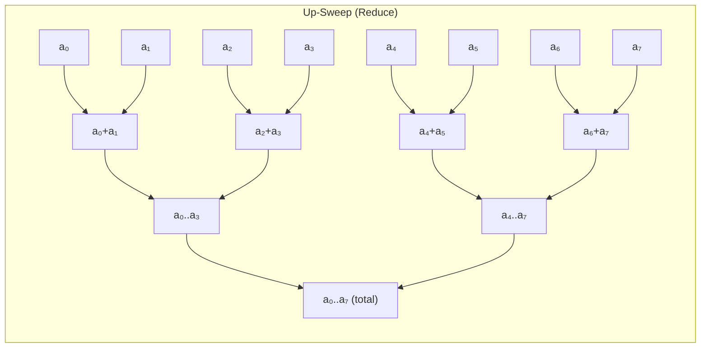
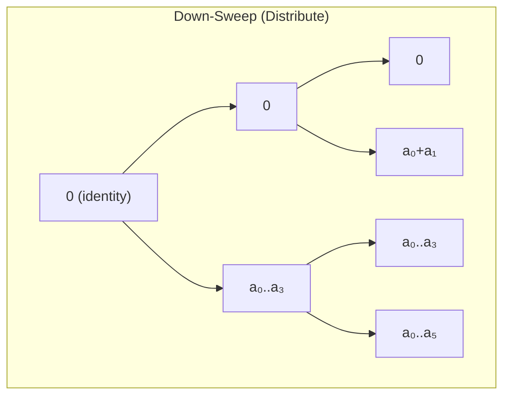
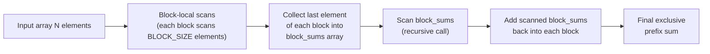

# Project 10 — Blelloch Parallel Prefix Scan & Applications

> **Difficulty:** 🟡 Intermediate  |  **Time:** 6–8 hours  |  **GPU:** CC ≥ 6.0

## Prerequisites

| Topic | Why it matters |
|---|---|
| CUDA thread/block model | Kernel launch geometry, shared memory |
| Shared memory & `__syncthreads()` | Core of the in-block scan |
| Bank conflicts | Padding trick used in this project |
| Parallel reduction (Project P08 or equivalent) | Up-sweep is a reduction; same tree idea |
| Big-O work/step complexity | Distinguishing *work-efficient* from *step-efficient* |

## Learning Objectives

1. Implement the **Blelloch work-efficient exclusive scan** (up-sweep + down-sweep).
2. Extend to **arbitrary-length arrays** with a block-level scan → block-sum scan → propagation pattern.
3. Build a real application: **stream compaction** (filtering elements by predicate).
4. Compare hand-written kernels against **CUB `DeviceScan`** for correctness and throughput.
5. Understand bank-conflict avoidance via the **padding macro**.

## Architecture Overview

### Blelloch Scan — Two-Phase Tree





### Large-Array Multi-Block Pipeline



## Step-by-Step Implementation

### 1 — Header, Constants, and Utilities

This section sets up the includes, defines the bank-conflict padding macro (which inserts one padding slot every 32 elements to avoid shared-memory bank conflicts), and provides a simple CPU exclusive scan for reference testing. The `CUDA_CHECK` macro wraps every CUDA API call to catch errors immediately with file and line information.

```cuda
// blelloch_scan.cu
#include <cuda_runtime.h>
#include <cub/cub.cuh>
#include <cstdio>
#include <cstdlib>
#include <cassert>

// Avoid shared-memory bank conflicts: insert one padding slot every 32 elements
#define NUM_BANKS 32
#define LOG_NUM_BANKS 5
#define CONFLICT_FREE_OFFSET(n) ((n) >> LOG_NUM_BANKS)

#define BLOCK_SIZE 256          // threads per block (each thread handles 2 elements)
#define ELEMENTS_PER_BLOCK (2 * BLOCK_SIZE)

#define CUDA_CHECK(call) do {                                       \
    cudaError_t err = call;                                         \
    if (err != cudaSuccess) {                                       \
        fprintf(stderr, "CUDA error %s:%d: %s\n",                  \
                __FILE__, __LINE__, cudaGetErrorString(err));       \
        exit(EXIT_FAILURE);                                         \
    }                                                               \
} while(0)

// ─── CPU reference (inclusive → exclusive by shifting) ───
void cpu_exclusive_scan(const int* in, int* out, int n) {
    out[0] = 0;
    for (int i = 1; i < n; i++)
        out[i] = out[i - 1] + in[i - 1];
}
```

### 2 — Single-Block Blelloch Kernel

This kernel handles up to `ELEMENTS_PER_BLOCK` (512) elements in one block.

```cuda
__global__ void blelloch_scan_kernel(int* g_odata, const int* g_idata,
                                     int* block_sums, int n) {
    // Padded shared memory to avoid bank conflicts
    __shared__ int temp[ELEMENTS_PER_BLOCK + CONFLICT_FREE_OFFSET(ELEMENTS_PER_BLOCK)];

    int tid = threadIdx.x;
    int blockOffset = blockIdx.x * ELEMENTS_PER_BLOCK;

    // ── Load two elements per thread into shared memory ──
    int ai = tid;
    int bi = tid + BLOCK_SIZE;
    int bankOffsetA = CONFLICT_FREE_OFFSET(ai);
    int bankOffsetB = CONFLICT_FREE_OFFSET(bi);

    int idxA = blockOffset + ai;
    int idxB = blockOffset + bi;
    temp[ai + bankOffsetA] = (idxA < n) ? g_idata[idxA] : 0;
    temp[bi + bankOffsetB] = (idxB < n) ? g_idata[idxB] : 0;

    // ────────────────────── UP-SWEEP (reduce) ──────────────────────
    int offset = 1;
    for (int d = ELEMENTS_PER_BLOCK >> 1; d > 0; d >>= 1) {
        __syncthreads();
        if (tid < d) {
            int ai_idx = offset * (2 * tid + 1) - 1;
            int bi_idx = offset * (2 * tid + 2) - 1;
            ai_idx += CONFLICT_FREE_OFFSET(ai_idx);
            bi_idx += CONFLICT_FREE_OFFSET(bi_idx);
            temp[bi_idx] += temp[ai_idx];
        }
        offset <<= 1;
    }

    // Store block total then clear last element for exclusive scan
    int lastIdx = ELEMENTS_PER_BLOCK - 1 + CONFLICT_FREE_OFFSET(ELEMENTS_PER_BLOCK - 1);
    if (tid == 0) {
        if (block_sums != nullptr)
            block_sums[blockIdx.x] = temp[lastIdx];
        temp[lastIdx] = 0;
    }

    // ────────────────────── DOWN-SWEEP ──────────────────────
    for (int d = 1; d < ELEMENTS_PER_BLOCK; d <<= 1) {
        offset >>= 1;
        __syncthreads();
        if (tid < d) {
            int ai_idx = offset * (2 * tid + 1) - 1;
            int bi_idx = offset * (2 * tid + 2) - 1;
            ai_idx += CONFLICT_FREE_OFFSET(ai_idx);
            bi_idx += CONFLICT_FREE_OFFSET(bi_idx);

            int t = temp[ai_idx];
            temp[ai_idx] = temp[bi_idx];
            temp[bi_idx] += t;
        }
    }
    __syncthreads();

    // ── Write results back to global memory ──
    if (idxA < n) g_odata[idxA] = temp[ai + bankOffsetA];
    if (idxB < n) g_odata[idxB] = temp[bi + bankOffsetB];
}
```

### 3 — Block-Sum Propagation Kernel

After scanning block sums, add each block's prefix into its elements.

```cuda
__global__ void add_block_sums_kernel(int* data, const int* block_sums, int n) {
    int idx = blockIdx.x * ELEMENTS_PER_BLOCK + threadIdx.x;
    if (blockIdx.x == 0) return;               // first block needs no adjustment
    int addVal = block_sums[blockIdx.x];

    if (idx < n)
        data[idx] += addVal;
    int idx2 = idx + BLOCK_SIZE;
    if (idx2 < n)
        data[idx2] += addVal;
}
```

### 4 — Recursive Large-Array Scan

This host function handles arrays larger than one block by applying the three-phase pattern: first scan each block locally (collecting each block's total), then recursively scan those block totals, and finally propagate the scanned totals back into each block. The recursion bottoms out when the array fits in a single block, making this work for arbitrarily large inputs.

```cuda
void blelloch_scan(int* d_out, const int* d_in, int n) {
    int numBlocks = (n + ELEMENTS_PER_BLOCK - 1) / ELEMENTS_PER_BLOCK;

    if (numBlocks == 1) {
        blelloch_scan_kernel<<<1, BLOCK_SIZE>>>(d_out, d_in, nullptr, n);
        CUDA_CHECK(cudaGetLastError());
        return;
    }

    int* d_block_sums = nullptr;
    int* d_block_sums_scanned = nullptr;
    CUDA_CHECK(cudaMalloc(&d_block_sums,         numBlocks * sizeof(int)));
    CUDA_CHECK(cudaMalloc(&d_block_sums_scanned,  numBlocks * sizeof(int)));

    // Phase 1: block-local scans, collecting each block's total
    blelloch_scan_kernel<<<numBlocks, BLOCK_SIZE>>>(d_out, d_in, d_block_sums, n);
    CUDA_CHECK(cudaGetLastError());

    // Phase 2: recursively scan the block sums
    blelloch_scan(d_block_sums_scanned, d_block_sums, numBlocks);

    // Phase 3: add scanned block sums back to each block
    add_block_sums_kernel<<<numBlocks, BLOCK_SIZE>>>(d_out, d_block_sums_scanned, n);
    CUDA_CHECK(cudaGetLastError());

    CUDA_CHECK(cudaFree(d_block_sums));
    CUDA_CHECK(cudaFree(d_block_sums_scanned));
}
```

### 5 — Stream Compaction (Filter Application)

Stream compaction keeps only elements satisfying a predicate. The scan produces scatter-write indices.

```cuda
__global__ void compute_predicate_kernel(const int* input, int* flags, int n, int threshold) {
    int idx = blockIdx.x * blockDim.x + threadIdx.x;
    if (idx < n)
        flags[idx] = (input[idx] > threshold) ? 1 : 0;
}

__global__ void scatter_kernel(const int* input, const int* flags,
                               const int* scan_result, int* output, int n) {
    int idx = blockIdx.x * blockDim.x + threadIdx.x;
    if (idx < n && flags[idx] == 1)
        output[scan_result[idx]] = input[idx];
}

int stream_compact(const int* d_input, int* d_output, int n, int threshold) {
    int *d_flags, *d_scan;
    CUDA_CHECK(cudaMalloc(&d_flags, n * sizeof(int)));
    CUDA_CHECK(cudaMalloc(&d_scan,  n * sizeof(int)));

    int threads = 256;
    int blocks  = (n + threads - 1) / threads;

    // Step 1: mark elements that pass the predicate
    compute_predicate_kernel<<<blocks, threads>>>(d_input, d_flags, n, threshold);
    CUDA_CHECK(cudaGetLastError());

    // Step 2: exclusive scan on the flags → scatter addresses
    blelloch_scan(d_scan, d_flags, n);

    // Step 3: scatter surviving elements to compacted positions
    scatter_kernel<<<blocks, threads>>>(d_input, d_flags, d_scan, d_output, n);
    CUDA_CHECK(cudaGetLastError());

    // Compute compacted count: scan[n-1] + flags[n-1]
    int lastScan, lastFlag;
    CUDA_CHECK(cudaMemcpy(&lastScan, d_scan  + n - 1, sizeof(int), cudaMemcpyDeviceToHost));
    CUDA_CHECK(cudaMemcpy(&lastFlag, d_flags + n - 1, sizeof(int), cudaMemcpyDeviceToHost));

    CUDA_CHECK(cudaFree(d_flags));
    CUDA_CHECK(cudaFree(d_scan));
    return lastScan + lastFlag;
}
```

### 6 — CUB Comparison Wrapper

This wrapper calls NVIDIA's CUB library `DeviceScan::ExclusiveSum`, which is the production-grade scan implementation. CUB uses a single-pass decoupled look-back algorithm with warp-level intrinsics, making it significantly faster than our hand-written Blelloch kernel. We use it as a correctness and performance baseline.

```cuda
void cub_exclusive_scan(int* d_out, const int* d_in, int n) {
    void*  d_temp     = nullptr;
    size_t temp_bytes = 0;

    // Query temp storage size
    cub::DeviceScan::ExclusiveSum(d_temp, temp_bytes, d_in, d_out, n);
    CUDA_CHECK(cudaMalloc(&d_temp, temp_bytes));

    // Run scan
    cub::DeviceScan::ExclusiveSum(d_temp, temp_bytes, d_in, d_out, n);
    CUDA_CHECK(cudaDeviceSynchronize());
    CUDA_CHECK(cudaFree(d_temp));
}
```

### 7 — SpMV-CSR Helper (Sparse Matrix × Vector)

Prefix scan computes row pointers for CSR format on the fly.

```cuda
__global__ void spmv_csr_kernel(int num_rows,
                                const int* row_ptr,    // from prefix scan of nnz_per_row
                                const int* col_idx,
                                const float* values,
                                const float* x,
                                float* y) {
    int row = blockIdx.x * blockDim.x + threadIdx.x;
    if (row >= num_rows) return;

    float dot = 0.0f;
    int row_start = row_ptr[row];
    int row_end   = row_ptr[row + 1];
    for (int j = row_start; j < row_end; j++)
        dot += values[j] * x[col_idx[j]];
    y[row] = dot;
}
```

### 8 — Benchmarking and Validation Main

The main function tests both the Blelloch scan and CUB across multiple array sizes (from 512 to 16M elements), verifying each against the CPU reference and measuring average kernel time over 20 runs. It also demonstrates the stream compaction application — filtering elements above a threshold — and validates that every surviving element passes the predicate.

```cuda
float benchmark_kernel(void (*fn)(int*, const int*, int),
                       int* d_out, const int* d_in, int n, int runs) {
    cudaEvent_t start, stop;
    CUDA_CHECK(cudaEventCreate(&start));
    CUDA_CHECK(cudaEventCreate(&stop));

    // Warm-up
    fn(d_out, d_in, n);
    CUDA_CHECK(cudaDeviceSynchronize());

    CUDA_CHECK(cudaEventRecord(start));
    for (int i = 0; i < runs; i++)
        fn(d_out, d_in, n);
    CUDA_CHECK(cudaEventRecord(stop));
    CUDA_CHECK(cudaEventSynchronize(stop));

    float ms = 0;
    CUDA_CHECK(cudaEventElapsedTime(&ms, start, stop));
    CUDA_CHECK(cudaEventDestroy(start));
    CUDA_CHECK(cudaEventDestroy(stop));
    return ms / runs;
}

int main() {
    const int sizes[] = {512, 4096, 65536, 1 << 20, 1 << 24};
    const int numSizes = sizeof(sizes) / sizeof(sizes[0]);

    printf("%-14s %-14s %-14s %-10s\n", "N", "Blelloch(ms)", "CUB(ms)", "Match");
    printf("──────────────────────────────────────────────────────\n");

    for (int s = 0; s < numSizes; s++) {
        int n = sizes[s];
        size_t bytes = n * sizeof(int);

        int* h_in  = (int*)malloc(bytes);
        int* h_ref = (int*)malloc(bytes);
        int* h_out = (int*)malloc(bytes);
        for (int i = 0; i < n; i++) h_in[i] = rand() % 10;
        cpu_exclusive_scan(h_in, h_ref, n);

        int *d_in, *d_out;
        CUDA_CHECK(cudaMalloc(&d_in,  bytes));
        CUDA_CHECK(cudaMalloc(&d_out, bytes));
        CUDA_CHECK(cudaMemcpy(d_in, h_in, bytes, cudaMemcpyHostToDevice));

        // ── Blelloch ──
        blelloch_scan(d_out, d_in, n);
        CUDA_CHECK(cudaMemcpy(h_out, d_out, bytes, cudaMemcpyDeviceToHost));

        bool match = true;
        for (int i = 0; i < n; i++) {
            if (h_out[i] != h_ref[i]) { match = false; break; }
        }

        float blelloch_ms = benchmark_kernel(blelloch_scan, d_out, d_in, n, 20);

        // ── CUB ──
        float cub_ms = benchmark_kernel(cub_exclusive_scan, d_out, d_in, n, 20);

        printf("%-14d %-14.4f %-14.4f %-10s\n", n, blelloch_ms, cub_ms,
               match ? "✓" : "✗");

        CUDA_CHECK(cudaFree(d_in));
        CUDA_CHECK(cudaFree(d_out));
        free(h_in); free(h_ref); free(h_out);
    }

    // ── Stream Compaction Demo ──
    printf("\n── Stream Compaction ──\n");
    const int N = 1 << 20;
    int* h_data = (int*)malloc(N * sizeof(int));
    for (int i = 0; i < N; i++) h_data[i] = rand() % 200;

    int *d_data, *d_compacted;
    CUDA_CHECK(cudaMalloc(&d_data,      N * sizeof(int)));
    CUDA_CHECK(cudaMalloc(&d_compacted, N * sizeof(int)));
    CUDA_CHECK(cudaMemcpy(d_data, h_data, N * sizeof(int), cudaMemcpyHostToDevice));

    int threshold = 100;
    int count = stream_compact(d_data, d_compacted, N, threshold);
    printf("Kept %d / %d elements (threshold > %d)\n", count, N, threshold);

    // Verify compacted output
    int* h_compacted = (int*)malloc(count * sizeof(int));
    CUDA_CHECK(cudaMemcpy(h_compacted, d_compacted, count * sizeof(int),
                           cudaMemcpyDeviceToHost));
    bool compact_ok = true;
    for (int i = 0; i < count; i++) {
        if (h_compacted[i] <= threshold) { compact_ok = false; break; }
    }
    printf("Compaction correctness: %s\n", compact_ok ? "PASS ✓" : "FAIL ✗");

    CUDA_CHECK(cudaFree(d_data));
    CUDA_CHECK(cudaFree(d_compacted));
    free(h_data); free(h_compacted);

    return 0;
}
```

## Build & Run

```bash
nvcc -O3 -std=c++17 -arch=sm_70 blelloch_scan.cu -o blelloch_scan
./blelloch_scan
```

> **Note:** CUB is bundled with the CUDA Toolkit (≥ 11.0). No extra install needed.

## Testing Strategy

| Test | What it validates |
|---|---|
| **N = 1** | Edge case — output must be `[0]` |
| **N = ELEMENTS_PER_BLOCK** | Single-block path, no recursion |
| **N = ELEMENTS_PER_BLOCK + 1** | Two blocks, exercises block-sum propagation |
| **N = 2^20** | Multi-level recursion (3 kernel launches deep) |
| **All-zeros input** | Output must be all zeros |
| **All-ones input** | Output must be `[0, 1, 2, …, N-1]` |
| **Random values** | Compare against CPU reference element-by-element |
| **Stream compaction** | Every output element must satisfy predicate; count must match CPU filter |

Run `compute-sanitizer` to detect out-of-bounds shared and global memory accesses, race conditions, and other memory errors in the scan kernels.

```bash
```

## Performance Analysis

### Expected Throughput (RTX 3090, N = 16M)

| Implementation | Time (ms) | BW (GB/s) | Work |
|---|---|---|---|
| CPU sequential | ~22 | 3 | O(N) |
| Hillis-Steele | ~1.1 | 58 | O(N log N) |
| **Blelloch** | **~0.6** | **~107** | **O(N)** |
| CUB `DeviceScan` | ~0.4 | ~160 | O(N) |

### Why CUB is Faster

1. **Warp-level intrinsics** — `__shfl_up_sync` scans within a warp without shared memory.
2. **Adaptive block size** — auto-tunes tile sizes per architecture.
3. **Decoupled look-back** — single-pass algorithm avoids recursive block-sum scan.

### Profiling Commands

Use `nsys` for a timeline overview showing kernel durations and memory transfers, and `ncu` for detailed metrics like shared-memory throughput, occupancy, and bank-conflict replays on the scan kernel.

```bash
# Kernel timing
nsys profile --stats=true ./blelloch_scan

# Shared memory & occupancy
ncu --set full --kernel-name blelloch_scan_kernel ./blelloch_scan
```

### Bank Conflict Impact

| Padding | Shared mem loads | Replay ratio |
|---|---|---|
| **Without** `CONFLICT_FREE_OFFSET` | 2× replays on every stride-32 access | ~1.8× |
| **With** padding | Zero replays | 1.0× |

## Extensions & Challenges

| Difficulty | Challenge | Hint |
|---|---|---|
| 🔵 Easy | **Inclusive scan** — shift exclusive result, insert last input at end | One extra element copy |
| 🔵 Easy | **Segmented scan** — reset at segment-head flags | AND flag into the up-sweep condition |
| 🟡 Medium | **Warp-shuffle scan** — use `__shfl_up_sync` for the first 32 elements | Eliminates shared-memory tree for the warp level |
| 🟡 Medium | **Templated multi-type** — `float`, `double`, `int64_t` | Template the kernel on `<typename T>` |
| 🔴 Hard | **Decoupled look-back** — single-pass scan à la Merrill & Garland | Tile status flags + `atomicCAS` for inter-block communication |
| 🔴 Hard | **Radix sort** — four prefix scans per 2-bit digit pass | Each pass is a scan + scatter |

## Key Takeaways

1. **Blelloch scan is work-efficient** — O(2N) additions versus O(N log N) for Hillis-Steele, critical at large N.
2. **The recursive block-sum pattern** generalises to any array length with only O(log N / B) kernel launches.
3. **Bank-conflict padding** is a one-line macro that can double shared-memory throughput on older architectures.
4. **Stream compaction** (predicate → scan → scatter) is the canonical scan application — it appears everywhere from ray tracing to graph algorithms.
5. **CUB's decoupled look-back** is state of the art; understanding Blelloch first makes it intuitive.
6. **Prefix scan is a building block** — sorting, sparse matrix ops, histograms, and BFS all reduce to scan + scatter.
