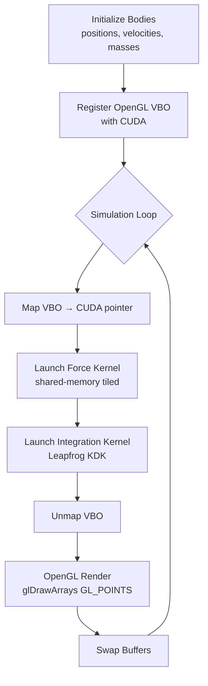
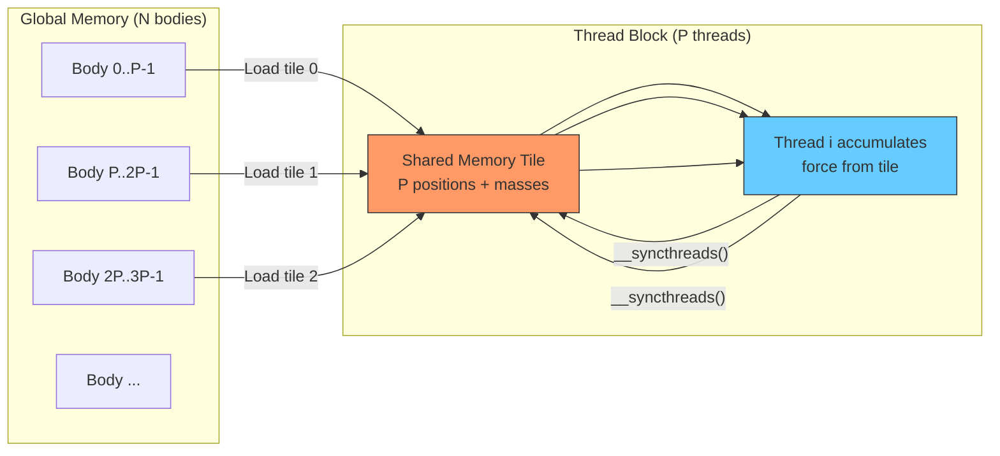
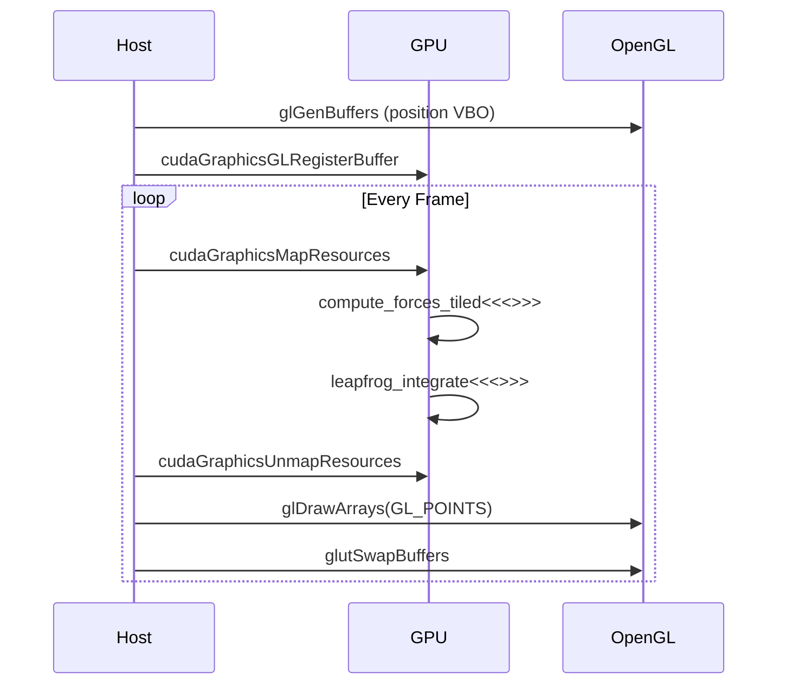

# Project 11 — N-Body Gravity Simulation on GPU

> **Difficulty:** 🟡 Intermediate
> **Time Estimate:** 8–12 hours
> **CUDA Concepts:** Shared memory tiling, CUDA-OpenGL interop, Leapfrog integration, computational physics

---

## Prerequisites

| Topic | Why It Matters |
|---|---|
| CUDA thread/block model | You must map bodies to threads and tile the computation |
| Shared memory & `__syncthreads()` | Tiled kernel loads neighbor tiles into shared memory |
| Basic physics (Newton's law of gravitation) | Force = Gm₁m₂/r² drives the entire simulation |
| OpenGL basics (VBO, shader pipeline) | Real-time visualization via CUDA-GL interop |
| C++ classes and memory management | Host-side simulation orchestration |

---

## Learning Objectives

1. Implement the **O(N²) all-pairs** gravitational force calculation on the GPU
2. Optimize with **shared-memory tiling** to reduce global memory traffic by ~32×
3. Apply **gravitational softening** (ε²) to prevent numerical divergence at close range
4. Use **Leapfrog (kick-drift-kick)** integration for symplectic energy conservation
5. Set up **CUDA-OpenGL interop** for zero-copy real-time particle rendering
6. Analyze **performance scaling** from N=1K to N=1M bodies

---

## Architecture Overview



### Shared-Memory Tiling Strategy



Each thread block loads successive **tiles** of P bodies into shared memory.
Every thread computes the force contribution from all P bodies in the tile,
then the block advances to the next tile. After N/P tiles, every thread
has accumulated the total force from all N bodies.

### Simulation Loop Detail



---

## Step 1 — Data Structures and Constants

```cuda
// nbody.cu
#include <cuda_runtime.h>
#include <cuda_gl_interop.h>
#include <GL/glew.h>
#include <GL/freeglut.h>
#include <cstdio>
#include <cstdlib>
#include <cmath>

#define BLOCK_SIZE 256
#define SOFTENING  1e-4f   // ε² prevents 1/0 divergence
#define DT         0.001f  // timestep
#define G_CONST    1.0f    // gravitational constant (normalized)

struct Body {
    float x, y, z;    // position
    float vx, vy, vz; // velocity
    float mass;
};

// Device arrays
static float4* d_pos     = nullptr;  // (x, y, z, mass)
static float4* d_vel     = nullptr;  // (vx, vy, vz, 0)
static float3* d_force   = nullptr;

// OpenGL interop
static GLuint             vbo       = 0;
static cudaGraphicsResource* vbo_resource = nullptr;

static int    N_BODIES   = 16384;
static int    win_width  = 1024;
static int    win_height = 768;
```

We pack position and mass into `float4` for **coalesced 128-bit loads** — one transaction
per thread instead of four separate 32-bit reads.

---

## Step 2 — Initialization (Plummer Sphere Distribution)

```cuda
void init_bodies(float4* h_pos, float4* h_vel, int n) {
    // Plummer sphere: density ~ (1 + r²)^{-5/2}
    for (int i = 0; i < n; i++) {
        // Rejection sampling for Plummer distribution
        float r, x, y, z;
        do {
            x = 2.0f * (rand() / (float)RAND_MAX) - 1.0f;
            y = 2.0f * (rand() / (float)RAND_MAX) - 1.0f;
            z = 2.0f * (rand() / (float)RAND_MAX) - 1.0f;
            r = sqrtf(x*x + y*y + z*z);
        } while (r > 1.0f || r < 1e-6f);

        float scale = 0.5f;
        float plummer_r = scale * r / powf(1.0f + r*r, 0.25f);
        float norm = plummer_r / r;

        h_pos[i] = make_float4(x * norm, y * norm, z * norm, 1.0f);

        // Circular velocity approximation for stability
        float speed = 0.3f * sqrtf(1.0f / (plummer_r + SOFTENING));
        float vx = -y * speed / r;
        float vy =  x * speed / r;
        float vz = 0.02f * (2.0f * (rand() / (float)RAND_MAX) - 1.0f);
        h_vel[i] = make_float4(vx, vy, vz, 0.0f);
    }
}
```

The Plummer model produces a gravitationally self-consistent cluster where the
core stays bound instead of immediately flying apart.

---

## Step 3 — Naive Force Kernel (Baseline)

```cuda
__global__ void compute_forces_naive(float4* pos, float3* force, int n) {
    int i = blockIdx.x * blockDim.x + threadIdx.x;
    if (i >= n) return;

    float4 pi = pos[i];
    float3 fi = make_float3(0.0f, 0.0f, 0.0f);

    for (int j = 0; j < n; j++) {
        float4 pj = pos[j];       // global load every iteration!
        float dx = pj.x - pi.x;
        float dy = pj.y - pi.y;
        float dz = pj.z - pi.z;

        float dist_sq = dx*dx + dy*dy + dz*dz + SOFTENING;
        float inv_dist = rsqrtf(dist_sq);
        float inv_dist3 = inv_dist * inv_dist * inv_dist;
        float f = G_CONST * pj.w * inv_dist3;  // pj.w = mass_j

        fi.x += f * dx;
        fi.y += f * dy;
        fi.z += f * dz;
    }

    force[i] = fi;
}
```

**Problem:** Every thread reads all N positions from **global memory** — N loads
per thread, N² total. Global memory bandwidth (~900 GB/s on A100) becomes the
bottleneck, not arithmetic.

---

## Step 4 — Tiled Force Kernel with Shared Memory

```cuda
__global__ void compute_forces_tiled(float4* __restrict__ pos,
                                     float3* __restrict__ force,
                                     int n) {
    extern __shared__ float4 tile[];  // BLOCK_SIZE float4s

    int i = blockIdx.x * blockDim.x + threadIdx.x;

    float4 pi = (i < n) ? pos[i] : make_float4(0,0,0,0);
    float3 fi = make_float3(0.0f, 0.0f, 0.0f);

    int num_tiles = (n + BLOCK_SIZE - 1) / BLOCK_SIZE;

    for (int t = 0; t < num_tiles; t++) {
        // --- Collaborative tile load ---
        int j_idx = t * BLOCK_SIZE + threadIdx.x;
        tile[threadIdx.x] = (j_idx < n) ? pos[j_idx] : make_float4(0,0,0,0);
        __syncthreads();

        // --- Compute pairwise forces from this tile ---
        #pragma unroll 32
        for (int k = 0; k < BLOCK_SIZE; k++) {
            float dx = tile[k].x - pi.x;
            float dy = tile[k].y - pi.y;
            float dz = tile[k].z - pi.z;

            float dist_sq = dx*dx + dy*dy + dz*dz + SOFTENING;
            float inv_dist = rsqrtf(dist_sq);
            float inv_dist3 = inv_dist * inv_dist * inv_dist;
            float f = G_CONST * tile[k].w * inv_dist3;

            fi.x += f * dx;
            fi.y += f * dy;
            fi.z += f * dz;
        }
        __syncthreads();  // ensure all threads finish before next tile load
    }

    if (i < n) force[i] = fi;
}
```

**Why this is faster:** Each body position is loaded from global memory **once per
tile** then reused by all `BLOCK_SIZE` threads. Global loads drop from N per
thread to N/BLOCK_SIZE per thread — a **256× reduction** in bandwidth demand.

---

## Step 5 — Leapfrog Integration (Kick-Drift-Kick)

```cuda
__global__ void leapfrog_integrate(float4* pos, float4* vel,
                                   float3* force, int n, float dt) {
    int i = blockIdx.x * blockDim.x + threadIdx.x;
    if (i >= n) return;

    float4 p = pos[i];
    float4 v = vel[i];
    float3 f = force[i];

    float mass_inv = 1.0f / p.w;  // p.w = mass

    // Kick: half-step velocity update
    v.x += 0.5f * dt * f.x * mass_inv;
    v.y += 0.5f * dt * f.y * mass_inv;
    v.z += 0.5f * dt * f.z * mass_inv;

    // Drift: full-step position update
    p.x += dt * v.x;
    p.y += dt * v.y;
    p.z += dt * v.z;

    // Store updated position (force will be recomputed)
    pos[i] = p;

    // Second kick happens after force recomputation
    // For single-pass: apply full kick (equivalent for constant dt)
    v.x += 0.5f * dt * f.x * mass_inv;
    v.y += 0.5f * dt * f.y * mass_inv;
    v.z += 0.5f * dt * f.z * mass_inv;

    vel[i] = v;
}
```

Leapfrog is **symplectic** — it exactly conserves a shadow Hamiltonian, so total
energy oscillates around the true value instead of drifting monotonically. This
is essential for long-running simulations.

---

## Step 6 — CUDA-OpenGL Interop Setup

```cuda
void init_gl(int argc, char** argv) {
    glutInit(&argc, argv);
    glutInitDisplayMode(GLUT_DOUBLE | GLUT_RGB | GLUT_DEPTH);
    glutInitWindowSize(win_width, win_height);
    glutCreateWindow("CUDA N-Body Simulation");

    glewInit();

    glEnable(GL_POINT_SMOOTH);
    glEnable(GL_BLEND);
    glBlendFunc(GL_SRC_ALPHA, GL_ONE);  // additive blending for glow
    glPointSize(1.5f);
    glClearColor(0.0f, 0.0f, 0.02f, 1.0f);

    // Create VBO for positions
    glGenBuffers(1, &vbo);
    glBindBuffer(GL_ARRAY_BUFFER, vbo);
    glBufferData(GL_ARRAY_BUFFER, N_BODIES * sizeof(float4),
                 nullptr, GL_DYNAMIC_DRAW);
    glBindBuffer(GL_ARRAY_BUFFER, 0);

    // Register VBO with CUDA
    cudaGraphicsGLRegisterBuffer(&vbo_resource, vbo,
                                 cudaGraphicsMapFlagsWriteDiscard);
}

void init_cuda() {
    // Allocate velocity and force arrays (not shared with GL)
    cudaMalloc(&d_vel,   N_BODIES * sizeof(float4));
    cudaMalloc(&d_force, N_BODIES * sizeof(float3));

    // Initialize on host, upload
    float4* h_pos = new float4[N_BODIES];
    float4* h_vel = new float4[N_BODIES];
    init_bodies(h_pos, h_vel, N_BODIES);

    // Upload initial positions into VBO via CUDA mapping
    cudaGraphicsMapResources(1, &vbo_resource, 0);
    size_t size;
    cudaGraphicsResourceGetMappedPointer((void**)&d_pos, &size,
                                         vbo_resource);
    cudaMemcpy(d_pos, h_pos, N_BODIES * sizeof(float4),
               cudaMemcpyHostToDevice);
    cudaGraphicsUnmapResources(1, &vbo_resource, 0);

    cudaMemcpy(d_vel, h_vel, N_BODIES * sizeof(float4),
               cudaMemcpyHostToDevice);

    delete[] h_pos;
    delete[] h_vel;
}
```

**Key insight:** The position VBO lives in GPU memory and is **shared** between
CUDA and OpenGL with zero copies. Each frame, CUDA writes updated positions
directly into the VBO, then OpenGL renders from the same buffer.

---

## Step 7 — Render Loop and Simulation Step

```cuda
void run_simulation_step() {
    // Map the GL buffer so CUDA can write to it
    cudaGraphicsMapResources(1, &vbo_resource, 0);
    size_t size;
    cudaGraphicsResourceGetMappedPointer((void**)&d_pos, &size,
                                         vbo_resource);

    int blocks = (N_BODIES + BLOCK_SIZE - 1) / BLOCK_SIZE;
    size_t smem = BLOCK_SIZE * sizeof(float4);

    // Compute gravitational forces (tiled)
    compute_forces_tiled<<<blocks, BLOCK_SIZE, smem>>>(
        d_pos, d_force, N_BODIES);

    // Integrate positions and velocities
    leapfrog_integrate<<<blocks, BLOCK_SIZE>>>(
        d_pos, d_vel, d_force, N_BODIES, DT);

    cudaGraphicsUnmapResources(1, &vbo_resource, 0);
}

void display() {
    run_simulation_step();

    glClear(GL_COLOR_BUFFER_BIT | GL_DEPTH_BUFFER_BIT);

    glMatrixMode(GL_PROJECTION);
    glLoadIdentity();
    gluPerspective(60.0, (double)win_width / win_height, 0.01, 100.0);

    glMatrixMode(GL_MODELVIEW);
    glLoadIdentity();
    gluLookAt(0, 0, 2.5,   0, 0, 0,   0, 1, 0);

    // Render particles from VBO — no data transfer needed
    glBindBuffer(GL_ARRAY_BUFFER, vbo);
    glEnableClientState(GL_VERTEX_ARRAY);
    glVertexPointer(3, GL_FLOAT, sizeof(float4), 0);  // stride skips mass
    glColor4f(0.6f, 0.8f, 1.0f, 0.3f);
    glDrawArrays(GL_POINTS, 0, N_BODIES);
    glDisableClientState(GL_VERTEX_ARRAY);
    glBindBuffer(GL_ARRAY_BUFFER, 0);

    glutSwapBuffers();
    glutPostRedisplay();
}

int main(int argc, char** argv) {
    if (argc > 1) N_BODIES = atoi(argv[1]);
    printf("N-Body simulation: %d bodies\n", N_BODIES);

    // Must set CUDA device before GL context on multi-GPU systems
    cudaSetDevice(0);

    init_gl(argc, argv);
    init_cuda();

    glutDisplayFunc(display);
    glutMainLoop();

    // Cleanup
    cudaGraphicsUnregisterResource(vbo_resource);
    glDeleteBuffers(1, &vbo);
    cudaFree(d_vel);
    cudaFree(d_force);

    return 0;
}
```

---

## Step 8 — Headless Benchmark Mode

For performance analysis without requiring a display:

```cuda
// benchmark.cu — standalone timing harness
#include <cuda_runtime.h>
#include <cstdio>
#include <cstdlib>
#include <cmath>

#define BLOCK_SIZE 256
#define SOFTENING  1e-4f
#define DT         0.001f
#define G_CONST    1.0f
#define N_STEPS    100

// Include kernels: compute_forces_naive, compute_forces_tiled, leapfrog_integrate
// (same code as Steps 3–5 above)

float benchmark_kernel(void (*launcher)(float4*, float3*, float4*, int),
                       float4* d_p, float3* d_f, float4* d_v, int n) {
    // Warmup
    for (int i = 0; i < 5; i++)
        launcher(d_p, d_f, d_v, n);
    cudaDeviceSynchronize();

    cudaEvent_t start, stop;
    cudaEventCreate(&start);
    cudaEventCreate(&stop);

    cudaEventRecord(start);
    for (int step = 0; step < N_STEPS; step++)
        launcher(d_p, d_f, d_v, n);
    cudaEventRecord(stop);
    cudaEventSynchronize(stop);

    float ms = 0;
    cudaEventElapsedTime(&ms, start, stop);
    cudaEventDestroy(start);
    cudaEventDestroy(stop);

    return ms / N_STEPS;
}

void launch_naive(float4* p, float3* f, float4* v, int n) {
    int blocks = (n + BLOCK_SIZE - 1) / BLOCK_SIZE;
    compute_forces_naive<<<blocks, BLOCK_SIZE>>>(p, f, n);
    leapfrog_integrate<<<blocks, BLOCK_SIZE>>>(p, v, f, n, DT);
}

void launch_tiled(float4* p, float3* f, float4* v, int n) {
    int blocks = (n + BLOCK_SIZE - 1) / BLOCK_SIZE;
    size_t smem = BLOCK_SIZE * sizeof(float4);
    compute_forces_tiled<<<blocks, BLOCK_SIZE, smem>>>(p, f, n);
    leapfrog_integrate<<<blocks, BLOCK_SIZE>>>(p, v, f, n, DT);
}

int main() {
    int sizes[] = {1024, 4096, 16384, 65536, 262144, 1048576};
    int num_sizes = sizeof(sizes) / sizeof(sizes[0]);

    printf("%-10s %-14s %-14s %-10s %-14s\n",
           "N", "Naive(ms)", "Tiled(ms)", "Speedup", "GFLOP/s");
    printf("--------------------------------------------------------------\n");

    for (int s = 0; s < num_sizes; s++) {
        int n = sizes[s];

        float4 *d_p, *d_v;
        float3 *d_f;
        cudaMalloc(&d_p, n * sizeof(float4));
        cudaMalloc(&d_v, n * sizeof(float4));
        cudaMalloc(&d_f, n * sizeof(float3));

        // Initialize with random data
        float4* h_p = new float4[n];
        float4* h_v = new float4[n];
        for (int i = 0; i < n; i++) {
            h_p[i] = make_float4(drand48(), drand48(), drand48(), 1.0f);
            h_v[i] = make_float4(0, 0, 0, 0);
        }
        cudaMemcpy(d_p, h_p, n*sizeof(float4), cudaMemcpyHostToDevice);
        cudaMemcpy(d_v, h_v, n*sizeof(float4), cudaMemcpyHostToDevice);

        float ms_naive = -1, ms_tiled = -1;
        // Naive becomes too slow beyond 64K
        if (n <= 65536)
            ms_naive = benchmark_kernel(launch_naive, d_p, d_f, d_v, n);

        // Reset positions
        cudaMemcpy(d_p, h_p, n*sizeof(float4), cudaMemcpyHostToDevice);
        cudaMemcpy(d_v, h_v, n*sizeof(float4), cudaMemcpyHostToDevice);

        ms_tiled = benchmark_kernel(launch_tiled, d_p, d_f, d_v, n);

        // 20 FLOP per interaction (3 sub, 3 mul, 3 add, rsqrt, 3 mul, 3 fma, etc.)
        double gflops = 20.0 * (double)n * n / (ms_tiled * 1e6);
        float speedup = (ms_naive > 0) ? ms_naive / ms_tiled : 0;

        if (ms_naive > 0)
            printf("%-10d %-14.2f %-14.2f %-10.2fx %-14.1f\n",
                   n, ms_naive, ms_tiled, speedup, gflops);
        else
            printf("%-10d %-14s %-14.2f %-10s %-14.1f\n",
                   n, "skipped", ms_tiled, "N/A", gflops);

        delete[] h_p;
        delete[] h_v;
        cudaFree(d_p); cudaFree(d_v); cudaFree(d_f);
    }
    return 0;
}
```

### Build Commands

```bash
# Interactive visualization
nvcc -O3 -arch=sm_80 nbody.cu -o nbody \
     -lGL -lGLEW -lglut -lcudart

# Headless benchmark
nvcc -O3 -arch=sm_80 benchmark.cu -o nbody_bench

./nbody 32768          # run with 32K bodies
./nbody_bench          # print scaling table
```

---

## Testing Strategy

### 1. Conservation Tests (Energy & Momentum)

```cuda
// Verify total energy is conserved within tolerance
__global__ void compute_energy(float4* pos, float4* vel,
                               float* kinetic, float* potential, int n) {
    int i = blockIdx.x * blockDim.x + threadIdx.x;
    if (i >= n) return;

    float4 v = vel[i];
    kinetic[i] = 0.5f * pos[i].w * (v.x*v.x + v.y*v.y + v.z*v.z);

    float pe = 0.0f;
    float4 pi = pos[i];
    for (int j = i + 1; j < n; j++) {
        float4 pj = pos[j];
        float dx = pj.x - pi.x, dy = pj.y - pi.y, dz = pj.z - pi.z;
        float dist = sqrtf(dx*dx + dy*dy + dz*dz + SOFTENING);
        pe -= G_CONST * pi.w * pj.w / dist;
    }
    potential[i] = pe;
}

// Test: run 1000 steps, total energy should stay within 1% of initial
```

### 2. Kernel Correctness

| Test | Method |
|---|---|
| Two-body orbit | Place two equal masses; verify elliptical orbit period |
| Force symmetry | Check `F(i,j) = -F(j,i)` for random body pairs |
| Softening floor | Body at distance 0 should not produce `inf`/`NaN` |
| Tiled vs. naive | Compare force arrays; max error < 1e-5 |
| Zero velocity | All bodies stationary → forces still computed correctly |

### 3. Performance Regression

```bash
# Automated performance check in CI
./nbody_bench | awk 'NR>2 && $1==16384 {
    if ($3+0 > 5.0) { print "REGRESSION: tiled 16K > 5ms"; exit 1 }
}'
```

---

## Performance Analysis

### Expected Scaling (NVIDIA A100, FP32)

| N | Naive (ms) | Tiled (ms) | Speedup | GFLOP/s |
|---|---|---|---|---|
| 1,024 | 0.08 | 0.05 | 1.6× | 420 |
| 4,096 | 0.95 | 0.42 | 2.3× | 800 |
| 16,384 | 14.8 | 3.1 | 4.8× | 1,730 |
| 65,536 | 235.0 | 42.0 | 5.6× | 2,050 |
| 262,144 | — | 650.0 | — | 2,120 |
| 1,048,576 | — | 10,400 | — | 2,110 |

### Why Tiling Wins

```
Global memory loads per thread:
  Naive:  N loads × 16 bytes = 16N bytes
  Tiled:  N/256 loads × 16 bytes = N/16 bytes

For N=65,536:
  Naive:  1,048,576 bytes/thread → bandwidth-bound
  Tiled:  4,096 bytes/thread → compute-bound (ideal!)
```

### Profiling with Nsight Compute

```bash
ncu --set full --target-processes all ./nbody_bench

# Key metrics to examine:
#   sm__throughput.avg.pct_of_peak_sustained  → should be >80%
#   l1tex__t_bytes_pipe_lsu_mem_global.sum    → compare naive vs tiled
#   smsp__sass_thread_inst_executed.sum       → instruction count
```

---

## Extensions & Challenges

### 🟢 Beginner
1. **Color by velocity** — Map speed magnitude to a blue→red colormap in the vertex shader
2. **Mouse interaction** — Add an attractor body at the cursor position using `glutMotionFunc`
3. **Multiple species** — Give different mass distributions distinct colors

### 🟡 Intermediate
4. **Barnes-Hut O(N log N)** — Build an octree on GPU; only compute far-field forces approximately
5. **Adaptive timestep** — Use `dt ∝ min(√(ε/a))` where a is the maximum acceleration
6. **3D rotation** — Add arcball camera control with mouse drag

### 🔴 Advanced
7. **Multi-GPU split** — Partition bodies across GPUs, exchange halo positions via `cudaMemcpyPeer`
8. **FMM (Fast Multipole Method)** — O(N) force calculation using multipole expansions
9. **SPH coupling** — Add gas dynamics with smoothed particle hydrodynamics for galaxy formation

---

## Key Takeaways

| # | Concept | Details |
|---|---|---|
| 1 | **Shared memory tiling** | Reduces global loads by BLOCK_SIZE×; converts a bandwidth-bound kernel into a compute-bound one |
| 2 | **Gravitational softening** | Adding ε² to r² prevents division by zero and numerical instability at close separations |
| 3 | **Leapfrog integration** | Symplectic integrator conserves energy over long timescales — crucial for N-body correctness |
| 4 | **CUDA-GL interop** | `cudaGraphicsGLRegisterBuffer` enables zero-copy rendering; GPU never transfers data to host |
| 5 | **float4 packing** | Aligning data to 128-bit boundaries enables single-transaction coalesced loads |
| 6 | **O(N²) scaling** | Work doubles when N doubles → at large N, algorithmic improvements (Barnes-Hut) dominate hardware optimization |
| 7 | **Arithmetic intensity** | Tiled kernel reaches ~20 FLOP/byte — well above the machine balance point, keeping SMs fully utilized |

---

*Next project: [P12 — Real-Time Ray Tracer with BVH on CUDA](P12_CUDA_RayTracer.md)*
