# Project 12 — Multi-Stage Processing Pipeline with CUDA Streams

> **Difficulty:** 🟡 Intermediate
> **Estimated Time:** 3–4 hours
> **GPU Required:** Any CUDA-capable GPU (Compute Capability ≥ 3.5)

---

## Prerequisites

| Topic | Why It Matters |
|---|---|
| CUDA kernel launch syntax | You will write and launch multiple kernels per stream |
| Host / device memory management | `cudaMalloc`, `cudaFree`, `cudaMemcpy` basics |
| Pinned (page-locked) memory | Required for asynchronous transfers (`cudaMallocHost`) |
| Basic understanding of concurrency | Streams overlap transfers and compute — you must reason about ordering |

---

## Learning Objectives

By completing this project you will be able to:

1. **Create and manage multiple CUDA streams** to overlap data transfers with kernel execution.
2. **Implement a staged pipeline** (Upload → Process1 → Process2 → Download) where different chunks execute different stages concurrently.
3. **Use CUDA events** to measure per-stage and total elapsed time accurately.
4. **Compare single-stream vs. multi-stream** execution and quantify the speedup.
5. **Read an Nsight Systems timeline** and identify transfer/compute overlap regions.

---

## Architecture Overview

### Pipeline Stages


### Stream Overlap Timeline (3 Streams, 4 Chunks)

Each row is a CUDA stream. Time flows left → right.
Chunks from different streams execute different stages simultaneously.

```mermaid
gantt
    title CUDA Stream Pipeline — 4 Chunks across 3 Streams
    dateFormat X
    axisFormat %s

    section Stream 0
    Upload C0   :a0, 0, 1
    Process1 C0 :b0, 1, 2
    Process2 C0 :c0, 2, 3
    Download C0 :d0, 3, 4
    Upload C3   :a3, 4, 5
    Process1 C3 :b3, 5, 6
    Process2 C3 :c3, 6, 7
    Download C3 :d3, 7, 8

    section Stream 1
    Upload C1   :a1, 1, 2
    Process1 C1 :b1, 2, 3
    Process2 C1 :c1, 3, 4
    Download C1 :d1, 4, 5

    section Stream 2
    Upload C2   :a2, 2, 3
    Process1 C2 :b2, 3, 4
    Process2 C2 :c2, 4, 5
    Download C2 :d2, 5, 6
```



> **Key insight:** While Stream 0 runs Process1 on Chunk 0, Stream 1 uploads
> Chunk 1. While Stream 0 runs Process2, Stream 1 runs Process1 and Stream 2
> uploads — three different stages execute in parallel.

---

## Step-by-Step Implementation

### Step 1 — Error Checking Macro and Includes

Every CUDA call must be checked. Define a macro once and use it everywhere.

```cuda
// stream_pipeline.cu
#include <cuda_runtime.h>
#include <cstdio>
#include <cstdlib>
#include <cmath>

#define CUDA_CHECK(call)                                                  \
    do {                                                                  \
        cudaError_t err = (call);                                         \
        if (err != cudaSuccess) {                                         \
            fprintf(stderr, "CUDA error at %s:%d — %s\n",                \
                    __FILE__, __LINE__, cudaGetErrorString(err));          \
            exit(EXIT_FAILURE);                                           \
        }                                                                 \
    } while (0)
```

### Step 2 — Processing Kernels

**Stage 1 — Scale + Bias:** a simple element-wise transformation.
**Stage 2 — 1-D Smooth Filter:** each output element is the average of a small window, simulating a stencil-style dependency.

```cuda
__global__ void scale_bias_kernel(const float* __restrict__ input,
                                  float* __restrict__ output,
                                  int n, float scale, float bias)
{
    int idx = blockIdx.x * blockDim.x + threadIdx.x;
    if (idx < n) {
        output[idx] = input[idx] * scale + bias;
    }
}

__global__ void smooth_filter_kernel(const float* __restrict__ input,
                                     float* __restrict__ output,
                                     int n, int radius)
{
    int idx = blockIdx.x * blockDim.x + threadIdx.x;
    if (idx < n) {
        float sum = 0.0f;
        int count = 0;
        for (int offset = -radius; offset <= radius; ++offset) {
            int neighbor = idx + offset;
            if (neighbor >= 0 && neighbor < n) {
                sum += input[neighbor];
                ++count;
            }
        }
        output[idx] = sum / count;
    }
}
```

### Step 3 — Single-Stream Baseline

Process the entire array in one shot — no overlap.

```cuda
void run_single_stream(const float* h_input, float* h_output, int N,
                       float scale, float bias, int radius)
{
    size_t bytes = N * sizeof(float);
    float *d_input, *d_inter, *d_output;

    CUDA_CHECK(cudaMalloc(&d_input,  bytes));
    CUDA_CHECK(cudaMalloc(&d_inter,  bytes));
    CUDA_CHECK(cudaMalloc(&d_output, bytes));

    cudaEvent_t start, stop;
    CUDA_CHECK(cudaEventCreate(&start));
    CUDA_CHECK(cudaEventCreate(&stop));

    CUDA_CHECK(cudaEventRecord(start, 0));

    // Upload
    CUDA_CHECK(cudaMemcpy(d_input, h_input, bytes, cudaMemcpyHostToDevice));

    // Stage 1
    int threads = 256;
    int blocks  = (N + threads - 1) / threads;
    scale_bias_kernel<<<blocks, threads>>>(d_input, d_inter, N, scale, bias);

    // Stage 2
    smooth_filter_kernel<<<blocks, threads>>>(d_inter, d_output, N, radius);

    // Download
    CUDA_CHECK(cudaMemcpy(h_output, d_output, bytes, cudaMemcpyDeviceToHost));

    CUDA_CHECK(cudaEventRecord(stop, 0));
    CUDA_CHECK(cudaEventSynchronize(stop));

    float ms = 0.0f;
    CUDA_CHECK(cudaEventElapsedTime(&ms, start, stop));
    printf("[Single-stream]  Total: %.3f ms\n", ms);

    CUDA_CHECK(cudaEventDestroy(start));
    CUDA_CHECK(cudaEventDestroy(stop));
    CUDA_CHECK(cudaFree(d_input));
    CUDA_CHECK(cudaFree(d_inter));
    CUDA_CHECK(cudaFree(d_output));
}
```

### Step 4 — Multi-Stream Overlapped Pipeline

This is the core of the project. We split the data into `NUM_CHUNKS` pieces and
distribute them across `NUM_STREAMS` streams in round-robin order. Each stream
issues Upload → Process1 → Process2 → Download for its chunk, and because
different streams are independent, the GPU can overlap operations.

```cuda
void run_multi_stream(const float* h_input, float* h_output, int N,
                      float scale, float bias, int radius,
                      int num_streams, int num_chunks)
{
    size_t bytes = N * sizeof(float);
    int chunk_size = (N + num_chunks - 1) / num_chunks;

    // --- Allocate device memory (entire array, chunked by offset) ---
    float *d_input, *d_inter, *d_output;
    CUDA_CHECK(cudaMalloc(&d_input,  bytes));
    CUDA_CHECK(cudaMalloc(&d_inter,  bytes));
    CUDA_CHECK(cudaMalloc(&d_output, bytes));

    // --- Create streams ---
    cudaStream_t* streams = new cudaStream_t[num_streams];
    for (int s = 0; s < num_streams; ++s) {
        CUDA_CHECK(cudaStreamCreate(&streams[s]));
    }

    // --- Create timing events ---
    cudaEvent_t ev_start, ev_stop;
    CUDA_CHECK(cudaEventCreate(&ev_start));
    CUDA_CHECK(cudaEventCreate(&ev_stop));

    // Per-chunk stage events for detailed timing
    cudaEvent_t* ev_upload_start  = new cudaEvent_t[num_chunks];
    cudaEvent_t* ev_upload_stop   = new cudaEvent_t[num_chunks];
    cudaEvent_t* ev_proc1_start   = new cudaEvent_t[num_chunks];
    cudaEvent_t* ev_proc1_stop    = new cudaEvent_t[num_chunks];
    cudaEvent_t* ev_proc2_start   = new cudaEvent_t[num_chunks];
    cudaEvent_t* ev_proc2_stop    = new cudaEvent_t[num_chunks];
    cudaEvent_t* ev_download_start = new cudaEvent_t[num_chunks];
    cudaEvent_t* ev_download_stop  = new cudaEvent_t[num_chunks];

    for (int c = 0; c < num_chunks; ++c) {
        CUDA_CHECK(cudaEventCreate(&ev_upload_start[c]));
        CUDA_CHECK(cudaEventCreate(&ev_upload_stop[c]));
        CUDA_CHECK(cudaEventCreate(&ev_proc1_start[c]));
        CUDA_CHECK(cudaEventCreate(&ev_proc1_stop[c]));
        CUDA_CHECK(cudaEventCreate(&ev_proc2_start[c]));
        CUDA_CHECK(cudaEventCreate(&ev_proc2_stop[c]));
        CUDA_CHECK(cudaEventCreate(&ev_download_start[c]));
        CUDA_CHECK(cudaEventCreate(&ev_download_stop[c]));
    }

    CUDA_CHECK(cudaEventRecord(ev_start, 0));

    // --- Issue work: round-robin chunks across streams ---
    int threads = 256;
    for (int c = 0; c < num_chunks; ++c) {
        int offset   = c * chunk_size;
        int cur_size = min(chunk_size, N - offset);
        if (cur_size <= 0) break;

        size_t cur_bytes = cur_size * sizeof(float);
        int blocks = (cur_size + threads - 1) / threads;
        cudaStream_t stream = streams[c % num_streams];

        // Upload
        CUDA_CHECK(cudaEventRecord(ev_upload_start[c], stream));
        CUDA_CHECK(cudaMemcpyAsync(d_input + offset, h_input + offset,
                                   cur_bytes, cudaMemcpyHostToDevice, stream));
        CUDA_CHECK(cudaEventRecord(ev_upload_stop[c], stream));

        // Stage 1 — Scale + Bias
        CUDA_CHECK(cudaEventRecord(ev_proc1_start[c], stream));
        scale_bias_kernel<<<blocks, threads, 0, stream>>>(
            d_input + offset, d_inter + offset, cur_size, scale, bias);
        CUDA_CHECK(cudaEventRecord(ev_proc1_stop[c], stream));

        // Stage 2 — Smooth Filter
        CUDA_CHECK(cudaEventRecord(ev_proc2_start[c], stream));
        smooth_filter_kernel<<<blocks, threads, 0, stream>>>(
            d_inter + offset, d_output + offset, cur_size, radius);
        CUDA_CHECK(cudaEventRecord(ev_proc2_stop[c], stream));

        // Download
        CUDA_CHECK(cudaEventRecord(ev_download_start[c], stream));
        CUDA_CHECK(cudaMemcpyAsync(h_output + offset, d_output + offset,
                                   cur_bytes, cudaMemcpyDeviceToHost, stream));
        CUDA_CHECK(cudaEventRecord(ev_download_stop[c], stream));
    }

    CUDA_CHECK(cudaEventRecord(ev_stop, 0));

    // --- Synchronize everything ---
    for (int s = 0; s < num_streams; ++s) {
        CUDA_CHECK(cudaStreamSynchronize(streams[s]));
    }

    // --- Print total time ---
    float total_ms = 0.0f;
    CUDA_CHECK(cudaEventElapsedTime(&total_ms, ev_start, ev_stop));
    printf("[Multi-stream]   Total: %.3f ms  (streams=%d, chunks=%d)\n",
           total_ms, num_streams, num_chunks);

    // --- Print per-chunk breakdown ---
    printf("\n  %-6s  %-10s %-10s %-10s %-10s\n",
           "Chunk", "Upload ms", "Stage1 ms", "Stage2 ms", "DLoad ms");
    for (int c = 0; c < num_chunks; ++c) {
        int offset   = c * chunk_size;
        int cur_size = min(chunk_size, N - offset);
        if (cur_size <= 0) break;

        float t_up, t_p1, t_p2, t_dl;
        CUDA_CHECK(cudaEventElapsedTime(&t_up, ev_upload_start[c], ev_upload_stop[c]));
        CUDA_CHECK(cudaEventElapsedTime(&t_p1, ev_proc1_start[c],  ev_proc1_stop[c]));
        CUDA_CHECK(cudaEventElapsedTime(&t_p2, ev_proc2_start[c],  ev_proc2_stop[c]));
        CUDA_CHECK(cudaEventElapsedTime(&t_dl, ev_download_start[c], ev_download_stop[c]));
        printf("  C%-5d  %-10.3f %-10.3f %-10.3f %-10.3f\n",
               c, t_up, t_p1, t_p2, t_dl);
    }

    // --- Cleanup ---
    for (int c = 0; c < num_chunks; ++c) {
        cudaEventDestroy(ev_upload_start[c]);
        cudaEventDestroy(ev_upload_stop[c]);
        cudaEventDestroy(ev_proc1_start[c]);
        cudaEventDestroy(ev_proc1_stop[c]);
        cudaEventDestroy(ev_proc2_start[c]);
        cudaEventDestroy(ev_proc2_stop[c]);
        cudaEventDestroy(ev_download_start[c]);
        cudaEventDestroy(ev_download_stop[c]);
    }
    delete[] ev_upload_start;  delete[] ev_upload_stop;
    delete[] ev_proc1_start;   delete[] ev_proc1_stop;
    delete[] ev_proc2_start;   delete[] ev_proc2_stop;
    delete[] ev_download_start; delete[] ev_download_stop;

    CUDA_CHECK(cudaEventDestroy(ev_start));
    CUDA_CHECK(cudaEventDestroy(ev_stop));
    for (int s = 0; s < num_streams; ++s) {
        CUDA_CHECK(cudaStreamDestroy(streams[s]));
    }
    delete[] streams;

    CUDA_CHECK(cudaFree(d_input));
    CUDA_CHECK(cudaFree(d_inter));
    CUDA_CHECK(cudaFree(d_output));
}
```

### Step 5 — CPU Reference and Validation

```cuda
void cpu_reference(const float* input, float* output, int N,
                   float scale, float bias, int radius)
{
    float* temp = new float[N];
    for (int i = 0; i < N; ++i)
        temp[i] = input[i] * scale + bias;

    for (int i = 0; i < N; ++i) {
        float sum = 0.0f;
        int count = 0;
        for (int off = -radius; off <= radius; ++off) {
            int nb = i + off;
            if (nb >= 0 && nb < N) { sum += temp[nb]; ++count; }
        }
        output[i] = sum / count;
    }
    delete[] temp;
}

bool validate(const float* gpu, const float* cpu, int N, float tol = 1e-4f)
{
    float max_err = 0.0f;
    int   err_idx = -1;
    for (int i = 0; i < N; ++i) {
        float diff = fabsf(gpu[i] - cpu[i]);
        if (diff > max_err) { max_err = diff; err_idx = i; }
    }
    if (max_err > tol) {
        printf("VALIDATION FAILED — max error %.6f at index %d "
               "(gpu=%.6f, cpu=%.6f)\n",
               max_err, err_idx, gpu[err_idx], cpu[err_idx]);
        return false;
    }
    printf("Validation PASSED (max error = %.2e)\n", max_err);
    return true;
}
```

### Step 6 — Main Driver

```cuda
int main(int argc, char** argv)
{
    const int    N     = (argc > 1) ? atoi(argv[1]) : 1 << 22;  // ~4M floats
    const int    NSTR  = (argc > 2) ? atoi(argv[2]) : 3;
    const int    NCHK  = (argc > 3) ? atoi(argv[3]) : 8;
    const float  SCALE = 2.0f;
    const float  BIAS  = 0.5f;
    const int    RAD   = 4;

    printf("N = %d (%.1f MB)  streams = %d  chunks = %d\n",
           N, N * sizeof(float) / (1024.0f * 1024.0f), NSTR, NCHK);

    // Pinned host memory — mandatory for async transfers
    float *h_input, *h_single, *h_multi, *h_ref;
    CUDA_CHECK(cudaMallocHost(&h_input,  N * sizeof(float)));
    CUDA_CHECK(cudaMallocHost(&h_single, N * sizeof(float)));
    CUDA_CHECK(cudaMallocHost(&h_multi,  N * sizeof(float)));
    h_ref = new float[N];

    // Initialize input
    srand(42);
    for (int i = 0; i < N; ++i)
        h_input[i] = static_cast<float>(rand()) / RAND_MAX;

    // CPU reference
    cpu_reference(h_input, h_ref, N, SCALE, BIAS, RAD);

    // GPU — single stream baseline
    run_single_stream(h_input, h_single, N, SCALE, BIAS, RAD);
    printf("Single-stream: ");
    validate(h_single, h_ref, N);

    // GPU — multi-stream pipeline
    run_multi_stream(h_input, h_multi, N, SCALE, BIAS, RAD, NSTR, NCHK);
    printf("Multi-stream:  ");
    validate(h_multi, h_ref, N);

    // Cleanup
    CUDA_CHECK(cudaFreeHost(h_input));
    CUDA_CHECK(cudaFreeHost(h_single));
    CUDA_CHECK(cudaFreeHost(h_multi));
    delete[] h_ref;

    CUDA_CHECK(cudaDeviceReset());
    return 0;
}
```

---

## Build and Run

```bash
# Compile (adjust sm_75 to your GPU architecture)
nvcc -O2 -arch=sm_75 -o stream_pipeline stream_pipeline.cu

# Run with defaults (N=4M, 3 streams, 8 chunks)
./stream_pipeline

# Experiment with parameters
./stream_pipeline 16777216 4 16    # 16M floats, 4 streams, 16 chunks
./stream_pipeline 4194304  1 1     # single-stream equivalent via multi-stream path
```

---

## Testing Strategy

| Test | What It Validates |
|---|---|
| **Correctness** | `validate()` compares GPU output against CPU reference with tolerance 1e-4 |
| **Single vs. Multi output equality** | Both paths must produce bit-identical results for the same input |
| **Edge: N not divisible by chunks** | Last chunk is smaller — verify no out-of-bounds writes |
| **Edge: 1 stream, 1 chunk** | Multi-stream path degenerates to single-stream — must still be correct |
| **Edge: chunks > N** | Several chunks will have `cur_size <= 0` — code must skip them cleanly |
| **Nsight Compute** | Run kernels through `ncu` to verify no memory access violations |

### Quick Smoke Test

```bash
# Minimal size — fast, catches indexing bugs
./stream_pipeline 1024 2 4

# Large size — stresses overlap
./stream_pipeline 33554432 3 12
```

---

## Performance Analysis

### Expected Output (example on RTX 3090, N = 16M)

```
N = 16777216 (64.0 MB)  streams = 3  chunks = 8
[Single-stream]  Total: 5.842 ms
Single-stream: Validation PASSED (max error = 0.00e+00)
[Multi-stream]   Total: 3.271 ms  (streams=3, chunks=8)

  Chunk   Upload ms  Stage1 ms  Stage2 ms  DLoad ms
  C0      0.418      0.089      0.142      0.406
  C1      0.417      0.088      0.141      0.405
  ...
Multi-stream:  Validation PASSED (max error = 0.00e+00)
```

### Why It's Faster

The single-stream timeline is strictly sequential:

```
[Upload ALL]──[Process1 ALL]──[Process2 ALL]──[Download ALL]
```

The multi-stream timeline overlaps stages across chunks:

```
Stream 0: [Up C0][P1 C0][P2 C0][Dl C0]          [Up C3]...
Stream 1:        [Up C1][P1 C1][P2 C1][Dl C1]
Stream 2:               [Up C2][P1 C2][P2 C2][Dl C2]
```

The GPU's copy engines and compute engines run in parallel, so the wall-clock
time approaches `max(total_upload, total_compute, total_download)` instead of
their sum.

### Nsight Systems Timeline Analysis

Profile with Nsight Systems to visually confirm overlap:

```bash
nsys profile --trace=cuda,nvtx -o pipeline_report ./stream_pipeline 16777216 3 8
nsys-ui pipeline_report.nsys-rep
```

**What to look for in the timeline:**

1. **CUDA HtoD row:** Upload chunks should stagger across streams, not serialize.
2. **CUDA Compute row:** Kernel launches from different streams interleave.
3. **CUDA DtoH row:** Downloads begin before all kernels finish.
4. **Stream rows:** Each stream shows its 4-stage sequence; streams offset in time.

> **Common pitfall:** If you use pageable memory (`malloc`) instead of pinned
> memory (`cudaMallocHost`), the driver silently serializes all transfers through
> a staging buffer, destroying all overlap. The Nsight timeline will show no
> concurrency — that is the symptom.

### Tuning Parameters

| Parameter | Effect |
|---|---|
| `num_streams` | More streams → more overlap potential, but diminishing returns past 3–4 |
| `num_chunks` | More chunks → finer granularity, better overlap; too many → launch overhead |
| `N` (array size) | Larger arrays benefit more — transfer time dominates and overlap hides it |
| `radius` (filter) | Larger radius → more compute per element → overlap hides transfer cost better |

---

## Extensions and Challenges

### 🔵 Extension 1 — Callback-Based Host Post-Processing

Register a host callback on each stream after download completes so you can
post-process each chunk on the CPU without explicit synchronization:

```cuda
void CUDART_CB host_postprocess(void* data) {
    int chunk_id = *static_cast<int*>(data);
    printf("  Chunk %d arrived on host — ready for CPU work\n", chunk_id);
}
// After download:
// cudaLaunchHostFunc(stream, host_postprocess, &chunk_ids[c]);
```

### 🔵 Extension 2 — Add a Third Kernel Stage

Insert a nonlinear activation (e.g., `tanhf`) between Stage 1 and Stage 2 to
create a deeper pipeline. Measure whether 3 stages benefit from more streams.

### 🔴 Extension 3 — Dynamic Chunk Scheduling

Instead of round-robin, implement a simple work-stealing approach: each stream
grabs the next unprocessed chunk from an atomic counter. This mirrors real-world
GPU task schedulers.

### 🔴 Extension 4 — Multi-GPU Pipeline

Extend to 2+ GPUs. Each GPU gets a range of chunks. Use `cudaMemcpyPeerAsync`
for inter-GPU transfers and peer-to-peer streams.

---

## Key Takeaways

1. **Pinned memory is non-negotiable.** `cudaMemcpyAsync` only truly runs
   asynchronously when the host buffer is page-locked (`cudaMallocHost`).
   Pageable memory forces a hidden synchronization.

2. **Streams define independent task queues.** Operations within one stream
   execute in order; operations across streams may overlap. The GPU scheduler
   decides what actually runs concurrently based on hardware resources.

3. **Events are the right timing tool.** `cudaEventRecord` + `cudaEventElapsedTime`
   measure GPU-side elapsed time without host-side jitter. Always prefer events
   over `std::chrono` for GPU timing.

4. **More streams ≠ always faster.** Beyond 3–4 streams the hardware runs out of
   copy engines and SM capacity. Profile to find the sweet spot for your GPU.

5. **Chunk granularity matters.** Too few chunks → not enough work to overlap.
   Too many chunks → kernel launch overhead dominates. 4–16 chunks is a
   practical starting range.

6. **Nsight Systems is essential.** The timeline view is the only reliable way to
   confirm that overlap is actually happening. Never assume — always profile.

---

## References

- [CUDA C++ Programming Guide — Streams](https://docs.nvidia.com/cuda/cuda-c-programming-guide/index.html#streams)
- [CUDA C++ Best Practices Guide — Asynchronous Transfers](https://docs.nvidia.com/cuda/cuda-c-best-practices-guide/index.html#asynchronous-transfers-and-overlapping-transfers-with-computation)
- [Nsight Systems User Guide](https://docs.nvidia.com/nsight-systems/UserGuide/index.html)
- Harris, M. "How to Overlap Data Transfers in CUDA C/C++" — NVIDIA Developer Blog
