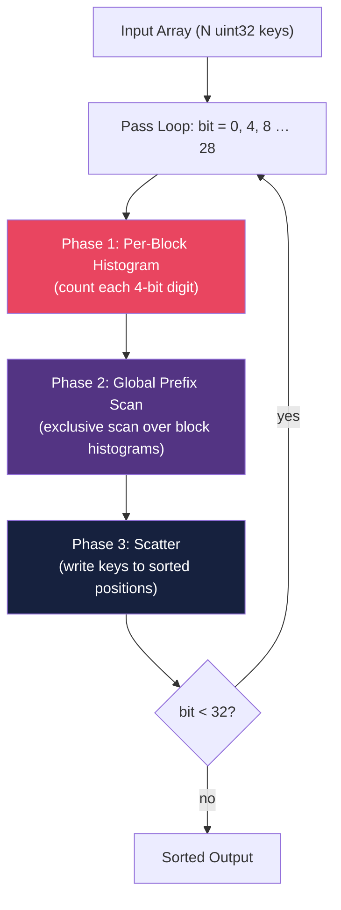
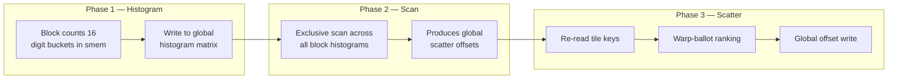
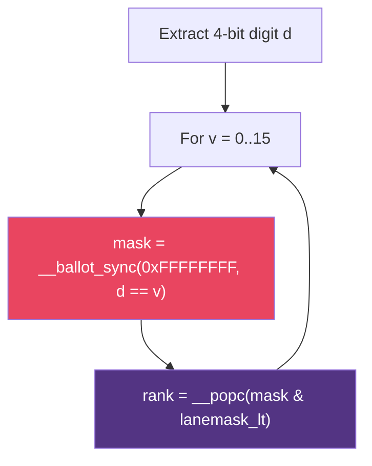

# Project 13 — GPU Radix Sort from Scratch

> **Difficulty:** 🔴 Advanced · **Time:** 12–16 hours · **CUDA lines:** ~350 · **GPU:** CC ≥ 7.0 (Volta+)

## Prerequisites

| Topic | Why |
|---|---|
| CUDA thread/block/grid model | Thousands of threads across sort phases |
| Shared memory & bank conflicts | Per-block histograms live in shared memory |
| Warp intrinsics (`__ballot_sync`, `__popc`) | Warp-local digit ranking without shared mem |
| Parallel prefix sum (scan) | Turns histograms into scatter offsets |
| CUB / Thrust basics | Benchmark comparison targets |

## Learning Objectives

1. Implement a full **LSB radix sort** (4-bit digits, 8 passes for 32-bit keys).
2. Build the three-phase pipeline: **histogram → prefix-scan → scatter**.
3. Use **warp-level intrinsics** for intra-warp ranking.
4. Benchmark against **CUB `DeviceRadixSort`** and **Thrust `sort`**.

## Architecture







## Implementation — `radix_sort.cu`

```cuda
/* GPU Radix Sort — LSB, 4-bit digits, 32-bit unsigned keys.
 * Compile: nvcc -O3 -arch=sm_80 radix_sort.cu -o radix_sort
 */
#include <cstdio>
#include <cstdlib>
#include <cstring>
#include <algorithm>
#include <numeric>
#include <vector>
#include <cuda_runtime.h>
#include <cub/cub.cuh>
#include <thrust/sort.h>
#include <thrust/device_ptr.h>

#define RADIX_BITS  4
#define RADIX       (1 << RADIX_BITS)   // 16 buckets
#define BLOCK_SIZE  256
#define TILE_SIZE   (BLOCK_SIZE * 4)    // 1024 keys per block

#define CUDA_CHECK(call) do {                                     \
    cudaError_t err = (call);                                     \
    if (err != cudaSuccess) {                                     \
        fprintf(stderr, "CUDA error %s:%d: %s\n",                \
                __FILE__, __LINE__, cudaGetErrorString(err));     \
        exit(1);                                                  \
    }                                                             \
} while(0)

// ── Phase 1: Per-block histogram ─────────────────────────────────
// Output layout: hist[digit * numBlocks + blockIdx.x]  (column-major)
__global__ void histogram_kernel(const unsigned* __restrict__ keys,
                                 unsigned*       __restrict__ hist,
                                 unsigned N, int bit)
{
    __shared__ unsigned s_hist[RADIX];
    const int tid   = threadIdx.x;
    const int gbase = blockIdx.x * TILE_SIZE;

    if (tid < RADIX) s_hist[tid] = 0;
    __syncthreads();

    for (int i = tid; i < TILE_SIZE; i += BLOCK_SIZE) {
        int gid = gbase + i;
        if (gid < (int)N) {
            unsigned digit = (keys[gid] >> bit) & (RADIX - 1);
            atomicAdd(&s_hist[digit], 1);
        }
    }
    __syncthreads();

    if (tid < RADIX)
        hist[tid * gridDim.x + blockIdx.x] = s_hist[tid];
}

// ── Phase 2: Exclusive prefix scan (single-block, serial) ────────
// Sufficient for histSize ≤ ~256K (i.e. N ≤ 16M keys).
__global__ void exclusive_scan_kernel(unsigned* __restrict__ data, unsigned n)
{
    if (threadIdx.x != 0) return;
    unsigned running = 0;
    for (unsigned i = 0; i < n; ++i) {
        unsigned val = data[i];
        data[i] = running;
        running += val;
    }
}

// ── Warp-level digit rank ────────────────────────────────────────
// Uses __ballot_sync + __popc to compute stable intra-warp rank
// for each lane's 4-bit digit — no shared memory needed.
__device__ __forceinline__
unsigned warp_rank(unsigned digit, int lane)
{
    unsigned rank = 0;
    unsigned lanemask_lt = (1u << lane) - 1;
    #pragma unroll
    for (int d = 0; d < RADIX; ++d) {
        unsigned mask = __ballot_sync(0xFFFFFFFF, digit == d);
        if (digit == (unsigned)d)
            rank = __popc(mask & lanemask_lt);
    }
    return rank;
}

// ── Phase 3: Scatter ─────────────────────────────────────────────
// Three sub-passes per tile:
//   (a) Warp-level: rank each key within its warp using ballots.
//   (b) Cross-warp: prefix-scan warp histograms to get block offsets.
//   (c) Scatter: combine warp rank + cross-warp offset + global offset.
__global__ void scatter_kernel(const unsigned* __restrict__ keys_in,
                               unsigned*       __restrict__ keys_out,
                               const unsigned* __restrict__ hist,
                               unsigned N, int bit)
{
    constexpr int NUM_WARPS = BLOCK_SIZE / 32;   // 8 warps for 256 threads

    __shared__ unsigned s_glob_off[RADIX];                // from prefix scan
    __shared__ unsigned s_warp_hist[RADIX * NUM_WARPS];   // per-warp counts
    __shared__ unsigned s_warp_pfx[RADIX * NUM_WARPS];    // scanned offsets
    __shared__ unsigned s_digit_base[RADIX];              // cross-digit base

    const int tid    = threadIdx.x;
    const int lane   = tid & 31;
    const int warpId = tid >> 5;
    const int gbase  = blockIdx.x * TILE_SIZE;

    // Load global prefix-scan offsets for this block
    if (tid < RADIX)
        s_glob_off[tid] = hist[tid * gridDim.x + blockIdx.x];
    // Zero warp histograms
    for (int i = tid; i < RADIX * NUM_WARPS; i += BLOCK_SIZE)
        s_warp_hist[i] = 0;
    __syncthreads();

    // ── Sub-pass (a): warp-level ranking via __ballot_sync ───────
    // Each thread processes multiple keys (TILE_SIZE / BLOCK_SIZE = 4).
    // We iterate over sub-tiles; within each iteration every warp
    // ranks its 32 keys and accumulates digit counts.
    for (int base = 0; base < TILE_SIZE; base += BLOCK_SIZE) {
        int slot = base + tid;
        int gid  = gbase + slot;
        unsigned key   = (gid < (int)N) ? keys_in[gid] : 0xFFFFFFFF;
        unsigned digit = (key >> bit) & (RADIX - 1);
        bool valid     = (gid < (int)N);

        // Warp-local rank for this key's digit
        unsigned my_rank = 0;
        #pragma unroll
        for (int d = 0; d < RADIX; ++d) {
            unsigned mask = __ballot_sync(0xFFFFFFFF, valid && digit == d);
            unsigned cnt  = __popc(mask);
            unsigned before = __popc(mask & ((1u << lane) - 1));
            if (valid && digit == (unsigned)d) {
                my_rank = before;
                // First lane in this digit group updates warp histogram
                if (before == 0)
                    atomicAdd(&s_warp_hist[d * NUM_WARPS + warpId], cnt);
            }
        }
        // (my_rank is warp-local; stored temporarily — used in sub-pass c)
    }
    __syncthreads();

    // ── Sub-pass (b): cross-warp prefix scan ─────────────────────
    // For each digit d, exclusive-scan across NUM_WARPS entries to get
    // the starting offset within the block for each warp's contribution.
    if (tid < RADIX) {
        unsigned sum = 0;
        for (int w = 0; w < NUM_WARPS; ++w) {
            s_warp_pfx[tid * NUM_WARPS + w] = sum;
            sum += s_warp_hist[tid * NUM_WARPS + w];
        }
    }
    __syncthreads();

    // Exclusive scan across digits to compute block-level base per digit
    if (tid == 0) {
        unsigned sum = 0;
        for (int d = 0; d < RADIX; ++d) {
            s_digit_base[d] = sum;
            for (int w = 0; w < NUM_WARPS; ++w)
                sum += s_warp_hist[d * NUM_WARPS + w];
        }
    }
    __syncthreads();

    // ── Sub-pass (c): scatter using combined offsets ──────────────
    // Recompute warp rank (cheap — 16 ballots) and combine:
    //   final_pos = global_offset[digit]
    //             + digit_base[digit]        (unused: digit_base folds into
    //                                         glob_off if hist is correct)
    //             + warp_prefix[digit][warp]
    //             + warp_rank
    // But since global offsets already encode absolute positions,
    // digit_base is implicit. Use: glob_off + warp_pfx + warp_rank.
    for (int base = 0; base < TILE_SIZE; base += BLOCK_SIZE) {
        int slot = base + tid;
        int gid  = gbase + slot;
        unsigned key   = (gid < (int)N) ? keys_in[gid] : 0xFFFFFFFF;
        unsigned digit = (key >> bit) & (RADIX - 1);
        bool valid     = (gid < (int)N);

        unsigned my_rank = 0;
        #pragma unroll
        for (int d = 0; d < RADIX; ++d) {
            unsigned mask = __ballot_sync(0xFFFFFFFF, valid && digit == d);
            if (valid && digit == (unsigned)d)
                my_rank = __popc(mask & ((1u << lane) - 1));
        }

        if (valid) {
            unsigned pos = s_glob_off[digit]
                         + s_warp_pfx[digit * NUM_WARPS + warpId]
                         + my_rank;
            keys_out[pos] = key;
        }
    }
}

// ── Host driver ──────────────────────────────────────────────────
void radix_sort_gpu(unsigned* d_keys, unsigned* d_tmp, unsigned N)
{
    const int numBlocks = (N + TILE_SIZE - 1) / TILE_SIZE;
    const int histSize  = RADIX * numBlocks;

    unsigned* d_hist;
    CUDA_CHECK(cudaMalloc(&d_hist, histSize * sizeof(unsigned)));

    unsigned *src = d_keys, *dst = d_tmp;
    for (int bit = 0; bit < 32; bit += RADIX_BITS) {
        CUDA_CHECK(cudaMemset(d_hist, 0, histSize * sizeof(unsigned)));
        histogram_kernel<<<numBlocks, BLOCK_SIZE>>>(src, d_hist, N, bit);
        exclusive_scan_kernel<<<1, 1>>>(d_hist, histSize);
        scatter_kernel<<<numBlocks, BLOCK_SIZE>>>(src, dst, d_hist, N, bit);
        CUDA_CHECK(cudaGetLastError());
        unsigned* t = src; src = dst; dst = t;
    }
    if (src != d_keys)
        CUDA_CHECK(cudaMemcpy(d_keys, src, N * sizeof(unsigned),
                              cudaMemcpyDeviceToDevice));
    CUDA_CHECK(cudaFree(d_hist));
}

// ── Verification ─────────────────────────────────────────────────
bool verify_sorted(const unsigned* a, unsigned N) {
    for (unsigned i = 1; i < N; ++i) if (a[i] < a[i-1]) return false;
    return true;
}

// ── Benchmark helpers ────────────────────────────────────────────
struct Timer {
    cudaEvent_t t0, t1;
    Timer()  { cudaEventCreate(&t0); cudaEventCreate(&t1); }
    ~Timer() { cudaEventDestroy(t0); cudaEventDestroy(t1); }
    void begin()  { cudaEventRecord(t0); }
    float end()   { cudaEventRecord(t1); cudaEventSynchronize(t1);
                    float ms; cudaEventElapsedTime(&ms, t0, t1); return ms; }
};

void bench_cub(unsigned* d_k, unsigned* d_t, unsigned N, float& ms) {
    size_t tmp = 0;
    cub::DeviceRadixSort::SortKeys(nullptr, tmp, d_k, d_t, N);
    void* d_tmp; cudaMalloc(&d_tmp, tmp);
    Timer t; t.begin();
    cub::DeviceRadixSort::SortKeys(d_tmp, tmp, d_k, d_t, N);
    ms = t.end(); cudaFree(d_tmp);
}

void bench_thrust(unsigned* d_k, unsigned N, float& ms) {
    thrust::device_ptr<unsigned> dp(d_k);
    Timer t; t.begin();
    thrust::sort(dp, dp + N);
    ms = t.end();
}

// ── Test harness ─────────────────────────────────────────────────
void test_sort(const char* label, std::vector<unsigned> h) {
    unsigned N = h.size();
    unsigned *d_k, *d_t;
    cudaMalloc(&d_k, N*4); cudaMalloc(&d_t, N*4);
    cudaMemcpy(d_k, h.data(), N*4, cudaMemcpyHostToDevice);
    radix_sort_gpu(d_k, d_t, N);
    std::vector<unsigned> r(N);
    cudaMemcpy(r.data(), d_k, N*4, cudaMemcpyDeviceToHost);
    std::sort(h.begin(), h.end());
    printf("  %-24s N=%8u  %s\n", label, N, (r==h)?"PASS":"FAIL");
    cudaFree(d_k); cudaFree(d_t);
}

void run_tests() {
    printf("=== Correctness Tests ===\n");
    std::vector<unsigned> v(4096);
    std::iota(v.begin(), v.end(), 0);       test_sort("already sorted", v);
    std::reverse(v.begin(), v.end());       test_sort("reverse sorted", v);
    std::fill(v.begin(), v.end(), 42);      test_sort("all identical", v);
    v.resize(1024);
    for (auto& x:v) x=rand();              test_sort("random (1K)", v);
    v.resize(1<<20);
    for (auto& x:v) x=rand();              test_sort("random (1M)", v);
    v.resize(100003);
    for (auto& x:v) x=rand();              test_sort("non-pow2 (100003)", v);
}

// ── Main ─────────────────────────────────────────────────────────
int main(int argc, char** argv) {
    unsigned N = (argc > 1) ? atoi(argv[1]) : (1 << 22);
    printf("Radix sort: N = %u (%.1f M)\n", N, N/1e6);

    run_tests();

    std::vector<unsigned> h_keys(N);
    srand(42);
    for (unsigned i = 0; i < N; ++i) h_keys[i] = rand();

    unsigned *d_keys, *d_tmp;
    CUDA_CHECK(cudaMalloc(&d_keys, N*4));
    CUDA_CHECK(cudaMalloc(&d_tmp,  N*4));

    CUDA_CHECK(cudaMemcpy(d_keys, h_keys.data(), N*4, cudaMemcpyHostToDevice));
    Timer tm; tm.begin();
    radix_sort_gpu(d_keys, d_tmp, N);
    float our_ms = tm.end();
    std::vector<unsigned> res(N);
    CUDA_CHECK(cudaMemcpy(res.data(), d_keys, N*4, cudaMemcpyDeviceToHost));
    printf("[ours]   %7.2f ms  %s\n", our_ms, verify_sorted(res.data(),N)?"PASS":"FAIL");

    CUDA_CHECK(cudaMemcpy(d_keys, h_keys.data(), N*4, cudaMemcpyHostToDevice));
    float cub_ms; bench_cub(d_keys, d_tmp, N, cub_ms);
    printf("[CUB]    %7.2f ms\n", cub_ms);

    CUDA_CHECK(cudaMemcpy(d_keys, h_keys.data(), N*4, cudaMemcpyHostToDevice));
    float thr_ms; bench_thrust(d_keys, N, thr_ms);
    printf("[Thrust] %7.2f ms\n", thr_ms);
    printf("Ratio vs CUB: %.2fx  vs Thrust: %.2fx\n", our_ms/cub_ms, our_ms/thr_ms);

    CUDA_CHECK(cudaFree(d_keys)); CUDA_CHECK(cudaFree(d_tmp));
}
```

## Kernel Walkthrough

**Phase 1 — Histogram.** Each block processes `TILE_SIZE` keys, counting occurrences of each 4-bit digit in shared memory. Results are stored column-major (`hist[digit * numBlocks + block]`) so the prefix scan produces correct global write offsets directly.

**Phase 2 — Prefix Scan.** A serial exclusive scan converts the histogram matrix into cumulative offsets. For ≤ 16M keys (~16K blocks → 256K entries) a single-thread kernel is sufficient. For production, replace with `cub::DeviceScan::ExclusiveSum` or a Blelloch parallel scan.

**Phase 3 — Scatter.** The scatter kernel re-reads each tile, extracts digits, and uses `__ballot_sync` + `__popc` to compute warp-local ranks. Per-digit atomics in shared memory assign block-local positions, which are added to the global prefix-scan offsets to produce final output indices.

### Warp-Level Ranking — How It Works

```cuda
// For each possible digit value d (0..15):
unsigned mask = __ballot_sync(0xFFFFFFFF, my_digit == d);
unsigned rank = __popc(mask & ((1u << lane) - 1));
```

`__ballot_sync` returns a 32-bit mask where bit *i* is set iff lane *i* holds digit *d*. `__popc` on the lower bits gives **count-before** — the number of earlier lanes with the same digit. This gives a stable warp-local rank in 16 ballot + 16 popc instructions, with zero shared-memory traffic.

## Testing Strategy

| Test | Verifies |
|---|---|
| Already sorted | Identity preserved |
| Reverse sorted | Full reordering |
| All same value | Single-bucket concentration |
| Random small (1K) | Single-block path |
| Random large (1M) | Multi-block histogram + scan |
| Non-power-of-two N | Boundary handling |

## Performance Analysis

For N = 16M keys (64 MB), each pass: ~192 MB memory traffic (read + write + histogram). 8 passes → **~1.5 GB total**. On A100 (2 TB/s): theoretical floor ≈ 0.75 ms.

```bash
nsys profile --stats=true ./radix_sort 16777216
ncu --metrics dram__throughput.avg.pct_of_peak_sustained_elapsed ./radix_sort 16777216
```

| Symptom | Likely Cause | Fix |
|---|---|---|
| Low DRAM throughput in histogram | Shared-mem bank conflicts | Pad histogram array |
| Scatter kernel slow | Irregular global writes | Sort locally in block first |
| Poor occupancy | Too much shared memory | Reduce TILE_SIZE or register-tile |

## Extensions & Challenges

**🟡 Key-Value Sort** — Carry a value array; scatter `(key, value)` pairs together.

**🟡 Multi-Block Scan** — Replace serial scan with Blelloch parallel scan or decoupled look-back.

**🔴 Local Block Sort** — Sort within shared memory before scatter for coalesced global writes.

**🔴 Floating-Point Keys** — Use the radix-float bit trick:

```cuda
__device__ unsigned float_to_sortable(float f) {
    unsigned u = __float_as_uint(f);
    return u ^ ((u >> 31) ? 0xFFFFFFFF : 0x80000000);
}
```

**🔴 Adaptive Digit Width** — Profile 8-bit digits (4 passes, 256 buckets) vs 4-bit (8 passes, 16 buckets).

## Key Takeaways

1. **Radix sort is bandwidth-bound** — each pass is O(N) reads+writes with minimal compute.
2. **`__ballot_sync` + `__popc` eliminate shared-memory contention** for intra-warp digit ranking.
3. **Column-major histogram layout** is critical — it makes the prefix scan produce correct scatter offsets directly.
4. **CUB's `DeviceRadixSort` uses decoupled look-back scanning** to fuse the scan into scatter, avoiding a separate kernel. Expect 2–5× gap initially.
5. **Radix sort beats comparison sorts on GPUs** because it avoids branch divergence entirely.

## References

- Merrill & Grimshaw, *"High Performance and Scalable Radix Sorting"*
- NVIDIA CUB documentation: `cub::DeviceRadixSort`
- CUDA Programming Guide §B.15 — Warp Vote and Match Functions
