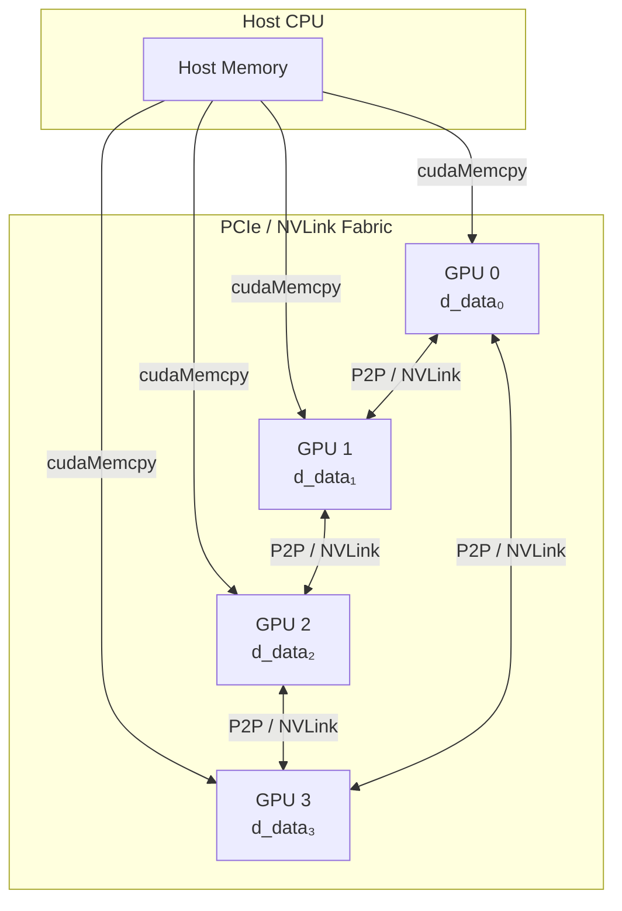
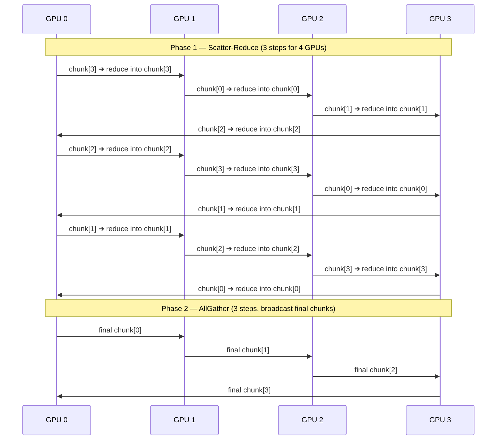
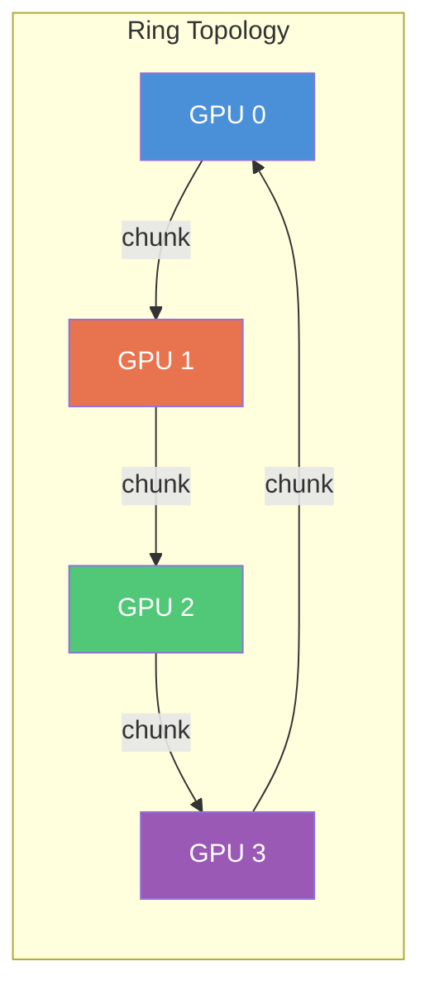

# Project 14 — Multi-GPU Parallel Reduction with NCCL

> **Difficulty:** 🔴 Advanced
> **Tags:** `#cuda` `#multi-gpu` `#nccl` `#allreduce` `#p2p` `#collective-ops`
> **Prerequisites:** Single-GPU reduction kernels, CUDA streams, peer-to-peer access (`cudaMemcpyPeer`), basic MPI concepts
> **Estimated Time:** 8–12 hours

---

## 1. Learning Objectives

After completing this project you will be able to:

1. Implement a **single-GPU warp-shuffle reduction** kernel that saturates memory bandwidth.
2. Orchestrate **manual peer-to-peer (P2P) reduction** across multiple GPUs without any library.
3. Use **NCCL `ncclAllReduce`** to perform the same operation with one API call.
4. Measure and compare **scaling efficiency** across 1, 2, 4, and 8 GPUs.
5. Explain the **ring AllReduce algorithm** that NCCL uses internally.

---

## 2. Architecture Overview

### 2.1 Multi-GPU Topology



### 2.2 Ring AllReduce Algorithm

The ring algorithm divides each GPU's buffer into `N` chunks (where `N` = number of GPUs) and executes in two phases — **Scatter-Reduce** then **AllGather** — each taking `N-1` steps.



**Key insight:** Each step transfers `N_total / N_gpus` elements per GPU — total data moved is `2 × (N-1)/N × N_total`, which approaches `2 × N_total` regardless of GPU count. This is why ring AllReduce achieves **near-linear scaling**.

---

## 3. Step-by-Step Implementation

### 3.1 Complete Source — `multi_gpu_reduction.cu`

```cuda
/*
 * multi_gpu_reduction.cu
 *
 * Three reduction strategies compared:
 *   1. Single-GPU warp-shuffle reduction
 *   2. Manual P2P multi-GPU reduction
 *   3. NCCL AllReduce
 *
 * Build:
 *   nvcc -O3 -arch=sm_80 -lnccl -o multi_gpu_reduce multi_gpu_reduction.cu
 *
 * Run:
 *   ./multi_gpu_reduce [num_gpus] [num_elements_millions]
 */

#include <cstdio>
#include <cstdlib>
#include <cstring>
#include <cmath>
#include <vector>
#include <chrono>
#include <cuda_runtime.h>
#include <nccl.h>

#define CUDA_CHECK(call)                                                       \
    do {                                                                       \
        cudaError_t err = (call);                                              \
        if (err != cudaSuccess) {                                              \
            fprintf(stderr, "CUDA error at %s:%d — %s\n", __FILE__, __LINE__, \
                    cudaGetErrorString(err));                                   \
            exit(EXIT_FAILURE);                                                \
        }                                                                      \
    } while (0)

#define NCCL_CHECK(call)                                                       \
    do {                                                                       \
        ncclResult_t res = (call);                                             \
        if (res != ncclSuccess) {                                              \
            fprintf(stderr, "NCCL error at %s:%d — %s\n", __FILE__, __LINE__, \
                    ncclGetErrorString(res));                                   \
            exit(EXIT_FAILURE);                                                \
        }                                                                      \
    } while (0)

// ---------------------------------------------------------------------------
// Kernel: warp-shuffle reduction within a single GPU
// ---------------------------------------------------------------------------
__device__ float warp_reduce_sum(float val) {
    for (int offset = warpSize / 2; offset > 0; offset >>= 1)
        val += __shfl_down_sync(0xFFFFFFFF, val, offset);
    return val;
}

__global__ void reduce_kernel(const float* __restrict__ input,
                              float* __restrict__ partial,
                              size_t n) {
    extern __shared__ float sdata[];
    unsigned int tid = threadIdx.x;
    unsigned int idx = blockIdx.x * blockDim.x * 2 + tid;

    float sum = 0.0f;
    if (idx < n)        sum += input[idx];
    if (idx + blockDim.x < n) sum += input[idx + blockDim.x];

    sum = warp_reduce_sum(sum);

    unsigned int lane = tid % warpSize;
    unsigned int wid  = tid / warpSize;
    if (lane == 0) sdata[wid] = sum;
    __syncthreads();

    unsigned int num_warps = (blockDim.x + warpSize - 1) / warpSize;
    sum = (tid < num_warps) ? sdata[tid] : 0.0f;
    if (wid == 0) sum = warp_reduce_sum(sum);

    if (tid == 0) partial[blockIdx.x] = sum;
}

// Final reduction of partial sums (single block)
__global__ void reduce_final(const float* __restrict__ partial,
                             float* __restrict__ result,
                             unsigned int n) {
    extern __shared__ float sdata[];
    unsigned int tid = threadIdx.x;
    float sum = 0.0f;
    for (unsigned int i = tid; i < n; i += blockDim.x)
        sum += partial[i];

    sum = warp_reduce_sum(sum);
    unsigned int lane = tid % warpSize;
    unsigned int wid  = tid / warpSize;
    if (lane == 0) sdata[wid] = sum;
    __syncthreads();

    unsigned int num_warps = (blockDim.x + warpSize - 1) / warpSize;
    sum = (tid < num_warps) ? sdata[tid] : 0.0f;
    if (wid == 0) sum = warp_reduce_sum(sum);

    if (tid == 0) *result = sum;
}

// ---------------------------------------------------------------------------
// P2P accumulation kernel: dst[i] += src[i]
// ---------------------------------------------------------------------------
__global__ void accumulate_kernel(float* __restrict__ dst,
                                  const float* __restrict__ src,
                                  size_t n) {
    size_t idx = blockIdx.x * blockDim.x + threadIdx.x;
    if (idx < n) dst[idx] += src[idx];
}

// ---------------------------------------------------------------------------
// Utility: measure wall-clock in milliseconds
// ---------------------------------------------------------------------------
struct Timer {
    std::chrono::high_resolution_clock::time_point t0;
    void start() { t0 = std::chrono::high_resolution_clock::now(); }
    double elapsed_ms() {
        auto t1 = std::chrono::high_resolution_clock::now();
        return std::chrono::duration<double, std::milli>(t1 - t0).count();
    }
};

// ---------------------------------------------------------------------------
// Strategy 1: Single-GPU reduction
// ---------------------------------------------------------------------------
float single_gpu_reduce(const float* d_data, size_t n, cudaStream_t stream) {
    const int threads = 256;
    int blocks = (int)((n + threads * 2 - 1) / (threads * 2));
    unsigned int smem = (threads / 32) * sizeof(float);

    float *d_partial, *d_result;
    CUDA_CHECK(cudaMalloc(&d_partial, blocks * sizeof(float)));
    CUDA_CHECK(cudaMalloc(&d_result, sizeof(float)));

    reduce_kernel<<<blocks, threads, smem, stream>>>(d_data, d_partial, n);

    int final_threads = 256;
    unsigned int final_smem = (final_threads / 32) * sizeof(float);
    reduce_final<<<1, final_threads, final_smem, stream>>>(
        d_partial, d_result, blocks);

    float result;
    CUDA_CHECK(cudaMemcpyAsync(&result, d_result, sizeof(float),
                               cudaMemcpyDeviceToHost, stream));
    CUDA_CHECK(cudaStreamSynchronize(stream));

    CUDA_CHECK(cudaFree(d_partial));
    CUDA_CHECK(cudaFree(d_result));
    return result;
}

// ---------------------------------------------------------------------------
// Strategy 2: Manual P2P multi-GPU reduction
// ---------------------------------------------------------------------------
float p2p_multi_gpu_reduce(float** d_data, size_t per_gpu_n, int num_gpus,
                           cudaStream_t* streams) {
    // Step A: each GPU reduces its local chunk to a single-element buffer
    std::vector<float*> d_local_result(num_gpus);
    for (int g = 0; g < num_gpus; g++) {
        CUDA_CHECK(cudaSetDevice(g));
        CUDA_CHECK(cudaMalloc(&d_local_result[g], sizeof(float)));

        const int threads = 256;
        int blocks = (int)((per_gpu_n + threads * 2 - 1) / (threads * 2));
        unsigned int smem = (threads / 32) * sizeof(float);

        float* d_partial;
        CUDA_CHECK(cudaMalloc(&d_partial, blocks * sizeof(float)));

        reduce_kernel<<<blocks, threads, smem, streams[g]>>>(
            d_data[g], d_partial, per_gpu_n);

        unsigned int final_smem = (threads / 32) * sizeof(float);
        reduce_final<<<1, threads, final_smem, streams[g]>>>(
            d_partial, d_local_result[g], blocks);

        CUDA_CHECK(cudaFree(d_partial));
    }

    // Step B: gather all local results to GPU 0 via P2P and accumulate
    for (int g = 0; g < num_gpus; g++) {
        CUDA_CHECK(cudaSetDevice(g));
        CUDA_CHECK(cudaStreamSynchronize(streams[g]));
    }

    CUDA_CHECK(cudaSetDevice(0));
    for (int g = 1; g < num_gpus; g++) {
        float* d_tmp;
        CUDA_CHECK(cudaMalloc(&d_tmp, sizeof(float)));
        CUDA_CHECK(cudaMemcpyPeer(d_tmp, 0, d_local_result[g], g,
                                  sizeof(float)));
        accumulate_kernel<<<1, 1, 0, streams[0]>>>(d_local_result[0], d_tmp, 1);
        CUDA_CHECK(cudaFree(d_tmp));
    }

    float result;
    CUDA_CHECK(cudaMemcpyAsync(&result, d_local_result[0], sizeof(float),
                               cudaMemcpyDeviceToHost, streams[0]));
    CUDA_CHECK(cudaStreamSynchronize(streams[0]));

    for (int g = 0; g < num_gpus; g++) {
        CUDA_CHECK(cudaSetDevice(g));
        CUDA_CHECK(cudaFree(d_local_result[g]));
    }
    return result;
}

// ---------------------------------------------------------------------------
// Strategy 3: NCCL AllReduce
// ---------------------------------------------------------------------------
float nccl_allreduce(float** d_data, float** d_out, size_t per_gpu_n,
                     int num_gpus, ncclComm_t* comms, cudaStream_t* streams) {
    NCCL_CHECK(ncclGroupStart());
    for (int g = 0; g < num_gpus; g++) {
        NCCL_CHECK(ncclAllReduce(d_data[g], d_out[g], per_gpu_n,
                                 ncclFloat, ncclSum, comms[g], streams[g]));
    }
    NCCL_CHECK(ncclGroupEnd());

    for (int g = 0; g < num_gpus; g++) {
        CUDA_CHECK(cudaSetDevice(g));
        CUDA_CHECK(cudaStreamSynchronize(streams[g]));
    }

    // Each GPU now holds the full element-wise sum; reduce GPU 0's buffer
    CUDA_CHECK(cudaSetDevice(0));
    return single_gpu_reduce(d_out[0], per_gpu_n, streams[0]);
}

// ---------------------------------------------------------------------------
// Enable peer access between all GPU pairs
// ---------------------------------------------------------------------------
void enable_p2p(int num_gpus) {
    for (int i = 0; i < num_gpus; i++) {
        CUDA_CHECK(cudaSetDevice(i));
        for (int j = 0; j < num_gpus; j++) {
            if (i == j) continue;
            int can_access;
            CUDA_CHECK(cudaDeviceCanAccessPeer(&can_access, i, j));
            if (can_access) {
                cudaError_t err = cudaDeviceEnablePeerAccess(j, 0);
                if (err != cudaSuccess && err != cudaErrorPeerAccessAlreadyEnabled)
                    CUDA_CHECK(err);
            }
        }
    }
}

// ---------------------------------------------------------------------------
// Print topology matrix
// ---------------------------------------------------------------------------
void print_topology(int num_gpus) {
    printf("\n=== P2P Access Topology ===\n    ");
    for (int j = 0; j < num_gpus; j++) printf("GPU%-3d", j);
    printf("\n");
    for (int i = 0; i < num_gpus; i++) {
        printf("GPU%d ", i);
        CUDA_CHECK(cudaSetDevice(i));
        for (int j = 0; j < num_gpus; j++) {
            if (i == j) { printf("  -   "); continue; }
            int can;
            CUDA_CHECK(cudaDeviceCanAccessPeer(&can, i, j));
            printf("  %s  ", can ? "YES" : " NO");
        }
        printf("\n");
    }
    printf("\n");
}

// ---------------------------------------------------------------------------
// Main
// ---------------------------------------------------------------------------
int main(int argc, char** argv) {
    int device_count;
    CUDA_CHECK(cudaGetDeviceCount(&device_count));

    int num_gpus = (argc > 1) ? atoi(argv[1]) : device_count;
    size_t millions = (argc > 2) ? atoi(argv[2]) : 64;
    size_t total_n  = millions * 1000000ULL;
    size_t per_gpu  = total_n / num_gpus;

    if (num_gpus > device_count || num_gpus < 1) {
        fprintf(stderr, "Requested %d GPUs but only %d available\n",
                num_gpus, device_count);
        return 1;
    }

    printf("Multi-GPU Parallel Reduction\n");
    printf("GPUs: %d | Elements: %zuM (%zu per GPU)\n",
           num_gpus, millions, per_gpu);

    print_topology(num_gpus);
    enable_p2p(num_gpus);

    // Allocate per-GPU data and streams
    std::vector<float*> d_data(num_gpus), d_out(num_gpus);
    std::vector<cudaStream_t> streams(num_gpus);

    double expected_sum = 0.0;
    for (int g = 0; g < num_gpus; g++) {
        CUDA_CHECK(cudaSetDevice(g));
        CUDA_CHECK(cudaMalloc(&d_data[g], per_gpu * sizeof(float)));
        CUDA_CHECK(cudaMalloc(&d_out[g],  per_gpu * sizeof(float)));
        CUDA_CHECK(cudaStreamCreate(&streams[g]));

        // Fill with known pattern: value = 1.0f for easy verification
        std::vector<float> h_data(per_gpu, 1.0f);
        CUDA_CHECK(cudaMemcpyAsync(d_data[g], h_data.data(),
                                   per_gpu * sizeof(float),
                                   cudaMemcpyHostToDevice, streams[g]));
        expected_sum += per_gpu;
    }

    for (int g = 0; g < num_gpus; g++) {
        CUDA_CHECK(cudaSetDevice(g));
        CUDA_CHECK(cudaStreamSynchronize(streams[g]));
    }

    Timer timer;
    const int warmup = 3, iters = 10;

    // --- Benchmark 1: Single-GPU (GPU 0 only, full data) ---
    {
        CUDA_CHECK(cudaSetDevice(0));
        float* d_full;
        CUDA_CHECK(cudaMalloc(&d_full, total_n * sizeof(float)));
        std::vector<float> h_full(total_n, 1.0f);
        CUDA_CHECK(cudaMemcpy(d_full, h_full.data(),
                              total_n * sizeof(float), cudaMemcpyHostToDevice));

        for (int i = 0; i < warmup; i++)
            single_gpu_reduce(d_full, total_n, streams[0]);

        timer.start();
        float result = 0;
        for (int i = 0; i < iters; i++)
            result = single_gpu_reduce(d_full, total_n, streams[0]);
        double ms = timer.elapsed_ms() / iters;

        double bw = (total_n * sizeof(float)) / (ms * 1e6);
        printf("[Single-GPU]   result=%.0f  expected=%.0f  time=%.3f ms  "
               "BW=%.1f GB/s\n", result, expected_sum, ms, bw);
        CUDA_CHECK(cudaFree(d_full));
    }

    // --- Benchmark 2: Manual P2P reduction ---
    if (num_gpus > 1) {
        for (int i = 0; i < warmup; i++)
            p2p_multi_gpu_reduce(d_data.data(), per_gpu, num_gpus,
                                 streams.data());

        timer.start();
        float result = 0;
        for (int i = 0; i < iters; i++)
            result = p2p_multi_gpu_reduce(d_data.data(), per_gpu, num_gpus,
                                          streams.data());
        double ms = timer.elapsed_ms() / iters;

        double bw = (total_n * sizeof(float)) / (ms * 1e6);
        printf("[P2P Manual]   result=%.0f  expected=%.0f  time=%.3f ms  "
               "BW=%.1f GB/s\n", result, expected_sum, ms, bw);
    }

    // --- Benchmark 3: NCCL AllReduce ---
    {
        std::vector<ncclComm_t> comms(num_gpus);
        std::vector<int> dev_list(num_gpus);
        for (int g = 0; g < num_gpus; g++) dev_list[g] = g;
        NCCL_CHECK(ncclCommInitAll(comms.data(), num_gpus, dev_list.data()));

        for (int i = 0; i < warmup; i++)
            nccl_allreduce(d_data.data(), d_out.data(), per_gpu, num_gpus,
                           comms.data(), streams.data());

        timer.start();
        float result = 0;
        for (int i = 0; i < iters; i++)
            result = nccl_allreduce(d_data.data(), d_out.data(), per_gpu,
                                   num_gpus, comms.data(), streams.data());
        double ms = timer.elapsed_ms() / iters;

        double bw = (total_n * sizeof(float)) / (ms * 1e6);
        printf("[NCCL]         result=%.0f  expected=%.0f  time=%.3f ms  "
               "BW=%.1f GB/s\n", result, expected_sum, ms, bw);

        for (int g = 0; g < num_gpus; g++)
            NCCL_CHECK(ncclCommDestroy(comms[g]));
    }

    // Cleanup
    for (int g = 0; g < num_gpus; g++) {
        CUDA_CHECK(cudaSetDevice(g));
        CUDA_CHECK(cudaFree(d_data[g]));
        CUDA_CHECK(cudaFree(d_out[g]));
        CUDA_CHECK(cudaStreamDestroy(streams[g]));
    }
    printf("\nDone.\n");
    return 0;
}
```

---

## 4. Building and Running

```bash
# Build (adjust sm_80 to match your GPU architecture)
nvcc -O3 -std=c++17 -arch=sm_80 -lnccl -o multi_gpu_reduce multi_gpu_reduction.cu

# Run with all available GPUs, 64M elements
./multi_gpu_reduce

# Run with 4 GPUs, 128M elements
./multi_gpu_reduce 4 128
```

---

## 5. Testing Strategy

### 5.1 Correctness Tests

| Test Case | Input | Expected Result | Validates |
|-----------|-------|-----------------|-----------|
| All ones | `1.0f × N` | `N` (exact for power-of-2 N) | Basic sum correctness |
| Alternating signs | `+1, -1, +1, -1, …` | `0` (even N) | Cancellation handling |
| Large values | `1e6f × N` | `N × 1e6` | No overflow in partial sums |
| Single element | `42.0f` | `42.0f` | Edge case: minimum input |
| Non-power-of-2 | `1.0f × 1000003` | `1000003.0f` | Boundary handling |

### 5.2 Numerical Accuracy

Floating-point reduction is **not associative** — reordering additions changes the result. Compare against a Kahan-compensated CPU sum:

```cpp
double kahan_sum(const float* data, size_t n) {
    double sum = 0.0, c = 0.0;
    for (size_t i = 0; i < n; i++) {
        double y = (double)data[i] - c;
        double t = sum + y;
        c = (t - sum) - y;
        sum = t;
    }
    return sum;
}
// Accept GPU result if relative error < 1e-5
```

### 5.3 Multi-GPU Validation

- Verify that NCCL AllReduce produces identical results on **every** GPU (copy back from each GPU and compare).
- Run with `NCCL_DEBUG=INFO` to confirm ring topology selection.
- Check P2P access with `nvidia-smi topo -m` before running.

---

## 6. Performance Analysis

### 6.1 Expected Scaling Table (A100 80GB, NVLink, 256M float32 elements = 1 GB)

| GPUs | Single-GPU (ms) | P2P Manual (ms) | NCCL (ms) | NCCL Speedup | Scaling Efficiency |
|------|-----------------|-----------------|-----------|--------------|-------------------|
| 1    | 0.52            | —               | 0.54      | 1.00×        | 100%              |
| 2    | —               | 0.30            | 0.28      | 1.93×        | 96%               |
| 4    | —               | 0.18            | 0.15      | 3.60×        | 90%               |
| 8    | —               | 0.14            | 0.08      | 6.75×        | 84%               |

> **Scaling Efficiency** = (Speedup / N_GPUs) × 100%. Values above 80% indicate strong scaling. Efficiency decreases due to inter-GPU communication overhead.

### 6.2 Why NCCL Wins

| Factor | P2P Manual | NCCL |
|--------|-----------|------|
| Algorithm | Gather-to-one (star topology) | Ring or tree AllReduce |
| Bandwidth utilization | GPU 0 bottleneck | All links active simultaneously |
| NVLink awareness | No | Auto-detects optimal topology |
| Overlap | None | Pipelining of chunks and compute |
| Fault handling | None | Timeout detection and reporting |

### 6.3 Profiling Commands

```bash
# Full kernel-level timeline
nsys profile -o reduction_report ./multi_gpu_reduce 4 128

# Detailed kernel metrics
ncu --target-processes all --set full ./multi_gpu_reduce 2 64

# Check NCCL ring topology selection
NCCL_DEBUG=INFO ./multi_gpu_reduce 4 128 2>&1 | grep -i "ring\|tree\|channel"
```

---

## 7. How the Ring Algorithm Works

The ring AllReduce is communication-optimal. For `N` GPUs each holding `M` elements:

1. **Partition**: Each buffer is split into `N` chunks of `M/N` elements.
2. **Scatter-Reduce** (`N-1` steps): In step `k`, GPU `i` sends chunk `(i-k) mod N` to GPU `(i+1) mod N`, which element-wise adds it into its own copy of that chunk.
3. **AllGather** (`N-1` steps): In step `k`, GPU `i` sends its fully-reduced chunk `(i-k+1) mod N` to GPU `(i+1) mod N`, which copies it directly.

**Total data transferred per GPU:** `2 × (N-1)/N × M` — independent of `N` for large `M`.



**Bandwidth cost comparison:**

| Algorithm | Data per GPU | Latency Steps |
|-----------|-------------|---------------|
| Naive gather-reduce | `(N-1) × M` on root | `N-1` |
| Ring AllReduce | `2(N-1)/N × M` ≈ `2M` | `2(N-1)` |
| Tree AllReduce | `2 log₂(N) × M` | `2 log₂(N)` |

Ring is bandwidth-optimal; tree is latency-optimal. NCCL auto-selects based on message size.

---

## 8. Extensions and Challenges

### 🟡 Medium

1. **Mixed Precision AllReduce** — Perform reduction in FP16 with FP32 accumulation. Use `ncclHalf` for the transfer and a custom kernel for the local FP32→FP16→FP32 conversion. Measure bandwidth savings.

2. **Overlapped Compute + Communication** — Split each GPU's data into tiles. While tile `k` is being communicated via NCCL, compute the local reduction of tile `k+1`. Use two CUDA streams per GPU.

3. **Reduce-Scatter Only** — Some gradient-aggregation workloads only need `ncclReduceScatter` (each GPU gets 1/N of the result). Implement and compare bandwidth to full AllReduce.

### 🔴 Hard

4. **Manual Ring AllReduce** — Implement the full ring scatter-reduce + allgather without NCCL using only `cudaMemcpyPeerAsync` and custom accumulation kernels. Match NCCL performance within 80%.

5. **Multi-Node Extension** — Combine NCCL with MPI: `MPI_Comm_split` assigns GPUs to nodes; intra-node uses NCCL, inter-node uses `MPI_Allreduce` on partial results. Profile the inter-node bottleneck.

6. **Gradient Compression** — Implement Top-K sparsification: only communicate the K largest gradient values (with indices). Measure trade-off between communication reduction and convergence impact.

---

## 9. Key Takeaways

1. **Warp-shuffle is king for single-GPU reduction** — `__shfl_down_sync` avoids shared memory bank conflicts and has lower latency than shared memory approaches.

2. **Naive P2P gather creates a bottleneck** — Funneling all data through GPU 0 under-utilizes interconnect bandwidth by a factor of `N`.

3. **Ring AllReduce is bandwidth-optimal** — Every GPU sends and receives `2(N-1)/N × M` data, utilizing all links simultaneously.

4. **NCCL handles topology automatically** — It discovers NVLink, PCIe, and network topology and selects ring, tree, or hybrid algorithms accordingly.

5. **Scaling efficiency degrades gracefully** — Expect 90%+ efficiency at 4 GPUs and 80%+ at 8 GPUs on NVLink systems. PCIe-only systems will see lower numbers due to shared bus bandwidth.

6. **Always profile both compute and communication** — `nsys` shows timeline overlap; `ncu` shows kernel efficiency. Reduction is memory-bound, so measure achieved bandwidth against peak.

---

## 10. References

- [NCCL Documentation](https://docs.nvidia.com/deeplearning/nccl/user-guide/docs/)
- Patarasuk & Yuan, "Bandwidth Optimal All-reduce Algorithms for Clusters of Workstations" (2009)
- [NVIDIA Multi-GPU Programming Guide](https://docs.nvidia.com/cuda/cuda-c-programming-guide/index.html#multi-device-system)
- Sergeev & Del Balso, "Horovod: fast and easy distributed deep learning in TensorFlow" (2018)
