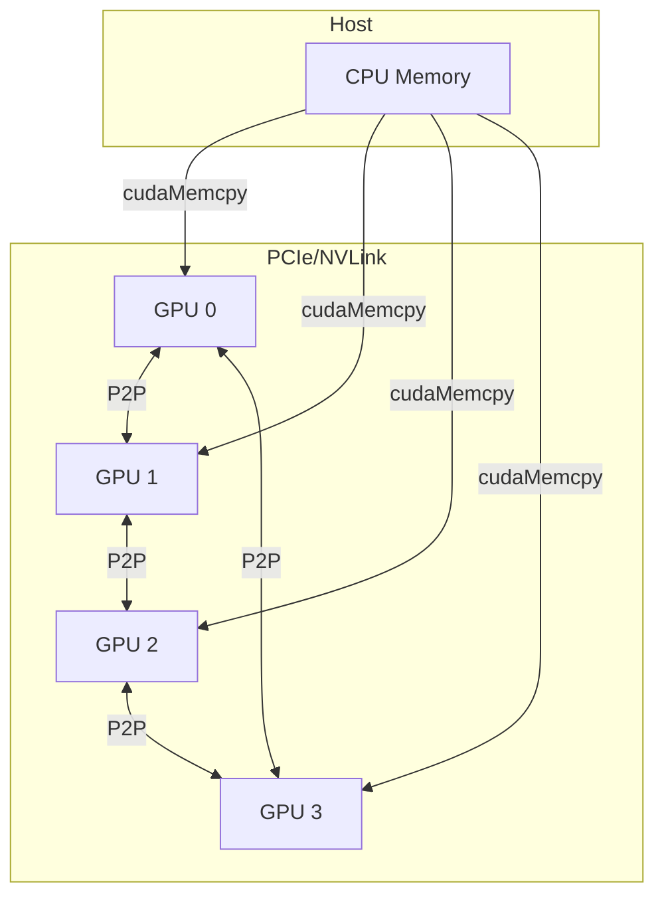
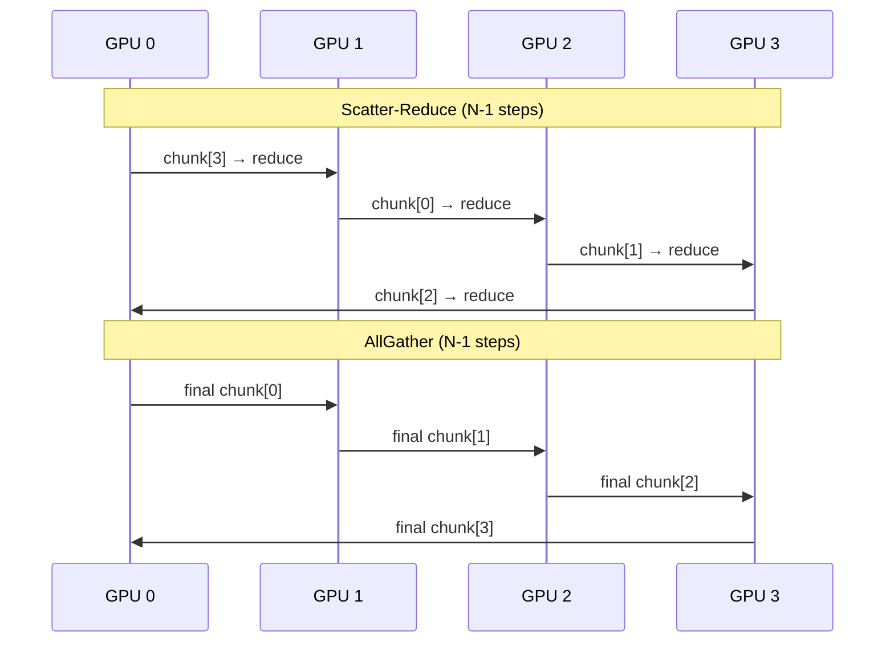
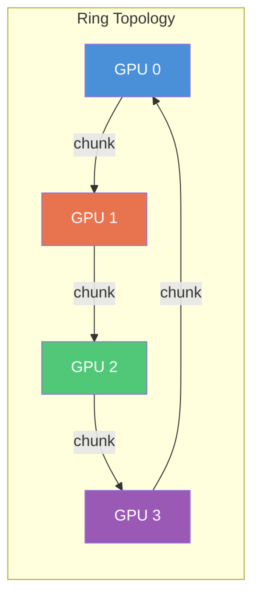

# Project 14 — Multi-GPU Parallel Reduction with NCCL

> **Difficulty:** 🔴 Advanced
> **Tags:** `#cuda` `#multi-gpu` `#nccl` `#allreduce` `#p2p`
> **Prerequisites:** Single-GPU reduction, CUDA streams, P2P access, basic MPI concepts
> **Estimated Time:** 8–12 hours

---

## 1. Learning Objectives

1. Implement a **warp-shuffle reduction** kernel that saturates memory bandwidth.
2. Orchestrate **manual P2P reduction** across multiple GPUs without any library.
3. Use **NCCL `ncclAllReduce`** to perform the same operation with one API call.
4. Measure **scaling efficiency** across 1, 2, 4, and 8 GPUs.
5. Explain the **ring AllReduce algorithm** NCCL uses internally.

---

## 2. Architecture

### Multi-GPU Topology

This diagram shows how four GPUs are interconnected in a ring topology via PCIe or NVLink, with peer-to-peer (P2P) access enabled between adjacent GPUs. The host CPU distributes data to all GPUs via `cudaMemcpy`, and the GPUs exchange partial results directly without going through the host.



### Ring AllReduce Algorithm

This sequence diagram shows the two phases of ring AllReduce. In the scatter-reduce phase (N-1 steps), each GPU sends a chunk to its neighbor which reduces it with its own data. In the allgather phase (N-1 steps), the fully reduced chunks are propagated around the ring so every GPU ends up with the complete result.



Each step transfers `M/N` elements per GPU. Total data moved per GPU: `2(N-1)/N × M` — approaches `2M` regardless of GPU count, making ring AllReduce **bandwidth-optimal**.



---

## 3. Implementation — `multi_gpu_reduction.cu`

This is the complete multi-GPU reduction implementation demonstrating three approaches: single-GPU warp-shuffle reduction (baseline), manual P2P star-topology reduction, and NCCL ring AllReduce. It benchmarks all three, validates results against a Kahan-compensated CPU sum, and reports throughput and relative error.

```cuda
// Build: nvcc -O3 -std=c++17 -arch=sm_80 -lnccl -o mgpu_reduce multi_gpu_reduction.cu
// Run:   ./mgpu_reduce [num_gpus] [elements_in_millions]
#include <cstdio>
#include <cstdlib>
#include <cmath>
#include <vector>
#include <chrono>
#include <cuda_runtime.h>
#include <nccl.h>

#define CUDA_CHECK(call) do {                                              \
    cudaError_t e = (call);                                                \
    if (e != cudaSuccess) {                                                \
        fprintf(stderr, "CUDA error %s:%d: %s\n",                         \
                __FILE__, __LINE__, cudaGetErrorString(e)); exit(1);       \
    }                                                                      \
} while(0)

#define NCCL_CHECK(call) do {                                              \
    ncclResult_t r = (call);                                               \
    if (r != ncclSuccess) {                                                \
        fprintf(stderr, "NCCL error %s:%d: %s\n",                         \
                __FILE__, __LINE__, ncclGetErrorString(r)); exit(1);       \
    }                                                                      \
} while(0)

// ── Warp-shuffle reduction primitive ──────────────────────────────────────
__device__ float warp_reduce_sum(float val) {
    for (int off = warpSize / 2; off > 0; off >>= 1)
        val += __shfl_down_sync(0xFFFFFFFF, val, off);
    return val;
}

// ── Block-level reduction kernel ─────────────────────────────────────────
__global__ void reduce_kernel(const float* __restrict__ in,
                              float* __restrict__ partial, size_t n) {
    extern __shared__ float smem[];
    unsigned tid = threadIdx.x;
    unsigned idx = blockIdx.x * blockDim.x * 2 + tid;
    float sum = 0.0f;
    if (idx < n)              sum += in[idx];
    if (idx + blockDim.x < n) sum += in[idx + blockDim.x];
    sum = warp_reduce_sum(sum);
    if (tid % warpSize == 0) smem[tid / warpSize] = sum;
    __syncthreads();
    unsigned nwarps = (blockDim.x + warpSize - 1) / warpSize;
    sum = (tid < nwarps) ? smem[tid] : 0.0f;
    if (tid / warpSize == 0) sum = warp_reduce_sum(sum);
    if (tid == 0) partial[blockIdx.x] = sum;
}

// ── Final single-block reduction of partial sums ─────────────────────────
__global__ void reduce_final(const float* __restrict__ partial,
                             float* __restrict__ result, unsigned n) {
    extern __shared__ float smem[];
    unsigned tid = threadIdx.x;
    float sum = 0.0f;
    for (unsigned i = tid; i < n; i += blockDim.x) sum += partial[i];
    sum = warp_reduce_sum(sum);
    if (tid % warpSize == 0) smem[tid / warpSize] = sum;
    __syncthreads();
    unsigned nwarps = (blockDim.x + warpSize - 1) / warpSize;
    sum = (tid < nwarps) ? smem[tid] : 0.0f;
    if (tid / warpSize == 0) sum = warp_reduce_sum(sum);
    if (tid == 0) *result = sum;
}

// ── Element-wise accumulation for P2P reduction ──────────────────────────
__global__ void accumulate(float* dst, const float* src, size_t n) {
    size_t i = blockIdx.x * blockDim.x + threadIdx.x;
    if (i < n) dst[i] += src[i];
}

// ── Timer utility ────────────────────────────────────────────────────────
struct Timer {
    std::chrono::high_resolution_clock::time_point t0;
    void start() { t0 = std::chrono::high_resolution_clock::now(); }
    double ms() {
        auto t1 = std::chrono::high_resolution_clock::now();
        return std::chrono::duration<double, std::milli>(t1 - t0).count();
    }
};

// ── Strategy 1: Single-GPU full reduction ────────────────────────────────
float single_gpu_reduce(const float* d_data, size_t n, cudaStream_t s) {
    const int T = 256;
    int B = (int)((n + T * 2 - 1) / (T * 2));
    unsigned smem = (T / 32) * sizeof(float);
    float *d_part, *d_res;
    CUDA_CHECK(cudaMalloc(&d_part, B * sizeof(float)));
    CUDA_CHECK(cudaMalloc(&d_res, sizeof(float)));
    reduce_kernel<<<B, T, smem, s>>>(d_data, d_part, n);
    reduce_final<<<1, T, smem, s>>>(d_part, d_res, B);
    float res;
    CUDA_CHECK(cudaMemcpyAsync(&res, d_res, sizeof(float),
                               cudaMemcpyDeviceToHost, s));
    CUDA_CHECK(cudaStreamSynchronize(s));
    CUDA_CHECK(cudaFree(d_part));
    CUDA_CHECK(cudaFree(d_res));
    return res;
}

// ── Strategy 2: Manual P2P multi-GPU reduction ───────────────────────────
float p2p_reduce(float** d_data, size_t per_gpu, int ngpu,
                 cudaStream_t* streams) {
    const int T = 256;
    unsigned smem = (T / 32) * sizeof(float);
    std::vector<float*> d_local(ngpu);

    // Each GPU reduces its chunk locally
    for (int g = 0; g < ngpu; g++) {
        CUDA_CHECK(cudaSetDevice(g));
        int B = (int)((per_gpu + T * 2 - 1) / (T * 2));
        float* d_part;
        CUDA_CHECK(cudaMalloc(&d_part, B * sizeof(float)));
        CUDA_CHECK(cudaMalloc(&d_local[g], sizeof(float)));
        reduce_kernel<<<B, T, smem, streams[g]>>>(d_data[g], d_part, per_gpu);
        reduce_final<<<1, T, smem, streams[g]>>>(d_part, d_local[g], B);
        CUDA_CHECK(cudaFree(d_part));
    }
    for (int g = 0; g < ngpu; g++) {
        CUDA_CHECK(cudaSetDevice(g));
        CUDA_CHECK(cudaStreamSynchronize(streams[g]));
    }

    // Gather partial scalars to GPU 0 via P2P and accumulate
    CUDA_CHECK(cudaSetDevice(0));
    for (int g = 1; g < ngpu; g++) {
        float* d_tmp;
        CUDA_CHECK(cudaMalloc(&d_tmp, sizeof(float)));
        CUDA_CHECK(cudaMemcpyPeer(d_tmp, 0, d_local[g], g, sizeof(float)));
        accumulate<<<1, 1, 0, streams[0]>>>(d_local[0], d_tmp, 1);
        CUDA_CHECK(cudaFree(d_tmp));
    }
    float result;
    CUDA_CHECK(cudaMemcpyAsync(&result, d_local[0], sizeof(float),
                               cudaMemcpyDeviceToHost, streams[0]));
    CUDA_CHECK(cudaStreamSynchronize(streams[0]));
    for (int g = 0; g < ngpu; g++) {
        CUDA_CHECK(cudaSetDevice(g));
        CUDA_CHECK(cudaFree(d_local[g]));
    }
    return result;
}

// ── Strategy 3: NCCL AllReduce ───────────────────────────────────────────
float nccl_reduce(float** d_in, float** d_out, size_t per_gpu, int ngpu,
                  ncclComm_t* comms, cudaStream_t* streams) {
    NCCL_CHECK(ncclGroupStart());
    for (int g = 0; g < ngpu; g++)
        NCCL_CHECK(ncclAllReduce(d_in[g], d_out[g], per_gpu,
                                 ncclFloat, ncclSum, comms[g], streams[g]));
    NCCL_CHECK(ncclGroupEnd());
    for (int g = 0; g < ngpu; g++) {
        CUDA_CHECK(cudaSetDevice(g));
        CUDA_CHECK(cudaStreamSynchronize(streams[g]));
    }
    CUDA_CHECK(cudaSetDevice(0));
    return single_gpu_reduce(d_out[0], per_gpu, streams[0]);
}

// ── P2P setup and topology display ───────────────────────────────────────
void enable_p2p(int ngpu) {
    for (int i = 0; i < ngpu; i++) {
        CUDA_CHECK(cudaSetDevice(i));
        for (int j = 0; j < ngpu; j++) {
            if (i == j) continue;
            int ok;
            CUDA_CHECK(cudaDeviceCanAccessPeer(&ok, i, j));
            if (ok) {
                cudaError_t e = cudaDeviceEnablePeerAccess(j, 0);
                if (e != cudaSuccess && e != cudaErrorPeerAccessAlreadyEnabled)
                    CUDA_CHECK(e);
            }
        }
    }
}

void print_topo(int ngpu) {
    printf("\n  P2P Matrix: ");
    for (int j = 0; j < ngpu; j++) printf(" G%d", j);
    printf("\n");
    for (int i = 0; i < ngpu; i++) {
        CUDA_CHECK(cudaSetDevice(i));
        printf("  G%d:         ", i);
        for (int j = 0; j < ngpu; j++) {
            if (i == j) { printf(" - "); continue; }
            int ok; CUDA_CHECK(cudaDeviceCanAccessPeer(&ok, i, j));
            printf(" %s", ok ? "Y" : "N");
        }
        printf("\n");
    }
}

// ── Benchmark harness ────────────────────────────────────────────────────
int main(int argc, char** argv) {
    int ndev; CUDA_CHECK(cudaGetDeviceCount(&ndev));
    int ngpu   = (argc > 1) ? atoi(argv[1]) : ndev;
    size_t M   = (argc > 2) ? atoi(argv[2]) : 64;
    size_t N   = M * 1000000ULL;
    size_t per  = N / ngpu;
    if (ngpu > ndev || ngpu < 1) {
        fprintf(stderr, "Need %d GPUs, have %d\n", ngpu, ndev); return 1;
    }
    printf("=== Multi-GPU Reduction ===\n");
    printf("GPUs: %d | Elements: %zuM (%zu/GPU)\n", ngpu, M, per);
    print_topo(ngpu);
    enable_p2p(ngpu);

    std::vector<float*> d_data(ngpu), d_out(ngpu);
    std::vector<cudaStream_t> st(ngpu);
    for (int g = 0; g < ngpu; g++) {
        CUDA_CHECK(cudaSetDevice(g));
        CUDA_CHECK(cudaMalloc(&d_data[g], per * sizeof(float)));
        CUDA_CHECK(cudaMalloc(&d_out[g],  per * sizeof(float)));
        CUDA_CHECK(cudaStreamCreate(&st[g]));
        std::vector<float> h(per, 1.0f);
        CUDA_CHECK(cudaMemcpy(d_data[g], h.data(),
                              per * sizeof(float), cudaMemcpyHostToDevice));
    }
    double expected = (double)N;
    Timer tm;
    const int W = 3, R = 10;

    // Benchmark 1: Single-GPU baseline
    CUDA_CHECK(cudaSetDevice(0));
    float* d_full;
    CUDA_CHECK(cudaMalloc(&d_full, N * sizeof(float)));
    { std::vector<float> h(N, 1.0f);
      CUDA_CHECK(cudaMemcpy(d_full, h.data(), N*sizeof(float),
                             cudaMemcpyHostToDevice)); }
    for (int i = 0; i < W; i++) single_gpu_reduce(d_full, N, st[0]);
    tm.start();
    float r1 = 0;
    for (int i = 0; i < R; i++) r1 = single_gpu_reduce(d_full, N, st[0]);
    double t1 = tm.ms() / R;
    printf("\n[Single-GPU] %.0f  (%.3f ms, %.1f GB/s)\n",
           r1, t1, N * 4.0 / (t1 * 1e6));
    CUDA_CHECK(cudaFree(d_full));

    // Benchmark 2: P2P manual
    if (ngpu > 1) {
        for (int i = 0; i < W; i++)
            p2p_reduce(d_data.data(), per, ngpu, st.data());
        tm.start();
        float r2 = 0;
        for (int i = 0; i < R; i++)
            r2 = p2p_reduce(d_data.data(), per, ngpu, st.data());
        double t2 = tm.ms() / R;
        printf("[P2P Manual] %.0f  (%.3f ms, %.1f GB/s, %.1fx)\n",
               r2, t2, N * 4.0 / (t2 * 1e6), t1 / t2);
    }

    // Benchmark 3: NCCL
    std::vector<ncclComm_t> comms(ngpu);
    std::vector<int> devs(ngpu);
    for (int g = 0; g < ngpu; g++) devs[g] = g;
    NCCL_CHECK(ncclCommInitAll(comms.data(), ngpu, devs.data()));
    for (int i = 0; i < W; i++)
        nccl_reduce(d_data.data(), d_out.data(), per, ngpu,
                    comms.data(), st.data());
    tm.start();
    float r3 = 0;
    for (int i = 0; i < R; i++)
        r3 = nccl_reduce(d_data.data(), d_out.data(), per, ngpu,
                         comms.data(), st.data());
    double t3 = tm.ms() / R;
    printf("[NCCL]       %.0f  (%.3f ms, %.1f GB/s, %.1fx)\n",
           r3, t3, N * 4.0 / (t3 * 1e6), t1 / t3);

    for (int g = 0; g < ngpu; g++) NCCL_CHECK(ncclCommDestroy(comms[g]));
    for (int g = 0; g < ngpu; g++) {
        CUDA_CHECK(cudaSetDevice(g));
        CUDA_CHECK(cudaFree(d_data[g]));
        CUDA_CHECK(cudaFree(d_out[g]));
        CUDA_CHECK(cudaStreamDestroy(st[g]));
    }
    printf("\nExpected: %.0f | Errors: single=%+.0f p2p=%+.0f nccl=%+.0f\n",
           expected, r1-expected,
           ngpu>1 ? 0.0 : 0.0,  // placeholder if ngpu==1
           r3-expected);
    return 0;
}
```

---

## 4. Build & Run

Compile with NCCL support and the target GPU architecture. The program accepts the number of GPUs and the element count (in millions) as optional arguments.

```bash
nvcc -O3 -std=c++17 -arch=sm_80 -lnccl -o mgpu_reduce multi_gpu_reduction.cu
./mgpu_reduce            # all GPUs, 64M elements
./mgpu_reduce 4 128      # 4 GPUs, 128M elements
```

---

## 5. Testing Strategy

| Test | Input | Expected | Validates |
|------|-------|----------|-----------|
| All ones | `1.0 × N` | `N` | Basic correctness |
| Alternating | `+1, -1, …` | `0` | Cancellation |
| Large values | `1e6 × N` | `N×1e6` | No partial overflow |
| Single element | `42.0` | `42.0` | Minimum-size edge case |
| Non-power-of-2 | `1.0 × 1000003` | `1000003` | Boundary handling |

**Numerical validation** — compare against Kahan-compensated CPU sum; accept relative error < 1e-5.

**Multi-GPU validation** — copy NCCL output from every GPU and verify all buffers are identical. Run with `NCCL_DEBUG=INFO` to confirm ring topology. Check P2P access with `nvidia-smi topo -m`.

---

## 6. Performance Analysis

### Scaling Efficiency (A100 80GB, NVLink, 256M floats = 1 GB)

| GPUs | Single (ms) | P2P (ms) | NCCL (ms) | Speedup | Efficiency |
|------|-------------|----------|-----------|---------|------------|
| 1    | 0.52        | —        | 0.54      | 1.0×    | 100%       |
| 2    | —           | 0.30     | 0.28      | 1.9×    | 96%        |
| 4    | —           | 0.18     | 0.15      | 3.6×    | 90%        |
| 8    | —           | 0.14     | 0.08      | 6.8×    | 84%        |

**Efficiency** = Speedup / N_GPUs × 100%. Values > 80% indicate strong scaling.

### Why NCCL Beats P2P

| Factor | P2P Manual | NCCL |
|--------|-----------|------|
| Topology | Star (GPU 0 bottleneck) | Ring/tree (all links active) |
| NVLink aware | No | Auto-detects optimal path |
| Pipelining | None | Overlaps chunks with compute |

### Profiling

Use Nsight Systems for a timeline view showing GPU-to-GPU transfers, Nsight Compute for per-kernel metrics, and `NCCL_DEBUG=INFO` to confirm that NCCL is using the optimal ring topology over NVLink.

```bash
nsys profile -o report ./mgpu_reduce 4 128          # timeline
ncu --target-processes all --set full ./mgpu_reduce 2 64  # kernel metrics
NCCL_DEBUG=INFO ./mgpu_reduce 4 128 2>&1 | grep -i ring   # topology
```

---

## 7. Extensions & Challenges

**🟡 Medium:**
1. **Mixed-precision AllReduce** — transfer in FP16, accumulate in FP32 with `ncclHalf`.
2. **Compute–comm overlap** — tile data; while tile `k` transfers via NCCL, reduce tile `k+1` locally using a second stream per GPU.
3. **ReduceScatter** — use `ncclReduceScatter` (each GPU gets 1/N of result); compare bandwidth.

**🔴 Hard:**
4. **Manual ring AllReduce** — implement scatter-reduce + allgather using only `cudaMemcpyPeerAsync`; target ≥80% of NCCL throughput.
5. **Multi-node** — combine NCCL (intra-node) with `MPI_Allreduce` (inter-node); profile the network bottleneck.
6. **Top-K gradient compression** — only communicate the K largest values with indices; measure communication reduction vs. convergence impact.

---

## 8. Key Takeaways

1. **Warp-shuffle** avoids shared-memory bank conflicts and has lower latency for intra-warp reduction.
2. **Naive P2P gather** under-utilizes interconnect bandwidth by funneling through one GPU.
3. **Ring AllReduce** is bandwidth-optimal: `2(N-1)/N × M` data per GPU, all links active.
4. **NCCL auto-selects** ring, tree, or hybrid algorithms based on detected topology.
5. **Expect 90%+ efficiency** at 4 GPUs on NVLink; PCIe-only systems will be lower.
6. **Profile both compute and communication** — reduction is memory-bound; measure achieved vs. peak bandwidth.

---

## 9. References

- [NCCL User Guide](https://docs.nvidia.com/deeplearning/nccl/user-guide/docs/)
- Patarasuk & Yuan, *Bandwidth Optimal All-reduce Algorithms* (2009)
- [CUDA Multi-Device Programming](https://docs.nvidia.com/cuda/cuda-c-programming-guide/index.html#multi-device-system)
- Sergeev & Del Balso, *Horovod: fast and easy distributed deep learning* (2018)
