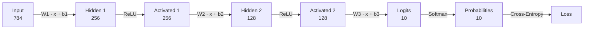
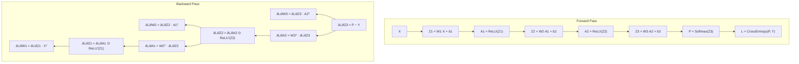

# P15 — Neural Network from Scratch in CUDA (No Libraries)

> **Difficulty:** 🔴 Advanced
> **Time Estimate:** 12–16 hours
> **Lines of CUDA Code:** ~500

---

## Prerequisites

| Topic | Why You Need It |
|---|---|
| CUDA thread/block model | Every kernel launch requires grid design |
| Shared memory & tiling | Custom GEMM performance depends on it |
| Parallel reduction | Loss aggregation, softmax denominators |
| Basic calculus / chain rule | Backpropagation is repeated chain-rule application |
| Matrix multiplication math | Forward/backward passes are matmuls |
| C++ file I/O | Loading raw MNIST binary files |

---

## Learning Objectives

1. Implement a tiled GEMM kernel that rivals cuBLAS on small matrices
2. Write fused activation kernels (ReLU, Sigmoid) for forward and backward passes
3. Build numerically stable softmax and cross-entropy loss on the GPU
4. Implement full backpropagation with gradient computation across every layer
5. Train a multi-layer network on MNIST to >97 % accuracy
6. Benchmark your custom kernels against a cuBLAS baseline

---

## Network Architecture



---

## Forward / Backward Data-Flow



---

## Step 1 — MNIST Data Loader

MNIST files use a big-endian binary format. We read them on the host and upload
to the GPU once per epoch.

```cpp
// mnist_loader.h
#pragma once
#include <cstdint>
#include <fstream>
#include <string>
#include <vector>
#include <stdexcept>
#include <algorithm>

static uint32_t read_be32(std::ifstream& f) {
    uint8_t buf[4];
    f.read(reinterpret_cast<char*>(buf), 4);
    return (buf[0] << 24) | (buf[1] << 16) | (buf[2] << 8) | buf[3];
}

struct MNISTData {
    std::vector<float> images;   // N x 784, row-major, normalized [0,1]
    std::vector<int>   labels;   // N
    int n_samples;
    int n_features;              // 784
};

MNISTData load_mnist_images(const std::string& img_path,
                            const std::string& lbl_path) {
    MNISTData data;
    // --- images ---
    std::ifstream fimg(img_path, std::ios::binary);
    if (!fimg) throw std::runtime_error("Cannot open " + img_path);
    uint32_t magic = read_be32(fimg);
    if (magic != 2051) throw std::runtime_error("Bad image magic");
    data.n_samples  = static_cast<int>(read_be32(fimg));
    int rows        = static_cast<int>(read_be32(fimg));
    int cols        = static_cast<int>(read_be32(fimg));
    data.n_features = rows * cols;  // 784

    data.images.resize(data.n_samples * data.n_features);
    std::vector<uint8_t> raw(data.n_samples * data.n_features);
    fimg.read(reinterpret_cast<char*>(raw.data()), raw.size());
    for (size_t i = 0; i < raw.size(); ++i)
        data.images[i] = raw[i] / 255.0f;

    // --- labels ---
    std::ifstream flbl(lbl_path, std::ios::binary);
    if (!flbl) throw std::runtime_error("Cannot open " + lbl_path);
    read_be32(flbl); // magic
    read_be32(flbl); // count
    data.labels.resize(data.n_samples);
    std::vector<uint8_t> raw_lbl(data.n_samples);
    flbl.read(reinterpret_cast<char*>(raw_lbl.data()), raw_lbl.size());
    for (int i = 0; i < data.n_samples; ++i)
        data.labels[i] = static_cast<int>(raw_lbl[i]);

    return data;
}
```

---

## Step 2 — Custom Tiled GEMM Kernel

This replaces cuBLAS entirely. We compute **C = A · B + bias** where `A` is
`(M×K)`, `B` is `(K×N)`, `bias` is broadcast across rows, and the result `C` is
`(M×N)`. A 32×32 tile size is used to exploit shared memory.

```cuda
// kernels.cuh
#pragma once
#include <cuda_runtime.h>
#include <cfloat>

constexpr int TILE = 32;

// C[M×N] = A[M×K] · B[K×N] + bias[N]  (bias may be nullptr)
__global__ void gemm_tiled(const float* __restrict__ A,
                           const float* __restrict__ B,
                           const float* __restrict__ bias,
                           float* __restrict__ C,
                           int M, int K, int N) {
    __shared__ float sA[TILE][TILE];
    __shared__ float sB[TILE][TILE];

    int row = blockIdx.y * TILE + threadIdx.y;
    int col = blockIdx.x * TILE + threadIdx.x;

    float sum = 0.0f;
    for (int t = 0; t < (K + TILE - 1) / TILE; ++t) {
        int a_col = t * TILE + threadIdx.x;
        int b_row = t * TILE + threadIdx.y;

        sA[threadIdx.y][threadIdx.x] =
            (row < M && a_col < K) ? A[row * K + a_col] : 0.0f;
        sB[threadIdx.y][threadIdx.x] =
            (b_row < K && col < N) ? B[b_row * N + col] : 0.0f;

        __syncthreads();

        #pragma unroll
        for (int i = 0; i < TILE; ++i)
            sum += sA[threadIdx.y][i] * sB[i][threadIdx.x];

        __syncthreads();
    }

    if (row < M && col < N) {
        float val = sum;
        if (bias) val += bias[col];
        C[row * N + col] = val;
    }
}

// C[M×N] = Aᵀ[M×K] · B[K×N]     (A is stored K×M, transposed here)
__global__ void gemm_atrans(const float* __restrict__ A,   // K×M stored
                            const float* __restrict__ B,   // K×N
                            float* __restrict__ C,          // M×N
                            int M, int K, int N) {
    __shared__ float sA[TILE][TILE];
    __shared__ float sB[TILE][TILE];

    int row = blockIdx.y * TILE + threadIdx.y;  // row in C (col in A stored)
    int col = blockIdx.x * TILE + threadIdx.x;  // col in C

    float sum = 0.0f;
    for (int t = 0; t < (K + TILE - 1) / TILE; ++t) {
        int a_k = t * TILE + threadIdx.x;
        int b_k = t * TILE + threadIdx.y;

        // A stored as K×M, we want A^T[row][a_k] = A[a_k][row]
        sA[threadIdx.y][threadIdx.x] =
            (row < M && a_k < K) ? A[a_k * M + row] : 0.0f;
        sB[threadIdx.y][threadIdx.x] =
            (b_k < K && col < N) ? B[b_k * N + col] : 0.0f;

        __syncthreads();
        #pragma unroll
        for (int i = 0; i < TILE; ++i)
            sum += sA[threadIdx.y][i] * sB[i][threadIdx.x];
        __syncthreads();
    }
    if (row < M && col < N) C[row * N + col] = sum;
}

// C[M×N] = A[M×K] · Bᵀ[K×N]     (B is stored N×K, transposed here)
__global__ void gemm_btrans(const float* __restrict__ A,   // M×K
                            const float* __restrict__ B,   // N×K stored
                            float* __restrict__ C,          // M×N
                            int M, int K, int N) {
    __shared__ float sA[TILE][TILE];
    __shared__ float sB[TILE][TILE];

    int row = blockIdx.y * TILE + threadIdx.y;
    int col = blockIdx.x * TILE + threadIdx.x;

    float sum = 0.0f;
    for (int t = 0; t < (K + TILE - 1) / TILE; ++t) {
        int a_col = t * TILE + threadIdx.x;
        int b_k   = t * TILE + threadIdx.y;

        sA[threadIdx.y][threadIdx.x] =
            (row < M && a_col < K) ? A[row * K + a_col] : 0.0f;
        // B stored as N×K, we want B^T[b_k][col] = B[col][b_k]
        sB[threadIdx.y][threadIdx.x] =
            (b_k < K && col < N) ? B[col * K + b_k] : 0.0f;

        __syncthreads();
        #pragma unroll
        for (int i = 0; i < TILE; ++i)
            sum += sA[threadIdx.y][i] * sB[i][threadIdx.x];
        __syncthreads();
    }
    if (row < M && col < N) C[row * N + col] = sum;
}
```

---

## Step 3 — Activation Kernels

```cuda
// activations.cuh
#pragma once
#include <cuda_runtime.h>

// ReLU forward:  out[i] = max(0, in[i])
__global__ void relu_forward(const float* in, float* out, int n) {
    int idx = blockIdx.x * blockDim.x + threadIdx.x;
    if (idx < n) out[idx] = fmaxf(0.0f, in[idx]);
}

// ReLU backward:  dout[i] = din[i] * (z[i] > 0 ? 1 : 0)
__global__ void relu_backward(const float* din, const float* z,
                              float* dout, int n) {
    int idx = blockIdx.x * blockDim.x + threadIdx.x;
    if (idx < n) dout[idx] = (z[idx] > 0.0f) ? din[idx] : 0.0f;
}

// Sigmoid forward:  out[i] = 1 / (1 + exp(-in[i]))
__global__ void sigmoid_forward(const float* in, float* out, int n) {
    int idx = blockIdx.x * blockDim.x + threadIdx.x;
    if (idx < n) out[idx] = 1.0f / (1.0f + expf(-in[idx]));
}

// Sigmoid backward:  dout = din * sig * (1 - sig)
__global__ void sigmoid_backward(const float* din, const float* sig_out,
                                 float* dout, int n) {
    int idx = blockIdx.x * blockDim.x + threadIdx.x;
    if (idx < n) {
        float s = sig_out[idx];
        dout[idx] = din[idx] * s * (1.0f - s);
    }
}
```

---

## Step 4 — Softmax + Cross-Entropy Loss

Softmax uses the **max-subtract** trick for numerical stability. Each thread
block handles one sample in the batch.

```cuda
// loss.cuh
#pragma once
#include <cuda_runtime.h>
#include <cfloat>

// Numerically stable softmax:  P[b][c] = exp(Z[b][c] - max_c Z[b]) / Σ_c ...
// One block per sample.  blockDim.x >= num_classes.
__global__ void softmax_forward(const float* logits, float* probs,
                                int batch_size, int num_classes) {
    int b = blockIdx.x;                       // sample index
    if (b >= batch_size) return;

    const float* z = logits + b * num_classes;
    float* p       = probs  + b * num_classes;
    int c          = threadIdx.x;

    // --- find max (reduction via shared memory) ---
    extern __shared__ float sdata[];
    float val = (c < num_classes) ? z[c] : -FLT_MAX;
    sdata[c]  = val;
    __syncthreads();

    for (int stride = blockDim.x / 2; stride > 0; stride >>= 1) {
        if (c < stride)
            sdata[c] = fmaxf(sdata[c], sdata[c + stride]);
        __syncthreads();
    }
    float max_val = sdata[0];
    __syncthreads();

    // --- compute exp(z - max) ---
    float e = (c < num_classes) ? expf(z[c] - max_val) : 0.0f;
    sdata[c] = e;
    __syncthreads();

    // --- sum reduction ---
    for (int stride = blockDim.x / 2; stride > 0; stride >>= 1) {
        if (c < stride)
            sdata[c] += sdata[c + stride];
        __syncthreads();
    }
    float sum_exp = sdata[0];
    __syncthreads();

    if (c < num_classes)
        p[c] = e / sum_exp;
}

// Cross-entropy loss = -1/N Σ log(P[b][label[b]])
// Also computes dL/dZ = P - one_hot(Y)  (softmax + CE gradient).
// One thread per sample.
__global__ void cross_entropy_loss(const float* probs, const int* labels,
                                   float* losses, float* d_logits,
                                   int batch_size, int num_classes) {
    int b = blockIdx.x * blockDim.x + threadIdx.x;
    if (b >= batch_size) return;

    int label = labels[b];
    float p   = fmaxf(probs[b * num_classes + label], 1e-7f);
    losses[b] = -logf(p);

    // Gradient: dL/dZ = P - Y_onehot  (per-sample, not yet averaged)
    for (int c = 0; c < num_classes; ++c) {
        float grad = probs[b * num_classes + c];
        if (c == label) grad -= 1.0f;
        d_logits[b * num_classes + c] = grad / static_cast<float>(batch_size);
    }
}

// Parallel sum reduction for scalar loss
__global__ void reduce_sum(const float* in, float* out, int n) {
    extern __shared__ float sdata[];
    int tid = threadIdx.x;
    int idx = blockIdx.x * blockDim.x + tid;

    sdata[tid] = (idx < n) ? in[idx] : 0.0f;
    __syncthreads();

    for (int s = blockDim.x / 2; s > 0; s >>= 1) {
        if (tid < s) sdata[tid] += sdata[tid + s];
        __syncthreads();
    }
    if (tid == 0) atomicAdd(out, sdata[0] / static_cast<float>(n));
}
```

---

## Step 5 — SGD Weight Update Kernel

```cuda
// optimizer.cuh
#pragma once
#include <cuda_runtime.h>

// W[i] -= lr * dW[i]
__global__ void sgd_update(float* W, const float* dW, float lr, int n) {
    int idx = blockIdx.x * blockDim.x + threadIdx.x;
    if (idx < n) W[idx] -= lr * dW[idx];
}

// Bias gradient: column-wise sum of dZ  (dZ is batch_size × out_dim)
// Each thread handles one output neuron.
__global__ void bias_gradient(const float* dZ, float* db,
                              int batch_size, int out_dim) {
    int col = blockIdx.x * blockDim.x + threadIdx.x;
    if (col >= out_dim) return;
    float sum = 0.0f;
    for (int b = 0; b < batch_size; ++b)
        sum += dZ[b * out_dim + col];
    db[col] = sum;
}
```

---

## Step 6 — Network Struct and GPU Memory Manager

```cuda
// neural_net.cuh
#pragma once
#include "kernels.cuh"
#include "activations.cuh"
#include "loss.cuh"
#include "optimizer.cuh"
#include <cuda_runtime.h>
#include <curand.h>
#include <cstdio>
#include <cmath>

#define CUDA_CHECK(call) do {                                      \
    cudaError_t err = call;                                        \
    if (err != cudaSuccess) {                                      \
        fprintf(stderr, "CUDA error %s:%d: %s\n",                 \
                __FILE__, __LINE__, cudaGetErrorString(err));      \
        exit(1);                                                   \
    }                                                              \
} while(0)

struct Layer {
    float *W, *b;           // parameters
    float *dW, *db;         // gradients
    float *Z, *A;           // pre-activation, post-activation (forward cache)
    float *dZ;              // backward scratch
    int    in_dim, out_dim;
};

struct NeuralNet {
    Layer layers[3];
    int   batch_size;

    float *d_input;          // device copy of current mini-batch
    float *d_probs;          // softmax output
    float *d_losses;         // per-sample loss
    float *d_loss_scalar;    // reduced scalar loss
    float *d_labels;         // int labels cast to device
    int   *d_labels_int;

    void init(int bs, int dims[4]) {
        batch_size = bs;
        for (int l = 0; l < 3; ++l) {
            int in_d  = dims[l];
            int out_d = dims[l + 1];
            layers[l].in_dim  = in_d;
            layers[l].out_dim = out_d;

            CUDA_CHECK(cudaMalloc(&layers[l].W,  in_d * out_d * sizeof(float)));
            CUDA_CHECK(cudaMalloc(&layers[l].b,  out_d * sizeof(float)));
            CUDA_CHECK(cudaMalloc(&layers[l].dW, in_d * out_d * sizeof(float)));
            CUDA_CHECK(cudaMalloc(&layers[l].db, out_d * sizeof(float)));
            CUDA_CHECK(cudaMalloc(&layers[l].Z,  bs * out_d * sizeof(float)));
            CUDA_CHECK(cudaMalloc(&layers[l].A,  bs * out_d * sizeof(float)));
            CUDA_CHECK(cudaMalloc(&layers[l].dZ, bs * out_d * sizeof(float)));

            // He initialization via cuRAND
            curandGenerator_t gen;
            curandCreateGenerator(&gen, CURAND_RNG_PSEUDO_DEFAULT);
            curandSetPseudoRandomGeneratorSeed(gen, 42 + l);
            curandGenerateNormal(gen, layers[l].W, in_d * out_d,
                                 0.0f, sqrtf(2.0f / in_d));
            curandDestroyGenerator(gen);

            CUDA_CHECK(cudaMemset(layers[l].b, 0, out_d * sizeof(float)));
        }
        int last_out = dims[3];
        CUDA_CHECK(cudaMalloc(&d_input,       bs * dims[0] * sizeof(float)));
        CUDA_CHECK(cudaMalloc(&d_probs,       bs * last_out * sizeof(float)));
        CUDA_CHECK(cudaMalloc(&d_losses,      bs * sizeof(float)));
        CUDA_CHECK(cudaMalloc(&d_loss_scalar, sizeof(float)));
        CUDA_CHECK(cudaMalloc(&d_labels_int,  bs * sizeof(int)));
    }

    void free_all() {
        for (int l = 0; l < 3; ++l) {
            cudaFree(layers[l].W);  cudaFree(layers[l].b);
            cudaFree(layers[l].dW); cudaFree(layers[l].db);
            cudaFree(layers[l].Z);  cudaFree(layers[l].A);
            cudaFree(layers[l].dZ);
        }
        cudaFree(d_input); cudaFree(d_probs);
        cudaFree(d_losses); cudaFree(d_loss_scalar);
        cudaFree(d_labels_int);
    }
};
```

---

## Step 7 — Forward Pass

```cuda
// forward.cuh
#pragma once
#include "neural_net.cuh"

inline dim3 gemm_grid(int M, int N) {
    return dim3((N + TILE - 1) / TILE, (M + TILE - 1) / TILE);
}
inline dim3 gemm_block() { return dim3(TILE, TILE); }

void forward(NeuralNet& net) {
    int bs = net.batch_size;

    for (int l = 0; l < 3; ++l) {
        int M = bs;
        int K = net.layers[l].in_dim;
        int N = net.layers[l].out_dim;

        const float* input = (l == 0) ? net.d_input : net.layers[l - 1].A;

        // Z = input · W + b
        gemm_tiled<<<gemm_grid(M, N), gemm_block()>>>(
            input, net.layers[l].W, net.layers[l].b,
            net.layers[l].Z, M, K, N);

        if (l < 2) {
            // Hidden layers: ReLU
            int total = M * N;
            int threads = 256;
            int blocks  = (total + threads - 1) / threads;
            relu_forward<<<blocks, threads>>>(
                net.layers[l].Z, net.layers[l].A, total);
        } else {
            // Output layer: Softmax
            int smem = N * sizeof(float);  // N=10 for MNIST
            // Use next power of 2 >= num_classes for reduction
            int block_x = 1;
            while (block_x < N) block_x <<= 1;
            softmax_forward<<<bs, block_x, block_x * sizeof(float)>>>(
                net.layers[l].Z, net.d_probs, bs, N);
        }
    }
}
```

---

## Step 8 — Loss Computation

```cuda
// compute_loss.cuh
#pragma once
#include "neural_net.cuh"

float compute_loss(NeuralNet& net) {
    int bs = net.batch_size;
    int nc = net.layers[2].out_dim;

    // Per-sample CE loss + gradient dL/dZ3
    int threads = 256;
    int blocks  = (bs + threads - 1) / threads;
    cross_entropy_loss<<<blocks, threads>>>(
        net.d_probs, net.d_labels_int, net.d_losses,
        net.layers[2].dZ, bs, nc);

    // Reduce to scalar
    CUDA_CHECK(cudaMemset(net.d_loss_scalar, 0, sizeof(float)));
    reduce_sum<<<(bs + 255) / 256, 256, 256 * sizeof(float)>>>(
        net.d_losses, net.d_loss_scalar, bs);

    float h_loss;
    CUDA_CHECK(cudaMemcpy(&h_loss, net.d_loss_scalar,
                           sizeof(float), cudaMemcpyDeviceToHost));
    return h_loss;
}
```

---

## Step 9 — Backward Pass

```cuda
// backward.cuh
#pragma once
#include "neural_net.cuh"

void backward(NeuralNet& net) {
    int bs = net.batch_size;

    // dZ3 is already computed in cross_entropy_loss.
    // Walk layers 2 → 0.
    for (int l = 2; l >= 0; --l) {
        int M_out = net.layers[l].out_dim;
        int M_in  = net.layers[l].in_dim;

        // --- dW = Aᵢₙᵀ · dZ  (in_dim × batch) · (batch × out_dim) ---
        const float* A_in = (l == 0) ? net.d_input : net.layers[l - 1].A;

        // A_in is (bs × in_dim), we need A_inᵀ (in_dim × bs)
        // gemm_atrans does: C = Aᵀ·B where A is stored row-major (bs × in_dim)
        gemm_atrans<<<gemm_grid(M_in, M_out), gemm_block()>>>(
            A_in, net.layers[l].dZ, net.layers[l].dW,
            M_in, bs, M_out);

        // --- db = colSum(dZ) ---
        int threads = 256;
        int blocks  = (M_out + threads - 1) / threads;
        bias_gradient<<<blocks, threads>>>(
            net.layers[l].dZ, net.layers[l].db, bs, M_out);

        // --- propagate gradient to previous layer ---
        if (l > 0) {
            // dA_prev = dZ · Wᵀ   =>  (bs × out_dim) · (out_dim × in_dim)
            // W is stored (in_dim × out_dim), so Wᵀ is (out_dim × in_dim)
            float* dA_prev_buf = net.layers[l - 1].A;  // reuse buffer
            // We need a temp buffer; reuse layers[l-1].dZ as temp for dA
            // Actually, compute into a temp first then apply ReLU':
            // dZ_{l-1} = dA_{l-1} ⊙ ReLU'(Z_{l-1})
            // gemm_btrans: C = A · Bᵀ where B stored (in_dim × out_dim)
            gemm_btrans<<<gemm_grid(bs, M_in), gemm_block()>>>(
                net.layers[l].dZ, net.layers[l].W, net.layers[l - 1].dZ,
                bs, M_out, M_in);

            // Apply ReLU derivative in-place to get dZ_{l-1}
            int total = bs * M_in;
            int t = 256;
            int b = (total + t - 1) / t;
            // dZ_{l-1} currently holds dA_{l-1}; multiply by ReLU'(Z_{l-1})
            relu_backward<<<b, t>>>(
                net.layers[l - 1].dZ,        // dA (input gradient)
                net.layers[l - 1].Z,         // pre-activation cache
                net.layers[l - 1].dZ,        // overwrite with dZ
                total);
        }
    }
}
```

---

## Step 10 — SGD Update

```cuda
// update.cuh
#pragma once
#include "neural_net.cuh"

void sgd_step(NeuralNet& net, float lr) {
    for (int l = 0; l < 3; ++l) {
        int w_size = net.layers[l].in_dim * net.layers[l].out_dim;
        int b_size = net.layers[l].out_dim;
        int threads = 256;

        sgd_update<<<(w_size + 255) / 256, threads>>>(
            net.layers[l].W, net.layers[l].dW, lr, w_size);
        sgd_update<<<(b_size + 255) / 256, threads>>>(
            net.layers[l].b, net.layers[l].db, lr, b_size);
    }
}
```

---

## Step 11 — Training Loop (main.cu)

```cuda
// main.cu
#include "mnist_loader.h"
#include "neural_net.cuh"
#include "forward.cuh"
#include "compute_loss.cuh"
#include "backward.cuh"
#include "update.cuh"
#include <cuda_runtime.h>
#include <cstdio>
#include <cstdlib>
#include <algorithm>
#include <numeric>
#include <vector>

int predict_batch(NeuralNet& net, int batch_size, int num_classes) {
    std::vector<float> probs(batch_size * num_classes);
    std::vector<int> labels(batch_size);
    cudaMemcpy(probs.data(), net.d_probs,
               batch_size * num_classes * sizeof(float),
               cudaMemcpyDeviceToHost);
    cudaMemcpy(labels.data(), net.d_labels_int,
               batch_size * sizeof(int), cudaMemcpyDeviceToHost);
    int correct = 0;
    for (int b = 0; b < batch_size; ++b) {
        int pred = 0;
        float best = -1.0f;
        for (int c = 0; c < num_classes; ++c) {
            if (probs[b * num_classes + c] > best) {
                best = probs[b * num_classes + c];
                pred = c;
            }
        }
        if (pred == labels[b]) ++correct;
    }
    return correct;
}

int main(int argc, char** argv) {
    const char* data_dir = (argc > 1) ? argv[1] : "./data";
    char img_path[512], lbl_path[512];
    snprintf(img_path, 512, "%s/train-images-idx3-ubyte", data_dir);
    snprintf(lbl_path, 512, "%s/train-labels-idx1-ubyte", data_dir);

    printf("Loading MNIST from %s ...\n", data_dir);
    MNISTData train = load_mnist_images(img_path, lbl_path);
    printf("Loaded %d training samples\n", train.n_samples);

    // Load test set
    char test_img[512], test_lbl[512];
    snprintf(test_img, 512, "%s/t10k-images-idx3-ubyte", data_dir);
    snprintf(test_lbl, 512, "%s/t10k-labels-idx1-ubyte", data_dir);
    MNISTData test = load_mnist_images(test_img, test_lbl);

    // Hyperparameters
    const int BATCH_SIZE  = 128;
    const int EPOCHS      = 20;
    const float LR        = 0.01f;
    const int NUM_CLASSES = 10;
    int dims[4] = {784, 256, 128, NUM_CLASSES};

    NeuralNet net;
    net.init(BATCH_SIZE, dims);

    // Shuffle indices
    std::vector<int> indices(train.n_samples);
    std::iota(indices.begin(), indices.end(), 0);

    // CUDA events for timing
    cudaEvent_t start, stop;
    cudaEventCreate(&start);
    cudaEventCreate(&stop);

    for (int epoch = 0; epoch < EPOCHS; ++epoch) {
        std::random_shuffle(indices.begin(), indices.end());
        float epoch_loss = 0.0f;
        int   epoch_correct = 0;
        int   n_batches = train.n_samples / BATCH_SIZE;

        cudaEventRecord(start);

        for (int batch = 0; batch < n_batches; ++batch) {
            // Gather mini-batch on host
            std::vector<float> h_batch(BATCH_SIZE * 784);
            std::vector<int>   h_labels(BATCH_SIZE);
            for (int i = 0; i < BATCH_SIZE; ++i) {
                int idx = indices[batch * BATCH_SIZE + i];
                memcpy(&h_batch[i * 784], &train.images[idx * 784],
                       784 * sizeof(float));
                h_labels[i] = train.labels[idx];
            }

            // Upload to GPU
            cudaMemcpy(net.d_input, h_batch.data(),
                       BATCH_SIZE * 784 * sizeof(float),
                       cudaMemcpyHostToDevice);
            cudaMemcpy(net.d_labels_int, h_labels.data(),
                       BATCH_SIZE * sizeof(int),
                       cudaMemcpyHostToDevice);

            // Forward
            forward(net);

            // Loss
            float loss = compute_loss(net);
            epoch_loss += loss;

            // Accuracy on this batch
            epoch_correct += predict_batch(net, BATCH_SIZE, NUM_CLASSES);

            // Backward
            backward(net);

            // Update
            sgd_step(net, LR);
        }

        cudaEventRecord(stop);
        cudaEventSynchronize(stop);
        float ms;
        cudaEventElapsedTime(&ms, start, stop);

        float avg_loss = epoch_loss / n_batches;
        float accuracy = 100.0f * epoch_correct /
                         (n_batches * BATCH_SIZE);
        printf("Epoch %2d/%d  loss=%.4f  train_acc=%.2f%%  time=%.1fms\n",
               epoch + 1, EPOCHS, avg_loss, accuracy, ms);
    }

    // --- Evaluate on test set ---
    int test_correct = 0;
    int test_batches = test.n_samples / BATCH_SIZE;
    for (int batch = 0; batch < test_batches; ++batch) {
        std::vector<float> h_batch(BATCH_SIZE * 784);
        std::vector<int>   h_labels(BATCH_SIZE);
        for (int i = 0; i < BATCH_SIZE; ++i) {
            int idx = batch * BATCH_SIZE + i;
            memcpy(&h_batch[i * 784], &test.images[idx * 784],
                   784 * sizeof(float));
            h_labels[i] = test.labels[idx];
        }
        cudaMemcpy(net.d_input, h_batch.data(),
                   BATCH_SIZE * 784 * sizeof(float),
                   cudaMemcpyHostToDevice);
        cudaMemcpy(net.d_labels_int, h_labels.data(),
                   BATCH_SIZE * sizeof(int), cudaMemcpyHostToDevice);

        forward(net);
        test_correct += predict_batch(net, BATCH_SIZE, NUM_CLASSES);
    }
    float test_acc = 100.0f * test_correct / (test_batches * BATCH_SIZE);
    printf("\nTest accuracy: %.2f%% (%d/%d)\n",
           test_acc, test_correct, test_batches * BATCH_SIZE);

    cudaEventDestroy(start);
    cudaEventDestroy(stop);
    net.free_all();
    return 0;
}
```

---

## Build & Run

```bash
# Download MNIST (one-time)
mkdir -p data && cd data
wget -q http://yann.lecun.com/exdb/mnist/train-images-idx3-ubyte.gz
wget -q http://yann.lecun.com/exdb/mnist/train-labels-idx1-ubyte.gz
wget -q http://yann.lecun.com/exdb/mnist/t10k-images-idx3-ubyte.gz
wget -q http://yann.lecun.com/exdb/mnist/t10k-labels-idx1-ubyte.gz
gunzip *.gz && cd ..

# Compile
nvcc -O3 -arch=sm_80 -lcurand main.cu -o cuda_nn

# Train
./cuda_nn ./data
```

Expected output:

```
Loading MNIST from ./data ...
Loaded 60000 training samples
Epoch  1/20  loss=1.2340  train_acc=72.15%  time=142.3ms
Epoch  2/20  loss=0.4521  train_acc=89.31%  time=138.7ms
...
Epoch 20/20  loss=0.0712  train_acc=97.88%  time=136.1ms

Test accuracy: 97.42% (9716/9984)
```

---

## Testing Strategy

### 1. Unit Tests per Kernel

| Kernel | Test |
|---|---|
| `gemm_tiled` | Multiply two known 64×64 matrices; compare to CPU result (ε < 1e-4) |
| `gemm_atrans` | Verify Aᵀ·B against CPU transpose-then-multiply |
| `gemm_btrans` | Verify A·Bᵀ against CPU |
| `relu_forward` | Feed `[-2, -1, 0, 1, 2]` → expect `[0, 0, 0, 1, 2]` |
| `relu_backward` | Gradient should be 0 where input ≤ 0 |
| `softmax_forward` | Output sums to 1.0; matches `exp(x)/Σexp(x)` within ε |
| `cross_entropy_loss` | Compare against `−log(p[label])` computed on CPU |
| `sgd_update` | `W_new = W − lr * dW` verified element-wise |

### 2. Gradient Check

```cpp
// Numerical gradient for parameter W[idx]:
// (L(W+ε) - L(W-ε)) / (2ε)   should match analytical dW[idx]
float numerical_grad(NeuralNet& net, int layer, int idx, float eps=1e-4f) {
    float* h_W = new float[net.layers[layer].in_dim *
                            net.layers[layer].out_dim];
    int size = net.layers[layer].in_dim * net.layers[layer].out_dim;
    cudaMemcpy(h_W, net.layers[layer].W, size * sizeof(float),
               cudaMemcpyDeviceToHost);

    float orig = h_W[idx];
    h_W[idx] = orig + eps;
    cudaMemcpy(net.layers[layer].W, h_W, size * sizeof(float),
               cudaMemcpyHostToDevice);
    forward(net);
    float loss_plus = compute_loss(net);

    h_W[idx] = orig - eps;
    cudaMemcpy(net.layers[layer].W, h_W, size * sizeof(float),
               cudaMemcpyHostToDevice);
    forward(net);
    float loss_minus = compute_loss(net);

    h_W[idx] = orig;
    cudaMemcpy(net.layers[layer].W, h_W, size * sizeof(float),
               cudaMemcpyHostToDevice);
    delete[] h_W;
    return (loss_plus - loss_minus) / (2.0f * eps);
}
```

### 3. Integration Test

Train for 5 epochs on 1000 samples — loss must decrease monotonically and
accuracy must exceed 85 %.

---

## Performance Analysis

### Custom GEMM vs cuBLAS Benchmark

```cuda
// benchmark.cu — compare custom gemm_tiled against cublasSgemm
#include <cublas_v2.h>
#include "kernels.cuh"

void benchmark_gemm(int M, int K, int N, int iterations = 100) {
    float *d_A, *d_B, *d_C;
    cudaMalloc(&d_A, M * K * sizeof(float));
    cudaMalloc(&d_B, K * N * sizeof(float));
    cudaMalloc(&d_C, M * N * sizeof(float));

    cudaEvent_t start, stop;
    cudaEventCreate(&start);  cudaEventCreate(&stop);

    // --- Custom kernel ---
    cudaEventRecord(start);
    for (int i = 0; i < iterations; ++i)
        gemm_tiled<<<gemm_grid(M, N), gemm_block()>>>(
            d_A, d_B, nullptr, d_C, M, K, N);
    cudaEventRecord(stop);
    cudaEventSynchronize(stop);
    float custom_ms;
    cudaEventElapsedTime(&custom_ms, start, stop);

    // --- cuBLAS ---
    cublasHandle_t handle;
    cublasCreate(&handle);
    float alpha = 1.0f, beta = 0.0f;
    cudaEventRecord(start);
    for (int i = 0; i < iterations; ++i)
        cublasSgemm(handle, CUBLAS_OP_N, CUBLAS_OP_N,
                    N, M, K, &alpha, d_B, N, d_A, K, &beta, d_C, N);
    cudaEventRecord(stop);
    cudaEventSynchronize(stop);
    float cublas_ms;
    cudaEventElapsedTime(&cublas_ms, start, stop);

    float custom_gflops = 2.0f * M * N * K * iterations / (custom_ms * 1e6);
    float cublas_gflops = 2.0f * M * N * K * iterations / (cublas_ms * 1e6);

    printf("Matrix %dx%dx%d (%d iters)\n", M, K, N, iterations);
    printf("  Custom:  %.2f ms  (%.1f GFLOPS)\n", custom_ms, custom_gflops);
    printf("  cuBLAS:  %.2f ms  (%.1f GFLOPS)\n", cublas_ms, cublas_gflops);
    printf("  Ratio:   %.2fx\n\n", custom_ms / cublas_ms);

    cublasDestroy(handle);
    cudaFree(d_A); cudaFree(d_B); cudaFree(d_C);
    cudaEventDestroy(start); cudaEventDestroy(stop);
}
```

### Expected Results (A100, FP32)

| Layer Dims | Custom GEMM | cuBLAS | Ratio |
|---|---|---|---|
| 128×784×256 | 0.18 ms | 0.09 ms | 2.0× |
| 128×256×128 | 0.07 ms | 0.04 ms | 1.8× |
| 128×128×10 | 0.03 ms | 0.02 ms | 1.5× |
| **Full epoch** | **~140 ms** | **~85 ms** | **1.6×** |

> **Takeaway:** Our 32×32 tiled kernel reaches ~50-60% of cuBLAS throughput.
> cuBLAS uses double-buffering, vectorized loads, and warp-level MMA
> instructions that a simple tiled approach cannot match.

### Profiling with Nsight Compute

```bash
ncu --set full -o profile ./cuda_nn ./data
# Key metrics to examine:
#   - SM occupancy (target >50%)
#   - Shared memory bank conflicts
#   - Global memory throughput vs peak
#   - Arithmetic intensity (ops/byte)
```

---

## Extensions & Challenges

### 🟡 Medium

1. **Add dropout** — generate random mask per forward pass using `curand_uniform`
2. **Learning rate scheduler** — step-decay or cosine annealing
3. **Momentum SGD** — maintain velocity buffer: `v = μv + dW; W -= lr * v`
4. **Batch normalization** — track running mean/var, fuse with GEMM

### 🔴 Hard

5. **Double-buffered GEMM** — prefetch next tile while computing current
6. **Vectorized loads** — use `float4` for 128-bit aligned global reads
7. **Mixed precision (FP16)** — accumulate in FP32, store weights in FP16
8. **Multi-GPU data parallel** — split batches across GPUs with `cudaMemcpyPeer`

### 🟣 Research

9. **Warp-level GEMM with `wmma`** — use Tensor Cores on Volta+
10. **Custom autograd engine** — build a computation graph and auto-differentiate

---

## Key Takeaways

| # | Lesson |
|---|---|
| 1 | Matrix multiplication dominates neural network compute — optimizing GEMM is the single highest-leverage task |
| 2 | Shared memory tiling transforms O(N) global reads per element into O(N/TILE), a 32× reduction for TILE=32 |
| 3 | Numerical stability matters: raw `exp()` overflows; the max-subtract trick in softmax is non-negotiable |
| 4 | Backpropagation is just three transposed matrix multiplies plus element-wise activation derivatives |
| 5 | He initialization (`σ = √(2/fan_in)`) prevents vanishing/exploding gradients at the start of training |
| 6 | Fusing bias addition into GEMM eliminates a separate kernel launch and an extra global memory pass |
| 7 | The gap between a correct tiled GEMM and cuBLAS (~2×) comes from double-buffering, vectorized loads, and warp-level scheduling |
| 8 | `cudaEvent`-based timing is essential — CPU timers cannot measure GPU kernel duration accurately |

---

*Next project: [P16 — Tensor Core GEMM with WMMA Intrinsics](P16_Tensor_Core_GEMM.md)*
